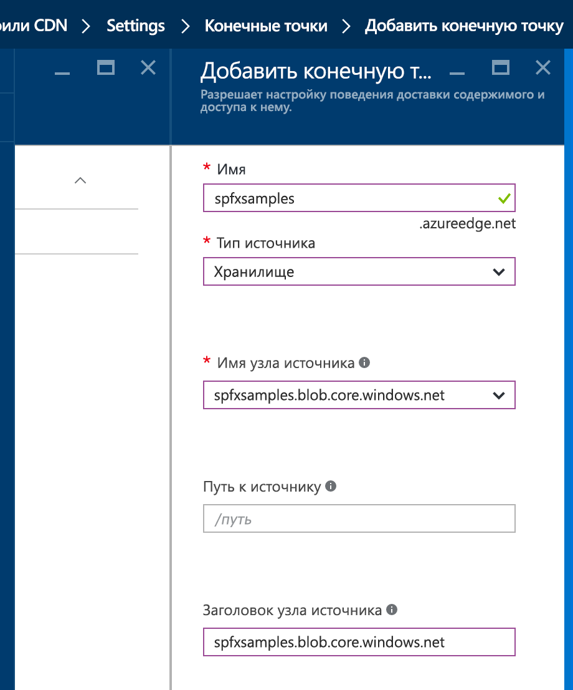

# <a name="deploy-your-sharepoint-client-side-web-part-to-azure-cdn"></a><span data-ttu-id="6ba8e-103">Развертывание клиентской веб-части SharePoint в CDN Azure</span><span class="sxs-lookup"><span data-stu-id="6ba8e-103">Deploy your SharePoint client-side web part to Azure CDN</span></span>

<span data-ttu-id="6ba8e-104">Узнайте, как создать образец веб-части и развернуть ее ресурсы в сети доставки содержимого (CDN) Azure, а не использовать заданную по умолчанию сеть CDN Office 365 в качестве решения для размещения.</span><span class="sxs-lookup"><span data-stu-id="6ba8e-104">Create a new sample web part and deploy its assets to an Azure Content Delivery Network (CDN) instead of using the default Office 365 CDN as the hosting solution.</span></span> <span data-ttu-id="6ba8e-105">Для развертывания ресурсов мы будем использовать учетную запись службы хранилища Azure, интегрированную с CDN.</span><span class="sxs-lookup"><span data-stu-id="6ba8e-105">You'll use an Azure Storage account integrated with a CDN to deploy your assets.</span></span> <span data-ttu-id="6ba8e-106">Инструменты сборки SharePoint Framework по умолчанию поддерживают развертывание в учетной записи службы хранилища Azure. Однако вы также можете вручную отправить файлы предпочитаемому поставщику CDN или в SharePoint.</span><span class="sxs-lookup"><span data-stu-id="6ba8e-106">SharePoint Framework build tools provide out-of-the-box support for deploying to an Azure Storage account; however, you can also manually upload the files to your favorite CDN provider or to SharePoint.</span></span>

> [!NOTE]
> <span data-ttu-id="6ba8e-107">Разместить ресурсы веб-части можно несколькими способами.</span><span class="sxs-lookup"><span data-stu-id="6ba8e-107">There are multiple different hosting options for your web part assets.</span></span> <span data-ttu-id="6ba8e-108">Этот учебник описывает CDN Azure, но можно также использовать [сеть доставки содержимого Office 365](./hosting-webpart-from-office-365-cdn.md) или просто разместить активы в библиотеке SharePoint со своего клиента.</span><span class="sxs-lookup"><span data-stu-id="6ba8e-108">This tutorial concentrates on showing the Azure CDN option, but you could also use the [Office 365 CDN](./hosting-webpart-from-office-365-cdn.md) or simply host your assets from SharePoint library from your tenant.</span></span> <span data-ttu-id="6ba8e-109">Последний вариант предоставляет такие же возможности, но уступает сетям CDN в производительности.</span><span class="sxs-lookup"><span data-stu-id="6ba8e-109">In the latter case, you would not benefit from the CDN performance improvements, but that would also work from the functionality perspective.</span></span> <span data-ttu-id="6ba8e-110">Ресурсы можно разместить в любом расположении, к которому пользователи могут получить доступ с помощью протокола HTTP.</span><span class="sxs-lookup"><span data-stu-id="6ba8e-110">Any location that end users can access by using HTTP would be technically suitable for hosting the assets for end users.</span></span>

## <a name="configure-an-azure-storage-account"></a><span data-ttu-id="6ba8e-111">Как настроить учетную запись службы хранилища Azure</span><span class="sxs-lookup"><span data-stu-id="6ba8e-111">Configure an Azure storage account</span></span>

<span data-ttu-id="6ba8e-112">Чтобы настроить учетную запись хранения Azure и интегрировать ее с CDN, следуйте инструкциям в статье [Интеграция учетной записи хранения Azure с Azure CDN](https://docs.microsoft.com/ru-RU/azure/cdn/cdn-create-a-storage-account-with-cdn), а также подробным инструкциям в этой статье.</span><span class="sxs-lookup"><span data-stu-id="6ba8e-112">To configure an Azure storage account and integrate it with the CDN, follow the instructions at [Integrate an Azure storage account with Azure CDN](https://docs.microsoft.com/ru-RU/azure/cdn/cdn-create-a-storage-account-with-cdn), along with the detailed steps in this article.</span></span> 

### <a name="storage-account-name"></a><span data-ttu-id="6ba8e-113">Имя учетной записи хранения</span><span class="sxs-lookup"><span data-stu-id="6ba8e-113">Storage account name</span></span>

<span data-ttu-id="6ba8e-114">Это имя, используемое для создания учетной записи хранения, как описано в разделе [Шаг 1. Создание учетной записи хранения](https://docs.microsoft.com/ru-RU/azure/cdn/cdn-create-a-storage-account-with-cdn#step-1-create-a-storage-account).</span><span class="sxs-lookup"><span data-stu-id="6ba8e-114">This is the name you used to create your storage account, as described in [Step 1: Create a storage account](https://docs.microsoft.com/ru-RU/azure/cdn/cdn-create-a-storage-account-with-cdn#step-1-create-a-storage-account).</span></span>

<span data-ttu-id="6ba8e-115">Например, на приведенном ниже снимке экрана **spfxsamples** — это имя учетной записи хранения.</span><span class="sxs-lookup"><span data-stu-id="6ba8e-115">For example, in the following screenshot, **spfxsamples** is the storage account name.</span></span>


<span data-ttu-id="6ba8e-117">При этом будет создана конечная точка **spfxsamples.blob.core.windows.net** для учетной записи хранения.</span><span class="sxs-lookup"><span data-stu-id="6ba8e-117">This creates a new storage account endpoint **spfxsamples.blob.core.windows.net**.</span></span> 

> [!NOTE]
> <span data-ttu-id="6ba8e-118">Вам необходимо указать уникальное имя учетной записи хранения для своих проектов SharePoint Framework.</span><span class="sxs-lookup"><span data-stu-id="6ba8e-118">You need to create a unique storage account name for your own SharePoint Framework projects.</span></span>

### <a name="blob-container-name"></a><span data-ttu-id="6ba8e-119">Имя контейнера больших двоичных объектов</span><span class="sxs-lookup"><span data-stu-id="6ba8e-119">BLOB container name</span></span>

<span data-ttu-id="6ba8e-120">Создайте контейнер службы BLOB-объектов.</span><span class="sxs-lookup"><span data-stu-id="6ba8e-120">Create a new Blob service container.</span></span> <span data-ttu-id="6ba8e-121">Для этого перейдите на панель мониторинга учетной записи хранения.</span><span class="sxs-lookup"><span data-stu-id="6ba8e-121">This is available in your storage account dashboard.</span></span>

<span data-ttu-id="6ba8e-122">Нажмите **+ Контейнер** и создайте контейнер со следующими параметрами:</span><span class="sxs-lookup"><span data-stu-id="6ba8e-122">Select the **+ Container** and create a new container with the following:</span></span>

* <span data-ttu-id="6ba8e-123">Имя: **azurehosted-webpart**</span><span class="sxs-lookup"><span data-stu-id="6ba8e-123">Name: **azurehosted-webpart**</span></span>
* <span data-ttu-id="6ba8e-124">Тип доступа: "Контейнер"</span><span class="sxs-lookup"><span data-stu-id="6ba8e-124">Access type: Container</span></span>


### <a name="storage-account-access-key"></a><span data-ttu-id="6ba8e-126">Ключ доступа к учетной записи хранения</span><span class="sxs-lookup"><span data-stu-id="6ba8e-126">Storage account access key</span></span>

<span data-ttu-id="6ba8e-127">На панели мониторинга учетной записи хранения нажмите **Ключ доступа** и скопируйте один из ключей доступа.</span><span class="sxs-lookup"><span data-stu-id="6ba8e-127">In the storage account dashboard, select **Access Key** in the dashboard, and copy one of the access keys.</span></span>


### <a name="cdn-profile-and-endpoint"></a><span data-ttu-id="6ba8e-129">Профиль и конечная точка CDN</span><span class="sxs-lookup"><span data-stu-id="6ba8e-129">CDN profile and endpoint</span></span>

<span data-ttu-id="6ba8e-130">Создайте профиль CDN и свяжите конечную точку CDN с этим контейнером BLOB-объектов.</span><span class="sxs-lookup"><span data-stu-id="6ba8e-130">Create a new CDN profile and associate the CDN endpoint with this BLOB container.</span></span>

1. <span data-ttu-id="6ba8e-131">Создайте профиль CDN, как описано в разделе [Шаг 2. Включение сети CDN для учетной записи хранения](https://docs.microsoft.com/ru-RU/azure/cdn/cdn-create-a-storage-account-with-cdn#step-2-enable-cdn-for-the-storage-account) (прокрутите шаг 2 вниз до раздела **Создание профиля CDN**).</span><span class="sxs-lookup"><span data-stu-id="6ba8e-131">Create a new CDN profile as described in [Step 2: Enable CDN for the storage account](https://docs.microsoft.com/ru-RU/azure/cdn/cdn-create-a-storage-account-with-cdn#step-2-enable-cdn-for-the-storage-account) (scroll down in Step 2 for **To create a new CDN profile**).</span></span>

  <span data-ttu-id="6ba8e-132">Например, на следующем снимке экрана **spfxwebparts** — это имя профиля CDN.</span><span class="sxs-lookup"><span data-stu-id="6ba8e-132">For example, in the following screenshot, **spfxwebparts** is the CDN profile name.</span></span>

  

2. <span data-ttu-id="6ba8e-134">Создайте конечную точку CDN, как описано в разделе [Шаг 2. Включение сети CDN для учетной записи хранения](https://docs.microsoft.com/ru-RU/azure/cdn/cdn-create-a-storage-account-with-cdn#step-2-enable-cdn-for-the-storage-account).</span><span class="sxs-lookup"><span data-stu-id="6ba8e-134">Create a CDN endpoint as described in [Step 2: Enable CDN for the storage account](https://docs.microsoft.com/ru-RU/azure/cdn/cdn-create-a-storage-account-with-cdn#step-2-enable-cdn-for-the-storage-account).</span></span> <span data-ttu-id="6ba8e-135">Будет создана конечная точка CDN со следующим URL-адресом: `http://spfxsamples.azureedge.net`</span><span class="sxs-lookup"><span data-stu-id="6ba8e-135">The CDN endpoint is created with the following URL: `http://spfxsamples.azureedge.net`</span></span>

  <span data-ttu-id="6ba8e-136">Например, на следующем снимке экрана **spfxsamples** — это имя конечной точки, **Storage** — это тип источника, а **spfxsamples.blob.core.windows.net** — это учетная запись хранения.</span><span class="sxs-lookup"><span data-stu-id="6ba8e-136">For example, in the following screenshot, **spfxsamples** is the endpoint name, **Storage** is the origin type, and **spfxsamples.blob.core.windows.net** is the storage account.</span></span>

  

<span data-ttu-id="6ba8e-137">Так как конечная точка CDN связана с учетной записью хранения, вы также можете получить доступ к контейнеру BLOB-объектов по следующему URL-адресу: `http://spfxsamples.azureedge.net/azurehosted-webpart/`</span><span class="sxs-lookup"><span data-stu-id="6ba8e-137">Because you associated the CDN endpoint with your storage account, you can also access the BLOB container at the following URL: `http://spfxsamples.azureedge.net/azurehosted-webpart/`</span></span>

<span data-ttu-id="6ba8e-138">Но обратите внимание, что вы еще не развернули файлы.</span><span class="sxs-lookup"><span data-stu-id="6ba8e-138">Note, however, that you have not yet deployed the files.</span></span>

## <a name="create-a-new-web-part-project"></a><span data-ttu-id="6ba8e-139">Создание проекта веб-части</span><span class="sxs-lookup"><span data-stu-id="6ba8e-139">Create a new web part project</span></span>

1. <span data-ttu-id="6ba8e-140">Создайте каталог проекта в удобном для вас расположении:</span><span class="sxs-lookup"><span data-stu-id="6ba8e-140">Create a new project directory in your preferred location:</span></span>

  ```
  md azurehosted-webpart
  ```

2. <span data-ttu-id="6ba8e-141">Перейдите к каталогу проекта:</span><span class="sxs-lookup"><span data-stu-id="6ba8e-141">Go to the project directory:</span></span>

  ```
  cd azurehosted-webpart
  ```

3. <span data-ttu-id="6ba8e-142">Создайте решение SharePoint Framework, запустив генератор Yeoman для SharePoint:</span><span class="sxs-lookup"><span data-stu-id="6ba8e-142">Create a new SharePoint Framework solution by running Yeoman SharePoint Generator:</span></span>

  ```
  yo @microsoft/sharepoint
  ```
    
4. <span data-ttu-id="6ba8e-143">Когда появится запрос, сделайте следующее:</span><span class="sxs-lookup"><span data-stu-id="6ba8e-143">When prompted:</span></span>

  * <span data-ttu-id="6ba8e-144">Оставьте имя по умолчанию (**azurehosted-webpart**) для решения и нажмите клавишу ВВОД.</span><span class="sxs-lookup"><span data-stu-id="6ba8e-144">Accept the default **azurehosted-webpart** as your solution name, and select Enter.</span></span>
  * <span data-ttu-id="6ba8e-145">Выберите **SharePoint Online only (latest)** (Только SharePoint Online, последняя версия) и нажмите клавишу ВВОД.</span><span class="sxs-lookup"><span data-stu-id="6ba8e-145">Select **SharePoint Online only (latest)**, and select Enter.</span></span>
  * <span data-ttu-id="6ba8e-146">Выберите вариант **Use the current folder** (Использовать текущую папку) для размещения файлов.</span><span class="sxs-lookup"><span data-stu-id="6ba8e-146">Select **Use the current folder** for where to place the files.</span></span>
  * <span data-ttu-id="6ba8e-147">Введите **y**, чтобы выполнить развертывание на уровне клиента. При этом веб-часть станет доступна на всех сайтах сразу после развертывания.</span><span class="sxs-lookup"><span data-stu-id="6ba8e-147">Select **y** to use the tenant-scoped deployment option, which makes the web part available across sites immediately when it's deployed.</span></span> 
  * <span data-ttu-id="6ba8e-148">Выберите **WebPart** в качестве типа создаваемого клиентского компонента.</span><span class="sxs-lookup"><span data-stu-id="6ba8e-148">Select **WebPart** as the client-side component type to be created.</span></span> 

5. <span data-ttu-id="6ba8e-149">Далее требуется указать информацию о веб-части:</span><span class="sxs-lookup"><span data-stu-id="6ba8e-149">The next set of prompts ask for specific information about your web part:</span></span>

  * <span data-ttu-id="6ba8e-150">Укажите **AzureCDN** в качестве имени веб-части и нажмите клавишу ВВОД.</span><span class="sxs-lookup"><span data-stu-id="6ba8e-150">Use **AzureCDN** for your web part name, and select Enter.</span></span>
  * <span data-ttu-id="6ba8e-151">Оставьте описание веб-части, заданное по умолчанию (**AzureCDN description**), и нажмите клавишу ВВОД.</span><span class="sxs-lookup"><span data-stu-id="6ba8e-151">Accept the default **AzureCDN description** as your web part description, and select Enter.</span></span>
  * <span data-ttu-id="6ba8e-152">Оставьте выбранным параметр **No JavaScript web framework** (Не использовать платформу веб-решений JavaScript) и нажмите клавишу ВВОД.</span><span class="sxs-lookup"><span data-stu-id="6ba8e-152">Accept the default **No javascript web framework** as the framework you would like to use, and select Enter.</span></span>

  

  <span data-ttu-id="6ba8e-154">После этого Yeoman формирует шаблоны файлов решения и устанавливает необходимые зависимости.</span><span class="sxs-lookup"><span data-stu-id="6ba8e-154">At this point, Yeoman scaffolds the solution files and installs the required dependencies.</span></span> <span data-ttu-id="6ba8e-155">Это может занять несколько минут.</span><span class="sxs-lookup"><span data-stu-id="6ba8e-155">This might take a few minutes.</span></span> <span data-ttu-id="6ba8e-156">При этом Yeoman также включает в проект вашу веб-часть.</span><span class="sxs-lookup"><span data-stu-id="6ba8e-156">Yeoman scaffolds the project to include your custom web part as well.</span></span>

6. <span data-ttu-id="6ba8e-157">По завершении формирования шаблона заблокируйте версию зависимостей проекта, выполнив следующую команду:</span><span class="sxs-lookup"><span data-stu-id="6ba8e-157">After the scaffolding completes, lock down the version of the project dependencies by running the following command:</span></span>

  ```sh
  npm shrinkwrap
  ```

7. <span data-ttu-id="6ba8e-158">Введите следующую команду, чтобы открыть проект веб-части в Visual Studio Code:</span><span class="sxs-lookup"><span data-stu-id="6ba8e-158">Enter the following to open the web part project in Visual Studio Code:</span></span>

  ```
  code .
  ```

## <a name="configure-the-solution-not-to-use-default-settings"></a><span data-ttu-id="6ba8e-159">Изменение параметров решения, заданных по умолчанию</span><span class="sxs-lookup"><span data-stu-id="6ba8e-159">Configure the solution not to use default settings</span></span>

1. <span data-ttu-id="6ba8e-160">Откройте файл **package-solution.json** в папке **config**.</span><span class="sxs-lookup"><span data-stu-id="6ba8e-160">Open **package-solution.json** in the **config** folder.</span></span>

  <span data-ttu-id="6ba8e-161">Он используется для управления упаковкой решения.</span><span class="sxs-lookup"><span data-stu-id="6ba8e-161">This is where we control the solution packaging.</span></span>

2. <span data-ttu-id="6ba8e-162">Замените значение параметра `includeClientSideAssets` на **false**, чтобы клиентские ресурсы НЕ упаковывались в SPPKG-файл (это действие выполняется по умолчанию).</span><span class="sxs-lookup"><span data-stu-id="6ba8e-162">Update `includeClientSideAssets` value as **false** so that client-side assets are NOT packaged inside of the sppkg file, which is the default behavior.</span></span> <span data-ttu-id="6ba8e-163">Так как мы размещаем ресурсы из внешней сети доставки содержимого, нам не нужно включать их в пакет решения.</span><span class="sxs-lookup"><span data-stu-id="6ba8e-163">Because we are hosting assets from an external CDN, we do not want them to be included in the solution package.</span></span> <span data-ttu-id="6ba8e-164">Конфигурация должна выглядеть примерно так, как показано ниже.</span><span class="sxs-lookup"><span data-stu-id="6ba8e-164">Your configuration should look somewhat like the following.</span></span>

  ``` json
  {
    "$schema": "https://dev.office.com/json-schemas/spfx-build/package-solution.schema.json",
    "solution": {
      "name": "azurehosted-webpart-client-side-solution",
      "id": "a4e95ed1-d096-4573-8a57-d0cc3b52da6a",
      "version": "1.0.0.0",
      "includeClientSideAssets": false,
      "skipFeatureDeployment": true
    },
    "paths": {
      "zippedPackage": "solution/azurehosted-webpart.sppkg"
    }
  }
  ```

  > [!NOTE]
  > <span data-ttu-id="6ba8e-165">Для параметра `skipFeatureDeployment` задано значение **true**, так как мы согласились на предложение генератора Yeoman выполнить развертывание на уровне клиента.</span><span class="sxs-lookup"><span data-stu-id="6ba8e-165">The `skipFeatureDeployment` setting is here **true** because the answer for the tenant-scope deployment option was said to be 'y' in the Yeoman flow.</span></span> <span data-ttu-id="6ba8e-166">Это означает, что вам НЕ требуется явно устанавливать решение на сайте, чтобы веб-часть стала доступна.</span><span class="sxs-lookup"><span data-stu-id="6ba8e-166">This means that you do NOT need to explicitly install the solution to the site before the web part is available.</span></span> <span data-ttu-id="6ba8e-167">Чтобы веб-часть была доступна на всех сайтах в определенном клиенте, достаточно развернуть и утвердить пакет решения в каталоге приложений клиента.</span><span class="sxs-lookup"><span data-stu-id="6ba8e-167">Deploying and approving the solution package in the tenant App Catalog is sufficient to make the web part available across all the sites in the given tenant.</span></span>


## <a name="configure-azure-storage-account-details"></a><span data-ttu-id="6ba8e-168">Настройка сведений об учетной записи хранения Azure</span><span class="sxs-lookup"><span data-stu-id="6ba8e-168">Configure Azure Storage account details</span></span>

1. <span data-ttu-id="6ba8e-169">Откройте файл **deploy-azure-storage.json** в папке **config**.</span><span class="sxs-lookup"><span data-stu-id="6ba8e-169">Open **deploy-azure-storage.json** in the **config** folder.</span></span>

  <span data-ttu-id="6ba8e-170">Этот файл содержит сведения об учетной записи хранения Azure.</span><span class="sxs-lookup"><span data-stu-id="6ba8e-170">This is the file that contains your Azure Storage account details.</span></span>

  ```json
  {
    "$schema": "https://dev.office.com/json-schemas/spfx-build/deploy-azure-storage.schema.json",
    "workingDir": "./temp/deploy/",
    "account": "<!-- STORAGE ACCOUNT NAME -->",
    "container": "azurehosted-webpart",
    "accessKey": "<!-- ACCESS KEY -->"
  }
  ```

2. <span data-ttu-id="6ba8e-171">Замените значения **account**, **container** и **accessKey** на имя учетной записи хранения, имя контейнера BLOB-объектов и ключ доступа к учетной записи хранения соответственно.</span><span class="sxs-lookup"><span data-stu-id="6ba8e-171">Replace the **account**, **container**, **accessKey** with your storage account name, BLOB container, and storage account access key respectively.</span></span>

  <span data-ttu-id="6ba8e-172">**workingDir** — это каталог, в котором находятся ресурсы веб-части.</span><span class="sxs-lookup"><span data-stu-id="6ba8e-172">**workingDir** is the directory where the web part assets are located.</span></span>

  <span data-ttu-id="6ba8e-173">В нашем примере для созданной ранее учетной записи хранения этот файл будет выглядеть так:</span><span class="sxs-lookup"><span data-stu-id="6ba8e-173">In this example, with the storage account created earlier, this file will look like:</span></span>

  ```json
  {
    "workingDir": "./temp/deploy/",
    "account": "spfxsamples",
    "container": "azurehosted-webpart",
    "accessKey": "q1UsGWocj+CnlLuv9ZpriOCj46ikgBbDBCaQ0FfE8+qKVbDTVSbRGj41avlG73rynbvKizZpIKK9XpnpA=="
  }
  ```

3. <span data-ttu-id="6ba8e-174">Сохраните файл.</span><span class="sxs-lookup"><span data-stu-id="6ba8e-174">Save the file.</span></span>

## <a name="configure-the-web-part-to-load-from-cdn"></a><span data-ttu-id="6ba8e-175">Настройка веб-части для загрузки из сети CDN</span><span class="sxs-lookup"><span data-stu-id="6ba8e-175">Configure the web part to load from CDN</span></span>

<span data-ttu-id="6ba8e-176">Чтобы веб-часть загружалась из сети CDN, необходимо сообщить ей путь к этой сети.</span><span class="sxs-lookup"><span data-stu-id="6ba8e-176">For the web part to load from your CDN, you need to tell it your CDN path.</span></span>

1. <span data-ttu-id="6ba8e-177">Переключитесь на Visual Studio Code и откройте файл **write-manifests.json** в папке **config**.</span><span class="sxs-lookup"><span data-stu-id="6ba8e-177">Switch to Visual Studio Code and open the **write-manifests.json** from the **config** folder.</span></span>

2. <span data-ttu-id="6ba8e-178">Введите базовый путь к сети CDN в свойстве **cdnBasePath**.</span><span class="sxs-lookup"><span data-stu-id="6ba8e-178">Enter your CDN base path for the **cdnBasePath** property.</span></span>

  ```json
  {
    "cdnBasePath": "<!-- PATH TO CDN -->"
  }
  ```

  <span data-ttu-id="6ba8e-179">В нашем примере для созданного ранее профиля CDN этот файл будет выглядеть следующим образом:</span><span class="sxs-lookup"><span data-stu-id="6ba8e-179">In this example, with the CDN profile created earlier, this file will look like:</span></span>

  ```json
  {
    "cdnBasePath": "https://spfxsamples.azureedge.net/azurehosted-webpart/"
  }
  ```

  > [!NOTE]
  > <span data-ttu-id="6ba8e-180">Базовый путь к сети CDN — это конечная точка CDN с контейнером BLOB-объектов.</span><span class="sxs-lookup"><span data-stu-id="6ba8e-180">The CDN base path is the CDN endpoint with the BLOB container.</span></span>

3. <span data-ttu-id="6ba8e-181">Сохраните файл.</span><span class="sxs-lookup"><span data-stu-id="6ba8e-181">Save the file.</span></span>


## <a name="prepare-the-web-part-assets-to-deploy"></a><span data-ttu-id="6ba8e-182">Подготовка ресурсов веб-части к развертыванию</span><span class="sxs-lookup"><span data-stu-id="6ba8e-182">Prepare the web part assets to deploy</span></span>

<span data-ttu-id="6ba8e-183">Прежде чем отправлять ресурсы в сеть CDN, их необходимо собрать.</span><span class="sxs-lookup"><span data-stu-id="6ba8e-183">Before uploading the assets to CDN, you need to build them.</span></span>

1. <span data-ttu-id="6ba8e-184">Откройте консоль и выполните следующую задачу `gulp`:</span><span class="sxs-lookup"><span data-stu-id="6ba8e-184">Switch to the console and execute the following `gulp` task:</span></span>

  ```
  gulp bundle --ship
  ```

  <span data-ttu-id="6ba8e-185">При этом будут созданы сжатые ресурсы, необходимые для отправки поставщику CDN.</span><span class="sxs-lookup"><span data-stu-id="6ba8e-185">This builds the minified assets required to upload to the CDN provider.</span></span> <span data-ttu-id="6ba8e-186">Параметр `--ship` указывает средству сборки, что выполняется сборка для распространения.</span><span class="sxs-lookup"><span data-stu-id="6ba8e-186">The `--ship` indicates the build tool to build for distribution.</span></span> <span data-ttu-id="6ba8e-187">Вы также можете заметить, что в выходных данных инструментов сборки указан целевой объект сборки SHIP.</span><span class="sxs-lookup"><span data-stu-id="6ba8e-187">You should also notice that the output of the build tools indicate the Build Target is SHIP.</span></span>

  ```
  Build target: SHIP
  [21:23:01] Using gulpfile ~/apps/azurehosted-webpart/gulpfile.js
  [21:23:01] Starting gulp
  [21:23:01] Starting 'default'...
  ```

  <span data-ttu-id="6ba8e-188">Сжатые ресурсы хранятся в каталоге `temp\deploy`.</span><span class="sxs-lookup"><span data-stu-id="6ba8e-188">The minified assets can be found under the `temp\deploy` directory.</span></span>

## <a name="deploy-assets-to-azure-storage"></a><span data-ttu-id="6ba8e-189">Развертывание ресурсов в службе хранилища Azure</span><span class="sxs-lookup"><span data-stu-id="6ba8e-189">Deploy assets to Azure Storage</span></span>

1. <span data-ttu-id="6ba8e-190">Переключитесь на консоль для каталога проекта **azurehosted-webpart**.</span><span class="sxs-lookup"><span data-stu-id="6ba8e-190">Switch to the console of the **azurehosted-webpart** project directory.</span></span>

2. <span data-ttu-id="6ba8e-191">Введите задачу gulp для развертывания ресурсов в учетной записи хранения:</span><span class="sxs-lookup"><span data-stu-id="6ba8e-191">Enter the gulp task to deploy the assets to your storage account:</span></span>

  ```
  gulp deploy-azure-storage
  ```

  <span data-ttu-id="6ba8e-192">При этом пакет веб-части и другие ресурсы, например файлы JavaScript и CSS, будут развернуты в сети CDN.</span><span class="sxs-lookup"><span data-stu-id="6ba8e-192">This deploys the web part bundle along with other assets such as JavaScript and CSS files to the CDN.</span></span>

## <a name="deploy-the-updated-package"></a><span data-ttu-id="6ba8e-193">Развертывание обновленного пакета</span><span class="sxs-lookup"><span data-stu-id="6ba8e-193">Deploy the updated package</span></span>

### <a name="to-package-the-solution"></a><span data-ttu-id="6ba8e-194">Упаковка решения</span><span class="sxs-lookup"><span data-stu-id="6ba8e-194">To package the solution</span></span>

<span data-ttu-id="6ba8e-195">Так как пакет веб-части изменен, его необходимо заново развернуть в каталоге приложений.</span><span class="sxs-lookup"><span data-stu-id="6ba8e-195">Because you changed the web part bundle, you need to redeploy the package to the App Catalog.</span></span> <span data-ttu-id="6ba8e-196">Мы использовали параметр **--ship**, чтобы создать минифицированные ресурсы для распространения.</span><span class="sxs-lookup"><span data-stu-id="6ba8e-196">You used **--ship** to generate minified assets for distribution.</span></span>

1. <span data-ttu-id="6ba8e-197">Переключитесь на консоль для каталога проекта **azurehosted-webpart**.</span><span class="sxs-lookup"><span data-stu-id="6ba8e-197">Switch to the console of the **azurehosted-webpart** project directory.</span></span>

2. <span data-ttu-id="6ba8e-198">Выполните задачу gulp, чтобы упаковать клиентское решение (на этот раз с флагом `--ship`).</span><span class="sxs-lookup"><span data-stu-id="6ba8e-198">Enter the gulp task to package the client-side solution, this time with the `--ship` flag set.</span></span> <span data-ttu-id="6ba8e-199">При этом задача использует базовый путь к сети CDN, настроенный на предыдущем шаге:</span><span class="sxs-lookup"><span data-stu-id="6ba8e-199">This forces the task to pick up the CDN base path configured in the previous step:</span></span>

  ```
  gulp package-solution --ship
  ```

  <span data-ttu-id="6ba8e-200">При этом в папке **sharepoint\solution** будет создан обновленный пакет клиентского решения.</span><span class="sxs-lookup"><span data-stu-id="6ba8e-200">This creates the updated client-side solution package in the **sharepoint\solution** folder.</span></span>

### <a name="to-upload-to-your-app-catalog"></a><span data-ttu-id="6ba8e-201">Отправка в каталог приложений</span><span class="sxs-lookup"><span data-stu-id="6ba8e-201">To upload to your App Catalog</span></span>

1. <span data-ttu-id="6ba8e-202">Отправьте или перетащите пакет клиентского решения в каталог приложений.</span><span class="sxs-lookup"><span data-stu-id="6ba8e-202">Upload or drag and drop the client-side solution package to the App Catalog.</span></span> <span data-ttu-id="6ba8e-203">Обратите внимание на то, что указан URL-адрес CDN Azure, заданный на предыдущих шагах.</span><span class="sxs-lookup"><span data-stu-id="6ba8e-203">Notice how the URL is pointing to the Azure CDN URL configured in the previous steps.</span></span> 

2. <span data-ttu-id="6ba8e-204">Установите флажок, чтобы это решение можно было автоматически развертывать на всех сайтах в организации.</span><span class="sxs-lookup"><span data-stu-id="6ba8e-204">Select the check box to indicate that the solution can be deployed automatically across all sites in the organization.</span></span>

  

3. <span data-ttu-id="6ba8e-206">Нажмите кнопку **Развернуть**.</span><span class="sxs-lookup"><span data-stu-id="6ba8e-206">Select **Deploy**.</span></span>

  <span data-ttu-id="6ba8e-207">Теперь в каталоге приложений есть пакет клиентского решения, в который загружен пакет веб-части из сети CDN.</span><span class="sxs-lookup"><span data-stu-id="6ba8e-207">The App Catalog now has the client-side solution package where the web part bundle is loaded from the CDN.</span></span>

## <a name="test-the-helloworld-web-part"></a><span data-ttu-id="6ba8e-208">Тестирование веб-части HelloWorld</span><span class="sxs-lookup"><span data-stu-id="6ba8e-208">Test the HelloWorld web part</span></span>

1. <span data-ttu-id="6ba8e-209">Перейдите на любой сайт SharePoint в клиенте и выберите **Добавить страницу** в меню со значком *шестеренки*.</span><span class="sxs-lookup"><span data-stu-id="6ba8e-209">Go to any SharePoint site in your tenant and select **Add a page** from the *gears* menu.</span></span>

2. <span data-ttu-id="6ba8e-210">**Отредактируйте** страницу и выберите веб-часть **AzureCDN** в средстве выбора веб-части, чтобы убедиться, что развертывание успешно выполнено.</span><span class="sxs-lookup"><span data-stu-id="6ba8e-210">**Edit** the page and select **AzureCDN** web part from the web part picker to confirm that your deployment has been successful.</span></span>

  

3. <span data-ttu-id="6ba8e-212">Обратите внимание на то, что команда **gulp serve** не выполняется, поэтому никакие ресурсы не предоставляются из **localhost**.</span><span class="sxs-lookup"><span data-stu-id="6ba8e-212">Notice that you are not running **gulp serve**, and therefore nothing is served from **localhost**.</span></span> <span data-ttu-id="6ba8e-213">Контент предоставляется из CDN Azure.</span><span class="sxs-lookup"><span data-stu-id="6ba8e-213">Content is served from the Azure CDN.</span></span> <span data-ttu-id="6ba8e-214">Вы также можете нажать клавишу F12 в браузере и убедиться, что CDN Azure отображается как один из источников ресурсов страницы.</span><span class="sxs-lookup"><span data-stu-id="6ba8e-214">You can also double-check this by selecting F12 in your browser and confirming that you can see the Azure CDN as one of the sources for the page assets.</span></span>

  

## <a name="deploy-to-other-cdns"></a><span data-ttu-id="6ba8e-216">Развертывание в других сетях CDN</span><span class="sxs-lookup"><span data-stu-id="6ba8e-216">Deploy to other CDNs</span></span>

<span data-ttu-id="6ba8e-217">Чтобы развернуть ресурсы у предпочитаемого поставщика CDN, вы можете скопировать файлы из папки **temp\deploy**.</span><span class="sxs-lookup"><span data-stu-id="6ba8e-217">To deploy the assets to your favorite CDN provider, you can copy the files from **temp\deploy** folder.</span></span> <span data-ttu-id="6ba8e-218">Чтобы создать ресурсы для распространения, выполните команду gulp так же, как и ранее, указав параметр **--ship**:</span><span class="sxs-lookup"><span data-stu-id="6ba8e-218">To generate assets for distribution, run the following gulp command as we did before with the **--ship** parameter:</span></span>

```
gulp bundle --ship
```

<span data-ttu-id="6ba8e-219">Если обновлять **cdnBasePath** соответствующим образом, файлы будут загружаться правильно.</span><span class="sxs-lookup"><span data-stu-id="6ba8e-219">As long as you are updating the **cdnBasePath** accordingly, your files are being properly loaded.</span></span>

> [!NOTE]
> <span data-ttu-id="6ba8e-220">Если вы обнаружили ошибку в документации или SharePoint Framework, сообщите о ней разработчикам SharePoint, указав в [списке проблем для репозитория sp-dev-docs](https://github.com/SharePoint/sp-dev-docs/issues).</span><span class="sxs-lookup"><span data-stu-id="6ba8e-220">If you find an issue in the documentation or in the SharePoint Framework, report that to SharePoint engineering by using the [issue list at the sp-dev-docs repository](https://github.com/SharePoint/sp-dev-docs/issues).</span></span> <span data-ttu-id="6ba8e-221">Заранее спасибо!</span><span class="sxs-lookup"><span data-stu-id="6ba8e-221">Thanks for your input in advance.</span></span>

## <a name="see-also"></a><span data-ttu-id="6ba8e-222">См. также</span><span class="sxs-lookup"><span data-stu-id="6ba8e-222">See also</span></span>

- [<span data-ttu-id="6ba8e-223">Создание первой клиентской веб-части SharePoint</span><span class="sxs-lookup"><span data-stu-id="6ba8e-223">Build your first SharePoint client-side web part</span></span>](build-a-hello-world-web-part.md)