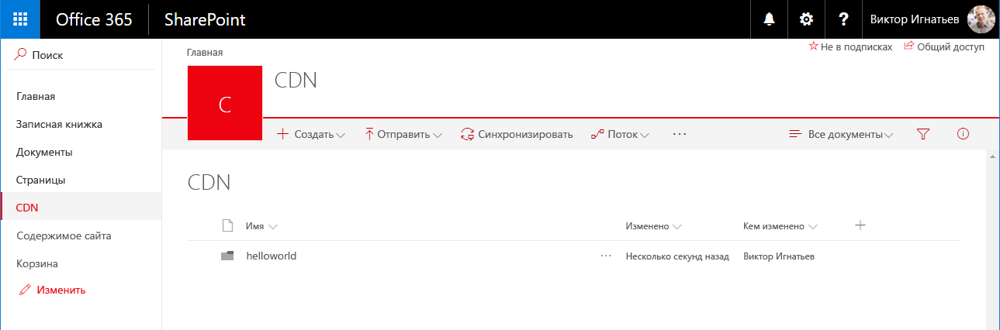
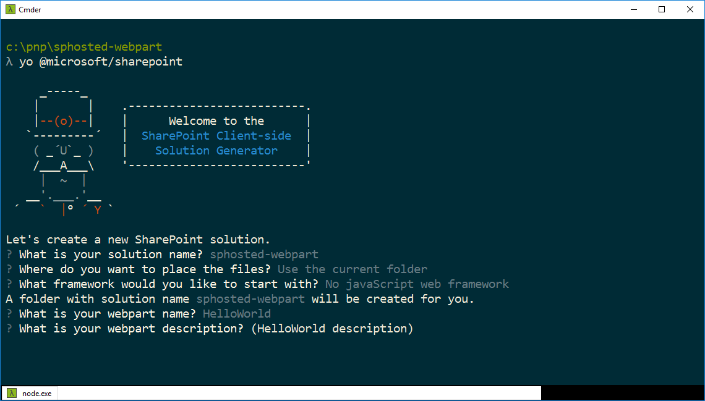
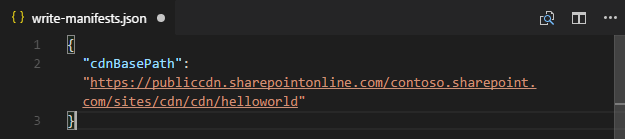

# <a name="hosting-client-side-web-part-from-office-365-cdn"></a>Размещение клиентской веб-части в сети доставки содержимого Office 365

В этой статье описано, как разместить клиентскую веб-часть в сети доставки содержимого Office 365. Сеть доставки содержимого Office 365 позволяет разместить ресурсы прямо в клиенте Office 365. В нем можно разместить любые статические ресурсы, используемые в SharePoint Online. Дополнительные сведения о CDN Office 365 вы найдете в указанной ниже записи блога.

* [Общедоступность сети доставки содержимого Office 365](https://dev.office.com/blogs/general-availability-of-office-365-cdn)

## <a name="enable-cdn-in-your-office-365-tenant"></a>Включение сети доставки содержимого в клиенте Office 365
Скачайте последнюю версию командной консоли SharePoint Online на [сайте загрузки Майкрософт](https://www.microsoft.com/en-us/download/details.aspx?id=35588).

Подключитесь к клиенту SharePoint Online с помощью PowerShell.
```
Connect-SPOService -Url https://contoso-admin.sharepoint.com
```

Чтобы узнать текущее состояние настроек общедоступной CDN для клиента, поочередно выполните указанные ниже команды. 
```
Get-SPOTenantCdnEnabled -CdnType Public
Get-SPOTenantCdnOrigins -CdnType Public
Get-SPOTenantCdnPolicies -CdnType Public
```
Включите общедоступную сеть доставки содержимого в клиенте.
```
Set-SPOTenantCdnEnabled -CdnType Public
```
Теперь в клиенте включена общедоступная CDN с использованием разрешенной конфигурации типов файлов по умолчанию. Это означает, что поддерживаются следующие типы файлов: CSS, EOT, GIF, ICO, JPEG, JPG, JS, MAP, PNG, SVG, TTF, WOFF.

Откройте браузер и перейдите к семейству веб-сайтов, в котором вы хотите разместить свою библиотеку CDN. Это может быть любое семейство веб-сайтов в клиенте. Это руководство описывает создание библиотеки CDN, но вы также можете использовать отдельную папку в любой существующей библиотеке документов как конечную точку CDN.

В семействе веб-сайтов создайте библиотеку документов **CDN** и добавьте в нее папку **helloworld**.

 

Вернитесь к консоли PowerShell и добавьте новый источник CDN. Обновите указанный ниже URL-адрес в соответствии с собственной средой. 
```
Add-SPOTenantCdnOrigin -CdnType Public -OriginUrl sites/cdn/cdn
```
Выполните указанную ниже команду, чтобы получить список источников CDN клиента.
```
Get-SPOTenantCdnOrigins -CdnType Public
```
Обратите внимание, что новый источник указан как допустимый источник CDN. Настройка источника займет некоторое время (приблизительно 15 минут), поэтому мы пока можем создать тестовую веб-часть, которая будет размещена в источнике, когда развертывание будет завершено. 


> Если рядом с названием источника нет уведомления о *настройке в состоянии ожидания*, он готов к использованию в клиенте. Это указывает на выполняющуюся настройку SharePoint Online и системы CDN. 

## <a name="creating-a-new-web-part-project"></a>Создание проекта веб-части

Создайте каталог проекта в удобном для вас расположении:

```
md sphosted-webpart
```
    
Перейдите к каталогу проекта:

```
cd sphosted-webpart
```

Создайте решение SharePoint Framework, запустив генератор Yeoman для SharePoint:

```
yo @microsoft/sharepoint
```
    
Когда появится запрос:

* Оставьте имя по умолчанию (**sphosted-webpart**) для своего решения и нажмите клавишу **ВВОД**.
* Выберите вариант **Use the current folder** (Использовать текущую папку) для размещения файлов.
* Выберите **No JavaScript web Framework** (веб-платформа без JavaScript) и нажмите клавишу **ВВОД**.
* Укажите **HelloWord** в качестве имени веб-части и нажмите клавишу **ВВОД**.
* Оставьте **описание HelloWorld** по умолчанию и нажмите клавишу **ВВОД**.



После этого Yeoman выполнит скаффолдинг файлов решения и установит требуемые зависимости. Это может занять несколько минут. При этом Yeoman также включит в проект вашу веб-часть.
    
Когда процесс скаффолдинга завершится, введите в консоли приведенный ниже код, чтобы открыть проект веб-части в редакторе Visual Studio Code.

```
code .
```
Обновите файл *write-manifestests.json* в папке *config* указанным ниже способом, чтобы указать на конечную точку CDN. 
- Укажите префикс publiccdn.sharepointonline.com и добавьте к URL-адресу путь в клиенте.
* Формат URL-адреса для сети доставки содержимого:
```
https://publiccdn.sharepointonline.com/<tenant host name>/sites/site/library/folder
```



Сохраните изменения.

Выполните приведенные ниже задачи для упаковки решения.
* При этом будет выполнена сборка конечной версии проекта с использованием URL-адреса CDN, указанного в файле **writer-manifest.json**. Результат будет помещен в папку **./temp/deploy**. Эти файлы вам нужно будет добавить в папку SharePoint, представляющую собой конечную точку CDN. 

```
gulp bundle --ship
```

Выполните указанную ниже задачу, чтобы упаковать свое решение.

```
gulp package-solution --ship
```

Эта команда создаст пакет **sphosted-webpart.sppkg** в папке **sharepoint/solution**, а также подготовит ресурсы в папке **temp/deploy** к развертыванию в CDN.

Добавьте или перетащите новый пакет клиентского решения в каталог приложений в клиенте. 


Выберите элемент **Развернуть**.

Перейдите к семейству веб-сайтов, в котором вы создали библиотеку **CDN** согласно вышеприведенным инструкциям этого руководства.

Отправьте все файлы из папки **temp/deploy** в папку **CDN/helloworld** семейства веб-сайтов. 


Веб-часть готова к использованию на странице.

Откройте сайт, на котором вы хотите протестировать веб-часть, и перейдите к его странице **Содержимое сайта**.

Выберите элементы **"Создать" и "Приложение"** на панели инструментов, затем выберите приложение **sphosted-webpart-client-side-solution** для установки на сайте.


Когда решение будет установлено, в меню *шестеренки* выберите пункт **Добавление страницы**, затем в окне выбора веб-частей для современной страницы укажите **HelloWorld**.


Обратите внимание: веб-часть отображается, несмотря на то что служба node.js не запущена локально. 


Сохраните изменения на странице с веб-частью.

Нажмите клавишу **F12**, чтобы открыть инструменты разработчика.

Разверните узел **publiccdn.sharepointonline.com** на вкладке "Sources" (Источники) и обратите внимание на то, что файл **hello-world.bundle** загружен из конечной точки CDN, определение которой описано ранее в этом руководстве.


Поздравляем! Вы развернули свою веб-часть в SharePoint Online, разместив ее в сети доставки содержимого Office 365. 

## <a name="additional-resources"></a>Дополнительные ресурсы

- [Общедоступность сети доставки содержимого Office 365](https://dev.office.com/blogs/general-availability-of-office-365-cdn)
- [Как автоматизировать публикацию скриптов SharePoint Framework в общедоступной сети доставки содержимого Office 365](https://www.eliostruyf.com/automate-publishing-of-your-sharepoint-framework-scripts-to-office-365-public-cdn)