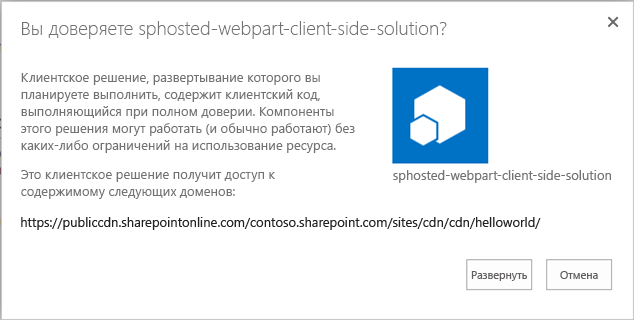
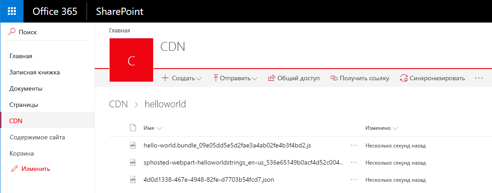
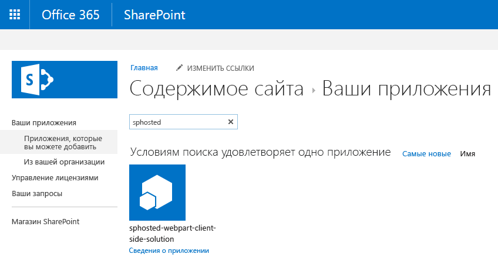
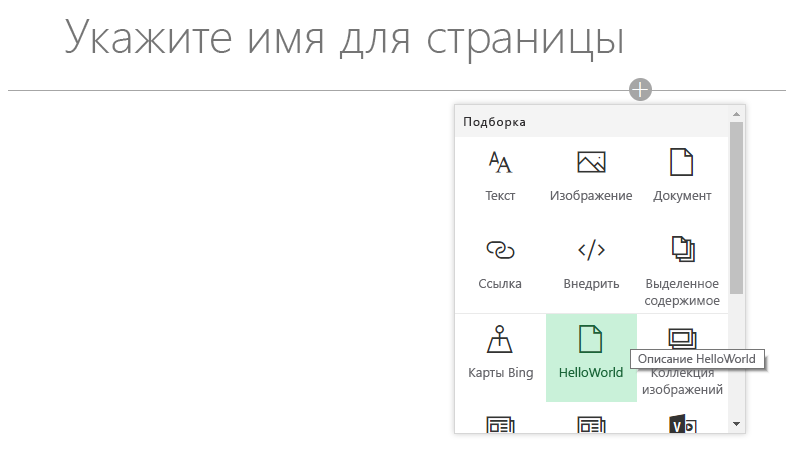
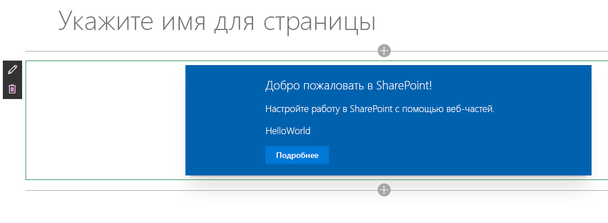
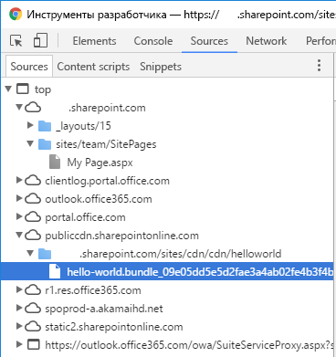

<span data-ttu-id="04783-p108">При этом будет выполнена сборка конечной версии проекта с использованием URL-адреса CDN, указанного в файле **writer-manifest.json**. Результат будет помещен в папку **./temp/deploy**. Эти файлы вам нужно будет добавить в папку SharePoint, представляющую собой конечную точку CDN.</span><span class="sxs-lookup"><span data-stu-id="04783-p108">This will execute a release build of your project using CDN URL specified in the **writer-manifest.json** file. Output of the execution will be located in the **./temp/deploy** folder. These are the files which you will need to upload to the SharePoint folder acting as your CDN endpoint.</span></span>
* При этом будет выполнена сборка конечной версии проекта с использованием URL-адреса CDN, указанного в файле **writer-manifest.json**. Результат будет помещен в папку **./temp/deploy**. Эти файлы вам нужно будет добавить в папку SharePoint, представляющую собой конечную точку CDN. 

```
gulp bundle --ship
```

<span data-ttu-id="04783-151">Выполните указанную ниже задачу, чтобы упаковать свое решение.</span><span class="sxs-lookup"><span data-stu-id="04783-151">Execute the following task to package your solution</span></span>

```
gulp package-solution --ship
```

<span data-ttu-id="04783-152">Эта команда создаст пакет **sphosted-webpart.sppkg** в папке **sharepoint/solution**, а также подготовит ресурсы в папке **temp/deploy** к развертыванию в CDN.</span><span class="sxs-lookup"><span data-stu-id="04783-152">This command will create a **sphosted-webpart.sppkg** package on the **sharepoint/solution** folder and also prepare the assets on the **temp/deploy folder** to be deployed to the CDN.</span></span>

<span data-ttu-id="04783-153">Добавьте или перетащите новый пакет клиентского решения в каталог приложений в клиенте.</span><span class="sxs-lookup"><span data-stu-id="04783-153">Upload or drag & drop the newly created client-side solution package to the app catalog in your tenant.</span></span> 



<span data-ttu-id="04783-155">Выберите элемент **Развернуть**.</span><span class="sxs-lookup"><span data-stu-id="04783-155">Choose **Deploy**</span></span>

<span data-ttu-id="04783-156">Перейдите к семейству веб-сайтов, в котором вы создали библиотеку **CDN** согласно вышеприведенным инструкциям этого руководства.</span><span class="sxs-lookup"><span data-stu-id="04783-156">Move to the site collection where the **CDN** library was created earlier in this tutorial.</span></span>

<span data-ttu-id="04783-157">Отправьте все файлы из папки **temp/deploy** в папку **CDN/helloworld** семейства веб-сайтов.</span><span class="sxs-lookup"><span data-stu-id="04783-157">Upload all files from **temp/deploy** folder to the **CDN/helloworld** folder in your site collection.</span></span> 



<span data-ttu-id="04783-159">Веб-часть готова к использованию на странице.</span><span class="sxs-lookup"><span data-stu-id="04783-159">At this point the web part is ready to be used on a page</span></span>

<span data-ttu-id="04783-160">Откройте сайт, на котором вы хотите протестировать веб-часть, и перейдите к его странице **Содержимое сайта**.</span><span class="sxs-lookup"><span data-stu-id="04783-160">Open a site where you want to test the web part and go the **Site contents** page of the site.</span></span>

<span data-ttu-id="04783-161">Выберите элементы **"Создать" и "Приложение"** на панели инструментов, затем выберите приложение **sphosted-webpart-client-side-solution** для установки на сайте.</span><span class="sxs-lookup"><span data-stu-id="04783-161">Choose **Add – App** from the toolbar and choose the **sphosted-webpart-client-side-solution** app to be installed on the site</span></span>



<span data-ttu-id="04783-163">Когда решение будет установлено, в меню *шестеренки* выберите пункт **Добавление страницы**, затем в окне выбора веб-частей для современной страницы укажите **HelloWorld**.</span><span class="sxs-lookup"><span data-stu-id="04783-163">After the solution has been installed, chose **Add a page** from the *gear* menu and pick **HelloWorld** from the modern page web part picker</span></span>



<span data-ttu-id="04783-165">Обратите внимание: веб-часть отображается, несмотря на то что служба node.js не запущена локально.</span><span class="sxs-lookup"><span data-stu-id="04783-165">Notice how the web part is rendered even though you are not running the node.js service locally.</span></span> 



<span data-ttu-id="04783-167">Сохраните изменения на странице с веб-частью.</span><span class="sxs-lookup"><span data-stu-id="04783-167">Save changes on the page with web part on it.</span></span>

<span data-ttu-id="04783-168">Нажмите клавишу **F12**, чтобы открыть инструменты разработчика.</span><span class="sxs-lookup"><span data-stu-id="04783-168">Press **F12** to open up developer tools.</span></span>

<span data-ttu-id="04783-169">Разверните узел **publiccdn.sharepointonline.com** на вкладке "Sources" (Источники) и обратите внимание на то, что файл **hello-world.bundle** загружен из конечной точки CDN, определение которой описано ранее в этом руководстве.</span><span class="sxs-lookup"><span data-stu-id="04783-169">Extend **publiccdn.sharepointonline.com** under the source and notice how the **hello-world.bundle** file is loaded from the CDN endpoint which we defined earlier in this tutorial.</span></span>



<span data-ttu-id="04783-171">Поздравляем! Вы развернули свою веб-часть в SharePoint Online, разместив ее в сети доставки содержимого Office 365.</span><span class="sxs-lookup"><span data-stu-id="04783-171">Now you have deployed your custom web part to SharePoint Online and it's being hosted from the Office 365 CDN.</span></span> 

## <a name="additional-resources"></a><span data-ttu-id="04783-172">Дополнительные ресурсы</span><span class="sxs-lookup"><span data-stu-id="04783-172">Additional resources</span></span>

- [<span data-ttu-id="04783-173">Общедоступность сети доставки содержимого Office 365</span><span class="sxs-lookup"><span data-stu-id="04783-173">General availability of Office 365 CDN</span></span>](https://dev.office.com/blogs/general-availability-of-office-365-cdn)
- [<span data-ttu-id="04783-174">Как автоматизировать публикацию скриптов SharePoint Framework в общедоступной сети доставки содержимого Office 365</span><span class="sxs-lookup"><span data-stu-id="04783-174">Automate publishing of your SharePoint Framework scripts to Office 365 public CDN</span></span>](https://www.eliostruyf.com/automate-publishing-of-your-sharepoint-framework-scripts-to-office-365-public-cdn)