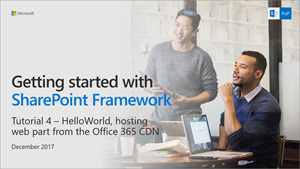

# <a name="hosting-client-side-web-part-from-office-365-cdn"></a>Размещение клиентской веб-части в сети доставки содержимого Office 365

В этой статье описано размещение клиентской веб-части в сети доставки содержимого (CDN) Office 365. Это простое решение для размещения ресурсов непосредственно в собственном клиенте Office 365. В сетях CDN можно размещать любые статические ресурсы, используемые в SharePoint Online. 

> [!NOTE]
> Разместить ресурсы веб-части можно несколькими способами. В этом руководстве описана сеть CDN Office 365, но можно также использовать [сеть доставки содержимого Azure](./deploy-web-part-to-cdn.md) или просто разместить ресурсы в библиотеке SharePoint из своего клиента. Последний вариант предоставляет такие же возможности, но уступает сетям CDN в производительности. Ресурсы можно разместить в любом расположении, к которому пользователи могут получить доступ с помощью протокола HTTP(S).

## <a name="prerequisites"></a>Предварительные требования

Прежде чем приступать к работе, убедитесь, что выполнены следующие задачи:

* [Создание первой клиентской веб-части](./build-a-hello-world-web-part.md)
* [Подключение клиентской веб-части к SharePoint](./connect-to-sharepoint.md)
* [Развертывание клиентской веб-части на классической странице SharePoint](./serve-your-web-part-in-a-sharepoint-page.md)


Указанные ниже действия также показаны в видео [канала SharePoint PnP на сайте YouTube](https://www.youtube.com/watch?v=AIb7s_Y02K8&list=PLR9nK3mnD-OXvSWvS2zglCzz4iplhVrKq&index=5). 

<a href="https://www.youtube.com/watch?v=AIb7s_Y02K8&list=PLR9nK3mnD-OXvSWvS2zglCzz4iplhVrKq&index=5">

</a>


## <a name="enable-cdn-in-your-office-365-tenant"></a>Включение сети доставки содержимого в клиенте Office 365
Скачайте последнюю версию командной консоли SharePoint Online на [сайте загрузки Майкрософт](https://www.microsoft.com/en-us/download/details.aspx?id=35588).

> [!TIP]
> Командную консоль SPO невозможно использовать на компьютерах без Windows. Однако вы можете управлять этими параметрами с помощью [интерфейса командной строки Office 365](https://sharepoint.github.io/office365-cli/).

Подключитесь к клиенту SharePoint Online с помощью сеанса PowerShell.
```
Connect-SPOService -Url https://contoso-admin.sharepoint.com
```

Чтобы узнать текущее состояние настроек общедоступной CDN для клиента, поочередно выполните указанные ниже команды. 
```
Get-SPOTenantCdnEnabled -CdnType Public
Get-SPOTenantCdnOrigins -CdnType Public
Get-SPOTenantCdnPolicies -CdnType Public
```
Включите общедоступную сеть доставки содержимого в клиенте.
```
Set-SPOTenantCdnEnabled -CdnType Public
```
Чтобы подтвердить настройки, введите "Y" и нажмите клавишу **ВВОД**.


Теперь в клиенте включена общедоступная CDN с использованием разрешенной конфигурации типов файлов по умолчанию. Это означает, что поддерживаются следующие типы файлов: CSS, EOT, GIF, ICO, JPEG, JPG, JS, MAP, PNG, SVG, TTF, WOFF.

Решения SharePoint Framework могут автоматически использовать общедоступную сеть CDN Office 365, если она включена в клиенте. Если сеть CDN включена, источник `*/CLIENTSIDEASSETS` автоматически добавляется как допустимый.

> [!NOTE]
> Если вы уже включали общедоступную сеть доставки содержимого Office 365, ее следует заново включить, чтобы запись `*/CLIENTSIDEASSETS` была добавлена как допустимый источник общедоступной сети CDN.

Вы можете проверить текущую конфигурацию конечных точек. Выполните приведенную ниже команду, чтобы получить список источников сетей CDN из клиента.
```
Get-SPOTenantCdnOrigins -CdnType Public
```
Обратите внимание, что новый источник указан как допустимый источник CDN. Настройка источника займет некоторое время (приблизительно 15 минут), поэтому мы пока можем создать тестовую веб-часть, которая будет размещена в источнике, когда развертывание будет завершено. 


> [!NOTE]
> Если рядом с названием источника нет уведомления о *настройке в состоянии ожидания*, он готов к использованию в клиенте. Это означает, что выполняется настройка SharePoint Online и системы CDN. 


## <a name="project-directory"></a>Каталог проекта

Переключитесь на консоль и убедитесь, что по-прежнему выбран каталог проекта, который использовался для настройки проекта веб-части.

Завершите задачу **gulp serve** (если она выполняется), нажав клавиши **CTRL+C**, и убедитесь, что выбран каталог проекта:

```
cd helloworld-webpart
```

# <a name="review-solution-settings"></a>Проверка параметров решения 

Откройте проект веб-части **HelloWorldWebPart** в Visual Studio Code или другой среде IDE.

Откройте файл **package-solution.json** в папке **config**.

В файле **package-solution.json** определяются метаданные пакета, как показано в следующем фрагменте кода:

```json
{
  "$schema": "https://dev.office.com/json-schemas/spfx-build/package-solution.schema.json",
  "solution": {
    "name": "helloworld-webpart-client-side-solution",
    "id": "4432f33b-5845-4ca0-827e-a8ae68c7b945",
    "version": "1.0.0.0",
    "includeClientSideAssets": true
  },
  "paths": {
    "zippedPackage": "solution/helloworld-webpart.sppkg"
  }
}

```

По умолчанию для параметра **includeClientSideAssets** задано значение `true`. Это означает, что статические ресурсы автоматически упаковываются в *SPPKG*-файлы, а ресурсы не требуется отдельно размещать во внешней системе. 

Если *сеть доставки содержимого Office 365* включена, она будет автоматически использоваться с параметрами по умолчанию. Если *сеть доставки содержимого Office 365* не включена, ресурсы будут предоставляться из семейства веб-сайтов с каталогом приложений. 

> [!NOTE]
> Начиная с SharePoint Framework версии 1.4, статические ресурсы по умолчанию упаковываются в SPPKG-файлы. При развертывании пакета в каталоге приложений он автоматически размещается в сети CDN Office 365 (если она включена) или по URL-адресу каталога приложений. Вы можете управлять этим поведением с помощью параметра `includeClientSideAssets` в файле `package-solution.json`.

## <a name="prepare-web-part-assets-to-deploy"></a>Подготовка ресурсов веб-части к развертыванию

Выполните приведенные ниже задачи, чтобы упаковать решение.
* При этом будет выполнена сборка выпуска проекта с использованием динамической метки в качестве URL-адреса для размещения ресурсов. Этот URL-адрес будет автоматически обновляться в соответствии с параметрами CDN, заданными для клиента.

```
gulp bundle --ship
```

Выполните указанную ниже задачу, чтобы упаковать решение.

```
gulp package-solution --ship
```

Эта команда создаст обновленный пакет **helloworld-webpart.sppkg** в папке **sharepoint/solution**.

> [!NOTE]
> Если вам интересно, какие именно ресурсы упаковываются в SPPKG-файл, ознакомьтесь с содержимым папки **sharepoint/solution/debug**.

Добавьте или перетащите новый пакет клиентского решения в каталог приложений в клиенте. 

Так как вы уже развернули пакет, вам будет предложено заменить существующий пакет.


Нажмите "Заменить".


Обратите внимание, что в списке **доменов** указана среда *SharePoint Online*. Это вызвано тем, что контент предоставляется либо из сети CDN Office 365, либо из каталога приложений (в зависимости от параметров клиента).

Нажмите кнопку **Развернуть**

Откройте сайт, где ранее было установлено решение **helloworld-webpart-client-side-solution**, или установите решение на новом сайте.

Когда решение будет установлено, в меню со значком *шестеренки* выберите пункт **Добавление страницы**, затем в окне выбора веб-частей для современной страницы нажмите **HelloWorld**, чтобы добавить настраиваемую веб-часть на страницу.


Обратите внимание: веб-часть отображается, несмотря на то что служба node.js не запущена локально. 


Сохраните изменения на странице с веб-частью.

Нажмите клавишу **F12**, чтобы открыть инструменты разработчика.

Разверните узел **publiccdn.sharepointonline.com** в источнике и обратите внимание, что файл **hello-world-web-part** загружается с URL-адреса общедоступной сети доставки содержимого, динамически указывающего на библиотеку, расположенную в семействе веб-сайтов каталога приложений.


> [!NOTE]
> Если в вашем клиенте не включена сеть CDN, а в файле **package-solution.json** для параметра `includeClientSideAssets` задано значение `true`, то URL-адрес для загрузки ресурсов будет динамически обновляться и указывать непосредственно на папку ClientSideAssets, расположенную в семействе веб-сайтов с каталогом приложений. В данном случае используется URL-адрес `https://sppnp.microsoft.com/sites/apps/ClientSideAssets/`.

Поздравляем! Вы развернули веб-часть в SharePoint Online, автоматически разместив ее в сети доставки содержимого Office 365.

## <a name="next-steps"></a>Дальнейшие действия

Вы можете загрузить jQuery и jQuery UI, а затем собрать веб-часть jQuery Accordion. Дальнейшие указания см. в статье [Добавление элемента "аккордеон" jQueryUI в клиентскую веб-часть](./add-jqueryui-accordion-to-web-part.md).

> [!NOTE]
> Если вы обнаружили ошибку в документации или SharePoint Framework, сообщите о ней разработчикам SharePoint, указав в [списке проблем для репозитория sp-dev-docs](https://github.com/SharePoint/sp-dev-docs/issues). Заранее спасибо!