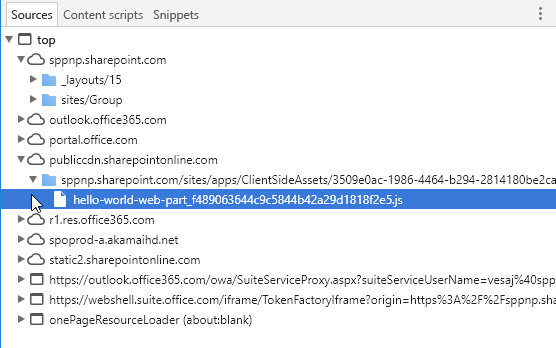

# <a name="host-your-client-side-web-part-from-office-365-cdn-hello-world-part-4"></a><span data-ttu-id="a86fd-104">Размещение клиентской веб-части в сети доставки содержимого Office 365 (Hello World, часть 4)</span><span class="sxs-lookup"><span data-stu-id="a86fd-104">Hosting client-side web part from Office 365 CDN (Hello world part 4)</span></span>

<span data-ttu-id="a86fd-105">Сеть доставки содержимого Office 365 позволяет разместить ресурсы непосредственно в клиенте Office 365.</span><span class="sxs-lookup"><span data-stu-id="a86fd-105">Office 365 Content Delivery Network (CDN) provides you an easy solution to host your assets directly from your own Office 365 tenant.</span></span> <span data-ttu-id="a86fd-106">В ней можно разместить любые статические ресурсы, используемые в SharePoint Online.</span><span class="sxs-lookup"><span data-stu-id="a86fd-106">It can be used for hosting any static assets that are used in SharePoint Online.</span></span> 

> [!NOTE]
> <span data-ttu-id="a86fd-107">Разместить ресурсы веб-части можно несколькими способами.</span><span class="sxs-lookup"><span data-stu-id="a86fd-107">There are multiple different hosting options for your web part assets.</span></span> <span data-ttu-id="a86fd-108">В этом руководстве описана сеть CDN Office 365, но можно также использовать [сеть доставки содержимого Azure](./deploy-web-part-to-cdn.md) или просто разместить ресурсы в библиотеке SharePoint из своего клиента.</span><span class="sxs-lookup"><span data-stu-id="a86fd-108">This tutorial concentrates on showing the Office 365 CDN option, but you could also use the [Azure CDN](./deploy-web-part-to-cdn.md) or simply host your assets from SharePoint library from your tenant.</span></span> <span data-ttu-id="a86fd-109">Последний вариант предоставляет такие же возможности, но уступает сетям CDN в производительности.</span><span class="sxs-lookup"><span data-stu-id="a86fd-109">In the latter case, you would not benefit from the CDN performance improvements, but that would also work from the functionality perspective.</span></span> <span data-ttu-id="a86fd-110">Ресурсы можно разместить в любом расположении, к которому пользователи могут получить доступ с помощью протокола HTTP(S).</span><span class="sxs-lookup"><span data-stu-id="a86fd-110">Any location which end users can access using HTTP(S) would be technically suitable for hosting the assets for end users.</span></span>

> [!IMPORTANT]
> <span data-ttu-id="a86fd-111">В этой статье упоминается атрибут `includeClientSideAssets`, который появился в SPFx 1.4.</span><span class="sxs-lookup"><span data-stu-id="a86fd-111">This article uses `includeClientSideAssets` attribute, which was introduced in the SPFx v1.4.</span></span> <span data-ttu-id="a86fd-112">Эта версия не поддерживается в **SharePoint 2016 с пакетом дополнительных компонентов 2**.</span><span class="sxs-lookup"><span data-stu-id="a86fd-112">This version is not supported with **SharePoint 2016 Feature Pack 2**.</span></span> <span data-ttu-id="a86fd-113">Если вы используете локальную конфигурацию, определите расположение CDN отдельно.</span><span class="sxs-lookup"><span data-stu-id="a86fd-113">If you are using on-premises setup, you need to decide the CDN hosting location separately.</span></span> <span data-ttu-id="a86fd-114">Файлы JavaScript также можно размещать в централизованной библиотеке локальной среды SharePoint, к которой у пользователей есть доступ.</span><span class="sxs-lookup"><span data-stu-id="a86fd-114">You can also simply host the JavaScript files from centralized library in your on-premises SharePoint which your users have access.</span></span> <span data-ttu-id="a86fd-115">Дополнительные рекомендации представлены в [руководстве, посвященном SharePoint 2016](../../sharepoint-2016-support.md).</span><span class="sxs-lookup"><span data-stu-id="a86fd-115">Please see additional considerations from the [SharePoint 2016 specific guidance](../../sharepoint-2016-support.md).</span></span>

<span data-ttu-id="a86fd-116">Прежде чем приступать к работе, убедитесь, что выполнены следующие задачи:</span><span class="sxs-lookup"><span data-stu-id="a86fd-116">Make sure that you have completed the following tasks before you begin:</span></span>

* [<span data-ttu-id="a86fd-117">Создание первой клиентской веб-части</span><span class="sxs-lookup"><span data-stu-id="a86fd-117">Build your first client-side web part</span></span>](./build-a-hello-world-web-part.md)
* [<span data-ttu-id="a86fd-118">Подключение клиентской веб-части к SharePoint</span><span class="sxs-lookup"><span data-stu-id="a86fd-118">Connect your client-side web part to SharePoint</span></span>](./connect-to-sharepoint.md)
* [<span data-ttu-id="a86fd-119">Развертывание клиентской веб-части на странице SharePoint</span><span class="sxs-lookup"><span data-stu-id="a86fd-119">Deploy your client-side web part to a classic SharePoint page</span></span>](./serve-your-web-part-in-a-sharepoint-page.md)

<span data-ttu-id="a86fd-120">Эти действия также показаны в видео на [канале SharePoint PnP в YouTube](https://www.youtube.com/watch?v=MEZMs8VMVQ0&list=PLR9nK3mnD-OXvSWvS2zglCzz4iplhVrKq).</span><span class="sxs-lookup"><span data-stu-id="a86fd-120">You can also follow these steps by watching the video on the [SharePoint PnP YouTube Channel](https://www.youtube.com/watch?v=MEZMs8VMVQ0&list=PLR9nK3mnD-OXvSWvS2zglCzz4iplhVrKq).</span></span>

<a href="https://www.youtube.com/watch?v=MEZMs8VMVQ0&list=PLR9nK3mnD-OXvSWvS2zglCzz4iplhVrKq">

</a>

## <a name="enable-cdn-in-your-office-365-tenant"></a><span data-ttu-id="a86fd-121">Включение сети доставки содержимого в клиенте Office 365</span><span class="sxs-lookup"><span data-stu-id="a86fd-121">Enable CDN in your Office 365 tenant</span></span>

1. <span data-ttu-id="a86fd-122">Скачайте последнюю версию командной консоли SharePoint Online на [сайте загрузки Майкрософт](https://www.microsoft.com/en-us/download/details.aspx?id=35588).</span><span class="sxs-lookup"><span data-stu-id="a86fd-122">Ensure that you have latest version of the SharePoint Online Management Shell by downloading it from the [Microsoft Download site](https://www.microsoft.com/en-us/download/details.aspx?id=35588).</span></span>

  > [!TIP]
  > <span data-ttu-id="a86fd-123">Командную консоль SharePoint Online нельзя использовать на компьютерах без Windows.</span><span class="sxs-lookup"><span data-stu-id="a86fd-123">If you are using non-Windows machine, you cannot use the SPO Management Shell.</span></span> <span data-ttu-id="a86fd-124">Однако вы можете управлять этими параметрами с помощью [интерфейса командной строки Office 365](https://sharepoint.github.io/office365-cli/).</span><span class="sxs-lookup"><span data-stu-id="a86fd-124">You can however manage these settings using [Office 365 CLI](https://sharepoint.github.io/office365-cli/).</span></span>

2. <span data-ttu-id="a86fd-125">Подключитесь к клиенту SharePoint Online с помощью сеанса PowerShell.</span><span class="sxs-lookup"><span data-stu-id="a86fd-125">Connect to your SharePoint Online tenant with PowerShell session.</span></span>

  ```powershell
  Connect-SPOService -Url https://contoso-admin.sharepoint.com
  ```

3. <span data-ttu-id="a86fd-126">Чтобы узнать текущее состояние настроек общедоступной сети CDN на уровне клиента, поочередно выполните приведенные ниже команды.</span><span class="sxs-lookup"><span data-stu-id="a86fd-126">Get the current status of public CDN settings from the tenant level by executing the following commands one-by-one.</span></span> 


  ```powershell
  Get-SPOTenantCdnEnabled -CdnType Public
  Get-SPOTenantCdnOrigins -CdnType Public
  Get-SPOTenantCdnPolicies -CdnType Public
  ```

  <span data-ttu-id="a86fd-127">Решения SharePoint Framework могут автоматически использовать общедоступную сеть CDN Office 365, если она включена в клиенте.</span><span class="sxs-lookup"><span data-stu-id="a86fd-127">SharePoint Framework solutions can automatically benefit from the Office 365 Public CDN as long as it's enabled in your tenant.</span></span> <span data-ttu-id="a86fd-128">Если сеть CDN включена, источник `*/CLIENTSIDEASSETS` автоматически добавляется как допустимый.</span><span class="sxs-lookup"><span data-stu-id="a86fd-128">When CDN is enabled, `*/CLIENTSIDEASSETS` origin is automatically added as valid a valid origin.</span></span>

4. <span data-ttu-id="a86fd-129">Включите общедоступную сеть доставки содержимого в клиенте.</span><span class="sxs-lookup"><span data-stu-id="a86fd-129">Enable public CDN in the tenant</span></span>

  ```powershell
  Set-SPOTenantCdnEnabled -CdnType Public
  ```

5. <span data-ttu-id="a86fd-130">Чтобы подтвердить настройки, выберите `Y` и нажмите клавишу ВВОД.</span><span class="sxs-lookup"><span data-stu-id="a86fd-130">Confirm settings by selecting 'Y' and pressing `Y`</span></span>

  

  <span data-ttu-id="a86fd-132">Теперь в клиенте включена общедоступная сеть CDN с использованием разрешенной конфигурации типов файлов по умолчанию.</span><span class="sxs-lookup"><span data-stu-id="a86fd-132">Public CDN has now been enabled in the tenant by using the default file type configuration allowed.</span></span> <span data-ttu-id="a86fd-133">Это означает, что поддерживаются следующие расширения: CSS, EOT, CSS, EOT, GIF, ICO, JPEG, JPG, JS, MAP, PNG, SVG, TTF и WOFF.</span><span class="sxs-lookup"><span data-stu-id="a86fd-133">This means that the following file type extensions are supported: CSS, EOT, GIF, ICO, JPEG, JPG, JS, MAP, PNG, SVG, TTF, and WOFF.</span></span>

  <span data-ttu-id="a86fd-134">Решения SharePoint Framework могут автоматически использовать общедоступную сеть CDN Office 365, если она включена в клиенте.</span><span class="sxs-lookup"><span data-stu-id="a86fd-134">SharePoint Framework solutions can automatically benefit from the Office 365 Public CDN as long as it's enabled in your tenant.</span></span> <span data-ttu-id="a86fd-135">Если сеть CDN включена, источник `*/CLIENTSIDEASSETS` автоматически добавляется как допустимый.</span><span class="sxs-lookup"><span data-stu-id="a86fd-135">When CDN is enabled, `*/CLIENTSIDEASSETS` origin is automatically added as valid a valid origin.</span></span>

  > [!NOTE]
  > <span data-ttu-id="a86fd-136">Если вы уже включали общедоступную сеть доставки содержимого Office 365, ее следует включить заново, чтобы запись `*/CLIENTSIDEASSETS` была добавлена как допустимый источник общедоступной сети CDN.</span><span class="sxs-lookup"><span data-stu-id="a86fd-136">If you have previously enabled Office 365 CDN, you should re-enable the public CDN, so that you will have the `*/CLIENTSIDEASSETS`entry added as valid CDN origin for public CDN.</span></span>

6. <span data-ttu-id="a86fd-137">Вы можете проверить текущую конфигурацию конечных точек.</span><span class="sxs-lookup"><span data-stu-id="a86fd-137">You can double-check the current setup of your end-points.</span></span> <span data-ttu-id="a86fd-138">Выполните следующую команду, чтобы получить список источников сетей CDN из клиента:</span><span class="sxs-lookup"><span data-stu-id="a86fd-138">Execute the following command to get the list of CDN origins from your tenant:</span></span>

  ```powershell
  Get-SPOTenantCdnOrigins -CdnType Public
  ```

  <span data-ttu-id="a86fd-139">Обратите внимание, что новый источник указан как допустимый источник CDN.</span><span class="sxs-lookup"><span data-stu-id="a86fd-139">Note that your newly added origin is listed as a valid CDN origin.</span></span> <span data-ttu-id="a86fd-140">Окончательная настройка источника займет приблизительно 15 минут, а мы пока можем создать тестовую веб-часть, которая будет размещена в источнике по завершении развертывания.</span><span class="sxs-lookup"><span data-stu-id="a86fd-140">Notice that your newly added origin is listed as a valid CDN origin. Final configuration of the origin will take a while (approximately 15 minutes), so we can continue by creating your test web part, which will be hosted from the origin, when the deployment is completed.</span></span> 

  

  > [!NOTE]
  > <span data-ttu-id="a86fd-142">Если рядом с названием источника нет сообщения о *незавершенной настройке*, то он готов к использованию в клиенте.</span><span class="sxs-lookup"><span data-stu-id="a86fd-142">When origin is listed without the *(configuration pending)* text, it is ready to be used in your tenant.</span></span> <span data-ttu-id="a86fd-143">Это означает, что выполняется настройка SharePoint Online и системы CDN.</span><span class="sxs-lookup"><span data-stu-id="a86fd-143">This is the indication of an on-going configuration between SharePoint Online and CDN system.</span></span> 


## <a name="end-task-in-project-directory"></a><span data-ttu-id="a86fd-144">Завершение задачи в каталоге проекта</span><span class="sxs-lookup"><span data-stu-id="a86fd-144">End task in project directory</span></span>

1. <span data-ttu-id="a86fd-145">Откройте консоль и убедитесь, что по-прежнему выбран каталог проекта, который использовался для настройки проекта веб-части.</span><span class="sxs-lookup"><span data-stu-id="a86fd-145">Switch to console and make sure you are still in the project directory you used to set up your web part project.</span></span>

2. <span data-ttu-id="a86fd-146">Завершите задачу `gulp serve` (если она выполняется), нажав клавиши CTRL+C, и убедитесь, что выбран каталог проекта:</span><span class="sxs-lookup"><span data-stu-id="a86fd-146">End the possible gulp serve task by choosing Ctrl+C and ensure that you are in your project directory:</span></span>

  ```
  cd helloworld-webpart
  ```

## <a name="review-solution-settings"></a><span data-ttu-id="a86fd-147">Проверка параметров решения</span><span class="sxs-lookup"><span data-stu-id="a86fd-147">Review solution settings</span></span> 

1. <span data-ttu-id="a86fd-148">Откройте проект веб-части **HelloWorldWebPart** в Visual Studio Code или другой среде IDE.</span><span class="sxs-lookup"><span data-stu-id="a86fd-148">Open the **HelloWorldWebPart** web part project in Visual Studio Code, or your preferred IDE.</span></span>

2. <span data-ttu-id="a86fd-149">Откройте файл **package-solution.json** в папке **config**.</span><span class="sxs-lookup"><span data-stu-id="a86fd-149">Open **package-solution.json** from the **config** folder.</span></span>

  <span data-ttu-id="a86fd-150">В файле **package-solution.json** определяются метаданные пакета, как показано в следующем фрагменте кода:</span><span class="sxs-lookup"><span data-stu-id="a86fd-150">The **package-solution.json** file defines the package metadata as shown in the following code:</span></span>

  ```json
  {
    "$schema": "https://dev.office.com/json-schemas/spfx-build/package-solution.schema.json",
    "solution": {
      "name": "helloworld-webpart-client-side-solution",
      "id": "4432f33b-5845-4ca0-827e-a8ae68c7b945",
      "version": "1.0.0.0",
      "includeClientSideAssets": true
    },
    "paths": {
      "zippedPackage": "solution/helloworld-webpart.sppkg"
    }
  }

  ```

<span data-ttu-id="a86fd-151">По умолчанию для параметра **includeClientSideAssets** задано значение `true`. Это означает, что статические ресурсы автоматически упаковываются в *SPPKG*-файлы, а ресурсы не требуется отдельно размещать во внешней системе.</span><span class="sxs-lookup"><span data-stu-id="a86fd-151">Default value for the **includeClientSideAssets** is `true`, which means that static assets are packaged automatically inside of the *.sppkg* files and you do not need to separately host your assets from external system.</span></span> 

<span data-ttu-id="a86fd-152">Если *сеть доставки содержимого Office 365* включена, она используется автоматически с параметрами по умолчанию.</span><span class="sxs-lookup"><span data-stu-id="a86fd-152">If *Office 365 CDN* is enabled, it will be used automatically with default settings.</span></span> <span data-ttu-id="a86fd-153">Если *сеть доставки содержимого Office 365* не включена, ресурсы доставляются из семейства веб-сайтов с каталогом приложений.</span><span class="sxs-lookup"><span data-stu-id="a86fd-153">If *Office 365 CDN* is not enabled, assets will be served from app catalog site collection.</span></span> 

> [!NOTE]
> <span data-ttu-id="a86fd-154">Начиная с SharePoint Framework версии 1.4, статические ресурсы по умолчанию упаковываются в SPPKG-файлы.</span><span class="sxs-lookup"><span data-stu-id="a86fd-154">Starting from the SharePoint Framework v1.4, static assets are by default packaged inside of the sppkg package.</span></span> <span data-ttu-id="a86fd-155">При развертывании пакета в каталоге приложений ресурсы автоматически размещаются в сети CDN Office 365 (если она включена) или по URL-адресу каталога приложений.</span><span class="sxs-lookup"><span data-stu-id="a86fd-155">When package is deployed in app catalog, they are automatically being hosted either from Office 365 CDN (if enabled) or from app catalog URL.</span></span> <span data-ttu-id="a86fd-156">Вы можете управлять этим поведением с помощью параметра `includeClientSideAssets` в файле `package-solution.json`.</span><span class="sxs-lookup"><span data-stu-id="a86fd-156">You can control this behavior with the `includeClientSideAssets` setting in `package-solution.json` file.</span></span>

## <a name="prepare-web-part-assets-to-deploy"></a><span data-ttu-id="a86fd-157">Подготовка ресурсов веб-части к развертыванию</span><span class="sxs-lookup"><span data-stu-id="a86fd-157">Prepare web part assets to deploy</span></span>

1. <span data-ttu-id="a86fd-158">Выполните приведенную ниже задачу, чтобы создать пакет решения.</span><span class="sxs-lookup"><span data-stu-id="a86fd-158">Execute the following task to bundle your solution.</span></span> <span data-ttu-id="a86fd-159">При этом будет выполнена сборка выпуска проекта с использованием динамической метки в качестве URL-адреса для размещения ресурсов.</span><span class="sxs-lookup"><span data-stu-id="a86fd-159">This will execute a release build of your project by using a dynamic label as the host URL for your assets.</span></span> <span data-ttu-id="a86fd-160">Этот URL-адрес автоматически обновляется в соответствии с параметрами CDN клиента.</span><span class="sxs-lookup"><span data-stu-id="a86fd-160">This URL will be automatically updated based on your tenant CDN settings.</span></span>

  ```
  gulp bundle --ship
  ```

2. <span data-ttu-id="a86fd-161">Выполните приведенную ниже задачу, чтобы упаковать решение.</span><span class="sxs-lookup"><span data-stu-id="a86fd-161">Execute the following task to package your solution.</span></span> <span data-ttu-id="a86fd-162">Эта команда создает обновленный пакет **helloworld-webpart.sppkg** в папке **sharepoint/solution**.</span><span class="sxs-lookup"><span data-stu-id="a86fd-162">This command will create an updated **helloworld-webpart.sppkg** package on the **sharepoint/solution** folder.</span></span>

  ```
  gulp package-solution --ship
  ```

  > [!NOTE]
  > <span data-ttu-id="a86fd-163">Если вам интересно, какие именно ресурсы упаковываются в SPPKG-файл, ознакомьтесь с содержимым папки **sharepoint/solution/debug**.</span><span class="sxs-lookup"><span data-stu-id="a86fd-163">If you are interested on what actually got packaged inside of the sppkg file, you can have a look omn the content of the **sharepoint/solution/debug** folder.</span></span>

3. <span data-ttu-id="a86fd-164">Добавьте или перетащите новый пакет клиентского решения в каталог приложений в клиенте.</span><span class="sxs-lookup"><span data-stu-id="a86fd-164">Upload or drag & drop the newly created client-side solution package to the app catalog in your tenant.</span></span> 

4. <span data-ttu-id="a86fd-165">Так как вы уже развернули пакет, вам будет предложено заменить его.</span><span class="sxs-lookup"><span data-stu-id="a86fd-165">Because you already deployed the package, you will be prompted as to whether to replace the existing package.</span></span> <span data-ttu-id="a86fd-166">Нажмите **Заменить**.</span><span class="sxs-lookup"><span data-stu-id="a86fd-166">Select **Replace It**.</span></span>

  

5. <span data-ttu-id="a86fd-168">Обратите внимание, что в списке **доменов** указана среда *SharePoint Online*.</span><span class="sxs-lookup"><span data-stu-id="a86fd-168">Notice how the **domain** list in the prompt is saying *SharePoint Online*.</span></span> <span data-ttu-id="a86fd-169">Это вызвано тем, что контент доставляется либо из сети CDN Office 365, либо из каталога приложений (в зависимости от параметров клиента).</span><span class="sxs-lookup"><span data-stu-id="a86fd-169">This is since the content is either served from the Office 365 CDN or from app catalog, depending on the tenant settings.</span></span> <span data-ttu-id="a86fd-170">Нажмите кнопку **Развернуть**.</span><span class="sxs-lookup"><span data-stu-id="a86fd-170">Select the **Deploy** button.</span></span>

  

6. <span data-ttu-id="a86fd-172">Откройте сайт, где ранее было установлено решение **helloworld-webpart-client-side-solution**, или установите решение на новом сайте.</span><span class="sxs-lookup"><span data-stu-id="a86fd-172">Open a site where previously installed the **helloworld-webpart-client-side-solution** solution or install solution to a new site.</span></span>

7. <span data-ttu-id="a86fd-173">Когда решение будет установлено, в меню со значком *шестеренки* выберите **Добавление страницы**, затем в окне выбора веб-частей для современной страницы нажмите **HelloWorld**, чтобы добавить свою веб-часть на страницу.</span><span class="sxs-lookup"><span data-stu-id="a86fd-173">After the solution has been installed, chose **Add a page** from the *gear* menu and pick **HelloWorld** from the modern page web part picker to add your custom web part to page.</span></span>

  

8. <span data-ttu-id="a86fd-175">Обратите внимание: веб-часть отображается, несмотря на то что служба node.js не запущена локально.</span><span class="sxs-lookup"><span data-stu-id="a86fd-175">Notice how the web part is rendered even though you are not running the node.js service locally.</span></span> 

  

9. <span data-ttu-id="a86fd-177">Сохраните изменения на странице с веб-частью.</span><span class="sxs-lookup"><span data-stu-id="a86fd-177">Save changes on the page with web part on it.</span></span>

10. <span data-ttu-id="a86fd-178">Нажмите клавишу **F12**, чтобы открыть инструменты разработчика.</span><span class="sxs-lookup"><span data-stu-id="a86fd-178">Press **F12** to open up developer tools.</span></span>

11. <span data-ttu-id="a86fd-179">Разверните узел **publiccdn.sharepointonline.com** в источнике и обратите внимание, что файл **hello-world-web-part** загружается с URL-адреса общедоступной сети доставки содержимого, динамически указывающего на библиотеку, расположенную в семействе веб-сайтов каталога приложений.</span><span class="sxs-lookup"><span data-stu-id="a86fd-179">Extend **publiccdn.sharepointonline.com** under the source and notice how the **hello-world-web-part** file is loaded from the Public CDN URL pointing dynamically to a library located under the app catalog site collection.</span></span>

  

> [!NOTE]
> <span data-ttu-id="a86fd-181">Если в вашем клиенте не включена сеть CDN, а в файле **package-solution.json** для параметра `includeClientSideAssets` задано значение `true`, то URL-адрес для загрузки ресурсов будет динамически обновляться и указывать непосредственно на папку ClientSideAssets, расположенную в семействе веб-сайтов с каталогом приложений.</span><span class="sxs-lookup"><span data-stu-id="a86fd-181">If you would not have CDN enabled in your tenant and the `includeClientSideAssets` setting would be `true`in the **package-solution.json**, loading URL for the assets would be dynamically updated and pointing directly to the ClientSideAssets folder located in the app catalog site collection.</span></span> <span data-ttu-id="a86fd-182">В данном случае используется URL-адрес `https://sppnp.microsoft.com/sites/apps/ClientSideAssets/`.</span><span class="sxs-lookup"><span data-stu-id="a86fd-182">In this example case, URL would be `https://sppnp.microsoft.com/sites/apps/ClientSideAssets/`.</span></span>

<span data-ttu-id="a86fd-183">Поздравляем! Вы развернули веб-часть в SharePoint Online, автоматически разместив ее в сети доставки содержимого Office 365.</span><span class="sxs-lookup"><span data-stu-id="a86fd-183">Now you have deployed your custom web part to SharePoint Online and it's being hosted automatically from the Office 365 CDN.</span></span>

## <a name="next-steps"></a><span data-ttu-id="a86fd-184">Дальнейшие действия</span><span class="sxs-lookup"><span data-stu-id="a86fd-184">Next steps</span></span>

<span data-ttu-id="a86fd-185">Вы можете загрузить jQuery и jQuery UI, а затем собрать веб-часть jQuery Accordion.</span><span class="sxs-lookup"><span data-stu-id="a86fd-185">You can load jQuery, jQuery UI and build a jQuery Accordion web part.</span></span> <span data-ttu-id="a86fd-186">Дальнейшие указания см. в статье [Добавление элемента Accordion jQueryUI в клиентскую веб-часть SharePoint](./add-jqueryui-accordion-to-web-part.md).</span><span class="sxs-lookup"><span data-stu-id="a86fd-186">To continue, see [Add jQueryUI Accordion to your client-side web part](./add-jqueryui-accordion-to-web-part.md).</span></span>

> [!NOTE]
> <span data-ttu-id="a86fd-187">Если вы обнаружили ошибку в документации или SharePoint Framework, сообщите о ней разработчикам SharePoint, указав в [списке проблем для репозитория sp-dev-docs](https://github.com/SharePoint/sp-dev-docs/issues).</span><span class="sxs-lookup"><span data-stu-id="a86fd-187">If you find an issue in the documentation or in the SharePoint Framework, please report that to SharePoint engineering using the [issue list at sp-dev-docs repository](https://github.com/SharePoint/sp-dev-docs/issues).</span></span> <span data-ttu-id="a86fd-188">Заранее спасибо!</span><span class="sxs-lookup"><span data-stu-id="a86fd-188">Thanks for your input advance.</span></span>

