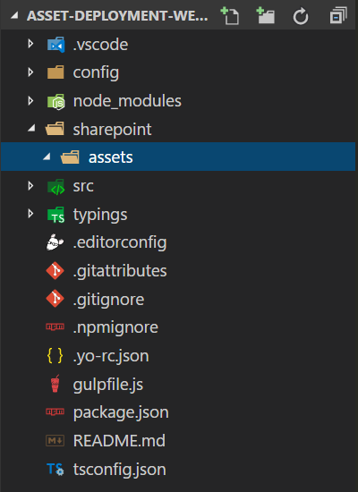
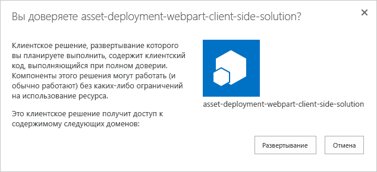
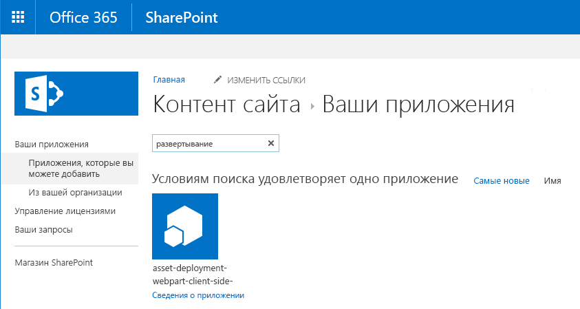
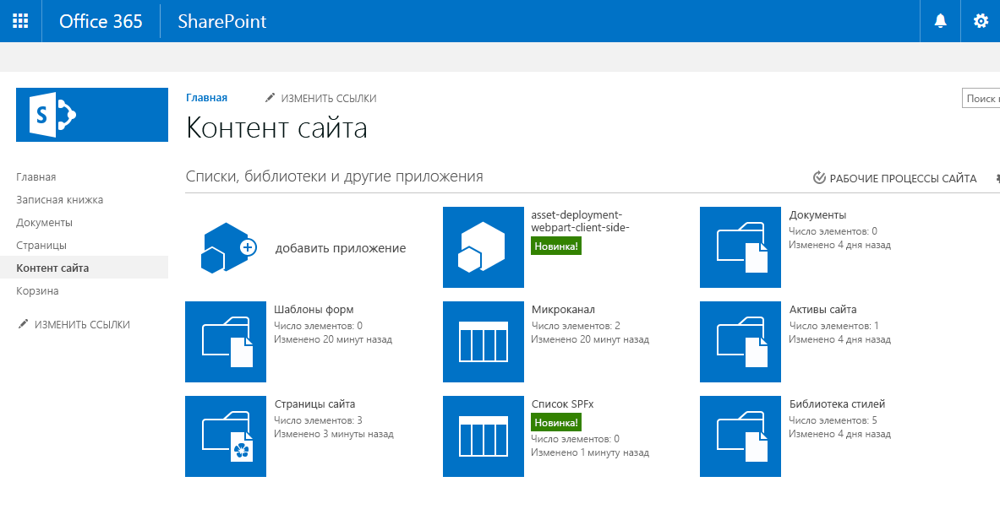
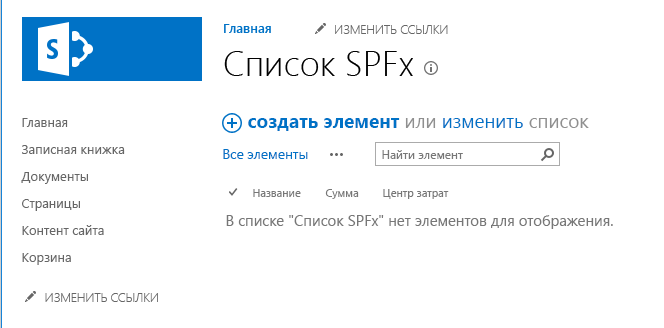
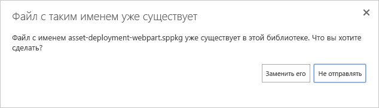
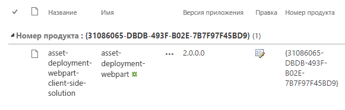
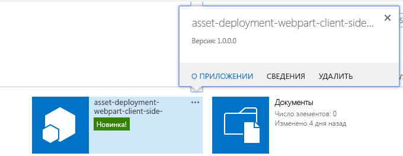
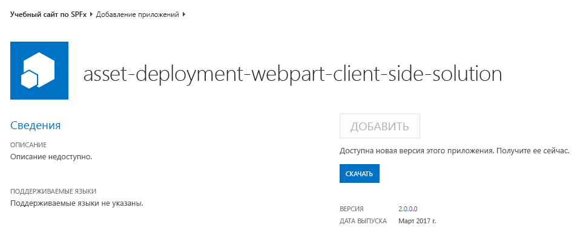
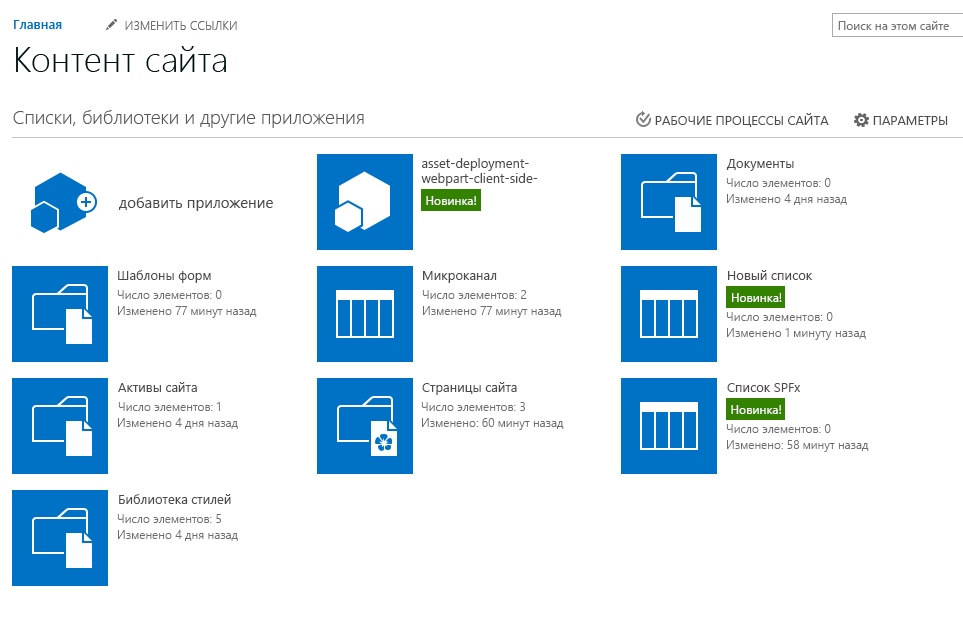

# <a name="provisioning-sharepoint-assets-from-your-sharepoint-client-side-web-part"></a><span data-ttu-id="bc46b-101">Подготовка ресурсов SharePoint из клиентской веб-части SharePoint</span><span class="sxs-lookup"><span data-stu-id="bc46b-101">Provisioning SharePoint assets from your SharePoint client-side web part</span></span>

<span data-ttu-id="bc46b-p101">В этой статье описывается подготовка ресурсов SharePoint в составе решения SharePoint Framework. Эти ресурсы развертываются на сайтах SharePoint при установке решения. Кроме того, в этой статье рассматриваются необходимые действия для установки возможных обновлений в составе новых версий пакета. Этот процесс идентичен обновлению надстроек.</span><span class="sxs-lookup"><span data-stu-id="bc46b-p101">This article describes how to provision SharePoint assets as part of the SharePoint Framework solution. These assets are deployed to SharePoint sites when the solution is installed on it. Article also covers needed steps for introducing possible updates as part of new versions of the package. This process is exactly the same as for add-in update.</span></span>

## <a name="prerequisites"></a><span data-ttu-id="bc46b-106">Необходимые условия</span><span class="sxs-lookup"><span data-stu-id="bc46b-106">Prerequisites</span></span>
<span data-ttu-id="bc46b-107">Прежде чем изучать базовый порядок создания собственной клиентской веб-части, выполните следующие действия:</span><span class="sxs-lookup"><span data-stu-id="bc46b-107">Complete the following steps before you start to understand the basic flow of creating a custom client-side web part:</span></span>

* <span data-ttu-id="bc46b-108">[Создайте свою первую веб-часть](build-a-hello-world-web-part.md).</span><span class="sxs-lookup"><span data-stu-id="bc46b-108">[Build your first web part](build-a-hello-world-web-part.md)</span></span>
* <span data-ttu-id="bc46b-109">[Подключитесь к SharePoint](connect-to-sharepoint.md).</span><span class="sxs-lookup"><span data-stu-id="bc46b-109">[Connect to SharePoint](connect-to-sharepoint.md)</span></span> 

## <a name="resources"></a><span data-ttu-id="bc46b-110">Ресурсы</span><span class="sxs-lookup"><span data-stu-id="bc46b-110">Resources</span></span>
<span data-ttu-id="bc46b-111">В приведенных ниже ресурсах вы найдете дополнительные сведения на темы, рассматриваемые в данном руководстве.</span><span class="sxs-lookup"><span data-stu-id="bc46b-111">See following resources for additional details around the covered topics in this tutorial.</span></span>

* [<span data-ttu-id="bc46b-112">Подготовка ресурсов SharePoint с пакетом решения</span><span class="sxs-lookup"><span data-stu-id="bc46b-112">Provision SharePoint assets with your solution package</span></span>](../../toolchain/provision-sharepoint-assets)
* [<span data-ttu-id="bc46b-113">Пример решения: развертывание ресурсов SharePoint в составе пакета SPFx</span><span class="sxs-lookup"><span data-stu-id="bc46b-113">Sample solution - Deployment of SharePoint assets as part of SPFx package</span></span>](https://github.com/SharePoint/sp-dev-fx-webparts/tree/master/samples/react-feature-framework)

## <a name="create-a-new-web-part-project"></a><span data-ttu-id="bc46b-114">Создание проекта веб-части</span><span class="sxs-lookup"><span data-stu-id="bc46b-114">Create a new web part project</span></span>

<span data-ttu-id="bc46b-115">Создайте каталог проекта в любом расположении:</span><span class="sxs-lookup"><span data-stu-id="bc46b-115">Create a new project directory in your favorite location:</span></span>

```
md asset-deployment-webpart
```

<span data-ttu-id="bc46b-116">Перейдите к каталогу проекта:</span><span class="sxs-lookup"><span data-stu-id="bc46b-116">Go to the project directory:</span></span>

```
cd asset-deployment-webpart
```
    
<span data-ttu-id="bc46b-117">Создайте клиентскую веб-часть с помощью генератора Yeoman для SharePoint:</span><span class="sxs-lookup"><span data-stu-id="bc46b-117">Create a new client-side web part solution by running the Yeoman SharePoint Generator:</span></span>

```
yo @microsoft/sharepoint
```

<span data-ttu-id="bc46b-118">Когда появится запрос:</span><span class="sxs-lookup"><span data-stu-id="bc46b-118">When prompted:</span></span>

* <span data-ttu-id="bc46b-119">оставьте имя решения **asset-deployment-webpart** и нажмите клавишу **ВВОД**;</span><span class="sxs-lookup"><span data-stu-id="bc46b-119">Accept the default **asset-deployment-webpart** as your solution name and choose **Enter**.</span></span>
* <span data-ttu-id="bc46b-120">выберите вариант **Use the current folder** (Использовать текущую папку) для размещения файлов.</span><span class="sxs-lookup"><span data-stu-id="bc46b-120">Select **Use the current folder** as the location for the files.</span></span>

<span data-ttu-id="bc46b-121">Далее вам потребуется указать определенные сведения о веб-части:</span><span class="sxs-lookup"><span data-stu-id="bc46b-121">The next set of prompts will ask for specific information about your web part:</span></span>

* <span data-ttu-id="bc46b-122">оставьте выбранным параметр **No JavaScipt web framework** (Не использовать платформу веб-решений на базе JavaScript) по умолчанию и нажмите клавишу **ВВОД**, чтобы продолжить;</span><span class="sxs-lookup"><span data-stu-id="bc46b-122">Accept the default **No JavaScipt web framework** option for the framework and choose **Enter** to continue.</span></span>
* <span data-ttu-id="bc46b-123">введите имя **AssetDeployment** для веб-части и нажмите клавишу **ВВОД**;</span><span class="sxs-lookup"><span data-stu-id="bc46b-123">Type **AssetDeployment** for the web part name and choose **Enter**.</span></span>
* <span data-ttu-id="bc46b-124">введите описание веб-части **AssetDeployment Web Part** и нажмите клавишу **ВВОД**;</span><span class="sxs-lookup"><span data-stu-id="bc46b-124">Enter **AssetDeployment Web Part** as the description of the web part and choose **Enter**.</span></span> 

<span data-ttu-id="bc46b-p102">После этого Yeoman установит необходимые зависимости и сформирует шаблоны файлов решения. Это может занять несколько минут. При этом Yeoman также включит в проект веб-часть **AssetDeployment**.</span><span class="sxs-lookup"><span data-stu-id="bc46b-p102">At this point, Yeoman will install the required dependencies and scaffold the solution files. This might take a few minutes. Yeoman will scaffold the project to include your **AssetDeployment** web part as well.</span></span>

<span data-ttu-id="bc46b-128">Введите в консоли следующий код, чтобы открыть проект веб-части в Visual Studio Code:</span><span class="sxs-lookup"><span data-stu-id="bc46b-128">In the console, type the following to open the web part project in Visual Studio Code:</span></span>

```
code .
```

## <a name="create-folder-structure-for-your-sharepoint-assets"></a><span data-ttu-id="bc46b-129">Создание структуры папок для ресурсов SharePoint</span><span class="sxs-lookup"><span data-stu-id="bc46b-129">Create folder structure for your SharePoint assets</span></span>

<span data-ttu-id="bc46b-130">Для начала необходимо создать папку **assets**, в которую мы поместим все ресурсы платформы компонентов, используемые для подготовки структур SharePoint при установке пакета.</span><span class="sxs-lookup"><span data-stu-id="bc46b-130">We'll first need to create an **assets** folder where we will place all feature framework assets used to provision SharePoint structures when package is installed.</span></span>

* <span data-ttu-id="bc46b-131">Создайте папку **sharepoint** в корневой папке решения.</span><span class="sxs-lookup"><span data-stu-id="bc46b-131">Create folder called **sharepoint** to the root of the solution</span></span>
* <span data-ttu-id="bc46b-132">Создайте папку **assets**, вложенную в только что созданную папку **sharepoint**.</span><span class="sxs-lookup"><span data-stu-id="bc46b-132">Create folder called **assets** as a sub folder for the just created **sharepoint** folder</span></span>

<span data-ttu-id="bc46b-133">Структура решения должна быть такой, как на рисунке ниже.</span><span class="sxs-lookup"><span data-stu-id="bc46b-133">Your solution structure should be looking like in the following picture</span></span>



## <a name="create-feature-framework-files-for-initial-deployment"></a><span data-ttu-id="bc46b-135">Создание файлов платформы компонентов для начального развертывания</span><span class="sxs-lookup"><span data-stu-id="bc46b-135">Create feature framework files for initial deployment</span></span>
<span data-ttu-id="bc46b-p103">Для подготовки ресурсов SharePoint на сайтах с элементами платформы компонентов необходимо создать нужные XML-файлы в папке ресурсов. Пакеты решений SharePoint Framework поддерживают следующие элементы:</span><span class="sxs-lookup"><span data-stu-id="bc46b-p103">To be able to provision SharePoint assets to sites with feature framework elements, we'll need to create needed xml files to the asset folder. Supported elements for the SharePoint Framework solution packages are following:</span></span>

* <span data-ttu-id="bc46b-138">поля и столбцы сайтов;</span><span class="sxs-lookup"><span data-stu-id="bc46b-138">Fields / Site columns</span></span>
* <span data-ttu-id="bc46b-139">типы контента;</span><span class="sxs-lookup"><span data-stu-id="bc46b-139">Content Types</span></span>
* <span data-ttu-id="bc46b-140">экземпляры списков;</span><span class="sxs-lookup"><span data-stu-id="bc46b-140">List instances</span></span>
* <span data-ttu-id="bc46b-141">экземпляры списков с настраиваемой схемой.</span><span class="sxs-lookup"><span data-stu-id="bc46b-141">List instances with custom schema</span></span>

<span data-ttu-id="bc46b-142">На следующих этапах мы определим подготавливаемую структуру.</span><span class="sxs-lookup"><span data-stu-id="bc46b-142">In following steps, we'll define the needed structure to be provisioned.</span></span>

### <a name="add-elementxml-file-for-sharepoint-definitions"></a><span data-ttu-id="bc46b-143">Добавление файла element.xml для определений SharePoint</span><span class="sxs-lookup"><span data-stu-id="bc46b-143">Add element.xml file for SharePoint definitions</span></span>
<span data-ttu-id="bc46b-144">Создайте в папке **sharepoint\assets** файл **elements.xml**.</span><span class="sxs-lookup"><span data-stu-id="bc46b-144">Create a new file inside the **sharepoint\assets** folder named as **elements.xml**</span></span>

<span data-ttu-id="bc46b-145">Скопируйте следующую структуру XML в файл **elements.xml**:</span><span class="sxs-lookup"><span data-stu-id="bc46b-145">Copy the following xml structure into **elements.xml**.</span></span>

```xml
<?xml version="1.0" encoding="utf-8"?>
<Elements xmlns="http://schemas.microsoft.com/sharepoint/">

    <Field ID="{060E50AC-E9C1-4D3C-B1F9-DE0BCAC300F6}"
            Name="SPFxAmount"
            DisplayName="Amount"
            Type="Currency"
            Decimals="2"
            Min="0"
            Required="FALSE"
            Group="SPFx Columns" />

    <Field ID="{943E7530-5E2B-4C02-8259-CCD93A9ECB18}"
            Name="SPFxCostCenter"
            DisplayName="Cost Center"
            Type="Choice"
            Required="FALSE"
            Group="SPFx Columns">
        <CHOICES>
        <CHOICE>Administration</CHOICE>
        <CHOICE>Information</CHOICE>
        <CHOICE>Facilities</CHOICE>
        <CHOICE>Operations</CHOICE>
        <CHOICE>Sales</CHOICE>
        <CHOICE>Marketing</CHOICE>
        </CHOICES>
    </Field>

    <ContentType ID="0x010042D0C1C200A14B6887742B6344675C8B" 
            Name="Cost Center" 
            Group="SPFx Content Types" 
            Description="Sample content types from web part solution">
        <FieldRefs>
            <FieldRef ID="{060E50AC-E9C1-4D3C-B1F9-DE0BCAC300F6}" /> 
            <FieldRef ID="{943E7530-5E2B-4C02-8259-CCD93A9ECB18}" />
        </FieldRefs>
    </ContentType> 

    <ListInstance 
            CustomSchema="schema.xml"
            FeatureId="00bfea71-de22-43b2-a848-c05709900100"
            Title="SPFx List" 
            Description="SPFx List"
            TemplateType="100"
            Url="Lists/SPFxList">
    </ListInstance>

</Elements>
```

<span data-ttu-id="bc46b-146">Сведения об этой структуре XML.</span><span class="sxs-lookup"><span data-stu-id="bc46b-146">Things to note about the pasted xml structure:</span></span>
* <span data-ttu-id="bc46b-147">Мы подготавливаем на сайте два поля, тип контента и экземпляр списка с настраиваемой схемой.</span><span class="sxs-lookup"><span data-stu-id="bc46b-147">We are provisioning two fields, content type and a list instance with custom schema to the site</span></span>
* <span data-ttu-id="bc46b-148">Определения используют стандартную схему платформы компонентов, хорошо знакомую разработчикам SharePoint.</span><span class="sxs-lookup"><span data-stu-id="bc46b-148">Definitions are using standard Feature Framework schema, which is well known for SharePoint developers</span></span>
* <span data-ttu-id="bc46b-149">Добавляемый тип контента ссылается на настраиваемые поля.</span><span class="sxs-lookup"><span data-stu-id="bc46b-149">Custom fields are being referenced in the introduced content type</span></span>
* <span data-ttu-id="bc46b-p104">Мы используем атрибут **CustomSchema** в элементе **ListInstance**, чтобы определить файл schema.xml file для подготовки списка. Таким образом, список все еще основан на стандартном шаблоне списка (в данном случае это обычный настраиваемый список 100), но мы можем создать альтернативное определение во время начальной подготовки.</span><span class="sxs-lookup"><span data-stu-id="bc46b-p104">We use **CustomSchema** attribute in the **ListInstance** element to define provisioning time schema.xml file for the list. This way list is still based on out-of-the-box list template (Normal custom list '100' in this case), but we can define alternative provisioning definition during initial provisioning.</span></span>

> <span data-ttu-id="bc46b-152">Дополнительные сведения об используемых структурах схемы см. в [документации по платформе компонентов](https://msdn.microsoft.com/en-us/library/office/ms460318(v=office.14).aspx) на сайте MSDN.</span><span class="sxs-lookup"><span data-stu-id="bc46b-152">More details on the used schema structures can be found from [Feature Framework documentation](https://msdn.microsoft.com/en-us/library/office/ms460318(v=office.14).aspx) at MSDN.</span></span>

### <a name="add-schemaxml-file-for-defining-list-structure"></a><span data-ttu-id="bc46b-153">Добавление файла schema.xml для определения структуры списка</span><span class="sxs-lookup"><span data-stu-id="bc46b-153">Add schema.xml file for defining list structure</span></span>
<span data-ttu-id="bc46b-154">На предыдущем этапе мы ссылались на файл **schema.xml** в атрибуте **CustomSchema** элемента **ListInstance**, поэтому его потребуется включить в наш пакет.</span><span class="sxs-lookup"><span data-stu-id="bc46b-154">In previous step, we referenced **schema.xml** file in the **CustomSchema** attribute of the **ListInstance** element, so we'll need to include that in our package.</span></span> 

<span data-ttu-id="bc46b-155">Создайте в папке **sharepoint\assets** файл **schema.xml**.</span><span class="sxs-lookup"><span data-stu-id="bc46b-155">Create a new file inside the **sharepoint\assets** folder named as **schema.xml**</span></span>

<span data-ttu-id="bc46b-156">Скопируйте следующую структуру XML в файл **schema.xml**:</span><span class="sxs-lookup"><span data-stu-id="bc46b-156">Copy the following xml structure into **schema.xml**.</span></span>

```xml
<List xmlns:ows="Microsoft SharePoint" Title="Basic List" EnableContentTypes="TRUE" FolderCreation="FALSE" Direction="$Resources:Direction;" Url="Lists/Basic List" BaseType="0" xmlns="http://schemas.microsoft.com/sharepoint/">
  <MetaData>
    <ContentTypes>
      <ContentTypeRef ID="0x010042D0C1C200A14B6887742B6344675C8B" />
    </ContentTypes>
    <Fields></Fields>
    <Views>
      <View BaseViewID="1" Type="HTML" WebPartZoneID="Main" DisplayName="$Resources:core,objectiv_schema_mwsidcamlidC24;" DefaultView="TRUE" MobileView="TRUE" MobileDefaultView="TRUE" SetupPath="pages\viewpage.aspx" ImageUrl="/_layouts/images/generic.png" Url="AllItems.aspx">
        <XslLink Default="TRUE">main.xsl</XslLink>
        <JSLink>clienttemplates.js</JSLink>
        <RowLimit Paged="TRUE">30</RowLimit>
        <Toolbar Type="Standard" />
        <ViewFields>
          <FieldRef Name="LinkTitle"></FieldRef>
          <FieldRef Name="SPFxAmount"></FieldRef>
          <FieldRef Name="SPFxCostCenter"></FieldRef>
        </ViewFields>
        <Query>
          <OrderBy>
            <FieldRef Name="ID" />
          </OrderBy>
        </Query>
      </View>
    </Views>
    <Forms>
      <Form Type="DisplayForm" Url="DispForm.aspx" SetupPath="pages\form.aspx" WebPartZoneID="Main" />
      <Form Type="EditForm" Url="EditForm.aspx" SetupPath="pages\form.aspx" WebPartZoneID="Main" />
      <Form Type="NewForm" Url="NewForm.aspx" SetupPath="pages\form.aspx" WebPartZoneID="Main" />
    </Forms>
  </MetaData>
</List>
```

<span data-ttu-id="bc46b-157">Сведения о включенной структуре XML.</span><span class="sxs-lookup"><span data-stu-id="bc46b-157">Things to note in the included xml structure:</span></span>
* <span data-ttu-id="bc46b-158">Элемент **ContentTypeRef** ссылается на настраиваемый тип контента, развертываемый с помощью файла **elements.xml**.</span><span class="sxs-lookup"><span data-stu-id="bc46b-158">Custom content type deployed using **elements.xml** file is referenced in the **ContentTypeRef** element</span></span>
* <span data-ttu-id="bc46b-159">Элемент **FieldRef** ссылается на настраиваемые поля **SPFxAmount** и **SPFxCostCenter**.</span><span class="sxs-lookup"><span data-stu-id="bc46b-159">Custom fields called **SPFxAmount** and **SPFxCostCenter** are being referenced in the **FieldRef** element</span></span>

> <span data-ttu-id="bc46b-160">Дополнительные сведения об используемых структурах схемы можно найти в статье [Общие сведения о файлах Schema.xml](https://msdn.microsoft.com/en-us/library/office/ms459356(v=office.14).aspx) на сайте MSDN.</span><span class="sxs-lookup"><span data-stu-id="bc46b-160">More details on the used schema structures can be found from [Uderstanding Schema.xml Files](https://msdn.microsoft.com/en-us/library/office/ms459356(v=office.14).aspx) article at MSDN.</span></span>

## <a name="ensure-that-definitions-are-taken-into-use-in-build-pipeline"></a><span data-ttu-id="bc46b-161">Обеспечение использования определений в конвейере сборки</span><span class="sxs-lookup"><span data-stu-id="bc46b-161">Ensure that definitions are taken into use in build pipeline</span></span>
<span data-ttu-id="bc46b-p105">Теперь мы создали необходимые структуры для автоматической подготовки ресурсов SharePoint при развертывании решения. Далее необходимо убедиться, что эти XML-файлы упакованы в файле решения.</span><span class="sxs-lookup"><span data-stu-id="bc46b-p105">Now we have created the needed structures for provisioning SharePoint assets automatically from the solution when it's deployed. Next step is to ensure that we package these xml files as part of the solution file.</span></span>

<span data-ttu-id="bc46b-p106">Откройте файл **package-solution.json** из папки config. В файле **package-solution.json** определяются метаданные пакета, как показано в следующем фрагменте кода:</span><span class="sxs-lookup"><span data-stu-id="bc46b-p106">Open **package-solution.json** from the config folder. The **package-solution.json** file defines the package metadata as shown in the following code:</span></span>

```json
{
  "solution": {
    "name": "asset-deployment-webpart-client-side-solution",
    "id": "31086065-dbdb-493f-b02e-7b7f97f45bd9",
    "version": "1.0.0.0"
  },
  "paths": {
    "zippedPackage": "solution/asset-deployment-webpart.sppkg"
  }
}
```

<span data-ttu-id="bc46b-p107">Чтобы убедиться, что новые файлы платформы компонентов учитываются при упаковке решения, необходимо включить определение компонента для пакета решения. Добавим определение JSON для нужного компонента в структуру решения, как показано в приведенном ниже фрагменте кода.</span><span class="sxs-lookup"><span data-stu-id="bc46b-p107">To ensure that our newly added Feature Framework files are taken into account while solution is being packaged, we'll need to include a Feature Framework feature definition for the solution package. Let's include a JSON definition for needed feature inside of the solution structure as demonstrated in below code.</span></span>

```json
{
  "solution": {
    "name": "asset-deployment-webpart-client-side-solution",
    "id": "31086065-dbdb-493f-b02e-7b7f97f45bd9",
    "version": "1.0.0.0",
    "features": [{
      "title": "asset-deployment-webpart-client-side-solution",
      "description": "asset-deployment-webpart-client-side-solution",
      "id": "523fe887-ced5-4036-b564-8dad5c6c6e24",
      "version": "1.0.0.0",
      "assets": {        
        "elementManifests": [
          "elements.xml"
        ],
        "elementFiles":[
          "schema.xml"
        ]
      }
    }]
  },
  "paths": {
    "zippedPackage": "solution/asset-deployment-webpart.sppkg"
  }
}

```

<span data-ttu-id="bc46b-168">Сведения о добавленных определениях JSON.</span><span class="sxs-lookup"><span data-stu-id="bc46b-168">Things to note in the added json definitions:</span></span>
* <span data-ttu-id="bc46b-169">В принципе, пакет может включать несколько компонентов, так как объект **features** является коллекцией, но это не рекомендуется.</span><span class="sxs-lookup"><span data-stu-id="bc46b-169">You can technically have multiple features in the package since **features** is a collection, which is not however recommended</span></span>
* <span data-ttu-id="bc46b-170">В разделе elementManifests мы ссылаемся на файл **elements.xml**, чтобы он был правильно упакован в фактической структуре XML компонента как файл манифеста элемента.</span><span class="sxs-lookup"><span data-stu-id="bc46b-170">**elements.xml** is referenced under elementManifests, so that it's packaged properly for the actual feature xml structure as element manifest file</span></span>
* <span data-ttu-id="bc46b-p108">Определение может включать несколько файлов element.xml, которые будут выполняться в том же порядке, в котором они упоминаются в определении JSON. Как правило, не рекомендуется использовать несколько файлов element.xml, так как это сильно усложняет разработку. Вы можете определить все необходимые ресурсы в файле element.xml.</span><span class="sxs-lookup"><span data-stu-id="bc46b-p108">You can have multiple element.xml files in the definition and they would be executed in the order they are mentioned in the JSON definition. Typically, you should avoid usage of multiple element.xml since it adds unnecessary complexity. You can define all needed assets in single element.xml file</span></span>

## <a name="deploy-and-test-asset-provisioning"></a><span data-ttu-id="bc46b-174">Развертывание и тестирование подготовки ресурсов</span><span class="sxs-lookup"><span data-stu-id="bc46b-174">Deploy and test asset provisioning</span></span>
<span data-ttu-id="bc46b-p109">Теперь все готово к развертыванию решения в SharePoint. Так как в данном случае мы подготавливаем ресурсы непосредственно на сайтах SharePoint при установке решения, эту возможность невозможно протестировать на локальном или сетевом рабочем месте.</span><span class="sxs-lookup"><span data-stu-id="bc46b-p109">Now you are ready to deploy the solution to SharePoint. Since in this case we are provisioning assets directly to the SharePoint sites when the solution is installed, you cannot test the capability in local or in online workbench.</span></span>

<span data-ttu-id="bc46b-177">Чтобы упаковать клиентское решение, содержащее веб-часть, и получить базовую структуру, готовую к упаковке, введите в окне консоли указанную команду:</span><span class="sxs-lookup"><span data-stu-id="bc46b-177">In the console window, enter the following command to package your client-side solution that contains the web part, so that we get the basic structure ready for packaging:</span></span>

```
gulp bundle
```
<span data-ttu-id="bc46b-178">Затем выполните следующую команду, чтобы создать пакет решения:</span><span class="sxs-lookup"><span data-stu-id="bc46b-178">Next execute following command, so that the solution package is created:</span></span>

```
gulp package-solution
```
<span data-ttu-id="bc46b-179">Эта команда создаст пакет в папке `sharepoint/solution`:</span><span class="sxs-lookup"><span data-stu-id="bc46b-179">The command will create the package in the `sharepoint/solution` folder:</span></span>

```
asset-deployment-webpart.sppkg
```
<span data-ttu-id="bc46b-p110">Прежде чем тестировать пакет в SharePoint, взглянем на стандартные структуры, созданные для пакета в определенных элементах платформы компонентов. Вернитесь к Visual Studio Code и разверните папку `sharepoint/solution/debug`, которая содержит необработанные структуры XML, включаемые в фактический пакет **sppkg**.</span><span class="sxs-lookup"><span data-stu-id="bc46b-p110">Before testing the package in the SharePoint, let's quickly have a look on the default structures created for the package around the defined feature framework elements. Move back to Visual Studio Code side and expand `sharepoint/solution/debug` folder, which contains the raw xml structures to be included in the actual **sppkg** package.</span></span>


<span data-ttu-id="bc46b-183">Далее вам потребуется развернуть созданный пакет в каталоге приложений.</span><span class="sxs-lookup"><span data-stu-id="bc46b-183">Next you need to deploy the package that was generated to the App Catalog.</span></span>

<span data-ttu-id="bc46b-184">Перейдите к каталогу приложений вашего сайта.</span><span class="sxs-lookup"><span data-stu-id="bc46b-184">Go to your site's App Catalog.</span></span>

<span data-ttu-id="bc46b-p111">Отправьте или перетащите файл asset-deployment-webpart.sppkg из папки `sharepoint/solution` в каталог приложений. В SharePoint откроется диалоговое окно с предложением разрешить развертывание клиентского решения.</span><span class="sxs-lookup"><span data-stu-id="bc46b-p111">Upload or drag and drop the asset-deployment-webpart.sppkg located in the `sharepoint/solution` folder  to the App Catalog. SharePoint will display a dialog and ask you to trust the client-side solution to deploy.</span></span>



> <span data-ttu-id="bc46b-p112">Примечание. SharePoint проверяет опубликованный пакет при его развертывании, а диалоговое окно доверия открывается, только если пакет допускается к развертыванию. Вы также можете просмотреть состояние этой проверки в столбце "Допустимый пакет приложения" каталога приложений.</span><span class="sxs-lookup"><span data-stu-id="bc46b-p112">Note. SharePoint validates the published package when it's deployed and you only see the trust dialog, if package is valid for deployment. You can also see the status around this validation from the 'Valid App Package' column in the app catalog.</span></span>

<span data-ttu-id="bc46b-p113">Перейдите на тот сайт, где требуется проверить подготовку ресурсов SharePoint. Это может быть любое семейство веб-сайтов в клиенте, где развернут пакет решения.</span><span class="sxs-lookup"><span data-stu-id="bc46b-p113">Go to the site where you want to test SharePoint asset provisioning. This could be any site collection in the tenant where you deployed this solution package.</span></span> 

<span data-ttu-id="bc46b-193">Нажмите значок шестеренки на верхней панели навигации справа и выберите команду **Добавить приложение**, чтобы перейти к странице "Приложения".</span><span class="sxs-lookup"><span data-stu-id="bc46b-193">Chose the gears icon on the top nav bar on the right and choose **Add an app** to go to your Apps page.</span></span>

<span data-ttu-id="bc46b-194">В **поле поиска** введите **deployment** и нажмите клавишу **ВВОД**, чтобы отфильтровать приложения.</span><span class="sxs-lookup"><span data-stu-id="bc46b-194">In the **Search** box, enter **deployment** and choose **Enter** to filter your apps.</span></span> 



<span data-ttu-id="bc46b-p114">Выберите приложение **asset-deployment-webpart-client-side-solution**, чтобы установить его на сайте. По завершении установки обновите страницу, нажав клавишу **F5**.</span><span class="sxs-lookup"><span data-stu-id="bc46b-p114">Choose the **asset-deployment-webpart-client-side-solution** app to install the app on the site. When installation is completed, refresh the page by pressing **F5**.</span></span>



<span data-ttu-id="bc46b-199">Обратите внимание, что настраиваемый список **SPFx List** также был подготовлен на сайте при развертывании пакета решения.</span><span class="sxs-lookup"><span data-stu-id="bc46b-199">Notice how the custom **SPFx List** has been also provisioned to site as part of the solution package deployment.</span></span>

<span data-ttu-id="bc46b-200">Выберите **SPFx List**, чтобы перейти к списку.</span><span class="sxs-lookup"><span data-stu-id="bc46b-200">Click **SPFx List** to move to the list</span></span>



<span data-ttu-id="bc46b-202">Обратите внимание, что настраиваемые поля **Amount** и **Cost Center** автоматически отображаются в представлении списка по умолчанию.</span><span class="sxs-lookup"><span data-stu-id="bc46b-202">Notice how the custom fields **Amount** and **Cost Center** are visible automatically in the default view of the list.</span></span> 

## <a name="define-upgrade-actions-for-new-version"></a><span data-ttu-id="bc46b-203">Определение действий по обновлению для новой версии</span><span class="sxs-lookup"><span data-stu-id="bc46b-203">Define upgrade actions for new version</span></span>
<span data-ttu-id="bc46b-p115">При создании новой версии решения SharePoint Framework может потребоваться внести некоторые изменения в подготовленные ресурсы SharePoint. При развертывании новой версии пакета вы можете воспользоваться поддержкой действий по обновлению, которую предоставляет платформа компонентов.</span><span class="sxs-lookup"><span data-stu-id="bc46b-p115">Whenever you build a new version of your SharePoint Framework solution, you might have some required changes on the provisioned SharePoint assets. You can take advantage of the Feature Framework upgrade action support when a new version of the package is being deployed.</span></span> 

<span data-ttu-id="bc46b-206">Решения SharePoint Framework поддерживают следующие определения действий по обновлению из платформы компонентов:</span><span class="sxs-lookup"><span data-stu-id="bc46b-206">SharePoint Framework solutions do support following Feature Framework upgrade action definitions</span></span>
* <span data-ttu-id="bc46b-207">ApplyElementManifest</span><span class="sxs-lookup"><span data-stu-id="bc46b-207">ApplyElementManifest</span></span>
* <span data-ttu-id="bc46b-208">AddContentTypeField</span><span class="sxs-lookup"><span data-stu-id="bc46b-208">AddContentTypeField</span></span>

> <span data-ttu-id="bc46b-209">Дополнительные сведения об определениях действий по обновлению в платформе компонентов см. в статье [Процедура обновления надстроек для SharePoint](https://msdn.microsoft.com/en-us/library/office/fp179904.aspx) на сайте MSDN.</span><span class="sxs-lookup"><span data-stu-id="bc46b-209">You can read more details around the Feature Framework upgrade action definitions from [SharePoint add-ins update process](https://msdn.microsoft.com/en-us/library/office/fp179904.aspx) article at MSDN.</span></span>

### <a name="add-new-elementxml-file-for-the-new-version"></a><span data-ttu-id="bc46b-210">Добавление нового файла element.xml для новой версии</span><span class="sxs-lookup"><span data-stu-id="bc46b-210">Add new element.xml file for the new version</span></span>
<span data-ttu-id="bc46b-211">Вернитесь к своему решению в Visual Studio Code.</span><span class="sxs-lookup"><span data-stu-id="bc46b-211">Move back to your solution in the Visual Studio code.</span></span>

<span data-ttu-id="bc46b-212">Создайте в папке **sharepoint\assets** файл **elements-v2.xml**.</span><span class="sxs-lookup"><span data-stu-id="bc46b-212">Create a new file inside the **sharepoint\assets** folder named as **elements-v2.xml**</span></span>

<span data-ttu-id="bc46b-213">Скопируйте приведенную ниже структуру XML в файл **elements-v2.xml**, в котором определяется новый подготавливаемый список SharePoint под названием **New List**.</span><span class="sxs-lookup"><span data-stu-id="bc46b-213">Copy the following xml structure into **elements-v2.xml**, which defines a new SharePoint list to be provisioned with a title of **New List**.</span></span>

```xml
<?xml version="1.0" encoding="utf-8"?>
<Elements xmlns="http://schemas.microsoft.com/sharepoint/">

    <ListInstance 
            FeatureId="00bfea71-de22-43b2-a848-c05709900100"
            Title="New List" 
            Description="New list provisioned from v2"
            TemplateType="100"
            Url="Lists/NewList">
    </ListInstance>

</Elements>
```
<span data-ttu-id="bc46b-214">Нам также потребуется определение фактических действий по обновлению платформы компонентов, поэтому создайте в папке **sharepoint\assets** файл **upgrade-actions-v2.xml**</span><span class="sxs-lookup"><span data-stu-id="bc46b-214">We also need a definition for actual Feature Framework upgrade actions, so create a new file inside the **sharepoint\assets** folder named as **upgrade-actions-v2.xml**</span></span>

<span data-ttu-id="bc46b-p116">Скопируйте следующую структуру XML в файл **upgrade-actions-v2.xml**: Обратите внимание, что ссылка на GUID компонента в пути указывает на автоматически созданную папку, вложенную в папку `sharepoint/solution/debug`, и ее следует изменить в соответствии с вашим решением. Этот GUID также совпадает с идентификатором GUID компонента, который мы определили в файле **package-solution.json**.</span><span class="sxs-lookup"><span data-stu-id="bc46b-p116">Copy the following xml structure into **upgrade-actions-v2.xml**. Notice that the feature guid reference in the path refers to the automatically created folder under  `sharepoint/solution/debug` folder and has to be updated based on your solution. This guid is also matching on the guid of the feature, which we defined in the **package-solution.json** file.</span></span>

```xml
<ApplyElementManifests>
      <ElementManifest Location="523fe887-ced5-4036-b564-8dad5c6c6e24\elements-v2.xml" />
</ApplyElementManifests>

```

### <a name="deploy-new-version-to-sharepoint"></a><span data-ttu-id="bc46b-218">Развертывание новой версии в SharePoint</span><span class="sxs-lookup"><span data-stu-id="bc46b-218">Deploy new version to SharePoint</span></span>

<span data-ttu-id="bc46b-219">Далее нам потребуется обновить версии решения и компонента, ответственного за подготовку ресурсов.</span><span class="sxs-lookup"><span data-stu-id="bc46b-219">Next we'll need to update both solution version and the feature version responsible of the asset provisioning.</span></span> 

> <span data-ttu-id="bc46b-p117">Номер версии решения указывает среде SharePoint, что доступна новая версия решения SharePoint Framework. Увеличение версии гарантирует, что действия по обновлению будут выполнены надлежащим образом при обновлении пакета решения на существующих сайтах.</span><span class="sxs-lookup"><span data-stu-id="bc46b-p117">Solution version will indicate for the SharePoint that there's a new version of the SharePoint Framework solution available. Feature version increase will ensure that the upgrade actions will be executed accordingly when the solution package is upgraded in the existing site(s).</span></span>

<span data-ttu-id="bc46b-p118">Откройте файл **package-solution.json** из папки config и измените значения версий решения и компонента на "2.0.0.0". Кроме того, необходимо включить файл **elements-v2.xml** в раздел elementManifest и добавить элемент upgradeActions с указателем на только что созданный файл **upgrade-actions-v2.xml**.</span><span class="sxs-lookup"><span data-stu-id="bc46b-p118">Open **package-solution.json** from the config folder and update version values for both solution and feature to "2.0.0.0". We will also need to include **elements-v2.xml** under the elementManifest section and also to include upgradeActions element with a pointer to just created **upgrade-actions-v2.xml** file.</span></span> 

<span data-ttu-id="bc46b-p119">Ниже полностью представлен файл **package-solution.json** с необходимыми изменениями. Обратите внимание, что идентификаторы в вашем решении могут слегка отличаться от представленных здесь, так что сосредоточьтесь только на добавлении недостающих элементов.</span><span class="sxs-lookup"><span data-stu-id="bc46b-p119">Here's a complete **package-solution.json** file with needed changes. Notice that identifiers for your solution could be slightly different, so concentrate on adding only the missing pieces.</span></span>

```json
{
  "solution": {
    "name": "asset-deployment-webpart-client-side-solution",
    "id": "31086065-dbdb-493f-b02e-7b7f97f45bd9",
    "version": "2.0.0.0",
    "features": [{
        "title": "asset-deployment-webpart-client-side-solution",
        "description": "asset-deployment-webpart-client-side-solution",
        "id": "523fe887-ced5-4036-b564-8dad5c6c6e24",
        "version": "2.0.0.0",
        "assets": {
          "elementManifests": [
            "elements.xml",
            "elements-v2.xml"
          ],
          "elementFiles": [
            "schema.xml"
          ],
          "upgradeActions":[
            "upgrade-actions-v2.xml"
        ]
        }
      }]
  },
  "paths": {
    "zippedPackage": "solution/asset-deployment-webpart.sppkg"
  }
}
```
> <span data-ttu-id="bc46b-p120">Обратите внимание, что мы также добавили файл **elements-v2.xml** в раздел elementManifest. Это гарантирует, что при установке пакета версии 2.0 на чистом сайте результат будет таким же, как и при обновлении пакетов.</span><span class="sxs-lookup"><span data-stu-id="bc46b-p120">Notice that we also included the **elements-v2.xml** under the elementManifest section. This will ensure that when you install this package to a clean site as a version 2.0, end result will match with the upgraded packages.</span></span>

<span data-ttu-id="bc46b-228">Чтобы повторно упаковать клиентское решение, содержащее веб-часть, и получить базовую структуру, готовую к упаковке, введите в окне консоли указанную команду:</span><span class="sxs-lookup"><span data-stu-id="bc46b-228">In the console window, enter the following command to re-package your client-side solution that contains the web part, so that we get the basic structure ready for packaging:</span></span>

```
gulp bundle
```
<span data-ttu-id="bc46b-229">Затем выполните следующую команду, чтобы создать пакет решения:</span><span class="sxs-lookup"><span data-stu-id="bc46b-229">Next execute following command, so that the solution package is created:</span></span>

```
gulp package-solution
```
<span data-ttu-id="bc46b-p121">Эта команда создаст новую версию пакета решения в папке `sharepoint/solution`. Обратите внимание: заглянув в папку `sharepoint/solution/debug`, вы можете легко убедиться, что обновленные XML-файлы включены в пакет решения.</span><span class="sxs-lookup"><span data-stu-id="bc46b-p121">The command will create new version of the solution package to the `sharepoint/solution` folder. Notice that you can easily confirm from `sharepoint/solution/debug` folder that updated xml files are included in the solution package</span></span>

<span data-ttu-id="bc46b-232">Далее вам потребуется развернуть новую версию в каталоге приложений.</span><span class="sxs-lookup"><span data-stu-id="bc46b-232">Next you need to deploy the new version that was generated to the App Catalog.</span></span>

<span data-ttu-id="bc46b-233">Перейдите к каталогу приложений вашего клиента.</span><span class="sxs-lookup"><span data-stu-id="bc46b-233">Go to your tenant's App Catalog.</span></span>

<span data-ttu-id="bc46b-p122">Отправьте или перетащите файл asset-deployment-webpart.sppkg из папки `sharepoint/solution` в каталог приложений. SharePoint предложит вам подтвердить переопределение текущей версии.</span><span class="sxs-lookup"><span data-stu-id="bc46b-p122">Upload or drag and drop the asset-deployment-webpart.sppkg located in the `sharepoint/solution` folder  to the App Catalog. SharePoint will request you to confirm overriding the existing version.</span></span>



<span data-ttu-id="bc46b-237">Нажмите кнопку **Заменить**, чтобы добавить последнюю версию в каталог приложений.</span><span class="sxs-lookup"><span data-stu-id="bc46b-237">Click **Replace It** to updated latest version to App catalog.</span></span>

<span data-ttu-id="bc46b-238">Обратите внимание, что в столбце "Версия приложения" для решения **asset-deployment-webpart-client-side-solution** теперь отображается значение "2.0.0.0".</span><span class="sxs-lookup"><span data-stu-id="bc46b-238">Notice that the App Version column for the **asset-deployment-webpart-client-side-solution** is now updated to be "2.0.0.0".</span></span>



### <a name="update-existing-instance-in-the-site"></a><span data-ttu-id="bc46b-240">Обновление существующего экземпляра на сайте</span><span class="sxs-lookup"><span data-stu-id="bc46b-240">Update existing instance in the site</span></span>
<span data-ttu-id="bc46b-241">Теперь, когда пакет в каталоге приложений обновлен, мы можем перейти к фактическому сайту с содержимым SharePoint и обновить существующий экземпляр.</span><span class="sxs-lookup"><span data-stu-id="bc46b-241">Now that the package has been updated in the App Catalog, we can move to the actual SharePoint content site and perform the upgrade for the existing instance.</span></span>

<span data-ttu-id="bc46b-242">Перейдите на сайт, где вы развернули первую версию решения SharePoint Framework.</span><span class="sxs-lookup"><span data-stu-id="bc46b-242">Move to site where you deployed first version of the SharePoint Framework solution</span></span>

<span data-ttu-id="bc46b-243">Выберите пункт **О программе** в контекстном меню решения **asset-deployment-webpart-client-side-solution**</span><span class="sxs-lookup"><span data-stu-id="bc46b-243">Chose **About** from the context menu of the **asset-deployment-webpart-client-side-solution** solution</span></span>



<span data-ttu-id="bc46b-p123">Вы увидите текущие сведения об установленном решении SharePoint Framework. На этой странице также отображается текст "*Доступна новая версия этого приложения. Получите ее сейчас*", указывающий на наличие новой версии.</span><span class="sxs-lookup"><span data-stu-id="bc46b-p123">This will present the current details around installed SharePoint Framework solution. This page also now shows a text as '*There is a new version of this app. Get it now*' to indicate that there's a new version available.</span></span>



<span data-ttu-id="bc46b-248">Нажмите кнопку **ПОЛУЧИТЬ**, чтобы приступить к обновлению пакета.</span><span class="sxs-lookup"><span data-stu-id="bc46b-248">Click **GET IT** button to start update process for the package.</span></span>


<span data-ttu-id="bc46b-250">Обновление может занять некоторое время, но когда надстройка снова вернется в обычное состояние, вы можете нажать клавишу **F5**, чтобы обновить страницу содержимого сайта и убедиться, что новый список успешно подготовлен при обновлении.</span><span class="sxs-lookup"><span data-stu-id="bc46b-250">Update can take a while, but when the add-in status is moved to normal again, you can click **F5** to refresh the site contents page to confirm that new list has been successfully provisioned as part of the update process.</span></span>



<span data-ttu-id="bc46b-p124">Теперь мы успешно обновили этот экземпляр до последней версии. Платформа компонентов используется для подготовки ресурсов SharePoint практически так же, как и для модели надстроек SharePoint. Основное отличие заключается в том, что ресурсы подготавливаются непосредственно на обычном сайте SharePoint, так как в решениях SharePoint Framework нет таких понятий, как приложение и сайт приложения.</span><span class="sxs-lookup"><span data-stu-id="bc46b-p124">Now we have successfully upgrade this instance to the latest version. This Feature Framework option for SharePoint asset provisioning is pretty much the same as it is for the SharePoint add-in model. Key difference however is that the assets are being provisioned directly to normal SharePoint site, since there's no concept called app / add-in web with SharePoint Framework solutions.</span></span> 
