# <a name="provision-sharepoint-assets-from-your-sharepoint-client-side-web-part"></a>Подготовка ресурсов SharePoint из клиентской веб-части SharePoint

Ресурсы SharePoint можно добавлять в решения SharePoint Framework и развертывать на сайтах SharePoint при установке решения. 

Прежде чем начинать, выполните следующие действия, чтобы получить базовые навыки создания клиентской веб-части:

* [Создайте свою первую веб-часть](build-a-hello-world-web-part.md).
* [Подключите веб-часть к SharePoint](connect-to-sharepoint.md). 

Эти действия также показаны в видео на [канале SharePoint PnP в YouTube](https://www.youtube.com/watch?v=qAqNk_X82QM&list=PLR9nK3mnD-OXvSWvS2zglCzz4iplhVrKq&index=8). 

<a href="https://www.youtube.com/watch?v=qAqNk_X82QM&list=PLR9nK3mnD-OXvSWvS2zglCzz4iplhVrKq&index=8">

</a>


## <a name="create-a-new-web-part-project"></a>Создание проекта веб-части

1. Создайте каталог проекта в любом расположении:

  ```
  md asset-deployment-webpart
  ```

2. Перейдите к каталогу проекта:

  ```
  cd asset-deployment-webpart
  ```
    
3. Создайте клиентскую веб-часть с помощью генератора Yeoman для SharePoint:

  ```
  yo @microsoft/sharepoint
  ```

4. Когда появится запрос:

  * Оставьте имя по умолчанию (**asset-deployment-webpart**) для своего решения и нажмите клавишу **ВВОД**.
  * Выберите **SharePoint Online only (latest)** (Только SharePoint Online, последняя версия) и нажмите клавишу **ВВОД**.
  * Выберите вариант **Use the current folder** (Использовать текущую папку) для размещения файлов.
  * Выберите **N**, чтобы сделать установку расширения обязательной на каждом сайте при его использовании. 
  * Выберите **WebPart** в качестве типа создаваемого клиентского компонента. 

5. Ниже требуется указать информацию о веб-части:

  * Введите **AssetDeployment** в качестве имени веб-части и нажмите клавишу **ВВОД**.
  * Введите описание веб-части **AssetDeployment Web Part** (Веб-часть AssetDeployment) и нажмите клавишу **ВВОД**. 
  * Оставьте вариант **No JavaScript web framework** (Не использовать веб-платформу JavaScript) по умолчанию и нажмите клавишу **ВВОД**, чтобы продолжить.

  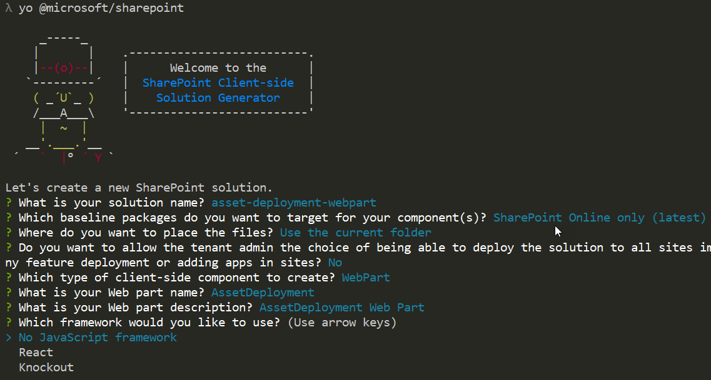

  После этого Yeoman устанавливает необходимые зависимости и формирует шаблоны файлов решения. Это может занять несколько минут. При этом Yeoman также включает в проект веб-часть **AssetDeployment**.

6. После завершения скаффолдинга заблокируйте версию зависимостей проекта, выполнив следующую команду:

  ```sh
  npm shrinkwrap
  ```

7. Затем введите следующую команду, чтобы открыть проект веб-части в Visual Studio Code:

  ```
  code .
  ```

## <a name="create-folder-structure-for-your-sharepoint-assets"></a>Создание структуры папок для ресурсов SharePoint

Для начала необходимо создать папку **assets**, в которую мы поместим все ресурсы платформы компонентов, используемые для подготовки структур SharePoint при установке пакета.

1. Создайте папку **sharepoint** в корневой папке решения.

2. Создайте папку **assets** в новой папке **sharepoint**.

  Структура решения должна быть примерно такой, как на следующем рисунке:

  


## <a name="create-feature-framework-files-for-initial-deployment"></a>Создание файлов платформы компонентов для начального развертывания

Чтобы подготовить ресурсы SharePoint для сайтов с элементами платформы компонентов, необходимо создать нужные XML-файлы в папке ресурсов. Пакеты решений SharePoint Framework поддерживают следующие элементы:

* поля и столбцы сайтов;
* типы контента;
* экземпляры списков;
* экземпляры списков с особой схемой.

Ниже описано, как определить подготавливаемую структуру.

### <a name="to-add-an-elementxml-file-for-sharepoint-definitions"></a>Добавление файла element.xml для определений SharePoint

1. Создайте в папке **sharepoint\assets** файл **elements.xml**.

2. Скопируйте следующую структуру XML в файл **elements.xml**:

  ```xml
  <?xml version="1.0" encoding="utf-8"?>
  <Elements xmlns="http://schemas.microsoft.com/sharepoint/">

      <Field ID="{060E50AC-E9C1-4D3C-B1F9-DE0BCAC300F6}"
              Name="SPFxAmount"
              DisplayName="Amount"
              Type="Currency"
              Decimals="2"
              Min="0"
              Required="FALSE"
              Group="SPFx Columns" />

      <Field ID="{943E7530-5E2B-4C02-8259-CCD93A9ECB18}"
              Name="SPFxCostCenter"
              DisplayName="Cost Center"
              Type="Choice"
              Required="FALSE"
              Group="SPFx Columns">
          <CHOICES>
          <CHOICE>Administration</CHOICE>
          <CHOICE>Information</CHOICE>
          <CHOICE>Facilities</CHOICE>
          <CHOICE>Operations</CHOICE>
          <CHOICE>Sales</CHOICE>
          <CHOICE>Marketing</CHOICE>
          </CHOICES>
      </Field>

      <ContentType ID="0x010042D0C1C200A14B6887742B6344675C8B" 
              Name="Cost Center" 
              Group="SPFx Content Types" 
              Description="Sample content types from web part solution">
          <FieldRefs>
              <FieldRef ID="{060E50AC-E9C1-4D3C-B1F9-DE0BCAC300F6}" /> 
              <FieldRef ID="{943E7530-5E2B-4C02-8259-CCD93A9ECB18}" />
          </FieldRefs>
      </ContentType> 

      <ListInstance 
              CustomSchema="schema.xml"
              FeatureId="00bfea71-de22-43b2-a848-c05709900100"
              Title="SPFx List" 
              Description="SPFx List"
              TemplateType="100"
              Url="Lists/SPFxList">
      </ListInstance>

  </Elements>
  ```

  Обратите внимание на следующие особенности вставленной структуры XML:
  * Мы подготавливаем для сайта два поля, тип контента и экземпляр списка с особой схемой.
  * В определениях используется стандартная схема Feature Framework, хорошо знакомая разработчикам решений для SharePoint.
  * Добавляемый тип контента ссылается на настраиваемые поля.
  * Мы используем атрибут **CustomSchema** в элементе **ListInstance**, чтобы определить файл schema.xml для подготовки списка. Так в основе списка по-прежнему будет лежать стандартный шаблон (в данном случае — обычный настраиваемый список 100), но мы можем создать альтернативное определение во время начальной подготовки.

  Дополнительные сведения об используемых структурах схемы см. в статье [Использование компонентов в SharePoint Foundation](https://msdn.microsoft.com/en-us/library/office/ms460318(v=office.14).aspx) на сайте MSDN.

### <a name="to-add-a-schemaxml-file-for-defining-list-structure"></a>Добавление файла schema.xml для определения структуры списка

Выполняя предыдущий шаг, мы ссылались на файл **schema.xml** в атрибуте **CustomSchema** элемента **ListInstance**, поэтому нам нужно включить его в наш пакет. 

1. Создайте в папке **sharepoint\assets** файл **schema.xml**.

2. Скопируйте приведенную ниже структуру XML в файл **schema.xml**.

  ```xml
  <List xmlns:ows="Microsoft SharePoint" Title="Basic List" EnableContentTypes="TRUE" FolderCreation="FALSE" Direction="$Resources:Direction;" Url="Lists/Basic List" BaseType="0" xmlns="http://schemas.microsoft.com/sharepoint/">
    <MetaData>
      <ContentTypes>
        <ContentTypeRef ID="0x010042D0C1C200A14B6887742B6344675C8B" />
      </ContentTypes>
      <Fields></Fields>
      <Views>
        <View BaseViewID="1" Type="HTML" WebPartZoneID="Main" DisplayName="$Resources:core,objectiv_schema_mwsidcamlidC24;" DefaultView="TRUE" MobileView="TRUE" MobileDefaultView="TRUE" SetupPath="pages\viewpage.aspx" ImageUrl="/_layouts/images/generic.png" Url="AllItems.aspx">
          <XslLink Default="TRUE">main.xsl</XslLink>
          <JSLink>clienttemplates.js</JSLink>
          <RowLimit Paged="TRUE">30</RowLimit>
          <Toolbar Type="Standard" />
          <ViewFields>
            <FieldRef Name="LinkTitle"></FieldRef>
            <FieldRef Name="SPFxAmount"></FieldRef>
            <FieldRef Name="SPFxCostCenter"></FieldRef>
          </ViewFields>
          <Query>
            <OrderBy>
              <FieldRef Name="ID" />
            </OrderBy>
          </Query>
        </View>
      </Views>
      <Forms>
        <Form Type="DisplayForm" Url="DispForm.aspx" SetupPath="pages\form.aspx" WebPartZoneID="Main" />
        <Form Type="EditForm" Url="EditForm.aspx" SetupPath="pages\form.aspx" WebPartZoneID="Main" />
        <Form Type="NewForm" Url="NewForm.aspx" SetupPath="pages\form.aspx" WebPartZoneID="Main" />
      </Forms>
    </MetaData>
  </List>
  ```

Обратите внимание на следующие особенности вставленной структуры XML:
* Элемент **ContentTypeRef** ссылается на настраиваемый тип контента, развертываемый с помощью файла **elements.xml**.
* Элемент **FieldRef** ссылается на настраиваемые поля **SPFxAmount** и **SPFxCostCenter**.

Дополнительные сведения об используемых структурах схемы см. в статье [Общие сведения о файлах Schema.xml](https://msdn.microsoft.com/en-us/library/office/ms459356(v=office.14).aspx) на сайте MSDN.

## <a name="ensure-that-definitions-are-taken-into-use-in-build-pipeline"></a>Добавление определений в пакет решения

Теперь мы создали необходимые структуры для автоматической подготовки ресурсов SharePoint при развертывании решения. Далее необходимо сделать так, чтобы эти XML-файлы были упакованы в файле решения.

1. Откройте файл **package-solution.json** из папки config.

  В файле **package-solution.json** определяются метаданные пакета, как показано в следующем фрагменте кода:

  ```json
  {
    "$schema": "https://dev.office.com/json-schemas/spfx-build/package-solution.schema.json",
    "solution": {
      "name": "asset-deployment-webpart-client-side-solution",
      "id": "6690f11b-012f-4268-bc33-3086eb2dd287",
      "version": "1.0.0.0",
      "includeClientSideAssets": true
    },
    "paths": {
      "zippedPackage": "solution/asset-deployment-webpart.sppkg"
    }
  }

  ```

2. Чтобы новые файлы Feature Framework учитывались при упаковке решения, необходимо включить определение компонента Feature Framework для пакета решения. Добавим определение JSON для нужного компонента в структуру решения, как показано в приведенном ниже фрагменте кода.

  ```json
  {
    "$schema": "https://dev.office.com/json-schemas/spfx-build/package-solution.schema.json",
    "solution": {
      "name": "asset-deployment-webpart-client-side-solution",
      "id": "6690f11b-012f-4268-bc33-3086eb2dd287",
      "version": "1.0.0.0",
      "includeClientSideAssets": true,
      "features": [{
        "title": "asset-deployment-webpart-client-side-solution",
        "description": "asset-deployment-webpart-client-side-solution",
        "id": "523fe887-ced5-4036-b564-8dad5c6c6e24",
        "version": "1.0.0.0",
        "assets": {
          "elementManifests": [
            "elements.xml"
          ],
          "elementFiles":[
            "schema.xml"
          ]
        }
      }]
    },
    "paths": {
      "zippedPackage": "solution/asset-deployment-webpart.sppkg"
    }
  }
  ```

Обратите внимание на следующие особенности добавленных определений json:

* В принципе, пакет может включать несколько компонентов, так как объект **features** является коллекцией, однако это не рекомендуется.

* В разделе elementManifests мы ссылаемся на файл **elements.xml**, чтобы он был правильно упакован в фактической структуре XML компонента как файл манифеста элемента.

* Определение может включать несколько файлов element.xml, которые будут выполняться в том же порядке, в котором они упоминаются в определении JSON. Как правило, не рекомендуется использовать несколько файлов element.xml, так как это сильно усложняет разработку. Вы можете определить все необходимые ресурсы в файле element.xml.

## <a name="deploy-and-test-asset-provisioning"></a>Развертывание и тестирование подготовки ресурсов

Теперь все готово к развертыванию решения в SharePoint. Так как мы подготавливаем ресурсы прямо на сайтах SharePoint при установке решения, эту возможность невозможно протестировать в локальной или сетевой версии Workbench.

1. Чтобы упаковать клиентское решение, содержащее веб-часть, и получить базовую структуру, готовую к упаковке, введите в окне консоли указанную команду:

  ```
  gulp bundle
  ```

2. Выполните следующую команду, чтобы создать пакет решения:

  ```
  gulp package-solution
  ```

  Эта команда создает пакет в папке `sharepoint/solution`:

  ```
  asset-deployment-webpart.sppkg
  ```

3. Прежде чем тестировать пакет в SharePoint, взглянем на стандартные структуры, созданные для пакета в определенных элементах платформы компонентов. Вернитесь к Visual Studio Code и разверните папку `sharepoint/solution/debug`, которая содержит необработанные структуры XML, включаемые в фактический пакет **sppkg**.

  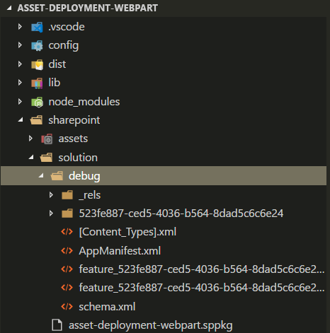

4. Разверните пакет, созданный в каталоге приложений. Перейдите в каталог приложений вашего клиента.

5. Отправьте или перетащите файл asset-deployment-webpart.sppkg из папки `sharepoint/solution` в каталог приложений. Откроется диалоговое окно для подтверждения доверия клиентскому решению.

  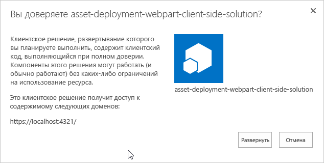

  > [!NOTE]
  > SharePoint проверяет опубликованный пакет при его развертывании, а диалоговое окно для подтверждения доверия открывается, только если пакет действителен. Вы также можете просмотреть состояние этой проверки в столбце "Допустимый пакет приложения" каталога приложений.

6. Перейдите на тот сайт, где требуется проверить подготовку ресурсов SharePoint. Это может быть любое семейство веб-сайтов в клиенте, где развернут пакет решения.

7. Нажмите значок шестеренки на верхней панели навигации справа и выберите **Добавить приложение**, чтобы перейти на страницу "Приложения".

8. В поле **Поиск** введите **deployment**, а затем нажмите клавишу **ВВОД**, чтобы отфильтровать приложения.

  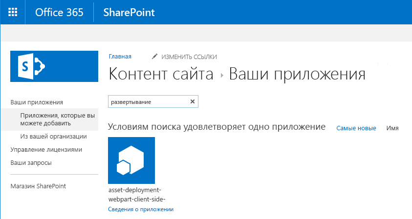

9. Выберите приложение **asset-deployment-webpart-client-side-solution**, чтобы установить его на сайте. После установки обновите страницу, нажав клавишу **F5**. Обратите внимание на то, что при развертывании пакета решения на сайте был подготовлен настраиваемый список **SPFx List**.

  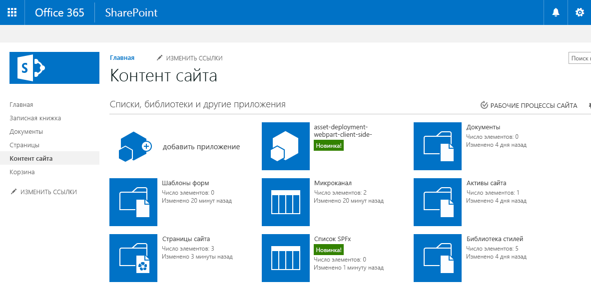


10. Выберите **SPFx List**, чтобы перейти к списку. Обратите внимание на то, что настраиваемые поля **Amount** (Количество) и **Cost Center** (Место возникновения затрат) отображаются в списке по умолчанию. 

  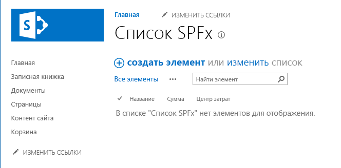


## <a name="define-upgrade-actions-for-new-version"></a>Определение действий по обновлению для новой версии

При создании новой версии решения SharePoint Framework может потребоваться внести некоторые изменения в подготовленные ресурсы SharePoint. При развертывании новой версии пакета вы можете воспользоваться поддержкой действий по обновлению, которую предоставляет платформа компонентов. 

Решения SharePoint Framework поддерживают следующие определения действий Feature Framework по обновлению:

* ApplyElementManifest
* AddContentTypeField

> [!TIP]
> Дополнительные сведения об определениях действий Feature Framework по обновлению см. в статье [Процедура обновления надстроек для SharePoint](../../../sp-add-ins/sharepoint-add-ins-update-process.md).

### <a name="to-add-a-new-elementxml-file-for-the-new-version"></a>Добавление нового файла element.xml для новой версии

1. Вернитесь к своему решению в Visual Studio Code.

2. Создайте в папке **sharepoint\assets** файл **elements-v2.xml**.

3. Скопируйте приведенную ниже структуру XML в файл **elements-v2.xml**, в котором определяется новый подготавливаемый список SharePoint под названием **New List** (Новый список).

  ```xml
  <?xml version="1.0" encoding="utf-8"?>
  <Elements xmlns="http://schemas.microsoft.com/sharepoint/">

      <ListInstance 
              FeatureId="00bfea71-de22-43b2-a848-c05709900100"
              Title="New List" 
              Description="New list provisioned from v2"
              TemplateType="100"
              Url="Lists/NewList">
      </ListInstance>

  </Elements>
  ```

4. Нам также потребуется определение фактических действий Feature Framework по обновлению, поэтому создайте в папке **sharepoint\assets** файл **upgrade-actions-v2.xml**.

5. Скопируйте следующую структуру XML в файл **upgrade-actions-v2.xml**: Обратите внимание на то, что ссылка на GUID компонента в пути указывает на автоматически созданную папку, вложенную в папку `sharepoint/solution/debug`, и зависит от конкретного решения. Этот GUID также совпадает с идентификатором GUID компонента, который мы определили в файле **package-solution.json**.

  ```xml
  <ApplyElementManifests>
        <ElementManifest Location="523fe887-ced5-4036-b564-8dad5c6c6e24\elements-v2.xml" />
  </ApplyElementManifests>

  ```

### <a name="to-deploy-the-new-version-to-sharepoint"></a>Развертывание новой версии в SharePoint

Далее нам нужно обновить версию решения и версию компонента, ответственного за подготовку ресурсов.

> [!IMPORTANT]
> Номер версии решения указывает среде SharePoint, что доступна новая версия решения SharePoint Framework. Обновление версии гарантирует выполнение соответствующих действий при обновлении пакета решения на существующих сайтах.

1. Откройте файл **package-solution.json** из папки config и замените значения версий решения и компонента на "2.0.0.0". 

2. Кроме того, необходимо включить файл **elements-v2.xml** в раздел elementManifest и добавить элемент upgradeActions с указателем на новый файл **upgrade-actions-v2.xml**.

  Ниже полностью представлен файл **package-solution.json** с необходимыми изменениями. Обратите внимание, что идентификаторы в вашем решении могут слегка отличаться от представленных здесь, так что сосредоточьтесь только на добавлении недостающих элементов.

  ```json
  {
    "$schema": "https://dev.office.com/json-schemas/spfx-build/package-solution.schema.json",
    "solution": {
      "name": "asset-deployment-webpart-client-side-solution",
      "id": "6690f11b-012f-4268-bc33-3086eb2dd287",
      "version": "2.0.0.0",
      "includeClientSideAssets": true,
      "features": [{
        "title": "asset-deployment-webpart-client-side-solution",
        "description": "asset-deployment-webpart-client-side-solution",
        "id": "523fe887-ced5-4036-b564-8dad5c6c6e24",
        "version": "2.0.0.0",
        "assets": {
          "elementManifests": [
            "elements.xml",
            "elements-v2.xml"
          ],
          "elementFiles":[
            "schema.xml"
          ],
          "upgradeActions":[
            "upgrade-actions-v2.xml"
          ]
        }
      }]
    },
    "paths": {
      "zippedPackage": "solution/asset-deployment-webpart.sppkg"
    }
  }
  ```

  > [!IMPORTANT]
  > Обратите внимание на то, что мы также добавили файл **elements-v2.xml** в раздел elementManifest. Благодаря этому при установке пакета версии 2.0 на чистом сайте результат будет таким же, как и при обновлении пакетов.

3. Чтобы повторно упаковать клиентское решение, содержащее веб-часть, и получить базовую структуру, готовую к упаковке, введите в окне консоли указанную команду.

  ```
  gulp bundle
  ```
4. Выполните следующую команду, чтобы создать пакет решения:

  ```
  gulp package-solution
  ```

  Эта команда создает новую версию пакета решения в папке `sharepoint/solution`. Обратите внимание: заглянув в папку `sharepoint/solution/debug`, вы можете легко убедиться, что обновленные XML-файлы включены в пакет решения.

5. Далее необходимо развернуть новую версию, созданную в каталоге приложений. Перейдите к каталогу приложений вашего клиента.

6. Отправьте или перетащите файл asset-deployment-webpart.sppkg из папки `sharepoint/solution` в каталог приложений. SharePoint предложит вам подтвердить переопределение текущей версии.

  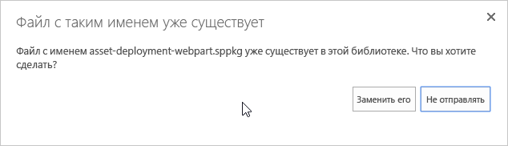

7. Выберите **Заменить**, чтобы добавить последнюю версию в каталог приложений.

8. Выберите **Развернуть**, чтобы *подтвердить доверие* к последней версии.

  Обратите внимание на то, что в столбце "Версия приложения" для решения **asset-deployment-webpart-client-side-solution** теперь отображается значение "2.0.0.0".

  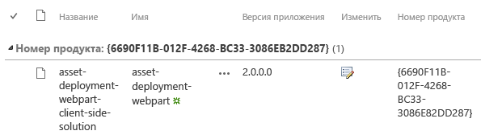

### <a name="to-update-an-existing-instance-in-the-site"></a>Обновление существующего экземпляра на сайте

Теперь, когда пакет в каталоге приложений обновлен, мы можем перейти к фактическому сайту с содержимым SharePoint и обновить существующий экземпляр.

1. Перейдите на сайт, где вы развернули первую версию решения SharePoint Framework.

2. Перейдите на страницу **Содержимое сайта**.

3. Выберите **Сведения** в контекстном меню решения **asset-deployment-webpart-client-side-solution**.

  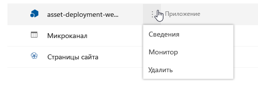

  Вы увидите текущие сведения об установленном решении SharePoint Framework. На этой странице теперь также отображается текст *Доступна новая версия этого приложения. Получите ее сейчас*.

  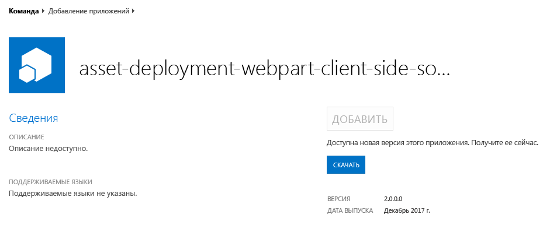

4. Нажмите кнопку **ПОЛУЧИТЬ**, чтобы приступить к обновлению пакета.

  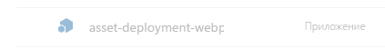

  Если вы перейдете в классический интерфейс, то увидите больше сведений о действии обновления, применяемом к решению SharePoint Framework. 

  

  > [!NOTE]
  > Так как SharePoint Framework использует ту же инфраструктуру приложений, что и надстройки SharePoint, состояние обновления указывает на возможность обновления надстройки или приложения. 

  Обновление может занять некоторое время, но когда состояние решения снова станет обычным, вы можете нажать клавишу **F5**, чтобы обновить страницу содержимого сайта и убедиться, что новый список *New List* был успешно подготовлен при обновлении.

  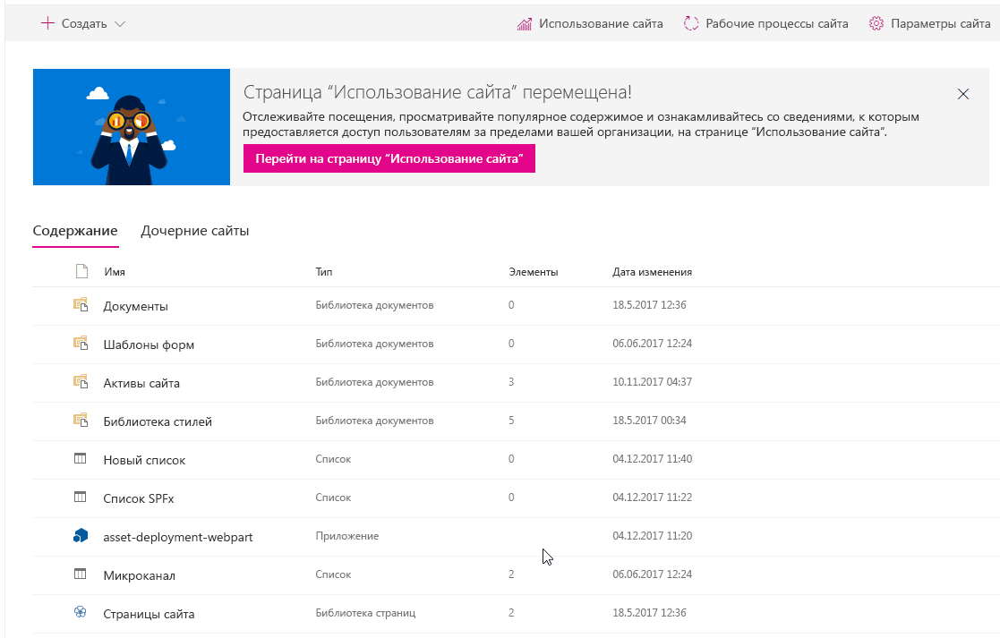

  Теперь мы успешно обновили этот экземпляр до последней версии. Этот способ подготовки ресурсов SharePoint с помощью Feature Framework похож на тот, что используется для модели надстроек SharePoint. Основное отличие заключается в том, что ресурсы подготавливаются непосредственно на обычном сайте SharePoint, так как в решениях SharePoint Framework нет такого понятия, как приложение или сайт приложения.

> [!NOTE]
> Если вы обнаружили ошибку в документации или SharePoint Framework, сообщите о ней разработчикам SharePoint, указав в [списке проблем для репозитория sp-dev-docs](https://github.com/SharePoint/sp-dev-docs/issues). Заранее спасибо!

## <a name="see-also"></a>См. также

- [Подготовка ресурсов SharePoint с пакетом решения](../../toolchain/provision-sharepoint-assets.md)
- [Пример решения: развертывание ресурсов SharePoint в составе пакета SPFx](https://github.com/SharePoint/sp-dev-fx-webparts/tree/master/samples/react-feature-framework)
