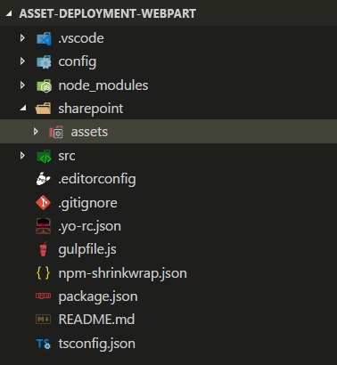
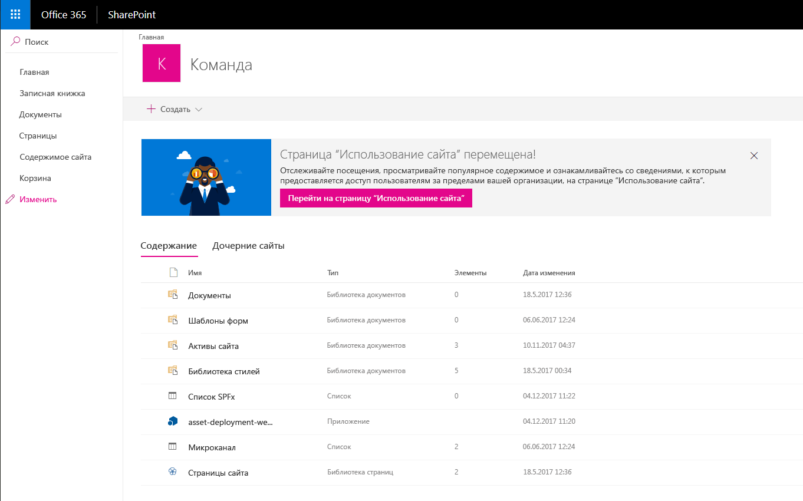
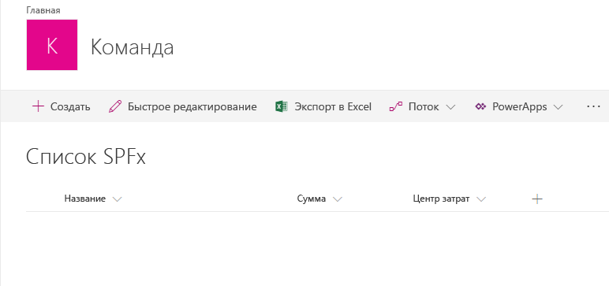

# <a name="provision-sharepoint-assets-from-your-sharepoint-client-side-web-part"></a><span data-ttu-id="2d501-103">Подготовка ресурсов SharePoint из клиентской веб-части SharePoint</span><span class="sxs-lookup"><span data-stu-id="2d501-103">Provisioning SharePoint assets from your SharePoint client-side web part</span></span>

<span data-ttu-id="2d501-104">Ресурсы SharePoint можно добавлять в решения SharePoint Framework и развертывать на сайтах SharePoint при установке решения.</span><span class="sxs-lookup"><span data-stu-id="2d501-104">SharePoint assets can be provisioned as part of the SharePoint Framework solution, and are deployed to SharePoint sites when the solution is installed on it.</span></span> 

<span data-ttu-id="2d501-105">Прежде чем начинать, выполните следующие действия, чтобы получить базовые навыки создания клиентской веб-части:</span><span class="sxs-lookup"><span data-stu-id="2d501-105">Before you start, complete the procedures in the following articles to ensure that you understand the basic flow of creating a custom client-side web part:</span></span>

* <span data-ttu-id="2d501-106">[Создайте свою первую веб-часть](build-a-hello-world-web-part.md).</span><span class="sxs-lookup"><span data-stu-id="2d501-106">[Build your first web part](build-a-hello-world-web-part.md)</span></span>
* <span data-ttu-id="2d501-107">[Подключите веб-часть к SharePoint](connect-to-sharepoint.md).</span><span class="sxs-lookup"><span data-stu-id="2d501-107">[Connect your client-side web part to SharePoint](connect-to-sharepoint.md)</span></span> 

<span data-ttu-id="2d501-108">Эти действия также показаны в видео на [канале SharePoint PnP в YouTube](https://www.youtube.com/watch?v=qAqNk_X82QM&list=PLR9nK3mnD-OXvSWvS2zglCzz4iplhVrKq&index=8).</span><span class="sxs-lookup"><span data-stu-id="2d501-108">You can also follow these steps by watching the video on the [SharePoint PnP YouTube Channel](https://www.youtube.com/watch?v=qAqNk_X82QM&list=PLR9nK3mnD-OXvSWvS2zglCzz4iplhVrKq&index=8).</span></span> 

<a href="https://www.youtube.com/watch?v=qAqNk_X82QM&list=PLR9nK3mnD-OXvSWvS2zglCzz4iplhVrKq&index=8">

</a>


## <a name="create-a-new-web-part-project"></a><span data-ttu-id="2d501-109">Создание проекта веб-части</span><span class="sxs-lookup"><span data-stu-id="2d501-109">Create a new web part project</span></span>

1. <span data-ttu-id="2d501-110">Создайте каталог проекта в любом расположении:</span><span class="sxs-lookup"><span data-stu-id="2d501-110">Create a new project directory in your favorite location:</span></span>

  ```
  md asset-deployment-webpart
  ```

2. <span data-ttu-id="2d501-111">Перейдите к каталогу проекта:</span><span class="sxs-lookup"><span data-stu-id="2d501-111">Go to the project directory:</span></span>

  ```
  cd asset-deployment-webpart
  ```
    
3. <span data-ttu-id="2d501-112">Создайте клиентскую веб-часть с помощью генератора Yeoman для SharePoint:</span><span class="sxs-lookup"><span data-stu-id="2d501-112">Create a new client-side web part solution by running the Yeoman SharePoint Generator:</span></span>

  ```
  yo @microsoft/sharepoint
  ```

4. <span data-ttu-id="2d501-113">Когда появится запрос, сделайте следующее:</span><span class="sxs-lookup"><span data-stu-id="2d501-113">When prompted:</span></span>

  * <span data-ttu-id="2d501-114">Оставьте имя по умолчанию (**asset-deployment-webpart**) для своего решения и нажмите клавишу ВВОД.</span><span class="sxs-lookup"><span data-stu-id="2d501-114">Accept the default asset-deployment-webpart as your solution name and choose Enter.</span></span>
  * <span data-ttu-id="2d501-115">Выберите **SharePoint Online only (latest)** (Только SharePoint Online, последняя версия) и нажмите клавишу ВВОД.</span><span class="sxs-lookup"><span data-stu-id="2d501-115">Select **SharePoint Online only (latest)**, and select Enter.</span></span>
  * <span data-ttu-id="2d501-116">Выберите вариант **Use the current folder** (Использовать текущую папку) для размещения файлов.</span><span class="sxs-lookup"><span data-stu-id="2d501-116">Select **Use the current folder** as the location for the files.</span></span>
  * <span data-ttu-id="2d501-117">Выберите **N**, чтобы сделать установку расширения обязательной на каждом сайте при его использовании.</span><span class="sxs-lookup"><span data-stu-id="2d501-117">Select **N** to require the extension to be installed on each site explicitly when it's being used.</span></span> 
  * <span data-ttu-id="2d501-118">Выберите **WebPart** в качестве типа создаваемого клиентского компонента.</span><span class="sxs-lookup"><span data-stu-id="2d501-118">Select **Extension** as the client-side component type to be created.</span></span> 

5. <span data-ttu-id="2d501-119">Далее требуется указать информацию о веб-части:</span><span class="sxs-lookup"><span data-stu-id="2d501-119">The next set of prompts will ask for specific information about your web part:</span></span>

  * <span data-ttu-id="2d501-120">Введите **AssetDeployment** в качестве имени веб-части и нажмите клавишу ВВОД.</span><span class="sxs-lookup"><span data-stu-id="2d501-120">Type AssetDeployment for the web part name and choose Enter.</span></span>
  * <span data-ttu-id="2d501-121">Введите описание веб-части **AssetDeployment Web Part** (Веб-часть AssetDeployment) и нажмите клавишу ВВОД.</span><span class="sxs-lookup"><span data-stu-id="2d501-121">Enter AssetDeployment Web Part as the description of the web part and choose Enter.</span></span> 
  * <span data-ttu-id="2d501-122">Оставьте выбранным параметр **No JavaScript web framework** (Не использовать платформу веб-решений JavaScript) и нажмите клавишу ВВОД, чтобы продолжить.</span><span class="sxs-lookup"><span data-stu-id="2d501-122">Accept the default No JavaScipt web framework option for the framework and choose Enter to continue.</span></span>

  

  <span data-ttu-id="2d501-124">После этого Yeoman устанавливает необходимые зависимости и формирует шаблоны файлов решения.</span><span class="sxs-lookup"><span data-stu-id="2d501-124">At this point, Yeoman installs the required dependencies and scaffolds the solution files along with the HelloWorld extension.</span></span> <span data-ttu-id="2d501-125">Это может занять несколько минут.</span><span class="sxs-lookup"><span data-stu-id="2d501-125">This might take a few minutes.</span></span> <span data-ttu-id="2d501-126">При этом Yeoman также включает в проект веб-часть **AssetDeployment**.</span><span class="sxs-lookup"><span data-stu-id="2d501-126">Yeoman scaffolds the project to include your **AssetDeployment** web part as well.</span></span>

6. <span data-ttu-id="2d501-127">После завершения скаффолдинга заблокируйте версию зависимостей проекта, выполнив следующую команду:</span><span class="sxs-lookup"><span data-stu-id="2d501-127">After the scaffolding completes, lock down the version of the project dependencies by running the following command:</span></span>

  ```sh
  npm shrinkwrap
  ```

7. <span data-ttu-id="2d501-128">Затем введите следующую команду, чтобы открыть проект веб-части в Visual Studio Code:</span><span class="sxs-lookup"><span data-stu-id="2d501-128">Next, type the following to open the web part project in Visual Studio Code:</span></span>

  ```
  code .
  ```

## <a name="create-folder-structure-for-your-sharepoint-assets"></a><span data-ttu-id="2d501-129">Создание структуры папок для ресурсов SharePoint</span><span class="sxs-lookup"><span data-stu-id="2d501-129">Create folder structure for your SharePoint assets</span></span>

<span data-ttu-id="2d501-130">Для начала необходимо создать папку **assets**, в которую мы поместим все ресурсы платформы компонентов, используемые для подготовки структур SharePoint при установке пакета.</span><span class="sxs-lookup"><span data-stu-id="2d501-130">We'll first need to create an **assets** folder where we will place all feature framework assets used to provision SharePoint structures when package is installed.</span></span>

1. <span data-ttu-id="2d501-131">Создайте папку **sharepoint** в корневой папке решения.</span><span class="sxs-lookup"><span data-stu-id="2d501-131">Create folder called **sharepoint** to the root of the solution</span></span>

2. <span data-ttu-id="2d501-132">Создайте папку **assets** в новой папке **sharepoint**.</span><span class="sxs-lookup"><span data-stu-id="2d501-132">Create folder called **assets** as a sub folder for the just created **sharepoint** folder</span></span>

  <span data-ttu-id="2d501-133">Структура решения должна быть примерно такой, как на следующем рисунке:</span><span class="sxs-lookup"><span data-stu-id="2d501-133">Your solution structure should look similar to the following picture:</span></span>

  


## <a name="create-feature-framework-files-for-initial-deployment"></a><span data-ttu-id="2d501-135">Создание файлов платформы компонентов для начального развертывания</span><span class="sxs-lookup"><span data-stu-id="2d501-135">Create feature framework files for initial deployment</span></span>

<span data-ttu-id="2d501-136">Чтобы подготовить ресурсы SharePoint для сайтов с элементами платформы компонентов, необходимо создать нужные XML-файлы в папке ресурсов.</span><span class="sxs-lookup"><span data-stu-id="2d501-136">To be able to provision SharePoint assets to sites with feature framework elements, we'll need to create needed xml files to the asset folder. Supported elements for the SharePoint Framework solution packages are following:</span></span> <span data-ttu-id="2d501-137">Пакеты решений SharePoint Framework поддерживают следующие элементы:</span><span class="sxs-lookup"><span data-stu-id="2d501-137">Supported elements for the SharePoint Framework solution packages are following:</span></span>

* <span data-ttu-id="2d501-138">поля и столбцы сайтов;</span><span class="sxs-lookup"><span data-stu-id="2d501-138">Fields / Site columns</span></span>
* <span data-ttu-id="2d501-139">типы контента;</span><span class="sxs-lookup"><span data-stu-id="2d501-139">Content types</span></span>
* <span data-ttu-id="2d501-140">экземпляры списков;</span><span class="sxs-lookup"><span data-stu-id="2d501-140">List instances</span></span>
* <span data-ttu-id="2d501-141">экземпляры списков с особой схемой.</span><span class="sxs-lookup"><span data-stu-id="2d501-141">List instances with custom schema</span></span>

<span data-ttu-id="2d501-142">Ниже описано, как определить подготавливаемую структуру.</span><span class="sxs-lookup"><span data-stu-id="2d501-142">In following steps, we'll define the needed structure to be provisioned.</span></span>

### <a name="to-add-an-elementxml-file-for-sharepoint-definitions"></a><span data-ttu-id="2d501-143">Добавление файла element.xml для определений SharePoint</span><span class="sxs-lookup"><span data-stu-id="2d501-143">To add an element.xml file for SharePoint definitions</span></span>

1. <span data-ttu-id="2d501-144">Создайте в папке **sharepoint\assets** файл **elements.xml**.</span><span class="sxs-lookup"><span data-stu-id="2d501-144">Create a new file inside the **sharepoint\assets** folder named **elements.xml**</span></span>

2. <span data-ttu-id="2d501-145">Скопируйте следующую структуру XML в файл **elements.xml**:</span><span class="sxs-lookup"><span data-stu-id="2d501-145">Copy the following xml structure into **elements.xml**.</span></span>

  ```xml
  <?xml version="1.0" encoding="utf-8"?>
  <Elements xmlns="http://schemas.microsoft.com/sharepoint/">

      <Field ID="{060E50AC-E9C1-4D3C-B1F9-DE0BCAC300F6}"
              Name="SPFxAmount"
              DisplayName="Amount"
              Type="Currency"
              Decimals="2"
              Min="0"
              Required="FALSE"
              Group="SPFx Columns" />

      <Field ID="{943E7530-5E2B-4C02-8259-CCD93A9ECB18}"
              Name="SPFxCostCenter"
              DisplayName="Cost Center"
              Type="Choice"
              Required="FALSE"
              Group="SPFx Columns">
          <CHOICES>
          <CHOICE>Administration</CHOICE>
          <CHOICE>Information</CHOICE>
          <CHOICE>Facilities</CHOICE>
          <CHOICE>Operations</CHOICE>
          <CHOICE>Sales</CHOICE>
          <CHOICE>Marketing</CHOICE>
          </CHOICES>
      </Field>

      <ContentType ID="0x010042D0C1C200A14B6887742B6344675C8B" 
              Name="Cost Center" 
              Group="SPFx Content Types" 
              Description="Sample content types from web part solution">
          <FieldRefs>
              <FieldRef ID="{060E50AC-E9C1-4D3C-B1F9-DE0BCAC300F6}" /> 
              <FieldRef ID="{943E7530-5E2B-4C02-8259-CCD93A9ECB18}" />
          </FieldRefs>
      </ContentType> 

      <ListInstance 
              CustomSchema="schema.xml"
              FeatureId="00bfea71-de22-43b2-a848-c05709900100"
              Title="SPFx List" 
              Description="SPFx List"
              TemplateType="100"
              Url="Lists/SPFxList">
      </ListInstance>

  </Elements>
  ```

  <span data-ttu-id="2d501-146">Обратите внимание на следующие особенности вставленной структуры XML:</span><span class="sxs-lookup"><span data-stu-id="2d501-146">Note the following about the pasted XML structure:</span></span>
  * <span data-ttu-id="2d501-147">Мы подготавливаем для сайта два поля, тип контента и экземпляр списка с особой схемой.</span><span class="sxs-lookup"><span data-stu-id="2d501-147">We are provisioning two fields, content type and a list instance with custom schema to the site</span></span>
  * <span data-ttu-id="2d501-148">В определениях используется стандартная схема Feature Framework, хорошо знакомая разработчикам решений для SharePoint.</span><span class="sxs-lookup"><span data-stu-id="2d501-148">Definitions are using standard Feature Framework schema, which is well known for SharePoint developers</span></span>
  * <span data-ttu-id="2d501-149">Добавляемый тип контента ссылается на настраиваемые поля.</span><span class="sxs-lookup"><span data-stu-id="2d501-149">Custom fields are being referenced in the introduced content type</span></span>
  * <span data-ttu-id="2d501-150">Мы используем атрибут **CustomSchema** в элементе **ListInstance**, чтобы определить файл schema.xml для подготовки списка.</span><span class="sxs-lookup"><span data-stu-id="2d501-150">We use the **CustomSchema** attribute in the **ListInstance** element to define a provisioning time schema.xml file for the list.</span></span> <span data-ttu-id="2d501-151">Так в основе списка по-прежнему будет лежать стандартный шаблон (в данном случае — обычный настраиваемый список 100), но мы можем создать альтернативное определение во время начальной подготовки.</span><span class="sxs-lookup"><span data-stu-id="2d501-151">We use CustomSchema attribute in the ListInstance element to define provisioning time schema.xml file for the list. This way list is still based on out-of-the-box list template (Normal custom list '100' in this case), but we can define alternative provisioning definition during initial provisioning.</span></span>

  <span data-ttu-id="2d501-152">Дополнительные сведения об используемых структурах схемы см. в статье [Использование компонентов в SharePoint Foundation](https://msdn.microsoft.com/en-us/library/office/ms460318(v=office.14).aspx) на сайте MSDN.</span><span class="sxs-lookup"><span data-stu-id="2d501-152">More details about the used schema structures can be found at [FUsing Features in SharePoint Foundation](https://msdn.microsoft.com/en-us/library/office/ms460318(v=office.14).aspx) on MSDN.</span></span>

### <a name="to-add-a-schemaxml-file-for-defining-list-structure"></a><span data-ttu-id="2d501-153">Добавление файла schema.xml для определения структуры списка</span><span class="sxs-lookup"><span data-stu-id="2d501-153">To add a schema.xml file for defining list structure</span></span>

<span data-ttu-id="2d501-154">Выполняя предыдущий шаг, мы ссылались на файл **schema.xml** в атрибуте **CustomSchema** элемента **ListInstance**, поэтому нам нужно включить его в наш пакет.</span><span class="sxs-lookup"><span data-stu-id="2d501-154">In previous step, we referenced **schema.xml** file in the **CustomSchema** attribute of the **ListInstance** element, so we'll need to include that in our package.</span></span> 

1. <span data-ttu-id="2d501-155">Создайте в папке **sharepoint\assets** файл **schema.xml**.</span><span class="sxs-lookup"><span data-stu-id="2d501-155">Create a new file inside the **sharepoint\assets** folder named as **schema.xml**</span></span>

2. <span data-ttu-id="2d501-156">Скопируйте приведенную ниже структуру XML в файл **schema.xml**.</span><span class="sxs-lookup"><span data-stu-id="2d501-156">Copy the following xml structure into **schema.xml**.</span></span>

  ```xml
  <List xmlns:ows="Microsoft SharePoint" Title="Basic List" EnableContentTypes="TRUE" FolderCreation="FALSE" Direction="$Resources:Direction;" Url="Lists/Basic List" BaseType="0" xmlns="http://schemas.microsoft.com/sharepoint/">
    <MetaData>
      <ContentTypes>
        <ContentTypeRef ID="0x010042D0C1C200A14B6887742B6344675C8B" />
      </ContentTypes>
      <Fields></Fields>
      <Views>
        <View BaseViewID="1" Type="HTML" WebPartZoneID="Main" DisplayName="$Resources:core,objectiv_schema_mwsidcamlidC24;" DefaultView="TRUE" MobileView="TRUE" MobileDefaultView="TRUE" SetupPath="pages\viewpage.aspx" ImageUrl="/_layouts/images/generic.png" Url="AllItems.aspx">
          <XslLink Default="TRUE">main.xsl</XslLink>
          <JSLink>clienttemplates.js</JSLink>
          <RowLimit Paged="TRUE">30</RowLimit>
          <Toolbar Type="Standard" />
          <ViewFields>
            <FieldRef Name="LinkTitle"></FieldRef>
            <FieldRef Name="SPFxAmount"></FieldRef>
            <FieldRef Name="SPFxCostCenter"></FieldRef>
          </ViewFields>
          <Query>
            <OrderBy>
              <FieldRef Name="ID" />
            </OrderBy>
          </Query>
        </View>
      </Views>
      <Forms>
        <Form Type="DisplayForm" Url="DispForm.aspx" SetupPath="pages\form.aspx" WebPartZoneID="Main" />
        <Form Type="EditForm" Url="EditForm.aspx" SetupPath="pages\form.aspx" WebPartZoneID="Main" />
        <Form Type="NewForm" Url="NewForm.aspx" SetupPath="pages\form.aspx" WebPartZoneID="Main" />
      </Forms>
    </MetaData>
  </List>
  ```

<span data-ttu-id="2d501-157">Обратите внимание на следующие особенности вставленной структуры XML:</span><span class="sxs-lookup"><span data-stu-id="2d501-157">Note the following about the included XML structure:</span></span>
* <span data-ttu-id="2d501-158">Элемент **ContentTypeRef** ссылается на настраиваемый тип контента, развертываемый с помощью файла **elements.xml**.</span><span class="sxs-lookup"><span data-stu-id="2d501-158">Custom content type deployed using **elements.xml** file is referenced in the **ContentTypeRef** element</span></span>
* <span data-ttu-id="2d501-159">Элемент **FieldRef** ссылается на настраиваемые поля **SPFxAmount** и **SPFxCostCenter**.</span><span class="sxs-lookup"><span data-stu-id="2d501-159">Custom fields called **SPFxAmount** and **SPFxCostCenter** are being referenced in the **FieldRef** element</span></span>

<span data-ttu-id="2d501-160">Дополнительные сведения об используемых структурах схемы см. в статье [Общие сведения о файлах Schema.xml](https://msdn.microsoft.com/en-us/library/office/ms459356(v=office.14).aspx) на сайте MSDN.</span><span class="sxs-lookup"><span data-stu-id="2d501-160">More details on the used schema structures can be found from [Understanding Schema.xml Files](https://msdn.microsoft.com/en-us/library/office/ms459356(v=office.14).aspx) article at MSDN.</span></span>

## <a name="ensure-that-definitions-are-taken-into-use-in-build-pipeline"></a><span data-ttu-id="2d501-161">Добавление определений в пакет решения</span><span class="sxs-lookup"><span data-stu-id="2d501-161">Ensure that definitions are taken into use in build pipeline</span></span>

<span data-ttu-id="2d501-162">Теперь мы создали необходимые структуры для автоматической подготовки ресурсов SharePoint при развертывании решения.</span><span class="sxs-lookup"><span data-stu-id="2d501-162">Now we have created the needed structures for provisioning SharePoint assets automatically from the solution when it's deployed. Next step is to ensure that we package these xml files as part of the solution file.</span></span> <span data-ttu-id="2d501-163">Далее необходимо сделать так, чтобы эти XML-файлы были упакованы в файле решения.</span><span class="sxs-lookup"><span data-stu-id="2d501-163">The next step is to ensure that we package these XML files as part of the solution file.</span></span>

1. <span data-ttu-id="2d501-164">Откройте файл **package-solution.json** из папки config.</span><span class="sxs-lookup"><span data-stu-id="2d501-164">Open **package-solution.json** from the config folder.</span></span>

  <span data-ttu-id="2d501-165">В файле **package-solution.json** определяются метаданные пакета, как показано в следующем фрагменте кода:</span><span class="sxs-lookup"><span data-stu-id="2d501-165">The **package-solution.json** file defines the package metadata as shown in the following code:</span></span>

  ```json
  {
    "$schema": "https://dev.office.com/json-schemas/spfx-build/package-solution.schema.json",
    "solution": {
      "name": "asset-deployment-webpart-client-side-solution",
      "id": "6690f11b-012f-4268-bc33-3086eb2dd287",
      "version": "1.0.0.0",
      "includeClientSideAssets": true
    },
    "paths": {
      "zippedPackage": "solution/asset-deployment-webpart.sppkg"
    }
  }

  ```

2. <span data-ttu-id="2d501-166">Чтобы новые файлы Feature Framework учитывались при упаковке решения, необходимо включить определение компонента Feature Framework для пакета решения.</span><span class="sxs-lookup"><span data-stu-id="2d501-166">To ensure that our newly added Feature Framework files are taken into account while solution is being packaged, we'll need to include a Feature Framework feature definition for the solution package. Let's include a JSON definition for needed feature inside of the solution structure as demonstrated in below code.</span></span> <span data-ttu-id="2d501-167">Добавим определение JSON для нужного компонента в структуру решения, как показано в приведенном ниже фрагменте кода.</span><span class="sxs-lookup"><span data-stu-id="2d501-167">Let's include a JSON definition for the needed feature inside of the solution structure as demonstrated in the following code.</span></span>

  ```json
  {
    "$schema": "https://dev.office.com/json-schemas/spfx-build/package-solution.schema.json",
    "solution": {
      "name": "asset-deployment-webpart-client-side-solution",
      "id": "6690f11b-012f-4268-bc33-3086eb2dd287",
      "version": "1.0.0.0",
      "includeClientSideAssets": true,
      "features": [{
        "title": "asset-deployment-webpart-client-side-solution",
        "description": "asset-deployment-webpart-client-side-solution",
        "id": "523fe887-ced5-4036-b564-8dad5c6c6e24",
        "version": "1.0.0.0",
        "assets": {
          "elementManifests": [
            "elements.xml"
          ],
          "elementFiles":[
            "schema.xml"
          ]
        }
      }]
    },
    "paths": {
      "zippedPackage": "solution/asset-deployment-webpart.sppkg"
    }
  }
  ```

<span data-ttu-id="2d501-168">Обратите внимание на следующие особенности добавленных определений json:</span><span class="sxs-lookup"><span data-stu-id="2d501-168">Note the following about the added json definitions:</span></span>

* <span data-ttu-id="2d501-169">В принципе, пакет может включать несколько компонентов, так как объект **features** является коллекцией, однако это не рекомендуется.</span><span class="sxs-lookup"><span data-stu-id="2d501-169">You can technically have multiple features in the package since **features** is a collection, which is not however recommended</span></span>

* <span data-ttu-id="2d501-170">В разделе elementManifests мы ссылаемся на файл **elements.xml**, чтобы он был правильно упакован в фактической структуре XML компонента как файл манифеста элемента.</span><span class="sxs-lookup"><span data-stu-id="2d501-170">**elements.xml** is referenced under elementManifests, so that it's packaged properly for the actual feature xml structure as element manifest file</span></span>

* <span data-ttu-id="2d501-171">Определение может включать несколько файлов element.xml, которые будут выполняться в том же порядке, в котором они упоминаются в определении JSON.</span><span class="sxs-lookup"><span data-stu-id="2d501-171">You can have multiple element.xml files in the definition and they would be executed in the order they are mentioned in the JSON definition. Typically, you should avoid usage of multiple element.xml since it adds unnecessary complexity. You can define all needed assets in single element.xml file</span></span> <span data-ttu-id="2d501-172">Как правило, не рекомендуется использовать несколько файлов element.xml, так как это сильно усложняет разработку.</span><span class="sxs-lookup"><span data-stu-id="2d501-172">Typically, you should avoid using multiple element.xml files because this adds unnecessary complexity.</span></span> <span data-ttu-id="2d501-173">Вы можете определить все необходимые ресурсы в файле element.xml.</span><span class="sxs-lookup"><span data-stu-id="2d501-173">You can define all needed assets in a single element.xml file.</span></span>

## <a name="deploy-and-test-asset-provisioning"></a><span data-ttu-id="2d501-174">Развертывание и тестирование подготовки ресурсов</span><span class="sxs-lookup"><span data-stu-id="2d501-174">Deploy and test asset provisioning</span></span>

<span data-ttu-id="2d501-175">Теперь все готово к развертыванию решения в SharePoint.</span><span class="sxs-lookup"><span data-stu-id="2d501-175">Now you are ready to deploy the solution to a SharePoint site and to have the  automatically associated on the site level.</span></span> <span data-ttu-id="2d501-176">Так как мы подготавливаем ресурсы прямо на сайтах SharePoint при установке решения, эту возможность невозможно протестировать в локальной или сетевой версии Workbench.</span><span class="sxs-lookup"><span data-stu-id="2d501-176">Now you are ready to deploy the solution to SharePoint. Since in this case we are provisioning assets directly to the SharePoint sites when the solution is installed, you cannot test the capability in local or in online workbench.</span></span>

1. <span data-ttu-id="2d501-177">Чтобы упаковать клиентское решение, содержащее веб-часть, и получить базовую структуру, готовую к упаковке, введите в окне консоли указанную команду:</span><span class="sxs-lookup"><span data-stu-id="2d501-177">In the console window, enter the following command to package your client-side solution that contains the web part, so that we get the basic structure ready for packaging:</span></span>

  ```
  gulp bundle
  ```

2. <span data-ttu-id="2d501-178">Выполните следующую команду, чтобы создать пакет решения:</span><span class="sxs-lookup"><span data-stu-id="2d501-178">Execute the following command to create the solution package:</span></span>

  ```
  gulp package-solution
  ```

  <span data-ttu-id="2d501-179">Эта команда создает пакет в папке `sharepoint/solution`:</span><span class="sxs-lookup"><span data-stu-id="2d501-179">The command creates the package in the `sharepoint/solution` folder:</span></span>

  ```
  asset-deployment-webpart.sppkg
  ```

3. <span data-ttu-id="2d501-180">Прежде чем тестировать пакет в SharePoint, взглянем на стандартные структуры, созданные для пакета в определенных элементах платформы компонентов.</span><span class="sxs-lookup"><span data-stu-id="2d501-180">Before testing the package in the SharePoint, let's quickly have a look on the default structures created for the package around the defined feature framework elements. Move back to Visual Studio Code side and expand  folder, which contains the raw xml structures to be included in the actual sppkg package.</span></span> <span data-ttu-id="2d501-181">Вернитесь к Visual Studio Code и разверните папку `sharepoint/solution/debug`, которая содержит необработанные структуры XML, включаемые в фактический пакет **sppkg**.</span><span class="sxs-lookup"><span data-stu-id="2d501-181">Before testing the package in the SharePoint, let's quickly have a look on the default structures created for the package around the defined feature framework elements. Move back to Visual Studio Code side and expand `sharepoint/solution/debug` folder, which contains the raw xml structures to be included in the actual **sppkg** package.</span></span>

  

4. <span data-ttu-id="2d501-183">Разверните пакет, созданный в каталоге приложений.</span><span class="sxs-lookup"><span data-stu-id="2d501-183">Next you need to deploy the package that was generated to the App Catalog.</span></span> <span data-ttu-id="2d501-184">Перейдите в каталог приложений вашего клиента.</span><span class="sxs-lookup"><span data-stu-id="2d501-184">Go to your tenant's App Catalog.</span></span>

5. <span data-ttu-id="2d501-185">Отправьте или перетащите файл asset-deployment-webpart.sppkg из папки `sharepoint/solution` в каталог приложений.</span><span class="sxs-lookup"><span data-stu-id="2d501-185">Upload or drag and drop the asset-deployment-webpart.sppkg located in the `sharepoint/solution` folder to the App Catalog.</span></span> <span data-ttu-id="2d501-186">Откроется диалоговое окно для подтверждения доверия клиентскому решению.</span><span class="sxs-lookup"><span data-stu-id="2d501-186">SharePoint displays a dialog and asks you to trust the client-side solution.</span></span>

  

  > [!NOTE]
  > <span data-ttu-id="2d501-188">SharePoint проверяет опубликованный пакет при его развертывании, а диалоговое окно для подтверждения доверия открывается, только если пакет действителен.</span><span class="sxs-lookup"><span data-stu-id="2d501-188">SharePoint validates the published package when it's deployed and you only see the trust dialog, if package is valid for deployment.</span></span> <span data-ttu-id="2d501-189">Вы также можете просмотреть состояние этой проверки в столбце "Допустимый пакет приложения" каталога приложений.</span><span class="sxs-lookup"><span data-stu-id="2d501-189">You can also see the status around this validation from the 'Valid App Package' column in the app catalog.</span></span>

6. <span data-ttu-id="2d501-190">Перейдите на тот сайт, где требуется проверить подготовку ресурсов SharePoint.</span><span class="sxs-lookup"><span data-stu-id="2d501-190">Go to the site where you want to test SharePoint asset provisioning. This could be any site collection in the tenant where you deployed this solution package.</span></span> <span data-ttu-id="2d501-191">Это может быть любое семейство веб-сайтов в клиенте, где развернут пакет решения.</span><span class="sxs-lookup"><span data-stu-id="2d501-191">Go to the site where you want to test SharePoint asset provisioning. This could be any site collection in the tenant where you deployed this solution package.</span></span>

7. <span data-ttu-id="2d501-192">Нажмите значок шестеренки на верхней панели навигации справа и выберите **Добавить приложение**, чтобы перейти на страницу "Приложения".</span><span class="sxs-lookup"><span data-stu-id="2d501-192">Select the gears icon on the top navigation bar on the right, and then select **Add an app** to go to your Apps page.</span></span>

8. <span data-ttu-id="2d501-193">В поле **Поиск** введите **deployment**, а затем нажмите клавишу ВВОД, чтобы отфильтровать приложения.</span><span class="sxs-lookup"><span data-stu-id="2d501-193">In the **Search** box, enter **app**, and then select Enter to filter your apps.</span></span>

  

9. <span data-ttu-id="2d501-195">Выберите приложение **asset-deployment-webpart-client-side-solution**, чтобы установить его на сайте.</span><span class="sxs-lookup"><span data-stu-id="2d501-195">Select the **app-extension-client-side-solution** app to install the solution on the site.</span></span> <span data-ttu-id="2d501-196">После установки обновите страницу, нажав клавишу **F5**.</span><span class="sxs-lookup"><span data-stu-id="2d501-196">When the installation is completed, refresh the page by selecting **F5**.</span></span> <span data-ttu-id="2d501-197">Обратите внимание на то, что при развертывании пакета решения на сайте был подготовлен настраиваемый список **SPFx List**.</span><span class="sxs-lookup"><span data-stu-id="2d501-197">Notice how the custom **SPFx List** has been also provisioned to site as part of the solution package deployment.</span></span>

  


10. <span data-ttu-id="2d501-199">Выберите **SPFx List**, чтобы перейти к списку.</span><span class="sxs-lookup"><span data-stu-id="2d501-199">Click **SPFx List** to move to the list</span></span> <span data-ttu-id="2d501-200">Обратите внимание на то, что настраиваемые поля **Amount** (Количество) и **Cost Center** (Место возникновения затрат) отображаются в списке по умолчанию.</span><span class="sxs-lookup"><span data-stu-id="2d501-200">Notice how the custom fields **Amount** and **Cost Center** are visible automatically in the default view of the list.</span></span> 

  


## <a name="define-upgrade-actions-for-new-version"></a><span data-ttu-id="2d501-202">Определение действий по обновлению для новой версии</span><span class="sxs-lookup"><span data-stu-id="2d501-202">Define upgrade actions for new version</span></span>

<span data-ttu-id="2d501-p115">При создании новой версии решения SharePoint Framework может потребоваться внести некоторые изменения в подготовленные ресурсы SharePoint. При развертывании новой версии пакета вы можете воспользоваться поддержкой действий по обновлению, которую предоставляет платформа компонентов.</span><span class="sxs-lookup"><span data-stu-id="2d501-p115">Whenever you build a new version of your SharePoint Framework solution, you might have some required changes on the provisioned SharePoint assets. You can take advantage of the Feature Framework upgrade action support when a new version of the package is being deployed.</span></span> 

<span data-ttu-id="2d501-205">Решения SharePoint Framework поддерживают следующие определения действий Feature Framework по обновлению:</span><span class="sxs-lookup"><span data-stu-id="2d501-205">SharePoint Framework solutions do support following Feature Framework upgrade action definitions</span></span>

* <span data-ttu-id="2d501-206">ApplyElementManifest</span><span class="sxs-lookup"><span data-stu-id="2d501-206">ApplyElementManifest</span></span>
* <span data-ttu-id="2d501-207">AddContentTypeField</span><span class="sxs-lookup"><span data-stu-id="2d501-207">AddContentTypeField</span></span>

> [!TIP]
> <span data-ttu-id="2d501-208">Дополнительные сведения об определениях действий Feature Framework по обновлению см. в статье [Процедура обновления надстроек для SharePoint](../../../sp-add-ins/sharepoint-add-ins-update-process.md).</span><span class="sxs-lookup"><span data-stu-id="2d501-208">You can read more details around the Feature Framework upgrade action definitions from [SharePoint add-ins update process](../../../sp-add-ins/sharepoint-add-ins-update-process.md) article at MSDN.</span></span>

### <a name="to-add-a-new-elementxml-file-for-the-new-version"></a><span data-ttu-id="2d501-209">Добавление нового файла element.xml для новой версии</span><span class="sxs-lookup"><span data-stu-id="2d501-209">Add new element.xml file for the new version</span></span>

1. <span data-ttu-id="2d501-210">Вернитесь к своему решению в Visual Studio Code.</span><span class="sxs-lookup"><span data-stu-id="2d501-210">Move back to your solution in the Visual Studio code.</span></span>

2. <span data-ttu-id="2d501-211">Создайте в папке **sharepoint\assets** файл **elements-v2.xml**.</span><span class="sxs-lookup"><span data-stu-id="2d501-211">Create a new file inside the **sharepoint\assets** folder named as **elements-v2.xml**</span></span>

3. <span data-ttu-id="2d501-212">Скопируйте приведенную ниже структуру XML в файл **elements-v2.xml**, в котором определяется новый подготавливаемый список SharePoint под названием **New List** (Новый список).</span><span class="sxs-lookup"><span data-stu-id="2d501-212">Copy the following xml structure into **elements-v2.xml**, which defines a new SharePoint list to be provisioned with a title of **New List**.</span></span>

  ```xml
  <?xml version="1.0" encoding="utf-8"?>
  <Elements xmlns="http://schemas.microsoft.com/sharepoint/">

      <ListInstance 
              FeatureId="00bfea71-de22-43b2-a848-c05709900100"
              Title="New List" 
              Description="New list provisioned from v2"
              TemplateType="100"
              Url="Lists/NewList">
      </ListInstance>

  </Elements>
  ```

4. <span data-ttu-id="2d501-213">Нам также потребуется определение фактических действий Feature Framework по обновлению, поэтому создайте в папке **sharepoint\assets** файл **upgrade-actions-v2.xml**.</span><span class="sxs-lookup"><span data-stu-id="2d501-213">We also need a definition for actual Feature Framework upgrade actions, so create a new file inside the **sharepoint\assets** folder named as **upgrade-actions-v2.xml**</span></span>

5. <span data-ttu-id="2d501-214">Скопируйте следующую структуру XML в файл **upgrade-actions-v2.xml**:</span><span class="sxs-lookup"><span data-stu-id="2d501-214">Copy the following xml structure into **schema.xml**.</span></span> <span data-ttu-id="2d501-215">Обратите внимание на то, что ссылка на GUID компонента в пути указывает на автоматически созданную папку, вложенную в папку `sharepoint/solution/debug`, и зависит от конкретного решения.</span><span class="sxs-lookup"><span data-stu-id="2d501-215">Copy the following xml structure into upgrade-actions-v2.xml. Notice that the feature guid reference in the path refers to the automatically created folder under   folder and has to be updated based on your solution. This guid is also matching on the guid of the feature, which we defined in the package-solution.json file.</span></span> <span data-ttu-id="2d501-216">Этот GUID также совпадает с идентификатором GUID компонента, который мы определили в файле **package-solution.json**.</span><span class="sxs-lookup"><span data-stu-id="2d501-216">This GUID also matches the GUID of the feature, which we defined in the **package-solution.json** file.</span></span>

  ```xml
  <ApplyElementManifests>
        <ElementManifest Location="523fe887-ced5-4036-b564-8dad5c6c6e24\elements-v2.xml" />
  </ApplyElementManifests>

  ```

### <a name="to-deploy-the-new-version-to-sharepoint"></a><span data-ttu-id="2d501-217">Развертывание новой версии в SharePoint</span><span class="sxs-lookup"><span data-stu-id="2d501-217">To deploy the new version to SharePoint</span></span>

<span data-ttu-id="2d501-218">Далее нам нужно обновить версию решения и версию компонента, ответственного за подготовку ресурсов.</span><span class="sxs-lookup"><span data-stu-id="2d501-218">Next we'll need to update both solution version and the feature version responsible of the asset provisioning.</span></span>

> [!IMPORTANT]
> <span data-ttu-id="2d501-219">Номер версии решения указывает среде SharePoint, что доступна новая версия решения SharePoint Framework.</span><span class="sxs-lookup"><span data-stu-id="2d501-219">The solution version indicates for SharePoint that there's a new version of the SharePoint Framework solution available.</span></span> <span data-ttu-id="2d501-220">Обновление версии гарантирует выполнение соответствующих действий при обновлении пакета решения на существующих сайтах.</span><span class="sxs-lookup"><span data-stu-id="2d501-220">The feature version ensures that the upgrade actions are executed accordingly when the solution package is upgraded in the existing site(s).</span></span>

1. <span data-ttu-id="2d501-221">Откройте файл **package-solution.json** из папки config и замените значения версий решения и компонента на "2.0.0.0".</span><span class="sxs-lookup"><span data-stu-id="2d501-221">Open **package-solution.json** from the config folder and update the version values for both the solution and the feature to "2.0.0.0".</span></span> 

2. <span data-ttu-id="2d501-222">Кроме того, необходимо включить файл **elements-v2.xml** в раздел elementManifest и добавить элемент upgradeActions с указателем на новый файл **upgrade-actions-v2.xml**.</span><span class="sxs-lookup"><span data-stu-id="2d501-222">Open package-solution.json from the config folder and update version values for both solution and feature to "2.0.0.0". We will also need to include **elements-v2.xml** under the elementManifest section and also to include upgradeActions element with a pointer to just created **upgrade-actions-v2.xml** file.</span></span>

  <span data-ttu-id="2d501-p118">Ниже полностью представлен файл **package-solution.json** с необходимыми изменениями. Обратите внимание, что идентификаторы в вашем решении могут слегка отличаться от представленных здесь, так что сосредоточьтесь только на добавлении недостающих элементов.</span><span class="sxs-lookup"><span data-stu-id="2d501-p118">Here's a complete **package-solution.json** file with needed changes. Notice that identifiers for your solution could be slightly different, so concentrate on adding only the missing pieces.</span></span>

  ```json
  {
    "$schema": "https://dev.office.com/json-schemas/spfx-build/package-solution.schema.json",
    "solution": {
      "name": "asset-deployment-webpart-client-side-solution",
      "id": "6690f11b-012f-4268-bc33-3086eb2dd287",
      "version": "2.0.0.0",
      "includeClientSideAssets": true,
      "features": [{
        "title": "asset-deployment-webpart-client-side-solution",
        "description": "asset-deployment-webpart-client-side-solution",
        "id": "523fe887-ced5-4036-b564-8dad5c6c6e24",
        "version": "2.0.0.0",
        "assets": {
          "elementManifests": [
            "elements.xml",
            "elements-v2.xml"
          ],
          "elementFiles":[
            "schema.xml"
          ],
          "upgradeActions":[
            "upgrade-actions-v2.xml"
          ]
        }
      }]
    },
    "paths": {
      "zippedPackage": "solution/asset-deployment-webpart.sppkg"
    }
  }
  ```

  > [!IMPORTANT]
  > <span data-ttu-id="2d501-225">Обратите внимание на то, что мы также добавили файл **elements-v2.xml** в раздел elementManifest.</span><span class="sxs-lookup"><span data-stu-id="2d501-225">Notice that we also included the **elements-v2.xml** under the elementManifest section.</span></span> <span data-ttu-id="2d501-226">Благодаря этому при установке пакета версии 2.0 на чистом сайте результат будет таким же, как и при обновлении пакетов.</span><span class="sxs-lookup"><span data-stu-id="2d501-226">Notice that we also included the elements-v2.xml under the elementManifest section. This will ensure that when you install this package to a clean site as a version 2.0, end result will match with the upgraded packages.</span></span>

3. <span data-ttu-id="2d501-227">Чтобы повторно упаковать клиентское решение, содержащее веб-часть, и получить базовую структуру, готовую к упаковке, введите в окне консоли указанную команду.</span><span class="sxs-lookup"><span data-stu-id="2d501-227">In the console window, enter the following command to re-package your client-side solution that contains the web part, so that we get the basic structure ready for packaging:</span></span>

  ```
  gulp bundle
  ```
4. <span data-ttu-id="2d501-228">Выполните следующую команду, чтобы создать пакет решения:</span><span class="sxs-lookup"><span data-stu-id="2d501-228">Execute the following command to create the solution package:</span></span>

  ```
  gulp package-solution
  ```

  <span data-ttu-id="2d501-229">Эта команда создает новую версию пакета решения в папке `sharepoint/solution`.</span><span class="sxs-lookup"><span data-stu-id="2d501-229">The command creates a new version of the solution package in the `sharepoint/solution` folder.</span></span> <span data-ttu-id="2d501-230">Обратите внимание: заглянув в папку `sharepoint/solution/debug`, вы можете легко убедиться, что обновленные XML-файлы включены в пакет решения.</span><span class="sxs-lookup"><span data-stu-id="2d501-230">The command will create new version of the solution package to the  folder. Notice that you can easily confirm from  folder that updated xml files are included in the solution package</span></span>

5. <span data-ttu-id="2d501-231">Далее необходимо развернуть новую версию, созданную в каталоге приложений.</span><span class="sxs-lookup"><span data-stu-id="2d501-231">Next you need to deploy the new version that was generated to the App Catalog.</span></span> <span data-ttu-id="2d501-232">Перейдите к каталогу приложений вашего клиента.</span><span class="sxs-lookup"><span data-stu-id="2d501-232">Go to your tenant's App Catalog.</span></span>

6. <span data-ttu-id="2d501-233">Отправьте или перетащите файл asset-deployment-webpart.sppkg из папки `sharepoint/solution` в каталог приложений.</span><span class="sxs-lookup"><span data-stu-id="2d501-233">Upload or drag and drop the asset-deployment-webpart.sppkg located in the `sharepoint/solution` folder to the App Catalog.</span></span> <span data-ttu-id="2d501-234">SharePoint предложит вам подтвердить переопределение текущей версии.</span><span class="sxs-lookup"><span data-stu-id="2d501-234">SharePoint requests that you confirm overriding the existing version.</span></span>

  

7. <span data-ttu-id="2d501-236">Выберите **Заменить**, чтобы добавить последнюю версию в каталог приложений.</span><span class="sxs-lookup"><span data-stu-id="2d501-236">Select **Replace It** to update the latest version to the App Catalog.</span></span>

8. <span data-ttu-id="2d501-237">Выберите **Развернуть**, чтобы *подтвердить доверие* к последней версии.</span><span class="sxs-lookup"><span data-stu-id="2d501-237">Select **Deploy** to *trust* the latest version.</span></span>

  <span data-ttu-id="2d501-238">Обратите внимание на то, что в столбце "Версия приложения" для решения **asset-deployment-webpart-client-side-solution** теперь отображается значение "2.0.0.0".</span><span class="sxs-lookup"><span data-stu-id="2d501-238">Notice that the App Version column for the **asset-deployment-webpart-client-side-solution** is now updated to be "2.0.0.0".</span></span>

  

### <a name="to-update-an-existing-instance-in-the-site"></a><span data-ttu-id="2d501-240">Обновление существующего экземпляра на сайте</span><span class="sxs-lookup"><span data-stu-id="2d501-240">To update an existing instance in the site</span></span>

<span data-ttu-id="2d501-241">Теперь, когда пакет в каталоге приложений обновлен, мы можем перейти к фактическому сайту с содержимым SharePoint и обновить существующий экземпляр.</span><span class="sxs-lookup"><span data-stu-id="2d501-241">Now that the package has been updated in the App Catalog, we can move to the actual SharePoint content site and perform the upgrade for the existing instance.</span></span>

1. <span data-ttu-id="2d501-242">Перейдите на сайт, где вы развернули первую версию решения SharePoint Framework.</span><span class="sxs-lookup"><span data-stu-id="2d501-242">Move to site where you deployed first version of the SharePoint Framework solution</span></span>

2. <span data-ttu-id="2d501-243">Перейдите на страницу **Содержимое сайта**.</span><span class="sxs-lookup"><span data-stu-id="2d501-243">Go to the **Site Contents** page.</span></span>

3. <span data-ttu-id="2d501-244">Выберите **Сведения** в контекстном меню решения **asset-deployment-webpart-client-side-solution**.</span><span class="sxs-lookup"><span data-stu-id="2d501-244">Chose **Details** from the context menu of the **asset-deployment-webpart-client-side-solution** solution</span></span>

  

  <span data-ttu-id="2d501-246">Вы увидите текущие сведения об установленном решении SharePoint Framework.</span><span class="sxs-lookup"><span data-stu-id="2d501-246">This presents the current details around the installed SharePoint Framework solution.</span></span> <span data-ttu-id="2d501-247">На этой странице теперь также отображается текст *Доступна новая версия этого приложения. Получите ее сейчас*.</span><span class="sxs-lookup"><span data-stu-id="2d501-247">This will present the current details around installed SharePoint Framework solution. This page also now shows a text as '*There is a new version of this app. Get it now*' to indicate that there's a new version available.</span></span>

  

4. <span data-ttu-id="2d501-249">Нажмите кнопку **ПОЛУЧИТЬ**, чтобы приступить к обновлению пакета.</span><span class="sxs-lookup"><span data-stu-id="2d501-249">Click **GET IT** button to start update process for the package.</span></span>

  

  <span data-ttu-id="2d501-251">Если вы перейдете в классический интерфейс, то увидите больше сведений о действии обновления, применяемом к решению SharePoint Framework.</span><span class="sxs-lookup"><span data-stu-id="2d501-251">If you move to classic experience, you can see more details on the actual upgrade action being applied for the SharePoint Framework solution.</span></span> 

  

  > [!NOTE]
  > <span data-ttu-id="2d501-253">Так как SharePoint Framework использует ту же инфраструктуру приложений, что и надстройки SharePoint, состояние обновления указывает на возможность обновления надстройки или приложения.</span><span class="sxs-lookup"><span data-stu-id="2d501-253">Because the SharePoint Framework uses the same app infrastructure as SharePoint Add-ins, the status for the upgrade indicates that the update can happen for an add-in or an app.</span></span> 

  <span data-ttu-id="2d501-254">Обновление может занять некоторое время, но когда состояние решения снова станет обычным, вы можете нажать клавишу **F5**, чтобы обновить страницу содержимого сайта и убедиться, что новый список *New List* был успешно подготовлен при обновлении.</span><span class="sxs-lookup"><span data-stu-id="2d501-254">Update can take a while, but when the solution status is moved to normal again, you can click F5 to refresh the site contents page to confirm that new list  called    has been successfully provisioned as part of the update process.</span></span>

  

  <span data-ttu-id="2d501-256">Теперь мы успешно обновили этот экземпляр до последней версии.</span><span class="sxs-lookup"><span data-stu-id="2d501-256">Now we have successfully upgraded this instance to the latest version.</span></span> <span data-ttu-id="2d501-257">Этот способ подготовки ресурсов SharePoint с помощью Feature Framework похож на тот, что используется для модели надстроек SharePoint.</span><span class="sxs-lookup"><span data-stu-id="2d501-257">This Feature Framework option for SharePoint asset provisioning is pretty much the same as it is for the SharePoint Add-in model.</span></span> <span data-ttu-id="2d501-258">Основное отличие заключается в том, что ресурсы подготавливаются непосредственно на обычном сайте SharePoint, так как в решениях SharePoint Framework нет такого понятия, как приложение или сайт приложения.</span><span class="sxs-lookup"><span data-stu-id="2d501-258">The key difference is that the assets are being provisioned directly to a normal SharePoint site, because there's no concept called app or add-in web with SharePoint Framework solutions.</span></span>

> [!NOTE]
> <span data-ttu-id="2d501-259">Если вы обнаружили ошибку в документации или SharePoint Framework, сообщите о ней разработчикам SharePoint, указав в [списке проблем для репозитория sp-dev-docs](https://github.com/SharePoint/sp-dev-docs/issues).</span><span class="sxs-lookup"><span data-stu-id="2d501-259">If you find an issue in the documentation or in the SharePoint Framework, please report that to SharePoint engineering using the [issue list at sp-dev-docs repository](https://github.com/SharePoint/sp-dev-docs/issues).</span></span> <span data-ttu-id="2d501-260">Заранее спасибо!</span><span class="sxs-lookup"><span data-stu-id="2d501-260">Thanks for your input advance.</span></span>

## <a name="see-also"></a><span data-ttu-id="2d501-261">См. также</span><span class="sxs-lookup"><span data-stu-id="2d501-261">See also</span></span>

- [<span data-ttu-id="2d501-262">Подготовка ресурсов SharePoint с пакетом решения</span><span class="sxs-lookup"><span data-stu-id="2d501-262">Provision SharePoint assets with your solution package</span></span>](../../toolchain/provision-sharepoint-assets.md)
- [<span data-ttu-id="2d501-263">Пример решения: развертывание ресурсов SharePoint в составе пакета SPFx</span><span class="sxs-lookup"><span data-stu-id="2d501-263">Sample solution - Deployment of SharePoint assets as part of SPFx package</span></span>](https://github.com/SharePoint/sp-dev-fx-webparts/tree/master/samples/react-feature-framework)
