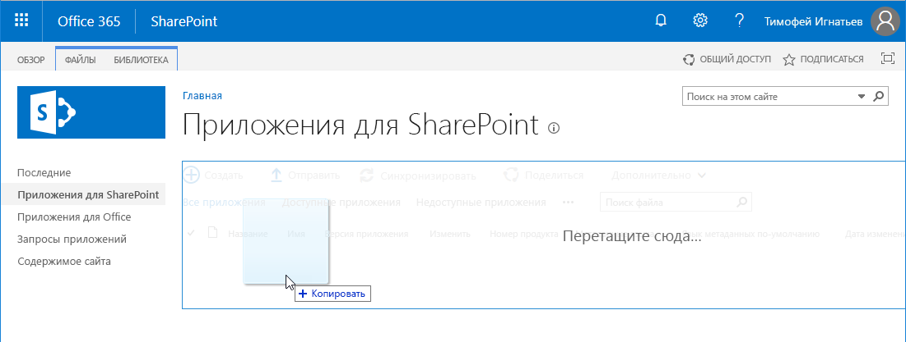
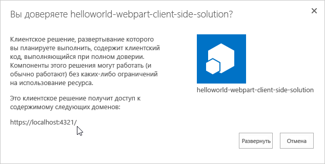
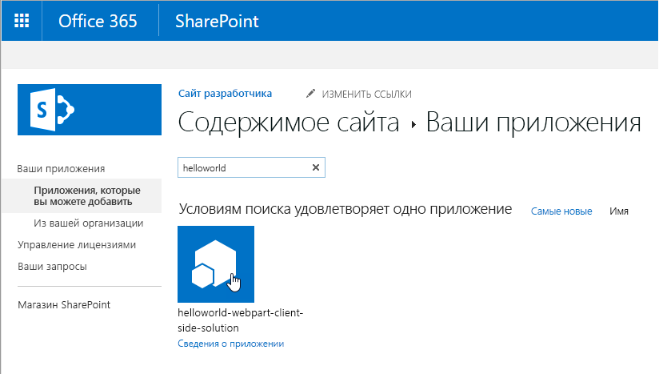
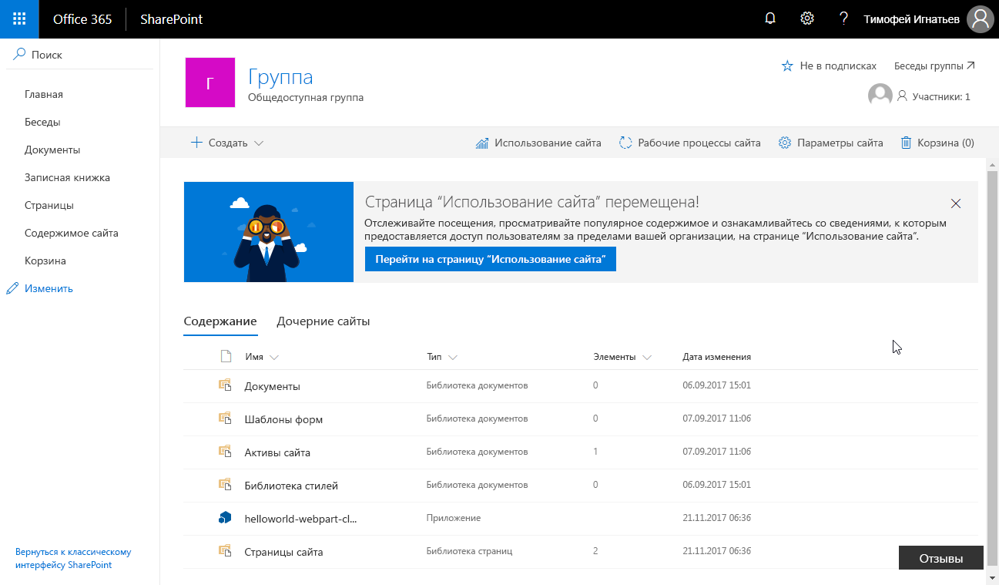
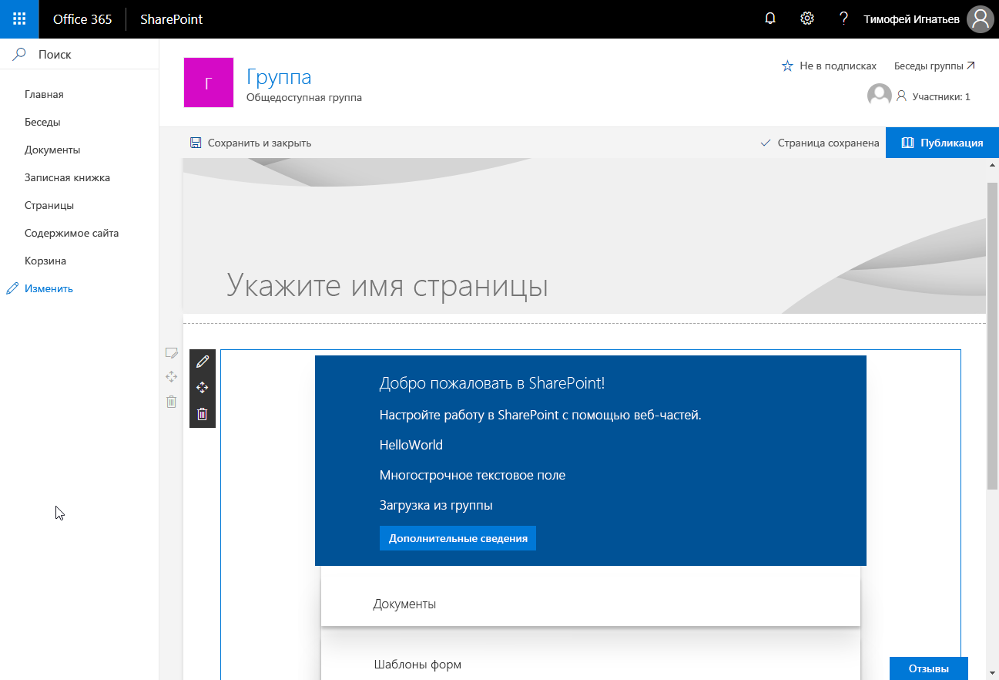
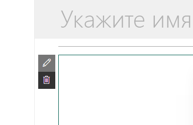
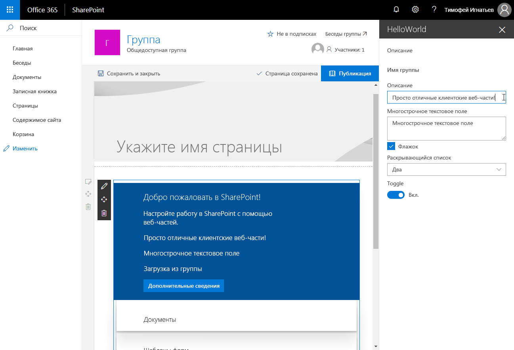

# <a name="deploy-your-client-side-web-part-to-a-sharepoint-page-hello-world-part-3"></a>Развертывание клиентской веб-части на странице SharePoint (Hello World, часть 3)

Прежде чем приступать к процедурам этой статьи, выполните инструкции из следующих статей:

* [Создание первой клиентской веб-части SharePoint](./build-a-hello-world-web-part.md)
* [Подключение клиентской веб-части к SharePoint](./connect-to-sharepoint.md)

Эти действия также показаны в видео на [канале SharePoint PnP в YouTube](https://www.youtube.com/watch?v=BpJ01ahxbiY&index=4&list=PLR9nK3mnD-OXvSWvS2zglCzz4iplhVrKq). 

<a href="https://www.youtube.com/watch?v=BpJ01ahxbiY&index=4&list=PLR9nK3mnD-OXvSWvS2zglCzz4iplhVrKq">

</a>


## <a name="package-the-helloworld-web-part"></a>Упаковка веб-части HelloWorld

1. В окне консоли перейдите к каталогу проекта веб-части, создание которого описано в статье [Создание первой клиентской веб-части SharePoint](./build-a-hello-world-web-part.md).

  ```
  cd helloworld-webpart
  ```

2. Если команда `gulp serve` все еще выполняется, остановите ее, нажав клавиши CTRL+C.

  Чтобы использовать клиентскую веб-часть не в Workbench, а на современных серверных страницах SharePoint, ее необходимо развернуть и зарегистрировать в SharePoint. Для начала необходимо упаковать веб-часть.

3. Откройте проект веб-части **HelloWorldWebPart** в Visual Studio Code или другой предпочитаемой IDE.

4. Откройте файл **package-solution.json** в папке **config**.

  В файле **package-solution.json** определяются метаданные пакета, как показано в следующем фрагменте кода:

  ```json
  {
    "$schema": "https://dev.office.com/json-schemas/spfx-build/package-solution.schema.json",
    "solution": {
      "name": "helloworld-webpart-client-side-solution",
      "id": "4432f33b-5845-4ca0-827e-a8ae68c7b945",
      "version": "1.0.0.0",
      "includeClientSideAssets": true
    },
    "paths": {
      "zippedPackage": "solution/helloworld-webpart.sppkg"
    }
  }

  ```

5. Чтобы упаковать клиентское решение, содержащее веб-часть, введите в окне консоли следующую команду:

  ```
  gulp package-solution
  ```

  Эта команда создаст пакет в папке `sharepoint/solution`:

  ```
  helloworld-webpart.sppkg
  ```

### <a name="package-contents"></a>Содержимое пакета

Чтобы упаковать веб-часть, пакет использует компонент SharePoint. По умолчанию задача gulp создает функцию для веб-части.

Вы можете просмотреть необработанное содержимое пакета в папке **sharepoint/debug**. 

Затем содержимое упаковывается в **SPPKG**-файл. Формат пакета напоминает таковой для пакета надстроек SharePoint. Для упаковки решения используются правила спецификации Microsoft Open Packaging Conventions. 

Файлы JavaScript, CSS и другие ресурсы включаются в пакет при использовании параметра `--ship`. Однако в этом случае мы сначала проверим развертывание и возможности, разместив файлы JavaScript в localhost. Этот способ развертывания рассматривается в следующем руководстве. 

> [!NOTE]
> Начиная с SharePoint Framework версии 1.4, статические ресурсы по умолчанию упаковываются в SPPKG-файлы. При развертывании пакета в каталоге приложений ресурсы автоматически размещаются в сети CDN Office 365 (если она включена) или по URL-адресу каталога приложений. Вы можете управлять этим поведением с помощью параметра `includeClientSideAssets` в файле `package-solution.json`.


## <a name="deploy-the-helloworld-package-to-app-catalog"></a>Развертывание пакета HelloWorld в каталоге приложений

Далее вам потребуется развернуть созданный пакет в каталоге приложений.

1. Перейдите в каталог приложений вашего сайта.

2. Отправьте или перетащите файл **helloworld-webpart.sppkg** в каталог приложений.

   

  При этом будет развернут пакет клиентского решения. Так как это клиентское решение с полным доверием, в SharePoint появится диалоговое окно с предложением разрешить развертывание клиентского решения.

   
    
3. Выберите **Развернуть**.


## <a name="install-the-client-side-solution-on-your-site"></a>Установка клиентского решения на сайте

1. Перейдите к семейству веб-сайтов разработчика.

2. Нажмите значок шестеренки на верхней панели навигации справа и выберите **Добавить приложение**, чтобы перейти к странице "Приложения".

3. В **поле поиска** введите **helloworld** и нажмите клавишу ВВОД, чтобы отфильтровать приложения.
    
  
    
4. Выберите приложение **helloworld-webpart-client-side-solution**, чтобы установить его на сайте.
    
  

  Теперь клиентское решение и веб-часть установлены на сайте разработчика.

На странице **Содержимое сайта** отображается состояние установки клиентского решения. Прежде чем переходить к следующему шагу, убедитесь, что установка завершена.

## <a name="preview-the-web-part-on-a-sharepoint-page"></a>Предварительный просмотр веб-части на странице SharePoint

Теперь, когда вы развернули и установили клиентское решение, добавьте веб-часть на страницу SharePoint. Помните, что такие ресурсы, как JavaScript и CSS, доступны с локального компьютера.

1. Откройте `<your-webpart-guid>.manifest.json` из папки `\dist`.
    
  Обратите внимание на то, что свойство **internalModuleBaseUrls** в разделе **loaderConfig** по-прежнему указывает на локальный компьютер:

  ```json
  "internalModuleBaseUrls": [
    "https://`your-local-machine-name`:4321/"
  ]
  ```

2. Прежде чем добавлять веб-часть на серверную страницу SharePoint, запустите локальный сервер.
    
3. В окне консоли с каталогом проекта **helloworld-webpart** выполните задачу gulp, чтобы начать обслуживание с localhost:
    
  ```
  gulp serve --nobrowser
  ```

  > [!NOTE]
  > SharePoint Workbench не запускается автоматически при использовании `--nobrowser`.

## <a name="add-the-helloworld-web-part-to-modern-page"></a>Добавление веб-части HelloWorld на современную страницу

1. В браузере перейдите на сайт, где только что было установлено решение.
    
2. Нажмите значок шестеренки на верхней панели навигации справа и выберите **Добавить страницу**.
    
3. Отредактируйте страницу. 

4. Откройте средство выбора веб-частей и выберите веб-часть **HelloWorld**.
        
Из локальной среды будут загружены ресурсы веб-части. Чтобы загрузить скрипты, размещенные на локальном компьютере, необходимо разрешить в браузере выполнение небезопасных скриптов. Убедитесь, что в вашем браузере включено выполнение небезопасных скриптов для данного сеанса.
    
Должна появиться веб-часть **HelloWorld**, создание которой описано в предыдущей статье, получающая списки с текущего сайта. 



## <a name="edit-web-part-properties"></a>Изменение свойств веб-части

1. Выберите значок **Настроить элемент** (перо) в веб-части, чтобы открыть область свойств.

  

  Это та же область свойств, которую вы создали и проверили в Workbench.
    
2. Измените свойство **Description** (Описание), указав текст **Client-side web parts are awesome!** (Клиентские веб-части — это круто).
    
  

3. Обратите внимание на то, что веб-часть обновляется по мере ввода текста, как и на реактивной панели.
    
4. Выберите значок **x**, чтобы закрыть клиентскую область свойств.
        
5. На панели инструментов выберите **Сохранить и закрыть**, чтобы сохранить страницу.

## <a name="next-steps"></a>Дальнейшие действия

Поздравляем! Вы развернули клиентскую веб-часть на современной странице SharePoint. 

Вы можете продолжить разработку веб-части Hello World, прочитав следующую статью — [Размещение клиентской веб-части в сети доставки содержимого Office 365](./hosting-webpart-from-office-365-cdn.md). Из нее вы узнаете, как развернуть ресурсы веб-части и загрузить их из сети CDN Office 365, а не из localhost.

> [!NOTE]
> Если вы обнаружили ошибку в документации или SharePoint Framework, сообщите о ней разработчикам SharePoint, указав в [списке проблем для репозитория sp-dev-docs](https://github.com/SharePoint/sp-dev-docs/issues). Заранее спасибо!