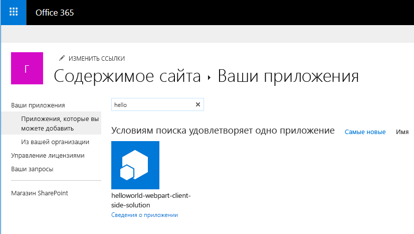

# <a name="deploy-your-client-side-web-part-to-a-sharepoint-page-hello-world-part-3"></a>Развертывание клиентской веб-части на странице SharePoint (Hello World, часть 3)

Из этой статьи вы узнаете, как развернуть клиентскую веб-часть в SharePoint и проверить ее работу на современной странице SharePoint. В этой статье рассматривается веб-часть Hello World, создание которой описано в предыдущей статье — [Подключение клиентской веб-части к SharePoint](./connect-to-sharepoint.md).

Перед началом работы убедитесь, что вы выполнили процедуры, описанные в предыдущих статьях:

* [Создание первой клиентской веб-части SharePoint](./build-a-hello-world-web-part.md)
* [Подключение клиентской веб-части к SharePoint](./connect-to-sharepoint.md)

Эти инструкции также изложены в видео на [канале SharePoint PnP в YouTube](https://www.youtube.com/watch?v=BpJ01ahxbiY&index=4&list=PLR9nK3mnD-OXvSWvS2zglCzz4iplhVrKq). 

<a href="https://www.youtube.com/watch?v=BpJ01ahxbiY&index=4&list=PLR9nK3mnD-OXvSWvS2zglCzz4iplhVrKq">

</a>


## <a name="package-the-helloworld-web-part"></a>Упаковка веб-части HelloWorld

В окне консоли перейдите к каталогу проекта веб-части, создание которого описывается в статье [Создание первой клиентской веб-части SharePoint](./build-a-hello-world-web-part.md).

```
cd helloworld-webpart
```

Если команда `gulp serve` все еще выполняется, остановите ее с помощью клавиш `Ctrl+C`.

В отличие от среды разработки, для использования клиентской веб-части на современных серверных страницах SharePoint ее необходимо развернуть и зарегистрировать в SharePoint. Для начала необходимо упаковать веб-часть.

Откройте проект веб-части **HelloWorldWebPart** в Visual Studio Code или другой предпочитаемой IDE.

Откройте файл **package-solution.json** в папке **config**.

В файле **package-solution.json** определяются метаданные пакета, как показано в следующем фрагменте кода:

```json
{
  "$schema": "https://dev.office.com/json-schemas/spfx-build/package-solution.schema.json",
  "solution": {
    "name": "helloworld-webpart-client-side-solution",
    "id": "4432f33b-5845-4ca0-827e-a8ae68c7b945",
    "version": "1.0.0.0",
    "includeClientSideAssets": true
  },
  "paths": {
    "zippedPackage": "solution/helloworld-webpart.sppkg"
  }
}

```

Чтобы упаковать клиентское решение, содержащее веб-часть, введите в окне консоли следующую команду:

```
gulp package-solution
```

Эта команда создаст пакет в папке `sharepoint/solution`:

```
helloworld-webpart.sppkg
```

### <a name="package-contents"></a>Содержимое пакета

Чтобы упаковать веб-часть, пакет использует компонент SharePoint. По умолчанию задача gulp создает следующие элементы:

* Компонент веб-части.

Вы можете просмотреть необработанное содержимое пакета в папке **sharepoint/debug**. 

Затем содержимое упаковывается в **SPPKG**-файл. Формат пакета во многом аналогичен формату пакетов надстроек SharePoint. Для упаковки решения используются правила спецификации Microsoft Open Packaging Conventions. 

Файлы JavaScript, CSS и другие ресурсы также включаются в пакет при использовании параметра `--ship`. Однако в этом случае мы сначала проверим развертывание и возможности, разместив файлы JavaScript в localhost. Этот способ развертывания рассматривается в следующем руководстве. 

> [!NOTE]
> Начиная с SharePoint Framework версии 1.4, статические ресурсы по умолчанию упаковываются в SPPKG-файлы. При развертывании пакета в каталоге приложений он автоматически размещается в сети CDN Office 365 (если она включена) или по URL-адресу каталога приложений. Вы можете управлять этим поведением с помощью параметра `includeClientSideAssets` в файле `package-solution.json`.


## <a name="deploy-the-helloworld-package-to-app-catalog"></a>Развертывание пакета HelloWorld в каталоге приложений

Далее вам потребуется развернуть созданный пакет в каталоге приложений.

Перейдите к каталогу приложений вашего сайта.

Отправьте или перетащите файл **helloworld-webpart.sppkg** в каталог приложений.

 

При этом будет развернут пакет клиентского решения. Так как это клиентское решение с полным доверием, в SharePoint появится диалоговое окно с предложением разрешить развертывание клиентского решения.

 
    
Нажмите кнопку **Развернуть**

## <a name="install-the-client-side-solution-on-your-site"></a>Установка клиентского решения на сайте

Перейдите к семейству сайтов разработчиков.

Нажмите значок шестеренки на верхней панели навигации справа и выберите команду **Добавить приложение**, чтобы перейти к странице "Приложения".

В **поле поиска** введите **helloworld** и нажмите клавишу **ВВОД**, чтобы отфильтровать приложения.
    

    
Выберите приложение **helloworld-webpart-client-side-solution**, чтобы установить его на сайте.
    


Теперь клиентское решение и веб-часть установлены на сайте разработчика.

На странице **Содержимое сайта** отображается состояние установки клиентского решения. Прежде чем переходить к следующему шагу, убедитесь, что установка завершена.

## <a name="preview-the-web-part-in-a-sharepoint-page"></a>Предварительный просмотр веб-части на странице SharePoint

Теперь, когда вы развернули и установили клиентское решение, добавьте веб-части на страницу SharePoint. Помните, что такие ресурсы, как файлы JavaScript и CSS, доступны с локального компьютера.

Откройте файл **<GUID_веб-части>.manifest.json** в папке **\dist**.
    
Обратите внимание, что свойство **internalModuleBaseUrls** в разделе **loaderConfig** по-прежнему указывает на локальный компьютер:

```json
"internalModuleBaseUrls": [
    "https://`your-local-machine-name`:4321/"
]
```

Прежде чем добавлять веб-часть на серверную страницу SharePoint, запустите локальный сервер.
    
В окне консоли с каталогом проекта **helloworld-webpart** выполните задачу gulp, чтобы начать обслуживание с localhost:
    
```
gulp serve --nobrowser
```

> [!NOTE]
> SharePoint Workbench не запускается автоматически при использовании `--nobrowser`.

## <a name="add-the-helloworld-web-part-to-modern-page"></a>Добавление веб-части HelloWorld на современную страницу

В браузере перейдите на сайт, где только что было установлено решение.
    
Нажмите значок шестеренки на верхней панели навигации справа и выберите пункт **Добавить страницу**.
    
**Измените** страницу. Откройте средство выбора веб-частей и выберите веб-часть **HelloWorld**.
        
Активы веб-части будут загружены из локальной среды. Чтобы загрузить сценарии, размещенные на локальном компьютере, необходимо разрешить в браузере выполнение небезопасных сценариев. Убедитесь, что в вашем браузере включено выполнение небезопасных сценариев для данного сеанса.
    
Должна появиться веб-часть **HelloWorld**, создание которой описано в предыдущей статье, получающая списки с текущего сайта. 


## <a name="edit-web-part-properties"></a>Изменение свойств веб-части

Нажмите значок **Настроить элемент** (перо) в веб-части, чтобы открыть область свойств.


Это та же область свойств, которую вы создали и проверили в среде разработки проектов.
    
Измените свойство **Description** (Описание), указав текст **Client-side web parts are awesome!** (Клиентские веб-части — это круто).
    


Обратите внимание, что веб-часть обновляется по мере ввода текста, как и на реактивной панели.
    
Нажмите значок **x**, чтобы закрыть клиентскую область свойств.
        
На панели инструментов выберите **Сохранить и закрыть**, чтобы сохранить страницу.

## <a name="next-steps"></a>Дальнейшие действия

Поздравляем! Вы развернули клиентскую веб-часть на современной странице SharePoint. Вы можете продолжить разработку веб-части Hello World, прочитав следующую статью — [Размещение клиентской веб-части в сети доставки содержимого Office 365](./hosting-webpart-from-office-365-cdn.md). Из нее вы узнаете, как развернуть и загрузить ресурсы веб-части из сети CDN Office 365, а не из localhost.

> [!NOTE]
> Если вы обнаружили ошибку в документации или SharePoint Framework, сообщите о ней разработчикам SharePoint, указав в [списке проблем для репозитория sp-dev-docs](https://github.com/SharePoint/sp-dev-docs/issues). Заранее спасибо!