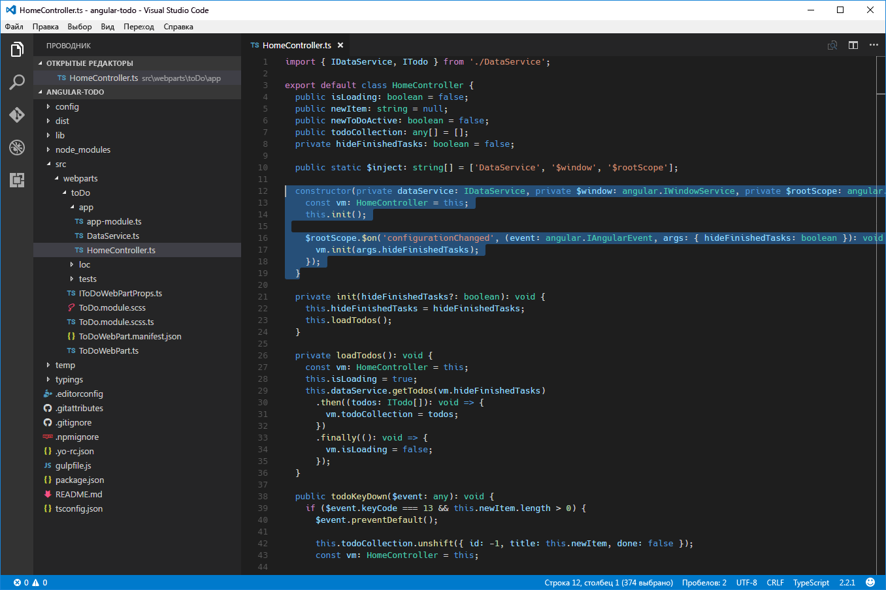
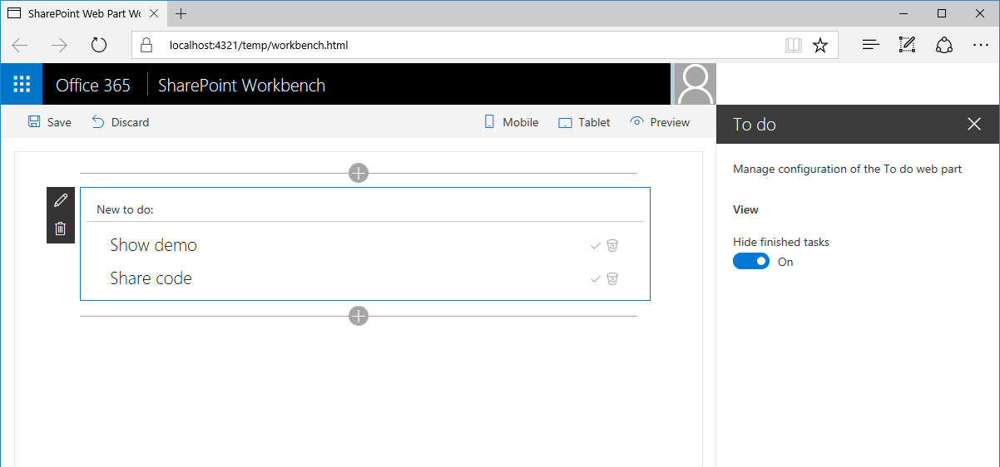

<span data-ttu-id="ea95e-p126">В редакторе кода откройте файл **app/HomeController.ts**. Дополните конструктор следующим образом:</span><span class="sxs-lookup"><span data-stu-id="ea95e-p126">In the code editor open the **app/HomeController.ts** file. Extend the constructor as follows:</span></span>

В редакторе кода откройте файл **app/HomeController.ts**. Дополните конструктор следующим образом:

```ts
constructor(private dataService: IDataService, private $window: angular.IWindowService, private $rootScope: angular.IRootScopeService) {
  const vm: HomeController = this;
  this.init();

  $rootScope.$on('configurationChanged', (event: angular.IAngularEvent, args: { hideFinishedTasks: boolean }): void => {
    vm.init(args.hideFinishedTasks);
  });
}
```



<span data-ttu-id="ea95e-224">Чтобы убедиться, что приложение Angular работает без ошибок и правильно отвечает на изменение свойства, в командной строке выполните следующую команду:</span><span class="sxs-lookup"><span data-stu-id="ea95e-224">To verify that the Angular application is working as expected and correctly responds to property changed, in the command line run:</span></span>

```sh
gulp serve
```

<span data-ttu-id="ea95e-225">Когда вы переместите переключатель **Hide finished tasks** (Скрыть завершенные задачи), веб-часть должна показать или скрыть завершенные задачи.</span><span class="sxs-lookup"><span data-stu-id="ea95e-225">If you toggle the value of the **Hide finished tasks** property, web part should show or hide finished tasks accordingly.</span></span>

