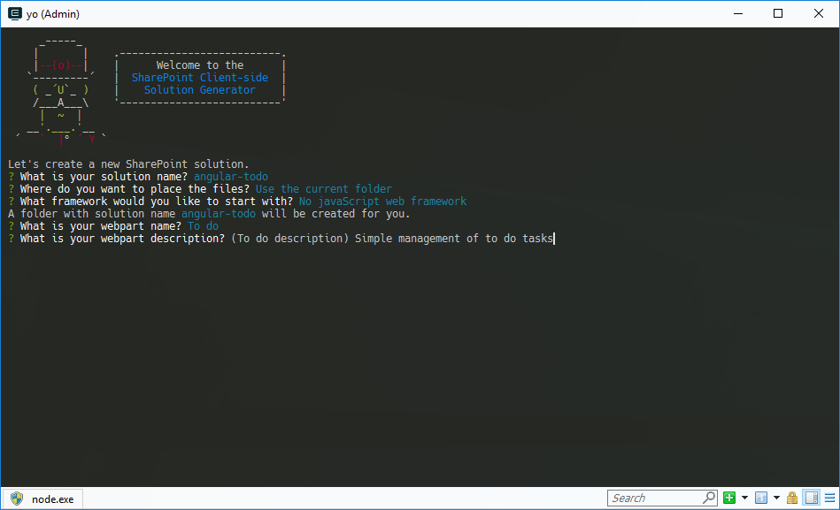
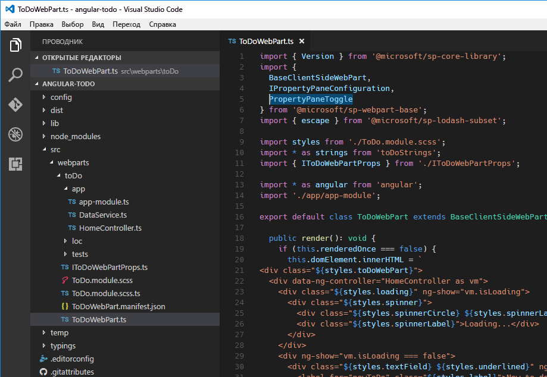
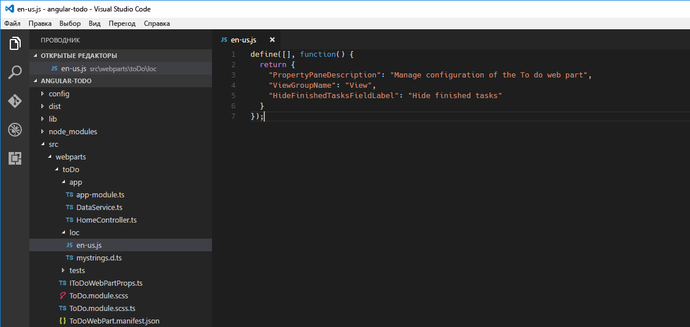
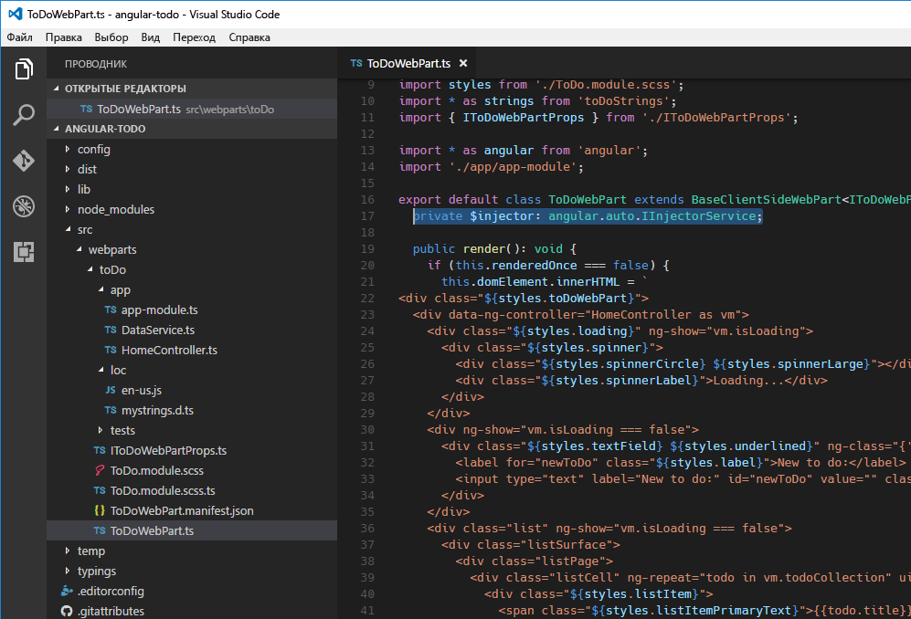

# <a name="build-sharepoint-framework-client-side-web-parts-with-angularjs"></a>Создание клиентских веб-частей SharePoint Framework с помощью AngularJS

Популярную платформу AngularJS также можно использовать для создания клиентских веб-частей. Благодаря модульности с ее помощью можно создавать что-угодно — от сложных одностраничных приложений с различными представлениями до небольших компонентов, таких как веб-части. Раньше во многих организациях решения для SharePoint создавались с помощью AngularJS. В этой статье описано, как с помощью AngularJS создать клиентскую веб-часть SharePoint Framework, а также выбрать для нее стиль, используя [Office UI Fabric](http://dev.office.com/fabric). Работая с этим руководством, вы создадите простую веб-часть, которая управляет элементами списка дел.


Исходный код рабочей веб-части доступен на сайте GitHub по адресу [https://github.com/SharePoint/sp-dev-fx-webparts/tree/master/samples/angular-todo](https://github.com/SharePoint/sp-dev-fx-webparts/tree/master/samples/angular-todo).

> [!NOTE] 
> Прежде чем выполнять действия, описанные в этой статье, [настройте среду разработки](../../set-up-your-development-environment.md) для создания решений на платформе SharePoint Framework.

## <a name="create-new-project"></a>Создание проекта

Для начала создайте папку проекта.

```sh
md angular-todo
```

Перейдите в папку проекта:

```sh
cd angular-todo
```

В папке проекта запустите генератор Yeoman для SharePoint Framework, чтобы сформировать шаблон проекта на платформе SharePoint Framework:

```sh
yo @microsoft/sharepoint
```

Определите значения следующим образом:
- **angular-todo** как имя решения
- **Use the current folder** (Использовать текущую папку) как расположение файлов
- **No JavaScript web framework** (Без веб-платформы JavaScript) как отправная точка создания веб-части
- **To do** (Текущие дела) как имя веб-части
- **Simple management of to do tasks** (Простое управление задачами) как описание веб-части



После завершения скаффолдинга блокируйте версию зависимостей проекта, выполнив следующую команду:

```sh
npm shrinkwrap
```

Далее откройте папку проекта в редакторе кода. В этом руководстве используется Visual Studio Code.


## <a name="add-angularjs"></a>Добавление AngularJS

В этом руководстве показано, как загрузить AngularJS из сети CDN. Для этого откройте в редакторе кода файл **config/config.json** и добавьте следующие строки в свойстве **externals**:

```json
"angular": {
  "path": "https://cdnjs.cloudflare.com/ajax/libs/angular.js/1.6.6/angular.min.js",
  "globalName": "angular"
}
```


## <a name="add-angularjs-typings-for-typescript"></a>Добавление определений типа AngularJS для TypeScript

Так как в коде веб-части вы будете ссылаться на AngularJS, вам также потребуются определения типов AngularJS для TypeScript. Чтобы установить их, выполните в командной строке следующую команду:

```sh
npm install @types/angular --save-dev
```

## <a name="implement-angularjs-application"></a>Реализация приложения AngularJS

Когда все необходимые компоненты будут установлены, можете начинать реализацию примера приложения AngularJS. Так как этот пример будет состоять из нескольких файлов, создайте для него отдельную папку **app**.


### <a name="implement-to-do-data-service"></a>Реализация службы данных о задачах

Создайте файл **DataService.ts** в папке **app**. В файле вставьте следующий код:

```ts
export interface ITodo {
  id: number;
  title: string;
  done: boolean;
}

export interface IDataService {
  getTodos(hideFinishedTasks: boolean): angular.IPromise<ITodo[]>;
  addTodo(todo: string): angular.IPromise<{}>;
  deleteTodo(todo: ITodo): angular.IPromise<{}>;
  setTodoStatus(todo: ITodo, done: boolean): angular.IPromise<{}>;
}

export default class DataService implements IDataService {
  public static $inject: string[] = ['$q'];

  private items: ITodo[] = [
    {
      id: 1,
      title: 'Prepare demo Web Part',
      done: true
    },
    {
      id: 2,
      title: 'Show demo',
      done: false
    },
    {
      id: 3,
      title: 'Share code',
      done: false
    }
  ];
  private nextId: number = 4;

  constructor(private $q: angular.IQService) {
  }

  public getTodos(hideFinishedTasks: boolean): angular.IPromise<ITodo[]> {
    const deferred: angular.IDeferred<ITodo[]> = this.$q.defer();

    const todos: ITodo[] = [];
    for (let i: number = 0; i < this.items.length; i++) {
      if (hideFinishedTasks && this.items[i].done) {
        continue;
      }

      todos.push(this.items[i]);
    }

    deferred.resolve(todos);

    return deferred.promise;
  }

  public addTodo(todo: string): angular.IPromise<{}> {
    const deferred: angular.IDeferred<{}> = this.$q.defer();

    this.items.push({
      id: this.nextId++,
      title: todo,
      done: false
    });

    deferred.resolve();

    return deferred.promise;
  }

  public deleteTodo(todo: ITodo): angular.IPromise<{}> {
    const deferred: angular.IDeferred<{}> = this.$q.defer();

    let pos: number = -1;
    for (let i: number = 0; i < this.items.length; i++) {
      if (this.items[i].id === todo.id) {
        pos = i;
        break;
      }
    }

    if (pos > -1) {
      this.items.splice(pos, 1);
      deferred.resolve();
    }
    else {
      deferred.reject();
    }

    return deferred.promise;
  }

  public setTodoStatus(todo: ITodo, done: boolean): angular.IPromise<{}> {
    const deferred: angular.IDeferred<{}> = this.$q.defer();

    for (let i: number = 0; i < this.items.length; i++) {
      if (this.items[i].id === todo.id) {
        this.items[i].done = done;
      }
    }

    deferred.resolve();

    return deferred.promise;
  }
}
```


В предыдущем фрагменте кода реализуются три типа: интерфейс **ITodo**, который представляет элемент списка дел в приложении, интерфейс **IDataService**, который определяет подпись из службы данных, и класс**DataService**, который отвечает за получение элементов списка дел и управление ими. Служба данных реализует простые методы добавления и изменения элементов списка дел. Несмотря на то что операции происходят мгновенно, для единообразия каждая функция CRUD возвращает обещание.

В этом руководстве элементы списка дел хранятся в памяти. Но вы можете дополнить решение, чтобы хранить элементы в списке SharePoint, и использовать службу данных для взаимодействия с SharePoint при помощи REST API.

### <a name="implement-the-controller"></a>Реализация контроллера

Далее реализуйте контроллер, который упростит взаимодействие между представлением и службой данных. В папке **app** создайте файл **HomeController.ts** и вставьте следующий код:

```ts
import { IDataService, ITodo } from './DataService';

export default class HomeController {
  public isLoading: boolean = false;
  public newItem: string = null;
  public newToDoActive: boolean = false;
  public todoCollection: any[] = [];
  private hideFinishedTasks: boolean = false;

  public static $inject: string[] = ['DataService', '$window', '$rootScope'];

  constructor(private dataService: IDataService, private $window: angular.IWindowService, private $rootScope: angular.IRootScopeService) {
    const vm: HomeController = this;
    this.init();
  }

  private init(hideFinishedTasks?: boolean): void {
    this.hideFinishedTasks = hideFinishedTasks;
    this.loadTodos();
  }

  private loadTodos(): void {
    const vm: HomeController = this;
    this.isLoading = true;
    this.dataService.getTodos(vm.hideFinishedTasks)
      .then((todos: ITodo[]): void => {
        vm.todoCollection = todos;
      })
      .finally((): void => {
        vm.isLoading = false;
      });
  }

  public todoKeyDown($event: any): void {
    if ($event.keyCode === 13 && this.newItem.length > 0) {
      $event.preventDefault();

      this.todoCollection.unshift({ id: -1, title: this.newItem, done: false });
      const vm: HomeController = this;

      this.dataService.addTodo(this.newItem)
        .then((): void => {
          this.newItem = null;
          this.dataService.getTodos(vm.hideFinishedTasks)
            .then((todos: any[]): void => {
              this.todoCollection = todos;
            });
        });
    }
  }

  public deleteTodo(todo: ITodo): void {
    if (this.$window.confirm('Are you sure you want to delete this todo item?')) {
      let index: number = -1;
      for (let i: number = 0; i < this.todoCollection.length; i++) {
        if (this.todoCollection[i].id === todo.id) {
          index = i;
          break;
        }
      }

      if (index > -1) {
        this.todoCollection.splice(index, 1);
      }

      const vm: HomeController = this;

      this.dataService.deleteTodo(todo)
        .then((): void => {
          this.dataService.getTodos(vm.hideFinishedTasks)
            .then((todos: any[]): void => {
              this.todoCollection = todos;
            });
        });
    }
  }

  public completeTodo(todo: ITodo): void {
    todo.done = true;

    const vm: HomeController = this;

    this.dataService.setTodoStatus(todo, true)
      .then((): void => {
        this.dataService.getTodos(vm.hideFinishedTasks)
          .then((todos: any[]): void => {
            this.todoCollection = todos;
          });
      });
  }

  public undoTodo(todo: ITodo): void {
    todo.done = false;

    const vm: HomeController = this;

    this.dataService.setTodoStatus(todo, false)
      .then((): void => {
        this.dataService.getTodos(vm.hideFinishedTasks)
          .then((todos: any[]): void => {
            this.todoCollection = todos;
          });
      });
  }
}
```


Для начала загрузите реализованную ранее службу данных. Она нужна контроллеру для получения списка элементов и их изменения по запросу пользователя. С помощью системы внедрения зависимостей AngularJS служба внедряется в контроллер. Контроллер реализует ряд функций, доступных для модели представления, которые будут вызываться из шаблона. С помощью этих функций пользователи смогут добавлять и удалять задачи, а также помечать их как завершенные и незавершенные.

### <a name="implement-the-main-module"></a>Реализация основного модуля

Далее определите основной модуль приложения и зарегистрируйте в нем службу данных и контроллер. В папке **app** создайте файл **app-module.ts** и вставьте следующий код:

```ts
import * as angular from 'angular';
import HomeController from './HomeController';
import DataService from './DataService';

const todoapp: angular.IModule = angular.module('todoapp', []);

todoapp
  .controller('HomeController', HomeController)
  .service('DataService', DataService);
```


Для начала добавьте ссылки на AngularJS и загрузите реализованные ранее контроллер и службу данных. Далее определите модуль для приложения. Наконец, зарегистрируйте в приложении контроллер и службу данных.

Вы создали приложение AngularJS для веб-части. Далее необходимо зарегистрировать приложение AngularJS в веб-части и сделать его настраиваемым с помощью свойств веб-части.

## <a name="register-angularjs-application-with-web-part"></a>Регистрация приложения AngularJS в веб-части

Следующий шаг — добавление приложения AngularJS в веб-часть. В редакторе кода откройте файл **ToDoWebPart.ts**.

Перед определением класса добавьте следующие строки:

```ts
import * as angular from 'angular';
import './app/app-module';
```


Это позволяет загрузить ссылку на AngularJS и приложение, которые нужны для запуска приложения AngularJS.

Измените функцию **render** веб-части, как показано ниже.

```ts
public render(): void {
  if (this.renderedOnce === false) {
    this.domElement.innerHTML = `
<div class="${styles.toDo}">
  <div data-ng-controller="HomeController as vm">
    <div class="${styles.loading}" ng-show="vm.isLoading">
      <div class="${styles.spinner}">
        <div class="${styles.spinnerCircle} ${styles.spinnerLarge}"></div>
        <div class="${styles.spinnerLabel}">Loading...</div>
      </div>
    </div>
    <div ng-show="vm.isLoading === false">
      <div class="${styles.textField} ${styles.underlined}" ng-class="{'${styles.isActive}': vm.newToDoActive}">
        <label for="newToDo" class="${styles.label}">New to do:</label>
        <input type="text" label="New to do:" id="newToDo" value="" class="${styles.field}" aria-invalid="false" ng-model="vm.newItem" ng-keydown="vm.todoKeyDown($event)" ng-focus="vm.newToDoActive = true" ng-blur="vm.newToDoActive = false">
      </div>
    </div>
    <div class="list" ng-show="vm.isLoading === false">
      <div class="listSurface">
        <div class="listPage">
          <div class="listCell" ng-repeat="todo in vm.todoCollection" uif-item="todo" ng-class="{'${styles.done}': todo.done}">
            <div class="${styles.listItem}">
              <span class="${styles.listItemPrimaryText}">{{todo.title}}</span>
              <div class="${styles.listItemActions}">
                <div class="${styles.listItemAction}" ng-click="vm.completeTodo(todo)" ng-show="todo.done === false">
                  <i class="${styles.icon} ${styles.iconCheckMark}"></i>
                </div>
                <div class="${styles.listItemAction}" ng-click="vm.undoTodo(todo)" ng-show="todo.done">
                  <i class="${styles.icon} ${styles.iconUndo}"></i>
                </div>
                <div class="${styles.listItemAction}" ng-click="vm.deleteTodo(todo)">
                  <i class="${styles.icon} ${styles.iconRecycleBin}"></i>
                </div>
              </div>
            </div>
          </div>
        </div>
      </div>
    </div>
  </div>
</div>`;

    angular.bootstrap(this.domElement, ['todoapp']);
  }
}
```


Код сначала присваивает шаблон приложения непосредственно элементу DOM веб-части. В корневом элементе укажите имя контроллера, который будет обрабатывать события и привязку данных в шаблоне. Затем запустите приложение, указав имя **todoapp**, которое вы использовали при определении основного модуля. Свойство веб-части **renderedOnce** необходимо, чтобы запуск приложения AngularJS выполнялся только один раз. Без него при изменении одного из свойств веб-части функция **render** снова запустит приложение AngularJS, что приведет к ошибке.

Кроме того, необходимо реализовать стили CSS, которые вы используете с шаблоном. В редакторе кода откройте файл **ToDo.module.scss** и замените его содержимое на следующие строки:

```css
.toDo {
  .loading {
    margin: 0 auto;
    width: 6em;

    .spinner {
      display: inline-block;
      margin: 10px 0;

      @-webkit-keyframes spinnerSpin {
        0% {
          -webkit-transform:rotate(0);
          transform:rotate(0);
        }
        100% {
          -webkit-transform:rotate(360deg);
          transform:rotate(360deg);
        }
      }
      @keyframes spinnerSpin {
        0% {
          -webkit-transform:rotate(0);
          transform:rotate(0);
        }
        100% {
          -webkit-transform:rotate(360deg);
          transform:rotate(360deg);
        }
      }

      .spinnerCircle {
        margin: auto;
        box-sizing: border-box;
        border-radius: 50%;
        width: 100%;
        height: 100%;
        border: 1.5px solid #c7e0f4;
        border-top-color: #0078d7;
        -webkit-animation: spinnerSpin 1.3s infinite cubic-bezier(.53, .21, .29, .67);
        animation: spinnerSpin 1.3s infinite cubic-bezier(.53, .21, .29, .67);

        &.spinnerLarge {
          width: 28px;
          height: 28px;
        }
      }

      .spinnerLabel {
        color: #0078d7;
        margin-top: 10px;
        text-align: center;
      }
    }
  }

  .label {
    font-family: "Segoe UI WestEuropean", "Segoe UI", -apple-system, BlinkMacSystemFont, Roboto, "Helvetica Neue", sans-serif;
    -webkit-font-smoothing: antialiased;
    font-size: 14px;
    font-weight: 400;
    box-sizing: border-box;
    margin: 0;
    padding: 0;
    box-shadow: none;
    color: #333333;
    box-sizing: border-box;
    display: block;
    padding: 5px 0
  }

  .textField {
    font-family: "Segoe UI WestEuropean", "Segoe UI", -apple-system, BlinkMacSystemFont, Roboto, "Helvetica Neue", sans-serif;
    -webkit-font-smoothing: antialiased;
    box-sizing: border-box;
    margin: 0;
    padding: 0;
    box-shadow: none;
    color: #333333;
    font-size: 14px;
    font-weight: 400;
    margin-bottom: 8px;

    &.underlined {
      border-bottom: 1px solid #c8c8c8;
      display: table;
      width: 100%;

      &:hover {
        border-color: #767676;
      }

      &.isActive, &:active {
        border-color: #0078d7;
      }

      .field {
        border: 0;
        display: table-cell;
        padding-top: 8px;
        padding-bottom: 3px
      }
    }

    .label {
      padding-right: 0;
      padding-left: 12px;
      margin-right: 8px;
      font-size: 14px;
      display: table-cell;
      vertical-align: top;
      padding-top: 9px;
      height: 32px;
      width: 1%;
      white-space: nowrap;
      font-weight: 400;
    }

    .field {
      text-align: left;
      float: left;
      box-sizing: border-box;
      margin: 0;
      padding: 0;
      box-shadow: none;
      font-family: "Segoe UI WestEuropean", "Segoe UI", -apple-system, BlinkMacSystemFont, Roboto, "Helvetica Neue", sans-serif;
      -webkit-font-smoothing: antialiased;
      border: 1px solid #c8c8c8;
      border-radius: 0;
      font-weight: 400;
      font-size: 14px;
      color: #333333;
      height: 32px;
      padding: 0 12px 0 12px;
      width: 100%;
      outline: 0;
      text-overflow: ellipsis;
    }

    .field:hover {
      border-color: #767676;
    }
  }

  .listItem {
    font-family: "Segoe UI WestEuropean", "Segoe UI", -apple-system, BlinkMacSystemFont, Roboto, "Helvetica Neue", sans-serif;
    -webkit-font-smoothing: antialiased;
    font-size: 14px;
    font-weight: 400;
    box-sizing: border-box;
    margin: 0;
    padding: 0;
    box-shadow: none;
    padding: 9px 28px 3px;
    position: relative;
    display: block;

    &::before {
      display: table;
      content: "";
      line-height: 0;
    }

    &::after {
      display: table;
      content: "";
      line-height: 0;
      clear: both;
    }

    .listItemPrimaryText {
      font-family: "Segoe UI WestEuropean", "Segoe UI", -apple-system, BlinkMacSystemFont, Roboto, "Helvetica Neue", sans-serif;
      -webkit-font-smoothing: antialiased;
      font-size: 21px;
      font-weight: 100;
      padding-right: 80px;
      position: relative;
      top: -4px;
      overflow: hidden;
      text-overflow: ellipsis;
      white-space: nowrap;
      display: block;
    }

    .listItemActions {
      max-width: 80px;
      position: absolute;
      right: 30px;
      text-align: right;
      top: 10px;

      .listItemAction {
        color: #a6a6a6;
        display: inline-block;
        font-size: 15px;
        position: relative;
        text-align: center;
        top: 3px;
        cursor: pointer;
        height: 16px;
        width: 16px;

        &:hover {
          color: #666666;
          outline: 1px solid transparent;
        }

        .icon {
          vertical-align: top;
        }
      }
    }
  }

  .done {
    text-decoration: line-through;
  }

  .icon {
    -moz-osx-font-smoothing: grayscale;
    -webkit-font-smoothing: antialiased;
    display: inline-block;
    font-family: FabricMDL2Icons;
    font-style: normal;
    font-weight: 400;
    speak: none;

    &.iconCheckMark::before {
      content: "\E73E";
    }

    &.iconUndo::before {
      content: "\E7A7";
    }

    &.iconRecycleBin::before {
      content: "\EF87";
    }
  }
}
```


Выполните следующую команду, чтобы убедиться, что все работает правильно:

```sh
gulp serve
```

В браузере должна появиться ваша веб-часть с элементами списка дел.


## <a name="make-web-part-configurable"></a>Как сделать веб-часть настраиваемой

Сейчас в веб-части отображается неизменяемый список дел. Далее мы дополним ее, чтобы пользователи могли решать, показывать ли задачи, помеченные как завершенные.

### <a name="add-property-in-the-web-part-manifest"></a>Добавление свойства в манифест веб-части

Для начала добавьте свойство настройки в манифест веб-части. В редакторе кода откройте файл **ToDoWebPart.manifest.json**. В разделе **preconfiguredEntries** перейдите к массиву **properties** и замените свойство **description** следующей строкой:

```json
"hideFinishedTasks": false
```


### <a name="update-the-signature-of-the-web-part-properties-interface"></a>Обновление подписи интерфейса свойств веб-части

Далее обновите подпись интерфейса свойств веб-части.

В редакторе кода откройте файл **ToDoWebPart.ts** и обновите интерфейс `IToDoWebPartProps`, добавив следующее:

```ts
export interface IToDoWebPartProps {
  hideFinishedTasks: boolean;
}
```


### <a name="add-the-property-to-the-web-part-property-pane"></a>Добавление свойства в панель свойств веб-части

Чтобы пользователи могли настраивать значение нового свойства, оно должно быть доступно на панели свойств веб-части.

В редакторе кода откройте файл **ToDoWebPart.ts**. В первом операторе `import` замените строку `PropertyPaneTextField` на строку `PropertyPaneToggle`:

```ts
import {
  BaseClientSideWebPart,
  IPropertyPaneConfiguration,
  PropertyPaneToggle
} from '@microsoft/sp-webpart-base';
```



Измените функцию `propertyPaneSettings`, как показано ниже:

```ts
protected getPropertyPaneConfiguration(): IPropertyPaneConfiguration {
  return {
    pages: [
      {
        header: {
          description: strings.PropertyPaneDescription
        },
        groups: [
          {
            groupName: strings.ViewGroupName,
            groupFields: [
              PropertyPaneToggle('hideFinishedTasks', {
                label: strings.HideFinishedTasksFieldLabel
              })
            ]
          }
        ]
      }
    ]
  };
}
```

Чтобы исправить ссылки на отсутствующие строки, сначала нужно изменить подпись строк. В редакторе кода откройте файл **loc/mystrings.d.ts** и замените его содержимое на следующие строки:

```ts
declare interface IToDoWebPartStrings {
  PropertyPaneDescription: string;
  BasicGroupName: string;
  HideFinishedTasksFieldLabel: string;
}

declare module 'ToDoWebPartStrings' {
  const strings: IToDoWebPartStrings;
  export = strings;
}
```


Далее нужно указать действительные значения для новых строк. В редакторе кода откройте файл **loc/en-us.js** и замените его содержимое на следующие строки:

```js
define([], function() {
  return {
    "PropertyPaneDescription": "Manage configuration of the To do web part",
    "ViewGroupName": "View",
    "HideFinishedTasksFieldLabel": "Hide finished tasks"
  }
});
```



Выполните следующую команду, чтобы убедиться, что всё работает правильно:

```sh
gulp serve
```

На панели свойств веб-части должен появиться выключатель для нового свойства.


Сейчас выключатель не работает, так как он еще не подключен к AngularJS. Это следующий шаг.

### <a name="make-the-angularjs-application-configurable-using-web-part-properties"></a>Как сделать приложение AngularJS настраиваемым с помощью свойств веб-части

Выполняя предыдущий шаг, вы определили свойство веб-части, которое позволяет пользователям решать, нужно ли показывать завершенные задачи. Далее нужно передать выбранное пользователем значение в приложение AngularJS, чтобы оно могло загрузить соответствующие элементы.

#### <a name="broadcast-angularjs-event-on-web-part-property-change"></a>Трансляция события AngularJS при изменении свойства веб-части

В редакторе кода откройте файл **ToDoWebPart.ts**. Добавьте следующую строку перед конструктором веб-части:

```ts
private $injector: angular.auto.IInjectorService;
```



Далее измените функцию **render** веб-части, как показано ниже.

```ts
public render(): void {
  if (this.renderedOnce === false) {
    this.domElement.innerHTML = `
<div class="${styles.toDo}">
  <div data-ng-controller="HomeController as vm">
    <div class="${styles.loading}" ng-show="vm.isLoading">
      <div class="${styles.spinner}">
        <div class="${styles.spinnerCircle} ${styles.spinnerLarge}"></div>
        <div class="${styles.spinnerLabel}">Loading...</div>
      </div>
    </div>
    <div ng-show="vm.isLoading === false">
      <div class="${styles.textField} ${styles.underlined}" ng-class="{'${styles.isActive}': vm.newToDoActive}">
        <label for="newToDo" class="${styles.label}">New to do:</label>
        <input type="text" label="New to do:" id="newToDo" value="" class="${styles.field}" aria-invalid="false" ng-model="vm.newItem" ng-keydown="vm.todoKeyDown($event)" ng-focus="vm.newToDoActive = true" ng-blur="vm.newToDoActive = false">
      </div>
    </div>
    <div class="list" ng-show="vm.isLoading === false">
      <div class="listSurface">
        <div class="listPage">
          <div class="listCell" ng-repeat="todo in vm.todoCollection" uif-item="todo" ng-class="{'${styles.done}': todo.done}">
            <div class="${styles.listItem}">
              <span class="${styles.listItemPrimaryText}">{{todo.title}}</span>
              <div class="${styles.listItemActions}">
                <div class="${styles.listItemAction}" ng-click="vm.completeTodo(todo)" ng-show="todo.done === false">
                  <i class="${styles.icon} ${styles.iconCheckMark}"></i>
                </div>
                <div class="${styles.listItemAction}" ng-click="vm.undoTodo(todo)" ng-show="todo.done">
                  <i class="${styles.icon} ${styles.iconUndo}"></i>
                </div>
                <div class="${styles.listItemAction}" ng-click="vm.deleteTodo(todo)">
                  <i class="${styles.icon} ${styles.iconRecycleBin}"></i>
                </div>
              </div>
            </div>
          </div>
        </div>
      </div>
    </div>
  </div>
</div>`;

    this.$injector = angular.bootstrap(this.domElement, ['todoapp']);
  }

  this.$injector.get('$rootScope').$broadcast('configurationChanged', {
    hideFinishedTasks: this.properties.hideFinishedTasks
  });
}
```

Приведенный выше пример кода при каждом изменении свойства веб-части будет транслировать событие AngularJS, на которое приложение AngularJS его подпишет. Когда приложение AngularJS получит событие, оно обработает его соответствующим образом.

#### <a name="subscribe-to-web-part-property-change-event-in-angularjs"></a>Подписка на событие изменения свойства веб-части в AngularJS

В редакторе кода откройте файл **app/HomeController.ts**. Дополните конструктор следующим образом:

```ts
constructor(private dataService: IDataService, private $window: angular.IWindowService, private $rootScope: angular.IRootScopeService) {
  const vm: HomeController = this;
  this.init();

  $rootScope.$on('configurationChanged', (event: angular.IAngularEvent, args: { hideFinishedTasks: boolean }): void => {
    vm.init(args.hideFinishedTasks);
  });
}
```


Чтобы убедиться, что приложение AngularJS работает без ошибок и правильно отвечает на изменение свойства, в командной строке выполните следующую команду:

```sh
gulp serve
```

Когда вы переместите переключатель **Hide finished tasks** (Скрыть завершенные задачи), веб-часть должна показать или скрыть завершенные задачи.


