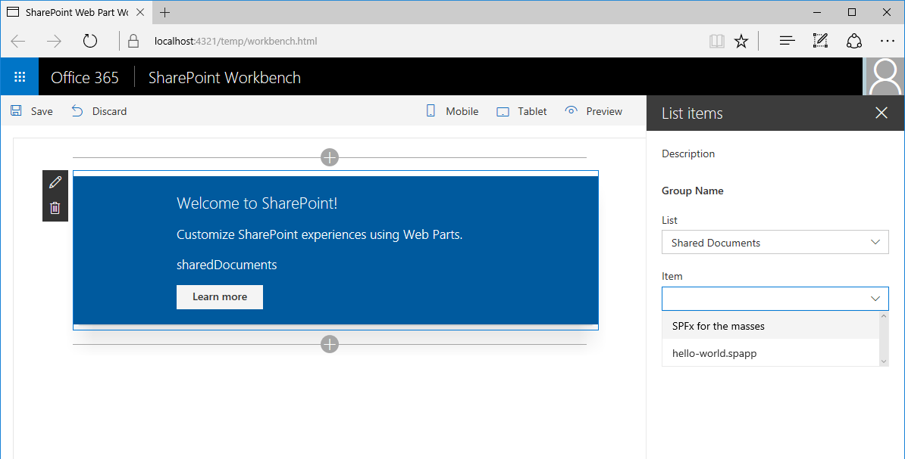

Раскрывающееся меню списков в области свойств веб-части активно. Раскрывающееся меню элементов отключеноList dropdown in web part property pane enabled. Item dropdown disabled

После выбора списка раскрывающееся меню элементов загрузит элементы, доступные в этом списке.After selecting a list in the list dropdown the item dropdown will load items available in that list.

После загрузки доступных элементов станет доступным раскрывающееся меню элементов.After the available items have been loaded, the item dropdown becomes enabled.

После выбора элемента в раскрывающемся меню элементов веб-часть обновляется для отображения выбранного элемента.After selecting an item in the item dropdown the web part is refreshed showing the selected item in its body.

