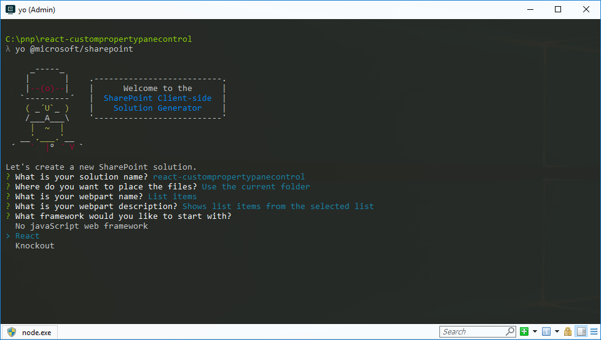
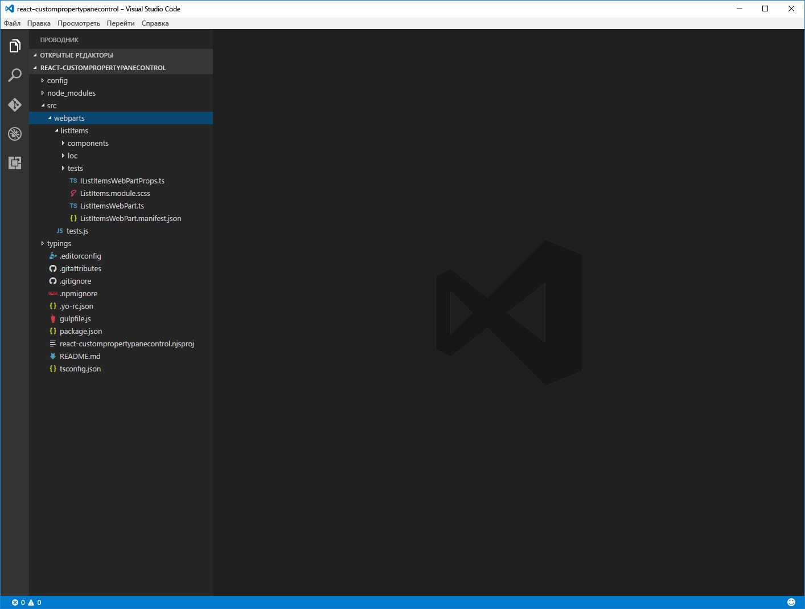
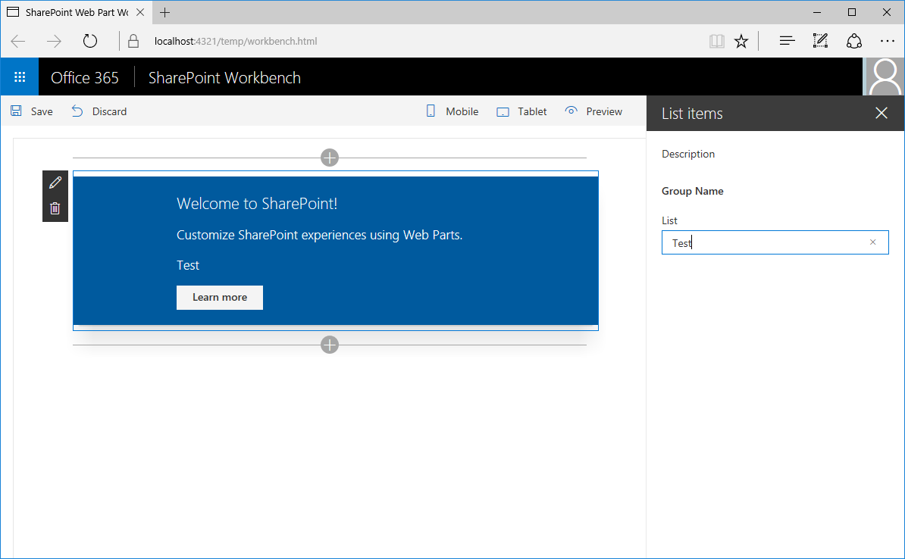
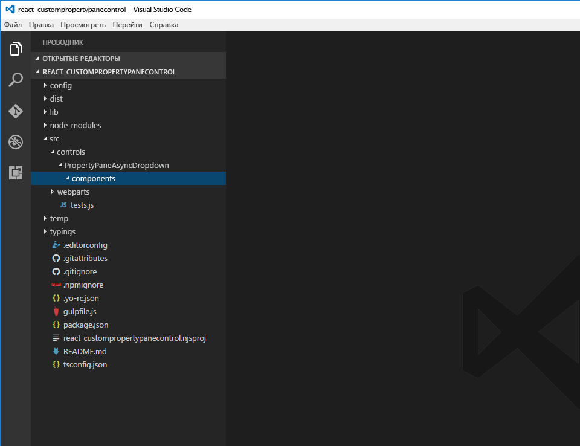
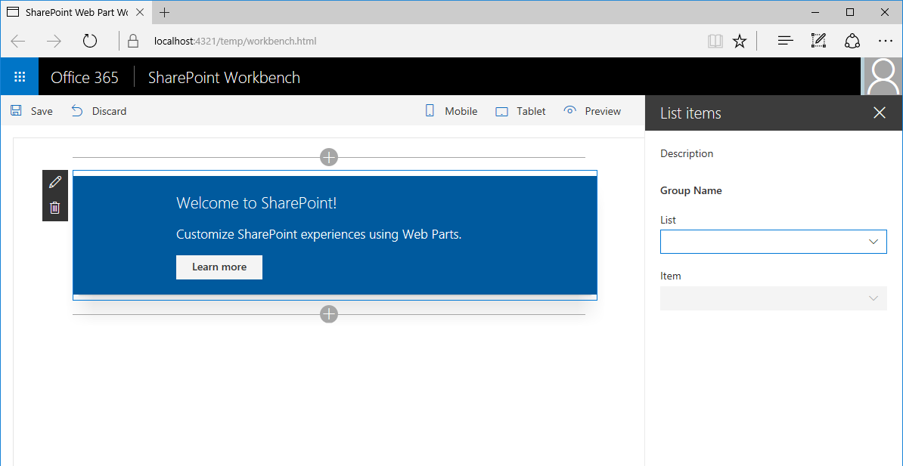

# <a name="build-custom-controls-for-the-property-pane"></a>Создание пользовательских элементов управления для области свойств

SharePoint Framework содержит набор стандартных элементов управления для области свойств, но иногда нужны дополнительные функции. Вам может понадобиться асинхронное обновление данных в элементе управления или определенный пользовательский интерфейс. Создайте пользовательский элемент управления для области свойств, чтобы получить необходимые функции.

В этой статье показано, как создать пользовательское раскрывающееся меню, которое асинхронно загружает данные из внешней службы, не блокируя пользовательский интерфейс веб-части.


Исходный код рабочей веб-части доступен на сайте GitHub по адресу [sp-dev-fx-webparts/samples/react-custompropertypanecontrols/](https://github.com/SharePoint/sp-dev-fx-webparts/tree/master/samples/react-custompropertypanecontrols).

> [!NOTE] 
> Прежде чем выполнять действия, описанные в этой статье, [настройте среду разработки](../../set-up-your-development-environment.md) для создания решений на платформе SharePoint Framework.

## <a name="create-new-project"></a>Создание проекта

1. Для начала создайте папку проекта:

  ```sh
  md react-custompropertypanecontrol
  ```

2. Перейдите в папку проекта:

  ```sh
  cd react-custompropertypanecontrol
  ```

3. В папке проекта запустите генератор Yeoman для SharePoint Framework, чтобы сформировать шаблон проекта на платформе SharePoint Framework:

  ```sh
  yo @microsoft/sharepoint
  ```

4. Когда отобразится соответствующий запрос, введите следующие значения:

  - имя решения — **react-custompropertypanecontrol**
  - расположение файлов — **Use the current folder** (Использовать текущую папку)
  - имя веб-части **List items** (Элементы списка)
  - описание веб-части — **Shows list items from the selected list** (Показывает элементы списка из выбранного списка)
  - отправная точка создания веб-части — **React**

  

5. По завершении скаффолдинга заблокируйте версию зависимостей проекта, выполнив следующую команду:

  ```sh
  npm shrinkwrap
  ```

6. Откройте папку проекта в редакторе кода. В инструкциях и на снимках экрана из этой статьи используется Visual Studio Code, но вы можете использовать любой другой редактор.

  

## <a name="define-web-part-property-for-storing-the-selected-list"></a>Определение свойства веб-части для хранения выбранного списка

В веб-части, которую вы создаете, появятся элементы из выбранного списка SharePoint. Пользователи смогут выбрать список в свойствах веб-части. Для хранения выбранного списка создайте свойство веб-части с именем **listName**.

1. В редакторе кода откройте файл **src/webparts/listItems/ListItemsWebPartManifest.json**. Замените свойство по умолчанию **description** на новое свойство `listName`.

  

2. Откройте файл **src/webparts/listItems/IListItemsWebPartProps.ts** и замените его содержимое следующим:

  ```typescript
  export interface IListItemsWebPartProps {
    listName: string;
  }
  ```

3. В файле **src/webparts/listItems/ListItemsWebPart.ts** замените метод **render** на следующий:

  ```typescript
  export default class ListItemsWebPart extends BaseClientSideWebPart<IListItemsWebPartProps> {
    // ...
    public render(): void {
      const element: React.ReactElement<IListItemsProps> = React.createElement(ListItems, {
        listName: this.properties.listName
      });

      ReactDom.render(element, this.domElement);
    }
    // ...
  }
  ```

4. Обновите метод **getPropertyPaneConfiguration** следующим образом:

  ```typescript
  export default class ListItemsWebPart extends BaseClientSideWebPart<IListItemsWebPartProps> {
    // ...
    protected getPropertyPaneConfiguration(): IPropertyPaneConfiguration {
      return {
        pages: [
          {
            header: {
              description: strings.PropertyPaneDescription
            },
            groups: [
              {
                groupName: strings.BasicGroupName,
                groupFields: [
                  PropertyPaneTextField('listName', {
                    label: strings.ListFieldLabel
                  })
                ]
              }
            ]
          }
        ]
      };
    }
    // ...
  }
  ```

5. В файле **src/webparts/listItems/loc/mystrings.d.ts** измените интерфейс **IListItemsWebPartStrings** следующим образом:

  ```typescript
  declare interface IListItemsWebPartStrings {
    PropertyPaneDescription: string;
    BasicGroupName: string;
    ListFieldLabel: string;
  }
  ```

6. В файле **src/webparts/listItems/loc/en-us.js** добавьте отсутствующее определение для строки **ListFieldLabel**.

  ```js
  define([], function() {
    return {
      "PropertyPaneDescription": "Description",
      "BasicGroupName": "Group Name",
      "ListFieldLabel": "List"
    }
  });
  ```

7. В файле **src/webparts/listItems/components/ListItems.tsx** замените содержимое метода **render** следующим:

  ```tsx
  export default class ListItems extends React.Component<IListItemsProps, {}> {
    public render(): React.ReactElement<IListItemsProps> {
      return (
        <div className={styles.listItems}>
          <div className={styles.container}>
            <div className={`ms-Grid-row ms-bgColor-themeDark ms-fontColor-white ${styles.row}`}>
              <div className="ms-Grid-col ms-lg10 ms-xl8 ms-xlPush2 ms-lgPush1">
                <span className="ms-font-xl ms-fontColor-white">Welcome to SharePoint!</span>
                <p className="ms-font-l ms-fontColor-white">Customize SharePoint experiences using Web Parts.</p>
                <p className="ms-font-l ms-fontColor-white">{escape(this.props.listName)}</p>
                <a href="https://aka.ms/spfx" className={styles.button}>
                  <span className={styles.label}>Learn more</span>
                </a>
              </div>
            </div>
          </div>
        </div>
      );
    }
  }
  ```

8. Откройте файл **src/webparts/listItems/components/IListItemsProps.ts** и замените его содержимое следующим кодом:

  ```typescript
  export interface IListItemsProps {
    listName: string;
  }
  ```

9. Чтобы убедиться, что проект работает, выполните следующую команду:

  ```sh
  gulp serve
  ```

10. В веб-браузере добавьте веб-часть **List items** на полотно и откройте ее свойства. Убедитесь, что значение свойства **List** отображается в теле веб-части.

  


## <a name="create-asynchronous-dropdown-property-pane-control"></a>Создание асинхронного раскрывающегося меню области свойств

В SharePoint Framework представлено стандартное раскрывающееся меню, которое позволяет пользователям выбирать определенные значения. Все его значения должны быть известны заранее. Если вы хотите загружать значения динамически или загружаете значения асинхронно из внешней службы и не хотите блокировать веб-часть, создайте пользовательское раскрывающееся меню.

Оно состоит из класса, который регистрирует элемент управления в веб-части, и компонента React в SharePoint Framework, который отрисовывает раскрывающееся меню и управляет его данными.

> [!NOTE] 
> В выпуске 6 SharePoint Framework в компоненте Office UI Fabric React Dropdown есть ошибка, из-за которой элемент управления, создаваемый в этой статье, работает неправильно. Чтобы временно решить эту проблему, измените строку **12027** в файле **node_modules/@microsoft/office-ui-fabric-react-bundle/dist/office-ui-fabric-react.bundle.js**. Исходный вариант:
> 
> ```js
> isDisabled: this.props.isDisabled !== undefined ? this.props.isDisabled : this.props.disabled
> ```
>
> Целевой вариант:
> 
> ```js
> isDisabled: newProps.isDisabled !== undefined ? newProps.isDisabled : newProps.disabled
> ```

### <a name="add-asynchronous-dropdown-property-pane-control-react-component"></a>Добавление компонента React асинхронного раскрывающегося меню области свойств

1. Создайте папку компонентов. В папке проекта **src** создайте иерархию из трех новых папок, чтобы получилась следующая структура: **src/controls/PropertyPaneAsyncDropdown/components**.

  

2. Определите свойства компонента React асинхронного раскрывающегося меню. В папке **src/controls/PropertyPaneAsyncDropdown/components** создайте файл **IAsyncDropdownProps.ts** и введите следующий код:

  ```typescript
  import { IDropdownOption } from 'office-ui-fabric-react/lib/components/Dropdown';

  export interface IAsyncDropdownProps {
    label: string;
    loadOptions: () => Promise<IDropdownOption[]>;
    onChanged: (option: IDropdownOption, index?: number) => void;
    selectedKey: string | number;
    disabled: boolean;
    stateKey: string;
  }
  ```

  Класс **IAsyncDropdownProps** определяет свойства, которые можно настроить в компоненте React, используемом пользовательским элементом управления области свойств. 
  - Свойство **label** указывает подпись для раскрывающегося меню. 
  - Для загрузки доступных параметров элемент управления вызывает функцию, связанную с делегатом **loadOptions**. 
  - После выбора параметра в раскрывающемся меню вызывается функция, связанная с делегатом **onChanged**. 
  - Свойство **selectedKey** указывает выбранное значение, которое может быть строкой или числом. 
  - Свойство **disabled** указывает, отключено ли раскрывающееся меню. 
  - Свойство **stateKey** используется для принудительной повторной отрисовки компонента React.

3. Определите интерфейс компонента React для асинхронного раскрывающегося меню. В папке **src/controls/PropertyPaneAsyncDropdown/components** создайте файл **IAsyncDropdownState.ts** и введите следующий код:

  ```typescript
  import { IDropdownOption } from 'office-ui-fabric-react/lib/components/Dropdown';

  export interface IAsyncDropdownState {
    loading: boolean;
    options: IDropdownOption[];
    error: string;
  }
  ```

  Интерфейс **IAsyncDropdownState** описывает состояние компонента React.
  - Свойство **loading** определяет, загружает ли компонент параметры в данный момент. 
  - Свойство **options** содержит все доступные параметры. 
  - Если произойдет ошибка, она будет назначена свойству **error**, из которого она будет передана пользователю.

4. Определите компонент React асинхронного раскрывающегося меню. В папке **src/controls/PropertyPaneAsyncDropdown/components** создайте файл **AsyncDropdown.tsx** и введите следующий код:

  ```typescriptx
  import * as React from 'react';
  import { Dropdown, IDropdownOption } from 'office-ui-fabric-react/lib/components/Dropdown';
  import { Spinner } from 'office-ui-fabric-react/lib/components/Spinner';
  import { IAsyncDropdownProps } from './IAsyncDropdownProps';
  import { IAsyncDropdownState } from './IAsyncDropdownState';

  export default class AsyncDropdown extends React.Component<IAsyncDropdownProps, IAsyncDropdownState> {
    private selectedKey: React.ReactText;

    constructor(props: IAsyncDropdownProps, state: IAsyncDropdownState) {
      super(props);
      this.selectedKey = props.selectedKey;

      this.state = {
        loading: false,
        options: undefined,
        error: undefined
      };
    }

    public componentDidMount(): void {
      this.loadOptions();
    }

    public componentDidUpdate(prevProps: IAsyncDropdownProps, prevState: IAsyncDropdownState): void {
      if (this.props.disabled !== prevProps.disabled ||
        this.props.stateKey !== prevProps.stateKey) {
        this.loadOptions();
      }
    }

    private loadOptions(): void {
      this.setState({
        loading: true,
        error: undefined,
        options: undefined
      });

      this.props.loadOptions()
        .then((options: IDropdownOption[]): void => {
          this.setState({
            loading: false,
            error: undefined,
            options: options
          });
        }, (error: any): void => {
          this.setState((prevState: IAsyncDropdownState, props: IAsyncDropdownProps): IAsyncDropdownState => {
            prevState.loading = false;
            prevState.error = error;
            return prevState;
          });
        });
    }

    public render(): JSX.Element {
      const loading: JSX.Element = this.state.loading ? <div><Spinner label={'Loading options...'} /></div> : <div />;
      const error: JSX.Element = this.state.error !== undefined ? <div className={'ms-TextField-errorMessage ms-u-slideDownIn20'}>Error while loading items: {this.state.error}</div> : <div />;

      return (
        <div>
          <Dropdown label={this.props.label}
            disabled={this.props.disabled || this.state.loading || this.state.error !== undefined}
            onChanged={this.onChanged.bind(this)}
            selectedKey={this.selectedKey}
            options={this.state.options} />
          {loading}
          {error}
        </div>
      );
    }

    private onChanged(option: IDropdownOption, index?: number): void {
      this.selectedKey = option.key;
      // reset previously selected options
      const options: IDropdownOption[] = this.state.options;
      options.forEach((o: IDropdownOption): void => {
        if (o.key !== option.key) {
          o.selected = false;
        }
      });
      this.setState((prevState: IAsyncDropdownState, props: IAsyncDropdownProps): IAsyncDropdownState => {
        prevState.options = options;
        return prevState;
      });
      if (this.props.onChanged) {
        this.props.onChanged(option, index);
      }
    }
  }
  ```

  Класс **AsyncDropdown** представляет компонент React, используемый для отрисовки асинхронного раскрывающегося меню области свойств.

  - При первой загрузке компонента изменится метод **componentDidMount** или его свойство (**disabled** либо **stateKey**), и он загрузит доступные параметры, вызвав метод **loadOptions**, переданный через свойства. 
  - После загрузки параметров компонент показывает доступные параметры. 
  - Раскрывающееся меню отрисовывается с помощью [компонента раскрывающегося меню на базе Office UI Fabric React](https://developer.microsoft.com/ru-RU/fabric#/components/dropdown). 
  - Когда компонент загружает доступные параметры, он показывает вертушку, используя [компонент вертушки на базе Office UI Fabric React](https://developer.microsoft.com/ru-RU/fabric#/components/spinner).


Далее необходимо определить пользовательский элемент управления области свойств. Этот элемент управления используется в веб-части при определении свойств в области свойств и отрисовывается с помощью заданного компонента React.

### <a name="add-asynchronous-dropdown-property-pane-control"></a>Как добавить асинхронное раскрывающееся меню области свойств

1. Определите свойства асинхронного раскрывающегося меню области свойств. У пользовательского элемента управления области свойств есть два набора свойств. 
  
  Первый из них доступен для всех и используется для определения свойства веб-части. К этим свойствам компонента относятся подпись, которая отображается рядом с элементом управления, минимальное и максимальное значения вертушки и доступные параметры раскрывающегося меню. Если добавляете пользовательский элемент управления области свойств, тип, описывающий эти свойства, необходимо передавать как тип **TProperties** при реализации интерфейса `IPropertyPaneField<TProperties>`.

  Второй набор состоит из личных свойств, которые используются в пользовательском элементе управления области свойств. Для правильной отрисовки пользовательского элемента управления эти свойства должны соответствовать требованиям API SharePoint Framework. Эти свойства должны использовать интерфейс **IPropertyPaneCustomFieldProps** из пакета **@microsoft/sp-webpart-base**.

2. Определите общедоступные свойства для асинхронного раскрывающегося меню области свойств. В папке **src/controls/PropertyPaneAsyncDropdown** создайте файл **IPropertyPaneAsyncDropdownProps.ts** и введите следующий код:

  ```typescript
  import { IDropdownOption } from 'office-ui-fabric-react/lib/components/Dropdown';

  export interface IPropertyPaneAsyncDropdownProps {
    label: string;
    loadOptions: () => Promise<IDropdownOption[]>;
    onPropertyChange: (propertyPath: string, newValue: any) => void;
    selectedKey: string | number;
    disabled?: boolean;
  }
  ```

  В интерфейсе **IPropertyPaneAsyncDropdownProps**:
  - Свойство **label** определяет подпись, которая отображается рядом с раскрывающимся меню. 
  - Делегат **loadOptions** определяет метод, который вызывается для загрузки доступных параметров раскрывающегося меню. 
  - Делегат **onPropertyChange** определяет метод, который вызывается, когда пользователь выбирает значение в раскрывающемся меню. 
  - Свойство **selectedKey** возвращает выбранное значение раскрывающегося меню. 
  - Свойство **disabled** указывает, отключен ли элемент управления.

3. Определите внутренние свойства для асинхронного раскрывающегося меню области свойств. В папке **src/controls/PropertyPaneAsyncDropdown** создайте файл **IPropertyPaneAsyncDropdownInternalProps.ts** и введите следующий код:

  ```typescript
  import { IPropertyPaneCustomFieldProps } from '@microsoft/sp-webpart-base';
  import { IPropertyPaneAsyncDropdownProps } from './IPropertyPaneAsyncDropdownProps';

  export interface IPropertyPaneAsyncDropdownInternalProps extends IPropertyPaneAsyncDropdownProps, IPropertyPaneCustomFieldProps {
  }
  ```

  Интерфейс **IPropertyPaneAsyncDropdownInternalProps** не определяет новые свойства, но он объединяет свойства из заданного интерфейса **IPropertyPaneAsyncDropdownProps** и стандартного интерфейса SharePoint Framework **IPropertyPaneCustomFieldProps**, что необходимо для правильной работы пользовательского элемента управления.

4. Определите асинхронное раскрывающееся меню области свойств. В папке **src/controls/PropertyPaneAsyncDropdown** создайте файл **PropertyPaneAsyncDropdown.ts** и введите следующий код:

  ```typescript
  import * as React from 'react';
  import * as ReactDom from 'react-dom';
  import {
    IPropertyPaneField,
    PropertyPaneFieldType
  } from '@microsoft/sp-webpart-base';
  import { IDropdownOption } from 'office-ui-fabric-react/lib/components/Dropdown';
  import { IPropertyPaneAsyncDropdownProps } from './IPropertyPaneAsyncDropdownProps';
  import { IPropertyPaneAsyncDropdownInternalProps } from './IPropertyPaneAsyncDropdownInternalProps';
  import AsyncDropdown from './components/AsyncDropdown';
  import { IAsyncDropdownProps } from './components/IAsyncDropdownProps';

  export class PropertyPaneAsyncDropdown implements IPropertyPaneField<IPropertyPaneAsyncDropdownProps> {
    public type: PropertyPaneFieldType = PropertyPaneFieldType.Custom;
    public targetProperty: string;
    public properties: IPropertyPaneAsyncDropdownInternalProps;
    private elem: HTMLElement;

    constructor(targetProperty: string, properties: IPropertyPaneAsyncDropdownProps) {
      this.targetProperty = targetProperty;
      this.properties = {
        key: properties.label,
        label: properties.label,
        loadOptions: properties.loadOptions,
        onPropertyChange: properties.onPropertyChange,
        selectedKey: properties.selectedKey,
        disabled: properties.disabled,
        onRender: this.onRender.bind(this)
      };
    }

    public render(): void {
      if (!this.elem) {
        return;
      }

      this.onRender(this.elem);
    }

    private onRender(elem: HTMLElement): void {
      if (!this.elem) {
        this.elem = elem;
      }

      const element: React.ReactElement<IAsyncDropdownProps> = React.createElement(AsyncDropdown, {
        label: this.properties.label,
        loadOptions: this.properties.loadOptions,
        onChanged: this.onChanged.bind(this),
        selectedKey: this.properties.selectedKey,
        disabled: this.properties.disabled,
        // required to allow the component to be re-rendered by calling this.render() externally
        stateKey: new Date().toString()
      });
      ReactDom.render(element, elem);
    }

    private onChanged(option: IDropdownOption, index?: number): void {
      this.properties.onPropertyChange(this.targetProperty, option.key);
    }
  }
  ```

  Класс **PropertyPaneAsyncDropdown** реализует стандартный интерфейс SharePoint Framework **IPropertyPaneField**, используя интерфейс **IPropertyPaneAsyncDropdownProps** как контракт для общедоступных свойств, которые можно настроить в веб-части. Класс содержит следующие три общедоступные свойства, определяемые интерфейсом **IPropertyPaneField**:

  - **type**. Для пользовательского элемента управления области свойств необходимо использовать значение **PropertyPaneFieldType.Custom**.
  - **targetProperty**: позволяет указать имя свойства веб-части, которое необходимо использовать с элементом управления.
  - **properties**. Позволяет определить свойства элемента управления.

  Обратите внимание на то, что свойство **properties** относится к внутреннему типу **IPropertyPaneAsyncDropdownInternalProps**, а не к общедоступному интерфейсу **IPropertyPaneAsyncDropdownProps**, реализованному классом. Это сделано для того, чтобы свойство **properties** могло определять метод **onRender**, необходимый для SharePoint Framework. Если бы метод **onRender** был частью общедоступного интерфейса **IPropertyPaneAsyncDropdownProps**, при использовании асинхронного раскрывающегося меню в веб-части вам потребовалось бы назначить ему значение в веб-части, что нежелательно.

  Класс **PropertyPaneAsyncDropdown** определяет общедоступный метод **render**, который можно использовать для обновления элемента управления. Это удобно при наличии каскадных раскрывающихся меню, когда значение, выбранное в одном, определяет параметры, доступные в другом. Вызов метода **render** после выбора элемента позволяет зависимому раскрывающемуся меню загрузить доступные параметры. Чтобы это работало, компонент React должен обнаружить, что элемент управления изменен. Для этого установите текущую дату для свойства **stateKey**. В результате при каждом вызове метода **onRender** компонент будет не только заново отрисовываться, но и обновлять доступные параметры.

## <a name="use-the-asynchronous-dropdown-property-pane-control-in-the-web-part"></a>Как использовать асинхронное раскрывающееся меню области свойств в веб-части

Теперь, когда асинхронное раскрывающееся меню области свойств готово, необходимо использовать его в веб-части, чтобы пользователи могли выбрать список.

### <a name="add-list-info-interface"></a>Добавление интерфейса сведений о списке

Чтобы передавать сведения о доступных списках согласованно, определите интерфейс, который будет представлять сведения о списке. В папке **src/webparts/listItems** создайте файл **IListInfo.ts** и введите следующий код:

```typescript
export interface IListInfo {
  Id: string;
  Title: string;
}
```

### <a name="use-the-asynchronous-dropdown-property-pane-control-to-render-the-listname-web-part-property"></a>Как использовать асинхронное раскрывающееся меню области свойств для отрисовки свойства веб-части listName

1. Добавьте ссылку на обязательные типы. В верхней части файла **src/webparts/listItems/ListItemsWebPart.ts** импортируйте созданный класс **PropertyPaneAsyncDropdown**, добавив следующее:

  ```typescript
  import { PropertyPaneAsyncDropdown } from '../../controls/PropertyPaneAsyncDropdown/PropertyPaneAsyncDropdown';
  ```

2. После этого кода добавьте ссылку на интерфейс **IDropdownOption** и две вспомогательные функции, необходимые для работы со свойствами веб-части.

  ```typescript
  import { IDropdownOption } from 'office-ui-fabric-react/lib/components/Dropdown';
  import { update, get } from '@microsoft/sp-lodash-subset';
  ```

  <br/>

  

3. Добавьте метод для загрузки доступных списков. В классе **ListItemsWebPart** добавьте метод для загрузки доступных списков. В этой статье используются фиктивные данные, но вы также можете вызвать REST API для SharePoint, чтобы извлечь список доступных списков из текущего веб-сайта. Для имитации загрузки параметров из внешней службы метод использует двухсекундную задержку.

  ```typescript
  export default class ListItemsWebPart extends BaseClientSideWebPart<IListItemsWebPartProps> {
    // ...
    private loadLists(): Promise<IDropdownOption[]> {
      return new Promise<IDropdownOption[]>((resolve: (options: IDropdownOption[]) => void, reject: (error: any) => void) => {
        setTimeout(() => {
          resolve([{
            key: 'sharedDocuments',
            text: 'Shared Documents'
          },
            {
              key: 'myDocuments',
              text: 'My Documents'
            }]);
        }, 2000);
      });
    }
  }
  ```

4. Добавьте метод для обработки изменения значения в раскрывающемся меню. В классе **ListItemsWebPart** добавьте метод **onListChange**.

  ```typescript
  export default class ListItemsWebPart extends BaseClientSideWebPart<IListItemsWebPartProps> {
    // ...
    private onListChange(propertyPath: string, newValue: any): void {
      const oldValue: any = get(this.properties, propertyPath);
      // store new value in web part properties
      update(this.properties, propertyPath, (): any => { return newValue; });
      // refresh web part
      this.render();
    }
  }
  ```

  После выбора списка в раскрывающемся меню следует сохранять выбранное значение в свойствах веб-части, а веб-часть — отрисовывать повторно для отображения выбранного свойства.

5. Выполните отрисовку свойства веб-части списка с помощью асинхронного раскрывающегося меню области свойств. В классе **ListItemsWebPart** измените метод **getPropertyPaneConfiguration** так, чтобы он использовал асинхронное раскрывающееся меню области свойств для отрисовки свойства веб-части **listName**.

  ```typescript
  export default class ListItemsWebPart extends BaseClientSideWebPart<IListItemsWebPartProps> {
    // ...
    protected getPropertyPaneConfiguration(): IPropertyPaneConfiguration {
      return {
        pages: [
          {
            header: {
              description: strings.PropertyPaneDescription
            },
            groups: [
              {
                groupName: strings.BasicGroupName,
                groupFields: [
                  new PropertyPaneAsyncDropdown('listName', {
                    label: strings.ListFieldLabel,
                    loadOptions: this.loadLists.bind(this),
                    onPropertyChange: this.onListChange.bind(this),
                    selectedKey: this.properties.listName
                  })
                ]
              }
            ]
          }
        ]
      };
    }
    // ...
  }
  ```

6. Теперь вы сможете выбрать список, используя новое асинхронное раскрывающееся меню области свойств. Чтобы убедиться, что элемент управления работает должным образом, откройте командную строку и выполните следующую команду:

  ```sh
  gulp serve
  ```

  <br/>

  

  <br/>

  

## <a name="implement-cascading-dropdowns-using-the-asynchronous-dropdown-property-pane-control"></a>Реализация каскадных раскрывающихся списков с помощью раскрывающегося меню области свойств

При создании веб-частей SharePoint Framework может понадобиться реализовать конфигурацию, при которой доступные параметры зависят от другого параметра, выбранного ранее. Например, сделать так, чтобы сначала пользователи выбирали список, а затем — элемент из этого списка. Список доступных элементов будет зависеть от выбранного списка. Ниже описано, как реализовать такой сценарий, используя асинхронное раскрывающееся меню области свойств, реализованное на предыдущих шагах.

### <a name="add-item-web-part-property"></a>Добавление свойства веб-части item

1. В редакторе кода откройте файл **src/webparts/listItems/ListItemsWebPart.manifest.json**. В разделе **properties** добавьте свойство **item**, чтобы оно выглядело следующим образом:

  ```typescript
  // ...
  "properties": {
    "listName": "",
    "item": ""
  }
  // ...
  ```

  <br/>

  

2. Измените код в файле **src/webparts/listItems/IListItemsWebPartProps.ts** следующим образом:

  ```typescript
  export interface IListItemsWebPartProps {
    listName: string;
    item: string;
  }
  ```

3. Измените содержимое файла **src/webparts/listItems/components/IListItemsProps.ts** следующим образом:

  ```typescript
  export interface IListItemsProps {
    listName: string;
    item: string;
  }
  ```

4. В файле **src/webparts/listItems/ListItemsWebPart.ts** замените код метода **render** следующим:

  ```typescript
  export default class ListItemsWebPart extends BaseClientSideWebPart<IListItemsWebPartProps> {
    // ...
    public render(): void {
      const element: React.ReactElement<IListItemsProps> = React.createElement(ListItems, {
        listName: this.properties.listName,
        item: this.properties.item
      });

      ReactDom.render(element, this.domElement);
    }
    // ...
  }
  ```

5. В файле **src/webparts/listItems/loc/mystrings.d.ts** измените интерфейс **IListItemsWebPartStrings** следующим образом:

  ```typescript
  declare interface IListItemsWebPartStrings {
    PropertyPaneDescription: string;
    BasicGroupName: string;
    ListFieldLabel: string;
    ItemFieldLabel: string;
  }
  ```

6. В файле **src/webparts/listItems/loc/en-us.js** добавьте отсутствующее определение для строки **ItemFieldLabel**.

  ```js
  define([], function() {
    return {
      "PropertyPaneDescription": "Description",
      "BasicGroupName": "Group Name",
      "ListFieldLabel": "List",
      "ItemFieldLabel": "Item"
    }
  });
  ```

### <a name="render-the-value-of-the-item-web-part-property"></a>Отрисовка значения свойства веб-части item

В файле **src/webparts/listItems/components/ListItems.tsx** замените метод **render** на следующий:

```tsx
export default class ListItems extends React.Component<IListItemsProps, {}> {
  public render(): React.ReactElement<IListItemsProps> {
    return (
      <div className={styles.listItems}>
        <div className={styles.container}>
          <div className={`ms-Grid-row ms-bgColor-themeDark ms-fontColor-white ${styles.row}`}>
            <div className="ms-Grid-col ms-lg10 ms-xl8 ms-xlPush2 ms-lgPush1">
              <span className="ms-font-xl ms-fontColor-white">Welcome to SharePoint!</span>
              <p className="ms-font-l ms-fontColor-white">Customize SharePoint experiences using Web Parts.</p>
              <p className="ms-font-l ms-fontColor-white">{escape(this.props.listName)}</p>
              <p className="ms-font-l ms-fontColor-white">{escape(this.props.item)}</p>
              <a href="https://aka.ms/spfx" className={styles.button}>
                <span className={styles.label}>Learn more</span>
              </a>
            </div>
          </div>
        </div>
      </div>
    );
  }
}
```

### <a name="add-method-to-load-list-items"></a>Добавление метода для загрузки элементов списка

В файле **src/webparts/listItems/ListItemsWebPart.ts** добавьте метод в классе **ListItemsWebPart** для загрузки доступных элементов из выбранного списка. Как и для загрузки доступных списков, здесь используются фиктивные данные. В зависимости от того, какой список выбран ранее, метод **loadItems** возвращает фиктивные элементы списка. Если список не выбран, метод разрешает обещание без данных.

```typescript
export default class ListItemsWebPart extends BaseClientSideWebPart<IListItemsWebPartProps> {
  // ...
  private loadItems(): Promise<IDropdownOption[]> {
    if (!this.properties.listName) {
      // resolve to empty options since no list has been selected
      return Promise.resolve();
    }

    const wp: ListItemsWebPart = this;

    return new Promise<IDropdownOption[]>((resolve: (options: IDropdownOption[]) => void, reject: (error: any) => void) => {
      setTimeout(() => {
        const items = {
          sharedDocuments: [
            {
              key: 'spfx_presentation.pptx',
              text: 'SPFx for the masses'
            },
            {
              key: 'hello-world.spapp',
              text: 'hello-world.spapp'
            }
          ],
          myDocuments: [
            {
              key: 'isaiah_cv.docx',
              text: 'Isaiah CV'
            },
            {
              key: 'isaiah_expenses.xlsx',
              text: 'Isaiah Expenses'
            }
          ]
        };
        resolve(items[wp.properties.listName]);
      }, 2000);
    });
  }
}
```


### <a name="add-method-to-handle-the-selection-of-an-item"></a>Добавление метода для обработки выбора элемента

В классе **ListItemsWebPart** добавьте метод **onListItemChange**. После выбора элемента в раскрывающемся меню веб-часть должна сохранить новое значение в свойствах и обновиться с учетом изменений в пользовательском интерфейсе.

```typescript
export default class ListItemsWebPart extends BaseClientSideWebPart<IListItemsWebPartProps> {
  // ...
  private onListItemChange(propertyPath: string, newValue: any): void {
    const oldValue: any = get(this.properties, propertyPath);
    // store new value in web part properties
    update(this.properties, propertyPath, (): any => { return newValue; });
    // refresh web part
    this.render();
  }
}
```


### <a name="render-the-item-web-part-property-in-the-property-pane"></a>Отрисовка свойства веб-части item в области свойств

1. В классе **ListItemsWebPart** добавьте свойство класса **itemsDropdown**.

  ```typescript
  export default class ListItemsWebPart extends BaseClientSideWebPart<IListItemsWebPartProps> {
    private itemsDropDown: PropertyPaneAsyncDropdown;
    // ...
  }
  ```

2. Замените код метода **getPropertyPaneConfiguration** на такой:

  ```typescript
  export default class ListItemsWebPart extends BaseClientSideWebPart<IListItemsWebPartProps> {
    // ...
    protected getPropertyPaneConfiguration(): IPropertyPaneConfiguration {
      // reference to item dropdown needed later after selecting a list
      this.itemsDropDown = new PropertyPaneAsyncDropdown('item', {
        label: strings.ItemFieldLabel,
        loadOptions: this.loadItems.bind(this),
        onPropertyChange: this.onListItemChange.bind(this),
        selectedKey: this.properties.item,
        // should be disabled if no list has been selected
        disabled: !this.properties.listName
      });

      return {
        pages: [
          {
            header: {
              description: strings.PropertyPaneDescription
            },
            groups: [
              {
                groupName: strings.BasicGroupName,
                groupFields: [
                  new PropertyPaneAsyncDropdown('listName', {
                    label: strings.ListFieldLabel,
                    loadOptions: this.loadLists.bind(this),
                    onPropertyChange: this.onListChange.bind(this),
                    selectedKey: this.properties.listName
                  }),
                  this.itemsDropDown
                ]
              }
            ]
          }
        ]
      };
    }
    // ...
  }
  ```

  Раскрывающееся меню для свойства item инициализируется так же, как раскрывающееся меню для свойства listName. Единственное отличие состоит в том, что после выбора списка раскрывающееся меню должно обновиться, экземпляр элемента управления должен быть назначен переменной класса.

### <a name="load-items-for-the-selected-list"></a>Загрузка элементов выбранного списка

Раскрывающееся меню становится доступным после выбора списка. После выбора списка загружаются элементы этого списка в раскрывающемся меню. 

1. Чтобы реализовать эту логику, дополните ранее заданный метод **onListChange**:

  ```typescript
  export default class ListItemsWebPart extends BaseClientSideWebPart<IListItemsWebPartProps> {
    // ...
    private onListChange(propertyPath: string, newValue: any): void {
      const oldValue: any = get(this.properties, propertyPath);
      // store new value in web part properties
      update(this.properties, propertyPath, (): any => { return newValue; });
      // reset selected item
      this.properties.item = undefined;
      // store new value in web part properties
      update(this.properties, 'item', (): any => { return this.properties.item; });
      // refresh web part
      this.render();
      // reset selected values in item dropdown
      this.itemsDropDown.properties.selectedKey = this.properties.item;
      // allow to load items
      this.itemsDropDown.properties.disabled = false;
      // load items and re-render items dropdown
      this.itemsDropDown.render();
    }
    // ...
  }
  ```

  После выбора списка выбранный элемент сбрасывается, сохраняется в свойствах веб-части и сбрасывается в раскрывающемся меню элементов. Раскрывающееся меню для выбора элемента становится доступным и обновляется для загрузки параметров.

2. Чтобы убедиться, что все работает должным образом, в командной строке выполните следующую команду:

  ```sh
  gulp serve
  ```

  После первого добавления веб-части на страницу и открытия ее области свойств вы увидите, что оба раскрывающихся меню отключены и загружают параметры.

  

  <br/>

  После загрузки параметров становится доступным раскрывающееся меню списков. Так как список еще не выбран, раскрывающееся меню элементов остается отключенным.

  

   <br/>

  После выбора списка раскрывающееся меню элементов загрузит элементы, доступные в этом списке.

  

   <br/>

  После загрузки доступных элементов станет доступным раскрывающееся меню элементов.

  

   <br/>

  После выбора элемента в раскрывающемся меню элементов веб-часть обновляется для отображения выбранного элемента.

  

## <a name="see-also"></a>См. также

- [Использование каскадных раскрывающихся меню для свойств веб-частей](./use-cascading-dropdowns-in-web-part-properties.md)