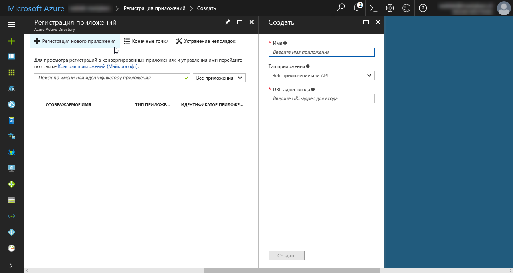
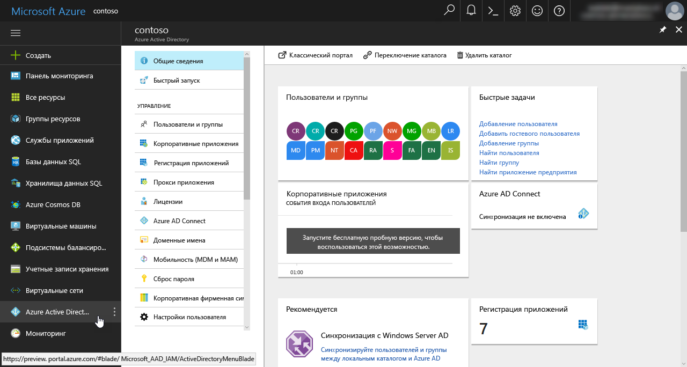

# <a name="connect-to-api-secured-with-azure-active-directory"></a><span data-ttu-id="4fbbb-102">Подключение к API, защищенному с помощью Azure Active Directory</span><span class="sxs-lookup"><span data-stu-id="4fbbb-102">Connect to API secured with Azure Active Directory</span></span>

<span data-ttu-id="4fbbb-p101">При создании решений SharePoint Framework может потребоваться подключение к пользовательскому API для извлечения данных или связи с бизнес-приложениями. Защита пользовательских API с помощью Azure Active Directory имеет ряд преимуществ и способов реализации. После создания API получить к нему доступ можно разными по сложности способами, и каждый из них имеет свои особенности. В этой статье описаны различные подходы и приведены инструкции по созданию API, защищенного с помощью Azure Active Directory, а также подключению к нему.</span><span class="sxs-lookup"><span data-stu-id="4fbbb-p101">When building SharePoint Framework solutions you might need to connect to your custom API to retrieve some data or to communicate with line of business applications. Securing custom APIs with Azure Active Directory offers you a number of benefits and can be done in a number of ways. Once you have built the API, there are a number of ways in which you can access it. These ways vary in complexity and each have their specific considerations. This article discusses the different approaches and describes step-by-step the process of building and connecting to an API secured with Azure Active Directory.</span></span>

## <a name="secure-an-api-with-azure-active-directory"></a><span data-ttu-id="4fbbb-108">Защита API с помощью Azure Active Directory</span><span class="sxs-lookup"><span data-stu-id="4fbbb-108">Secure an API with Azure Active Directory</span></span>

<span data-ttu-id="4fbbb-p102">Если у вас есть Office 365, советуем защитить пользовательские API с помощью Azure Active Directory. При этом применяются существующие учетные данные организации, управление которыми уже выполняется через Office 365 и Azure Active Directory. Пользователь с активной учетной записью может без проблем работать с приложениями, которые используют защищенные API AAD. Администраторы Azure Active Directory могут централизованно управлять доступом к API так же, как они управляют доступом ко всем другим приложениям, зарегистрированным в AAD.</span><span class="sxs-lookup"><span data-stu-id="4fbbb-p102">If you're using Office 365, securing custom APIs using Azure Active Directory is an architectural option that you should definitely consider. First and foremost, it allows you to secure the access to the API using existing organizational credentials that are already managed through Office 365 and Azure Active Directory. User with an active account can seamlessly work with applications that leverage APIs secured with AAD. Azure Active Directory administrators can centrally manage access to the API, the same way they manage access to all other applications registered with the AAD.</span></span>

<span data-ttu-id="4fbbb-p103">Защита API с помощью Azure AD избавляет разработчика от необходимости управлять собственным набором учетных данных пользователя и внедрять особый уровень безопасности для API. Кроме того, Azure Active Directory поддерживает протокол OAuth, который позволяет подключаться к API из мобильных приложений и клиентских решений.</span><span class="sxs-lookup"><span data-stu-id="4fbbb-p103">As the API developer, using Azure AD to secure your API frees you from managing a proprietary set of user credentials and implementing a custom security layer for your API. Additionally, Azure Active Directory supports the OAuth protocol which allows you to connect to the API from a range of application types varying from mobile apps to client-side solutions.</span></span>

<span data-ttu-id="4fbbb-p104">Защитить пользовательский API с помощью Azure Active Directory можно двумя основными способами. Если вы размещаете API в службе приложений Microsoft Azure, можете применить проверку подлинности службы приложений. Если вы размещаете API в собственной инфраструктуре или в контейнерах Docker, вам нужно будет защитить его в коде. В этом случае реализация зависит от языка и платформы программирования. В данной статье при описании этого варианта используется C# и веб-API ASP.NET в качестве платформы.</span><span class="sxs-lookup"><span data-stu-id="4fbbb-p104">When building custom APIs there are two main ways in which you can secure your API with Azure Active Directory. If you host the API in Microsoft Azure App Service, you can benefit of the App Service Authentication option. If you look for more hosting flexibility for your API, such as hosting it on your own infrastructure or in Docker containers, then you will need to secure it in code. In such case the implementation depends on your programming language and framework. In this article, when discussing this option, you will use C# and ASP.NET Web API as the framework.</span></span>

### <a name="secure-the-api-using-azure-app-service-authentication"></a><span data-ttu-id="4fbbb-120">Защита API с помощью проверки подлинности для службы приложений Azure</span><span class="sxs-lookup"><span data-stu-id="4fbbb-120">Secure the API using Azure App Service Authentication</span></span>

<span data-ttu-id="4fbbb-p105">При развертывании пользовательских API в службе приложений Azure для их защиты с помощью Azure Active Directory можно воспользоваться проверкой подлинности службы приложений. Самым большим преимуществом этого варианта является его простота: следуйте инструкциям на портале Azure, чтобы настроить проверку подлинности с помощью мастера. Если вы выберете базовую настройку, мастер создаст приложение AAD в Azure Active Directory, связанное с текущей подпиской. В расширенном режиме настройки вы можете выбрать, какое приложение AAD следует использовать для защиты доступа к службе приложений, в которой размещается API.</span><span class="sxs-lookup"><span data-stu-id="4fbbb-p105">When deploying custom APIs to Azure App Service you can benefit of the App Service Authentication option to secure the API with Azure Active Directory. The biggest benefit of using App Service Authentication is its simplicity: by following the configuration steps available in the Azure Portal you can either have the wizard setup the authentication configuration for you. If you choose the basic setup, the wizard will create a new AAD application in the Azure Active Directory associated with the current subscription. In the advanced configuration, you can choose which AAD application should be used to secure the access to the App Service hosting the API.</span></span>


<span data-ttu-id="4fbbb-p106">Когда будет настроена проверка подлинности службы приложений, пользователям, пытающимся получить доступ к вашему API, будет предложено войти с помощью учетной записи организации, указанной в той же службе Azure Active Directory, что и приложение AAD для защиты API. После входа вы сможете получить доступ к информации о текущем пользователе через свойство `HttpContext.Current.User`. При использовании проверки подлинности для службы приложений Azure не требуется дополнительная настройка приложения.</span><span class="sxs-lookup"><span data-stu-id="4fbbb-p106">Once App Service Authentication has been configured, users trying to access your API will be prompted to sign in with their organizational account that belongs to the same Azure Active Directory as the AAD application used to secure the API. After signing in, you will be able to access the information about the current user through the `HttpContext.Current.User` property. When using the Azure App Service Authentication there is no additional configuration required in your application.</span></span>

<span data-ttu-id="4fbbb-p107">Проверка подлинности для службы приложений Azure — это функция, доступная только в службах приложений Microsoft Azure. Она значительно упрощает реализацию аутентификации в API, но доступна только при его размещении в службе приложений Azure. Если вы хотите разместить API в другой облачной службе или контейнере Docker, сначала необходимо реализовать уровень аутентификации.</span><span class="sxs-lookup"><span data-stu-id="4fbbb-p107">Azure App Service Authentication is a feature available only in Microsoft Azure App Services. While this capability significantly simplifies implementing authentication in your API, it ties it to running inside Azure App Service. If you would want to host the API with another cloud provider or would want to host it inside a Docker container, you would need to implement the authentication layer first.</span></span>

### <a name="secure-the-api-using-aspnet-authentication"></a><span data-ttu-id="4fbbb-132">Защита API с помощью аутентификации в ASP.NET</span><span class="sxs-lookup"><span data-stu-id="4fbbb-132">Secure the API using ASP.NET authentication</span></span>

<span data-ttu-id="4fbbb-p108">Если вы не хотите ограничивать варианты размещения и развертывания API, советуем реализовать поддержку аутентификации AAD в ASP.NET. Visual Studio значительно упрощает этот процесс, и после настройки аутентификации с помощью соответствующего мастера ваш API будет требовать от пользователей входа в учетную запись организации.</span><span class="sxs-lookup"><span data-stu-id="4fbbb-p108">If you want to have the maximum flexibility with regards to where your API is hosted and how it is deployed, you should consider implementing the support for AAD authentication in ASP.NET. Visual Studio simplifies the implementation process significantly and after completing the authentication setup wizard, your API will require users to sign in using their organizational account.</span></span>


<span data-ttu-id="4fbbb-136">Во время настройки Visual Studio добавит все необходимые ссылки и настройки в проект веб-API ASP.NET, в том числе зарегистрирует новое приложение AAD для защиты вашего API.</span><span class="sxs-lookup"><span data-stu-id="4fbbb-136">During the configuration process, Visual Studio will add all the necessary references and settings to your ASP.NET Web API project, including registering a new AAD application to secure your API.</span></span>

## <a name="access-an-api-secured-with-azure-active-directory-from-sharepoint-framework-solutions"></a><span data-ttu-id="4fbbb-137">Доступ к API, защищенному с помощью Azure Active Directory, из решений SharePoint Framework</span><span class="sxs-lookup"><span data-stu-id="4fbbb-137">Access an API secured with Azure Active Directory from SharePoint Framework solutions</span></span>

<span data-ttu-id="4fbbb-p109">Решения SharePoint Framework полностью состоят из клиентского кода, поэтому они не могут безопасно хранить секреты, необходимые для подключения к защищенным API. Azure Active Directory поддерживает ряд механизмов для обеспечения безопасной связи с клиентскими решениями, такие как файлы cookie для аутентификации и неявный поток OAuth.</span><span class="sxs-lookup"><span data-stu-id="4fbbb-p109">SharePoint Framework solutions are fully client-side and as such are incapable of securely storing secrets required to connect to secured APIs. To support secure communication with client-side solutions, Azure Active Directory supports a number of mechanisms such as authentication cookies or the OAuth implicit flow.</span></span>

### <a name="access-the-api-using-adal-js"></a><span data-ttu-id="4fbbb-140">Доступ к API с помощью ADAL JS</span><span class="sxs-lookup"><span data-stu-id="4fbbb-140">Access the API using ADAL JS</span></span>

<span data-ttu-id="4fbbb-p110">Обычно для обеспечения связи между клиентскими решениями и API, защищенными с помощью Azure Active Directory, используется библиотека [ADAL JS](https://github.com/AzureAD/azure-activedirectory-library-for-js). Она упрощает реализацию аутентификации с вовлечением AAD в клиентских приложениях, а также получение маркеров доступа к определенным ресурсам. Для приложений, созданных с помощью AngularJS, в ADAL JS есть перехватчик HTTP-запросов, который автоматически добавляет необходимые маркеры доступа в заголовки исходящих веб-запросов. Использование этого перехватчика избавляет разработчиков от необходимости изменять веб-запросы к API, защищенным с помощью AAD, и позволяет сосредоточиться на создании приложения.</span><span class="sxs-lookup"><span data-stu-id="4fbbb-p110">A commonly used approach for communicating with APIs secured with Azure Active Directory from client-side solutions is using the [ADAL JS](https://github.com/AzureAD/azure-activedirectory-library-for-js) library. ADAL JS simplifies implementing authentication against AAD in client-side applications as well as retrieving access tokens for specific resources. For applications built using AngularJS, ADAL JS offers an HTTP request interceptor that automatically adds required access tokens to headers of outgoing web requests. Using this requestor developers don't need to modify web requests to APIs secured with AAD and can focus on building the application instead.</span></span>

#### <a name="benefits-of-using-adal-js-to-communicate-with-apis-secured-with-aad"></a><span data-ttu-id="4fbbb-145">Преимущества использования ADAL JS для связи с API, защищенными при помощи AAD</span><span class="sxs-lookup"><span data-stu-id="4fbbb-145">Benefits of using ADAL JS to communicate with APIs secured with AAD</span></span>

<span data-ttu-id="4fbbb-p111">При использовании ADAL JS клиентские приложения имеют полный доступ к данным идентификации текущего пользователя. Это удобно для отображения имени пользователя или фотографии профиля в приложении. При создании решений с размещением в SharePoint разработчики могут получать расширенные сведения из профиля, используя API SharePoint, но для автономных приложений это невозможно.</span><span class="sxs-lookup"><span data-stu-id="4fbbb-p111">When using ADAL JS, client-side applications have full access to the identity information of the currently signed-in user. This is convenient for requirements such as displaying user name or profile picture in the application. When building solutions hosted in SharePoint, developers can retrieve extended profile information using the SharePoint API, but for standalone applications this isn't possible.</span></span>

<span data-ttu-id="4fbbb-p112">ADAL JS не только упрощает аутентификацию в AAD, но и позволяет получать маркеры доступа к определенным ресурсам. Благодаря этим токенам приложения могут безопасно обращаться к API, защищенным с помощью AAD, таким как [Microsoft Graph](./call-microsoft-graph-from-your-web-part.md) и другие пользовательские API. Чтобы клиентское приложение могло использовать ADAL JS, его необходимо зарегистрировать в Azure Active Directory. В процессе регистрации разработчики указывают ряд настроек, таких как URL-адрес приложения и ресурсы, к которым ему требуется доступ (от своего имени или от имени текущего пользователя).</span><span class="sxs-lookup"><span data-stu-id="4fbbb-p112">Besides facilitating authentication against AAD, ADAL JS is capable of retrieving access tokens to specific resources. With these access tokens, applications can securely access APIs secured with AAD such as the [Microsoft Graph](./call-microsoft-graph-from-your-web-part.md) or other custom APIs. Before a client-side application can use ADAL JS, it has to be registered as an application in Azure Active Directory. In the registration process, developers specify a number of parameters such as the URL where the application is hosted and the resources to which the application requires access, either by itself or on behalf of the currently signed-in user.</span></span>



<span data-ttu-id="4fbbb-p113">Когда пользователь впервые запускает приложение, оно запрашивает у него необходимые разрешения. После их получения оно может запрашивать маркеры доступа к определенным ресурсам и безопасно обмениваться с ними данными.</span><span class="sxs-lookup"><span data-stu-id="4fbbb-p113">The first time the application is used, it prompts the user to grant it the necessary permissions. This is often referred to as consent flow. Once approved, the application can then request access tokens for the specific resources and communicate with them securely.</span></span>

#### <a name="considerations-when-using-adal-js-to-communicate-with-apis-secured-with-aad"></a><span data-ttu-id="4fbbb-157">Особенности использования ADAL JS для связи с API, защищенными с помощью AAD</span><span class="sxs-lookup"><span data-stu-id="4fbbb-157">Considerations when using ADAL JS to communicate with APIs secured with AAD</span></span>

<span data-ttu-id="4fbbb-p114">Библиотека ADAL JS была разработана для использования с одностраничными приложениями. Чтобы она правильно работала при использовании с решениями SharePoint Framework, необходимо [применить исправление](./call-microsoft-graph-from-your-web-part.md).</span><span class="sxs-lookup"><span data-stu-id="4fbbb-p114">ADAL JS has been designed to be used with single-page applications. As such, by default it doesn't work correctly when used with SharePoint Framework solutions. By [applying a patch](./call-microsoft-graph-from-your-web-part.md) however, it can be successfully used in SharePoint Framework projects.</span></span>

<span data-ttu-id="4fbbb-p115">При использовании ADAL JS и OAuth для доступа к API, защищенным с помощью AAD, аутентификацию обеспечивает Microsoft Azure. Возможные ошибки обрабатываются страницей входа в Azure. После входа пользователя в учетную запись организации приложение попытается получить действительный маркер доступа. Возможные ошибки, которые возникают на этом этапе, должны обрабатываться кодом приложения, так как при получении маркеров доступа не отображается пользовательский интерфейс.</span><span class="sxs-lookup"><span data-stu-id="4fbbb-p115">When using ADAL JS and OAuth to access APIs secured with AAD, the authentication flow is facilitated by Microsoft Azure. Any errors are handled by the Azure sign-in page. Once the user has signed-in with her organizational account, the application will try to retrieve a valid access token. All errors that occur at this stage have to be explicitly handled by the developer of the application as retrieving access tokens is non-interactive and doesn't present any UI to the user.</span></span>

<span data-ttu-id="4fbbb-p116">Чтобы клиентское приложение могло использовать ADAL JS, оно должно быть зарегистрировано как приложение Azure AD. При регистрации указывается URL-адрес приложения. Так как приложение полностью состоит из клиентского кода и не может безопасно хранить секрет, URL-адрес необходим AAD для обеспечения безопасности. Это требование сложно выполнить в случае решений SharePoint Framework, так как разработчики просто не знают все URL-адреса, где будет использоваться конкретная веб-часть. Кроме того, в данный момент AAD поддерживает указание не более 10 URL-адресов отклика, чего может быть не достаточно.</span><span class="sxs-lookup"><span data-stu-id="4fbbb-p116">Every client-side application that wants to use ADAL JS, needs to be registered as an Azure AD application. A part of the registration information is the URL where the application is located. Because the application is fully client-side and is not capable of securely storing a secret, the URL is a part of the contract between the application and AAD to establish security. This requirement is problematic for SharePoint Framework solutions as developers cannot simply know upfront all URLs where a particular web part will be used. Additionally, at this moment, AAD supports specifying up to 10 reply URLs which might not be sufficient in some scenarios.</span></span>

<span data-ttu-id="4fbbb-p117">Сначала клиентское приложение должно провести аутентификацию пользователя, чтобы получить маркер идентификации, который затем можно обменять на маркер доступа. Несмотря на то что решения SharePoint Framework размещаются в службе SharePoint, которая требует от пользователей входа в учетные записи организации, данные аутентификации текущего пользователя недоступны для решений SharePoint Framework. Каждое решение должно или перенаправлять пользователя на страницу входа в Azure, или показывать всплывающее окно со страницей входа. Второй вариант более удобен в случае веб-части, которая является одним из многих элементов на странице. Если на странице несколько клиентских веб-частей SharePoint Framework, каждая из них управляет своим состоянием отдельно и требует от пользователя входа.</span><span class="sxs-lookup"><span data-stu-id="4fbbb-p117">Before a client-side application can retrieve an access token to a specific resource, it needs to authenticate the user to obtain the ID token which can be then exchanged for an access token. Even though SharePoint Framework solutions are hosted in SharePoint, where users are already signed in using their organizational accounts, the authentication information for the current user isn't available to SharePoint Framework solutions. Instead, each solution must explicitly request the user to sign in. This can be done either by redirecting the user to the Azure sign-in page or by showing a pop-up window with the sign-in page. The latter is less intrusive in the case of a web part which is one of the many elements on a page. If there are multiple SharePoint Framework client-side web parts on the page, each of them manages its state separately and would require the user to explicitly sign in to that particular web part.</span></span>

<span data-ttu-id="4fbbb-p118">Скрытые элементы iframe, которые обрабатывают перенаправления к конечным точкам Azure AD, упрощают получение маркеров доступа, необходимых для связи с защищенными при помощи AAD интерфейсами API. В Microsoft Internet Explorer невозможно получить маркеры доступа в неявном потоке OAuth, если конечные точки входа в Azure AD и URL-адрес SharePoint Online не находятся в одной зоне безопасности. Если ваша организация использует Internet Explorer, убедитесь, что конечная точка Azure AD и URL-адреса SharePoint Online настроены в одной зоне безопасности. Некоторые организации отправляют эти настройки конечным пользователям, используя групповые политики.</span><span class="sxs-lookup"><span data-stu-id="4fbbb-p118">Retrieving access tokens required to communicate with APIs secured with AAD is facilitated by hidden iframes that handle redirects to Azure AD endpoints. There is a known limitation in Microsoft Internet Explorer where obtaining access tokens in OAuth implicit flow fails, if the Azure AD login endpoints and the SharePoint Online URL are not in the same security zone. If your organization is using Internet Explorer, ensure that the Azure AD endpoint and SharePoint Online URLs are configured in the same security zone. To maintain consistency, some organizations choose to push these settings to end-users using group policies.</span></span>

<span data-ttu-id="4fbbb-p119">Доступ к интерфейсам API, защищенным с помощью AAD, не может быть анонимным. Вызывающее их приложение должно предоставить действительные учетные данные. При использовании неявного потока OAuth с клиентскими приложениями это маркер доступа носителя, полученный с помощью ADAL JS. Если вы создали решение SharePoint Framework с помощью AngularJS, библиотека ADAL JS будет автоматически получать действительный маркер доступа к ресурсу и добавлять его во все исходящие запросы, выполняемые с помощью службы `$http` AngularJS. При использовании других библиотек JavaScript вам нужно будет получать действительный маркер доступа, при необходимости обновлять его и добавлять в исходящие веб-запросы самостоятельно.</span><span class="sxs-lookup"><span data-stu-id="4fbbb-p119">APIs secured with AAD cannot be accessed anonymously. Instead they require a valid credential to be presented by the application calling them. When using the OAuth implicit flow with client-side applications, this credential is the bearer access token obtained using ADAL JS. If you have built your SharePoint Framework solution using AngularJS, ADAL JS will automatically ensure that you have a valid access token for the particular resource, and add it to all outgoing requests executed using the AngularJS `$http` service. When using other JavaScript libraries, you will have to obtain a valid access token, and if necessary refresh it, and attach it to the outgoing web requests yourself.</span></span>

### <a name="access-the-api-by-leveraging-sharepoint-online-authentication-cookie"></a><span data-ttu-id="4fbbb-185">Доступ к API с помощью файла cookie аутентификации для SharePoint Online</span><span class="sxs-lookup"><span data-stu-id="4fbbb-185">Access the API by leveraging SharePoint Online authentication cookie</span></span>

<span data-ttu-id="4fbbb-186">Вместо ADAL JS для подключения к пользовательским API, защищенным с помощью AAD, можно использовать файл cookie аутентификации.</span><span class="sxs-lookup"><span data-stu-id="4fbbb-186">An alternative approach to using ADAL JS for connecting to APIs secured with AAD is levering the existing authentication cookie for seamless authentication to the custom API.</span></span>

#### <a name="how-it-works"></a><span data-ttu-id="4fbbb-187">Как это работает</span><span class="sxs-lookup"><span data-stu-id="4fbbb-187">How it works</span></span>

<span data-ttu-id="4fbbb-p120">Когда вы входите с помощью своей учетной записи организации в SharePoint Online, в браузере устанавливается файл cookie аутентификации. Этот файл cookie отправляется с каждым запросом в SharePoint, позволяя работать с сайтами и документами. Чтобы использовать этот файл cookie для подключения к пользовательскому API, защищенному с помощью AAD, на странице размещается скрытый элемент iframe, указывающий на URL-адрес API, который также защищен с помощью AAD. При попытке загрузить этот URL-адрес браузер будет перенаправлен на страницу входа в Azure AD, так как анонимный доступ запрещен. Так как вы уже вошли в SharePoint с помощью своей учетной записи организации, аутентификация будет выполнена автоматически, а вы будете перенаправлены на исходный URL-адрес. На данном этапе у вашего браузера есть файл cookie для аутентификации с вовлечением AAD, чтобы можно было получить доступ к пользовательскому API, защищенному с помощью AAD.</span><span class="sxs-lookup"><span data-stu-id="4fbbb-p120">When you sign in with your organizational account to SharePoint Online, an authentication cookie is set in your browser. This cookie is sent with every request to SharePoint allowing to work sites and documents. In order to use this cookie, to connect to a custom API secured with AAD, you place a hidden iframe on the page pointing to a URL where the API is hosted and which is also secured with AAD. Once the browser will try to load this URL, it will get redirected to the Azure AD sign-in page as anonymous access is disallowed. Because you are already signed-in with your organization account in order to access SharePoint, the authentication completed automatically, redirecting you back to the original URL. At this point, your browser has the AAD authentication cookie for accessing the custom API secured with AAD.</span></span>

<span data-ttu-id="4fbbb-p121">После размещения элемента iframe на странице к нему добавляется прослушиватель событий `onload`, который запускается после выполнения аутентификации. В этом прослушивателе устанавливается указание на то, что аутентификация выполнена и можно безопасно вызывать пользовательский API. Все веб-запросы к пользовательским API следует отложить до установки этого флага, иначе возникнет ошибка.</span><span class="sxs-lookup"><span data-stu-id="4fbbb-p121">After placing the iframe on the page, you attach an `onload` event listener to it, which is triggered after the authentication flow completed. In this event listener, you set a flag indicating that authentication completed and you can now securely call the custom API. All web requests to your custom APIs should be delayed until this flag is set or they will fail.</span></span>

```ts
// ...

export default class LatestOrdersWebPart extends BaseClientSideWebPart<ILatestOrdersWebPartProps> {
  private remotePartyLoaded: boolean = false;
  private orders: IOrder[];

  public render(): void {
    this.domElement.innerHTML = `
    <div class="${styles.latestOrders}">
      <iframe src="https://contoso.azurewebsites.net/"
          style="display:none;"></iframe>
      <div class="ms-font-xxl">Recent orders</div>
      <div class="loading"></div>
      <table class="data" style="display:none;">
        <thead>
          <tr>
            <th>ID</th>
            <th>Date</th>
            <th>Region</th>
            <th>Rep</th>
            <th>Item</th>
            <th>Units</th>
            <th>Unit cost</th>
            <th>Total</th>
          </tr>
        </thead>
        <tbody>
        </tbody>
      </table>
    </div>`;

    this.context.statusRenderer.displayLoadingIndicator(
      this.domElement.querySelector(".loading"), "orders");

    this.domElement.querySelector("iframe").addEventListener("load", (): void => {
      this.remotePartyLoaded = true;
    });

    this.executeOrDelayUntilRemotePartyLoaded((): void => {
      // retrieve and render data
    });
  }

  private executeOrDelayUntilRemotePartyLoaded(func: Function): void {
    if (this.remotePartyLoaded) {
      func();
    } else {
      setTimeout((): void => { this.executeOrDelayUntilRemotePartyLoaded(func); }, 100);
    }
  }

  // ...
}
```

<span data-ttu-id="4fbbb-p122">При выполнении междоменных запросов AJAX в веб-частях необходимо указать, что с ними следует отправлять файл cookie аутентификации. Для этого задайте свойству **credentials** веб-запроса значение **include**. Без этого запрос будет заблокирован в браузере, и вы не сможете вызвать API.</span><span class="sxs-lookup"><span data-stu-id="4fbbb-p122">When executing AJAX requests in your web parts, you have to specify, that the authentication cookie should be sent cross-domain. You can enable this, by setting the **credentials** property of the web request to **include**. Without this, the request will be blocked in browser and you will not be able to call the API.</span></span>

```ts
// ...

export default class LatestOrdersWebPart extends BaseClientSideWebPart<ILatestOrdersWebPartProps> {
    // ...

    private retrieveAndRenderData(): void {
        this.context.httpClient.get("https://contoso.azurewebsites.net/api/orders",
        HttpClient.configurations.v1, {
          credentials: "include"
        })
        .then((response: HttpClientResponse): Promise<IOrder[]> => {
          // ...
        });
    }

    // ...
}
```

<span data-ttu-id="4fbbb-p123">Чтобы можно было использовать этот метод, также необходимо определенным образом настроить пользовательский API. Прежде всего, он должен поддерживать получение учетных данных при междоменных вызовах. Для этого задайте заголовку отклика **Access-Control-Allow-Credentials** значение **true**. Затем укажите, какой источник может вызывать API. Это настраивается в заголовке отклика **Access-Control-Allow-Origin**.</span><span class="sxs-lookup"><span data-stu-id="4fbbb-p123">To support this method, the custom API requires some specific configuration as well. First of all it requires to support receiving credentials from cross-domain calls. This is done by setting the **Access-Control-Allow-Credentials** response header to **true**. Next, it needs to specify what origin is allowed to call the API. This is configured in the **Access-Control-Allow-Origin** response header.</span></span>

> <span data-ttu-id="4fbbb-205">**Важно!** При использовании заголовка **Access-Control-Allow-Credentials** можно указать только один источник.</span><span class="sxs-lookup"><span data-stu-id="4fbbb-205">**Important:** When using the **Access-Control-Allow-Credentials** you are allowed to specify only one origin.</span></span>

<span data-ttu-id="4fbbb-p124">Конкретный способ настройки этих заголовков зависит от реализации API. Если вы используете функцию Azure для создания API с помощью Node.js, эти заголовки необходимо настроить в объекте отклика:</span><span class="sxs-lookup"><span data-stu-id="4fbbb-p124">How these headers should be configured exactly, depends on the implementation of your API. If you use an Azure Function to build the API using Node.js for example, you would set these headers on the response object:</span></span>

```js
context.res = {
    body: "response",
    headers: {
        "Access-Control-Allow-Credentials" : "true",
        "Access-Control-Allow-Origin" : "https://contoso.sharepoint.com"
    }
};
```

<span data-ttu-id="4fbbb-208">При использовании веб-API ASP.NET необходимо установить пакет NuGet **Microsoft.AspNet.WebApi.Cors**, вызвать метод `config.EnableCors()` и использовать атрибут **EnableCors** для установки значений заголовков:</span><span class="sxs-lookup"><span data-stu-id="4fbbb-208">When using ASP.NET Web API, you would install the **Microsoft.AspNet.WebApi.Cors** NuGet package, call the `config.EnableCors()` method and use the **EnableCors** attribute to set the header values:</span></span>

```cs
[EnableCors("origins": "*", "headers": "*", "methods": "*", SupportsCredentials = true)]
public string Get() {
    return "response";
}
```

#### <a name="benefits-of-using-the-sharepoint-online-authentication-cookie-for-seamless-authentication"></a><span data-ttu-id="4fbbb-209">Преимущества использования файла cookie аутентификации для SharePoint Online</span><span class="sxs-lookup"><span data-stu-id="4fbbb-209">Benefits of using the SharePoint Online authentication cookie for seamless authentication</span></span>

<span data-ttu-id="4fbbb-p125">Наиболее существенное преимущество использования файла cookie аутентификации в SharePoint Online для подключения к пользовательским API, защищенным с помощью AAD, заключается в том, что при таком подходе не нужно регистрировать приложение AAD для каждой веб-части. Это избавляет от необходимости управлять URL-адресами отклика в случае страниц, на которых используется каждая веб-часть без ограничений на количество URL-адресов отклика для приложения AAD.</span><span class="sxs-lookup"><span data-stu-id="4fbbb-p125">The most important benefit for using the SharePoint Online authentication cookie to connect to custom APIs secured with AAD is the fact that in this approach you don't need to register an AAD application for every web part. This frees you from having to manage reply URLs of pages where each web part is used and doesn't have the limitation of maximum 10 reply URLs per AAD application.</span></span>

<span data-ttu-id="4fbbb-p126">Поток аутентификации обрабатывается незаметно и завершается без участия пользователя. Для сравнения: при использовании ADAL JS каждая веб-часть основывается на отдельном приложении AAD и требует от пользователя входа.</span><span class="sxs-lookup"><span data-stu-id="4fbbb-p126">The authentication flow is handled seamlessly and there is no user interaction required to complete. In comparison, when using ADAL JS, each web part is based on a different AAD application and requires user to explicitly sign in to it.</span></span>

#### <a name="considerations-when-using-the-sharepoint-online-authentication-cookie-for-seamless-authentication"></a><span data-ttu-id="4fbbb-214">Особенности использования файла cookie аутентификации для SharePoint Online</span><span class="sxs-lookup"><span data-stu-id="4fbbb-214">Considerations when using the SharePoint Online authentication cookie for seamless authentication</span></span>

<span data-ttu-id="4fbbb-p127">Подключаться к API, защищенным с помощью AAD, позволяет как ADAL JS, так и файл cookie аутентификации для SharePoint Online. Однако между двумя подходами есть несколько важных различий, на которые следует обратить внимание.</span><span class="sxs-lookup"><span data-stu-id="4fbbb-p127">From the functional point of view, using both ADAL JS and the SharePoint Online authentication cookie allows you to connect to APIs secured with AAD. There are however a few important differences between the two approaches that you should be aware of.</span></span>

<span data-ttu-id="4fbbb-p128">При использовании ADAL JS перед получением маркера доступа клиентское приложение получает маркер идентификации для текущего пользователя. Этот токен содержит сведения о текущем пользователе, полученные из AAD, такие как имя пользователя или пароль. При использовании файла cookie для аутентификации не существует маркера идентификации, но вы можете получать те же сведения о текущем пользователе из SharePoint.</span><span class="sxs-lookup"><span data-stu-id="4fbbb-p128">When using ADAL JS, before the client-side application retrieves an access token, it retrieves the identity token for the current user. This token contains information about the current user retrieved from AAD such as the user name or password. When using the authentication cookie, there is no identity token. As you're working with SharePoint, this isn't really a limitation, since you can retrieve the same information about the current user from SharePoint.</span></span>

<span data-ttu-id="4fbbb-p129">ADAL JS позволяет подключаться к любому API, защищенному с помощью Azure AD. Если используется файл cookie для аутентификации, API должен поддерживать получение учетных данных при междоменных вызовах. Разрабатывая интерфейсы API, следует учитывать это требование, чтобы эти интерфейсы можно было использовать в решениях SharePoint Framework.</span><span class="sxs-lookup"><span data-stu-id="4fbbb-p129">ADAL JS allows you to connect to any API secured with Azure AD. When using the authentication cookie, the API must explicitly support receiving credentials from cross-domain calls. When designing APIs you should take this requirement into account to ensure that you will be able to use these APIs in SharePoint Framework solutions.</span></span>

<span data-ttu-id="4fbbb-p130">Доступ к API, защищенным с помощью Azure Active Directory, возможен при использовании как ADAL JS, так и файла cookie аутентификации для SharePoint Online. Однако не все API позволяют использовать оба метода. Например, чтобы получить доступ к Microsoft Graph, у вас должен быть действительный маркер доступа OAuth с определенными разрешениями Microsoft Graph. Получить этот токен можно только с помощью ADAL JS.</span><span class="sxs-lookup"><span data-stu-id="4fbbb-p130">With both ADAL JS and the SharePoint Online authentication cookie you can access APIs secured with Azure Active Directory. But not all APIs support using of both methods. For example, in order to access the Microsoft Graph, you need to have a valid OAuth access token with specific Microsoft Graph permissions. You can obtain this token using ADAL JS but not using a SharePoint Online authentication cookie.</span></span>

<span data-ttu-id="4fbbb-p131">При использовании файла cookie аутентификации в SharePoint Online для доступа к API, защищенным с помощью AAD, вместе с запросом не отправляются дополнительные данные для авторизации. Это означает, что по умолчанию каждый пользователь с действительной учетной записью организации в службе Azure Active Directory, связанной с API, может получить доступ к API. При создании API необходимо позаботиться об авторизации, чтобы все операции с API выполняли пользователи, у которых достаточно прав.</span><span class="sxs-lookup"><span data-stu-id="4fbbb-p131">When using the SharePoint Online authentication cookie to access APIs secured with AAD no additional authorization information is being sent along with the request. This means, that by default, every user with a valid organizational account in the Azure Active Directory associated with the API can access the API. When building the API you must take care of authorization, in order to ensure that all API operations are performed by users with sufficient privileges.</span></span>

<span data-ttu-id="4fbbb-p132">Пользовательские API размещаются за пределами SharePoint Online, и к ним можно обращаться с помощью междоменных веб-запросов. По умолчанию веб-браузеры не включают учетные данные при выполнении междоменных запросов AJAX. Чтобы подключаться к этим защищенным API, необходимо разрешить отправку учетных данных для каждого исходящего веб-запроса.</span><span class="sxs-lookup"><span data-stu-id="4fbbb-p132">Custom APIs are hosted outside of SharePoint Online and can be accessed using cross-domain web requests. By default, web browsers don't include credentials when performing cross-domain AJAX requests. In order to connect to these secured APIs, you have to enable sending credentials with cross-domains explicitly for each outgoing web request.</span></span>

### <a name="general-considerations"></a><span data-ttu-id="4fbbb-234">Общие вопросы</span><span class="sxs-lookup"><span data-stu-id="4fbbb-234">General considerations</span></span>

<span data-ttu-id="4fbbb-p133">В обоих методах (использовании ADAL JS и файла cookie аутентификации в SharePoint Online) для связи с Azure Active Directory используются элементы iframe. Причина — в перенаправлениях, которые являются частью потока OAuth и не могут автоматически сопровождаться запросами AJAX. Microsoft Internet Explorer применяет политики безопасности к веб-сайтам в зависимости от их зоны. Чтобы сценарии могли получать доступ к данным из iframe, ресурс iframe и страница, на которой размещается iframe, должны находиться в одной зоне безопасности. Организация может использовать групповые политики для отправки пользователям нужных настроек.</span><span class="sxs-lookup"><span data-stu-id="4fbbb-p133">Both ADAL JS and the method using the SharePoint Online authentication cookie use iframes for communicating with Azure Active Directory. The reason for that are the redirects that are a part of the OAuth flow, and which cannot be automatically followed by AJAX requests. Microsoft Internet Explorer uses security zones to apply security policies to websites depending on the associated zone. For the scripts to be able to access information from an iframe, the resource in the iframe and the page hosting the iframe must be located in the same security zone. To ensure correct configuration, organization can use group policies to distribute the settings consistently to their users.</span></span>

## <a name="build-an-api-secured-with-azure-active-directory"></a><span data-ttu-id="4fbbb-240">Создание API, защищенного с помощью Azure Active Directory</span><span class="sxs-lookup"><span data-stu-id="4fbbb-240">Build an API secured with Azure Active Directory</span></span>

<span data-ttu-id="4fbbb-p134">Защитить доступ к API с помощью Azure Active Directory не сложно. Требуется всего несколько действий, и они зависят от реализации API. Если вы решили использовать функции Azure, безопасность можно настроить на портале Azure. Если вы создали API, используя веб-API ASP.NET, и не хотите размещать его в службе приложений Azure, вам потребуется расширить код веб-API, чтобы добавить в него аутентификацию. Ниже описано, как создать и настроить API, защищенный с помощью AAD, используя решение "Функции Azure" и веб-API ASP.NET.</span><span class="sxs-lookup"><span data-stu-id="4fbbb-p134">Securing the access to an API with Azure Active Directory isn't complex and requires just a few steps. The exact process varies depending on the implementation of your API. If you choose to use Azure Functions, you will be able to configure the security through the Azure Portal. If you built your API as using ASP.NET WebAPI and want to host it somewhere else than in the Azure App Service, you will need to extend the WebAPI's code to add authentication to it. Following is a step-by-step description of how you would build and configure an API secured with AAD using both Azure Functions and ASP.NET WebAPI.</span></span>

### <a name="build-the-api-using-an-azure-function"></a><span data-ttu-id="4fbbb-246">Создание API с помощью решения "Функции Azure"</span><span class="sxs-lookup"><span data-stu-id="4fbbb-246">Build the API using an Azure Function</span></span>

<span data-ttu-id="4fbbb-p135">У создания API с помощью решения "Функции Azure" есть ряд преимуществ. Прежде всего, оно значительно упрощает разработку и развертывание API. Это решение дает большой простор для настройки. Единственное, о чем вам нужно позаботиться, — это код API. Для всего остального (от аутентификации до поддержки CORS и документирования API) можно использовать портал Azure.</span><span class="sxs-lookup"><span data-stu-id="4fbbb-p135">Building APIs using Azure Functions offers you a number of benefits. First and foremost, it significantly simplifies the development and deployment process of the API. Azure Functions offer rich set of configuration options. The only thing that you need to take care of is the actual API code. For everything else, from authentication to support CORS and documenting the API, you can use the Azure Portal.</span></span>

<span data-ttu-id="4fbbb-p136">Решение "Функции Azure" размещается в службе приложений Azure и использует многие возможности, доступные в основной службе. Вы можете защитить свой API не только с помощью функции или ключа администратора, но и с помощью Azure Active Directory или одного из других доступных поставщиков аутентификации, включив безопасность службы приложений Azure. Аутентификацию службы приложений можно настроить на портале Azure, при этом не требуется изменять код API.</span><span class="sxs-lookup"><span data-stu-id="4fbbb-p136">Azure Functions are hosted in Azure App Service and benefit of many capabilities available in the underlying service. On top of securing the API using a function or admin key, you can choose to enable Azure App Service security and protect your API using Azure Active Directory or one of the other available authentication providers. App Service authentication can be configured via the Azure Portal and doesn't require any changes in the API code.</span></span>

<span data-ttu-id="4fbbb-255">Ниже описано, как создать защищенный с помощью Azure Active Directory API, который может безопасно вызываться из междоменного источника, используя "Функции Azure".</span><span class="sxs-lookup"><span data-stu-id="4fbbb-255">Following is how you would use Azure Functions to create an API secured with Azure Active Directory and capable of being called from a cross-domain origin in a secured way.</span></span>

#### <a name="create-new-azure-function"></a><span data-ttu-id="4fbbb-256">Создание новой функции Azure</span><span class="sxs-lookup"><span data-stu-id="4fbbb-256">Create new Azure Function</span></span>

<span data-ttu-id="4fbbb-257">На портале Azure перейдите в группу ресурсов и добавьте приложение-функцию.</span><span class="sxs-lookup"><span data-stu-id="4fbbb-257">In the Azure Portal go to your Resource Group and add a Function App.</span></span>


<span data-ttu-id="4fbbb-259">После подготовки откройте новое приложение-функцию и добавьте новую функцию, щелкнув значок "плюс" рядом с меткой "Функции".</span><span class="sxs-lookup"><span data-stu-id="4fbbb-259">Once the Function App has been provisioned, open the newly created Function App and add a new function by clicking the plus icon next to the Functions label.</span></span>


<span data-ttu-id="4fbbb-261">На экране быстрого начала работы прокрутите содержимое вниз, чтобы перейти к разделу **Создайте свою собственную**, и выберите вариант **Пользовательская функция**.</span><span class="sxs-lookup"><span data-stu-id="4fbbb-261">On the quick start screen, scroll down to the **Get started on your own** section and choose the **Custom function** option.</span></span>


<span data-ttu-id="4fbbb-p137">Из списка шаблонов выберите **HttpTrigger-JavaScript**. В качестве имени функции укажите **Заказы** и установите уровень авторизации **Анонимный**, так как вы будете использовать Azure AD для защиты доступа к функции Azure. Подтвердите свой выбор, нажав кнопку **Создать**.</span><span class="sxs-lookup"><span data-stu-id="4fbbb-p137">From the list of templates choose **HttpTrigger-JavaScript**. As the function name, use **Orders** and set the function Authorization level to **Anonymous** as you will use Azure AD to secure the access to the Azure Function. Confirm your selection by clicking the **Create** button.</span></span>


#### <a name="implement-api-code"></a><span data-ttu-id="4fbbb-267">Внедрение кода API</span><span class="sxs-lookup"><span data-stu-id="4fbbb-267">Implement API code</span></span>

<span data-ttu-id="4fbbb-268">Замените код функции следующим фрагментом:</span><span class="sxs-lookup"><span data-stu-id="4fbbb-268">Replace the function's code with the following snippet:</span></span>

```js
module.exports = function (context, req) {
    context.res = {
        body: [
            {
              id: 1,
              orderDate: new Date(2016, 0, 6),
              region: "east",
              rep: "Jones",
              item: "Pencil",
              units: 95,
              unitCost: 1.99,
              total: 189.05
            },
            {
              id: 2,
              orderDate: new Date(2016, 0, 23),
              region: "central",
              rep: "Kivell",
              item: "Binder",
              units: 50,
              unitCost: 19.99,
              total: 999.50
            },
            {
              id: 3,
              orderDate: new Date(2016, 1, 9),
              region: "central",
              rep: "Jardine",
              item: "Pencil",
              units: 36,
              unitCost: 4.99,
              total: 179.64
            },
            {
              id: 4,
              orderDate: new Date(2016, 1, 26),
              region: "central",
              rep: "Gill",
              item: "Pen",
              units: 27,
              unitCost: 19.99,
              total: 539.73
            },
            {
              id: 5,
              orderDate: new Date(2016, 2, 15),
              region: "west",
              rep: "Sorvino",
              item: "Pencil",
              units: 56,
              unitCost: 2.99,
              total: 167.44
            }],
        headers: {
            "Access-Control-Allow-Credentials" : "true",
            "Access-Control-Allow-Origin" : "https://contoso.sharepoint.com"
        }
    };
    context.done();
};
```

<span data-ttu-id="4fbbb-269">Измените URL-адрес, указанный в заголовке **Access-Control-Allow-Origin**, в соответствии с URL-адресом клиента SharePoint Online, который будет вызывать этот API.</span><span class="sxs-lookup"><span data-stu-id="4fbbb-269">Change the URL specified in the **Access-Control-Allow-Origin** header to match the URL of your SharePoint Online tenant from which you will be calling this API.</span></span>

<span data-ttu-id="4fbbb-270">Сохраните изменения в коде функции, нажав кнопку **Сохранить**.</span><span class="sxs-lookup"><span data-stu-id="4fbbb-270">Save the changes to the function's code by clicking the **Save** button.</span></span>


#### <a name="change-cors-settings"></a><span data-ttu-id="4fbbb-272">Изменение настроек CORS</span><span class="sxs-lookup"><span data-stu-id="4fbbb-272">Change CORS settings</span></span>

<span data-ttu-id="4fbbb-p138">Решение "Функции Azure" размещается в службе приложений Azure, что позволяет настраивать параметры CORS на портале Azure. Это удобно, но при настройке на портале ее нельзя использовать вместе с заголовком **Access-Control-Allow-Credentials**, который требуется API для принятия файла cookie аутентификации из другого источника. Чтобы клиентская аутентификация работала правильно, настройки CORS службы приложений Azure необходимо очистить.</span><span class="sxs-lookup"><span data-stu-id="4fbbb-p138">Azure Functions are hosted in Azure App Service which allows you to configure its Cross-Origin Resource Sharing (CORS) settings through the Azure Portal. While this is convenient, if configured through the portal, it cannot be used in combination with the **Access-Control-Allow-Credentials** header, which is required by the API to accept authentication cookie coming from another origin. For the client-sie authentication to work correctly, CORS settings of the Azure App Service must be cleared.</span></span>

<span data-ttu-id="4fbbb-276">В приложении-функции выберите функцию Azure и перейдите к колонке **Функции платформы**.</span><span class="sxs-lookup"><span data-stu-id="4fbbb-276">In the Function App, select your Azure Function and navigate to the **Platform features** blade.</span></span>


<span data-ttu-id="4fbbb-278">В разделе **API** выберите параметр **CORS**.</span><span class="sxs-lookup"><span data-stu-id="4fbbb-278">From the **API** section, choose the **CORS** option.</span></span>


<span data-ttu-id="4fbbb-280">Удалите все записи в колонке настроек CORS, чтобы очистить конфигурацию CORS.</span><span class="sxs-lookup"><span data-stu-id="4fbbb-280">On the CORS settings blade, delete all entries so that the CORS configuration is empty.</span></span>


<span data-ttu-id="4fbbb-282">Подтвердите удаление, нажав кнопку **Сохранить**.</span><span class="sxs-lookup"><span data-stu-id="4fbbb-282">Confirm the deletion by clicking the **Save** button.</span></span>


#### <a name="enable-app-service-authentication"></a><span data-ttu-id="4fbbb-284">Включение проверки подлинности службы приложений</span><span class="sxs-lookup"><span data-stu-id="4fbbb-284">Enable App Service Authentication</span></span>

<span data-ttu-id="4fbbb-p139">В параметрах приложения-функции вернитесь к колонке параметров платформы. В разделе **Сеть** выберите параметр **Аутентификация / авторизация**.</span><span class="sxs-lookup"><span data-stu-id="4fbbb-p139">In the Function App settings, go back to the Platform settings blade. From the **Networking** section, select the **Authentication / Authorization** option.</span></span>


<span data-ttu-id="4fbbb-288">Включите аутентификацию службы приложений, установив переключатель **Проверка подлинности службы приложений** в положение **Вкл**.</span><span class="sxs-lookup"><span data-stu-id="4fbbb-288">Enable the App Service Authentication by setting the **App Service Authentication** toggle to **On**.</span></span>


<span data-ttu-id="4fbbb-290">Чтобы запретить анонимный доступ к API и принудительно выполнять аутентификацию с помощью Azure AD, выберите в раскрывающемся списке **Предпринимаемое действие, если проверка подлинности для запроса не выполнена** значение **Войти с использованием Azure Active Directory**.</span><span class="sxs-lookup"><span data-stu-id="4fbbb-290">To disallow anonymous access to the API and force authentication using Azure AD, set the value of the **Action to take when request is not authenticated** drop-down to **Login with Azure Active Directory**.</span></span>


<span data-ttu-id="4fbbb-292">После этого выберите Azure Active Directory в списке поставщиков проверки подлинности для настройки.</span><span class="sxs-lookup"><span data-stu-id="4fbbb-292">Next, in the list of authentication providers, select Azure Active Directory to configure it.</span></span>


<span data-ttu-id="4fbbb-294">В колонке "Аутентификация Active Directory" установите **режим управления** **Экспресс** и создайте приложение AAD.</span><span class="sxs-lookup"><span data-stu-id="4fbbb-294">On the Active Directory Authentication blade, set the **Management mode** to **Express** and create a new AAD app.</span></span>

> <span data-ttu-id="4fbbb-p140">**Важно!** При использовании экспресс-режима настройки портал Azure создаст новое приложение AAD из того же каталога, в котором находится приложение-функция. Если приложение-функция размещается в другой подписке Azure с другим каталогом, следует выбрать расширенный режим и указать идентификатор каталога и приложение, которое необходимо использовать для защиты доступа к API.</span><span class="sxs-lookup"><span data-stu-id="4fbbb-p140">**Important:** when using the express configuration mode, the Azure Portal will create a new AAD application from the same directory as where the Function App is located. If the Function App is hosted in a different Azure subscription with a different directory, you should use the advanced mode instead, and specify the ID of the directory and application that should be used to secure the access to the API.</span></span>
>
> <span data-ttu-id="4fbbb-p141">Если используется существующее приложение AAD, следует сделать так, чтобы оно принимало учетные данные только от одного клиента. Если настроите приложение как мультитенантное, любой пользователь с действительной рабочей или личной учетной записью сможет подключиться к вашему API.</span><span class="sxs-lookup"><span data-stu-id="4fbbb-p141">When using existing AAD applications you should configure the application to accept credentials from a single tenant only. Configuring the application as multi-tenant would allow any user with a valid organization or personal account to connect to your API.</span></span>
>
> <span data-ttu-id="4fbbb-p142">Приложение AAD может защитить доступ к API только на этапе аутентификации. При создании API также следует авторизовать запросы в коде API, чтобы только пользователи, у которых достаточно прав, могли обращаться к API.</span><span class="sxs-lookup"><span data-stu-id="4fbbb-p142">Using an AAD application to secure the access to your API only accounts for authentication. When building your API, you should also authorize requests in your API's code, to ensure that only users with sufficient privileges are using the API.</span></span>

<span data-ttu-id="4fbbb-p143">Так как приложение предназначено только для защиты доступа к функции Azure, оно не требует дополнительных разрешений. Подтвердите выбор, нажав кнопку **ОК**.</span><span class="sxs-lookup"><span data-stu-id="4fbbb-p143">Because the app is only meant to secure the access to the Azure Function, it doesn't require any additional permissions. Confirm the selection by clicking the **OK** button.</span></span>


<span data-ttu-id="4fbbb-304">Когда колонка Azure Active Directory закроется, нажмите кнопку **Сохранить** в колонке **Аутентификация / авторизация**, чтобы подтвердить все изменения настроек аутентификации.</span><span class="sxs-lookup"><span data-stu-id="4fbbb-304">When the Azure Active Directory blade closes, back on the **Authentication / Authorization** blade, click the **Save** button to confirm all changes to authentication settings.</span></span>


<span data-ttu-id="4fbbb-306">При попытке перейти по URL-адресу API в новом окне в режиме конфиденциальности вам будет предложено войти, используя учетную запись Azure AD.</span><span class="sxs-lookup"><span data-stu-id="4fbbb-306">If you try to navigate to your API URL in a new private window, you should be prompted to sign in using your Azure AD account.</span></span>


<span data-ttu-id="4fbbb-308">На данном этапе API можно безопасно вызывать из клиентской веб-части SharePoint Framework, используя файл cookie аутентификации.</span><span class="sxs-lookup"><span data-stu-id="4fbbb-308">At this point, the API is ready to be called securely from a SharePoint Framework client-side web part using the authentication cookie.</span></span>

### <a name="build-the-api-using-aspnet-web-api"></a><span data-ttu-id="4fbbb-309">Создание API с помощью веб-API ASP.NET</span><span class="sxs-lookup"><span data-stu-id="4fbbb-309">Build the API using ASP.NET Web API</span></span>

<span data-ttu-id="4fbbb-p144">Для реализации API также можно использовать веб-API ASP.NET. По сравнению с созданием API с помощью решения "Функции Azure", этот способ требует значительно больше работы. Вам нужно не только создать для него полный проект, но и подумать о развертывании API. С другой стороны, использование веб-API ASP.NET позволяет развертывать API на различных платформах: в службе приложений Azure, контейнерах Docker, других облачных службах и даже собственной инфраструктуре.</span><span class="sxs-lookup"><span data-stu-id="4fbbb-p144">Another way to implement the API is by using ASP.NET WebAPI. Comparing to using Azure Functions to build the API, ASP.NET WebAPI requires significantly more work. Not only you have to setup a complete project for it, but also you have to think about where the API will be deployed to. Using ASP.NET WebAPI offers you on the other hand more flexibility and allows you to deploy the API to different to different platforms such as Azure App Service, Docker containers, other cloud providers or even on your infrastructure.</span></span>

<span data-ttu-id="4fbbb-p145">Ниже описано, как создать API с помощью веб-API ASP.NET, развернуть его в службе приложений Azure и защитить с помощью проверки подлинности для службы приложений Azure. Еще ниже описано, как расширить API, чтобы он сам выполнял аутентификацию, что необходимо для его развертывания на других платформах.</span><span class="sxs-lookup"><span data-stu-id="4fbbb-p145">Following is how you would build an API using ASP.NET WebAPI, deploy it to Azure App Service and secure it using Azure App Service Authentication. Later, you will extend the API to perform the authentication by itself, so that it can be deployed to other platforms as well.</span></span>

#### <a name="create-new-aspnet-webapi-project"></a><span data-ttu-id="4fbbb-316">Создание нового проекта веб-API ASP.NET</span><span class="sxs-lookup"><span data-stu-id="4fbbb-316">Create new ASP.NET WebAPI project</span></span>

<span data-ttu-id="4fbbb-p146">Откройте Visual Studio и в меню **Файл** выберите пункт **Создать проект**. В диалоговом окне **Новый проект** выберите шаблоны C# "Веб" и в списке доступных шаблонов выберите шаблон **Веб-приложение ASP.NET**.</span><span class="sxs-lookup"><span data-stu-id="4fbbb-p146">In Visual Studio, from the **File** menu, choose the **New / Project** option. In the **New Project** dialog, select C# Web templates and from the list of available templates, select the **ASP.NET Web Application** template.</span></span>


<span data-ttu-id="4fbbb-320">Выберите **Веб-API** как тип проекта веб-приложения ASP.NET.</span><span class="sxs-lookup"><span data-stu-id="4fbbb-320">As the type of ASP.NET Web Application project, select **Web API**.</span></span>


<span data-ttu-id="4fbbb-322">Так как для защиты доступа к API вы будете использовать проверку подлинности для службы приложений Azure, нажмите кнопку **Изменить способ проверки подлинности** и выберите параметр **Нет проверки подлинности**.</span><span class="sxs-lookup"><span data-stu-id="4fbbb-322">Because you will use Azure App Service Authentication to secure the access to the API, click the **Change Authentication** button and select the **No Authentication** option.</span></span>


<span data-ttu-id="4fbbb-324">Подтвердите свой выбор, нажав кнопку **ОК**.</span><span class="sxs-lookup"><span data-stu-id="4fbbb-324">Confirm your choice by clicking the **OK** button.</span></span>

<span data-ttu-id="4fbbb-p147">Visual Studio позволяет легко развернуть свой веб-API в службе приложений Azure. Чтобы воспользоваться этой возможностью, в разделе **Microsoft Azure** в диалоговом окне **Новое веб-приложение ASP.NET** выберите раздел **Размещение в облаке** и в раскрывающемся списке выберите пункт **Служба приложений**.</span><span class="sxs-lookup"><span data-stu-id="4fbbb-p147">Visual Studio allows you to easily deploy your WebAPI to Azure App Service. To benefit of this capability, in the **New ASP.NET Web Application** dialog, in the **Microsoft Azure** section, select the **Host in the cloud** section and in the drop-down select the **App Service** option.</span></span>


<span data-ttu-id="4fbbb-328">В диалоговом окне **Создать службу приложений** укажите имя создаваемого веб-приложения и выберите свою подписку Azure, группу ресурсов и план обслуживания приложений, которые необходимо использовать для этого приложения.</span><span class="sxs-lookup"><span data-stu-id="4fbbb-328">In the **Create App Service** dialog, specify the name for the web app to be created and select your Azure subscription, Resource Group and App Service Plan that you want to use for this application.</span></span>


<span data-ttu-id="4fbbb-p148">Подтвердите свой выбор, нажав кнопку **Создать**. Visual Studio создаст веб-приложение Azure для размещения вашего веб-приложения.</span><span class="sxs-lookup"><span data-stu-id="4fbbb-p148">Confirm your choice by clicking the **Create** button. At this point, Visual Studio will create a new Azure Web App to host your web application.</span></span>

#### <a name="add-support-for-cors"></a><span data-ttu-id="4fbbb-332">Добавление поддержки CORS</span><span class="sxs-lookup"><span data-stu-id="4fbbb-332">Add support for CORS</span></span>

<span data-ttu-id="4fbbb-p149">По умолчанию API, создаваемые с помощью шаблона проекта "Веб-приложение ASP.NET", не поддерживают CORS, и их не могут вызывать клиентские приложения, размещенные в разных доменах. Чтобы добавить поддержку CORS в веб-API, щелкните проект правой кнопкой мыши и в контекстном меню выберите пункт **Управление пакетами NuGet**.</span><span class="sxs-lookup"><span data-stu-id="4fbbb-p149">By default, APIs created using the ASP.NET Web Application project template don't support CORS and cannot be called by client-applications hosted on different domains. To add support for CORS to your WebAPI, click right on the project, and from the context menu choose the **Manage NuGet Packages...** option.</span></span>


<span data-ttu-id="4fbbb-336">На вкладке **Управление пакетами NuGet** найдите пакет **Microsoft.AspNet.WebApi.Cors** и установите его в проекте.</span><span class="sxs-lookup"><span data-stu-id="4fbbb-336">On the **Manage NuGet Packages** tab, search for a package named **Microsoft.AspNet.WebApi.Cors** and install it in your project.</span></span>


#### <a name="add-data-model"></a><span data-ttu-id="4fbbb-338">Добавление модели данных</span><span class="sxs-lookup"><span data-stu-id="4fbbb-338">Add data model</span></span>

<span data-ttu-id="4fbbb-p150">В проекте определите модель данных, возвращаемых API. В папке **Модели** добавьте новый класс и присвойте ему имя **Заказ**. Вставьте следующий код в новый файл:</span><span class="sxs-lookup"><span data-stu-id="4fbbb-p150">In the project, define a model that will represent the data returned by the API. In the **Models** folder add a new class and name it **Order**. Paste the following code into the newly crated file:</span></span>

```cs
using Newtonsoft.Json;
using Newtonsoft.Json.Converters;
using System;

namespace PnP.Aad.Api.Models {
    public class Order {
        [JsonProperty(PropertyName = "id")]
        public int Id { get; set; }
        [JsonProperty(PropertyName = "orderDate")]
        public DateTime OrderDate { get; set; }
        [JsonConverter(typeof(StringEnumConverter))]
        [JsonProperty(PropertyName = "region")]
        public Region Region { get; set; }
        [JsonProperty(PropertyName = "rep")]
        public string Rep { get; set; }
        [JsonProperty(PropertyName = "item")]
        public string Item { get; set; }
        [JsonProperty(PropertyName = "units")]
        public uint Units { get; set; }
        [JsonProperty(PropertyName = "unitCost")]
        public double UnitCost { get; set; }
        [JsonProperty(PropertyName = "total")]
        public double Total { get; set; }
    }

    public enum Region {
        East,
        Central,
        West
    }
}
```

#### <a name="add-orders-api"></a><span data-ttu-id="4fbbb-342">Добавление API заказов</span><span class="sxs-lookup"><span data-stu-id="4fbbb-342">Add Orders API</span></span>

<span data-ttu-id="4fbbb-p151">После этого добавьте API, который будет возвращать информацию о последних заказах. В папке **Controllers** создайте новый класс и присвойте ему имя **OrdersController**. Вставьте следующий код в новый файл:</span><span class="sxs-lookup"><span data-stu-id="4fbbb-p151">Next, add an API that will return the information about the latest orders. In the **Controllers** folder create a new class and name it **OrdersController**. Paste the following code into the newly created file:</span></span>

```cs
using PnP.Aad.Api.Models;
using System;
using System.Collections.Generic;
using System.Web.Http;

namespace PnP.Aad.Api.Controllers {
    public class OrdersController : ApiController {
        private List<Order> orders = new List<Order> {
            new Order {
                Id = 1,
                OrderDate = new DateTime(2016, 1, 6),
                Region = Region.East,
                Rep = "Jones",
                Item = "Pencil",
                Units = 95,
                UnitCost = 1.99,
                Total = 189.05
            },
            new Order {
                Id = 2,
                OrderDate = new DateTime(2016, 1, 23),
                Region = Region.Central,
                Rep = "Kivell",
                Item = "Binder",
                Units = 50,
                UnitCost = 19.99,
                Total = 999.50
            },
            new Order {
                Id = 3,
                OrderDate = new DateTime(2016, 2, 9),
                Region = Region.Central,
                Rep = "Jardine",
                Item = "Pencil",
                Units = 36,
                UnitCost = 4.99,
                Total = 179.64
            },
            new Order {
                Id = 4,
                OrderDate = new DateTime(2016, 2, 26),
                Region = Region.Central,
                Rep = "Gill",
                Item = "Pen",
                Units = 27,
                UnitCost = 19.99,
                Total = 539.73
            },
            new Order {
                Id = 5,
                OrderDate = new DateTime(2016, 3, 15),
                Region = Region.West,
                Rep = "Sorvino",
                Item = "Pencil",
                Units = 56,
                UnitCost = 2.99,
                Total = 167.44
            }
        };

        public IEnumerable<Order> Get() {
            return orders;
        }
    }
}
```

#### <a name="extend-the-api-with-support-for-cors"></a><span data-ttu-id="4fbbb-346">Добавление поддержки CORS в API</span><span class="sxs-lookup"><span data-stu-id="4fbbb-346">Extend the API with support for CORS</span></span>

<span data-ttu-id="4fbbb-p152">Несмотря на то что вы установили поддержку технологии CORS в своем проекте, она пока не активирована. Если вы вызовете новый API заказов из клиентского приложения, размещенного в другом домене, то возникнет ошибка CORS и запрос не будет выполнен. Чтобы API поддерживал CORS, в него необходимо добавить атрибут **EnableCors**.</span><span class="sxs-lookup"><span data-stu-id="4fbbb-p152">Even though you have installed support CORS in your project, it's not being used actively yet. If you would call the newly created Orders API from a client application hosted on another domain, you would get a CORS error and the request would fail. For an API to support CORS, it has to be decorated with the **EnableCors** attribute.</span></span>

```cs
using PnP.Aad.Api.Models;
using System;
using System.Collections.Generic;
using System.Web.Http;
using System.Web.Http.Cors;

namespace PnP.Aad.Api.Controllers {
    public class OrdersController : ApiController {
        private List<Order> orders = new List<Order> {
            // ...
        };

        [EnableCors("*", "*", "GET", SupportsCredentials = true)]
        public IEnumerable<Order> Get() {
            return orders;
        }
    }
}
```

<span data-ttu-id="4fbbb-350">После этого откройте файл **.\App_Start\WebApiConfig.cs** и вставьте следующий код:</span><span class="sxs-lookup"><span data-stu-id="4fbbb-350">Next, open the **.\App_Start\WebApiConfig.cs** file and paste the following code:</span></span>

```cs
using System.Web.Http;

namespace PnP.Aad.Api {
    public static class WebApiConfig {
        public static void Register(HttpConfiguration config) {
            // Web API configuration and services

            // Web API routes
            config.MapHttpAttributeRoutes();

            config.EnableCors();

            config.Routes.MapHttpRoute(
                name: "DefaultApi",
                routeTemplate: "api/{controller}/{id}",
                defaults: new { id = RouteParameter.Optional }
            );
        }
    }
}
```

<span data-ttu-id="4fbbb-351">На данном этапе код API готов, и его можно публиковать в веб-приложении Azure.</span><span class="sxs-lookup"><span data-stu-id="4fbbb-351">At this point, the API is code complete and can be published to the Azure Web App.</span></span>

#### <a name="publish-the-api-to-azure-web-app"></a><span data-ttu-id="4fbbb-352">Публикация API в веб-приложении Azure</span><span class="sxs-lookup"><span data-stu-id="4fbbb-352">Publish the API to Azure Web App</span></span>

<span data-ttu-id="4fbbb-353">В Visual Studio щелкните проект правой кнопкой мыши и в контекстном меню выберите пункт **Опубликовать**.</span><span class="sxs-lookup"><span data-stu-id="4fbbb-353">In Visual Studio, right click on the project, and from the context menu choose the **Publish...** option.</span></span>


<span data-ttu-id="4fbbb-355">В диалоговом окне "Публикация" проверьте все сведения и нажмите кнопку **Опубликовать**, чтобы начать процесс публикации.</span><span class="sxs-lookup"><span data-stu-id="4fbbb-355">In the Publish dialog, verify that all information is correct and click the **Publish** button to start the publishing process.</span></span>


<span data-ttu-id="4fbbb-p153">После публикации перейдите по URL-адресу API в веб-браузере, например _http://pnp-aad-api.azurewebsites.net/api/orders_. На данный момент API не защищен и доступен анонимным пользователям.</span><span class="sxs-lookup"><span data-stu-id="4fbbb-p153">Once the publishing process completes, navigate in your web browser to the API URL, eg. _http://pnp-aad-api.azurewebsites.net/api/orders_. At this point the API is not secured and can be accessed by anonymous users.</span></span>


#### <a name="secure-the-api-using-azure-app-service"></a><span data-ttu-id="4fbbb-361">Защита API с помощью службы приложений Azure</span><span class="sxs-lookup"><span data-stu-id="4fbbb-361">Secure the API using Azure App Service</span></span>

<span data-ttu-id="4fbbb-p154">Чтобы защитить API с помощью Azure AD, перейдите на портал Azure и откройте веб-приложение, в котором размещен ваш API. В группе **Параметры** выберите пункт **Аутентификация / авторизация**.</span><span class="sxs-lookup"><span data-stu-id="4fbbb-p154">To secure the API using Azure AD go to the Azure Portal and open the Web App hosting your API. From the **Settings** group, select the **Authentication / Authorization** option.</span></span>


<span data-ttu-id="4fbbb-365">Чтобы включить проверку подлинности для веб-приложения, установите переключатель **Проверка подлинности службы приложений** в положение **Вкл**.</span><span class="sxs-lookup"><span data-stu-id="4fbbb-365">To enable authentication for your Web App, set the **App Service Authentication** toggle to **On**.</span></span>


<span data-ttu-id="4fbbb-367">Чтобы запретить анонимный доступ к API, в раскрывающемся списке **Предпринимаемое действие, если проверка подлинности для запроса не выполнена** выберите пункт **Войти с использованием Azure Active Directory**.</span><span class="sxs-lookup"><span data-stu-id="4fbbb-367">To disallow anonymous access to the API, in the **Action to take when request is not authenticated** drop-down, select the **Login with Azure Active Directory** option.</span></span>


<span data-ttu-id="4fbbb-369">Настройте проверку подлинности на основе Azure Active Directory, выбрав **Azure Active Directory** из списка поставщиков аутентификации.</span><span class="sxs-lookup"><span data-stu-id="4fbbb-369">Finally, configure Azure Active Directory authentication by from the list of authentication providers selecting **Azure Active Directory**.</span></span>


<span data-ttu-id="4fbbb-371">В колонке "Аутентификация Active Directory" установите **режим управления** **Экспресс** и создайте приложение AAD.</span><span class="sxs-lookup"><span data-stu-id="4fbbb-371">On the Active Directory Authentication blade, set the **Management mode** to **Express** and create a new AAD app.</span></span>

> <span data-ttu-id="4fbbb-p155">**Важно!** При использовании экспресс-режима настройки портал Azure создаст новое приложение AAD из того же каталога, в котором находится приложение-функция. Если приложение-функция размещается в другой подписке Azure с другим каталогом, следует выбрать расширенный режим и указать идентификатор каталога и приложение, которое необходимо использовать для защиты доступа к API.</span><span class="sxs-lookup"><span data-stu-id="4fbbb-p155">**Important:** when using the express configuration mode, the Azure Portal will create a new AAD application from the same directory as where the Function App is located. If the Function App is hosted in a different Azure subscription with a different directory, you should use the advanced mode instead, and specify the ID of the directory and application that should be used to secure the access to the API.</span></span>
>
> <span data-ttu-id="4fbbb-p156">Если используется существующее приложение AAD, следует сделать так, чтобы оно принимало учетные данные только от одного клиента. Если настроите приложение как мультитенантное, любой пользователь с действительной рабочей или личной учетной записью сможет подключиться к вашему API.</span><span class="sxs-lookup"><span data-stu-id="4fbbb-p156">When using existing AAD applications you should configure the application to accept credentials from a single tenant only. Configuring the application as multi-tenant would allow any user with a valid organization or personal account to connect to your API.</span></span>
>
> <span data-ttu-id="4fbbb-p157">Приложение AAD может защитить доступ к API только на этапе аутентификации. При создании API также следует авторизовать запросы в коде API, чтобы только пользователи, у которых достаточно прав, могли обращаться к API.</span><span class="sxs-lookup"><span data-stu-id="4fbbb-p157">Using an AAD application to secure the access to your API only accounts for authentication. When building your API, you should also authorize requests in your API's code, to ensure that only users with sufficient privileges are using the API.</span></span>

<span data-ttu-id="4fbbb-p158">Так как приложение предназначено только для защиты доступа к функции Azure, оно не требует дополнительных разрешений. Подтвердите выбор, нажав кнопку **ОК**.</span><span class="sxs-lookup"><span data-stu-id="4fbbb-p158">Because the app is only meant to secure the access to the Azure Function, it doesn't require any additional permissions. Confirm the selection by clicking the **OK** button.</span></span>


<span data-ttu-id="4fbbb-381">Когда колонка Azure Active Directory закроется, нажмите кнопку **Сохранить** в колонке **Аутентификация / авторизация**, чтобы подтвердить все изменения настроек аутентификации.</span><span class="sxs-lookup"><span data-stu-id="4fbbb-381">When the Azure Active Directory blade closes, back on the **Authentication / Authorization** blade, click the **Save** button to confirm all changes to authentication settings.</span></span>


<span data-ttu-id="4fbbb-383">При попытке перейти по URL-адресу API в новом окне в режиме конфиденциальности вам будет предложено войти, используя учетную запись Azure AD.</span><span class="sxs-lookup"><span data-stu-id="4fbbb-383">If you try to navigate to your API URL in a new private window, you should be prompted to sign in using your Azure AD account.</span></span>


<span data-ttu-id="4fbbb-385">На данном этапе API можно безопасно вызывать из клиентской веб-части SharePoint Framework, используя файл cookie аутентификации.</span><span class="sxs-lookup"><span data-stu-id="4fbbb-385">At this point, the API is ready to be called securely from a SharePoint Framework client-side web part using the authentication cookie.</span></span>

#### <a name="secure-the-api-using-openid"></a><span data-ttu-id="4fbbb-386">Защита API с помощью OpenID</span><span class="sxs-lookup"><span data-stu-id="4fbbb-386">Secure the API using OpenID</span></span>

<span data-ttu-id="4fbbb-p159">Если вы хотите развернуть проект веб-API ASP.NET отдельно от службы приложений Azure и защитить его с помощью AAD, нельзя использовать проверку подлинности службы приложений. Необходимо расширить веб-приложение так, чтобы оно само требовало от пользователей пройти аутентификацию для работы с API.</span><span class="sxs-lookup"><span data-stu-id="4fbbb-p159">If you want to deploy your ASP.NET WebAPI project to other location than Azure App Service and want it to be secured with AAD, you can't rely on App Service Authentication. Instead, you have to extend the Web Application to require itself its users to authenticate before they can use the API.</span></span>

##### <a name="disable-anonymous-access-to-all-resources"></a><span data-ttu-id="4fbbb-389">Запрет анонимного доступа ко всем ресурсам</span><span class="sxs-lookup"><span data-stu-id="4fbbb-389">Disable anonymous access to all resources</span></span>

<span data-ttu-id="4fbbb-390">Если вы хотите защитить все ресурсы, откройте файл **.\App_Start\FilterConfig.cs** и вставьте следующий код:</span><span class="sxs-lookup"><span data-stu-id="4fbbb-390">Assuming you want all resources secured, open the **.\App_Start\FilterConfig.cs** file and paste the following code:</span></span>

```cs
using System.Web.Mvc;

namespace PnP.Aad.Api {
    public class FilterConfig {
        public static void RegisterGlobalFilters(GlobalFilterCollection filters) {
            filters.Add(new HandleErrorAttribute());
            filters.Add(new AuthorizeAttribute());
        }
    }
}
```

<span data-ttu-id="4fbbb-391">Чтобы обеспечить обязательную аутентификацию для всех API, откройте файл **.\App_Start\WebApiConfig.cs** и вставьте следующий код:</span><span class="sxs-lookup"><span data-stu-id="4fbbb-391">To require authentication for all APIs, open the **.\App_Start\WebApiConfig.cs** file and paste the following code:</span></span>

```cs
using System.Web.Http;

namespace PnP.Aad.Api {
    public static class WebApiConfig {
        public static void Register(HttpConfiguration config) {
            // Web API configuration and services

            // Web API routes
            config.MapHttpAttributeRoutes();

            config.EnableCors();
            config.Filters.Add(new AuthorizeAttribute());

            config.Routes.MapHttpRoute(
                name: "DefaultApi",
                routeTemplate: "api/{controller}/{id}",
                defaults: new { id = RouteParameter.Optional }
            );
        }
    }
}
```

<span data-ttu-id="4fbbb-392">При попытке получить доступ к API или другому ресурсу в своем веб-приложении вы получите отклик 401 (ошибка авторизации).</span><span class="sxs-lookup"><span data-stu-id="4fbbb-392">If you would try to access either the API or any other resource in your web application, you would get a 401 Unauthorized response.</span></span>


<span data-ttu-id="4fbbb-p160">На данном этапе веб-приложение запрашивает аутентификацию для всех запросов к ресурсам, но не запускает процедуру входа в AAD. На следующих этапах вы расширите веб-приложение так, чтобы оно перенаправляло пользователя на страницу входа Azure AD, если аутентификация не была пройдена ранее.</span><span class="sxs-lookup"><span data-stu-id="4fbbb-p160">At this point, the web application requires that all requests to its resources are authenticated, but it doesn't start the AAD login flow. In the following steps you will extend the web application so that it would redirect the user to the Azure AD login page, if she wasn't previously authenticated.</span></span>

##### <a name="register-azure-ad-application"></a><span data-ttu-id="4fbbb-396">Регистрация приложения Azure AD</span><span class="sxs-lookup"><span data-stu-id="4fbbb-396">Register Azure AD application</span></span>

<span data-ttu-id="4fbbb-p161">Чтобы защитить API с помощью Azure Active Directory, необходимо зарегистрировать приложение Azure AD. Это приложение затем указывается в проекте веб-приложения и используется ПО промежуточного слоя OWIN для защиты доступа к API с помощью Azure AD.</span><span class="sxs-lookup"><span data-stu-id="4fbbb-p161">In order to secure an API with Azure Active Directory, you need to register an Azure AD application. This application is then referenced in the web application project and used by the OWIN middleware to secure the access to your API with Azure AD.</span></span>

<span data-ttu-id="4fbbb-399">Если у вас еще нет приложения AAD, вы можете создать его на портале Azure, перейдя к колонке Azure Active Directory.</span><span class="sxs-lookup"><span data-stu-id="4fbbb-399">If you don't have an existing AAD application yet, you can create one in the Azure Portal, by navigating to the Azure Active Directory blade.</span></span>

> <span data-ttu-id="4fbbb-400">**Важно!** Приложение Azure AD, используемое для защиты API, необходимо создать в той же службе Azure Active Directory, которая используется организацией для доступа к Office 365.</span><span class="sxs-lookup"><span data-stu-id="4fbbb-400">**Important:** the Azure AD application, used to secure the API, should be created in the same Azure Active Directory which is used by your organization to access Office 365.</span></span>



<span data-ttu-id="4fbbb-402">В колонке Azure Active Directory выберите раздел **Регистрация приложений**.</span><span class="sxs-lookup"><span data-stu-id="4fbbb-402">On the Azure Active Directory blade, navigate to the **App registrations** blade.</span></span>


<span data-ttu-id="4fbbb-404">В колонке **Регистрация приложений** нажмите кнопку **Регистрация нового приложения**, чтобы зарегистрировать новое приложение Azure AD.</span><span class="sxs-lookup"><span data-stu-id="4fbbb-404">On the **App registrations** blade, click the **New application registration** button to register a new Azure AD application.</span></span>


<span data-ttu-id="4fbbb-406">В колонке **Создание** введите сведения о приложении и нажмите кнопку **Создать**.</span><span class="sxs-lookup"><span data-stu-id="4fbbb-406">On the **Create** blade, provide the information about your application and confirm the creation by clicking the **Create** button.</span></span>


<span data-ttu-id="4fbbb-408">После успешной регистрации приложения выберите его в списке, чтобы просмотреть сведения.</span><span class="sxs-lookup"><span data-stu-id="4fbbb-408">After the application registration is successfully created, select it in the list to view its details.</span></span>


<span data-ttu-id="4fbbb-410">Скопируйте **идентификатор приложения** и сохраните его, так как он понадобится вам при настройке аутентификации Azure AD для веб-приложения.</span><span class="sxs-lookup"><span data-stu-id="4fbbb-410">From the application registration information, copy the **Application ID** and store it as you will need it when configure Azure AD authentication for your web application.</span></span>

##### <a name="redirect-anonymous-requests-to-azure-ad-login-page"></a><span data-ttu-id="4fbbb-411">Перенаправление анонимных запросов на страницу входа Azure AD</span><span class="sxs-lookup"><span data-stu-id="4fbbb-411">Redirect anonymous requests to Azure AD login page</span></span>

<span data-ttu-id="4fbbb-p162">В Visual Studio щелкните проект правой кнопкой мыши и в контекстном меню выберите пункт **Управление пакетами NuGet**. В окне **Управление пакетами NuGet** добавьте в проект следующие пакеты:</span><span class="sxs-lookup"><span data-stu-id="4fbbb-p162">In Visual Studio, right click on the project and from the context menu, choose the **Manage NuGet Packages...** option. In the **Manage NuGet Packages** window, add the following packages to your project:</span></span>

- <span data-ttu-id="4fbbb-414">Microsoft.Owin.Host.SystemWeb</span><span class="sxs-lookup"><span data-stu-id="4fbbb-414">Microsoft.Owin.Host.SystemWeb</span></span>
- <span data-ttu-id="4fbbb-415">Microsoft.Owin.Security.Cookies</span><span class="sxs-lookup"><span data-stu-id="4fbbb-415">Microsoft.Owin.Security.Cookies</span></span>
- <span data-ttu-id="4fbbb-416">Microsoft.Owin.Security.OpenIdConnect</span><span class="sxs-lookup"><span data-stu-id="4fbbb-416">Microsoft.Owin.Security.OpenIdConnect</span></span>

<span data-ttu-id="4fbbb-417">В корневом каталоге проекта добавьте новый класс **Startup** и вставьте следующий код:</span><span class="sxs-lookup"><span data-stu-id="4fbbb-417">In the root directory of your project, add a new class named **Startup** and paste the following code:</span></span>

```cs
using Owin;

namespace PnP.Aad.Api {
    public partial class Startup
    {
        public void Configuration(IAppBuilder app)
        {
            ConfigureAuth(app);
        }
    }
}
```

<span data-ttu-id="4fbbb-418">Затем в папке **App_Start** создайте класс **Startup.Auth** и вставьте следующий код:</span><span class="sxs-lookup"><span data-stu-id="4fbbb-418">Then, in the **App_Start** folder, create a new class named **Startup.Auth** and paste the following code:</span></span>

```cs
using Microsoft.Owin.Security;
using Microsoft.Owin.Security.Cookies;
using Microsoft.Owin.Security.OpenIdConnect;
using Owin;
using System.Configuration;

namespace PnP.Aad.Api {
    public partial class Startup {
        // For more information on configuring authentication, please visit http://go.microsoft.com/fwlink/?LinkId=301864
        public void ConfigureAuth(IAppBuilder app) {
            app.SetDefaultSignInAsAuthenticationType(CookieAuthenticationDefaults.AuthenticationType);

            app.UseCookieAuthentication(new CookieAuthenticationOptions());

            app.UseOpenIdConnectAuthentication(
                new OpenIdConnectAuthenticationOptions {
                    ClientId = ConfigurationManager.AppSettings["ida:ClientId"],
                    Authority = $"https://login.microsoftonline.com/{(ConfigurationManager.AppSettings["ida:Tenant"])}",
                    PostLogoutRedirectUri = ConfigurationManager.AppSettings["ida:PostLogoutRedirectUri"],
                });
        }
    }
}
```

<span data-ttu-id="4fbbb-419">В Visual Studio откройте файл **Web.config** и в разделе **appSettings** добавьте следующие элементы:</span><span class="sxs-lookup"><span data-stu-id="4fbbb-419">In Visual Studio, open the **Web.config** file and in the **appSettings** section add the following elements:</span></span>

```xml
<add key="ida:Tenant" value="contoso.onmicrosoft.com" />
<add key="ida:ClientId" value="eeb40f1f-c5fa-4096-896b-71c77d459e21" />
<add key="ida:PostLogoutRedirectUri" value="https://localhost:44320/" />
```

<span data-ttu-id="4fbbb-p163">Значение ключа **ida:Tenant** — это имя службы Azure AD, в которой определено приложение Azure AD, используемое для защиты API. **ida:ClientId** — это идентификатор приложения Azure AD, используемого для защиты API. URL-адрес, указанный в свойстве **ida:PostLogoutRedirectUri**, — это адрес, на который AAD перенаправляет пользователей после выхода из приложения (в данном случае не используется).</span><span class="sxs-lookup"><span data-stu-id="4fbbb-p163">The value of the **ida:Tenant** key, is the name of the Azure AD where the Azure AD app used to secure the API is defined. **ida:ClientId** specifies the ID of the Azure AD application used to secure the API. The URL specified in the **ida:PostLogoutRedirectUri** property, is where AAD would redirect to after signing out of your application, which isn't used in this case.</span></span>

<span data-ttu-id="4fbbb-p164">На этом настройка завершается. После запуска веб-приложения вам будет предложено войти, используя свою учетную запись Azure AD, чтобы получить доступ к его ресурсам. Чтобы к конкретному API обращались только авторизованные пользователи, внедрите авторизацию. Это можно сделать, извлекая имя пользователя из свойства `RequestContext.Principal.Identity` и проверяя его по матрице безопасности.</span><span class="sxs-lookup"><span data-stu-id="4fbbb-p164">This concludes the configuration process. If you start your web application, before you will be able to access any of its resources, you will be prompted to sign in with your Azure AD account. To ensure, that only authorized users are accessing the particular API, you should implement authorization in your custom APIs. You can do that by retrieving the user name from the `RequestContext.Principal.Identity` property and verifying it against your security matrix.</span></span>

## <a name="see-also"></a><span data-ttu-id="4fbbb-427">См. также</span><span class="sxs-lookup"><span data-stu-id="4fbbb-427">See also</span></span>

- [<span data-ttu-id="4fbbb-428">Вызов пользовательских API, защищенных с помощью Azure Active Directory без ADAL JS (пример кода)</span><span class="sxs-lookup"><span data-stu-id="4fbbb-428"> Call custom APIs secured with Azure Active Directory without ADAL JS (code sample)</span></span>](https://github.com/SharePoint/sp-dev-fx-webparts/tree/master/samples/aad-api-spo-cookie)
