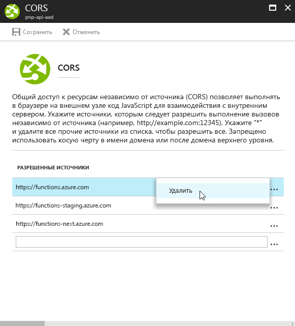
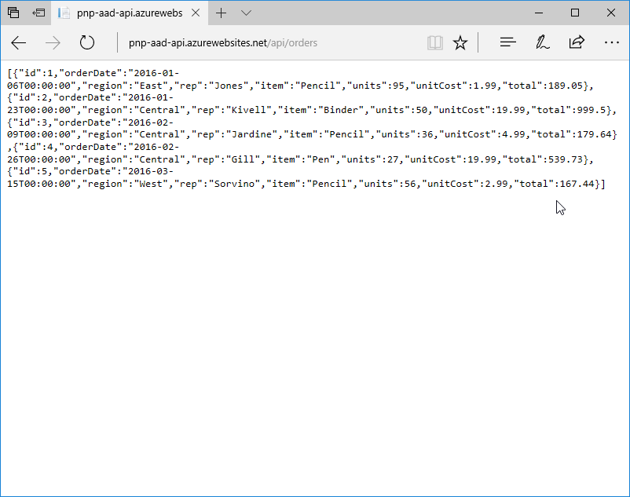
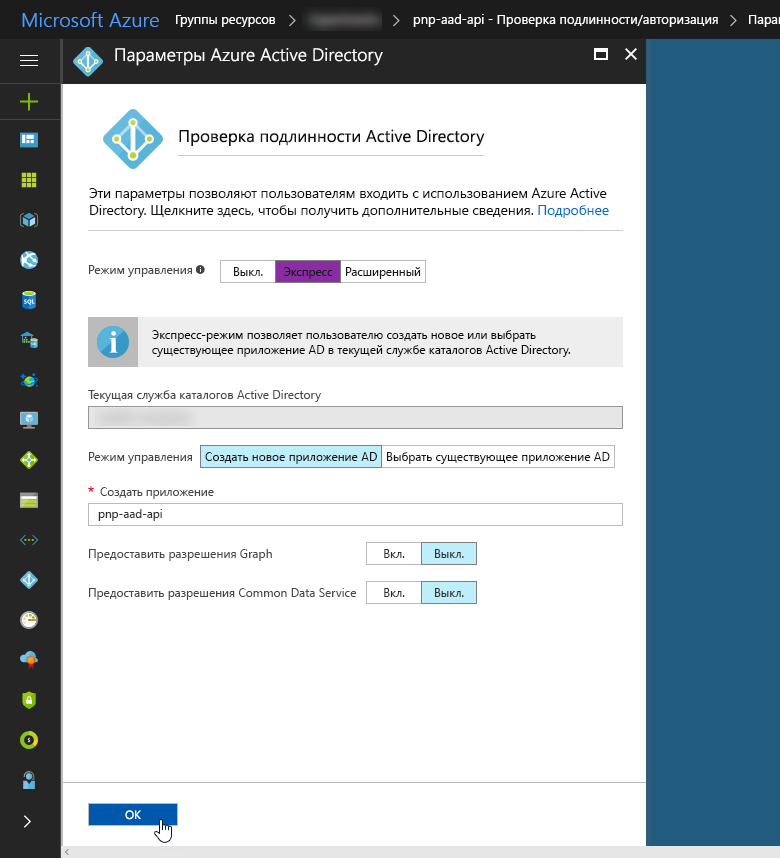
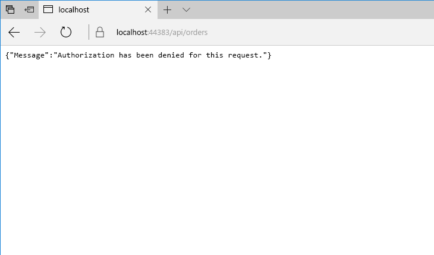
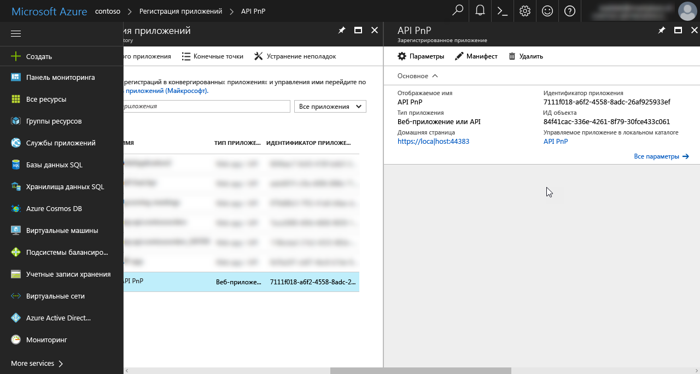

# <a name="connect-to-api-secured-with-azure-active-directory"></a>Подключение к API, защищенному с помощью Azure Active Directory

При создании решений SharePoint Framework может потребоваться подключение к пользовательскому API для извлечения данных или связи с бизнес-приложениями. Защита пользовательских API с помощью Azure Active Directory имеет ряд преимуществ и способов реализации. После создания API получить к нему доступ можно разными по сложности способами, и каждый из них имеет свои особенности. В этой статье описаны различные подходы и приведены инструкции по созданию API, защищенного с помощью Azure Active Directory, а также подключению к нему.

## <a name="secure-an-api-with-azure-active-directory"></a>Защита API с помощью Azure Active Directory

Если у вас есть Office 365, советуем защитить пользовательские API с помощью Azure Active Directory. При этом применяются существующие учетные данные организации, управление которыми уже выполняется через Office 365 и Azure Active Directory. Пользователь с активной учетной записью может без проблем работать с приложениями, которые используют защищенные API AAD. Администраторы Azure Active Directory могут централизованно управлять доступом к API так же, как они управляют доступом ко всем другим приложениям, зарегистрированным в AAD.

Защита API с помощью Azure AD избавляет разработчика от необходимости управлять собственным набором учетных данных пользователя и внедрять особый уровень безопасности для API. Кроме того, Azure Active Directory поддерживает протокол OAuth, который позволяет подключаться к API из мобильных приложений и клиентских решений.

Защитить пользовательский API с помощью Azure Active Directory можно двумя основными способами. Если вы размещаете API в службе приложений Microsoft Azure, можете применить проверку подлинности службы приложений. Если вы размещаете API в собственной инфраструктуре или в контейнерах Docker, вам нужно будет защитить его в коде. В этом случае реализация зависит от языка и платформы программирования. В данной статье при описании этого варианта используется C# и веб-API ASP.NET в качестве платформы.

### <a name="secure-the-api-using-azure-app-service-authentication"></a>Защита API с помощью проверки подлинности для службы приложений Azure

При развертывании пользовательских API в службе приложений Azure для их защиты с помощью Azure Active Directory можно воспользоваться проверкой подлинности службы приложений. Самым большим преимуществом этого варианта является его простота: следуйте инструкциям на портале Azure, чтобы настроить проверку подлинности с помощью мастера. Если вы выберете базовую настройку, мастер создаст приложение AAD в Azure Active Directory, связанное с текущей подпиской. В расширенном режиме настройки вы можете выбрать, какое приложение AAD следует использовать для защиты доступа к службе приложений, в которой размещается API.


Когда будет настроена проверка подлинности службы приложений, пользователям, пытающимся получить доступ к вашему API, будет предложено войти с помощью учетной записи организации, указанной в той же службе Azure Active Directory, что и приложение AAD для защиты API. После входа вы сможете получить доступ к информации о текущем пользователе через свойство `HttpContext.Current.User`. При использовании проверки подлинности для службы приложений Azure не требуется дополнительная настройка приложения.

Проверка подлинности для службы приложений Azure — это функция, доступная только в службах приложений Microsoft Azure. Она значительно упрощает реализацию аутентификации в API, но доступна только при его размещении в службе приложений Azure. Если вы хотите разместить API в другой облачной службе или контейнере Docker, сначала необходимо реализовать уровень аутентификации.

### <a name="secure-the-api-using-aspnet-authentication"></a>Защита API с помощью аутентификации в ASP.NET

Если вы не хотите ограничивать варианты размещения и развертывания API, советуем реализовать поддержку аутентификации AAD в ASP.NET. Visual Studio значительно упрощает этот процесс, и после настройки аутентификации с помощью соответствующего мастера ваш API будет требовать от пользователей входа в учетную запись организации.


Во время настройки Visual Studio добавит все необходимые ссылки и настройки в проект веб-API ASP.NET, в том числе зарегистрирует новое приложение AAD для защиты вашего API.

## <a name="access-an-api-secured-with-azure-active-directory-from-sharepoint-framework-solutions"></a>Доступ к API, защищенному с помощью Azure Active Directory, из решений SharePoint Framework

Решения SharePoint Framework полностью состоят из клиентского кода, поэтому они не могут безопасно хранить секреты, необходимые для подключения к защищенным API. Azure Active Directory поддерживает ряд механизмов для обеспечения безопасной связи с клиентскими решениями, такие как файлы cookie для аутентификации и неявный поток OAuth.

### <a name="access-the-api-using-adal-js"></a>Доступ к API с помощью ADAL JS

Обычно для обеспечения связи между клиентскими решениями и API, защищенными с помощью Azure Active Directory, используется библиотека [ADAL JS](https://github.com/AzureAD/azure-activedirectory-library-for-js). Она упрощает реализацию аутентификации с вовлечением AAD в клиентских приложениях, а также получение маркеров доступа к определенным ресурсам. Для приложений, созданных с помощью AngularJS, в ADAL JS есть перехватчик HTTP-запросов, который автоматически добавляет необходимые маркеры доступа в заголовки исходящих веб-запросов. Использование этого перехватчика избавляет разработчиков от необходимости изменять веб-запросы к API, защищенным с помощью AAD, и позволяет сосредоточиться на создании приложения.

#### <a name="benefits-of-using-adal-js-to-communicate-with-apis-secured-with-aad"></a>Преимущества использования ADAL JS для связи с API, защищенными при помощи AAD

При использовании ADAL JS клиентские приложения имеют полный доступ к данным идентификации текущего пользователя. Это удобно для отображения имени пользователя или фотографии профиля в приложении. При создании решений с размещением в SharePoint разработчики могут получать расширенные сведения из профиля, используя API SharePoint, но для автономных приложений это невозможно.

ADAL JS не только упрощает аутентификацию в AAD, но и позволяет получать маркеры доступа к определенным ресурсам. Благодаря этим токенам приложения могут безопасно обращаться к API, защищенным с помощью AAD, таким как [Microsoft Graph](./call-microsoft-graph-from-your-web-part.md) и другие пользовательские API. Чтобы клиентское приложение могло использовать ADAL JS, его необходимо зарегистрировать в Azure Active Directory. В процессе регистрации разработчики указывают ряд настроек, таких как URL-адрес приложения и ресурсы, к которым ему требуется доступ (от своего имени или от имени текущего пользователя).


Когда пользователь впервые запускает приложение, оно запрашивает у него необходимые разрешения. После их получения оно может запрашивать маркеры доступа к определенным ресурсам и безопасно обмениваться с ними данными.

#### <a name="considerations-when-using-adal-js-to-communicate-with-apis-secured-with-aad"></a>Особенности использования ADAL JS для связи с API, защищенными с помощью AAD

Библиотека ADAL JS была разработана для использования с одностраничными приложениями. Чтобы она правильно работала при использовании с решениями SharePoint Framework, необходимо [применить исправление](./call-microsoft-graph-from-your-web-part.md).

При использовании ADAL JS и OAuth для доступа к API, защищенным с помощью AAD, аутентификацию обеспечивает Microsoft Azure. Возможные ошибки обрабатываются страницей входа в Azure. После входа пользователя в учетную запись организации приложение попытается получить действительный маркер доступа. Возможные ошибки, которые возникают на этом этапе, должны обрабатываться кодом приложения, так как при получении маркеров доступа не отображается пользовательский интерфейс.

Чтобы клиентское приложение могло использовать ADAL JS, оно должно быть зарегистрировано как приложение Azure AD. При регистрации указывается URL-адрес приложения. Так как приложение полностью состоит из клиентского кода и не может безопасно хранить секрет, URL-адрес необходим AAD для обеспечения безопасности. Это требование сложно выполнить в случае решений SharePoint Framework, так как разработчики просто не знают все URL-адреса, где будет использоваться конкретная веб-часть. Кроме того, в данный момент AAD поддерживает указание не более 10 URL-адресов отклика, чего может быть не достаточно.

Сначала клиентское приложение должно провести аутентификацию пользователя, чтобы получить маркер идентификации, который затем можно обменять на маркер доступа. Несмотря на то что решения SharePoint Framework размещаются в службе SharePoint, которая требует от пользователей входа в учетные записи организации, данные аутентификации текущего пользователя недоступны для решений SharePoint Framework. Каждое решение должно или перенаправлять пользователя на страницу входа в Azure, или показывать всплывающее окно со страницей входа. Второй вариант более удобен в случае веб-части, которая является одним из многих элементов на странице. Если на странице несколько клиентских веб-частей SharePoint Framework, каждая из них управляет своим состоянием отдельно и требует от пользователя входа.

Скрытые элементы iframe, которые обрабатывают перенаправления к конечным точкам Azure AD, упрощают получение маркеров доступа, необходимых для связи с защищенными при помощи AAD интерфейсами API. В Microsoft Internet Explorer невозможно получить маркеры доступа в неявном потоке OAuth, если конечные точки входа в Azure AD и URL-адрес SharePoint Online не находятся в одной зоне безопасности. Если ваша организация использует Internet Explorer, убедитесь, что конечная точка Azure AD и URL-адреса SharePoint Online настроены в одной зоне безопасности. Некоторые организации отправляют эти настройки конечным пользователям, используя групповые политики.

Доступ к интерфейсам API, защищенным с помощью AAD, не может быть анонимным. Вызывающее их приложение должно предоставить действительные учетные данные. При использовании неявного потока OAuth с клиентскими приложениями это маркер доступа носителя, полученный с помощью ADAL JS. Если вы создали решение SharePoint Framework с помощью AngularJS, библиотека ADAL JS будет автоматически получать действительный маркер доступа к ресурсу и добавлять его во все исходящие запросы, выполняемые с помощью службы `$http` AngularJS. При использовании других библиотек JavaScript вам нужно будет получать действительный маркер доступа, при необходимости обновлять его и добавлять в исходящие веб-запросы самостоятельно.

### <a name="access-the-api-by-leveraging-sharepoint-online-authentication-cookie"></a>Доступ к API с помощью файла cookie аутентификации для SharePoint Online

Вместо ADAL JS для подключения к пользовательским API, защищенным с помощью AAD, можно использовать файл cookie аутентификации.

#### <a name="how-it-works"></a>Как это работает

Когда вы входите с помощью своей учетной записи организации в SharePoint Online, в браузере устанавливается файл cookie аутентификации. Этот файл cookie отправляется с каждым запросом в SharePoint, позволяя работать с сайтами и документами. Чтобы использовать этот файл cookie для подключения к пользовательскому API, защищенному с помощью AAD, на странице размещается скрытый элемент iframe, указывающий на URL-адрес API, который также защищен с помощью AAD. При попытке загрузить этот URL-адрес браузер будет перенаправлен на страницу входа в Azure AD, так как анонимный доступ запрещен. Так как вы уже вошли в SharePoint с помощью своей учетной записи организации, аутентификация будет выполнена автоматически, а вы будете перенаправлены на исходный URL-адрес. На данном этапе у вашего браузера есть файл cookie для аутентификации с вовлечением AAD, чтобы можно было получить доступ к пользовательскому API, защищенному с помощью AAD.

После размещения элемента iframe на странице к нему добавляется прослушиватель событий `onload`, который запускается после выполнения аутентификации. В этом прослушивателе устанавливается указание на то, что аутентификация выполнена и можно безопасно вызывать пользовательский API. Все веб-запросы к пользовательским API следует отложить до установки этого флага, иначе возникнет ошибка.

```ts
// ...

export default class LatestOrdersWebPart extends BaseClientSideWebPart<ILatestOrdersWebPartProps> {
  private remotePartyLoaded: boolean = false;
  private orders: IOrder[];

  public render(): void {
    this.domElement.innerHTML = `
    <div class="${styles.latestOrders}">
      <iframe src="https://contoso.azurewebsites.net/"
          style="display:none;"></iframe>
      <div class="ms-font-xxl">Recent orders</div>
      <div class="loading"></div>
      <table class="data" style="display:none;">
        <thead>
          <tr>
            <th>ID</th>
            <th>Date</th>
            <th>Region</th>
            <th>Rep</th>
            <th>Item</th>
            <th>Units</th>
            <th>Unit cost</th>
            <th>Total</th>
          </tr>
        </thead>
        <tbody>
        </tbody>
      </table>
    </div>`;

    this.context.statusRenderer.displayLoadingIndicator(
      this.domElement.querySelector(".loading"), "orders");

    this.domElement.querySelector("iframe").addEventListener("load", (): void => {
      this.remotePartyLoaded = true;
    });

    this.executeOrDelayUntilRemotePartyLoaded((): void => {
      // retrieve and render data
    });
  }

  private executeOrDelayUntilRemotePartyLoaded(func: Function): void {
    if (this.remotePartyLoaded) {
      func();
    } else {
      setTimeout((): void => { this.executeOrDelayUntilRemotePartyLoaded(func); }, 100);
    }
  }

  // ...
}
```

При выполнении междоменных запросов AJAX в веб-частях необходимо указать, что с ними следует отправлять файл cookie аутентификации. Для этого задайте свойству **credentials** веб-запроса значение **include**. Без этого запрос будет заблокирован в браузере, и вы не сможете вызвать API.

```ts
// ...

export default class LatestOrdersWebPart extends BaseClientSideWebPart<ILatestOrdersWebPartProps> {
    // ...

    private retrieveAndRenderData(): void {
        this.context.httpClient.get("https://contoso.azurewebsites.net/api/orders",
        HttpClient.configurations.v1, {
          credentials: "include"
        })
        .then((response: HttpClientResponse): Promise<IOrder[]> => {
          // ...
        });
    }

    // ...
}
```

Чтобы можно было использовать этот метод, также необходимо определенным образом настроить пользовательский API. Прежде всего, он должен поддерживать получение учетных данных при междоменных вызовах. Для этого задайте заголовку отклика **Access-Control-Allow-Credentials** значение **true**. Затем укажите, какой источник может вызывать API. Это настраивается в заголовке отклика **Access-Control-Allow-Origin**.

> **Важно!** При использовании заголовка **Access-Control-Allow-Credentials** можно указать только один источник.

Конкретный способ настройки этих заголовков зависит от реализации API. Если вы используете функцию Azure для создания API с помощью Node.js, эти заголовки необходимо настроить в объекте отклика:

```js
context.res = {
    body: "response",
    headers: {
        "Access-Control-Allow-Credentials" : "true",
        "Access-Control-Allow-Origin" : "https://contoso.sharepoint.com"
    }
};
```

При использовании веб-API ASP.NET необходимо установить пакет NuGet **Microsoft.AspNet.WebApi.Cors**, вызвать метод `config.EnableCors()` и использовать атрибут **EnableCors** для установки значений заголовков:

```cs
[EnableCors("origins": "*", "headers": "*", "methods": "*", SupportsCredentials = true)]
public string Get() {
    return "response";
}
```

#### <a name="benefits-of-using-the-sharepoint-online-authentication-cookie-for-seamless-authentication"></a>Преимущества использования файла cookie аутентификации для SharePoint Online

Наиболее существенное преимущество использования файла cookie аутентификации в SharePoint Online для подключения к пользовательским API, защищенным с помощью AAD, заключается в том, что при таком подходе не нужно регистрировать приложение AAD для каждой веб-части. Это избавляет от необходимости управлять URL-адресами отклика в случае страниц, на которых используется каждая веб-часть без ограничений на количество URL-адресов отклика для приложения AAD.

Поток аутентификации обрабатывается незаметно и завершается без участия пользователя. Для сравнения: при использовании ADAL JS каждая веб-часть основывается на отдельном приложении AAD и требует от пользователя входа.

#### <a name="considerations-when-using-the-sharepoint-online-authentication-cookie-for-seamless-authentication"></a>Особенности использования файла cookie аутентификации для SharePoint Online

Подключаться к API, защищенным с помощью AAD, позволяет как ADAL JS, так и файл cookie аутентификации для SharePoint Online. Однако между двумя подходами есть несколько важных различий, на которые следует обратить внимание.

При использовании ADAL JS перед получением маркера доступа клиентское приложение получает маркер идентификации для текущего пользователя. Этот токен содержит сведения о текущем пользователе, полученные из AAD, такие как имя пользователя или пароль. При использовании файла cookie для аутентификации не существует маркера идентификации, но вы можете получать те же сведения о текущем пользователе из SharePoint.

ADAL JS позволяет подключаться к любому API, защищенному с помощью Azure AD. Если используется файл cookie для аутентификации, API должен поддерживать получение учетных данных при междоменных вызовах. Разрабатывая интерфейсы API, следует учитывать это требование, чтобы эти интерфейсы можно было использовать в решениях SharePoint Framework.

Доступ к API, защищенным с помощью Azure Active Directory, возможен при использовании как ADAL JS, так и файла cookie аутентификации для SharePoint Online. Однако не все API позволяют использовать оба метода. Например, чтобы получить доступ к Microsoft Graph, у вас должен быть действительный маркер доступа OAuth с определенными разрешениями Microsoft Graph. Получить этот токен можно только с помощью ADAL JS.

При использовании файла cookie аутентификации в SharePoint Online для доступа к API, защищенным с помощью AAD, вместе с запросом не отправляются дополнительные данные для авторизации. Это означает, что по умолчанию каждый пользователь с действительной учетной записью организации в службе Azure Active Directory, связанной с API, может получить доступ к API. При создании API необходимо позаботиться об авторизации, чтобы все операции с API выполняли пользователи, у которых достаточно прав.

Пользовательские API размещаются за пределами SharePoint Online, и к ним можно обращаться с помощью междоменных веб-запросов. По умолчанию веб-браузеры не включают учетные данные при выполнении междоменных запросов AJAX. Чтобы подключаться к этим защищенным API, необходимо разрешить отправку учетных данных для каждого исходящего веб-запроса.

### <a name="general-considerations"></a>Общие вопросы

В обоих методах (использовании ADAL JS и файла cookie аутентификации в SharePoint Online) для связи с Azure Active Directory используются элементы iframe. Причина — в перенаправлениях, которые являются частью потока OAuth и не могут автоматически сопровождаться запросами AJAX. Microsoft Internet Explorer применяет политики безопасности к веб-сайтам в зависимости от их зоны. Чтобы сценарии могли получать доступ к данным из iframe, ресурс iframe и страница, на которой размещается iframe, должны находиться в одной зоне безопасности. Организация может использовать групповые политики для отправки пользователям нужных настроек.

## <a name="build-an-api-secured-with-azure-active-directory"></a>Создание API, защищенного с помощью Azure Active Directory

Защитить доступ к API с помощью Azure Active Directory не сложно. Требуется всего несколько действий, и они зависят от реализации API. Если вы решили использовать функции Azure, безопасность можно настроить на портале Azure. Если вы создали API, используя веб-API ASP.NET, и не хотите размещать его в службе приложений Azure, вам потребуется расширить код веб-API, чтобы добавить в него аутентификацию. Ниже описано, как создать и настроить API, защищенный с помощью AAD, используя решение "Функции Azure" и веб-API ASP.NET.

### <a name="build-the-api-using-an-azure-function"></a>Создание API с помощью решения "Функции Azure"

У создания API с помощью решения "Функции Azure" есть ряд преимуществ. Прежде всего, оно значительно упрощает разработку и развертывание API. Это решение дает большой простор для настройки. Единственное, о чем вам нужно позаботиться, — это код API. Для всего остального (от аутентификации до поддержки CORS и документирования API) можно использовать портал Azure.

Решение "Функции Azure" размещается в службе приложений Azure и использует многие возможности, доступные в основной службе. Вы можете защитить свой API не только с помощью функции или ключа администратора, но и с помощью Azure Active Directory или одного из других доступных поставщиков аутентификации, включив безопасность службы приложений Azure. Аутентификацию службы приложений можно настроить на портале Azure, при этом не требуется изменять код API.

Ниже описано, как создать защищенный с помощью Azure Active Directory API, который может безопасно вызываться из междоменного источника, используя "Функции Azure".

#### <a name="create-new-azure-function"></a>Создание новой функции Azure

На портале Azure перейдите в группу ресурсов и добавьте приложение-функцию.


После подготовки откройте новое приложение-функцию и добавьте новую функцию, щелкнув значок "плюс" рядом с меткой "Функции".


На экране быстрого начала работы прокрутите содержимое вниз, чтобы перейти к разделу **Создайте свою собственную**, и выберите вариант **Пользовательская функция**.


Из списка шаблонов выберите **HttpTrigger-JavaScript**. В качестве имени функции укажите **Заказы** и установите уровень авторизации **Анонимный**, так как вы будете использовать Azure AD для защиты доступа к функции Azure. Подтвердите свой выбор, нажав кнопку **Создать**.


#### <a name="implement-api-code"></a>Внедрение кода API

Замените код функции следующим фрагментом:

```js
module.exports = function (context, req) {
    context.res = {
        body: [
            {
              id: 1,
              orderDate: new Date(2016, 0, 6),
              region: "east",
              rep: "Jones",
              item: "Pencil",
              units: 95,
              unitCost: 1.99,
              total: 189.05
            },
            {
              id: 2,
              orderDate: new Date(2016, 0, 23),
              region: "central",
              rep: "Kivell",
              item: "Binder",
              units: 50,
              unitCost: 19.99,
              total: 999.50
            },
            {
              id: 3,
              orderDate: new Date(2016, 1, 9),
              region: "central",
              rep: "Jardine",
              item: "Pencil",
              units: 36,
              unitCost: 4.99,
              total: 179.64
            },
            {
              id: 4,
              orderDate: new Date(2016, 1, 26),
              region: "central",
              rep: "Gill",
              item: "Pen",
              units: 27,
              unitCost: 19.99,
              total: 539.73
            },
            {
              id: 5,
              orderDate: new Date(2016, 2, 15),
              region: "west",
              rep: "Sorvino",
              item: "Pencil",
              units: 56,
              unitCost: 2.99,
              total: 167.44
            }],
        headers: {
            "Access-Control-Allow-Credentials" : "true",
            "Access-Control-Allow-Origin" : "https://contoso.sharepoint.com"
        }
    };
    context.done();
};
```

Измените URL-адрес, указанный в заголовке **Access-Control-Allow-Origin**, в соответствии с URL-адресом клиента SharePoint Online, который будет вызывать этот API.

Сохраните изменения в коде функции, нажав кнопку **Сохранить**.


#### <a name="change-cors-settings"></a>Изменение настроек CORS

Решение "Функции Azure" размещается в службе приложений Azure, что позволяет настраивать параметры CORS на портале Azure. Это удобно, но при настройке на портале ее нельзя использовать вместе с заголовком **Access-Control-Allow-Credentials**, который требуется API для принятия файла cookie аутентификации из другого источника. Чтобы клиентская аутентификация работала правильно, настройки CORS службы приложений Azure необходимо очистить.

В приложении-функции выберите функцию Azure и перейдите к колонке **Функции платформы**.


В разделе **API** выберите параметр **CORS**.


Удалите все записи в колонке настроек CORS, чтобы очистить конфигурацию CORS.



Подтвердите удаление, нажав кнопку **Сохранить**.


#### <a name="enable-app-service-authentication"></a>Включение проверки подлинности службы приложений

В параметрах приложения-функции вернитесь к колонке параметров платформы. В разделе **Сеть** выберите параметр **Аутентификация / авторизация**.


Включите аутентификацию службы приложений, установив переключатель **Проверка подлинности службы приложений** в положение **Вкл**.


Чтобы запретить анонимный доступ к API и принудительно выполнять аутентификацию с помощью Azure AD, выберите в раскрывающемся списке **Предпринимаемое действие, если проверка подлинности для запроса не выполнена** значение **Войти с использованием Azure Active Directory**.


После этого выберите Azure Active Directory в списке поставщиков проверки подлинности для настройки.


В колонке "Аутентификация Active Directory" установите **режим управления** **Экспресс** и создайте приложение AAD.

> **Важно!** При использовании экспресс-режима настройки портал Azure создаст новое приложение AAD из того же каталога, в котором находится приложение-функция. Если приложение-функция размещается в другой подписке Azure с другим каталогом, следует выбрать расширенный режим и указать идентификатор каталога и приложение, которое необходимо использовать для защиты доступа к API.
>
> Если используется существующее приложение AAD, следует сделать так, чтобы оно принимало учетные данные только от одного клиента. Если настроите приложение как мультитенантное, любой пользователь с действительной рабочей или личной учетной записью сможет подключиться к вашему API.
>
> Приложение AAD может защитить доступ к API только на этапе аутентификации. При создании API также следует авторизовать запросы в коде API, чтобы только пользователи, у которых достаточно прав, могли обращаться к API.

Так как приложение предназначено только для защиты доступа к функции Azure, оно не требует дополнительных разрешений. Подтвердите выбор, нажав кнопку **ОК**.


Когда колонка Azure Active Directory закроется, нажмите кнопку **Сохранить** в колонке **Аутентификация / авторизация**, чтобы подтвердить все изменения настроек аутентификации.


При попытке перейти по URL-адресу API в новом окне в режиме конфиденциальности вам будет предложено войти, используя учетную запись Azure AD.


На данном этапе API можно безопасно вызывать из клиентской веб-части SharePoint Framework, используя файл cookie аутентификации.

### <a name="build-the-api-using-aspnet-web-api"></a>Создание API с помощью веб-API ASP.NET

Для реализации API также можно использовать веб-API ASP.NET. По сравнению с созданием API с помощью решения "Функции Azure", этот способ требует значительно больше работы. Вам нужно не только создать для него полный проект, но и подумать о развертывании API. С другой стороны, использование веб-API ASP.NET позволяет развертывать API на различных платформах: в службе приложений Azure, контейнерах Docker, других облачных службах и даже собственной инфраструктуре.

Ниже описано, как создать API с помощью веб-API ASP.NET, развернуть его в службе приложений Azure и защитить с помощью проверки подлинности для службы приложений Azure. Еще ниже описано, как расширить API, чтобы он сам выполнял аутентификацию, что необходимо для его развертывания на других платформах.

#### <a name="create-new-aspnet-webapi-project"></a>Создание нового проекта веб-API ASP.NET

Откройте Visual Studio и в меню **Файл** выберите пункт **Создать проект**. В диалоговом окне **Новый проект** выберите шаблоны C# "Веб" и в списке доступных шаблонов выберите шаблон **Веб-приложение ASP.NET**.


Выберите **Веб-API** как тип проекта веб-приложения ASP.NET.


Так как для защиты доступа к API вы будете использовать проверку подлинности для службы приложений Azure, нажмите кнопку **Изменить способ проверки подлинности** и выберите параметр **Нет проверки подлинности**.


Подтвердите свой выбор, нажав кнопку **ОК**.

Visual Studio позволяет легко развернуть свой веб-API в службе приложений Azure. Чтобы воспользоваться этой возможностью, в разделе **Microsoft Azure** в диалоговом окне **Новое веб-приложение ASP.NET** выберите раздел **Размещение в облаке** и в раскрывающемся списке выберите пункт **Служба приложений**.


В диалоговом окне **Создать службу приложений** укажите имя создаваемого веб-приложения и выберите свою подписку Azure, группу ресурсов и план обслуживания приложений, которые необходимо использовать для этого приложения.


Подтвердите свой выбор, нажав кнопку **Создать**. Visual Studio создаст веб-приложение Azure для размещения вашего веб-приложения.

#### <a name="add-support-for-cors"></a>Добавление поддержки CORS

По умолчанию API, создаваемые с помощью шаблона проекта "Веб-приложение ASP.NET", не поддерживают CORS, и их не могут вызывать клиентские приложения, размещенные в разных доменах. Чтобы добавить поддержку CORS в веб-API, щелкните проект правой кнопкой мыши и в контекстном меню выберите пункт **Управление пакетами NuGet**.


На вкладке **Управление пакетами NuGet** найдите пакет **Microsoft.AspNet.WebApi.Cors** и установите его в проекте.


#### <a name="add-data-model"></a>Добавление модели данных

В проекте определите модель данных, возвращаемых API. В папке **Модели** добавьте новый класс и присвойте ему имя **Заказ**. Вставьте следующий код в новый файл:

```cs
using Newtonsoft.Json;
using Newtonsoft.Json.Converters;
using System;

namespace PnP.Aad.Api.Models {
    public class Order {
        [JsonProperty(PropertyName = "id")]
        public int Id { get; set; }
        [JsonProperty(PropertyName = "orderDate")]
        public DateTime OrderDate { get; set; }
        [JsonConverter(typeof(StringEnumConverter))]
        [JsonProperty(PropertyName = "region")]
        public Region Region { get; set; }
        [JsonProperty(PropertyName = "rep")]
        public string Rep { get; set; }
        [JsonProperty(PropertyName = "item")]
        public string Item { get; set; }
        [JsonProperty(PropertyName = "units")]
        public uint Units { get; set; }
        [JsonProperty(PropertyName = "unitCost")]
        public double UnitCost { get; set; }
        [JsonProperty(PropertyName = "total")]
        public double Total { get; set; }
    }

    public enum Region {
        East,
        Central,
        West
    }
}
```

#### <a name="add-orders-api"></a>Добавление API заказов

После этого добавьте API, который будет возвращать информацию о последних заказах. В папке **Controllers** создайте новый класс и присвойте ему имя **OrdersController**. Вставьте следующий код в новый файл:

```cs
using PnP.Aad.Api.Models;
using System;
using System.Collections.Generic;
using System.Web.Http;

namespace PnP.Aad.Api.Controllers {
    public class OrdersController : ApiController {
        private List<Order> orders = new List<Order> {
            new Order {
                Id = 1,
                OrderDate = new DateTime(2016, 1, 6),
                Region = Region.East,
                Rep = "Jones",
                Item = "Pencil",
                Units = 95,
                UnitCost = 1.99,
                Total = 189.05
            },
            new Order {
                Id = 2,
                OrderDate = new DateTime(2016, 1, 23),
                Region = Region.Central,
                Rep = "Kivell",
                Item = "Binder",
                Units = 50,
                UnitCost = 19.99,
                Total = 999.50
            },
            new Order {
                Id = 3,
                OrderDate = new DateTime(2016, 2, 9),
                Region = Region.Central,
                Rep = "Jardine",
                Item = "Pencil",
                Units = 36,
                UnitCost = 4.99,
                Total = 179.64
            },
            new Order {
                Id = 4,
                OrderDate = new DateTime(2016, 2, 26),
                Region = Region.Central,
                Rep = "Gill",
                Item = "Pen",
                Units = 27,
                UnitCost = 19.99,
                Total = 539.73
            },
            new Order {
                Id = 5,
                OrderDate = new DateTime(2016, 3, 15),
                Region = Region.West,
                Rep = "Sorvino",
                Item = "Pencil",
                Units = 56,
                UnitCost = 2.99,
                Total = 167.44
            }
        };

        public IEnumerable<Order> Get() {
            return orders;
        }
    }
}
```

#### <a name="extend-the-api-with-support-for-cors"></a>Добавление поддержки CORS в API

Несмотря на то что вы установили поддержку технологии CORS в своем проекте, она пока не активирована. Если вы вызовете новый API заказов из клиентского приложения, размещенного в другом домене, то возникнет ошибка CORS и запрос не будет выполнен. Чтобы API поддерживал CORS, в него необходимо добавить атрибут **EnableCors**.

```cs
using PnP.Aad.Api.Models;
using System;
using System.Collections.Generic;
using System.Web.Http;
using System.Web.Http.Cors;

namespace PnP.Aad.Api.Controllers {
    public class OrdersController : ApiController {
        private List<Order> orders = new List<Order> {
            // ...
        };

        [EnableCors("*", "*", "GET", SupportsCredentials = true)]
        public IEnumerable<Order> Get() {
            return orders;
        }
    }
}
```

После этого откройте файл **.\App_Start\WebApiConfig.cs** и вставьте следующий код:

```cs
using System.Web.Http;

namespace PnP.Aad.Api {
    public static class WebApiConfig {
        public static void Register(HttpConfiguration config) {
            // Web API configuration and services

            // Web API routes
            config.MapHttpAttributeRoutes();

            config.EnableCors();

            config.Routes.MapHttpRoute(
                name: "DefaultApi",
                routeTemplate: "api/{controller}/{id}",
                defaults: new { id = RouteParameter.Optional }
            );
        }
    }
}
```

На данном этапе код API готов, и его можно публиковать в веб-приложении Azure.

#### <a name="publish-the-api-to-azure-web-app"></a>Публикация API в веб-приложении Azure

В Visual Studio щелкните проект правой кнопкой мыши и в контекстном меню выберите пункт **Опубликовать**.


В диалоговом окне "Публикация" проверьте все сведения и нажмите кнопку **Опубликовать**, чтобы начать процесс публикации.


После публикации перейдите по URL-адресу API в веб-браузере, например _http://pnp-aad-api.azurewebsites.net/api/orders_. На данный момент API не защищен и доступен анонимным пользователям.



#### <a name="secure-the-api-using-azure-app-service"></a>Защита API с помощью службы приложений Azure

Чтобы защитить API с помощью Azure AD, перейдите на портал Azure и откройте веб-приложение, в котором размещен ваш API. В группе **Параметры** выберите пункт **Аутентификация / авторизация**.


Чтобы включить проверку подлинности для веб-приложения, установите переключатель **Проверка подлинности службы приложений** в положение **Вкл**.


Чтобы запретить анонимный доступ к API, в раскрывающемся списке **Предпринимаемое действие, если проверка подлинности для запроса не выполнена** выберите пункт **Войти с использованием Azure Active Directory**.


Настройте проверку подлинности на основе Azure Active Directory, выбрав **Azure Active Directory** из списка поставщиков аутентификации.


В колонке "Аутентификация Active Directory" установите **режим управления** **Экспресс** и создайте приложение AAD.

> **Важно!** При использовании экспресс-режима настройки портал Azure создаст новое приложение AAD из того же каталога, в котором находится приложение-функция. Если приложение-функция размещается в другой подписке Azure с другим каталогом, следует выбрать расширенный режим и указать идентификатор каталога и приложение, которое необходимо использовать для защиты доступа к API.
>
> Если используется существующее приложение AAD, следует сделать так, чтобы оно принимало учетные данные только от одного клиента. Если настроите приложение как мультитенантное, любой пользователь с действительной рабочей или личной учетной записью сможет подключиться к вашему API.
>
> Приложение AAD может защитить доступ к API только на этапе аутентификации. При создании API также следует авторизовать запросы в коде API, чтобы только пользователи, у которых достаточно прав, могли обращаться к API.

Так как приложение предназначено только для защиты доступа к функции Azure, оно не требует дополнительных разрешений. Подтвердите выбор, нажав кнопку **ОК**.



Когда колонка Azure Active Directory закроется, нажмите кнопку **Сохранить** в колонке **Аутентификация / авторизация**, чтобы подтвердить все изменения настроек аутентификации.


При попытке перейти по URL-адресу API в новом окне в режиме конфиденциальности вам будет предложено войти, используя учетную запись Azure AD.


На данном этапе API можно безопасно вызывать из клиентской веб-части SharePoint Framework, используя файл cookie аутентификации.

#### <a name="secure-the-api-using-openid"></a>Защита API с помощью OpenID

Если вы хотите развернуть проект веб-API ASP.NET отдельно от службы приложений Azure и защитить его с помощью AAD, нельзя использовать проверку подлинности службы приложений. Необходимо расширить веб-приложение так, чтобы оно само требовало от пользователей пройти аутентификацию для работы с API.

##### <a name="disable-anonymous-access-to-all-resources"></a>Запрет анонимного доступа ко всем ресурсам

Если вы хотите защитить все ресурсы, откройте файл **.\App_Start\FilterConfig.cs** и вставьте следующий код:

```cs
using System.Web.Mvc;

namespace PnP.Aad.Api {
    public class FilterConfig {
        public static void RegisterGlobalFilters(GlobalFilterCollection filters) {
            filters.Add(new HandleErrorAttribute());
            filters.Add(new AuthorizeAttribute());
        }
    }
}
```

Чтобы обеспечить обязательную аутентификацию для всех API, откройте файл **.\App_Start\WebApiConfig.cs** и вставьте следующий код:

```cs
using System.Web.Http;

namespace PnP.Aad.Api {
    public static class WebApiConfig {
        public static void Register(HttpConfiguration config) {
            // Web API configuration and services

            // Web API routes
            config.MapHttpAttributeRoutes();

            config.EnableCors();
            config.Filters.Add(new AuthorizeAttribute());

            config.Routes.MapHttpRoute(
                name: "DefaultApi",
                routeTemplate: "api/{controller}/{id}",
                defaults: new { id = RouteParameter.Optional }
            );
        }
    }
}
```

При попытке получить доступ к API или другому ресурсу в своем веб-приложении вы получите отклик 401 (ошибка авторизации).



На данном этапе веб-приложение запрашивает аутентификацию для всех запросов к ресурсам, но не запускает процедуру входа в AAD. На следующих этапах вы расширите веб-приложение так, чтобы оно перенаправляло пользователя на страницу входа Azure AD, если аутентификация не была пройдена ранее.

##### <a name="register-azure-ad-application"></a>Регистрация приложения Azure AD

Чтобы защитить API с помощью Azure Active Directory, необходимо зарегистрировать приложение Azure AD. Это приложение затем указывается в проекте веб-приложения и используется ПО промежуточного слоя OWIN для защиты доступа к API с помощью Azure AD.

Если у вас еще нет приложения AAD, вы можете создать его на портале Azure, перейдя к колонке Azure Active Directory.

> **Важно!** Приложение Azure AD, используемое для защиты API, необходимо создать в той же службе Azure Active Directory, которая используется организацией для доступа к Office 365.


В колонке Azure Active Directory выберите раздел **Регистрация приложений**.


В колонке **Регистрация приложений** нажмите кнопку **Регистрация нового приложения**, чтобы зарегистрировать новое приложение Azure AD.


В колонке **Создание** введите сведения о приложении и нажмите кнопку **Создать**.


После успешной регистрации приложения выберите его в списке, чтобы просмотреть сведения.



Скопируйте **идентификатор приложения** и сохраните его, так как он понадобится вам при настройке аутентификации Azure AD для веб-приложения.

##### <a name="redirect-anonymous-requests-to-azure-ad-login-page"></a>Перенаправление анонимных запросов на страницу входа Azure AD

В Visual Studio щелкните проект правой кнопкой мыши и в контекстном меню выберите пункт **Управление пакетами NuGet**. В окне **Управление пакетами NuGet** добавьте в проект следующие пакеты:

- Microsoft.Owin.Host.SystemWeb
- Microsoft.Owin.Security.Cookies
- Microsoft.Owin.Security.OpenIdConnect

В корневом каталоге проекта добавьте новый класс **Startup** и вставьте следующий код:

```cs
using Owin;

namespace PnP.Aad.Api {
    public partial class Startup
    {
        public void Configuration(IAppBuilder app)
        {
            ConfigureAuth(app);
        }
    }
}
```

Затем в папке **App_Start** создайте класс **Startup.Auth** и вставьте следующий код:

```cs
using Microsoft.Owin.Security;
using Microsoft.Owin.Security.Cookies;
using Microsoft.Owin.Security.OpenIdConnect;
using Owin;
using System.Configuration;

namespace PnP.Aad.Api {
    public partial class Startup {
        // For more information on configuring authentication, please visit http://go.microsoft.com/fwlink/?LinkId=301864
        public void ConfigureAuth(IAppBuilder app) {
            app.SetDefaultSignInAsAuthenticationType(CookieAuthenticationDefaults.AuthenticationType);

            app.UseCookieAuthentication(new CookieAuthenticationOptions());

            app.UseOpenIdConnectAuthentication(
                new OpenIdConnectAuthenticationOptions {
                    ClientId = ConfigurationManager.AppSettings["ida:ClientId"],
                    Authority = $"https://login.microsoftonline.com/{(ConfigurationManager.AppSettings["ida:Tenant"])}",
                    PostLogoutRedirectUri = ConfigurationManager.AppSettings["ida:PostLogoutRedirectUri"],
                });
        }
    }
}
```

В Visual Studio откройте файл **Web.config** и в разделе **appSettings** добавьте следующие элементы:

```xml
<add key="ida:Tenant" value="contoso.onmicrosoft.com" />
<add key="ida:ClientId" value="eeb40f1f-c5fa-4096-896b-71c77d459e21" />
<add key="ida:PostLogoutRedirectUri" value="https://localhost:44320/" />
```

Значение ключа **ida:Tenant** — это имя службы Azure AD, в которой определено приложение Azure AD, используемое для защиты API. **ida:ClientId** — это идентификатор приложения Azure AD, используемого для защиты API. URL-адрес, указанный в свойстве **ida:PostLogoutRedirectUri**, — это адрес, на который AAD перенаправляет пользователей после выхода из приложения (в данном случае не используется).

На этом настройка завершается. После запуска веб-приложения вам будет предложено войти, используя свою учетную запись Azure AD, чтобы получить доступ к его ресурсам. Чтобы к конкретному API обращались только авторизованные пользователи, внедрите авторизацию. Это можно сделать, извлекая имя пользователя из свойства `RequestContext.Principal.Identity` и проверяя его по матрице безопасности.

## <a name="see-also"></a>См. также

- [Вызов пользовательских API, защищенных с помощью Azure Active Directory без ADAL JS (пример кода)](https://github.com/SharePoint/sp-dev-fx-webparts/tree/master/samples/aad-api-spo-cookie)
