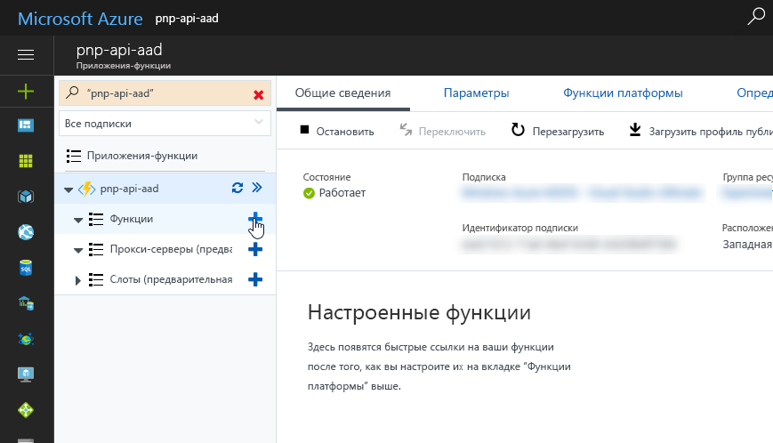
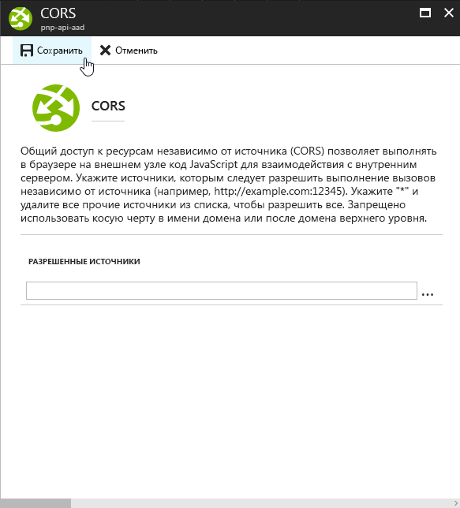
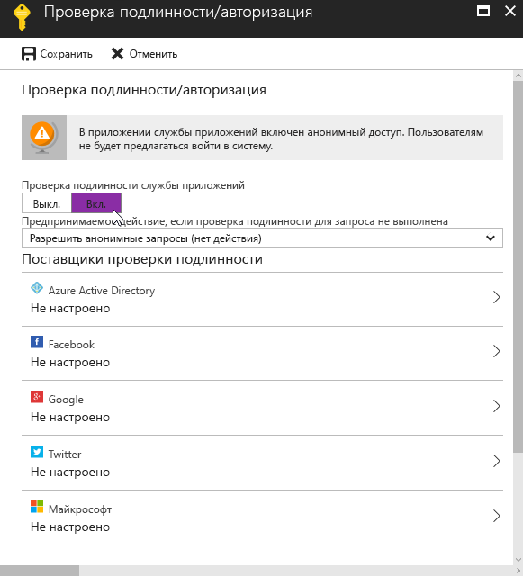

# <a name="connect-to-api-secured-with-azure-active-directory"></a><span data-ttu-id="a1a0d-103">Подключение к API, защищенному с помощью Azure Active Directory</span><span class="sxs-lookup"><span data-stu-id="a1a0d-103">Connect to API secured with Azure Active Directory</span></span>

<span data-ttu-id="a1a0d-104">При создании решений SharePoint Framework может потребоваться подключиться к пользовательскому API, чтобы получить те или иные данные либо взаимодействовать с бизнес-приложениями.</span><span class="sxs-lookup"><span data-stu-id="a1a0d-104">When building SharePoint Framework solutions, you might need to connect to your custom API to retrieve some data or to communicate with line of business applications.</span></span> <span data-ttu-id="a1a0d-105">Защита пользовательских API с помощью Microsoft Azure Active Directory (Azure AD) предоставляет множество преимуществ и может быть реализована по-разному.</span><span class="sxs-lookup"><span data-stu-id="a1a0d-105">Securing custom APIs with Microsoft Azure Active Directory (Azure AD) offers you many benefits and can be done in a number of ways.</span></span> <span data-ttu-id="a1a0d-106">После создания API получить доступ к нему можно несколькими способами.</span><span class="sxs-lookup"><span data-stu-id="a1a0d-106">After you have built the API, there are several ways in which you can access it.</span></span> <span data-ttu-id="a1a0d-107">Они отличаются по сложности, и у каждого из них есть особенности, которые следует учитывать.</span><span class="sxs-lookup"><span data-stu-id="a1a0d-107">These ways vary in complexity and each have their specific considerations.</span></span> 

<span data-ttu-id="a1a0d-108">В этой статье рассматриваются разные подходы и представлено пошаговое руководство по созданию API, защищенного с помощью Azure AD, и подключению к нему.</span><span class="sxs-lookup"><span data-stu-id="a1a0d-108">This article discusses the different approaches and describes the step-by-step process of building and connecting to an API secured with Azure AD.</span></span>

## <a name="secure-an-api-with-azure-ad"></a><span data-ttu-id="a1a0d-109">Защита API с помощью Azure AD</span><span class="sxs-lookup"><span data-stu-id="a1a0d-109">Secure an API with Azure Active Directory</span></span>

<span data-ttu-id="a1a0d-110">Если вы используете Office 365, то вам обязательно следует рассмотреть возможность защиты пользовательских API с помощью Azure AD.</span><span class="sxs-lookup"><span data-stu-id="a1a0d-110">If you're using Office 365, securing custom APIs using Azure AD is an architectural option that you should definitely consider.</span></span> <span data-ttu-id="a1a0d-111">Прежде всего, это позволяет защищать доступ к API с помощью имеющихся учетных данных организации, управление которыми уже осуществляется через Office 365 и Azure AD.</span><span class="sxs-lookup"><span data-stu-id="a1a0d-111">First and foremost, it allows you to secure the access to the API using existing organizational credentials that are already managed through Office 365 and Azure AD.</span></span> <span data-ttu-id="a1a0d-112">Пользователи с активными учетными записями могут без проблем работать с приложениями, в которых используются API, защищенные при помощи Azure AD.</span><span class="sxs-lookup"><span data-stu-id="a1a0d-112">Users with an active account can seamlessly work with applications that leverage APIs secured with Azure AD.</span></span> <span data-ttu-id="a1a0d-113">Администраторы Azure AD могут централизованно управлять доступом к API так же, как они управляют доступом ко всем другим приложениям, зарегистрированным в Azure AD.</span><span class="sxs-lookup"><span data-stu-id="a1a0d-113">Azure AD administrators can centrally manage access to the API, the same way they manage access to all other applications registered with Azure AD.</span></span>

<span data-ttu-id="a1a0d-114">С точки зрения разработчика API использование Azure AD для защиты API освобождает от необходимости управлять проприетарным набором учетных данных пользователей и реализовывать специальный уровень безопасности для своего API.</span><span class="sxs-lookup"><span data-stu-id="a1a0d-114">As the API developer, using Azure AD to secure your API frees you from managing a proprietary set of user credentials and implementing a custom security layer for your API. Additionally, Azure Active Directory supports the OAuth protocol which allows you to connect to the API from a range of application types varying from mobile apps to client-side solutions.</span></span> <span data-ttu-id="a1a0d-115">Кроме того, Azure AD поддерживает протокол OAuth, с помощью которого вы можете подключаться к API из приложений различных типов — от мобильных приложений до клиентских решений.</span><span class="sxs-lookup"><span data-stu-id="a1a0d-115">As the API developer, using Azure AD to secure your API frees you from managing a proprietary set of user credentials and implementing a custom security layer for your API. Additionally, Azure Active Directory supports the OAuth protocol which allows you to connect to the API from a range of application types varying from mobile apps to client-side solutions.</span></span>

<span data-ttu-id="a1a0d-116">Создавая собственные API, вы можете защитить их при помощи Azure AD двумя основными способами.</span><span class="sxs-lookup"><span data-stu-id="a1a0d-116">When building custom APIs, there are two main ways in which you can secure your API with Azure AD.</span></span> <span data-ttu-id="a1a0d-117">Если API размещается в Службе приложений Microsoft Azure, то вы можете воспользоваться вариантом с проверкой подлинности службы приложений.</span><span class="sxs-lookup"><span data-stu-id="a1a0d-117">If you host the API in Microsoft Azure App Service, you can benefit from the App Service Authentication option.</span></span> <span data-ttu-id="a1a0d-118">Если же вам нужна большая гибкость в плане размещения API (например, вы хотите разместить его в своей инфраструктуре или в контейнерах Docker), следует защитить интерфейс в коде.</span><span class="sxs-lookup"><span data-stu-id="a1a0d-118">If you look for more hosting flexibility for your API, such as hosting it on your own infrastructure or in Docker containers, you need to secure it in code.</span></span> <span data-ttu-id="a1a0d-119">В таких случаях реализация зависит от языка программирования и платформы.</span><span class="sxs-lookup"><span data-stu-id="a1a0d-119">In such cases, the implementation depends on your programming language and framework.</span></span> 

<span data-ttu-id="a1a0d-120">В этой статье при рассмотрении данного варианта используются язык C# и платформа [Веб-API ASP.NET](https://www.asp.net/web-api).</span><span class="sxs-lookup"><span data-stu-id="a1a0d-120">In this article, when discussing this option, you will use C# and the [ASP.NET Web API](https://www.asp.net/web-api) as the framework.</span></span>

### <a name="secure-the-api-using-azure-app-service-authentication"></a><span data-ttu-id="a1a0d-121">Защита API с помощью проверки подлинности для Службы приложений Azure</span><span class="sxs-lookup"><span data-stu-id="a1a0d-121">Secure the API using Azure App Service Authentication</span></span>

<span data-ttu-id="a1a0d-122">При развертывании собственных API в Службе приложений Azure вы можете воспользоваться проверкой подлинности службы приложений, чтобы защитить API с помощью Azure AD.</span><span class="sxs-lookup"><span data-stu-id="a1a0d-122">When deploying custom APIs to Azure App Service, you can benefit from the App Service Authentication option to secure the API with Azure AD.</span></span> <span data-ttu-id="a1a0d-123">Главное преимущество проверки подлинности для службы приложений — ее простота. Следуя указаниям по настройке, представленным на портале Azure, вы можете автоматически настроить проверку подлинности с помощью мастера.</span><span class="sxs-lookup"><span data-stu-id="a1a0d-123">The biggest benefit of using App Service Authentication is its simplicity: by following the configuration steps available in the Azure Portal, you can have the wizard set up the authentication configuration for you.</span></span> <span data-ttu-id="a1a0d-124">Если выбрать базовую установку, мастер создаст в Azure AD новое приложение, связанное с текущей подпиской.</span><span class="sxs-lookup"><span data-stu-id="a1a0d-124">If you choose the basic setup, the wizard creates a new Azure AD application in Azure AD associated with the current subscription.</span></span> <span data-ttu-id="a1a0d-125">В расширенной конфигурации вы можете выбрать, какое приложение Azure AD будет использоваться для защиты доступа к службе приложений, в которой размещается API.</span><span class="sxs-lookup"><span data-stu-id="a1a0d-125">In the advanced configuration, you can choose which Azure AD application should be used to secure the access to the App Service hosting the API.</span></span>


<span data-ttu-id="a1a0d-127">Когда проверка подлинности службы приложений будет настроена, пользователям, пытающимся получить доступ к API, будет предлагаться войти с помощью своей организационной учетной записи, принадлежащей той же службе Azure AD, что и приложение Azure AD, используемое для защиты API.</span><span class="sxs-lookup"><span data-stu-id="a1a0d-127">After App Service Authentication has been configured, users trying to access your API are prompted to sign in with their organizational account that belongs to the same Azure AD as the Azure AD application used to secure the API.</span></span> <span data-ttu-id="a1a0d-128">После входа вы сможете получить доступ к сведениям о текущем пользователе с помощью свойства `HttpContext.Current.User`.</span><span class="sxs-lookup"><span data-stu-id="a1a0d-128">After signing in, you are able to access the information about the current user through the `HttpContext.Current.User` property.</span></span> <span data-ttu-id="a1a0d-129">При использовании проверки подлинности для Службы приложений Azure не требуется никакой дополнительной настройки в приложении.</span><span class="sxs-lookup"><span data-stu-id="a1a0d-129">When using Azure App Service Authentication, there is no additional configuration required in your application.</span></span>

<span data-ttu-id="a1a0d-130">Функция проверки подлинности для Службы приложений Azure доступна только в Службе приложений Azure.</span><span class="sxs-lookup"><span data-stu-id="a1a0d-130">Azure App Service Authentication is a feature available only in Azure App Service.</span></span> <span data-ttu-id="a1a0d-131">Эта возможность значительно упрощает реализацию проверки подлинности в вашем API, но этот интерфейс сможет работать только в Службе приложений Azure.</span><span class="sxs-lookup"><span data-stu-id="a1a0d-131">While this capability significantly simplifies implementing authentication in your API, it ties it to running inside Azure App Service.</span></span> <span data-ttu-id="a1a0d-132">Если вам нужно разместить API у другого облачного поставщика или в контейнере Docker, то для начала необходимо реализовать уровень проверки подлинности.</span><span class="sxs-lookup"><span data-stu-id="a1a0d-132">If you want to host the API with another cloud provider or inside a Docker container, you need to implement the authentication layer first.</span></span>

### <a name="secure-the-api-using-aspnet-authentication"></a><span data-ttu-id="a1a0d-133">Защита API с помощью аутентификации в ASP.NET</span><span class="sxs-lookup"><span data-stu-id="a1a0d-133">Secure the API using ASP.NET authentication</span></span>

<span data-ttu-id="a1a0d-134">Если вам нужна максимальная гибкость в отношении размещения и развертывания API, то вы можете реализовать поддержку проверки подлинности Azure AD в ASP.NET.</span><span class="sxs-lookup"><span data-stu-id="a1a0d-134">If you want to have the maximum flexibility with regards to where your API is hosted and how it is deployed, you should consider implementing the support for AAD authentication in ASP.NET. Visual Studio simplifies the implementation process significantly and after completing the authentication setup wizard, your API will require users to sign in using their organizational account.</span></span> <span data-ttu-id="a1a0d-135">Visual Studio значительно упрощает реализацию. Когда мастер настройки проверки подлинности завершит свою работу, для использования API пользователям нужно будет входить с помощью своих организационных учетных записей.</span><span class="sxs-lookup"><span data-stu-id="a1a0d-135">Visual Studio simplifies the implementation process significantly, and after completing the authentication setup wizard, your API requires users to sign in by using their organizational account.</span></span>


<span data-ttu-id="a1a0d-137">В ходе настройки Visual Studio добавляет все необходимые ссылки и настройки в проект веб-API ASP.NET, в том числе регистрирует новое приложение Azure AD для защиты вашего API.</span><span class="sxs-lookup"><span data-stu-id="a1a0d-137">During the configuration process, Visual Studio will add all the necessary references and settings to your ASP.NET Web API project, including registering a new AAD application to secure your API.</span></span>

## <a name="access-an-api-secured-with-azure-ad-from-sharepoint-framework-solutions"></a><span data-ttu-id="a1a0d-138">Доступ к API, защищенному с помощью Azure AD, из решений SharePoint Framework</span><span class="sxs-lookup"><span data-stu-id="a1a0d-138">Access an API secured with Azure Active Directory from SharePoint Framework solutions</span></span>

<span data-ttu-id="a1a0d-139">Решения SharePoint Framework полностью работают на стороне клиента, поэтому не могут надежно хранить секреты, необходимые для подключения к защищенным API.</span><span class="sxs-lookup"><span data-stu-id="a1a0d-139">SharePoint Framework solutions are fully client-side and as such are incapable of securely storing secrets required to connect to secured APIs. To support secure communication with client-side solutions, Azure Active Directory supports a number of mechanisms such as authentication cookies or the OAuth implicit flow.</span></span> <span data-ttu-id="a1a0d-140">Azure AD поддерживает ряд механизмов для защищенной связи с клиентскими решениями, например файлы cookie аутентификации и неявный поток OAuth.</span><span class="sxs-lookup"><span data-stu-id="a1a0d-140">SharePoint Framework solutions are fully client-side and as such are incapable of securely storing secrets required to connect to secured APIs. To support secure communication with client-side solutions, Azure Active Directory supports a number of mechanisms such as authentication cookies or the OAuth implicit flow.</span></span>

### <a name="access-the-api-using-adal-js"></a><span data-ttu-id="a1a0d-141">Доступ к API с помощью ADAL JS</span><span class="sxs-lookup"><span data-stu-id="a1a0d-141">Access the API using ADAL JS</span></span>

<span data-ttu-id="a1a0d-142">Для связи с API, защищенными при помощи Azure AD, в клиентских решениях часто используют библиотеку [ADAL JS](https://github.com/AzureAD/azure-activedirectory-library-for-js).</span><span class="sxs-lookup"><span data-stu-id="a1a0d-142">A commonly used approach for communicating with APIs secured with Azure AD from client-side solutions is using the [ADAL JS](https://github.com/AzureAD/azure-activedirectory-library-for-js) library.</span></span> <span data-ttu-id="a1a0d-143">ADAL JS упрощает реализацию проверки подлинности для Azure AD в клиентских решениях, а также получение маркеров доступа для определенных ресурсов.</span><span class="sxs-lookup"><span data-stu-id="a1a0d-143">ADAL JS simplifies implementing authentication against Azure AD in client-side applications as well as retrieving access tokens for specific resources.</span></span> <span data-ttu-id="a1a0d-144">Для приложений, созданных с помощью AngularJS, ADAL JS предоставляет перехватчик HTTP-запросов, который автоматически добавляет необходимые маркеры доступа в заголовки исходящих веб-запросов.</span><span class="sxs-lookup"><span data-stu-id="a1a0d-144">For applications built using AngularJS, ADAL JS offers an HTTP request interceptor that automatically adds required access tokens to headers of outgoing web requests.</span></span> <span data-ttu-id="a1a0d-145">При использовании этого перехватчика разработчикам не придется менять веб-запросы к API, защищенным при помощи Azure AD, поэтому они могут сосредоточиться на разработке приложения.</span><span class="sxs-lookup"><span data-stu-id="a1a0d-145">By using this requestor, developers don't need to modify web requests to APIs secured with Azure AD and can focus on building the application instead.</span></span>

#### <a name="benefits-of-using-adal-js-to-communicate-with-apis-secured-with-azure-ad"></a><span data-ttu-id="a1a0d-146">Преимущества использования ADAL JS для связи с API, защищенными при помощи Azure AD</span><span class="sxs-lookup"><span data-stu-id="a1a0d-146">Benefits of using ADAL JS to communicate with APIs secured with AAD</span></span>

<span data-ttu-id="a1a0d-147">При использовании ADAL JS у клиентских приложений есть полный доступ к идентификационным данным вошедшего пользователя.</span><span class="sxs-lookup"><span data-stu-id="a1a0d-147">When using ADAL JS, client-side applications have full access to the identity information of the currently signed-in user.</span></span> <span data-ttu-id="a1a0d-148">Это удобно, если требуется, к примеру, показывать имя или аватар пользователя в приложении.</span><span class="sxs-lookup"><span data-stu-id="a1a0d-148">This is convenient for requirements such as displaying a user name or profile picture in the application.</span></span> <span data-ttu-id="a1a0d-149">При создании решений, размещаемых в SharePoint, разработчики могут получать расширенные данные профиля с помощью API SharePoint, но в случае автономных приложений это невозможно.</span><span class="sxs-lookup"><span data-stu-id="a1a0d-149">When building solutions hosted in SharePoint, developers can retrieve extended profile information by using the SharePoint API, but for standalone applications this isn't possible.</span></span>

<span data-ttu-id="a1a0d-150">ADAL JS не только упрощает проверку подлинности в Azure AD, но и может получать маркеры доступа к определенным ресурсам.</span><span class="sxs-lookup"><span data-stu-id="a1a0d-150">Besides facilitating authentication against Azure AD, ADAL JS is capable of retrieving access tokens to specific resources.</span></span> <span data-ttu-id="a1a0d-151">С помощью этих маркеров доступа приложения могут безопасно получать доступ к API, защищенным с помощью Azure AD, например [Microsoft Graph](./call-microsoft-graph-from-your-web-part.md) или другим пользовательским API.</span><span class="sxs-lookup"><span data-stu-id="a1a0d-151">With these access tokens, applications can securely access APIs secured with Azure AD such as [Microsoft Graph](./call-microsoft-graph-from-your-web-part.md) or other custom APIs.</span></span> <span data-ttu-id="a1a0d-152">Чтобы клиентское приложение могло использовать ADAL JS, необходимо зарегистрировать его как приложение в Azure AD.</span><span class="sxs-lookup"><span data-stu-id="a1a0d-152">Before a client-side application can use ADAL JS, it has to be registered as an application in Azure AD.</span></span> <span data-ttu-id="a1a0d-153">Во время регистрации разработчики указывают ряд параметров, например URL-адрес для размещения приложения и ресурсы, доступ к которым ему требуется (либо самостоятельно, либо от имени вошедшего пользователя).</span><span class="sxs-lookup"><span data-stu-id="a1a0d-153">In the registration process, developers specify a number of parameters such as the URL where the application is hosted and the resources to which the application requires access, either by itself or on behalf of the currently signed-in user.</span></span>


<span data-ttu-id="a1a0d-155">При первом использовании приложения пользователю предлагается предоставить ему необходимые разрешения.</span><span class="sxs-lookup"><span data-stu-id="a1a0d-155">The first time the application is used, it prompts the user to grant it the necessary permissions.</span></span> <span data-ttu-id="a1a0d-156">Это часто называют потоком согласия.</span><span class="sxs-lookup"><span data-stu-id="a1a0d-156">This is often referred to as consent flow.</span></span> <span data-ttu-id="a1a0d-157">После утверждения приложение может запросить маркеры доступа к определенным ресурсам и безопасно взаимодействовать с ними.</span><span class="sxs-lookup"><span data-stu-id="a1a0d-157">After it's approved, the application can then request access tokens for the specific resources and communicate with them securely.</span></span>

#### <a name="considerations-when-using-adal-js-to-communicate-with-apis-secured-with-azure-ad"></a><span data-ttu-id="a1a0d-158">Особенности использования ADAL JS для связи с API, защищенными при помощи Azure AD</span><span class="sxs-lookup"><span data-stu-id="a1a0d-158">Considerations when using ADAL JS to communicate with APIs secured with AAD</span></span>

<span data-ttu-id="a1a0d-p114">Библиотека ADAL JS была разработана для использования с одностраничными приложениями. Чтобы она правильно работала при использовании с решениями SharePoint Framework, необходимо [применить исправление](./call-microsoft-graph-from-your-web-part.md).</span><span class="sxs-lookup"><span data-stu-id="a1a0d-p114">ADAL JS has been designed to be used with single-page applications. As such, by default it doesn't work correctly when used with SharePoint Framework solutions. By [applying a patch](./call-microsoft-graph-from-your-web-part.md) however, it can be successfully used in SharePoint Framework projects.</span></span>

<span data-ttu-id="a1a0d-162">При использовании ADAL JS и OAuth для доступа к API, защищенным с помощью Azure AD, служба Azure инициирует поток проверки подлинности.</span><span class="sxs-lookup"><span data-stu-id="a1a0d-162">When using ADAL JS and OAuth to access APIs secured with Azure AD, the authentication flow is facilitated by Azure.</span></span> <span data-ttu-id="a1a0d-163">Страница входа в Azure обрабатывает все ошибки.</span><span class="sxs-lookup"><span data-stu-id="a1a0d-163">Any errors are handled by the Azure sign-in page.</span></span> <span data-ttu-id="a1a0d-164">Когда пользователь войдет с помощью своей организационной учетной записи, приложение попробует получить действительный маркер доступа.</span><span class="sxs-lookup"><span data-stu-id="a1a0d-164">After the user has signed-in with her organizational account, the application tries to retrieve a valid access token.</span></span> <span data-ttu-id="a1a0d-165">Все ошибки, возникающие на этом этапе, должен в явном виде обрабатывать разработчик приложения, так как получение маркеров доступа выполняется без участия пользователя и отображения пользовательского интерфейса.</span><span class="sxs-lookup"><span data-stu-id="a1a0d-165">All errors that occur at this stage have to be explicitly handled by the developer of the application because retrieving access tokens is non-interactive and doesn't present any UI to the user.</span></span>

<span data-ttu-id="a1a0d-166">Каждое клиентское приложение, которому требуется использовать ADAL JS, должно быть зарегистрировано как приложение Azure AD.</span><span class="sxs-lookup"><span data-stu-id="a1a0d-166">Every client-side application that wants to use ADAL JS needs to be registered as an Azure AD application.</span></span> <span data-ttu-id="a1a0d-167">Регистрационные данные включают URL-адрес расположения приложения.</span><span class="sxs-lookup"><span data-stu-id="a1a0d-167">A part of the registration information is the URL where the application is located.</span></span> <span data-ttu-id="a1a0d-168">Так как приложение полностью работает на стороне клиента и не способно надежно хранить секрет, URL-адрес является частью соглашения между приложением и Azure AD для обеспечения безопасности.</span><span class="sxs-lookup"><span data-stu-id="a1a0d-168">Because the application is fully client-side and is not capable of securely storing a secret, the URL is a part of the contract between the application and Azure AD to establish security.</span></span> <span data-ttu-id="a1a0d-169">Это требование создает проблемы для решений SharePoint Framework, так как разработчики не могут заранее знать все URL-адреса, где будет использоваться та или иная веб-часть.</span><span class="sxs-lookup"><span data-stu-id="a1a0d-169">This requirement is problematic for SharePoint Framework solutions because developers cannot simply know upfront all URLs where a particular web part will be used.</span></span> <span data-ttu-id="a1a0d-170">Кроме того, на данный момент в Azure AD можно указывать до 10 URL-адресов ответа, что может быть недостаточно в некоторых сценариях.</span><span class="sxs-lookup"><span data-stu-id="a1a0d-170">Additionally, at this moment, Azure AD supports specifying up to 10 reply URLs, which might not be sufficient in some scenarios.</span></span>

<span data-ttu-id="a1a0d-171">Чтобы клиентское приложение могло получить маркер доступа к определенному ресурсу, ему необходимо выполнить аутентификацию пользователя и получить токен идентификатора, который затем можно обменять на маркер доступа.</span><span class="sxs-lookup"><span data-stu-id="a1a0d-171">Before a client-side application can retrieve an access token to a specific resource, it needs to authenticate the user to obtain the ID token which can then be exchanged for an access token.</span></span> <span data-ttu-id="a1a0d-172">Несмотря на то что решения SharePoint Framework размещаются в SharePoint, где пользователи уже вошли с помощью своих организационных учетных записей, данные аутентификации для текущего пользователя недоступны решениям SharePoint Framework.</span><span class="sxs-lookup"><span data-stu-id="a1a0d-172">Even though SharePoint Framework solutions are hosted in SharePoint, where users are already signed in using their organizational accounts, the authentication information for the current user isn't available to SharePoint Framework solutions.</span></span> <span data-ttu-id="a1a0d-173">Каждое решение должно в явной форме предлагать пользователю войти.</span><span class="sxs-lookup"><span data-stu-id="a1a0d-173">Instead, each solution must explicitly request the user to sign in.</span></span> <span data-ttu-id="a1a0d-174">Для этого можно либо перенаправлять пользователя на страницу входа в Azure, либо показывать всплывающее окно со страницей входа.</span><span class="sxs-lookup"><span data-stu-id="a1a0d-174">This can be done either by redirecting the user to the Azure sign-in page or by showing a pop-up window with the sign-in page.</span></span> <span data-ttu-id="a1a0d-175">Последний вариант менее навязчив в случае веб-части, которая является лишь одним из нескольких элементов на странице.</span><span class="sxs-lookup"><span data-stu-id="a1a0d-175">The latter is less intrusive in the case of a web part, which is one of the many elements on a page.</span></span> <span data-ttu-id="a1a0d-176">Если на странице есть несколько клиентских веб-частей SharePoint Framework, то каждая из них отдельно управляет своим состоянием и требует явного входа пользователя.</span><span class="sxs-lookup"><span data-stu-id="a1a0d-176">If there are multiple SharePoint Framework client-side web parts on the page, each of them manages its state separately and requires the user to explicitly sign in to that particular web part.</span></span>

<span data-ttu-id="a1a0d-177">Получать маркеры доступа, которые необходимы для взаимодействия с API, защищенными при помощи Azure AD, помогают скрытые объекты iframe, обрабатывающие перенаправление в конечные точки Azure AD.</span><span class="sxs-lookup"><span data-stu-id="a1a0d-177">Retrieving access tokens required to communicate with APIs secured with Azure AD is facilitated by hidden iframes that handle redirects to Azure AD endpoints.</span></span> <span data-ttu-id="a1a0d-178">В Microsoft Internet Explorer есть известное ограничение: в неявном потоке OAuth не удается получать маркеры доступа, если конечные точки для входа в Azure AD и URL-адрес SharePoint Online находятся в разных зонах безопасности.</span><span class="sxs-lookup"><span data-stu-id="a1a0d-178">There is a known limitation in Microsoft Internet Explorer where obtaining access tokens in OAuth implicit flow fails, if the Azure AD sign-in endpoints and the SharePoint Online URL are not in the same security zone.</span></span> <span data-ttu-id="a1a0d-179">Если в организации используется Internet Explorer, убедитесь, что конечная точка Azure AD и URL-адреса SharePoint Online настроены в одной и той же зоне безопасности.</span><span class="sxs-lookup"><span data-stu-id="a1a0d-179">If your organization is using Internet Explorer, ensure that the Azure AD endpoint and SharePoint Online URLs are configured in the same security zone.</span></span> <span data-ttu-id="a1a0d-180">В целях согласованности некоторые организации передают эти параметры пользователям с помощью групповых политик.</span><span class="sxs-lookup"><span data-stu-id="a1a0d-180">To maintain consistency, some organizations choose to push these settings to end-users using group policies.</span></span>

<span data-ttu-id="a1a0d-181">К API, защищенным при помощи Azure AD, невозможно получать анонимный доступ.</span><span class="sxs-lookup"><span data-stu-id="a1a0d-181">APIs secured with Azure AD cannot be accessed anonymously.</span></span> <span data-ttu-id="a1a0d-182">Вызывающее приложение должно предоставить действительные учетные данные.</span><span class="sxs-lookup"><span data-stu-id="a1a0d-182">Instead they require a valid credential to be presented by the application calling them.</span></span> <span data-ttu-id="a1a0d-183">При использовании неявного потока OAuth с клиентскими приложениями это будет маркер доступа носителя, полученный при помощи ADAL JS.</span><span class="sxs-lookup"><span data-stu-id="a1a0d-183">When using the OAuth implicit flow with client-side applications, this credential is the bearer access token obtained using ADAL JS.</span></span> <span data-ttu-id="a1a0d-184">Если вы создали свое решение SharePoint Framework с помощью AngularJS, то ADAL JS автоматически обеспечивает наличие действительного маркера доступа для определенного ресурса и добавляет его ко всем исходящим запросам, выполняемым с помощью службы `$http` платформы AngularJS.</span><span class="sxs-lookup"><span data-stu-id="a1a0d-184">If you have built your SharePoint Framework solution using AngularJS, ADAL JS automatically ensures that you have a valid access token for the particular resource, and adds it to all outgoing requests executed by using the AngularJS `$http` service.</span></span> <span data-ttu-id="a1a0d-185">При использовании других библиотек JavaScript необходимо получить действительный маркер доступа, при необходимости обновить его и самостоятельно добавлять к исходящим веб-запросам.</span><span class="sxs-lookup"><span data-stu-id="a1a0d-185">When using other JavaScript libraries, you have to obtain a valid access token, and if necessary refresh it, and attach it to the outgoing web requests yourself.</span></span>

### <a name="access-the-api-by-leveraging-sharepoint-online-authentication-cookie"></a><span data-ttu-id="a1a0d-186">Доступ к API с помощью файла cookie аутентификации для SharePoint Online</span><span class="sxs-lookup"><span data-stu-id="a1a0d-186">Access the API by leveraging SharePoint Online authentication cookie</span></span>

<span data-ttu-id="a1a0d-187">Вместо ADAL JS для подключения к пользовательским API, защищенным с помощью Azure AD, можно использовать файл cookie аутентификации.</span><span class="sxs-lookup"><span data-stu-id="a1a0d-187">An alternative approach to using ADAL JS for connecting to APIs secured with AAD is levering the existing authentication cookie for seamless authentication to the custom API.</span></span>

#### <a name="how-it-works"></a><span data-ttu-id="a1a0d-188">Как это работает</span><span class="sxs-lookup"><span data-stu-id="a1a0d-188">How it works</span></span>

<span data-ttu-id="a1a0d-189">При входе в SharePoint Online с помощью организационной учетной записи в ваш браузер добавляется файл cookie аутентификации.</span><span class="sxs-lookup"><span data-stu-id="a1a0d-189">When you sign in with your organizational account to SharePoint Online, an authentication cookie is set in your browser.</span></span> <span data-ttu-id="a1a0d-190">Этот файл cookie отправляется с каждым запросом к SharePoint, позволяя работать с сайтами и документами.</span><span class="sxs-lookup"><span data-stu-id="a1a0d-190">This cookie is sent with every request to SharePoint allowing to work sites and documents.</span></span> <span data-ttu-id="a1a0d-191">Чтобы использовать этот файл для подключения к пользовательскому API, защищенному при помощи Azure AD, необходимо поместить на страницу скрытый объект iframe, указывающий на URL-адрес расположения API и также защищенный с помощью Azure AD.</span><span class="sxs-lookup"><span data-stu-id="a1a0d-191">To use this cookie, to connect to a custom API secured with Azure AD, you place a hidden iframe on the page pointing to a URL where the API is hosted and which is also secured with Azure AD.</span></span> <span data-ttu-id="a1a0d-192">Когда браузер попробует загрузить этот URL-адрес, он будет перенаправлен на страницу входа в Azure AD, так как анонимный доступ запрещен.</span><span class="sxs-lookup"><span data-stu-id="a1a0d-192">After the browser tries to load this URL, it gets redirected to the Azure AD sign-in page because anonymous access is not allowed.</span></span> <span data-ttu-id="a1a0d-193">Так как вы уже вошли с помощью своей организационной учетной записи для доступа к SharePoint, аутентификация выполняется автоматически, перенаправляя вас по исходному URL-адресу.</span><span class="sxs-lookup"><span data-stu-id="a1a0d-193">Because you are already signed in with your organization account to access SharePoint, the authentication completed automatically, redirecting you back to the original URL.</span></span> <span data-ttu-id="a1a0d-194">На этом этапе в браузере есть файл cookie аутентификации для Azure AD, позволяющий получать доступ к пользовательскому API, защищенному при помощи Azure AD.</span><span class="sxs-lookup"><span data-stu-id="a1a0d-194">At this point, your browser has the Azure AD authentication cookie for accessing the custom API secured with Azure AD.</span></span>

<span data-ttu-id="a1a0d-p121">После размещения элемента iframe на странице к нему добавляется прослушиватель событий `onload`, который запускается после выполнения аутентификации. В этом прослушивателе устанавливается указание на то, что аутентификация выполнена и можно безопасно вызывать пользовательский API. Все веб-запросы к пользовательским API следует отложить до установки этого флага, иначе возникнет ошибка.</span><span class="sxs-lookup"><span data-stu-id="a1a0d-p121">After placing the iframe on the page, you attach an `onload` event listener to it, which is triggered after the authentication flow completed. In this event listener, you set a flag indicating that authentication completed and you can now securely call the custom API. All web requests to your custom APIs should be delayed until this flag is set or they will fail.</span></span>

```typescript
// ...

export default class LatestOrdersWebPart extends BaseClientSideWebPart<ILatestOrdersWebPartProps> {
  private remotePartyLoaded: boolean = false;
  private orders: IOrder[];

  public render(): void {
    this.domElement.innerHTML = `
    <div class="${styles.latestOrders}">
      <iframe src="https://contoso.azurewebsites.net/"
          style="display:none;"></iframe>
      <div class="ms-font-xxl">Recent orders</div>
      <div class="loading"></div>
      <table class="data" style="display:none;">
        <thead>
          <tr>
            <th>ID</th>
            <th>Date</th>
            <th>Region</th>
            <th>Rep</th>
            <th>Item</th>
            <th>Units</th>
            <th>Unit cost</th>
            <th>Total</th>
          </tr>
        </thead>
        <tbody>
        </tbody>
      </table>
    </div>`;

    this.context.statusRenderer.displayLoadingIndicator(
      this.domElement.querySelector(".loading"), "orders");

    this.domElement.querySelector("iframe").addEventListener("load", (): void => {
      this.remotePartyLoaded = true;
    });

    this.executeOrDelayUntilRemotePartyLoaded((): void => {
      // retrieve and render data
    });
  }

  private executeOrDelayUntilRemotePartyLoaded(func: Function): void {
    if (this.remotePartyLoaded) {
      func();
    } else {
      setTimeout((): void => { this.executeOrDelayUntilRemotePartyLoaded(func); }, 100);
    }
  }

  // ...
}
```

<span data-ttu-id="a1a0d-198">При выполнении запросов AJAX в веб-частях необходимо указывать, что файл cookie аутентификации следует отправлять между доменами.</span><span class="sxs-lookup"><span data-stu-id="a1a0d-198">When executing AJAX requests in your web parts, you have to specify that the authentication cookie should be sent cross-domain.</span></span> <span data-ttu-id="a1a0d-199">Это можно сделать, задав для свойства **credentials** веб-запроса значение **include**.</span><span class="sxs-lookup"><span data-stu-id="a1a0d-199">You can enable this by setting the **credentials** property of the web request to **include**.</span></span> <span data-ttu-id="a1a0d-200">Если этого не сделать, запрос будет блокироваться в браузере, а вызывать API будет невозможно.</span><span class="sxs-lookup"><span data-stu-id="a1a0d-200">Without this, the request is blocked in the browser and you are not able to call the API.</span></span>

```typescript
// ...

export default class LatestOrdersWebPart extends BaseClientSideWebPart<ILatestOrdersWebPartProps> {
    // ...

    private retrieveAndRenderData(): void {
        this.context.httpClient.get("https://contoso.azurewebsites.net/api/orders",
        HttpClient.configurations.v1, {
          credentials: "include"
        })
        .then((response: HttpClientResponse): Promise<IOrder[]> => {
          // ...
        });
    }

    // ...
}
```

<span data-ttu-id="a1a0d-201">Для поддержки этого способа также требуется специальная настройка пользовательского API.</span><span class="sxs-lookup"><span data-stu-id="a1a0d-201">To support this method, the custom API requires some specific configurations as well.</span></span> <span data-ttu-id="a1a0d-202">Во-первых, необходима поддержка получения учетных данных из междоменных вызовов.</span><span class="sxs-lookup"><span data-stu-id="a1a0d-202">First, it requires support for receiving credentials from cross-domain calls.</span></span> <span data-ttu-id="a1a0d-203">Для этого следует присвоить заголовку **Access-Control-Allow-Credentials** отклика значение **true**.</span><span class="sxs-lookup"><span data-stu-id="a1a0d-203">This is done by setting the **Access-Control-Allow-Credentials** response header to **true**.</span></span>

> [!IMPORTANT] 
> <span data-ttu-id="a1a0d-204">При использовании заголовка **Access-Control-Allow-Credentials** можно указать только один источник.</span><span class="sxs-lookup"><span data-stu-id="a1a0d-204">Important: When using the **Access-Control-Allow-Credentials** you are allowed to specify only one origin.</span></span>

<span data-ttu-id="a1a0d-205">Затем необходимо указать, какому источнику разрешается вызывать API.</span><span class="sxs-lookup"><span data-stu-id="a1a0d-205">Next, it needs to specify what origin is allowed to call the API.</span></span> <span data-ttu-id="a1a0d-206">Это можно настроить в заголовке **Access-Control-Allow-Origin** отклика.</span><span class="sxs-lookup"><span data-stu-id="a1a0d-206">This is configured in the **Access-Control-Allow-Origin** response header.</span></span>

<span data-ttu-id="a1a0d-207">Точный способ настройки этих заголовков зависит от реализации API.</span><span class="sxs-lookup"><span data-stu-id="a1a0d-207">How these headers should be configured exactly depends on the implementation of your API.</span></span> <span data-ttu-id="a1a0d-208">Например, если вы используете функцию Azure для создания API с использованием Node.js, в объекте отклика необходимо задать следующие заголовки:</span><span class="sxs-lookup"><span data-stu-id="a1a0d-208">How these headers should be configured exactly, depends on the implementation of your API. If you use an Azure Function to build the API using Node.js for example, you would set these headers on the response object:</span></span>

```js
context.res = {
    body: "response",
    headers: {
        "Access-Control-Allow-Credentials" : "true",
        "Access-Control-Allow-Origin" : "https://contoso.sharepoint.com"
    }
};
```

<span data-ttu-id="a1a0d-209">При использовании веб-API ASP.NET необходимо установить пакет NuGet **Microsoft.AspNet.WebApi.Cors**, вызвать метод `config.EnableCors()` и использовать атрибут **EnableCors** для установки значений заголовков:</span><span class="sxs-lookup"><span data-stu-id="a1a0d-209">When using ASP.NET Web API, you would install the **Microsoft.AspNet.WebApi.Cors** NuGet package, call the `config.EnableCors()` method and use the **EnableCors** attribute to set the header values:</span></span>

```cs
[EnableCors("origins": "*", "headers": "*", "methods": "*", SupportsCredentials = true)]
public string Get() {
    return "response";
}
```

#### <a name="benefits-of-using-the-sharepoint-online-authentication-cookie-for-seamless-authentication"></a><span data-ttu-id="a1a0d-210">Преимущества использования файла cookie аутентификации для SharePoint Online</span><span class="sxs-lookup"><span data-stu-id="a1a0d-210">Benefits of using the SharePoint Online authentication cookie for seamless authentication</span></span>

<span data-ttu-id="a1a0d-211">Наиболее важное преимущество использования файла cookie аутентификации SharePoint Online для подключения к пользовательским API, защищенным при помощи Azure AD, — это отсутствие необходимости регистрировать приложение Azure AD для каждой веб-части.</span><span class="sxs-lookup"><span data-stu-id="a1a0d-211">The most important benefit for using the SharePoint Online authentication cookie to connect to custom APIs secured with AAD is the fact that in this approach you don't need to register an AAD application for every web part. This frees you from having to manage reply URLs of pages where each web part is used and doesn't have the limitation of maximum 10 reply URLs per AAD application.</span></span> <span data-ttu-id="a1a0d-212">Это освобождает вас от необходимости управлять URL-адресами ответа для страниц, где используется каждая веб-часть, а также от ограничения в 10 URL-адресов ответа на приложение Azure AD.</span><span class="sxs-lookup"><span data-stu-id="a1a0d-212">This frees you from having to manage reply URLs of pages where each web part is used and doesn't have the limitation of maximum 10 reply URLs per Azure AD application.</span></span>

<span data-ttu-id="a1a0d-213">Поток проверки подлинности легко обрабатывается без участия пользователя.</span><span class="sxs-lookup"><span data-stu-id="a1a0d-213">The authentication flow is handled seamlessly, and there is no user interaction required to complete.</span></span> <span data-ttu-id="a1a0d-214">Для сравнения, при использовании ADAL JS каждая веб-часть основана на отдельном приложении Azure AD и требует явного входа пользователя.</span><span class="sxs-lookup"><span data-stu-id="a1a0d-214">The authentication flow is handled seamlessly and there is no user interaction required to complete. In comparison, when using ADAL JS, each web part is based on a different AAD application and requires user to explicitly sign in to it.</span></span>

#### <a name="considerations-when-using-the-sharepoint-online-authentication-cookie-for-seamless-authentication"></a><span data-ttu-id="a1a0d-215">Особенности использования файла cookie аутентификации для SharePoint Online</span><span class="sxs-lookup"><span data-stu-id="a1a0d-215">Considerations when using the SharePoint Online authentication cookie for seamless authentication</span></span>

<span data-ttu-id="a1a0d-216">С точки зрения функциональности использование ADAL JS и файла cookie аутентификации SharePoint Online позволяет подключаться к API, защищенным с помощью Azure AD.</span><span class="sxs-lookup"><span data-stu-id="a1a0d-216">From the functional point of view, using both ADAL JS and the SharePoint Online authentication cookie allows you to connect to APIs secured with AAD. There are however a few important differences between the two approaches that you should be aware of.</span></span> <span data-ttu-id="a1a0d-217">Однако между этими подходами существует несколько важных отличий, которые следует учитывать.</span><span class="sxs-lookup"><span data-stu-id="a1a0d-217">There are, however, a few important differences between the two approaches that you should be aware of.</span></span>

<span data-ttu-id="a1a0d-218">При использовании ADAL JS, прежде чем клиентское приложение получит маркер доступа, оно извлекает токен удостоверения для текущего пользователя.</span><span class="sxs-lookup"><span data-stu-id="a1a0d-218">When using ADAL JS, before the client-side application retrieves an access token, it retrieves the identity token for the current user.</span></span> <span data-ttu-id="a1a0d-219">Этот токен содержит сведения о текущем пользователе, полученные из Azure AD, например имя пользователя или пароль.</span><span class="sxs-lookup"><span data-stu-id="a1a0d-219">This token contains information about the current user retrieved from Azure AD such as the user name or password.</span></span> <span data-ttu-id="a1a0d-220">При использовании файла cookie аутентификации токен удостоверения не применяется.</span><span class="sxs-lookup"><span data-stu-id="a1a0d-220">When using the authentication cookie, there is no identity token.</span></span> <span data-ttu-id="a1a0d-221">Так как вы работаете с SharePoint, это фактически не является ограничением, ведь вы можете получить те же сведения о текущем пользователе из SharePoint.</span><span class="sxs-lookup"><span data-stu-id="a1a0d-221">Because you're working with SharePoint, this isn't really a limitation, since you can retrieve the same information about the current user from SharePoint.</span></span>

<span data-ttu-id="a1a0d-222">С помощью ADAL JS можно подключиться к любому API, защищенному при помощи Azure AD.</span><span class="sxs-lookup"><span data-stu-id="a1a0d-222">ADAL JS allows you to connect to any API secured with Azure AD.</span></span> <span data-ttu-id="a1a0d-223">При использовании файла cookie аутентификации API должен явно поддерживать получение учетных данных из междоменных вызовов.</span><span class="sxs-lookup"><span data-stu-id="a1a0d-223">When using the authentication cookie, the API must explicitly support receiving credentials from cross-domain calls.</span></span> <span data-ttu-id="a1a0d-224">При разработке API следует учитывать это требование, чтобы гарантировать, что вы сможете использовать эти API в решениях SharePoint Framework.</span><span class="sxs-lookup"><span data-stu-id="a1a0d-224">When designing APIs, you should take this requirement into account to ensure that you are able to use these APIs in SharePoint Framework solutions.</span></span>

<span data-ttu-id="a1a0d-225">Используя как ADAL JS, так и файл cookie аутентификации SharePoint Online, вы можете получать доступ к API, защищенным с помощью Azure AD.</span><span class="sxs-lookup"><span data-stu-id="a1a0d-225">With both ADAL JS and the SharePoint Online authentication cookie, you can access APIs secured with Azure AD.</span></span> <span data-ttu-id="a1a0d-226">Однако не все API поддерживают использование обоих способов.</span><span class="sxs-lookup"><span data-stu-id="a1a0d-226">But not all APIs support use of both methods.</span></span> <span data-ttu-id="a1a0d-227">Например, для доступа к Microsoft Graph необходим действительный маркер доступа OAuth с определенными разрешениями Microsoft Graph.</span><span class="sxs-lookup"><span data-stu-id="a1a0d-227">For example, to access Microsoft Graph, you need to have a valid OAuth access token with specific Microsoft Graph permissions.</span></span> <span data-ttu-id="a1a0d-228">Вы можете получить этот маркер при помощи ADAL JS, но его невозможно получить с помощью файла cookie аутентификации SharePoint Online.</span><span class="sxs-lookup"><span data-stu-id="a1a0d-228">You can obtain this token by using ADAL JS but not by using a SharePoint Online authentication cookie.</span></span>

<span data-ttu-id="a1a0d-229">Если для доступа к API, защищенным при помощи Azure AD, используется файл cookie аутентификации SharePoint Online, то вместе с запросом не отправляется никаких дополнительных сведений.</span><span class="sxs-lookup"><span data-stu-id="a1a0d-229">When using the SharePoint Online authentication cookie to access APIs secured with Azure AD, no additional authorization information is being sent along with the request.</span></span> <span data-ttu-id="a1a0d-230">Это означает, что по умолчанию любой пользователь с действительной учетной записью организации в службе Azure AD, связанной с тем или иным API, может получить к нему доступ.</span><span class="sxs-lookup"><span data-stu-id="a1a0d-230">This means, that by default, every user with a valid organizational account in Azure AD associated with the API can access the API.</span></span> <span data-ttu-id="a1a0d-231">При создании API следует позаботиться об авторизации, чтобы гарантировать, что операции с API выполняют только те пользователи, у которых имеются необходимые права.</span><span class="sxs-lookup"><span data-stu-id="a1a0d-231">When building the API, you must take care of authorization to ensure that all API operations are performed by users with sufficient privileges.</span></span>

<span data-ttu-id="a1a0d-232">Пользовательские API размещаются за пределами SharePoint Online, и к ним можно получать доступ с помощью междоменных веб-запросов.</span><span class="sxs-lookup"><span data-stu-id="a1a0d-232">Custom APIs are hosted outside of SharePoint Online and can be accessed by using cross-domain web requests.</span></span> <span data-ttu-id="a1a0d-233">По умолчанию веб-браузеры не включают учетные данные при выполнении междоменных запросов AJAX.</span><span class="sxs-lookup"><span data-stu-id="a1a0d-233">By default, web browsers don't include credentials when performing cross-domain AJAX requests.</span></span> <span data-ttu-id="a1a0d-234">Для подключения к этим защищенным API необходимо явно включать междоменную отправку учетных данных для каждого исходящего веб-запроса.</span><span class="sxs-lookup"><span data-stu-id="a1a0d-234">To connect to these secured APIs, you have to enable sending credentials with cross-domains explicitly for each outgoing web request.</span></span>

### <a name="general-considerations"></a><span data-ttu-id="a1a0d-235">Общие вопросы</span><span class="sxs-lookup"><span data-stu-id="a1a0d-235">General considerations</span></span>

<span data-ttu-id="a1a0d-236">Как в случае с ADAL JS, так и при использовании файла cookie аутентификации SharePoint Online для взаимодействия с Azure AD применяются объекты iframe.</span><span class="sxs-lookup"><span data-stu-id="a1a0d-236">Both ADAL JS and the method that uses the SharePoint Online authentication cookie use iframes for communicating with Azure AD.</span></span> <span data-ttu-id="a1a0d-237">Это вызвано тем, что в состав потока OAuth входит перенаправление, за которым не могут автоматически следовать запросы AJAX.</span><span class="sxs-lookup"><span data-stu-id="a1a0d-237">The reason for that are the redirects that are a part of the OAuth flow, and which cannot be automatically followed by AJAX requests.</span></span> <span data-ttu-id="a1a0d-238">В Microsoft Internet Explorer используются зоны безопасности, чтобы применять политики к веб-сайтам в соответствии со связанными зонами.</span><span class="sxs-lookup"><span data-stu-id="a1a0d-238">Microsoft Internet Explorer uses security zones to apply security policies to websites depending on the associated zone.</span></span> <span data-ttu-id="a1a0d-239">Чтобы скрипты могли получать доступ к данным из объекта iframe, ресурс в iframe и страница, где размещается этот объект, должны находиться в одной и той же зоне безопасности.</span><span class="sxs-lookup"><span data-stu-id="a1a0d-239">For the scripts to be able to access information from an iframe, the resource in the iframe and the page hosting the iframe must be located in the same security zone.</span></span> <span data-ttu-id="a1a0d-240">Чтобы обеспечить правильную настройку, организации могут использовать групповые политики для равномерного распределения параметров между пользователями.</span><span class="sxs-lookup"><span data-stu-id="a1a0d-240">To ensure correct configuration, organizations can use group policies to distribute the settings consistently to their users.</span></span>

## <a name="build-an-api-secured-with-azure-ad"></a><span data-ttu-id="a1a0d-241">Создание API, защищенного с помощью Azure AD</span><span class="sxs-lookup"><span data-stu-id="a1a0d-241">Build an API secured with Azure Active Directory</span></span>

<span data-ttu-id="a1a0d-242">Защитить доступ к API с помощью Azure AD несложно. Для этого достаточно выполнить лишь несколько простых действий.</span><span class="sxs-lookup"><span data-stu-id="a1a0d-242">Securing the access to an API with Azure AD isn't complex and requires just a few steps.</span></span> <span data-ttu-id="a1a0d-243">Конкретный способ зависит от реализации API.</span><span class="sxs-lookup"><span data-stu-id="a1a0d-243">The exact process varies depending on the implementation of your API.</span></span> <span data-ttu-id="a1a0d-244">Если используются функции Azure, вы можете настроить защиту с помощью портала Azure.</span><span class="sxs-lookup"><span data-stu-id="a1a0d-244">If you choose to use Azure Functions, you are able to configure the security through the Azure Portal.</span></span> <span data-ttu-id="a1a0d-245">Если вы создали API с помощью веб-API ASP.NET и хотите разместить его за пределами Службы приложений Azure, необходимо расширить код веб-API, добавив в него проверку подлинности.</span><span class="sxs-lookup"><span data-stu-id="a1a0d-245">If you built your API by using the ASP.NET Web API and want to host it somewhere else than in Azure App Service, you need to extend the Web API's code to add authentication to it.</span></span> <span data-ttu-id="a1a0d-246">Ниже представлено пошаговое руководство по созданию и настройке API, защищенного при помощи Azure AD, с использованием функций Azure и веб-API ASP.NET.</span><span class="sxs-lookup"><span data-stu-id="a1a0d-246">Following is a step-by-step description of how you would build and configure an API secured with Azure AD by using both Azure Functions and ASP.NET Web API.</span></span>

### <a name="build-the-api-using-an-azure-function"></a><span data-ttu-id="a1a0d-247">Создание API с помощью функции Azure</span><span class="sxs-lookup"><span data-stu-id="a1a0d-247">Build the API using an Azure Function</span></span>

<span data-ttu-id="a1a0d-248">Создание API с помощью функций Azure предоставляет ряд преимуществ.</span><span class="sxs-lookup"><span data-stu-id="a1a0d-248">Building APIs using Azure Functions offers you a number of benefits.</span></span> <span data-ttu-id="a1a0d-249">Во-первых, значительно упрощается разработка и развертывание API.</span><span class="sxs-lookup"><span data-stu-id="a1a0d-249">First and foremost, it significantly simplifies the development and deployment process of the API.</span></span> <span data-ttu-id="a1a0d-250">Функции Azure предоставляют широкий выбор вариантов конфигурации.</span><span class="sxs-lookup"><span data-stu-id="a1a0d-250">Azure Functions offer a rich set of configuration options.</span></span> <span data-ttu-id="a1a0d-251">Единственное, о чем следует позаботиться, — это фактический код API.</span><span class="sxs-lookup"><span data-stu-id="a1a0d-251">The only thing that you need to take care of is the actual API code.</span></span> <span data-ttu-id="a1a0d-252">Для всех остальных целей — от проверки подлинности до поддержки общего доступа к ресурсам независимо от источника (CORS) и документирования API — можно использовать портал Azure.</span><span class="sxs-lookup"><span data-stu-id="a1a0d-252">For everything else, from authentication to supporting Cross-Origin Resource Sharing (CORS) and documenting the API, you can use the Azure Portal.</span></span>

<span data-ttu-id="a1a0d-253">Функции Azure размещаются в Службе приложений Azure и используют многие возможности этой службы.</span><span class="sxs-lookup"><span data-stu-id="a1a0d-253">Azure Functions are hosted in Azure App Service and benefit from many capabilities available in the underlying service.</span></span> <span data-ttu-id="a1a0d-254">Помимо защиты API с помощью функции или ключа администратора, вы можете включить защиту Службы приложений Azure и защитить свои API с помощью Azure AD или одного из других доступных поставщиков проверки подлинности.</span><span class="sxs-lookup"><span data-stu-id="a1a0d-254">Azure Functions are hosted in Azure App Service and benefit of many capabilities available in the underlying service. On top of securing the API using a function or admin key, you can choose to enable Azure App Service security and protect your API using Azure Active Directory or one of the other available authentication providers. App Service authentication can be configured via the Azure Portal and doesn't require any changes in the API code.</span></span> <span data-ttu-id="a1a0d-255">Проверку подлинности для Службы приложений можно настроить на портале Azure. Для этого не требуется менять код API.</span><span class="sxs-lookup"><span data-stu-id="a1a0d-255">App Service Authentication can be configured via the Azure Portal and doesn't require any changes in the API code.</span></span>

<span data-ttu-id="a1a0d-256">Ниже описано, как создать защищенный с помощью Azure AD интерфейс API, который можно безопасно вызывать из междоменного источника, используя функции Azure.</span><span class="sxs-lookup"><span data-stu-id="a1a0d-256">Following is how you would use Azure Functions to create an API secured with Azure Active Directory and capable of being called from a cross-domain origin in a secured way.</span></span>

#### <a name="create-a-new-azure-function"></a><span data-ttu-id="a1a0d-257">Создание новой функции Azure</span><span class="sxs-lookup"><span data-stu-id="a1a0d-257">Create new Azure Function</span></span>

1. <span data-ttu-id="a1a0d-258">На портале Azure перейдите в группу ресурсов и добавьте приложение-функцию.</span><span class="sxs-lookup"><span data-stu-id="a1a0d-258">In the Azure Portal go to your Resource Group and add a Function App.</span></span>

    

2. <span data-ttu-id="a1a0d-260">После подготовки откройте новое приложение-функцию и добавьте новую функцию, щелкнув значок "плюс" рядом с меткой "Функции".</span><span class="sxs-lookup"><span data-stu-id="a1a0d-260">Once the Function App has been provisioned, open the newly created Function App and add a new function by clicking the plus icon next to the Functions label.</span></span>

    

3. <span data-ttu-id="a1a0d-262">На экране быстрого начала работы прокрутите содержимое вниз, чтобы перейти к разделу **Создайте свою собственную**, и выберите вариант **Пользовательская функция**.</span><span class="sxs-lookup"><span data-stu-id="a1a0d-262">On the quick start screen, scroll down to the **Get started on your own** section and choose the **Custom function** option.</span></span>

    

4. <span data-ttu-id="a1a0d-264">В списке шаблонов выберите **HttpTrigger-JavaScript**.</span><span class="sxs-lookup"><span data-stu-id="a1a0d-264">From the list of templates, select **HttpTrigger-JavaScript**.</span></span> 

5. <span data-ttu-id="a1a0d-265">Укажите имя функции **Заказы** и задайте уровень авторизации **Анонимный**, так как мы будем использовать Azure AD для защиты доступа к функции Azure.</span><span class="sxs-lookup"><span data-stu-id="a1a0d-265">From the list of templates choose HttpTrigger-JavaScript. As the function name, use **Orders** and set the function Authorization level to **Anonymous** as you will use Azure AD to secure the access to the Azure Function. Confirm your selection by clicking the Create button.</span></span> <span data-ttu-id="a1a0d-266">Подтвердите выбор, нажав кнопку **Создать**.</span><span class="sxs-lookup"><span data-stu-id="a1a0d-266">Confirm your selection by selecting **Create**.</span></span>

    

#### <a name="implement-api-code"></a><span data-ttu-id="a1a0d-268">Внедрение кода API</span><span class="sxs-lookup"><span data-stu-id="a1a0d-268">Implement API code</span></span>

1. <span data-ttu-id="a1a0d-269">Замените код функции на следующий фрагмент:</span><span class="sxs-lookup"><span data-stu-id="a1a0d-269">Replace the function's code with the following snippet:</span></span>

    ```js
    module.exports = function (context, req) {
        context.res = {
            body: [
                {
                id: 1,
                orderDate: new Date(2016, 0, 6),
                region: "east",
                rep: "Jones",
                item: "Pencil",
                units: 95,
                unitCost: 1.99,
                total: 189.05
                },
                {
                id: 2,
                orderDate: new Date(2016, 0, 23),
                region: "central",
                rep: "Kivell",
                item: "Binder",
                units: 50,
                unitCost: 19.99,
                total: 999.50
                },
                {
                id: 3,
                orderDate: new Date(2016, 1, 9),
                region: "central",
                rep: "Jardine",
                item: "Pencil",
                units: 36,
                unitCost: 4.99,
                total: 179.64
                },
                {
                id: 4,
                orderDate: new Date(2016, 1, 26),
                region: "central",
                rep: "Gill",
                item: "Pen",
                units: 27,
                unitCost: 19.99,
                total: 539.73
                },
                {
                id: 5,
                orderDate: new Date(2016, 2, 15),
                region: "west",
                rep: "Sorvino",
                item: "Pencil",
                units: 56,
                unitCost: 2.99,
                total: 167.44
                }],
            headers: {
                "Access-Control-Allow-Credentials" : "true",
                "Access-Control-Allow-Origin" : "https://contoso.sharepoint.com"
            }
        };
        context.done();
    };
    ```

2. <span data-ttu-id="a1a0d-270">Измените URL-адрес, указанный в заголовке **Access-Control-Allow-Origin**, в соответствии с URL-адресом клиента SharePoint Online, который будет вызывать этот API.</span><span class="sxs-lookup"><span data-stu-id="a1a0d-270">Change the URL specified in the **Access-Control-Allow-Origin** header to match the URL of your SharePoint Online tenant from which you will be calling this API.</span></span>

3. <span data-ttu-id="a1a0d-271">Сохраните изменения в коде функции, нажав кнопку **Сохранить**.</span><span class="sxs-lookup"><span data-stu-id="a1a0d-271">Save the changes to the function's code by clicking the **Save** button.</span></span>

    

#### <a name="change-cors-settings"></a><span data-ttu-id="a1a0d-273">Изменение настроек CORS</span><span class="sxs-lookup"><span data-stu-id="a1a0d-273">Change CORS settings</span></span>

<span data-ttu-id="a1a0d-274">Функции Azure размещаются в Службе приложений Azure, что позволяет настраивать параметры общего доступа к ресурсам независимо от источника (CORS) с помощью портала Azure.</span><span class="sxs-lookup"><span data-stu-id="a1a0d-274">Azure Functions are hosted in Azure App Service, which allows you to configure its Cross-Origin Resource Sharing (CORS) settings through the Azure Portal.</span></span> <span data-ttu-id="a1a0d-275">Это удобно, если параметры настраиваются на портале, но эту функцию невозможно использовать в сочетании с заголовком **Access-Control-Allow-Credentials**, который необходим интерфейсу API, чтобы принимать файлы cookie аутентификации из другого источника.</span><span class="sxs-lookup"><span data-stu-id="a1a0d-275">Azure Functions are hosted in Azure App Service which allows you to configure its Cross-Origin Resource Sharing (CORS) settings through the Azure Portal. While this is convenient, if configured through the portal, it cannot be used in combination with the **Access-Control-Allow-Credentials** header, which is required by the API to accept authentication cookie coming from another origin. For the client-sie authentication to work correctly, CORS settings of the Azure App Service must be cleared.</span></span> <span data-ttu-id="a1a0d-276">Чтобы проверка подлинности на стороне клиента работала надлежащим образом, необходимо очистить параметры CORS в Службе приложений Azure.</span><span class="sxs-lookup"><span data-stu-id="a1a0d-276">For the client-side authentication to work correctly, CORS settings of the Azure App Service must be cleared.</span></span>

1. <span data-ttu-id="a1a0d-277">В приложении-функции выберите функцию Azure и перейдите к колонке **Функции платформы**.</span><span class="sxs-lookup"><span data-stu-id="a1a0d-277">In the Function App, select your Azure Function and navigate to the **Platform features** blade.</span></span>

    

2. <span data-ttu-id="a1a0d-279">В разделе **API** выберите параметр **CORS**.</span><span class="sxs-lookup"><span data-stu-id="a1a0d-279">From the **API** section, choose the **CORS** option.</span></span>

    

3. <span data-ttu-id="a1a0d-281">Удалите все записи в колонке **Параметры CORS**, чтобы очистить конфигурацию CORS.</span><span class="sxs-lookup"><span data-stu-id="a1a0d-281">On the CORS settings blade, delete all entries so that the CORS configuration is empty.</span></span>

    

4. <span data-ttu-id="a1a0d-283">Подтвердите удаление, нажав кнопку **Сохранить**.</span><span class="sxs-lookup"><span data-stu-id="a1a0d-283">Confirm the deletion by clicking the **Save** button.</span></span>

    

#### <a name="enable-app-service-authentication"></a><span data-ttu-id="a1a0d-285">Включение проверки подлинности для службы приложений</span><span class="sxs-lookup"><span data-stu-id="a1a0d-285">Enable App Service Authentication</span></span>

1. <span data-ttu-id="a1a0d-286">В параметрах приложения-функции вернитесь к колонке **Функции платформы**.</span><span class="sxs-lookup"><span data-stu-id="a1a0d-286">In the Function App settings, go back to the Platform settings blade. From the **Networking** section, select the Authentication / Authorization option.</span></span> 

2. <span data-ttu-id="a1a0d-287">В разделе **Сеть** выберите параметр **Аутентификация / авторизация**.</span><span class="sxs-lookup"><span data-stu-id="a1a0d-287">In the Function App settings, go back to the Platform settings blade. From the **Networking** section, select the **Authentication / Authorization** option.</span></span>

    

3. <span data-ttu-id="a1a0d-289">Включите аутентификацию службы приложений, установив переключатель **Проверка подлинности службы приложений** в положение **Вкл**.</span><span class="sxs-lookup"><span data-stu-id="a1a0d-289">Enable the App Service Authentication by setting the **App Service Authentication** toggle to **On**.</span></span>

    

4. <span data-ttu-id="a1a0d-291">Чтобы запретить анонимный доступ к API и принудительно выполнять аутентификацию с помощью Azure AD, выберите в списке **Предпринимаемое действие, если проверка подлинности для запроса не выполнена** значение **Войти с использованием Azure Active Directory**.</span><span class="sxs-lookup"><span data-stu-id="a1a0d-291">To disallow anonymous access to the API and force authentication using Azure AD, set the value of the **Action to take when request is not authenticated** drop-down to **Login with Azure Active Directory**.</span></span>

    

5. <span data-ttu-id="a1a0d-293">В списке поставщиков проверки подлинности выберите **Azure Active Directory**, чтобы настроить эту службу.</span><span class="sxs-lookup"><span data-stu-id="a1a0d-293">Next, in the list of authentication providers, select Azure Active Directory to configure it.</span></span>

    

6. <span data-ttu-id="a1a0d-295">В колонке **Аутентификация Active Directory** выберите для параметра **Режим управления** значение **Экспресс** и создайте приложение Azure AD.</span><span class="sxs-lookup"><span data-stu-id="a1a0d-295">On the Active Directory Authentication blade, set the **Management mode** to **Express** and create a new AAD app.</span></span>

    > [!IMPORTANT] 
    > <span data-ttu-id="a1a0d-296">При использовании режима настройки "Экспресс" портал Azure создает приложение Azure AD в том же каталоге, где находится приложение-функция.</span><span class="sxs-lookup"><span data-stu-id="a1a0d-296">When using the Express configuration mode, the Azure Portal creates a new Azure AD application from the same directory where the Function App is located.</span></span> <span data-ttu-id="a1a0d-297">Если приложение-функция размещается в другой подписке Azure с другим каталогом, то следует использовать расширенный режим, а также указать ИД каталога и приложение, которое следует использовать для защиты доступа к API.</span><span class="sxs-lookup"><span data-stu-id="a1a0d-297">Important: when using the express configuration mode, the Azure Portal will create a new AAD application from the same directory as where the Function App is located. If the Function App is hosted in a different Azure subscription with a different directory, you should use the advanced mode instead, and specify the ID of the directory and application that should be used to secure the access to the API.</span></span>
    >
    > <span data-ttu-id="a1a0d-298">При использовании имеющихся приложений Azure AD настраивайте приложение так, чтобы оно принимало учетные данные только от одного клиента.</span><span class="sxs-lookup"><span data-stu-id="a1a0d-298">When using existing Azure AD applications, configure the application to accept credentials from a single tenant only.</span></span> <span data-ttu-id="a1a0d-299">Если настроить решение как мультитенантное приложение, то любой пользователь с действительной организационной или личной учетной записью сможет подключиться к API.</span><span class="sxs-lookup"><span data-stu-id="a1a0d-299">When using existing AAD applications you should configure the application to accept credentials from a single tenant only. Configuring the application as multi-tenant would allow any user with a valid organization or personal account to connect to your API.</span></span>
    >
    > <span data-ttu-id="a1a0d-300">Защита доступа к API с помощью приложения Azure AD распространяется только на проверку подлинности.</span><span class="sxs-lookup"><span data-stu-id="a1a0d-300">Using an Azure AD application to secure the access to your API only accounts for authentication.</span></span> <span data-ttu-id="a1a0d-301">При создании API также следует авторизовать запросы в коде API, чтобы только те пользователи, у которых достаточно прав, могли использовать API.</span><span class="sxs-lookup"><span data-stu-id="a1a0d-301">Using an AAD application to secure the access to your API only accounts for authentication. When building your API, you should also authorize requests in your API's code, to ensure that only users with sufficient privileges are using the API.</span></span>

7. <span data-ttu-id="a1a0d-302">Так как приложение предназначено только для защиты доступа к функции Azure, оно не требует дополнительных разрешений.</span><span class="sxs-lookup"><span data-stu-id="a1a0d-302">Because the app is only meant to secure the access to the Azure Function, it doesn't require any additional permissions. Confirm the selection by clicking the OK button.</span></span> <span data-ttu-id="a1a0d-303">Подтвердите выбор, нажав кнопку **ОК**.</span><span class="sxs-lookup"><span data-stu-id="a1a0d-303">Confirm the selection by selecting **OK**.</span></span>

    

8. <span data-ttu-id="a1a0d-305">Когда колонка **Azure Active Directory** закроется, нажмите кнопку **Сохранить** в колонке **Аутентификация / авторизация**, чтобы подтвердить все изменения настроек аутентификации.</span><span class="sxs-lookup"><span data-stu-id="a1a0d-305">When the Azure Active Directory blade closes, back on the Authentication / Authorization blade, click the Save button to confirm all changes to authentication settings.</span></span>

    

9. <span data-ttu-id="a1a0d-307">При попытке перейти по URL-адресу API в новом окне в режиме конфиденциальности вам будет предложено войти с помощью учетной записи Azure AD.</span><span class="sxs-lookup"><span data-stu-id="a1a0d-307">If you try to navigate to your API URL in a new private window, you should be prompted to sign in using your Azure AD account.</span></span>

    

<span data-ttu-id="a1a0d-309">На данном этапе API можно безопасно вызывать из клиентской веб-части SharePoint Framework, используя файл cookie аутентификации.</span><span class="sxs-lookup"><span data-stu-id="a1a0d-309">At this point, the API is ready to be called securely from a SharePoint Framework client-side web part using the authentication cookie.</span></span>

### <a name="build-the-api-by-using-aspnet-web-api"></a><span data-ttu-id="a1a0d-310">Создание API с помощью веб-API ASP.NET</span><span class="sxs-lookup"><span data-stu-id="a1a0d-310">Build the API using ASP.NET Web API</span></span>

<span data-ttu-id="a1a0d-311">Еще один способ реализации API — использование веб-API ASP.NET.</span><span class="sxs-lookup"><span data-stu-id="a1a0d-311">Another way to implement the API is by using the ASP.NET Web API.</span></span> <span data-ttu-id="a1a0d-312">По сравнению с функциями Azure, создавать API с помощью веб-API ASP.NET намного сложнее.</span><span class="sxs-lookup"><span data-stu-id="a1a0d-312">Compared to using Azure Functions to build the API, the ASP.NET Web API requires significantly more work.</span></span> <span data-ttu-id="a1a0d-313">Вам потребуется не только настроить полноценный проект, но и учитывать, где будет развертываться API.</span><span class="sxs-lookup"><span data-stu-id="a1a0d-313">Not only do you have to set up a complete project for it, but you also have to think about where the API will be deployed.</span></span> <span data-ttu-id="a1a0d-314">С другой стороны, веб-API ASP.NET обеспечивает большую гибкость и позволяет развертывать API на различных платформах, таких как Служба приложений Azure и контейнеры Docker, у других облачных поставщиков и даже в собственной инфраструктуре.</span><span class="sxs-lookup"><span data-stu-id="a1a0d-314">On the other hand, using the ASP.NET Web API offers you more flexibility and allows you to deploy the API to different platforms such as Azure App Service, Docker containers, other cloud providers, or even on your infrastructure.</span></span>

<span data-ttu-id="a1a0d-315">Ниже описано, как создать API с помощью веб-API ASP.NET, развернуть его в Службе приложений Azure и защитить его с помощью аутентификации для Службы приложений Azure.</span><span class="sxs-lookup"><span data-stu-id="a1a0d-315">Following are steps to build an API using the ASP.NET Web API, deploy it to Azure App Service, and secure it by using Azure App Service Authentication.</span></span> <span data-ttu-id="a1a0d-316">Затем мы расширим API, чтобы он выполнял проверку подлинности самостоятельно и его также можно было развертывать на других платформах.</span><span class="sxs-lookup"><span data-stu-id="a1a0d-316">Following is how you would build an API using ASP.NET WebAPI, deploy it to Azure App Service and secure it using Azure App Service Authentication. Later, you will extend the API to perform the authentication by itself, so that it can be deployed to other platforms as well.</span></span>

#### <a name="create-a-new-aspnet-web-api-project"></a><span data-ttu-id="a1a0d-317">Создание проекта веб-API ASP.NET</span><span class="sxs-lookup"><span data-stu-id="a1a0d-317">Create a new ASP.NET Web API project</span></span>

1. <span data-ttu-id="a1a0d-318">В Visual Studio выберите в меню **Файл** команду **Создать / Проект**.</span><span class="sxs-lookup"><span data-stu-id="a1a0d-318">In Visual Studio, on the **File** menu, select the **New / Project** option.</span></span> 

2.  <span data-ttu-id="a1a0d-319">В диалоговом окне **Новый проект** выберите веб-шаблоны Visual C# и в списке доступных шаблонов выберите **Веб-приложение ASP.NET**.</span><span class="sxs-lookup"><span data-stu-id="a1a0d-319">In Visual Studio, from the **File menu, choose the New / Project option. In the New Project** dialog, select C# Web templates and from the list of available templates, select the **ASP.NET Web Application** template.</span></span>

    

3. <span data-ttu-id="a1a0d-321">Выберите **Веб-API** как тип проекта веб-приложения ASP.NET.</span><span class="sxs-lookup"><span data-stu-id="a1a0d-321">As the type of ASP.NET Web Application project, select **Web API**.</span></span>

    

4. <span data-ttu-id="a1a0d-323">Так как для защиты доступа к API вы будете использовать проверку подлинности для Службы приложений Azure, нажмите кнопку **Изменить способ проверки подлинности** и выберите параметр **Нет проверки подлинности**.</span><span class="sxs-lookup"><span data-stu-id="a1a0d-323">Because you will use Azure App Service Authentication to secure the access to the API, click the **Change Authentication** button and select the **No Authentication** option.</span></span>

    

5. <span data-ttu-id="a1a0d-325">Подтвердите выбор, нажав кнопку **ОК**.</span><span class="sxs-lookup"><span data-stu-id="a1a0d-325">Confirm your choice by clicking the **OK** button.</span></span>

6. <span data-ttu-id="a1a0d-326">С помощью Visual Studio можно легко развернуть веб-API в Службе приложений Azure.</span><span class="sxs-lookup"><span data-stu-id="a1a0d-326">Visual Studio allows you to easily deploy your Web API to Azure App Service.</span></span> <span data-ttu-id="a1a0d-327">Чтобы воспользоваться этой возможностью, откройте диалоговое окно **Новое веб-приложение ASP.NET** и в разделе **Microsoft Azure** установите флажок **Разместить в облаке**, а затем выберите в списке пункт **Служба приложений**.</span><span class="sxs-lookup"><span data-stu-id="a1a0d-327">Visual Studio allows you to easily deploy your WebAPI to Azure App Service. To benefit of this capability, in the **New ASP.NET Web Application** dialog, in the **Microsoft Azure** section, select the **Host in the cloud** section and in the drop-down select the **App Service** option.</span></span>

    

7. <span data-ttu-id="a1a0d-329">В диалоговом окне **Создание службы приложений** укажите имя создаваемого веб-приложения и выберите свою **подписку** Azure, **группу ресурсов** и **план обслуживания приложений**, которые необходимо использовать для этого приложения.</span><span class="sxs-lookup"><span data-stu-id="a1a0d-329">In the Create App Service dialog, specify the name for the web app to be created and select your Azure subscription, Resource Group and App Service Plan that you want to use for this application.</span></span>

    

8. <span data-ttu-id="a1a0d-331">Подтвердите выбор, нажав кнопку **Создать**.</span><span class="sxs-lookup"><span data-stu-id="a1a0d-331">Confirm your choice by selecting **Create**.</span></span> <span data-ttu-id="a1a0d-332">Visual Studio создаст веб-приложение Azure для размещения вашего веб-приложения.</span><span class="sxs-lookup"><span data-stu-id="a1a0d-332">Confirm your choice by clicking the Create button. At this point, Visual Studio will create a new Azure Web App to host your web application.</span></span>

#### <a name="add-support-for-cors"></a><span data-ttu-id="a1a0d-333">Добавление поддержки CORS</span><span class="sxs-lookup"><span data-stu-id="a1a0d-333">Add support for CORS</span></span>

<span data-ttu-id="a1a0d-334">По умолчанию API, созданные на основе шаблона "Веб-приложение ASP.NET", не поддерживают CORS, и их не могут вызывать клиентские приложения, размещенные на разных доменах.</span><span class="sxs-lookup"><span data-stu-id="a1a0d-334">By default, APIs created using the ASP.NET Web Application project template don't support CORS and cannot be called by client-applications hosted on different domains. To add support for CORS to your WebAPI, click right on the project, and from the context menu choose the Manage NuGet Packages... option.</span></span> 

1. <span data-ttu-id="a1a0d-335">Чтобы добавить поддержку CORS в веб-API, щелкните проект правой кнопкой мыши и выберите в контекстном меню пункт **Управление пакетами NuGet**.</span><span class="sxs-lookup"><span data-stu-id="a1a0d-335">To add support for CORS to your Web API, right-click the project, and from the context menu, select the **Manage NuGet Packages** option.</span></span>

    

2. <span data-ttu-id="a1a0d-337">На вкладке **Управление пакетами NuGet** найдите пакет **Microsoft.AspNet.WebApi.Cors** и установите его в проекте.</span><span class="sxs-lookup"><span data-stu-id="a1a0d-337">On the **Manage NuGet Packages** tab, search for a package named **Microsoft.AspNet.WebApi.Cors** and install it in your project.</span></span>

    


#### <a name="add-data-model"></a><span data-ttu-id="a1a0d-339">Добавление модели данных</span><span class="sxs-lookup"><span data-stu-id="a1a0d-339">Add data model</span></span>

<span data-ttu-id="a1a0d-340">Определите в проекте модель, которая представляет данные, возвращаемые интерфейсом API.</span><span class="sxs-lookup"><span data-stu-id="a1a0d-340">In the project, define a model that represents the data returned by the API.</span></span> <span data-ttu-id="a1a0d-341">В папке **Модели** добавьте новый класс и назовите его **Order**.</span><span class="sxs-lookup"><span data-stu-id="a1a0d-341">In the **Models** folder, add a new class and name it **Order**.</span></span> <span data-ttu-id="a1a0d-342">Вставьте в новый файл следующий код:</span><span class="sxs-lookup"><span data-stu-id="a1a0d-342">Paste the following code into the file.</span></span>

```cs
    using Newtonsoft.Json;
    using Newtonsoft.Json.Converters;
    using System;

    namespace PnP.Aad.Api.Models {
        public class Order {
            [JsonProperty(PropertyName = "id")]
            public int Id { get; set; }
            [JsonProperty(PropertyName = "orderDate")]
            public DateTime OrderDate { get; set; }
            [JsonConverter(typeof(StringEnumConverter))]
            [JsonProperty(PropertyName = "region")]
            public Region Region { get; set; }
            [JsonProperty(PropertyName = "rep")]
            public string Rep { get; set; }
            [JsonProperty(PropertyName = "item")]
            public string Item { get; set; }
            [JsonProperty(PropertyName = "units")]
            public uint Units { get; set; }
            [JsonProperty(PropertyName = "unitCost")]
            public double UnitCost { get; set; }
            [JsonProperty(PropertyName = "total")]
            public double Total { get; set; }
        }

        public enum Region {
            East,
            Central,
            West
        }
    }
```

#### <a name="add-orders-api"></a><span data-ttu-id="a1a0d-343">Добавление API заказов</span><span class="sxs-lookup"><span data-stu-id="a1a0d-343">Add Orders API</span></span>

<span data-ttu-id="a1a0d-344">Добавьте API, который возвращает сведения о последних заказах.</span><span class="sxs-lookup"><span data-stu-id="a1a0d-344">Add an API that returns the information about the latest orders.</span></span> <span data-ttu-id="a1a0d-345">В папке **Контроллеры** создайте новый класс и назовите его **OrdersController**.</span><span class="sxs-lookup"><span data-stu-id="a1a0d-345">In the **Controllers** folder, create a new class and name it **OrdersController**.</span></span> <span data-ttu-id="a1a0d-346">Вставьте в новый файл следующий код:</span><span class="sxs-lookup"><span data-stu-id="a1a0d-346">Paste the following code into the file.</span></span>

```cs
using PnP.Aad.Api.Models;
using System;
using System.Collections.Generic;
using System.Web.Http;

namespace PnP.Aad.Api.Controllers {
    public class OrdersController : ApiController {
        private List<Order> orders = new List<Order> {
            new Order {
                Id = 1,
                OrderDate = new DateTime(2016, 1, 6),
                Region = Region.East,
                Rep = "Jones",
                Item = "Pencil",
                Units = 95,
                UnitCost = 1.99,
                Total = 189.05
            },
            new Order {
                Id = 2,
                OrderDate = new DateTime(2016, 1, 23),
                Region = Region.Central,
                Rep = "Kivell",
                Item = "Binder",
                Units = 50,
                UnitCost = 19.99,
                Total = 999.50
            },
            new Order {
                Id = 3,
                OrderDate = new DateTime(2016, 2, 9),
                Region = Region.Central,
                Rep = "Jardine",
                Item = "Pencil",
                Units = 36,
                UnitCost = 4.99,
                Total = 179.64
            },
            new Order {
                Id = 4,
                OrderDate = new DateTime(2016, 2, 26),
                Region = Region.Central,
                Rep = "Gill",
                Item = "Pen",
                Units = 27,
                UnitCost = 19.99,
                Total = 539.73
            },
            new Order {
                Id = 5,
                OrderDate = new DateTime(2016, 3, 15),
                Region = Region.West,
                Rep = "Sorvino",
                Item = "Pencil",
                Units = 56,
                UnitCost = 2.99,
                Total = 167.44
            }
        };

        public IEnumerable<Order> Get() {
            return orders;
        }
    }
}
```

#### <a name="extend-the-api-with-support-for-cors"></a><span data-ttu-id="a1a0d-347">Добавление поддержки CORS в API</span><span class="sxs-lookup"><span data-stu-id="a1a0d-347">Extend the API with support for CORS</span></span>

<span data-ttu-id="a1a0d-348">Несмотря на то что мы установили поддержку CORS в проекте, пока что она не используется.</span><span class="sxs-lookup"><span data-stu-id="a1a0d-348">Even though you have installed support for CORS in your project, it's not being actively used yet.</span></span> <span data-ttu-id="a1a0d-349">При попытке вызвать новый API заказов из клиентского приложения, размещенного на другом домене, возникнет ошибка CORS и запрос не будет выполнен.</span><span class="sxs-lookup"><span data-stu-id="a1a0d-349">If you call the newly created Orders API from a client application hosted on another domain, you get a CORS error and the request fails.</span></span> 

1. <span data-ttu-id="a1a0d-350">Чтобы API поддерживал CORS, необходимо добавить к нему атрибут **EnableCors**.</span><span class="sxs-lookup"><span data-stu-id="a1a0d-350">For an API to support CORS, it has to be decorated with the **EnableCors** attribute.</span></span>

    ```cs
    using PnP.Aad.Api.Models;
    using System;
    using System.Collections.Generic;
    using System.Web.Http;
    using System.Web.Http.Cors;

    namespace PnP.Aad.Api.Controllers {
        public class OrdersController : ApiController {
            private List<Order> orders = new List<Order> {
                // ...
            };

            [EnableCors("*", "*", "GET", SupportsCredentials = true)]
            public IEnumerable<Order> Get() {
                return orders;
            }
        }
    }
    ```

2. <span data-ttu-id="a1a0d-351">Откройте файл **.\App_Start\WebApiConfig.cs** и вставьте следующий код:</span><span class="sxs-lookup"><span data-stu-id="a1a0d-351">Next, open the **.\App_Start\WebApiConfig.cs** file and paste the following code:</span></span>

    ```cs
    using System.Web.Http;

    namespace PnP.Aad.Api {
        public static class WebApiConfig {
            public static void Register(HttpConfiguration config) {
                // Web API configuration and services

                // Web API routes
                config.MapHttpAttributeRoutes();

                config.EnableCors();

                config.Routes.MapHttpRoute(
                    name: "DefaultApi",
                    routeTemplate: "api/{controller}/{id}",
                    defaults: new { id = RouteParameter.Optional }
                );
            }
        }
    }
    ```

<span data-ttu-id="a1a0d-352">На данном этапе код API готов, и его можно публиковать в веб-приложении Azure.</span><span class="sxs-lookup"><span data-stu-id="a1a0d-352">At this point, the API is code complete and can be published to the Azure Web App.</span></span>

#### <a name="publish-the-api-to-azure-web-app"></a><span data-ttu-id="a1a0d-353">Публикация API в веб-приложении Azure</span><span class="sxs-lookup"><span data-stu-id="a1a0d-353">Publish the API to Azure Web App</span></span>

1. <span data-ttu-id="a1a0d-354">В Visual Studio щелкните проект правой кнопкой мыши и в контекстном меню выберите пункт **Опубликовать**.</span><span class="sxs-lookup"><span data-stu-id="a1a0d-354">In Visual Studio, right click on the project, and from the context menu choose the **Publish...** option.</span></span>

    

2. <span data-ttu-id="a1a0d-356">В диалоговом окне **Публикация** проверьте все сведения и нажмите кнопку **Опубликовать**, чтобы начать процесс публикации.</span><span class="sxs-lookup"><span data-stu-id="a1a0d-356">In the Publish dialog, verify that all information is correct and click the Publish button to start the publishing process.</span></span>

    

3. <span data-ttu-id="a1a0d-358">По завершении публикации перейдите в веб-браузере по URL-адресу API, например `http://pnp-aad-api.azurewebsites.net/api/orders`.</span><span class="sxs-lookup"><span data-stu-id="a1a0d-358">After the publishing process completes, navigate in your web browser to the API URL, for example, `http://pnp-aad-api.azurewebsites.net/api/orders`.</span></span> <span data-ttu-id="a1a0d-359">На этом этапе API не защищен, и к нему могут получать доступ анонимные пользователи.</span><span class="sxs-lookup"><span data-stu-id="a1a0d-359">Once the publishing process completes, navigate in your web browser to the API URL, eg. http://pnp-aad-api.azurewebsites.net/api/orders. At this point the API is not secured and can be accessed by anonymous users.</span></span>

    

#### <a name="secure-the-api-using-azure-app-service"></a><span data-ttu-id="a1a0d-361">Защита API с помощью Службы приложений Azure</span><span class="sxs-lookup"><span data-stu-id="a1a0d-361">Secure the API using Azure App Service</span></span>

1. <span data-ttu-id="a1a0d-362">Чтобы защитить API с помощью Azure AD, перейдите на портал Azure и откройте веб-приложение, в котором размещается ваш API.</span><span class="sxs-lookup"><span data-stu-id="a1a0d-362">To secure the API using Azure AD go to the Azure Portal and open the Web App hosting your API. From the Settings group, select the Authentication / Authorization option.</span></span> 

2. <span data-ttu-id="a1a0d-363">В разделе **Параметры** выберите параметр **Аутентификация / авторизация**.</span><span class="sxs-lookup"><span data-stu-id="a1a0d-363">From the **Settings** group, select the **Authentication / Authorization** option.</span></span>

    

3. <span data-ttu-id="a1a0d-365">Чтобы включить проверку подлинности для веб-приложения, установите переключатель **Проверка подлинности службы приложений** в положение **Вкл**.</span><span class="sxs-lookup"><span data-stu-id="a1a0d-365">To enable authentication for your Web App, set the **App Service Authentication** toggle to **On**.</span></span>

    

4. <span data-ttu-id="a1a0d-367">Чтобы запретить анонимный доступ к API, в списке **Предпринимаемое действие, если проверка подлинности для запроса не выполнена** выберите пункт **Войти с использованием Azure Active Directory**.</span><span class="sxs-lookup"><span data-stu-id="a1a0d-367">To disallow anonymous access to the API, in the **Action to take when request is not authenticated** drop-down, select the **Login with Azure Active Directory** option.</span></span>

    

5. <span data-ttu-id="a1a0d-369">Настройте проверку подлинности на основе Azure Active Directory, выбрав **Azure Active Directory** из списка поставщиков аутентификации.</span><span class="sxs-lookup"><span data-stu-id="a1a0d-369">Finally, configure Azure Active Directory authentication by from the list of authentication providers selecting **Azure Active Directory**.</span></span>

    

6. <span data-ttu-id="a1a0d-371">В колонке **Аутентификация Active Directory** выберите для параметра **Режим управления** значение **Экспресс** и создайте приложение Azure AD.</span><span class="sxs-lookup"><span data-stu-id="a1a0d-371">On the Active Directory Authentication blade, set the **Management mode** to **Express** and create a new AAD app.</span></span>

    > [!IMPORTANT] 
    > <span data-ttu-id="a1a0d-372">При использовании режима настройки "Экспресс" портал Azure создает приложение Azure AD в том же каталоге, где находится приложение-функция.</span><span class="sxs-lookup"><span data-stu-id="a1a0d-372">When using the Express configuration mode, the Azure Portal creates a new Azure AD application from the same directory where the Function App is located.</span></span> <span data-ttu-id="a1a0d-373">Если приложение-функция размещается в другой подписке Azure с другим каталогом, то следует использовать расширенный режим, а также указать ИД каталога и приложение, которое следует использовать для защиты доступа к API.</span><span class="sxs-lookup"><span data-stu-id="a1a0d-373">Important: when using the express configuration mode, the Azure Portal will create a new AAD application from the same directory as where the Function App is located. If the Function App is hosted in a different Azure subscription with a different directory, you should use the advanced mode instead, and specify the ID of the directory and application that should be used to secure the access to the API.</span></span>
    >
    > <span data-ttu-id="a1a0d-374">При использовании имеющихся приложений Azure AD настраивайте приложение так, чтобы оно принимало учетные данные только от одного клиента.</span><span class="sxs-lookup"><span data-stu-id="a1a0d-374">When using existing Azure AD applications, configure the application to accept credentials from a single tenant only.</span></span> <span data-ttu-id="a1a0d-375">Если настроить решение как мультитенантное приложение, то любой пользователь с действительной организационной или личной учетной записью сможет подключиться к API.</span><span class="sxs-lookup"><span data-stu-id="a1a0d-375">When using existing AAD applications you should configure the application to accept credentials from a single tenant only. Configuring the application as multi-tenant would allow any user with a valid organization or personal account to connect to your API.</span></span>
    >
    > <span data-ttu-id="a1a0d-376">Защита доступа к API с помощью приложения Azure AD распространяется только на проверку подлинности.</span><span class="sxs-lookup"><span data-stu-id="a1a0d-376">Using an Azure AD application to secure the access to your API only accounts for authentication.</span></span> <span data-ttu-id="a1a0d-377">При создании API также следует авторизовать запросы в коде API, чтобы только те пользователи, у которых достаточно прав, могли использовать API.</span><span class="sxs-lookup"><span data-stu-id="a1a0d-377">Using an AAD application to secure the access to your API only accounts for authentication. When building your API, you should also authorize requests in your API's code, to ensure that only users with sufficient privileges are using the API.</span></span>

7. <span data-ttu-id="a1a0d-378">Так как приложение предназначено только для защиты доступа к функции Azure, оно не требует дополнительных разрешений.</span><span class="sxs-lookup"><span data-stu-id="a1a0d-378">Because the app is only meant to secure the access to the Azure Function, it doesn't require any additional permissions. Confirm the selection by clicking the OK button.</span></span> <span data-ttu-id="a1a0d-379">Подтвердите выбор, нажав кнопку **ОК**.</span><span class="sxs-lookup"><span data-stu-id="a1a0d-379">Confirm the selection by selecting **OK**.</span></span>

    

8. <span data-ttu-id="a1a0d-381">Когда колонка **Azure Active Directory** закроется, нажмите кнопку **Сохранить** в колонке **Аутентификация / авторизация**, чтобы подтвердить все изменения настроек аутентификации.</span><span class="sxs-lookup"><span data-stu-id="a1a0d-381">When the Azure Active Directory blade closes, back on the Authentication / Authorization blade, click the Save button to confirm all changes to authentication settings.</span></span>

    

9. <span data-ttu-id="a1a0d-383">При попытке перейти по URL-адресу API в новом окне в режиме конфиденциальности вам будет предложено войти с помощью учетной записи Azure AD.</span><span class="sxs-lookup"><span data-stu-id="a1a0d-383">If you try to navigate to your API URL in a new private window, you should be prompted to sign in using your Azure AD account.</span></span>

    

<span data-ttu-id="a1a0d-385">На данном этапе API можно безопасно вызывать из клиентской веб-части SharePoint Framework, используя файл cookie аутентификации.</span><span class="sxs-lookup"><span data-stu-id="a1a0d-385">At this point, the API is ready to be called securely from a SharePoint Framework client-side web part using the authentication cookie.</span></span>

#### <a name="secure-the-api-using-openid"></a><span data-ttu-id="a1a0d-386">Защита API с помощью OpenID</span><span class="sxs-lookup"><span data-stu-id="a1a0d-386">Secure the API using OpenID</span></span>

<span data-ttu-id="a1a0d-387">Если вам нужно развернуть проект веб-API ASP.NET за пределами Службы приложений Azure и защитить его с помощью Azure AD, то не следует рассчитывать на проверку подлинности для службы приложений.</span><span class="sxs-lookup"><span data-stu-id="a1a0d-387">If you want to deploy your ASP.NET WebAPI project to other location than Azure App Service and want it to be secured with AAD, you can't rely on App Service Authentication. Instead, you have to extend the Web Application to require itself its users to authenticate before they can use the API.</span></span> <span data-ttu-id="a1a0d-388">Вместо этого необходимо расширить веб-приложение, чтобы пользователям требовалось проходить проверку подлинности для использования API.</span><span class="sxs-lookup"><span data-stu-id="a1a0d-388">Instead, you have to extend the web application to require its users to authenticate before they can use the API.</span></span>

##### <a name="disable-anonymous-access-to-all-resources"></a><span data-ttu-id="a1a0d-389">Запрет анонимного доступа ко всем ресурсам</span><span class="sxs-lookup"><span data-stu-id="a1a0d-389">Disable anonymous access to all resources</span></span>

1. <span data-ttu-id="a1a0d-390">Если вы хотите защитить все ресурсы, откройте файл **.\App_Start\FilterConfig.cs** и вставьте следующий код:</span><span class="sxs-lookup"><span data-stu-id="a1a0d-390">Assuming you want all resources secured, open the **.\App_Start\FilterConfig.cs** file and paste the following code:</span></span>

    ```cs
    using System.Web.Mvc;

    namespace PnP.Aad.Api {
        public class FilterConfig {
            public static void RegisterGlobalFilters(GlobalFilterCollection filters) {
                filters.Add(new HandleErrorAttribute());
                filters.Add(new AuthorizeAttribute());
            }
        }
    }
    ```

2. <span data-ttu-id="a1a0d-391">Чтобы сделать аутентификацию обязательной для всех API, откройте файл **.\App_Start\WebApiConfig.cs** и вставьте следующий код:</span><span class="sxs-lookup"><span data-stu-id="a1a0d-391">To require authentication for all APIs, open the **.\App_Start\WebApiConfig.cs** file and paste the following code:</span></span>

    ```cs
    using System.Web.Http;

    namespace PnP.Aad.Api {
        public static class WebApiConfig {
            public static void Register(HttpConfiguration config) {
                // Web API configuration and services

                // Web API routes
                config.MapHttpAttributeRoutes();

                config.EnableCors();
                config.Filters.Add(new AuthorizeAttribute());

                config.Routes.MapHttpRoute(
                    name: "DefaultApi",
                    routeTemplate: "api/{controller}/{id}",
                    defaults: new { id = RouteParameter.Optional }
                );
            }
        }
    }
    ```

3. <span data-ttu-id="a1a0d-392">При попытке получить доступ к API или другому ресурсу в своем веб-приложении вы получите отклик 401 (ошибка авторизации).</span><span class="sxs-lookup"><span data-stu-id="a1a0d-392">If you would try to access either the API or any other resource in your web application, you would get a 401 Unauthorized response.</span></span>

    

<span data-ttu-id="a1a0d-394">На этом этапе веб-приложению требуется аутентификация всех запросов к его ресурсам, но оно не запускает поток входа в Azure AD.</span><span class="sxs-lookup"><span data-stu-id="a1a0d-394">At this point, the web application requires that all requests to its resources are authenticated, but it doesn't start the Azure AD sign-in flow.</span></span> 

<span data-ttu-id="a1a0d-395">В следующем разделе описывается, как расширить веб-приложение, чтобы оно перенаправляло пользователей на страницу входа в Azure AD, если ранее они не прошли проверку подлинности.</span><span class="sxs-lookup"><span data-stu-id="a1a0d-395">In the following steps, you extend the web application so that it redirects users to the Azure AD sign-in page, if they weren't previously authenticated.</span></span>

##### <a name="register-azure-ad-application"></a><span data-ttu-id="a1a0d-396">Регистрация приложения Azure AD</span><span class="sxs-lookup"><span data-stu-id="a1a0d-396">Register Azure AD application</span></span>

<span data-ttu-id="a1a0d-397">Чтобы защитить API при помощи Azure AD, необходимо зарегистрировать приложение Azure AD.</span><span class="sxs-lookup"><span data-stu-id="a1a0d-397">To secure an API with Azure AD, you need to register an Azure AD application.</span></span> <span data-ttu-id="a1a0d-398">Затем мы добавим ссылку на него в проект веб-приложения, и ПО промежуточного слоя OWIN будет использовать его, чтобы защитить доступ к API с помощью Azure AD.</span><span class="sxs-lookup"><span data-stu-id="a1a0d-398">In order to secure an API with Azure Active Directory, you need to register an Azure AD application. This application is then referenced in the web application project and used by the OWIN middleware to secure the access to your API with Azure AD.</span></span>

1. <span data-ttu-id="a1a0d-399">Если у вас еще нет приложения Azure AD, вы можете создать его на портале Azure, перейдя к колонке **Azure Active Directory**.</span><span class="sxs-lookup"><span data-stu-id="a1a0d-399">If you don't have an existing AAD application yet, you can create one in the Azure Portal, by navigating to the Azure Active Directory blade.</span></span>

    > [!IMPORTANT] 
    > <span data-ttu-id="a1a0d-400">Приложение Azure AD, используемое для защиты API, необходимо создать в той же службе Azure Active Directory, которая используется в организации для доступа к Office 365.</span><span class="sxs-lookup"><span data-stu-id="a1a0d-400">Important: the Azure AD application, used to secure the API, should be created in the same Azure Active Directory which is used by your organization to access Office 365.</span></span>

    

2. <span data-ttu-id="a1a0d-402">В колонке **Azure Active Directory** перейдите к разделу **Регистрация приложений**.</span><span class="sxs-lookup"><span data-stu-id="a1a0d-402">On the Azure Active Directory blade, navigate to the **App registrations** blade.</span></span>

    

3. <span data-ttu-id="a1a0d-404">В колонке **Регистрация приложений** нажмите кнопку **Регистрация нового приложения**, чтобы зарегистрировать новое приложение Azure AD.</span><span class="sxs-lookup"><span data-stu-id="a1a0d-404">On the **App registrations** blade, click the **New application registration** button to register a new Azure AD application.</span></span>

    

4. <span data-ttu-id="a1a0d-406">В колонке **Создание** введите сведения о приложении и нажмите кнопку **Создать**.</span><span class="sxs-lookup"><span data-stu-id="a1a0d-406">On the **Create** blade, provide the information about your application and confirm the creation by clicking the **Create** button.</span></span>

    

5. <span data-ttu-id="a1a0d-408">После успешной регистрации приложения выберите его в списке, чтобы просмотреть сведения.</span><span class="sxs-lookup"><span data-stu-id="a1a0d-408">After the application registration is successfully created, select it in the list to view its details.</span></span>

    

6. <span data-ttu-id="a1a0d-410">Скопируйте **идентификатор приложения** и сохраните его, так как он понадобится вам при настройке аутентификации Azure AD для веб-приложения.</span><span class="sxs-lookup"><span data-stu-id="a1a0d-410">From the application registration information, copy the **Application ID** and store it as you will need it when configure Azure AD authentication for your web application.</span></span>

##### <a name="redirect-anonymous-requests-to-azure-ad-sign-in-page"></a><span data-ttu-id="a1a0d-411">Перенаправление анонимных запросов на страницу входа в Azure AD</span><span class="sxs-lookup"><span data-stu-id="a1a0d-411">Redirect anonymous requests to Azure AD login page</span></span>

1. <span data-ttu-id="a1a0d-412">В Visual Studio щелкните проект правой кнопкой мыши и в контекстном меню выберите пункт **Управление пакетами NuGet**.</span><span class="sxs-lookup"><span data-stu-id="a1a0d-412">In Visual Studio, rightclick the project, and from the context menu, select the **Manage NuGet Packages** option.</span></span> 

2. <span data-ttu-id="a1a0d-413">В окне **Управление пакетами NuGet** добавьте к проекту следующие пакеты:</span><span class="sxs-lookup"><span data-stu-id="a1a0d-413">In the **Manage NuGet Packages** window, add the following packages to your project:</span></span>

    - <span data-ttu-id="a1a0d-414">Microsoft.Owin.Host.SystemWeb</span><span class="sxs-lookup"><span data-stu-id="a1a0d-414">Microsoft.Owin.Host.SystemWeb</span></span>
    - <span data-ttu-id="a1a0d-415">Microsoft.Owin.Security.Cookies</span><span class="sxs-lookup"><span data-stu-id="a1a0d-415">Microsoft.Owin.Security.Cookies</span></span>
    - <span data-ttu-id="a1a0d-416">Microsoft.Owin.Security.OpenIdConnect</span><span class="sxs-lookup"><span data-stu-id="a1a0d-416">Microsoft.Owin.Security.OpenIdConnect</span></span>

3. <span data-ttu-id="a1a0d-417">В корневом каталоге проекта добавьте новый класс **Startup** и вставьте следующий код:</span><span class="sxs-lookup"><span data-stu-id="a1a0d-417">In the root directory of your project, add a new class named **Startup** and paste the following code:</span></span>

    ```cs
    using Owin;

    namespace PnP.Aad.Api {
        public partial class Startup
        {
            public void Configuration(IAppBuilder app)
            {
                ConfigureAuth(app);
            }
        }
    }
    ```

4. <span data-ttu-id="a1a0d-418">В папке **App_Start** создайте класс **Startup.Auth** и вставьте следующий код:</span><span class="sxs-lookup"><span data-stu-id="a1a0d-418">Then, in the **App_Start** folder, create a new class named **Startup.Auth** and paste the following code:</span></span>

    ```cs
    using Microsoft.Owin.Security;
    using Microsoft.Owin.Security.Cookies;
    using Microsoft.Owin.Security.OpenIdConnect;
    using Owin;
    using System.Configuration;

    namespace PnP.Aad.Api {
        public partial class Startup {
            // For more information on configuring authentication, please visit http://go.microsoft.com/fwlink/?LinkId=301864
            public void ConfigureAuth(IAppBuilder app) {
                app.SetDefaultSignInAsAuthenticationType(CookieAuthenticationDefaults.AuthenticationType);

                app.UseCookieAuthentication(new CookieAuthenticationOptions());

                app.UseOpenIdConnectAuthentication(
                    new OpenIdConnectAuthenticationOptions {
                        ClientId = ConfigurationManager.AppSettings["ida:ClientId"],
                        Authority = $"https://login.microsoftonline.com/{(ConfigurationManager.AppSettings["ida:Tenant"])}",
                        PostLogoutRedirectUri = ConfigurationManager.AppSettings["ida:PostLogoutRedirectUri"],
                    });
            }
        }
    }
    ```

5. <span data-ttu-id="a1a0d-419">В Visual Studio откройте файл **Web.config** и в разделе **appSettings** добавьте следующие элементы:</span><span class="sxs-lookup"><span data-stu-id="a1a0d-419">In Visual Studio, open the **Web.config** file and in the **appSettings** section add the following elements:</span></span>

    ```xml
    <add key="ida:Tenant" value="contoso.onmicrosoft.com" />
    <add key="ida:ClientId" value="eeb40f1f-c5fa-4096-896b-71c77d459e21" />
    <add key="ida:PostLogoutRedirectUri" value="https://localhost:44320/" />
    ```

    - <span data-ttu-id="a1a0d-420">Значение ключа **ida:Tenant** — это имя службы Azure AD, в которой определено приложение Azure AD, используемое для защиты API.</span><span class="sxs-lookup"><span data-stu-id="a1a0d-420">The value of the **ida:Tenant** key is the name of the Azure AD where the Azure AD app used to secure the API is defined.</span></span> 
    - <span data-ttu-id="a1a0d-421">Ключ **ida:ClientId** задает ИД приложения Azure AD, используемого для защиты API.</span><span class="sxs-lookup"><span data-stu-id="a1a0d-421">**ida:ClientId** specifies the ID of the Azure AD application used to secure the API.</span></span> 
    - <span data-ttu-id="a1a0d-422">URL-адрес, указанный в свойстве **ida:PostLogoutRedirectUri**, используется службой Azure AD для перенаправления после выхода из приложения. В данном случае эта возможность не используется.</span><span class="sxs-lookup"><span data-stu-id="a1a0d-422">The URL specified in the **ida:PostLogoutRedirectUri** property is where Azure AD would redirect to after signing out of your application, which isn't used in this case.</span></span>

<span data-ttu-id="a1a0d-423">На этом настройка окончена.</span><span class="sxs-lookup"><span data-stu-id="a1a0d-423">This concludes the configuration process.</span></span> <span data-ttu-id="a1a0d-424">Если запустить веб-приложение, для доступа к каким-либо его ресурсам потребуется войти с помощью учетной записи Azure AD.</span><span class="sxs-lookup"><span data-stu-id="a1a0d-424">If you start your web application, before you are able to access any of its resources, you are prompted to sign in with your Azure AD account.</span></span> <span data-ttu-id="a1a0d-425">Чтобы убедиться, что только авторизованные пользователи используют определенный API, следует реализовать авторизацию в своих API.</span><span class="sxs-lookup"><span data-stu-id="a1a0d-425">To ensure that only authorized users are accessing the particular API, you should implement authorization in your custom APIs.</span></span> <span data-ttu-id="a1a0d-426">Для этого можно получить имя пользователя из свойства `RequestContext.Principal.Identity` и сверить его с матрицей безопасности.</span><span class="sxs-lookup"><span data-stu-id="a1a0d-426">You can do that by retrieving the user name from the `RequestContext.Principal.Identity` property, and verifying it against your security matrix.</span></span>

## <a name="see-also"></a><span data-ttu-id="a1a0d-427">См. также</span><span class="sxs-lookup"><span data-stu-id="a1a0d-427">See also</span></span>

- [<span data-ttu-id="a1a0d-428">Вызов пользовательских API, защищенных с помощью Azure Active Directory, без ADAL JS (пример кода)</span><span class="sxs-lookup"><span data-stu-id="a1a0d-428"> Call custom APIs secured with Azure Active Directory without ADAL JS (code sample)</span></span>](https://github.com/SharePoint/sp-dev-fx-webparts/tree/master/samples/aad-api-spo-cookie)
