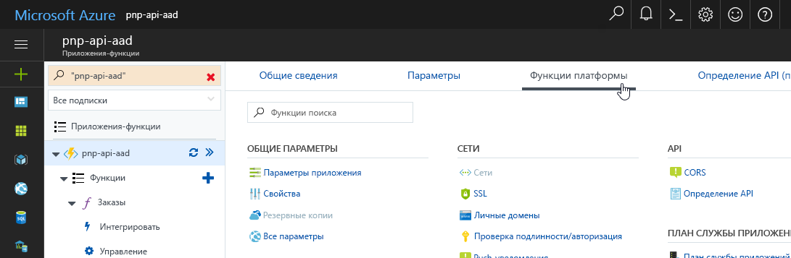
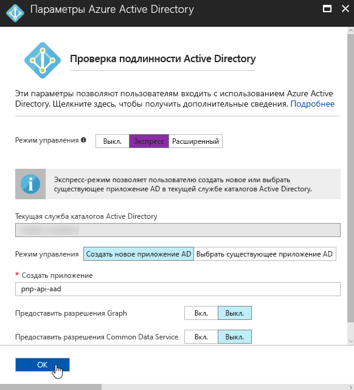
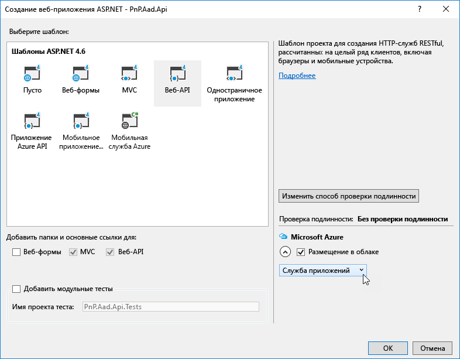
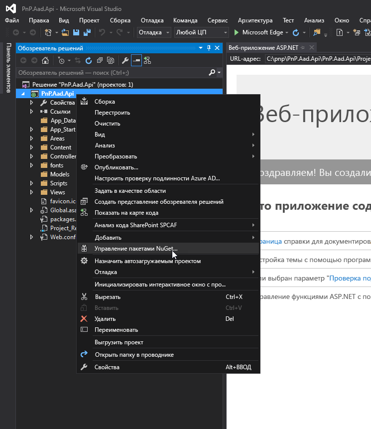
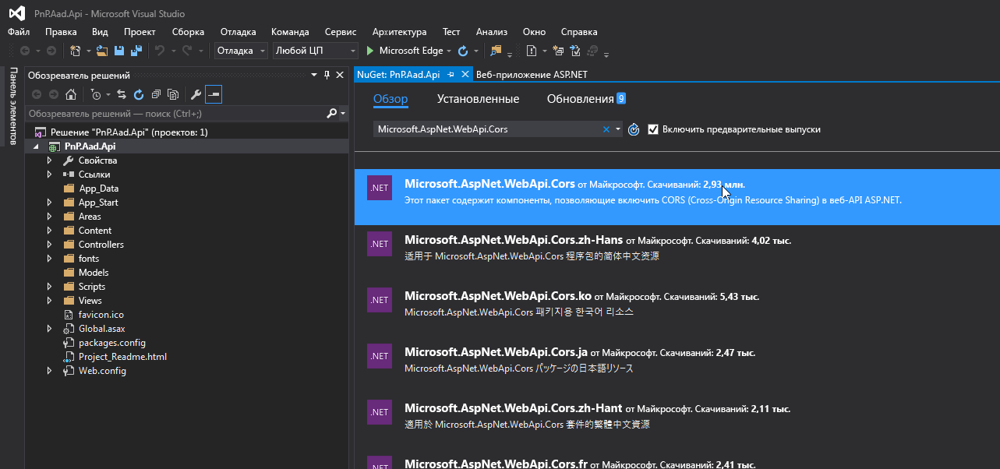
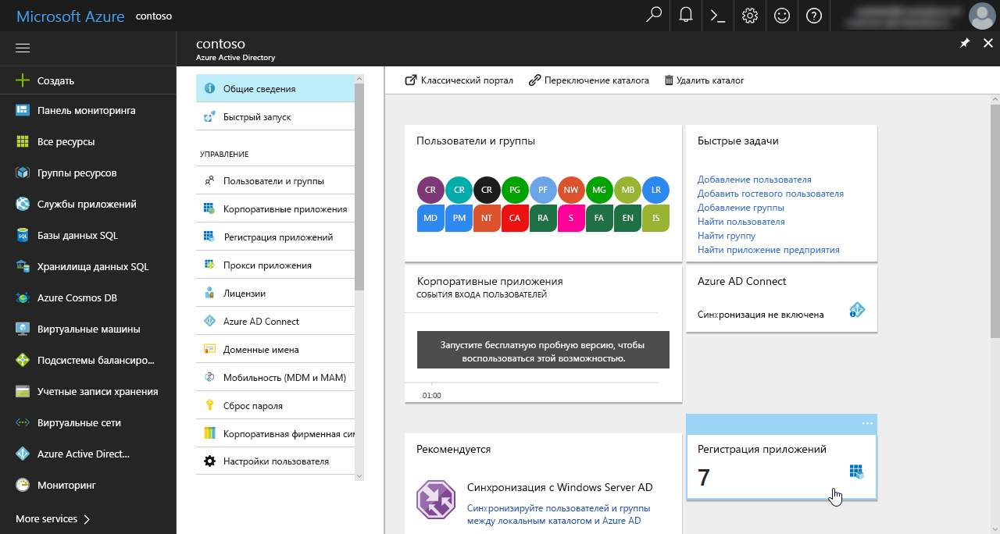

# <a name="connect-to-api-secured-with-azure-active-directory"></a>Подключение к API, защищенному с помощью Azure Active Directory

При создании решений SharePoint Framework может потребоваться подключиться к пользовательскому API, чтобы получить те или иные данные либо взаимодействовать с бизнес-приложениями. Защита пользовательских API с помощью Microsoft Azure Active Directory (Azure AD) предоставляет множество преимуществ и может быть реализована по-разному. После создания API получить доступ к нему можно несколькими способами. Они отличаются по сложности, и у каждого из них есть особенности, которые следует учитывать. 

В этой статье рассматриваются разные подходы и представлено пошаговое руководство по созданию API, защищенного с помощью Azure AD, и подключению к нему.

> [!IMPORTANT]
> При подключении к API, защищенным с помощью Azure AD, рекомендуем использовать класс **GraphHttpClient** или **AadHttpClient**. Это новые возможности, которые в настоящий момент доступны в предварительной версии. Их общедоступный выпуск запланирован на весну 2018 г. Дополнительные сведения о рекомендуемых моделях см. в статье [Использование MSGraphClient для подключения к Microsoft Graph](../../use-msgraph.md).

## <a name="secure-an-api-with-azure-ad"></a>Защита API с помощью Azure AD

Если вы используете Office 365, то вам обязательно следует рассмотреть возможность защиты пользовательских API с помощью Azure AD. Прежде всего, это позволяет защищать доступ к API с помощью имеющихся учетных данных организации, управление которыми уже осуществляется через Office 365 и Azure AD. Пользователи с активными учетными записями могут без проблем работать с приложениями, в которых используются API, защищенные при помощи Azure AD. Администраторы Azure AD могут централизованно управлять доступом к API так же, как они управляют доступом ко всем другим приложениям, зарегистрированным в Azure AD.

С точки зрения разработчика API использование Azure AD для защиты API освобождает от необходимости управлять проприетарным набором учетных данных пользователей и реализовывать специальный уровень безопасности для своего API. Кроме того, Azure AD поддерживает протокол OAuth, с помощью которого вы можете подключаться к API из приложений различных типов — от мобильных приложений до клиентских решений.

Создавая собственные API, вы можете защитить их при помощи Azure AD двумя основными способами. Если API размещается в Службе приложений Microsoft Azure, то вы можете воспользоваться вариантом с проверкой подлинности службы приложений. Если же вам нужна большая гибкость в плане размещения API (например, вы хотите разместить его в своей инфраструктуре или в контейнерах Docker), следует защитить интерфейс в коде. В таких случаях реализация зависит от языка программирования и платформы. 

В этой статье при рассмотрении данного варианта используются язык C# и платформа [Веб-API ASP.NET](https://www.asp.net/web-api).

### <a name="secure-the-api-using-azure-app-service-authentication"></a>Защита API с помощью проверки подлинности для Службы приложений Azure

При развертывании собственных API в Службе приложений Azure вы можете воспользоваться проверкой подлинности службы приложений, чтобы защитить API с помощью Azure AD. Главное преимущество проверки подлинности для службы приложений — ее простота. Следуя указаниям по настройке, представленным на портале Azure, вы можете автоматически настроить проверку подлинности с помощью мастера. Если выбрать базовую установку, мастер создаст в Azure AD новое приложение, связанное с текущей подпиской. В расширенной конфигурации вы можете выбрать, какое приложение Azure AD будет использоваться для защиты доступа к службе приложений, в которой размещается API.


Когда проверка подлинности службы приложений будет настроена, пользователям, пытающимся получить доступ к API, будет предлагаться войти с помощью своей организационной учетной записи, принадлежащей той же службе Azure AD, что и приложение Azure AD, используемое для защиты API. После входа вы сможете получить доступ к сведениям о текущем пользователе с помощью свойства `HttpContext.Current.User`. При использовании проверки подлинности для Службы приложений Azure не требуется никакой дополнительной настройки в приложении.

Функция проверки подлинности для Службы приложений Azure доступна только в Службе приложений Azure. Эта возможность значительно упрощает реализацию проверки подлинности в вашем API, но этот интерфейс сможет работать только в Службе приложений Azure. Если вам нужно разместить API у другого облачного поставщика или в контейнере Docker, то для начала необходимо реализовать уровень проверки подлинности.

### <a name="secure-the-api-using-aspnet-authentication"></a>Защита API с помощью аутентификации в ASP.NET

Если вам нужна максимальная гибкость в отношении размещения и развертывания API, то вы можете реализовать поддержку проверки подлинности Azure AD в ASP.NET. Visual Studio значительно упрощает реализацию. Когда мастер настройки проверки подлинности завершит свою работу, для использования API пользователям нужно будет входить с помощью своих организационных учетных записей.


В ходе настройки Visual Studio добавляет все необходимые ссылки и настройки в проект веб-API ASP.NET, в том числе регистрирует новое приложение Azure AD для защиты вашего API.

## <a name="access-an-api-secured-with-azure-ad-from-sharepoint-framework-solutions"></a>Доступ к API, защищенному с помощью Azure AD, из решений SharePoint Framework

Решения SharePoint Framework полностью работают на стороне клиента, поэтому не могут надежно хранить секреты, необходимые для подключения к защищенным API. Azure AD поддерживает ряд механизмов для защищенной связи с клиентскими решениями, например файлы cookie аутентификации и неявный поток OAuth.

### <a name="access-the-api-using-adal-js"></a>Доступ к API с помощью ADAL JS

Для связи с API, защищенными при помощи Azure AD, в клиентских решениях часто используют библиотеку [ADAL JS](https://github.com/AzureAD/azure-activedirectory-library-for-js). ADAL JS упрощает реализацию проверки подлинности для Azure AD в клиентских решениях, а также получение маркеров доступа для определенных ресурсов. Для приложений, созданных с помощью AngularJS, ADAL JS предоставляет перехватчик HTTP-запросов, который автоматически добавляет необходимые маркеры доступа в заголовки исходящих веб-запросов. При использовании этого перехватчика разработчикам не придется менять веб-запросы к API, защищенным при помощи Azure AD, поэтому они могут сосредоточиться на разработке приложения.

#### <a name="benefits-of-using-adal-js-to-communicate-with-apis-secured-with-azure-ad"></a>Преимущества использования ADAL JS для связи с API, защищенными при помощи Azure AD

При использовании ADAL JS у клиентских приложений есть полный доступ к идентификационным данным вошедшего пользователя. Это удобно, если требуется, к примеру, показывать имя или аватар пользователя в приложении. При создании решений, размещаемых в SharePoint, разработчики могут получать расширенные данные профиля с помощью API SharePoint, но в случае автономных приложений это невозможно.

ADAL JS не только упрощает проверку подлинности в Azure AD, но и может получать маркеры доступа к определенным ресурсам. С помощью этих маркеров доступа приложения могут безопасно получать доступ к API, защищенным с помощью Azure AD, например [Microsoft Graph](./call-microsoft-graph-from-your-web-part.md) или другим пользовательским API. Чтобы клиентское приложение могло использовать ADAL JS, необходимо зарегистрировать его как приложение в Azure AD. Во время регистрации разработчики указывают ряд параметров, например URL-адрес для размещения приложения и ресурсы, доступ к которым ему требуется (либо самостоятельно, либо от имени вошедшего пользователя).


При первом использовании приложения пользователю предлагается предоставить ему необходимые разрешения. Это часто называют потоком согласия. После утверждения приложение может запросить маркеры доступа к определенным ресурсам и безопасно взаимодействовать с ними.

#### <a name="considerations-when-using-adal-js-to-communicate-with-apis-secured-with-azure-ad"></a>Особенности использования ADAL JS для связи с API, защищенными при помощи Azure AD

Библиотека ADAL JS была разработана для использования с одностраничными приложениями. Чтобы она правильно работала при использовании с решениями SharePoint Framework, необходимо [применить исправление](./call-microsoft-graph-from-your-web-part.md).

При использовании ADAL JS и OAuth для доступа к API, защищенным с помощью Azure AD, служба Azure инициирует поток проверки подлинности. Страница входа в Azure обрабатывает все ошибки. Когда пользователь войдет с помощью своей организационной учетной записи, приложение попробует получить действительный маркер доступа. Все ошибки, возникающие на этом этапе, должен в явном виде обрабатывать разработчик приложения, так как получение маркеров доступа выполняется без участия пользователя и отображения пользовательского интерфейса.

Каждое клиентское приложение, которому требуется использовать ADAL JS, должно быть зарегистрировано как приложение Azure AD. Регистрационные данные включают URL-адрес расположения приложения. Так как приложение полностью работает на стороне клиента и не способно надежно хранить секрет, URL-адрес является частью соглашения между приложением и Azure AD для обеспечения безопасности. Это требование создает проблемы для решений SharePoint Framework, так как разработчики не могут заранее знать все URL-адреса, где будет использоваться та или иная веб-часть. Кроме того, на данный момент в Azure AD можно указывать до 10 URL-адресов ответа, что может быть недостаточно в некоторых сценариях.

Чтобы клиентское приложение могло получить маркер доступа к определенному ресурсу, ему необходимо выполнить аутентификацию пользователя и получить токен идентификатора, который затем можно обменять на маркер доступа. Несмотря на то что решения SharePoint Framework размещаются в SharePoint, где пользователи уже вошли с помощью своих организационных учетных записей, данные аутентификации для текущего пользователя недоступны решениям SharePoint Framework. Каждое решение должно в явной форме предлагать пользователю войти. Для этого можно либо перенаправлять пользователя на страницу входа в Azure, либо показывать всплывающее окно со страницей входа. Последний вариант менее навязчив в случае веб-части, которая является лишь одним из нескольких элементов на странице. Если на странице есть несколько клиентских веб-частей SharePoint Framework, то каждая из них отдельно управляет своим состоянием и требует явного входа пользователя.

Получать маркеры доступа, которые необходимы для взаимодействия с API, защищенными при помощи Azure AD, помогают скрытые объекты iframe, обрабатывающие перенаправление в конечные точки Azure AD. В Microsoft Internet Explorer есть известное ограничение: в неявном потоке OAuth не удается получать маркеры доступа, если конечные точки для входа в Azure AD и URL-адрес SharePoint Online находятся в разных зонах безопасности. Если в организации используется Internet Explorer, убедитесь, что конечная точка Azure AD и URL-адреса SharePoint Online настроены в одной и той же зоне безопасности. В целях согласованности некоторые организации передают эти параметры пользователям с помощью групповых политик.

К API, защищенным при помощи Azure AD, невозможно получать анонимный доступ. Вызывающее приложение должно предоставить действительные учетные данные. При использовании неявного потока OAuth с клиентскими приложениями это будет маркер доступа носителя, полученный при помощи ADAL JS. Если вы создали свое решение SharePoint Framework с помощью AngularJS, то ADAL JS автоматически обеспечивает наличие действительного маркера доступа для определенного ресурса и добавляет его ко всем исходящим запросам, выполняемым с помощью службы `$http` платформы AngularJS. При использовании других библиотек JavaScript необходимо получить действительный маркер доступа, при необходимости обновить его и самостоятельно добавлять к исходящим веб-запросам.

### <a name="access-the-api-by-leveraging-sharepoint-online-authentication-cookie"></a>Доступ к API с помощью файла cookie аутентификации для SharePoint Online

Вместо ADAL JS для подключения к пользовательским API, защищенным с помощью Azure AD, можно использовать файл cookie аутентификации.

#### <a name="how-it-works"></a>Как это работает

При входе в SharePoint Online с помощью организационной учетной записи в ваш браузер добавляется файл cookie аутентификации. Этот файл cookie отправляется с каждым запросом к SharePoint, позволяя работать с сайтами и документами. Чтобы использовать этот файл для подключения к пользовательскому API, защищенному при помощи Azure AD, необходимо поместить на страницу скрытый объект iframe, указывающий на URL-адрес расположения API и также защищенный с помощью Azure AD. Когда браузер попробует загрузить этот URL-адрес, он будет перенаправлен на страницу входа в Azure AD, так как анонимный доступ запрещен. Так как вы уже вошли с помощью своей организационной учетной записи для доступа к SharePoint, аутентификация выполняется автоматически, перенаправляя вас по исходному URL-адресу. На этом этапе в браузере есть файл cookie аутентификации для Azure AD, позволяющий получать доступ к пользовательскому API, защищенному при помощи Azure AD.

После размещения элемента iframe на странице к нему добавляется прослушиватель событий `onload`, который запускается после выполнения аутентификации. В этом прослушивателе устанавливается указание на то, что аутентификация выполнена и можно безопасно вызывать пользовательский API. Все веб-запросы к пользовательским API следует отложить до установки этого флага, иначе возникнет ошибка.

```typescript
// ...

export default class LatestOrdersWebPart extends BaseClientSideWebPart<ILatestOrdersWebPartProps> {
  private remotePartyLoaded: boolean = false;
  private orders: IOrder[];

  public render(): void {
    this.domElement.innerHTML = `
    <div class="${styles.latestOrders}">
      <iframe src="https://contoso.azurewebsites.net/"
          style="display:none;"></iframe>
      <div class="ms-font-xxl">Recent orders</div>
      <div class="loading"></div>
      <table class="data" style="display:none;">
        <thead>
          <tr>
            <th>ID</th>
            <th>Date</th>
            <th>Region</th>
            <th>Rep</th>
            <th>Item</th>
            <th>Units</th>
            <th>Unit cost</th>
            <th>Total</th>
          </tr>
        </thead>
        <tbody>
        </tbody>
      </table>
    </div>`;

    this.context.statusRenderer.displayLoadingIndicator(
      this.domElement.querySelector(".loading"), "orders");

    this.domElement.querySelector("iframe").addEventListener("load", (): void => {
      this.remotePartyLoaded = true;
    });

    this.executeOrDelayUntilRemotePartyLoaded((): void => {
      // retrieve and render data
    });
  }

  private executeOrDelayUntilRemotePartyLoaded(func: Function): void {
    if (this.remotePartyLoaded) {
      func();
    } else {
      setTimeout((): void => { this.executeOrDelayUntilRemotePartyLoaded(func); }, 100);
    }
  }

  // ...
}
```

При выполнении запросов AJAX в веб-частях необходимо указывать, что файл cookie аутентификации следует отправлять между доменами. Это можно сделать, задав для свойства **credentials** веб-запроса значение **include**. Если этого не сделать, запрос будет блокироваться в браузере, а вызывать API будет невозможно.

```typescript
// ...

export default class LatestOrdersWebPart extends BaseClientSideWebPart<ILatestOrdersWebPartProps> {
    // ...

    private retrieveAndRenderData(): void {
        this.context.httpClient.get("https://contoso.azurewebsites.net/api/orders",
        HttpClient.configurations.v1, {
          credentials: "include"
        })
        .then((response: HttpClientResponse): Promise<IOrder[]> => {
          // ...
        });
    }

    // ...
}
```

Для поддержки этого способа также требуется специальная настройка пользовательского API. Во-первых, необходима поддержка получения учетных данных из междоменных вызовов. Для этого следует присвоить заголовку **Access-Control-Allow-Credentials** отклика значение **true**.

> [!IMPORTANT] 
> При использовании заголовка **Access-Control-Allow-Credentials** можно указать только один источник.

Затем необходимо указать, какому источнику разрешается вызывать API. Это можно настроить в заголовке **Access-Control-Allow-Origin** отклика.

Точный способ настройки этих заголовков зависит от реализации API. Например, если вы используете функцию Azure для создания API с использованием Node.js, в объекте отклика необходимо задать следующие заголовки:

```js
context.res = {
    body: "response",
    headers: {
        "Access-Control-Allow-Credentials" : "true",
        "Access-Control-Allow-Origin" : "https://contoso.sharepoint.com"
    }
};
```

При использовании веб-API ASP.NET необходимо установить пакет NuGet **Microsoft.AspNet.WebApi.Cors**, вызвать метод `config.EnableCors()` и использовать атрибут **EnableCors** для установки значений заголовков:

```cs
[EnableCors("origins": "*", "headers": "*", "methods": "*", SupportsCredentials = true)]
public string Get() {
    return "response";
}
```

#### <a name="benefits-of-using-the-sharepoint-online-authentication-cookie-for-seamless-authentication"></a>Преимущества использования файла cookie аутентификации для SharePoint Online

Наиболее важное преимущество использования файла cookie аутентификации SharePoint Online для подключения к пользовательским API, защищенным при помощи Azure AD, — это отсутствие необходимости регистрировать приложение Azure AD для каждой веб-части. Это освобождает вас от необходимости управлять URL-адресами ответа для страниц, где используется каждая веб-часть, а также от ограничения в 10 URL-адресов ответа на приложение Azure AD.

Поток проверки подлинности легко обрабатывается без участия пользователя. Для сравнения, при использовании ADAL JS каждая веб-часть основана на отдельном приложении Azure AD и требует явного входа пользователя.

#### <a name="considerations-when-using-the-sharepoint-online-authentication-cookie-for-seamless-authentication"></a>Особенности использования файла cookie аутентификации для SharePoint Online

С точки зрения функциональности использование ADAL JS и файла cookie аутентификации SharePoint Online позволяет подключаться к API, защищенным с помощью Azure AD. Однако между этими подходами существует несколько важных отличий, которые следует учитывать.

При использовании ADAL JS, прежде чем клиентское приложение получит маркер доступа, оно извлекает токен удостоверения для текущего пользователя. Этот токен содержит сведения о текущем пользователе, полученные из Azure AD, например имя пользователя или пароль. При использовании файла cookie аутентификации токен удостоверения не применяется. Так как вы работаете с SharePoint, это фактически не является ограничением, ведь вы можете получить те же сведения о текущем пользователе из SharePoint.

С помощью ADAL JS можно подключиться к любому API, защищенному при помощи Azure AD. При использовании файла cookie аутентификации API должен явно поддерживать получение учетных данных из междоменных вызовов. При разработке API следует учитывать это требование, чтобы гарантировать, что вы сможете использовать эти API в решениях SharePoint Framework.

Используя как ADAL JS, так и файл cookie аутентификации SharePoint Online, вы можете получать доступ к API, защищенным с помощью Azure AD. Однако не все API поддерживают использование обоих способов. Например, для доступа к Microsoft Graph необходим действительный маркер доступа OAuth с определенными разрешениями Microsoft Graph. Вы можете получить этот маркер при помощи ADAL JS, но его невозможно получить с помощью файла cookie аутентификации SharePoint Online.

Если для доступа к API, защищенным при помощи Azure AD, используется файл cookie аутентификации SharePoint Online, то вместе с запросом не отправляется никаких дополнительных сведений. Это означает, что по умолчанию любой пользователь с действительной учетной записью организации в службе Azure AD, связанной с тем или иным API, может получить к нему доступ. При создании API следует позаботиться об авторизации, чтобы гарантировать, что операции с API выполняют только те пользователи, у которых имеются необходимые права.

Пользовательские API размещаются за пределами SharePoint Online, и к ним можно получать доступ с помощью междоменных веб-запросов. По умолчанию веб-браузеры не включают учетные данные при выполнении междоменных запросов AJAX. Для подключения к этим защищенным API необходимо явно включать междоменную отправку учетных данных для каждого исходящего веб-запроса.

### <a name="general-considerations"></a>Общие вопросы

Как в случае с ADAL JS, так и при использовании файла cookie аутентификации SharePoint Online для взаимодействия с Azure AD применяются объекты iframe. Это вызвано тем, что в состав потока OAuth входит перенаправление, за которым не могут автоматически следовать запросы AJAX. В Microsoft Internet Explorer используются зоны безопасности, чтобы применять политики к веб-сайтам в соответствии со связанными зонами. Чтобы скрипты могли получать доступ к данным из объекта iframe, ресурс в iframe и страница, где размещается этот объект, должны находиться в одной и той же зоне безопасности. Чтобы обеспечить правильную настройку, организации могут использовать групповые политики для равномерного распределения параметров между пользователями.

## <a name="build-an-api-secured-with-azure-ad"></a>Создание API, защищенного с помощью Azure AD

Защитить доступ к API с помощью Azure AD несложно. Для этого достаточно выполнить лишь несколько простых действий. Конкретный способ зависит от реализации API. Если используются функции Azure, вы можете настроить защиту с помощью портала Azure. Если вы создали API с помощью веб-API ASP.NET и хотите разместить его за пределами Службы приложений Azure, необходимо расширить код веб-API, добавив в него проверку подлинности. Ниже представлено пошаговое руководство по созданию и настройке API, защищенного при помощи Azure AD, с использованием функций Azure и веб-API ASP.NET.

### <a name="build-the-api-using-an-azure-function"></a>Создание API с помощью функции Azure

Создание API с помощью функций Azure предоставляет ряд преимуществ. Во-первых, значительно упрощается разработка и развертывание API. Функции Azure предоставляют широкий выбор вариантов конфигурации. Единственное, о чем следует позаботиться, — это фактический код API. Для всех остальных целей — от проверки подлинности до поддержки общего доступа к ресурсам независимо от источника (CORS) и документирования API — можно использовать портал Azure.

Функции Azure размещаются в Службе приложений Azure и используют многие возможности этой службы. Помимо защиты API с помощью функции или ключа администратора, вы можете включить защиту Службы приложений Azure и защитить свои API с помощью Azure AD или одного из других доступных поставщиков проверки подлинности. Проверку подлинности для Службы приложений можно настроить на портале Azure. Для этого не требуется менять код API.

Ниже описано, как создать защищенный с помощью Azure AD интерфейс API, который можно безопасно вызывать из междоменного источника, используя функции Azure.

#### <a name="create-a-new-azure-function"></a>Создание новой функции Azure

1. На портале Azure перейдите в группу ресурсов и добавьте приложение-функцию.

    

2. После подготовки откройте новое приложение-функцию и добавьте новую функцию, щелкнув значок "плюс" рядом с меткой "Функции".

    

3. На экране быстрого начала работы прокрутите содержимое вниз, чтобы перейти к разделу **Создайте свою собственную**, и выберите вариант **Пользовательская функция**.

    

4. В списке шаблонов выберите **HttpTrigger-JavaScript**. 

5. Укажите имя функции **Заказы** и задайте уровень авторизации **Анонимный**, так как мы будем использовать Azure AD для защиты доступа к функции Azure. Подтвердите выбор, нажав кнопку **Создать**.

    

#### <a name="implement-api-code"></a>Внедрение кода API

1. Замените код функции на следующий фрагмент:

    ```js
    module.exports = function (context, req) {
        context.res = {
            body: [
                {
                id: 1,
                orderDate: new Date(2016, 0, 6),
                region: "east",
                rep: "Jones",
                item: "Pencil",
                units: 95,
                unitCost: 1.99,
                total: 189.05
                },
                {
                id: 2,
                orderDate: new Date(2016, 0, 23),
                region: "central",
                rep: "Kivell",
                item: "Binder",
                units: 50,
                unitCost: 19.99,
                total: 999.50
                },
                {
                id: 3,
                orderDate: new Date(2016, 1, 9),
                region: "central",
                rep: "Jardine",
                item: "Pencil",
                units: 36,
                unitCost: 4.99,
                total: 179.64
                },
                {
                id: 4,
                orderDate: new Date(2016, 1, 26),
                region: "central",
                rep: "Gill",
                item: "Pen",
                units: 27,
                unitCost: 19.99,
                total: 539.73
                },
                {
                id: 5,
                orderDate: new Date(2016, 2, 15),
                region: "west",
                rep: "Sorvino",
                item: "Pencil",
                units: 56,
                unitCost: 2.99,
                total: 167.44
                }],
            headers: {
                "Access-Control-Allow-Credentials" : "true",
                "Access-Control-Allow-Origin" : "https://contoso.sharepoint.com"
            }
        };
        context.done();
    };
    ```

2. Измените URL-адрес, указанный в заголовке **Access-Control-Allow-Origin**, в соответствии с URL-адресом клиента SharePoint Online, который будет вызывать этот API.

3. Сохраните изменения в коде функции, нажав кнопку **Сохранить**.

    

#### <a name="change-cors-settings"></a>Изменение настроек CORS

Функции Azure размещаются в Службе приложений Azure, что позволяет настраивать параметры общего доступа к ресурсам независимо от источника (CORS) с помощью портала Azure. Это удобно, если параметры настраиваются на портале, но эту функцию невозможно использовать в сочетании с заголовком **Access-Control-Allow-Credentials**, который необходим интерфейсу API, чтобы принимать файлы cookie аутентификации из другого источника. Чтобы проверка подлинности на стороне клиента работала надлежащим образом, необходимо очистить параметры CORS в Службе приложений Azure.

1. В приложении-функции выберите функцию Azure и перейдите к колонке **Функции платформы**.

    

2. В разделе **API** выберите параметр **CORS**.

    

3. Удалите все записи в колонке **Параметры CORS**, чтобы очистить конфигурацию CORS.

    

4. Подтвердите удаление, нажав кнопку **Сохранить**.

    

#### <a name="enable-app-service-authentication"></a>Включение проверки подлинности для службы приложений

1. В параметрах приложения-функции вернитесь к колонке **Функции платформы**. 

2. В разделе **Сеть** выберите параметр **Аутентификация / авторизация**.

    

3. Включите аутентификацию службы приложений, установив переключатель **Проверка подлинности службы приложений** в положение **Вкл**.

    

4. Чтобы запретить анонимный доступ к API и принудительно выполнять аутентификацию с помощью Azure AD, выберите в списке **Предпринимаемое действие, если проверка подлинности для запроса не выполнена** значение **Войти с использованием Azure Active Directory**.

    

5. В списке поставщиков проверки подлинности выберите **Azure Active Directory**, чтобы настроить эту службу.

    

6. В колонке **Аутентификация Active Directory** выберите для параметра **Режим управления** значение **Экспресс** и создайте приложение Azure AD.

    > [!IMPORTANT] 
    > При использовании режима настройки "Экспресс" портал Azure создает приложение Azure AD в том же каталоге, где находится приложение-функция. Если приложение-функция размещается в другой подписке Azure с другим каталогом, то следует использовать расширенный режим, а также указать ИД каталога и приложение, которое следует использовать для защиты доступа к API.
    >
    > При использовании имеющихся приложений Azure AD настраивайте приложение так, чтобы оно принимало учетные данные только от одного клиента. Если настроить решение как мультитенантное приложение, то любой пользователь с действительной организационной или личной учетной записью сможет подключиться к API.
    >
    > Защита доступа к API с помощью приложения Azure AD распространяется только на проверку подлинности. При создании API также следует авторизовать запросы в коде API, чтобы только те пользователи, у которых достаточно прав, могли использовать API.

7. Так как приложение предназначено только для защиты доступа к функции Azure, оно не требует дополнительных разрешений. Подтвердите выбор, нажав кнопку **ОК**.

    

8. Когда колонка **Azure Active Directory** закроется, нажмите кнопку **Сохранить** в колонке **Аутентификация / авторизация**, чтобы подтвердить все изменения настроек аутентификации.

    

9. При попытке перейти по URL-адресу API в новом окне в режиме конфиденциальности вам будет предложено войти с помощью учетной записи Azure AD.

    

На данном этапе API можно безопасно вызывать из клиентской веб-части SharePoint Framework, используя файл cookie аутентификации.

### <a name="build-the-api-by-using-aspnet-web-api"></a>Создание API с помощью веб-API ASP.NET

Еще один способ реализации API — использование веб-API ASP.NET. По сравнению с функциями Azure, создавать API с помощью веб-API ASP.NET намного сложнее. Вам потребуется не только настроить полноценный проект, но и учитывать, где будет развертываться API. С другой стороны, веб-API ASP.NET обеспечивает большую гибкость и позволяет развертывать API на различных платформах, таких как Служба приложений Azure и контейнеры Docker, у других облачных поставщиков и даже в собственной инфраструктуре.

Ниже описано, как создать API с помощью веб-API ASP.NET, развернуть его в Службе приложений Azure и защитить его с помощью аутентификации для Службы приложений Azure. Затем мы расширим API, чтобы он выполнял проверку подлинности самостоятельно и его также можно было развертывать на других платформах.

#### <a name="create-a-new-aspnet-web-api-project"></a>Создание проекта веб-API ASP.NET

1. В Visual Studio выберите в меню **Файл** команду **Создать / Проект**. 

2.  В диалоговом окне **Новый проект** выберите веб-шаблоны Visual C# и в списке доступных шаблонов выберите **Веб-приложение ASP.NET**.

    

3. Выберите **Веб-API** как тип проекта веб-приложения ASP.NET.

    

4. Так как для защиты доступа к API вы будете использовать проверку подлинности для Службы приложений Azure, нажмите кнопку **Изменить способ проверки подлинности** и выберите параметр **Нет проверки подлинности**.

    

5. Подтвердите выбор, нажав кнопку **ОК**.

6. С помощью Visual Studio можно легко развернуть веб-API в Службе приложений Azure. Чтобы воспользоваться этой возможностью, откройте диалоговое окно **Новое веб-приложение ASP.NET** и в разделе **Microsoft Azure** установите флажок **Разместить в облаке**, а затем выберите в списке пункт **Служба приложений**.

    

7. В диалоговом окне **Создание службы приложений** укажите имя создаваемого веб-приложения и выберите свою **подписку** Azure, **группу ресурсов** и **план обслуживания приложений**, которые необходимо использовать для этого приложения.

    

8. Подтвердите выбор, нажав кнопку **Создать**. Visual Studio создаст веб-приложение Azure для размещения вашего веб-приложения.

#### <a name="add-support-for-cors"></a>Добавление поддержки CORS

По умолчанию API, созданные на основе шаблона "Веб-приложение ASP.NET", не поддерживают CORS, и их не могут вызывать клиентские приложения, размещенные на разных доменах. 

1. Чтобы добавить поддержку CORS в веб-API, щелкните проект правой кнопкой мыши и выберите в контекстном меню пункт **Управление пакетами NuGet**.

    

2. На вкладке **Управление пакетами NuGet** найдите пакет **Microsoft.AspNet.WebApi.Cors** и установите его в проекте.

    


#### <a name="add-data-model"></a>Добавление модели данных

Определите в проекте модель, которая представляет данные, возвращаемые интерфейсом API. В папке **Модели** добавьте новый класс и назовите его **Order**. Вставьте в новый файл следующий код:

```cs
    using Newtonsoft.Json;
    using Newtonsoft.Json.Converters;
    using System;

    namespace PnP.Aad.Api.Models {
        public class Order {
            [JsonProperty(PropertyName = "id")]
            public int Id { get; set; }
            [JsonProperty(PropertyName = "orderDate")]
            public DateTime OrderDate { get; set; }
            [JsonConverter(typeof(StringEnumConverter))]
            [JsonProperty(PropertyName = "region")]
            public Region Region { get; set; }
            [JsonProperty(PropertyName = "rep")]
            public string Rep { get; set; }
            [JsonProperty(PropertyName = "item")]
            public string Item { get; set; }
            [JsonProperty(PropertyName = "units")]
            public uint Units { get; set; }
            [JsonProperty(PropertyName = "unitCost")]
            public double UnitCost { get; set; }
            [JsonProperty(PropertyName = "total")]
            public double Total { get; set; }
        }

        public enum Region {
            East,
            Central,
            West
        }
    }
```

#### <a name="add-orders-api"></a>Добавление API заказов

Добавьте API, который возвращает сведения о последних заказах. В папке **Контроллеры** создайте новый класс и назовите его **OrdersController**. Вставьте в новый файл следующий код:

```cs
using PnP.Aad.Api.Models;
using System;
using System.Collections.Generic;
using System.Web.Http;

namespace PnP.Aad.Api.Controllers {
    public class OrdersController : ApiController {
        private List<Order> orders = new List<Order> {
            new Order {
                Id = 1,
                OrderDate = new DateTime(2016, 1, 6),
                Region = Region.East,
                Rep = "Jones",
                Item = "Pencil",
                Units = 95,
                UnitCost = 1.99,
                Total = 189.05
            },
            new Order {
                Id = 2,
                OrderDate = new DateTime(2016, 1, 23),
                Region = Region.Central,
                Rep = "Kivell",
                Item = "Binder",
                Units = 50,
                UnitCost = 19.99,
                Total = 999.50
            },
            new Order {
                Id = 3,
                OrderDate = new DateTime(2016, 2, 9),
                Region = Region.Central,
                Rep = "Jardine",
                Item = "Pencil",
                Units = 36,
                UnitCost = 4.99,
                Total = 179.64
            },
            new Order {
                Id = 4,
                OrderDate = new DateTime(2016, 2, 26),
                Region = Region.Central,
                Rep = "Gill",
                Item = "Pen",
                Units = 27,
                UnitCost = 19.99,
                Total = 539.73
            },
            new Order {
                Id = 5,
                OrderDate = new DateTime(2016, 3, 15),
                Region = Region.West,
                Rep = "Sorvino",
                Item = "Pencil",
                Units = 56,
                UnitCost = 2.99,
                Total = 167.44
            }
        };

        public IEnumerable<Order> Get() {
            return orders;
        }
    }
}
```

#### <a name="extend-the-api-with-support-for-cors"></a>Добавление поддержки CORS в API

Несмотря на то что мы установили поддержку CORS в проекте, пока что она не используется. При попытке вызвать новый API заказов из клиентского приложения, размещенного на другом домене, возникнет ошибка CORS и запрос не будет выполнен. 

1. Чтобы API поддерживал CORS, необходимо добавить к нему атрибут **EnableCors**.

    ```cs
    using PnP.Aad.Api.Models;
    using System;
    using System.Collections.Generic;
    using System.Web.Http;
    using System.Web.Http.Cors;

    namespace PnP.Aad.Api.Controllers {
        public class OrdersController : ApiController {
            private List<Order> orders = new List<Order> {
                // ...
            };

            [EnableCors("*", "*", "GET", SupportsCredentials = true)]
            public IEnumerable<Order> Get() {
                return orders;
            }
        }
    }
    ```

2. Откройте файл **.\App_Start\WebApiConfig.cs** и вставьте следующий код:

    ```cs
    using System.Web.Http;

    namespace PnP.Aad.Api {
        public static class WebApiConfig {
            public static void Register(HttpConfiguration config) {
                // Web API configuration and services

                // Web API routes
                config.MapHttpAttributeRoutes();

                config.EnableCors();

                config.Routes.MapHttpRoute(
                    name: "DefaultApi",
                    routeTemplate: "api/{controller}/{id}",
                    defaults: new { id = RouteParameter.Optional }
                );
            }
        }
    }
    ```

На данном этапе код API готов, и его можно публиковать в веб-приложении Azure.

#### <a name="publish-the-api-to-azure-web-app"></a>Публикация API в веб-приложении Azure

1. В Visual Studio щелкните проект правой кнопкой мыши и в контекстном меню выберите пункт **Опубликовать**.

    

2. В диалоговом окне **Публикация** проверьте все сведения и нажмите кнопку **Опубликовать**, чтобы начать процесс публикации.

    

3. По завершении публикации перейдите в веб-браузере по URL-адресу API, например `http://pnp-aad-api.azurewebsites.net/api/orders`. На этом этапе API не защищен, и к нему могут получать доступ анонимные пользователи.

    

#### <a name="secure-the-api-using-azure-app-service"></a>Защита API с помощью Службы приложений Azure

1. Чтобы защитить API с помощью Azure AD, перейдите на портал Azure и откройте веб-приложение, в котором размещается ваш API. 

2. В разделе **Параметры** выберите параметр **Аутентификация / авторизация**.

    

3. Чтобы включить проверку подлинности для веб-приложения, установите переключатель **Проверка подлинности службы приложений** в положение **Вкл**.

    

4. Чтобы запретить анонимный доступ к API, в списке **Предпринимаемое действие, если проверка подлинности для запроса не выполнена** выберите пункт **Войти с использованием Azure Active Directory**.

    

5. Настройте проверку подлинности на основе Azure Active Directory, выбрав **Azure Active Directory** из списка поставщиков аутентификации.

    

6. В колонке **Аутентификация Active Directory** выберите для параметра **Режим управления** значение **Экспресс** и создайте приложение Azure AD.

    > [!IMPORTANT] 
    > При использовании режима настройки "Экспресс" портал Azure создает приложение Azure AD в том же каталоге, где находится приложение-функция. Если приложение-функция размещается в другой подписке Azure с другим каталогом, то следует использовать расширенный режим, а также указать ИД каталога и приложение, которое следует использовать для защиты доступа к API.
    >
    > При использовании имеющихся приложений Azure AD настраивайте приложение так, чтобы оно принимало учетные данные только от одного клиента. Если настроить решение как мультитенантное приложение, то любой пользователь с действительной организационной или личной учетной записью сможет подключиться к API.
    >
    > Защита доступа к API с помощью приложения Azure AD распространяется только на проверку подлинности. При создании API также следует авторизовать запросы в коде API, чтобы только те пользователи, у которых достаточно прав, могли использовать API.

7. Так как приложение предназначено только для защиты доступа к функции Azure, оно не требует дополнительных разрешений. Подтвердите выбор, нажав кнопку **ОК**.

    

8. Когда колонка **Azure Active Directory** закроется, нажмите кнопку **Сохранить** в колонке **Аутентификация / авторизация**, чтобы подтвердить все изменения настроек аутентификации.

    

9. При попытке перейти по URL-адресу API в новом окне в режиме конфиденциальности вам будет предложено войти с помощью учетной записи Azure AD.

    

На данном этапе API можно безопасно вызывать из клиентской веб-части SharePoint Framework, используя файл cookie аутентификации.

#### <a name="secure-the-api-using-openid"></a>Защита API с помощью OpenID

Если вам нужно развернуть проект веб-API ASP.NET за пределами Службы приложений Azure и защитить его с помощью Azure AD, то не следует рассчитывать на проверку подлинности для службы приложений. Вместо этого необходимо расширить веб-приложение, чтобы пользователям требовалось проходить проверку подлинности для использования API.

##### <a name="disable-anonymous-access-to-all-resources"></a>Запрет анонимного доступа ко всем ресурсам

1. Если вы хотите защитить все ресурсы, откройте файл **.\App_Start\FilterConfig.cs** и вставьте следующий код:

    ```cs
    using System.Web.Mvc;

    namespace PnP.Aad.Api {
        public class FilterConfig {
            public static void RegisterGlobalFilters(GlobalFilterCollection filters) {
                filters.Add(new HandleErrorAttribute());
                filters.Add(new AuthorizeAttribute());
            }
        }
    }
    ```

2. Чтобы сделать аутентификацию обязательной для всех API, откройте файл **.\App_Start\WebApiConfig.cs** и вставьте следующий код:

    ```cs
    using System.Web.Http;

    namespace PnP.Aad.Api {
        public static class WebApiConfig {
            public static void Register(HttpConfiguration config) {
                // Web API configuration and services

                // Web API routes
                config.MapHttpAttributeRoutes();

                config.EnableCors();
                config.Filters.Add(new AuthorizeAttribute());

                config.Routes.MapHttpRoute(
                    name: "DefaultApi",
                    routeTemplate: "api/{controller}/{id}",
                    defaults: new { id = RouteParameter.Optional }
                );
            }
        }
    }
    ```

3. При попытке получить доступ к API или другому ресурсу в своем веб-приложении вы получите отклик 401 (ошибка авторизации).

    

На этом этапе веб-приложению требуется аутентификация всех запросов к его ресурсам, но оно не запускает поток входа в Azure AD. 

В следующем разделе описывается, как расширить веб-приложение, чтобы оно перенаправляло пользователей на страницу входа в Azure AD, если ранее они не прошли проверку подлинности.

##### <a name="register-azure-ad-application"></a>Регистрация приложения Azure AD

Чтобы защитить API при помощи Azure AD, необходимо зарегистрировать приложение Azure AD. Затем мы добавим ссылку на него в проект веб-приложения, и ПО промежуточного слоя OWIN будет использовать его, чтобы защитить доступ к API с помощью Azure AD.

1. Если у вас еще нет приложения Azure AD, вы можете создать его на портале Azure, перейдя к колонке **Azure Active Directory**.

    > [!IMPORTANT] 
    > Приложение Azure AD, используемое для защиты API, необходимо создать в той же службе Azure Active Directory, которая используется в организации для доступа к Office 365.

    

2. В колонке **Azure Active Directory** перейдите к разделу **Регистрация приложений**.

    

3. В колонке **Регистрация приложений** нажмите кнопку **Регистрация нового приложения**, чтобы зарегистрировать новое приложение Azure AD.

    

4. В колонке **Создание** введите сведения о приложении и нажмите кнопку **Создать**.

    

5. После успешной регистрации приложения выберите его в списке, чтобы просмотреть сведения.

    

6. Скопируйте **идентификатор приложения** и сохраните его, так как он понадобится вам при настройке аутентификации Azure AD для веб-приложения.

##### <a name="redirect-anonymous-requests-to-azure-ad-sign-in-page"></a>Перенаправление анонимных запросов на страницу входа в Azure AD

1. В Visual Studio щелкните проект правой кнопкой мыши и в контекстном меню выберите пункт **Управление пакетами NuGet**. 

2. В окне **Управление пакетами NuGet** добавьте к проекту следующие пакеты:

    - Microsoft.Owin.Host.SystemWeb
    - Microsoft.Owin.Security.Cookies
    - Microsoft.Owin.Security.OpenIdConnect

3. В корневом каталоге проекта добавьте новый класс **Startup** и вставьте следующий код:

    ```cs
    using Owin;

    namespace PnP.Aad.Api {
        public partial class Startup
        {
            public void Configuration(IAppBuilder app)
            {
                ConfigureAuth(app);
            }
        }
    }
    ```

4. В папке **App_Start** создайте класс **Startup.Auth** и вставьте следующий код:

    ```cs
    using Microsoft.Owin.Security;
    using Microsoft.Owin.Security.Cookies;
    using Microsoft.Owin.Security.OpenIdConnect;
    using Owin;
    using System.Configuration;

    namespace PnP.Aad.Api {
        public partial class Startup {
            // For more information on configuring authentication, please visit http://go.microsoft.com/fwlink/?LinkId=301864
            public void ConfigureAuth(IAppBuilder app) {
                app.SetDefaultSignInAsAuthenticationType(CookieAuthenticationDefaults.AuthenticationType);

                app.UseCookieAuthentication(new CookieAuthenticationOptions());

                app.UseOpenIdConnectAuthentication(
                    new OpenIdConnectAuthenticationOptions {
                        ClientId = ConfigurationManager.AppSettings["ida:ClientId"],
                        Authority = $"https://login.microsoftonline.com/{(ConfigurationManager.AppSettings["ida:Tenant"])}",
                        PostLogoutRedirectUri = ConfigurationManager.AppSettings["ida:PostLogoutRedirectUri"],
                    });
            }
        }
    }
    ```

5. В Visual Studio откройте файл **Web.config** и в разделе **appSettings** добавьте следующие элементы:

    ```xml
    <add key="ida:Tenant" value="contoso.onmicrosoft.com" />
    <add key="ida:ClientId" value="eeb40f1f-c5fa-4096-896b-71c77d459e21" />
    <add key="ida:PostLogoutRedirectUri" value="https://localhost:44320/" />
    ```

    - Значение ключа **ida:Tenant** — это имя службы Azure AD, в которой определено приложение Azure AD, используемое для защиты API. 
    - Ключ **ida:ClientId** задает ИД приложения Azure AD, используемого для защиты API. 
    - URL-адрес, указанный в свойстве **ida:PostLogoutRedirectUri**, используется службой Azure AD для перенаправления после выхода из приложения. В данном случае эта возможность не используется.

На этом настройка окончена. Если запустить веб-приложение, для доступа к каким-либо его ресурсам потребуется войти с помощью учетной записи Azure AD. Чтобы убедиться, что только авторизованные пользователи используют определенный API, следует реализовать авторизацию в своих API. Для этого можно получить имя пользователя из свойства `RequestContext.Principal.Identity` и сверить его с матрицей безопасности.

## <a name="see-also"></a>См. также

- [Вызов пользовательских API, защищенных с помощью Azure Active Directory, без ADAL JS (пример кода)](https://github.com/SharePoint/sp-dev-fx-webparts/tree/master/samples/aad-api-spo-cookie)
