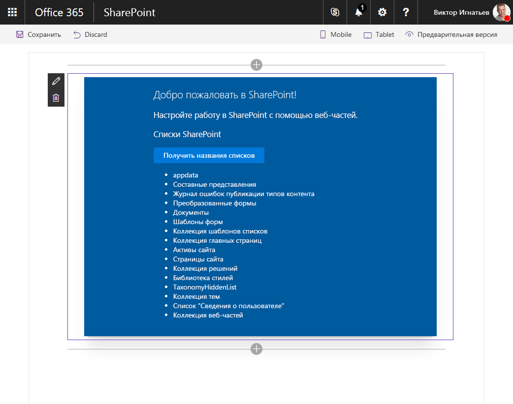

# <a name="connect-to-sharepoint-using-the-javascript-object-model-jsom"></a><span data-ttu-id="4855b-103">Подключение к SharePoint с помощью объектной модели JavaScript (JSOM)</span><span class="sxs-lookup"><span data-stu-id="4855b-103">Connect to SharePoint using the JavaScript Object Model (JSOM)</span></span>

<span data-ttu-id="4855b-104">В прошлом при создании модификаций для SharePoint вы могли использовать объектную модель JavaScript (JSOM) для связи с SharePoint.</span><span class="sxs-lookup"><span data-stu-id="4855b-104">In the past, when building SharePoint customizations, you might have used the SharePoint JavaScript Object Model (JSOM) to communicate with SharePoint. This article illustrates how to use SharePoint JSOM when building solutions on the SharePoint Framework.</span></span> <span data-ttu-id="4855b-105">В настоящее время рекомендуется использовать перенос кода или другие методы (см. раздел [Замечания](#considerations) далее в этой статье).</span><span class="sxs-lookup"><span data-stu-id="4855b-105">This is no longer the recommended path (see [Considerations](#considerations) later in this article), but there are still valid use cases such as code migration.</span></span> 

<span data-ttu-id="4855b-106">Чтобы использовать модель JSOM в компоненте SharePoint Framework, на нее необходимо ссылаться.</span><span class="sxs-lookup"><span data-stu-id="4855b-106">To use SharePoint JSOM in your SharePoint Framework component, you must first reference it.</span></span> <span data-ttu-id="4855b-107">Раньше можно было использовать модель JSOM, доступную на странице.</span><span class="sxs-lookup"><span data-stu-id="4855b-107">In the past it was already available on the page for you to use.</span></span> <span data-ttu-id="4855b-108">В SharePoint Framework ее необходимо загружать.</span><span class="sxs-lookup"><span data-stu-id="4855b-108">In the SharePoint Framework, it has to be explicitly loaded.</span></span>

<span data-ttu-id="4855b-109">Сослаться на модель JSOM в SharePoint Framework можно двумя способами:</span><span class="sxs-lookup"><span data-stu-id="4855b-109">There are two ways to reference SharePoint JSOM in the SharePoint Framework:</span></span> 
- <span data-ttu-id="4855b-110">**декларативно** — через конфигурацию;</span><span class="sxs-lookup"><span data-stu-id="4855b-110">**Declarative** - through configuration</span></span>
- <span data-ttu-id="4855b-111">**принудительно** — через код.</span><span class="sxs-lookup"><span data-stu-id="4855b-111">**Imperative** - through code</span></span>

<span data-ttu-id="4855b-112">У каждого из этих подходов есть свои преимущества и недостатки, каждый из которых важно понимать.</span><span class="sxs-lookup"><span data-stu-id="4855b-112">Each of these approaches have advantages and disadvantages and it's important for you to understand each of them.</span></span>

> [!NOTE] 
> <span data-ttu-id="4855b-113">Прежде чем выполнять действия, описанные в этой статье, [настройте среду разработки SharePoint Framework](../../set-up-your-development-environment.md).</span><span class="sxs-lookup"><span data-stu-id="4855b-113">Before following the steps in this article, be sure to [set up your SharePoint Framework development environment](../../set-up-your-development-environment.md).</span></span>

## <a name="create-a-new-project"></a><span data-ttu-id="4855b-114">Создание проекта</span><span class="sxs-lookup"><span data-stu-id="4855b-114">Create a new project</span></span>

1. <span data-ttu-id="4855b-115">С помощью консоли создайте папку для проекта:</span><span class="sxs-lookup"><span data-stu-id="4855b-115">From the console, create a new folder for your project:</span></span>

  ```sh
  md react-sharepointlists
  ```

2. <span data-ttu-id="4855b-116">Перейдите в папку проекта:</span><span class="sxs-lookup"><span data-stu-id="4855b-116">Go to the project folder:</span></span>

  ```sh
  cd react-sharepointlists
  ```

3. <span data-ttu-id="4855b-117">В папке проекта запустите генератор Yeoman для SharePoint Framework, чтобы сформировать шаблон проекта на платформе SharePoint Framework:</span><span class="sxs-lookup"><span data-stu-id="4855b-117">In the project folder, run the SharePoint Framework Yeoman generator to scaffold a new SharePoint Framework project:</span></span>

  ```sh
  yo @microsoft/sharepoint
  ```

4. <span data-ttu-id="4855b-118">Когда появится соответствующий запрос, укажите следующие значения:</span><span class="sxs-lookup"><span data-stu-id="4855b-118">When prompted, enter the following values:</span></span>

  - <span data-ttu-id="4855b-119">**react-sharepointlists** в качестве имени решения;</span><span class="sxs-lookup"><span data-stu-id="4855b-119">**react-sharepointlists** as your solution name.</span></span>
  - <span data-ttu-id="4855b-120">**Webpart** в качестве типа создаваемого клиентского компонента;</span><span class="sxs-lookup"><span data-stu-id="4855b-120">Choose **Webpart** as the client-side component type to be created.</span></span>
  - <span data-ttu-id="4855b-121">**Use the current folder** (Использовать текущую папку) в качестве расположения файлов;</span><span class="sxs-lookup"><span data-stu-id="4855b-121">**Use the current folder** for the location to place the files.</span></span>
  - <span data-ttu-id="4855b-122">**React** в качестве начальной платформы для создания веб-части;</span><span class="sxs-lookup"><span data-stu-id="4855b-122">**React** as the starting framework to build the web part.</span></span>
  - <span data-ttu-id="4855b-123">**SharePoint lists** (Списки SharePoint) в качестве имени веб-части;</span><span class="sxs-lookup"><span data-stu-id="4855b-123">**SharePoint lists** as your web part name.</span></span>
  - <span data-ttu-id="4855b-124">**Shows names of lists in the current site** (Показывает имена списков на текущем сайте) в качестве описания веб-части.</span><span class="sxs-lookup"><span data-stu-id="4855b-124">**Shows names of lists in the current site** as your web part description.</span></span>

  

5. <span data-ttu-id="4855b-126">После завершения скаффолдинга заблокируйте версию зависимостей проекта, выполнив следующую команду:</span><span class="sxs-lookup"><span data-stu-id="4855b-126">After the scaffolding completes, lock down the version of the project dependencies by running the following command:</span></span>

  ```sh
  npm shrinkwrap
  ```

6. <span data-ttu-id="4855b-127">Откройте папку проекта в редакторе кода.</span><span class="sxs-lookup"><span data-stu-id="4855b-127">Next, open your project folder in your code editor.</span></span> <span data-ttu-id="4855b-128">В инструкциях и на снимках экрана в этой статье упоминается Visual Studio Code, но вы можете использовать любой редактор.</span><span class="sxs-lookup"><span data-stu-id="4855b-128">This article uses Visual Studio Code in the steps and screenshots, but you can use any editor you prefer.</span></span>

  

7. <span data-ttu-id="4855b-130">Чтобы открыть каталог в Visual Studio Code, введите в консоли следующую команду:</span><span class="sxs-lookup"><span data-stu-id="4855b-130">To open the directory in Visual Studio Code, from the console type:</span></span>

  ```sh
  code .
  ```


## <a name="reference-jsom-declaratively"></a><span data-ttu-id="4855b-131">Добавление декларативных ссылок на JSOM</span><span class="sxs-lookup"><span data-stu-id="4855b-131">Reference JSOM declaratively</span></span>

### <a name="register-the-sharepoint-jsom-api-as-external-scripts"></a><span data-ttu-id="4855b-132">Регистрация API JSOM SharePoint в качестве внешних скриптов</span><span class="sxs-lookup"><span data-stu-id="4855b-132">Register SharePoint JSOM API as external scripts</span></span>

<span data-ttu-id="4855b-133">Ссылаясь на JSOM декларативно, сначала необходимо зарегистрировать API JSOM SharePoint в качестве внешних скриптов в проекте SharePoint Framework.</span><span class="sxs-lookup"><span data-stu-id="4855b-133">When referencing JSOM declaratively, the first step is to register the SharePoint JSOM API as external scripts within your SharePoint Framework project. In your code editor, open the ./config/config.json file and add the following to the externals section:</span></span>

1. <span data-ttu-id="4855b-134">Откройте в редакторе кода файл **./config/config.json** и добавьте следующий код в раздел **externals**:</span><span class="sxs-lookup"><span data-stu-id="4855b-134">When referencing JSOM declaratively, the first step is to register the SharePoint JSOM API as external scripts within your SharePoint Framework project. In your code editor, open the **./config/config.json** file and add the following to the **externals** section:</span></span>

  ```json
  {
    // ...
    "externals": {
      "sp-init": {
        "path": "https://contoso.sharepoint.com/_layouts/15/init.js",
        "globalName": "$_global_init"
      },
      "microsoft-ajax": {
        "path": "https://contoso.sharepoint.com/_layouts/15/MicrosoftAjax.js",
        "globalName": "Sys",
        "globalDependencies": [
          "sp-init"
        ]
      },
      "sp-runtime": {
        "path": "https://contoso.sharepoint.com/_layouts/15/SP.Runtime.js",
        "globalName": "SP",
        "globalDependencies": [
          "microsoft-ajax"
        ]
      },
      "sharepoint": {
        "path": "https://contoso.sharepoint.com/_layouts/15/SP.js",
        "globalName": "SP",
        "globalDependencies": [
          "sp-runtime"
        ]
      }
    }
    // ...
  }
  ```

  <br/>

  <span data-ttu-id="4855b-135">Каждая запись указывает на один из скриптов, которые вместе позволяют использовать JSOM SharePoint в компоненте SPFx.</span><span class="sxs-lookup"><span data-stu-id="4855b-135">Each of the entries points to different script files that together allow you to use SharePoint JSOM in your SPFx component.</span></span> <span data-ttu-id="4855b-136">Эти скрипты не распространяются как модули.</span><span class="sxs-lookup"><span data-stu-id="4855b-136">All of these scripts are distributed as non-module scripts.</span></span> <span data-ttu-id="4855b-137">Поэтому для каждой записи о регистрации необходимо указать URL-адрес (свойство `path`) и имя (свойство `globalName`), используемые скриптом.</span><span class="sxs-lookup"><span data-stu-id="4855b-137">This is why each registration entry requires a URL, (specified using the `path` property) and the name used by the script (provided in the `globalName` property).</span></span> <span data-ttu-id="4855b-138">Чтобы эти скрипты загружались в правильном порядке, зависимости между ними необходимо указать с помощью свойства `globalDependencies`.</span><span class="sxs-lookup"><span data-stu-id="4855b-138">To ensure that these scripts load in the right order, the dependencies between these scripts are specified by using the `globalDependencies` property.</span></span>

  <span data-ttu-id="4855b-139">В зависимости от того, какие функции JSOM используются, могут потребоваться дополнительные скрипты (например, sp.taxonomy.js).</span><span class="sxs-lookup"><span data-stu-id="4855b-139">Additional scripts may need to be added depending on the JSOM functionality you are using (e.g. sp.taxonomy.js).</span></span>

### <a name="install-typescript-typings-for-sharepoint-jsom"></a><span data-ttu-id="4855b-140">Установка определений типов TypeScript для JSOM SharePoint</span><span class="sxs-lookup"><span data-stu-id="4855b-140">Install TypeScript typings for SharePoint JSOM</span></span>

<span data-ttu-id="4855b-141">Следующий шаг — установка и настройка определений типов TypeScript для JSOM SharePoint. Это позволяет пользоваться функциями, обеспечивающими безопасность типов TypeScript при работе с JSOM SharePoint.</span><span class="sxs-lookup"><span data-stu-id="4855b-141">The next step is to install and configure TypeScript typings for SharePoint JSOM. This allows you to benefit from TypeScript's type safety features when working with SharePoint JSOM.</span></span>

1. <span data-ttu-id="4855b-142">С помощью консоли выполните в каталоге проекта следующую команду:</span><span class="sxs-lookup"><span data-stu-id="4855b-142">From the console, execute the following command within your project directory:</span></span>

  ```sh
  npm install @types/microsoft-ajax @types/sharepoint --save-dev
  ```

  <span data-ttu-id="4855b-143">Модель JSOM SharePoint не распространяется как модуль, поэтому ее нельзя импортировать в код напрямую.</span><span class="sxs-lookup"><span data-stu-id="4855b-143">SharePoint JSOM is not distributed as a module, so you cannot import it directly in your code.</span></span> <span data-ttu-id="4855b-144">Необходимо глобально зарегистрировать ее определения типов TypeScript.</span><span class="sxs-lookup"><span data-stu-id="4855b-144">Instead, you need to register its TypeScript typings globally.</span></span> 

2. <span data-ttu-id="4855b-145">Откройте в редакторе кода файл **./tsconfig.json**, а затем в свойстве `types` (сразу после записи **webpack-env**) добавьте ссылки на **microsoft-ajax** и **sharepoint**:</span><span class="sxs-lookup"><span data-stu-id="4855b-145">SharePoint JSOM is not distributed as a module and so you cannot import it directly in your code. Instead, you need to register its TypeScript typings globally. In the code editor, open the **./tsconfig.json** file, and in the `types` property, right after the **webpack-env** entry, add references to **microsoft-ajax** and **sharepoint**:</span></span>

  ```json
  {
    "compilerOptions": {
      // ...
      "types": [
        "es6-promise",
        "es6-collections",
        "webpack-env",
        "microsoft-ajax",
        "sharepoint"
      ]
    }
  }
  ```

### <a name="reference-sharepoint-jsom-scripts-in-a-react-component"></a><span data-ttu-id="4855b-146">Создание ссылок на скрипты JSOM SharePoint в компоненте React</span><span class="sxs-lookup"><span data-stu-id="4855b-146">Reference SharePoint JSOM Scripts in a React Component</span></span>

<span data-ttu-id="4855b-147">Чтобы можно было загружать скрипты JSOM SharePoint в компоненте SPFx, необходимо ссылаться на них в коде компонента.</span><span class="sxs-lookup"><span data-stu-id="4855b-147">To load the SharePoint JSOM scripts in your SPFx component, you have to reference them in the component's code. In this example, you will add the references in a React component where JSOM will be used to communicate with SharePoint.</span></span> <span data-ttu-id="4855b-148">В этом примере добавляются ссылки в компоненте React, где JSOM используется для связи с SharePoint.</span><span class="sxs-lookup"><span data-stu-id="4855b-148">To load the SharePoint JSOM scripts in your SPFx component, you have to reference them in the component's code. In this example, you will add the references in a React component where JSOM will be used to communicate with SharePoint.</span></span>

<span data-ttu-id="4855b-149">Откройте в редакторе кода файл **./src/webparts/sharePointLists/components/SharePointLists.tsx**.</span><span class="sxs-lookup"><span data-stu-id="4855b-149">In the code editor, open the **./src/webparts/sharePointLists/components/SharePointLists.tsx** file. Beneath the existing  statements add:</span></span> <span data-ttu-id="4855b-150">После последнего оператора `import` добавьте следующий код:</span><span class="sxs-lookup"><span data-stu-id="4855b-150">After the last `import` statement add the following code:</span></span>

```ts
  require('sp-init');
  require('microsoft-ajax');
  require('sp-runtime');
  require('sharepoint');
```

<span data-ttu-id="4855b-151">Эти имена соответствуют добавленным ранее внешним ссылкам, поэтому SharePoint Framework загружает соответствующие скрипты с указанных URL-адресов.</span><span class="sxs-lookup"><span data-stu-id="4855b-151">These names correspond to the external references you added previously so SharePoint Framework will load these scripts from the specified URLs.</span></span>

<span data-ttu-id="4855b-152">Чтобы продемонстрировать связь с SharePoint через JSOM SharePoint, необходимо получить и отобразить заголовки всех списков SharePoint на текущем сайте.</span><span class="sxs-lookup"><span data-stu-id="4855b-152">To demonstrate using SharePoint JSOM for communicating with SharePoint, you will retrieve and render the titles of all SharePoint lists located in the current site.</span></span>

### <a name="add-siteurl-to-the-react-components-properties"></a><span data-ttu-id="4855b-153">Добавление свойства _siteUrl_ для компонента React</span><span class="sxs-lookup"><span data-stu-id="4855b-153">Add _siteUrl_ to the React Component's Properties</span></span>

<span data-ttu-id="4855b-154">Чтобы подключиться к SharePoint, компонент React должен знать URL-адрес текущего сайта.</span><span class="sxs-lookup"><span data-stu-id="4855b-154">To connect to SharePoint, the React component must know the URL of the current site.</span></span> <span data-ttu-id="4855b-155">Этот URL-адрес доступен в родительской веб-части, и его можно передавать компоненту через его свойства.</span><span class="sxs-lookup"><span data-stu-id="4855b-155">In order to connect to SharePoint, the React component must know the URL of the current site. That URL is available in the parent web part and can be passed into the component through its properties.</span></span>

1. <span data-ttu-id="4855b-156">Откройте в редакторе кода файл **./src/webparts/sharePointLists/components/ISharePointListsProps.ts** и добавьте к интерфейсу `ISharePointListsProps` свойство `siteUrl`:</span><span class="sxs-lookup"><span data-stu-id="4855b-156">In the code editor, open the **./src/webparts/sharePointLists/components/ISharePointListsProps.ts** file and to the `siteUrl` interface add the `ISharePointListsProps` property:</span></span>

  ```ts
  export interface ISharePointListsProps {
    description: string;
    siteUrl: string;
  }
  ```

2. <span data-ttu-id="4855b-157">Чтобы передать компоненту URL-адрес текущего сайта, откройте файл **./src/webparts/sharePointLists/SharePointListsWebPart.ts** и измените метод `render` следующим образом:</span><span class="sxs-lookup"><span data-stu-id="4855b-157">To pass the URL of the current site into the component, open the **./src/webparts/sharePointLists/SharePointListsWebPart.ts** file in the code editor and change the `render` method to:</span></span>

  ```ts
  export default class SharePointListsWebPart extends BaseClientSideWebPart<ISharePointListsWebPartProps> {
    public render(): void {
      const element: React.ReactElement<ISharePointListsProps > = React.createElement(
        SharePointLists,
        {
          description: this.properties.description,
          siteUrl: this.context.pageContext.web.absoluteUrl
        }
      );

      ReactDom.render(element, this.domElement);
    }

    // ...
  }
  ```

### <a name="define-the-react-components-state"></a><span data-ttu-id="4855b-158">Определение состояния компонента React</span><span class="sxs-lookup"><span data-stu-id="4855b-158">Define the React Component's State</span></span>

<span data-ttu-id="4855b-159">Компонент React загружает данные из SharePoint и показывает их пользователю.</span><span class="sxs-lookup"><span data-stu-id="4855b-159">The React component loads data from SharePoint and renders it to the user.</span></span> <span data-ttu-id="4855b-160">Текущее состояние компонента React моделируется с помощью добавляемого интерфейса состояний.</span><span class="sxs-lookup"><span data-stu-id="4855b-160">The React component will load data from SharePoint and render it to the user. The current state of the React component is modeled using a state interface we will add.</span></span>

<span data-ttu-id="4855b-161">С помощью редактора кода создайте в папке **./src/webparts/sharePointLists/components** файл **ISharePointListsState.ts** и вставьте следующий текст:</span><span class="sxs-lookup"><span data-stu-id="4855b-161">In the code editor, in the **./src/webparts/sharePointLists/components** folder, create a new file named **ISharePointListsState.ts** and paste the following contents:</span></span>

```ts
export interface ISharePointListsState {
    listTitles: string[];
    loadingLists: boolean;
    error: string;
}
```

### <a name="add-state-to-the-react-component"></a><span data-ttu-id="4855b-162">Добавление состояния компонента React</span><span class="sxs-lookup"><span data-stu-id="4855b-162">Add state to the React component</span></span>

<span data-ttu-id="4855b-163">Определив интерфейс, описывающий форму состояния компонента, необходимо сделать так, чтобы компонент React использовал этот интерфейс состояния.</span><span class="sxs-lookup"><span data-stu-id="4855b-163">Having defined the interface describing the shape of the component's state, the next step is to have the React component use that state interface.</span></span>

1. <span data-ttu-id="4855b-164">Откройте в редакторе кода файл **./src/webparts/sharePointLists/components/SharePointLists.tsx**.</span><span class="sxs-lookup"><span data-stu-id="4855b-164">In the code editor, open the **./src/webparts/sharePointLists/components/SharePointLists.tsx** file. Beneath the existing  statements add:</span></span> <span data-ttu-id="4855b-165">Под имеющимися операторами `import` добавьте следующее:</span><span class="sxs-lookup"><span data-stu-id="4855b-165">Under the existing `import` statements, add:</span></span>

  ```ts
  import { ISharePointListsState } from './ISharePointListsState';
  ```

2. <span data-ttu-id="4855b-166">Измените подпись класса `SharePointLists` следующим образом:</span><span class="sxs-lookup"><span data-stu-id="4855b-166">Next, change the signature of the `SharePointLists` class to:</span></span>

  ```ts
  export default class SharePointLists extends React.Component<ISharePointListsProps, ISharePointListsState> {
    // ...
  }
  ```

3. <span data-ttu-id="4855b-167">В классе `SharePointLists` добавьте конструктор со значением состояния по умолчанию:</span><span class="sxs-lookup"><span data-stu-id="4855b-167">In the `SharePointLists` class, add a constructor with the default state value:</span></span>

  ```ts
  export default class SharePointLists extends React.Component<ISharePointListsProps, ISharePointListsState> {
    constructor(props?: ISharePointListsProps, context?: any) {
      super();

      this.state = {
        listTitles: [],
        loadingLists: false,
        error: null
      };
    }

    // ...
  }
  ```

### <a name="load-information-about-sharepoint-lists-from-the-current-site-using-jsom"></a><span data-ttu-id="4855b-168">Загрузка сведений о списках SharePoint с текущего сайта с помощью JSOM</span><span class="sxs-lookup"><span data-stu-id="4855b-168">Load information about SharePoint lists from the current site using JSOM</span></span>

<span data-ttu-id="4855b-169">Пример клиентской веб-части, используемый в этой статье, загружает сведения из списков SharePoint на текущем сайте после нажатия кнопки.</span><span class="sxs-lookup"><span data-stu-id="4855b-169">The sample client-side web part used in this article loads information about SharePoint lists in the current site after clicking a button.</span></span>

  

1. <span data-ttu-id="4855b-171">Откройте в редакторе кода файл **./src/webparts/sharePointLists/components/SharePointLists.tsx**.</span><span class="sxs-lookup"><span data-stu-id="4855b-171">In the code editor, open the **./src/webparts/sharePointLists/components/SharePointLists.tsx** file. Beneath the existing  statements add:</span></span> <span data-ttu-id="4855b-172">В классе `SharePointLists` добавьте метод `getListsTitles`:</span><span class="sxs-lookup"><span data-stu-id="4855b-172">In the `SharePointLists` class add a new method named `getListsTitles`.</span></span>

  ```ts
  export default class SharePointLists extends React.Component<ISharePointListsProps, ISharePointListsState> {
    constructor(props?: ISharePointListsProps, context?: any) {
      super();

      this.state = {
        listTitles: [],
        loadingLists: false,
        error: null
      };

      this.getListsTitles = this.getListsTitles.bind(this);
    }

    // ...

    private getListsTitles(): void {
    }
  }
  ```

2. <span data-ttu-id="4855b-173">Чтобы обеспечить правильное определение области метода, мы привяжем его к веб-части в конструкторе.</span><span class="sxs-lookup"><span data-stu-id="4855b-173">To ensure the correct scoping of the method, we bind it to the web part in the constructor.</span></span> <span data-ttu-id="4855b-174">Используйте JSOM SharePoint в методе `getListsTitles`, чтобы загрузить названия списков SharePoint на текущем сайте:</span><span class="sxs-lookup"><span data-stu-id="4855b-174">In the `getListsTitles` method, use SharePoint JSOM to load the titles of SharePoint lists in the current site:</span></span>

  ```ts
  export default class SharePointLists extends React.Component<ISharePointListsProps, ISharePointListsState> {
    // ...
    private getListsTitles(): void {
      this.setState({
        loadingLists: true,
        listTitles: [],
        error: null
      });

      const context: SP.ClientContext = new SP.ClientContext(this.props.siteUrl);
      const lists: SP.ListCollection = context.get_web().get_lists();
      context.load(lists, 'Include(Title)');
      context.executeQueryAsync((sender: any, args: SP.ClientRequestSucceededEventArgs): void => {
        const listEnumerator: IEnumerator<SP.List> = lists.getEnumerator();

        const titles: string[] = [];
        while (listEnumerator.moveNext()) {
          const list: SP.List = listEnumerator.get_current();
          titles.push(list.get_title());
        }

        this.setState((prevState: ISharePointListsState, props: ISharePointListsProps): ISharePointListsState => {
          prevState.listTitles = titles;
          prevState.loadingLists = false;
          return prevState;
        });
      }, (sender: any, args: SP.ClientRequestFailedEventArgs): void => {
        this.setState({
          loadingLists: false,
          listTitles: [],
          error: args.get_message()
        });
      });
    }
  }
  ```

  <br/>

<span data-ttu-id="4855b-175">Для начала мы сбрасываем состояние компонента, чтобы сообщить пользователю, что компонент загружает сведения из SharePoint.</span><span class="sxs-lookup"><span data-stu-id="4855b-175">We start by resetting the component's state to communicate to the user that the component is loading information from SharePoint.</span></span> <span data-ttu-id="4855b-176">Используя URL-адрес текущего сайта, передаваемый компоненту через его свойства, мы создаем новый экземпляр контекста SharePoint.</span><span class="sxs-lookup"><span data-stu-id="4855b-176">Using the URL of the current site passed to the component through its properties, we instantiate a new SharePoint context.</span></span> <span data-ttu-id="4855b-177">Используя JSOM SharePoint, мы загружаем списки с нынешнего сайта.</span><span class="sxs-lookup"><span data-stu-id="4855b-177">Using SharePoint JSOM, we load lists from the current site.</span></span> <span data-ttu-id="4855b-178">Чтобы увеличить скорость выполнения запроса, мы указываем, что должно загружаться только свойство `Title`.</span><span class="sxs-lookup"><span data-stu-id="4855b-178">To optimize the request for performance, we specify that only the `Title` property should be loaded.</span></span> 

<span data-ttu-id="4855b-179">Затем мы выполняем запрос, вызывая метод `executeQueryAsync` и передавая две функции обратного вызова.</span><span class="sxs-lookup"><span data-stu-id="4855b-179">Next, we execute the query by calling the `executeQueryAsync` method and passing two callback functions.</span></span> <span data-ttu-id="4855b-180">После этого мы просматриваем коллекцию полученных списков, сохраняем их названия в массиве и обновляем состояние компонента.</span><span class="sxs-lookup"><span data-stu-id="4855b-180">After the query is completed, we enumerate through the collection of retrieved lists, store their titles in an array, and update the component's state.</span></span>

### <a name="render-the-titles-of-sharepoint-lists-in-the-current-site"></a><span data-ttu-id="4855b-181">Отображение названий списков SharePoint на текущем сайте</span><span class="sxs-lookup"><span data-stu-id="4855b-181">Render the titles of SharePoint lists in the current site</span></span>

<span data-ttu-id="4855b-182">После загрузки названий списков SharePoint на текущем сайте остается только показать их в компоненте.</span><span class="sxs-lookup"><span data-stu-id="4855b-182">Having loaded the titles of SharePoint lists in the current site, the final step is to render them in the component. In the code editor, open the ./src/webparts/sharePointLists/components/SharePointLists.tsx file and update the  method:</span></span> 

1. <span data-ttu-id="4855b-183">Откройте в редакторе кода файл **./src/webparts/sharePointLists/components/SharePointLists.tsx** и обновите метод `render`:</span><span class="sxs-lookup"><span data-stu-id="4855b-183">In the code editor, open the **./src/webparts/sharePointLists/components/SharePointLists.tsx** file. Beneath the existing `render` statements add:</span></span>

  ```tsx
  export default class SharePointLists extends React.Component<ISharePointListsProps, ISharePointListsState> {
    // ...
    public render(): React.ReactElement<ISharePointListsProps> {
      const titles: JSX.Element[] = this.state.listTitles.map((listTitle: string, index: number, listTitles: string[]): JSX.Element => {
        return <li key={index}>{listTitle}</li>;
      });

      return (
        <div className={styles.sharePointLists}>
          <div className={styles.container}>
            <div className={`ms-Grid-row ms-bgColor-themeDark ms-fontColor-white ${styles.row}`}>
              <div className="ms-Grid-col ms-u-lg10 ms-u-xl8 ms-u-xlPush2 ms-u-lgPush1">
                <span className="ms-font-xl ms-fontColor-white">Welcome to SharePoint!</span>
                <p className="ms-font-l ms-fontColor-white">Customize SharePoint experiences using Web Parts.</p>
                <p className="ms-font-l ms-fontColor-white">{escape(this.props.description)}</p>
                <a className={styles.button} onClick={this.getListsTitles} role="button">
                  <span className={styles.label}>Get lists titles</span>
                </a><br />
                {this.state.loadingLists &&
                  <span>Loading lists...</span>}
                {this.state.error &&
                  <span>An error has occurred while loading lists: {this.state.error}</span>}
                {this.state.error === null && titles &&
                  <ul>
                    {titles}
                  </ul>}
              </div>
            </div>
          </div>
        </div>
      );
    }
    // ...
  }
  ```

2. <span data-ttu-id="4855b-p115">На этом этапе у вас должна быть возможность добавить веб-часть на страницу и просмотреть названия списков SharePoint на текущем сайте. Чтобы убедиться, что проект работает надлежащим образом, выполните в консоли следующую команду:</span><span class="sxs-lookup"><span data-stu-id="4855b-p115">At this point, you should be able to add your web part to the page and see the titles of SharePoint lists in the current site. To verify that the project is working correctly, run the following command from the console:</span></span>

  ```sh
  gulp serve --nobrowser
  ```

3. <span data-ttu-id="4855b-186">Мы используем JSOM SharePoint для связи с SharePoint, поэтому веб-часть необходимо протестировать с помощью размещенной версии SharePoint Workbench (именно поэтому указывается параметр `--nobrowser` — он предотвращает автоматическую загрузку локальной версии Workbench).</span><span class="sxs-lookup"><span data-stu-id="4855b-186">As you are using SharePoint JSOM to communicate with SharePoint, you have to test the web part using the hosted version of the SharePoint workbench (which is why the `--nobrowser` parameter is specified to prevent the automatic loading of the local workbench).</span></span>

  

<span data-ttu-id="4855b-188">Декларативные ссылки на скрипты JSOM SharePoint (как на внешние скрипты) удобно использовать, и они делают код более удобочитаемым.</span><span class="sxs-lookup"><span data-stu-id="4855b-188">Referencing SharePoint JSOM scripts declaratively as external scripts is convenient and allows you to keep your code clean.</span></span> <span data-ttu-id="4855b-189">Недостаток этого способа заключается в том, что необходимо указывать абсолютные URL-адреса источников, из которых загружаются скрипты JSOM SharePoint.</span><span class="sxs-lookup"><span data-stu-id="4855b-189">One disadvantage, however, is that it requires specifying absolute URLs to the location from which SharePoint JSOM scripts should be loaded.</span></span> <span data-ttu-id="4855b-190">Если вы используете отдельные клиенты SharePoint для разработки, тестирования и производства, эти URL-адреса необходимо адаптировать для каждой среды.</span><span class="sxs-lookup"><span data-stu-id="4855b-190">If you're using separate SharePoint tenants for development, testing, and production, it requires some additional work to change these URLs for the different environments accordingly.</span></span> <span data-ttu-id="4855b-191">В таких случаях советуем ссылаться на JSOM принудительно, используя [SPComponentLoader](https://docs.microsoft.com/ru-RU/javascript/api/sp-application-base) для загрузки скриптов в коде компонента SPFx.</span><span class="sxs-lookup"><span data-stu-id="4855b-191">In such cases, you may consider referencing JSOM imperatively by using the [SPComponentLoader](https://docs.microsoft.com/ru-RU/javascript/api/sp-application-base) to load the scripts in the SPFx component's code.</span></span>

## <a name="reference-jsom-imperatively"></a><span data-ttu-id="4855b-192">Добавление принудительных ссылок на JSOM</span><span class="sxs-lookup"><span data-stu-id="4855b-192">Reference JSOM imperatively</span></span>

<span data-ttu-id="4855b-193">Для загрузки библиотек JavaScript в проектах SharePoint Framework также можно использовать вспомогательный класс SharePoint Framework `SPComponentLoader`, предназначенный для загрузки скриптов и других ресурсов.</span><span class="sxs-lookup"><span data-stu-id="4855b-193">Another way to load JavaScript libraries in SharePoint Framework projects, is by using the `SPComponentLoader`.  is a utility class provided with the SharePoint Framework designed to help you load scripts and other resources in your components. One benefit of using the  over loading scripts declaratively is that it allows you to use server-relative URLs which is more convenient when using different SharePoint tenants for the different stages of your development process.</span></span> <span data-ttu-id="4855b-194">В отличие от декларативной загрузки скриптов, при использовании `SPComponentLoader` можно применять URL-адреса, заданные относительно сервера. Это удобно, если для разных стадий разработки используются разные клиенты SharePoint.</span><span class="sxs-lookup"><span data-stu-id="4855b-194">Another way to load JavaScript libraries in SharePoint Framework projects, is by using the .  is a utility class provided with the SharePoint Framework designed to help you load scripts and other resources in your components. One benefit of using the `SPComponentLoader` over loading scripts declaratively is that it allows you to use server-relative URLs which is more convenient when using different SharePoint tenants for the different stages of your development process.</span></span>

<span data-ttu-id="4855b-195">Эта часть руководства основана на коде, созданном ранее в разделе "Добавление декларативных ссылок на JSOM".</span><span class="sxs-lookup"><span data-stu-id="4855b-195">For this portion of the tutorial, we'll be adjusting the code we created previously in the Declarative section above.</span></span>

### <a name="declarative-reference-cleanup"></a><span data-ttu-id="4855b-196">Удаление декларативных ссылок</span><span class="sxs-lookup"><span data-stu-id="4855b-196">Declarative Reference Cleanup</span></span>

<span data-ttu-id="4855b-197">Если вы добавили декларативные ссылки в разделах выше, их необходимо удалить.</span><span class="sxs-lookup"><span data-stu-id="4855b-197">If you followed the steps in the declarative reference sections above, you'll need to remove those references.</span></span>

1. <span data-ttu-id="4855b-198">Удалите существующие ссылки на внешние скрипты.</span><span class="sxs-lookup"><span data-stu-id="4855b-198">Remove the existing external script references.</span></span> <span data-ttu-id="4855b-199">Откройте в редакторе кода файл **./config/config.json** и удалите из свойства **externals** все записи:</span><span class="sxs-lookup"><span data-stu-id="4855b-199">First, remove the existing external script references. In the code editor, open the **./config/config.json** file and from the **externals** property, remove all entries:</span></span>

  ```json
  {
    "$schema": "https://dev.office.com/json-schemas/spfx-build/config.2.0.schema.json",
    "version": "2.0",
    "bundles": {
      "share-point-lists-web-part": {
        "components": [
          {
            "entrypoint": "./lib/webparts/sharePointLists/SharePointListsWebPart.js",
            "manifest": "./src/webparts/sharePointLists/SharePointListsWebPart.manifest.json"
          }
        ]
      }
    },
    "externals": {},
    "localizedResources": {
      "SharePointListsWebPartStrings": "lib/webparts/sharePointLists/loc/{locale}.js"
    }
  }
  ```

  <span data-ttu-id="4855b-200">Так как скрипты JSOM SharePoint больше не регистрируются как внешние скрипты, на них невозможно ссылаться в коде напрямую.</span><span class="sxs-lookup"><span data-stu-id="4855b-200">With the SharePoint JSOM scripts no longer being registered as external scripts, you cannot reference them directly in your code.</span></span> 

2. <span data-ttu-id="4855b-201">Откройте в редакторе кода файл **./src/webparts/sharePointLists/components/SharePointLists.tsx** и удалите операторы `require`, указывающие на разные скрипты JSOM SharePoint.</span><span class="sxs-lookup"><span data-stu-id="4855b-201">In the code editor, open the **./src/webparts/sharePointLists/components/SharePointLists.tsx** file and remove the `require` statements pointing to the different SharePoint JSOM scripts.</span></span>

### <a name="wait-to-load-data-until-the-jsom-scripts-are-loaded"></a><span data-ttu-id="4855b-202">Отображение состояния загрузки скриптов JSOM</span><span class="sxs-lookup"><span data-stu-id="4855b-202">Wait to Load Data Until the JSOM Scripts are Loaded</span></span>

<span data-ttu-id="4855b-203">Работа создаваемой в этом руководстве клиентской веб-части зависит от JSOM SharePoint.</span><span class="sxs-lookup"><span data-stu-id="4855b-203">The primary functionality of the client-side web part that we are building in this tutorial depends on SharePoint JSOM.</span></span> <span data-ttu-id="4855b-204">Загрузка этих скриптов может занять несколько минут (в зависимости от ряда факторов).</span><span class="sxs-lookup"><span data-stu-id="4855b-204">Depending on a number of factors, loading these scripts could take a few moments.</span></span> <span data-ttu-id="4855b-205">Учитывайте это при создании компонентов SPFx, которые используют JSOM.</span><span class="sxs-lookup"><span data-stu-id="4855b-205">When building SPFx components that utilize JSOM, you should take that into account.</span></span> <span data-ttu-id="4855b-206">При добавлении на страницу веб-часть должна сообщать пользователю о загрузке необходимых компонентов и ясно показывать, когда она готова к использованию.</span><span class="sxs-lookup"><span data-stu-id="4855b-206">When added to the page, the web part should communicate to the user that it's loading its prerequisites and should make it clear when it's ready to be used.</span></span> 

<span data-ttu-id="4855b-207">Для этого необходимо расширить состояние компонента React с помощью дополнительного свойства для отслеживания состояния загрузки скриптов JSOM.</span><span class="sxs-lookup"><span data-stu-id="4855b-207">To support this, extend the React component's state with an additional property to track the status of loading the JSOM scripts.</span></span>

1. <span data-ttu-id="4855b-208">Откройте в редакторе кода файл **./src/webparts/sharePointLists/components/ISharePointListsState.ts** и вставьте следующий код:</span><span class="sxs-lookup"><span data-stu-id="4855b-208">In the code editor, open the **./src/webparts/sharePointLists/components/ISharePointListsState.ts** file and paste the following code:</span></span>

  ```ts
  export interface ISharePointListsState {
      listTitles: string[];
      loadingLists: boolean;
      error: string;
      loadingScripts: boolean;
  }
  ```

2. <span data-ttu-id="4855b-209">Добавьте новое свойство к определениям состояний в компоненте React.</span><span class="sxs-lookup"><span data-stu-id="4855b-209">Add the newly added property to the state definitions in the React component.</span></span> <span data-ttu-id="4855b-210">Откройте в редакторе кода файл **./src/webparts/sharePointLists/components/SharePointLists.tsx**.</span><span class="sxs-lookup"><span data-stu-id="4855b-210">In the code editor, open the **./src/webparts/sharePointLists/components/SharePointLists.tsx** file. Beneath the existing  statements add:</span></span> <span data-ttu-id="4855b-211">Обновите конструктор, вставив следующий код:</span><span class="sxs-lookup"><span data-stu-id="4855b-211">Update the constructor to the following code:</span></span>

  ```ts
  export default class SharePointLists extends React.Component<ISharePointListsProps, ISharePointListsState> {
    constructor(props?: ISharePointListsProps, context?: any) {
      super();

      this.state = {
        listTitles: [],
        loadingLists: false,
        error: null,
        loadingScripts: true
      };

      this.getListsTitles = this.getListsTitles.bind(this);
    }
    // ...
  }
  ```

3. <span data-ttu-id="4855b-212">В том же файле замените код метода `getListsTitles` на следующий:</span><span class="sxs-lookup"><span data-stu-id="4855b-212">In the same file, update the `getListsTitles` method to the following code:</span></span>

  ```ts
  export default class SharePointLists extends React.Component<ISharePointListsProps, ISharePointListsState> {
    // ...
    private getListsTitles(): void {
      this.setState({
        loadingLists: true,
        listTitles: [],
        error: null,
        loadingScripts: false
      });

      const context: SP.ClientContext = new SP.ClientContext(this.props.siteUrl);
      const lists: SP.ListCollection = context.get_web().get_lists();
      context.load(lists, 'Include(Title)');
      context.executeQueryAsync((sender: any, args: SP.ClientRequestSucceededEventArgs): void => {
        const listEnumerator: IEnumerator<SP.List> = lists.getEnumerator();

        const titles: string[] = [];
        while (listEnumerator.moveNext()) {
          const list: SP.List = listEnumerator.get_current();
          titles.push(list.get_title());
        }

        this.setState((prevState: ISharePointListsState, props: ISharePointListsProps): ISharePointListsState => {
          prevState.listTitles = titles;
          prevState.loadingLists = false;
          return prevState;
        });
      }, (sender: any, args: SP.ClientRequestFailedEventArgs): void => {
        this.setState({
          loadingLists: false,
          listTitles: [],
          error: args.get_message(),
          loadingScripts: false
        });
      });
    }
  }
  ```

4. <span data-ttu-id="4855b-213">Чтобы пользователь видел состояние загрузки скриптов JSOM SharePoint, замените код метода `render` на следующий:</span><span class="sxs-lookup"><span data-stu-id="4855b-213">To communicate the status of loading the SharePoint JSOM scripts to the user, update the `render` method to the following code:</span></span>

  ```tsx
  export default class SharePointLists extends React.Component<ISharePointListsProps, ISharePointListsState> {
    // ...
    public render(): React.ReactElement<ISharePointListsProps> {
      const titles: JSX.Element[] = this.state.listTitles.map((listTitle: string, index: number, listTitles: string[]): JSX.Element => {
        return <li key={index}>{listTitle}</li>;
      });

      return (
        <div className={styles.sharePointLists}>
          <div className={styles.container}>
            {this.state.loadingScripts &&
              <div className="ms-Grid" style={{ color: "#666", backgroundColor: "#f4f4f4", padding: "80px 0", alignItems: "center", boxAlign: "center" }}>
                <div className="ms-Grid-row" style={{ color: "#333" }}>
                  <div className="ms-Grid-col ms-u-hiddenSm ms-u-md3"></div>
                  <div className="ms-Grid-col ms-u-sm12 ms-u-md6" style={{ height: "100%", whiteSpace: "nowrap", textAlign: "center" }}>
                    <i className="ms-fontSize-su ms-Icon ms-Icon--CustomList" style={{ display: "inline-block", verticalAlign: "middle", whiteSpace: "normal" }}></i><span className="ms-fontWeight-light ms-fontSize-xxl" style={{ paddingLeft: "20px", display: "inline-block", verticalAlign: "middle", whiteSpace: "normal" }}>SharePoint lists</span>
                  </div>
                  <div className="ms-Grid-col ms-u-hiddenSm ms-u-md3"></div>
                </div>
                <div className="ms-Grid-row" style={{ width: "65%", verticalAlign: "middle", margin: "0 auto", textAlign: "center" }}>
                  <span style={{ color: "#666", fontSize: "17px", display: "inline-block", margin: "24px 0", fontWeight: 100 }}>Loading SharePoint JSOM scripts...</span>
                </div>
                <div className="ms-Grid-row"></div>
              </div>}
            {this.state.loadingScripts === false &&
              <div className={`ms-Grid-row ms-bgColor-themeDark ms-fontColor-white ${styles.row}`}>
                <div className="ms-Grid-col ms-u-lg10 ms-u-xl8 ms-u-xlPush2 ms-u-lgPush1">
                  <span className="ms-font-xl ms-fontColor-white">Welcome to SharePoint!</span>
                  <p className="ms-font-l ms-fontColor-white">Customize SharePoint experiences using Web Parts.</p>
                  <p className="ms-font-l ms-fontColor-white">{escape(this.props.description)}</p>
                  <a className={styles.button} onClick={this.getListsTitles} role="button">
                    <span className={styles.label}>Get lists titles</span>
                  </a><br />
                  {this.state.loadingLists &&
                    <span>Loading lists...</span>}
                  {this.state.error &&
                    <span>An error has occurred while loading lists: {this.state.error}</span>}
                  {this.state.error === null && titles &&
                    <ul>
                      {titles}
                    </ul>}
                </div>
              </div>
            }
          </div>
        </div>
      );
    }
    // ...
  }
  ```

5. <span data-ttu-id="4855b-214">Когда состояние компонента React указывает на загрузку скриптов JSOM SharePoint, отображается заполнитель.</span><span class="sxs-lookup"><span data-stu-id="4855b-214">When the React component's state indicates that the SharePoint JSOM scripts are being loaded, it displays a placeholder.</span></span> <span data-ttu-id="4855b-215">После загрузки скриптов в веб-части отображается стандартное содержимое с кнопкой, позволяющей пользователям загрузить информацию о списках SharePoint на текущем сайте.</span><span class="sxs-lookup"><span data-stu-id="4855b-215">When the React component's state indicates that the SharePoint JSOM scripts are being loaded, it will display a placeholder. Once the scripts have been loaded, the web part will display the expected content with the button allowing users to load the information about SharePoint lists in the current site.</span></span>

### <a name="load-sharepoint-jsom-scripts-by-using-spcomponentloader"></a><span data-ttu-id="4855b-216">Загрузка скриптов JSOM SharePoint с помощью класса SPComponentLoader</span><span class="sxs-lookup"><span data-stu-id="4855b-216">Load SharePoint JSOM scripts using SPComponentLoader</span></span>

<span data-ttu-id="4855b-p122">Компоненты SPFx должны загружать сценарии SharePoint JSOM только один раз. В этом примере (при условии, что веб-часть состоит из одного компонента React), загружать сценарии SharePoint JSOM лучше всего в методе `componentDidMount` компонента React, который выполняется только один раз после создания экземпляра компонента.</span><span class="sxs-lookup"><span data-stu-id="4855b-p122">SPFx components should load SharePoint JSOM scripts only once. In this example, given that the web part consists of a single React component, the best place to load SharePoint JSOM scripts is inside the React component's `componentDidMount` method, which executes only once after the component has been instantiated.</span></span>

1. <span data-ttu-id="4855b-219">Откройте в редакторе кода файл **./src/webparts/sharePointLists/components/SharePointLists.tsx**.</span><span class="sxs-lookup"><span data-stu-id="4855b-219">In the code editor, open the **./src/webparts/sharePointLists/components/SharePointLists.tsx** file. Beneath the existing  statements add:</span></span> <span data-ttu-id="4855b-220">Добавьте в начале файла оператор `import`, ссылающийся на класс `SPComponentLoader`.</span><span class="sxs-lookup"><span data-stu-id="4855b-220">In the code editor, open the ./src/webparts/sharePointLists/components/SharePointLists.tsx file. In the top section of the file, add an  statement referencing the . Then, in the  class, add the  method:</span></span> <span data-ttu-id="4855b-221">Добавьте метод `componentDidMount` в класс `SharePointLists`:</span><span class="sxs-lookup"><span data-stu-id="4855b-221">In the `SharePointLists` class, add the `componentDidMount` method:</span></span>

  ```ts
  import { SPComponentLoader } from '@microsoft/sp-loader';

  export default class SharePointLists extends React.Component<ISharePointListsProps, ISharePointListsState> {
    // ...
    public componentDidMount(): void {
      SPComponentLoader.loadScript('/_layouts/15/init.js', {
        globalExportsName: '$_global_init'
      })
      .then((): Promise<{}> => {
        return SPComponentLoader.loadScript('/_layouts/15/MicrosoftAjax.js', {
          globalExportsName: 'Sys'
        });
      })
      .then((): Promise<{}> => {
        return SPComponentLoader.loadScript('/_layouts/15/SP.Runtime.js', {
          globalExportsName: 'SP'
        });
      })
      .then((): Promise<{}> => {
        return SPComponentLoader.loadScript('/_layouts/15/SP.js', {
          globalExportsName: 'SP'
        });
      })
      .then((): void => {
        this.setState((prevState: ISharePointListsState, props: ISharePointListsProps): ISharePointListsState => {
          prevState.loadingScripts = false;
          return prevState;
        });
      });
    }
    // ...
  }
  ```

2. <span data-ttu-id="4855b-222">Используя цепочку обещаний, мы загружаем различные скрипты, которые вместе позволяют использовать JSOM SharePoint в компоненте SharePoint Framework.</span><span class="sxs-lookup"><span data-stu-id="4855b-222">Using a series of chained promises, we load the different scripts that together enable using SharePoint JSOM in your SharePoint Framework component.</span></span> <span data-ttu-id="4855b-223">Обратите внимание на то, что благодаря классу `SPComponentLoader` вы можете использовать URL-адреса, заданные относительно сервера, которые загружают скрипты из текущего клиента SharePoint.</span><span class="sxs-lookup"><span data-stu-id="4855b-223">Note that by using the `SPComponentLoader`, you can use server-relative URLs that load the scripts from the current SharePoint tenant.</span></span> <span data-ttu-id="4855b-224">После загрузки всех скриптов вы обновляете состояние компонента React, подтверждая, что все необходимые компоненты загружены, а веб-часть готова к использованию.</span><span class="sxs-lookup"><span data-stu-id="4855b-224">After all scripts have been loaded, you update the React component's state confirming that all prerequisites have been loaded and the web part is ready to use.</span></span>

3. <span data-ttu-id="4855b-225">Убедитесь, что веб-часть работает надлежащим образом, выполнив в консоли следующую команду:</span><span class="sxs-lookup"><span data-stu-id="4855b-225">Confirm that the web part is working as expected by running the following command from the console:</span></span>

  ```sh
  gulp serve --nobrowser
  ```

  <span data-ttu-id="4855b-226">Как и раньше, в веб-части должны появиться названия списков SharePoint на текущем сайте.</span><span class="sxs-lookup"><span data-stu-id="4855b-226">Just as before, the web part should show the titles of SharePoint lists in the current site.</span></span>

  

  
<span data-ttu-id="4855b-228">Использование класса `SPComponentLoader` требует дополнительной работы, но позволяет указывать URL-адреса, заданные относительно сервера. Это удобно, когда для разработки, тестирования и производства используются разные клиенты.</span><span class="sxs-lookup"><span data-stu-id="4855b-228">While using the `SPComponentLoader` requires some additional effort, it allows you to use server-relative URLs which is beneficial in scenarios when you're using different tenants for development, testing, and production.</span></span>

## <a name="considerations"></a><span data-ttu-id="4855b-229">Замечания</span><span class="sxs-lookup"><span data-stu-id="4855b-229">Considerations</span></span>

<span data-ttu-id="4855b-230">В прошлом при создании клиентских модификаций на платформах SharePoint вы могли использовать JSOM SharePoint для связи с SharePoint.</span><span class="sxs-lookup"><span data-stu-id="4855b-230">In the past, when building client-side customizations on SharePoint you might have used SharePoint JSOM to communicate with SharePoint. However, the recommended approach is to use the SharePoint REST API either directly or through the PnP JavaScript Core Library.</span></span> <span data-ttu-id="4855b-231">В настоящее время рекомендуем использовать REST API SharePoint напрямую или через [основную библиотеку PnP JavaScript](https://github.com/SharePoint/PnP-JS-Core).</span><span class="sxs-lookup"><span data-stu-id="4855b-231">In the past, when building client-side customizations on SharePoint you might have used SharePoint JSOM to communicate with SharePoint. However, the recommended approach is to use the SharePoint REST API either directly or through the [PnP JavaScript Core Library](https://github.com/SharePoint/PnP-JS-Core).</span></span>

<span data-ttu-id="4855b-p126">Выпуск SharePoint JSOM был первым шагом к поддержке клиентских решений в SharePoint. Но в настоящее время активная поддержка этой модели прекращена, и в ней могут быть доступны не все возможности REST API. Кроме того, независимо от того, используется ли REST API SharePoint напрямую или через основную библиотеку PnP JavaScript, вы можете использовать обещания, что значительно упрощает написание асинхронного кода (оно часто представляло проблему при использовании JSOM).</span><span class="sxs-lookup"><span data-stu-id="4855b-p126">When SharePoint JSOM was introduced, it was the first step towards supporting client-side solutions on SharePoint. However, it is no longer being actively maintained and might not offer access to all capabilities available through the REST API. Additionally, whether using the SharePoint REST API directly or through the PnP JavaScript Core Library, you can use promises which significantly simplify writing asynchronous code (a common problem when utilizing JSOM).</span></span>

<span data-ttu-id="4855b-235">Несмотря на то что в редких случаях SharePoint JSOM все еще может предоставлять доступ к данным и методам, не поддерживаемым в REST API SharePoint, по мере возможности рекомендуется использовать REST API.</span><span class="sxs-lookup"><span data-stu-id="4855b-235">Although there are still a limited number of cases where SharePoint JSOM provides access to data and methods not yet covered by the SharePoint REST API, where possible, the REST API should be preferred.</span></span>

<span data-ttu-id="4855b-p127">Если у вас есть модификации с использованием SharePoint JSOM, которые планируется перенести на платформу SharePoint Framework, то в этой статье вы найдете необходимые сведения об использовании SharePoint JSOM в решениях SharePoint Framework. Однако в долгосрочной перспективе рекомендуем изменить решение так, чтобы для связи с SharePoint использовался интерфейс REST API SharePoint (напрямую или через основную библиотеку PnP JavaScript).</span><span class="sxs-lookup"><span data-stu-id="4855b-p127">If you have existing customizations using SharePoint JSOM and are considering migrating them to the SharePoint Framework, this article should provide you with the necessary information about using SharePoint JSOM in SharePoint Framework solutions. Longer term, however, you should consider changing how you communicate with SharePoint to either using the SharePoint REST API directly or through the PnP JavaScript Core Library.</span></span>
