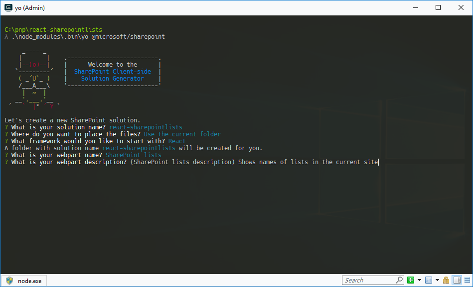

# <a name="connect-to-sharepoint-using-the-javascript-object-model-jsom"></a>Подключение к SharePoint с помощью объектной модели JavaScript (JSOM)

В прошлом при создании модификаций для SharePoint вы могли использовать объектную модель JavaScript (JSOM) для связи с SharePoint. В настоящее время рекомендуется использовать перенос кода или другие методы (см. раздел [Замечания](#considerations) далее в этой статье). 

Чтобы использовать модель JSOM в компоненте SharePoint Framework, на нее необходимо ссылаться. Раньше можно было использовать модель JSOM, доступную на странице. В SharePoint Framework ее необходимо загружать.

Сослаться на модель JSOM в SharePoint Framework можно двумя способами: 
- **декларативно** — через конфигурацию;
- **принудительно** — через код.

У каждого из этих подходов есть свои преимущества и недостатки, каждый из которых важно понимать.

> [!NOTE] 
> Прежде чем выполнять действия, описанные в этой статье, [настройте среду разработки SharePoint Framework](../../set-up-your-development-environment.md).

## <a name="create-a-new-project"></a>Создание проекта

1. С помощью консоли создайте папку для проекта:

  ```sh
  md react-sharepointlists
  ```

2. Перейдите в папку проекта:

  ```sh
  cd react-sharepointlists
  ```

3. В папке проекта запустите генератор Yeoman для SharePoint Framework, чтобы сформировать шаблон проекта на платформе SharePoint Framework:

  ```sh
  yo @microsoft/sharepoint
  ```

4. Когда появится соответствующий запрос, укажите следующие значения:

  - **react-sharepointlists** в качестве имени решения;
  - **Webpart** в качестве типа создаваемого клиентского компонента;
  - **Use the current folder** (Использовать текущую папку) в качестве расположения файлов;
  - **React** в качестве начальной платформы для создания веб-части;
  - **SharePoint lists** (Списки SharePoint) в качестве имени веб-части;
  - **Shows names of lists in the current site** (Показывает имена списков на текущем сайте) в качестве описания веб-части.

  

5. После завершения скаффолдинга заблокируйте версию зависимостей проекта, выполнив следующую команду:

  ```sh
  npm shrinkwrap
  ```

6. Откройте папку проекта в редакторе кода. В инструкциях и на снимках экрана в этой статье упоминается Visual Studio Code, но вы можете использовать любой редактор.

  

7. Чтобы открыть каталог в Visual Studio Code, введите в консоли следующую команду:

  ```sh
  code .
  ```


## <a name="reference-jsom-declaratively"></a>Добавление декларативных ссылок на JSOM

### <a name="register-the-sharepoint-jsom-api-as-external-scripts"></a>Регистрация API JSOM SharePoint в качестве внешних скриптов

Ссылаясь на JSOM декларативно, сначала необходимо зарегистрировать API JSOM SharePoint в качестве внешних скриптов в проекте SharePoint Framework.

1. Откройте в редакторе кода файл **./config/config.json** и добавьте следующий код в раздел **externals**:

  ```json
  {
    // ...
    "externals": {
      "sp-init": {
        "path": "https://contoso.sharepoint.com/_layouts/15/init.js",
        "globalName": "$_global_init"
      },
      "microsoft-ajax": {
        "path": "https://contoso.sharepoint.com/_layouts/15/MicrosoftAjax.js",
        "globalName": "Sys",
        "globalDependencies": [
          "sp-init"
        ]
      },
      "sp-runtime": {
        "path": "https://contoso.sharepoint.com/_layouts/15/SP.Runtime.js",
        "globalName": "SP",
        "globalDependencies": [
          "microsoft-ajax"
        ]
      },
      "sharepoint": {
        "path": "https://contoso.sharepoint.com/_layouts/15/SP.js",
        "globalName": "SP",
        "globalDependencies": [
          "sp-runtime"
        ]
      }
    }
    // ...
  }
  ```

  <br/>

  Каждая запись указывает на один из скриптов, которые вместе позволяют использовать JSOM SharePoint в компоненте SPFx. Эти скрипты не распространяются как модули. Поэтому для каждой записи о регистрации необходимо указать URL-адрес (свойство `path`) и имя (свойство `globalName`), используемые скриптом. Чтобы эти скрипты загружались в правильном порядке, зависимости между ними необходимо указать с помощью свойства `globalDependencies`.

  В зависимости от того, какие функции JSOM используются, могут потребоваться дополнительные скрипты (например, sp.taxonomy.js).

### <a name="install-typescript-typings-for-sharepoint-jsom"></a>Установка определений типов TypeScript для JSOM SharePoint

Следующий шаг — установка и настройка определений типов TypeScript для JSOM SharePoint. Это позволяет пользоваться функциями, обеспечивающими безопасность типов TypeScript при работе с JSOM SharePoint.

1. С помощью консоли выполните в каталоге проекта следующую команду:

  ```sh
  npm install @types/microsoft-ajax @types/sharepoint --save-dev
  ```

  Модель JSOM SharePoint не распространяется как модуль, поэтому ее нельзя импортировать в код напрямую. Необходимо глобально зарегистрировать ее определения типов TypeScript. 

2. Откройте в редакторе кода файл **./tsconfig.json**, а затем в свойстве `types` (сразу после записи **webpack-env**) добавьте ссылки на **microsoft-ajax** и **sharepoint**:

  ```json
  {
    "compilerOptions": {
      // ...
      "types": [
        "es6-promise",
        "es6-collections",
        "webpack-env",
        "microsoft-ajax",
        "sharepoint"
      ]
    }
  }
  ```

### <a name="reference-sharepoint-jsom-scripts-in-a-react-component"></a>Создание ссылок на скрипты JSOM SharePoint в компоненте React

Чтобы можно было загружать скрипты JSOM SharePoint в компоненте SPFx, необходимо ссылаться на них в коде компонента. В этом примере добавляются ссылки в компоненте React, где JSOM используется для связи с SharePoint.

Откройте в редакторе кода файл **./src/webparts/sharePointLists/components/SharePointLists.tsx**. После последнего оператора `import` добавьте следующий код:

```typescript
  require('sp-init');
  require('microsoft-ajax');
  require('sp-runtime');
  require('sharepoint');
```

Эти имена соответствуют добавленным ранее внешним ссылкам, поэтому SharePoint Framework загружает соответствующие скрипты с указанных URL-адресов.

Чтобы продемонстрировать связь с SharePoint через JSOM SharePoint, необходимо получить и отобразить заголовки всех списков SharePoint на текущем сайте.

### <a name="add-siteurl-to-the-react-components-properties"></a>Добавление свойства _siteUrl_ для компонента React

Чтобы подключиться к SharePoint, компонент React должен знать URL-адрес текущего сайта. Этот URL-адрес доступен в родительской веб-части, и его можно передавать компоненту через его свойства.

1. Откройте в редакторе кода файл **./src/webparts/sharePointLists/components/ISharePointListsProps.ts** и добавьте к интерфейсу `ISharePointListsProps` свойство `siteUrl`:

  ```typescript
  export interface ISharePointListsProps {
    description: string;
    siteUrl: string;
  }
  ```

2. Чтобы передать компоненту URL-адрес текущего сайта, откройте файл **./src/webparts/sharePointLists/SharePointListsWebPart.ts** и измените метод `render` следующим образом:

  ```typescript
  export default class SharePointListsWebPart extends BaseClientSideWebPart<ISharePointListsWebPartProps> {
    public render(): void {
      const element: React.ReactElement<ISharePointListsProps > = React.createElement(
        SharePointLists,
        {
          description: this.properties.description,
          siteUrl: this.context.pageContext.web.absoluteUrl
        }
      );

      ReactDom.render(element, this.domElement);
    }

    // ...
  }
  ```

### <a name="define-the-react-components-state"></a>Определение состояния компонента React

Компонент React загружает данные из SharePoint и показывает их пользователю. Текущее состояние компонента React моделируется с помощью добавляемого интерфейса состояний.

С помощью редактора кода создайте в папке **./src/webparts/sharePointLists/components** файл **ISharePointListsState.ts** и вставьте следующий текст:

```typescript
export interface ISharePointListsState {
    listTitles: string[];
    loadingLists: boolean;
    error: string;
}
```

### <a name="add-state-to-the-react-component"></a>Добавление состояния компонента React

Определив интерфейс, описывающий форму состояния компонента, необходимо сделать так, чтобы компонент React использовал этот интерфейс состояния.

1. Откройте в редакторе кода файл **./src/webparts/sharePointLists/components/SharePointLists.tsx**. Под имеющимися операторами `import` добавьте следующее:

  ```typescript
  import { ISharePointListsState } from './ISharePointListsState';
  ```

2. Измените подпись класса `SharePointLists` следующим образом:

  ```typescript
  export default class SharePointLists extends React.Component<ISharePointListsProps, ISharePointListsState> {
    // ...
  }
  ```

3. В классе `SharePointLists` добавьте конструктор со значением состояния по умолчанию:

  ```typescript
  export default class SharePointLists extends React.Component<ISharePointListsProps, ISharePointListsState> {
    constructor(props?: ISharePointListsProps, context?: any) {
      super();

      this.state = {
        listTitles: [],
        loadingLists: false,
        error: null
      };
    }

    // ...
  }
  ```

### <a name="load-information-about-sharepoint-lists-from-the-current-site-using-jsom"></a>Загрузка сведений о списках SharePoint с текущего сайта с помощью JSOM

Пример клиентской веб-части, используемый в этой статье, загружает сведения из списков SharePoint на текущем сайте после нажатия кнопки.

  

1. Откройте в редакторе кода файл **./src/webparts/sharePointLists/components/SharePointLists.tsx**. В классе `SharePointLists` добавьте метод `getListsTitles`:

  ```typescript
  export default class SharePointLists extends React.Component<ISharePointListsProps, ISharePointListsState> {
    constructor(props?: ISharePointListsProps, context?: any) {
      super();

      this.state = {
        listTitles: [],
        loadingLists: false,
        error: null
      };

      this.getListsTitles = this.getListsTitles.bind(this);
    }

    // ...

    private getListsTitles(): void {
    }
  }
  ```

2. Чтобы обеспечить правильное определение области метода, мы привяжем его к веб-части в конструкторе. Используйте JSOM SharePoint в методе `getListsTitles`, чтобы загрузить названия списков SharePoint на текущем сайте:

  ```typescript
  export default class SharePointLists extends React.Component<ISharePointListsProps, ISharePointListsState> {
    // ...
    private getListsTitles(): void {
      this.setState({
        loadingLists: true,
        listTitles: [],
        error: null
      });

      const context: SP.ClientContext = new SP.ClientContext(this.props.siteUrl);
      const lists: SP.ListCollection = context.get_web().get_lists();
      context.load(lists, 'Include(Title)');
      context.executeQueryAsync((sender: any, args: SP.ClientRequestSucceededEventArgs): void => {
        const listEnumerator: IEnumerator<SP.List> = lists.getEnumerator();

        const titles: string[] = [];
        while (listEnumerator.moveNext()) {
          const list: SP.List = listEnumerator.get_current();
          titles.push(list.get_title());
        }

        this.setState((prevState: ISharePointListsState, props: ISharePointListsProps): ISharePointListsState => {
          prevState.listTitles = titles;
          prevState.loadingLists = false;
          return prevState;
        });
      }, (sender: any, args: SP.ClientRequestFailedEventArgs): void => {
        this.setState({
          loadingLists: false,
          listTitles: [],
          error: args.get_message()
        });
      });
    }
  }
  ```

  <br/>

Для начала мы сбрасываем состояние компонента, чтобы сообщить пользователю, что компонент загружает сведения из SharePoint. Используя URL-адрес текущего сайта, передаваемый компоненту через его свойства, мы создаем новый экземпляр контекста SharePoint. Используя JSOM SharePoint, мы загружаем списки с нынешнего сайта. Чтобы увеличить скорость выполнения запроса, мы указываем, что должно загружаться только свойство `Title`. 

Затем мы выполняем запрос, вызывая метод `executeQueryAsync` и передавая две функции обратного вызова. После этого мы просматриваем коллекцию полученных списков, сохраняем их названия в массиве и обновляем состояние компонента.

### <a name="render-the-titles-of-sharepoint-lists-in-the-current-site"></a>Отображение названий списков SharePoint на текущем сайте

После загрузки названий списков SharePoint на текущем сайте остается только показать их в компоненте. 

1. Откройте в редакторе кода файл **./src/webparts/sharePointLists/components/SharePointLists.tsx** и обновите метод `render`:

  ```tsx
  export default class SharePointLists extends React.Component<ISharePointListsProps, ISharePointListsState> {
    // ...
    public render(): React.ReactElement<ISharePointListsProps> {
      const titles: JSX.Element[] = this.state.listTitles.map((listTitle: string, index: number, listTitles: string[]): JSX.Element => {
        return <li key={index}>{listTitle}</li>;
      });

      return (
        <div className={styles.sharePointLists}>
          <div className={styles.container}>
            <div className={`ms-Grid-row ms-bgColor-themeDark ms-fontColor-white ${styles.row}`}>
              <div className="ms-Grid-col ms-u-lg10 ms-u-xl8 ms-u-xlPush2 ms-u-lgPush1">
                <span className="ms-font-xl ms-fontColor-white">Welcome to SharePoint!</span>
                <p className="ms-font-l ms-fontColor-white">Customize SharePoint experiences using Web Parts.</p>
                <p className="ms-font-l ms-fontColor-white">{escape(this.props.description)}</p>
                <a className={styles.button} onClick={this.getListsTitles} role="button">
                  <span className={styles.label}>Get lists titles</span>
                </a><br />
                {this.state.loadingLists &&
                  <span>Loading lists...</span>}
                {this.state.error &&
                  <span>An error has occurred while loading lists: {this.state.error}</span>}
                {this.state.error === null && titles &&
                  <ul>
                    {titles}
                  </ul>}
              </div>
            </div>
          </div>
        </div>
      );
    }
    // ...
  }
  ```

2. На этом этапе у вас должна быть возможность добавить веб-часть на страницу и просмотреть названия списков SharePoint на текущем сайте. Чтобы убедиться, что проект работает надлежащим образом, выполните в консоли следующую команду:

  ```sh
  gulp serve --nobrowser
  ```

3. Мы используем JSOM SharePoint для связи с SharePoint, поэтому веб-часть необходимо протестировать с помощью размещенной версии SharePoint Workbench (именно поэтому указывается параметр `--nobrowser` — он предотвращает автоматическую загрузку локальной версии Workbench).

  

Декларативные ссылки на скрипты JSOM SharePoint (как на внешние скрипты) удобно использовать, и они делают код более удобочитаемым. Недостаток этого способа заключается в том, что необходимо указывать абсолютные URL-адреса источников, из которых загружаются скрипты JSOM SharePoint. Если вы используете отдельные клиенты SharePoint для разработки, тестирования и производства, эти URL-адреса необходимо адаптировать для каждой среды. В таких случаях советуем ссылаться на JSOM принудительно, используя [SPComponentLoader](https://docs.microsoft.com/ru-RU/javascript/api/sp-application-base) для загрузки скриптов в коде компонента SPFx.

## <a name="reference-jsom-imperatively"></a>Добавление принудительных ссылок на JSOM

Для загрузки библиотек JavaScript в проектах SharePoint Framework также можно использовать вспомогательный класс SharePoint Framework `SPComponentLoader`, предназначенный для загрузки скриптов и других ресурсов. В отличие от декларативной загрузки скриптов, при использовании `SPComponentLoader` можно применять URL-адреса, заданные относительно сервера. Это удобно, если для разных стадий разработки используются разные клиенты SharePoint.

Эта часть руководства основана на коде, созданном ранее в разделе "Добавление декларативных ссылок на JSOM".

### <a name="declarative-reference-cleanup"></a>Удаление декларативных ссылок

Если вы добавили декларативные ссылки в разделах выше, их необходимо удалить.

1. Удалите существующие ссылки на внешние скрипты. Откройте в редакторе кода файл **./config/config.json** и удалите из свойства **externals** все записи:

  ```json
  {
    "$schema": "https://dev.office.com/json-schemas/spfx-build/config.2.0.schema.json",
    "version": "2.0",
    "bundles": {
      "share-point-lists-web-part": {
        "components": [
          {
            "entrypoint": "./lib/webparts/sharePointLists/SharePointListsWebPart.js",
            "manifest": "./src/webparts/sharePointLists/SharePointListsWebPart.manifest.json"
          }
        ]
      }
    },
    "externals": {},
    "localizedResources": {
      "SharePointListsWebPartStrings": "lib/webparts/sharePointLists/loc/{locale}.js"
    }
  }
  ```

  Так как скрипты JSOM SharePoint больше не регистрируются как внешние скрипты, на них невозможно ссылаться в коде напрямую. 

2. Откройте в редакторе кода файл **./src/webparts/sharePointLists/components/SharePointLists.tsx** и удалите операторы `require`, указывающие на разные скрипты JSOM SharePoint.

### <a name="wait-to-load-data-until-the-jsom-scripts-are-loaded"></a>Отображение состояния загрузки скриптов JSOM

Работа создаваемой в этом руководстве клиентской веб-части зависит от JSOM SharePoint. Загрузка этих скриптов может занять несколько минут (в зависимости от ряда факторов). Учитывайте это при создании компонентов SPFx, которые используют JSOM. При добавлении на страницу веб-часть должна сообщать пользователю о загрузке необходимых компонентов и ясно показывать, когда она готова к использованию. 

Для этого необходимо расширить состояние компонента React с помощью дополнительного свойства для отслеживания состояния загрузки скриптов JSOM.

1. Откройте в редакторе кода файл **./src/webparts/sharePointLists/components/ISharePointListsState.ts** и вставьте следующий код:

  ```typescript
  export interface ISharePointListsState {
      listTitles: string[];
      loadingLists: boolean;
      error: string;
      loadingScripts: boolean;
  }
  ```

2. Добавьте новое свойство к определениям состояний в компоненте React. Откройте в редакторе кода файл **./src/webparts/sharePointLists/components/SharePointLists.tsx**. Обновите конструктор, вставив следующий код:

  ```typescript
  export default class SharePointLists extends React.Component<ISharePointListsProps, ISharePointListsState> {
    constructor(props?: ISharePointListsProps, context?: any) {
      super();

      this.state = {
        listTitles: [],
        loadingLists: false,
        error: null,
        loadingScripts: true
      };

      this.getListsTitles = this.getListsTitles.bind(this);
    }
    // ...
  }
  ```

3. В том же файле замените код метода `getListsTitles` на следующий:

  ```typescript
  export default class SharePointLists extends React.Component<ISharePointListsProps, ISharePointListsState> {
    // ...
    private getListsTitles(): void {
      this.setState({
        loadingLists: true,
        listTitles: [],
        error: null,
        loadingScripts: false
      });

      const context: SP.ClientContext = new SP.ClientContext(this.props.siteUrl);
      const lists: SP.ListCollection = context.get_web().get_lists();
      context.load(lists, 'Include(Title)');
      context.executeQueryAsync((sender: any, args: SP.ClientRequestSucceededEventArgs): void => {
        const listEnumerator: IEnumerator<SP.List> = lists.getEnumerator();

        const titles: string[] = [];
        while (listEnumerator.moveNext()) {
          const list: SP.List = listEnumerator.get_current();
          titles.push(list.get_title());
        }

        this.setState((prevState: ISharePointListsState, props: ISharePointListsProps): ISharePointListsState => {
          prevState.listTitles = titles;
          prevState.loadingLists = false;
          return prevState;
        });
      }, (sender: any, args: SP.ClientRequestFailedEventArgs): void => {
        this.setState({
          loadingLists: false,
          listTitles: [],
          error: args.get_message(),
          loadingScripts: false
        });
      });
    }
  }
  ```

4. Чтобы пользователь видел состояние загрузки скриптов JSOM SharePoint, замените код метода `render` на следующий:

  ```tsx
  export default class SharePointLists extends React.Component<ISharePointListsProps, ISharePointListsState> {
    // ...
    public render(): React.ReactElement<ISharePointListsProps> {
      const titles: JSX.Element[] = this.state.listTitles.map((listTitle: string, index: number, listTitles: string[]): JSX.Element => {
        return <li key={index}>{listTitle}</li>;
      });

      return (
        <div className={styles.sharePointLists}>
          <div className={styles.container}>
            {this.state.loadingScripts &&
              <div className="ms-Grid" style={{ color: "#666", backgroundColor: "#f4f4f4", padding: "80px 0", alignItems: "center", boxAlign: "center" }}>
                <div className="ms-Grid-row" style={{ color: "#333" }}>
                  <div className="ms-Grid-col ms-u-hiddenSm ms-u-md3"></div>
                  <div className="ms-Grid-col ms-u-sm12 ms-u-md6" style={{ height: "100%", whiteSpace: "nowrap", textAlign: "center" }}>
                    <i className="ms-fontSize-su ms-Icon ms-Icon--CustomList" style={{ display: "inline-block", verticalAlign: "middle", whiteSpace: "normal" }}></i><span className="ms-fontWeight-light ms-fontSize-xxl" style={{ paddingLeft: "20px", display: "inline-block", verticalAlign: "middle", whiteSpace: "normal" }}>SharePoint lists</span>
                  </div>
                  <div className="ms-Grid-col ms-u-hiddenSm ms-u-md3"></div>
                </div>
                <div className="ms-Grid-row" style={{ width: "65%", verticalAlign: "middle", margin: "0 auto", textAlign: "center" }}>
                  <span style={{ color: "#666", fontSize: "17px", display: "inline-block", margin: "24px 0", fontWeight: 100 }}>Loading SharePoint JSOM scripts...</span>
                </div>
                <div className="ms-Grid-row"></div>
              </div>}
            {this.state.loadingScripts === false &&
              <div className={`ms-Grid-row ms-bgColor-themeDark ms-fontColor-white ${styles.row}`}>
                <div className="ms-Grid-col ms-u-lg10 ms-u-xl8 ms-u-xlPush2 ms-u-lgPush1">
                  <span className="ms-font-xl ms-fontColor-white">Welcome to SharePoint!</span>
                  <p className="ms-font-l ms-fontColor-white">Customize SharePoint experiences using Web Parts.</p>
                  <p className="ms-font-l ms-fontColor-white">{escape(this.props.description)}</p>
                  <a className={styles.button} onClick={this.getListsTitles} role="button">
                    <span className={styles.label}>Get lists titles</span>
                  </a><br />
                  {this.state.loadingLists &&
                    <span>Loading lists...</span>}
                  {this.state.error &&
                    <span>An error has occurred while loading lists: {this.state.error}</span>}
                  {this.state.error === null && titles &&
                    <ul>
                      {titles}
                    </ul>}
                </div>
              </div>
            }
          </div>
        </div>
      );
    }
    // ...
  }
  ```

5. Когда состояние компонента React указывает на загрузку скриптов JSOM SharePoint, отображается заполнитель. После загрузки скриптов в веб-части отображается стандартное содержимое с кнопкой, позволяющей пользователям загрузить информацию о списках SharePoint на текущем сайте.

### <a name="load-sharepoint-jsom-scripts-by-using-spcomponentloader"></a>Загрузка скриптов JSOM SharePoint с помощью класса SPComponentLoader

Компоненты SPFx должны загружать сценарии SharePoint JSOM только один раз. В этом примере (при условии, что веб-часть состоит из одного компонента React), загружать сценарии SharePoint JSOM лучше всего в методе `componentDidMount` компонента React, который выполняется только один раз после создания экземпляра компонента.

1. Откройте в редакторе кода файл **./src/webparts/sharePointLists/components/SharePointLists.tsx**. Добавьте в начале файла оператор `import`, ссылающийся на класс `SPComponentLoader`. Добавьте метод `componentDidMount` в класс `SharePointLists`:

  ```typescript
  import { SPComponentLoader } from '@microsoft/sp-loader';

  export default class SharePointLists extends React.Component<ISharePointListsProps, ISharePointListsState> {
    // ...
    public componentDidMount(): void {
      SPComponentLoader.loadScript('/_layouts/15/init.js', {
        globalExportsName: '$_global_init'
      })
      .then((): Promise<{}> => {
        return SPComponentLoader.loadScript('/_layouts/15/MicrosoftAjax.js', {
          globalExportsName: 'Sys'
        });
      })
      .then((): Promise<{}> => {
        return SPComponentLoader.loadScript('/_layouts/15/SP.Runtime.js', {
          globalExportsName: 'SP'
        });
      })
      .then((): Promise<{}> => {
        return SPComponentLoader.loadScript('/_layouts/15/SP.js', {
          globalExportsName: 'SP'
        });
      })
      .then((): void => {
        this.setState((prevState: ISharePointListsState, props: ISharePointListsProps): ISharePointListsState => {
          prevState.loadingScripts = false;
          return prevState;
        });
      });
    }
    // ...
  }
  ```

2. Используя цепочку обещаний, мы загружаем различные скрипты, которые вместе позволяют использовать JSOM SharePoint в компоненте SharePoint Framework. Обратите внимание на то, что благодаря классу `SPComponentLoader` вы можете использовать URL-адреса, заданные относительно сервера, которые загружают скрипты из текущего клиента SharePoint. После загрузки всех скриптов вы обновляете состояние компонента React, подтверждая, что все необходимые компоненты загружены, а веб-часть готова к использованию.

3. Убедитесь, что веб-часть работает надлежащим образом, выполнив в консоли следующую команду:

  ```sh
  gulp serve --nobrowser
  ```

  Как и раньше, в веб-части должны появиться названия списков SharePoint на текущем сайте.

  

  
Использование класса `SPComponentLoader` требует дополнительной работы, но позволяет указывать URL-адреса, заданные относительно сервера. Это удобно, когда для разработки, тестирования и производства используются разные клиенты.

## <a name="considerations"></a>Замечания

В прошлом при создании клиентских модификаций на платформах SharePoint вы могли использовать JSOM SharePoint для связи с SharePoint. В настоящее время рекомендуем использовать REST API SharePoint напрямую или через [основную библиотеку PnP JavaScript](https://github.com/SharePoint/PnP-JS-Core).

Выпуск SharePoint JSOM был первым шагом к поддержке клиентских решений в SharePoint. Но в настоящее время активная поддержка этой модели прекращена, и в ней могут быть доступны не все возможности REST API. Кроме того, независимо от того, используется ли REST API SharePoint напрямую или через основную библиотеку PnP JavaScript, вы можете использовать обещания, что значительно упрощает написание асинхронного кода (оно часто представляло проблему при использовании JSOM).

Несмотря на то что в редких случаях SharePoint JSOM все еще может предоставлять доступ к данным и методам, не поддерживаемым в REST API SharePoint, по мере возможности рекомендуется использовать REST API.

Если у вас есть модификации с использованием SharePoint JSOM, которые планируется перенести на платформу SharePoint Framework, то в этой статье вы найдете необходимые сведения об использовании SharePoint JSOM в решениях SharePoint Framework. Однако в долгосрочной перспективе рекомендуем изменить решение так, чтобы для связи с SharePoint использовался интерфейс REST API SharePoint (напрямую или через основную библиотеку PnP JavaScript).
