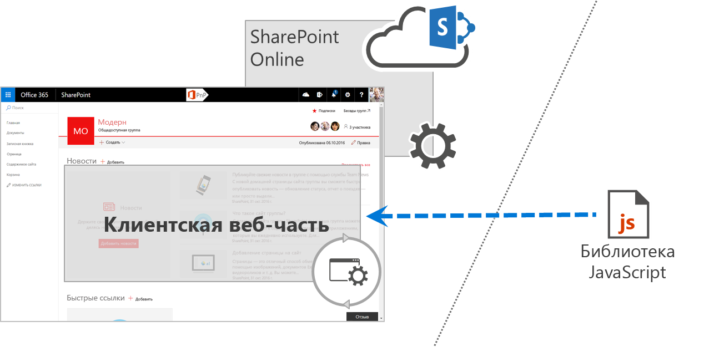

# Особенности системы управления для решений SharePoint FrameworkSharePoint Framework solutions governance considerations

С помощью SharePoint Framework ваша организация может легко создавать решения, которые позволяют без усилий интегрировать возможности SharePoint и Office 365.With the SharePoint Framework, your organization can easily build solutions that easily integrate the capabilities available in SharePoint and Office 365. Решения SharePoint Framework совместимы с современными веб-технологиями и работают на различных мобильных устройствах, поэтому вы можете создавать полезные компоненты и адаптивные приложения, готовые к работе на мобильных устройствах.SharePoint Framework solutions work across modern web technologies and different mobile devices so you can create productive experiences and apps that are responsive and mobile-ready from day one. Чтобы получить максимум от решений SharePoint Framework, нужен конкретный план, охватывающий наиболее важные аспекты управления проектами.To get the most benefit from SharePoint Framework solutions, your organization should have an actionable governance plan covering the most important project management considerations.

## Структура решений SharePoint FrameworkAnatomy of SharePoint Framework solutions

Решения SharePoint Framework состоят из двух частей: кода (его часто называют пакетом веб-части), развертываемого по URL-адресу, и SPPKG-файла, который содержит манифест веб-части с URL-адресом, указывающим расположение, в котором развертывается код веб-части.SharePoint Framework solutions consist of two parts: code (often referred to as a web part bundle) deployed to a URL, and an .sppkg file that contains a web part manifest with a URL pointing to the location where the web part code is deployed. Не существует определенных ограничений, касающихся места развертывания кода. Единственное условие — наличие у пользователя доступа к коду веб-части.There are no particular restrictions to where the code is deployed, as long as users working with the web part can access the web part code. Например, организации могут развертывать веб-части в [общедоступной сети CDN Office 365](https://dev.office.com/blogs/office-365-public-cdn-developer-preview-release), [хранилище Azure](../get-started/deploy-web-part-to-cdn.md) или на принадлежащем им веб-сервере.Organizations can choose, for example, to have their web parts deployed to the [Office 365 public CDN](https://dev.office.com/blogs/office-365-public-cdn-developer-preview-release), [Azure storage](../get-started/deploy-web-part-to-cdn.md), or a privately-owned web server.

## Вопросы, касающиеся места размещения кода веб-частиWeb part code-hosting location considerations

Перед развертыванием решений SharePoint Framework организациям необходимо точно знать расположение, в котором развертывается код решения.The most important thing that organizations should know before deploying SharePoint Framework solutions is where the code of the solution is deployed. Решения SharePoint Framework выполняются как часть страницы в контексте текущего пользователя.SharePoint Framework solutions are executed as a part of the page in the context of the current user. Таким образом, код веб-части может делать все, что может делать пользователь.As a result, whatever the user can do, the web part's code can do as well. В отличие от надстроек SharePoint, к решениям SharePoint Framework не применяется отдельная область разрешений.In contrast to SharePoint Add-ins, there is no separate permission scope applied to SharePoint Framework solutions. Поэтому администраторам SharePoint следует рассматривать решения SharePoint Framework как решения с высоким уровнем доверия (по аналогии с локальными решениями для ферм).This is why SharePoint administrators should treat SharePoint Framework solutions as high-trust solutions, the same way they treat farm solutions on-premises. Существует несколько причин, по которым важно знать расположение, где развертывается код веб-части.The location where the web part's code is deployed is important for a number of reasons. 

Ниже приведены вопросы, касающиеся расположения, которые следует рассмотреть.Consider the following location issues.

### Поддерживает ли организация место размещения кода?Is the code-hosting location supported by the organization?

В SharePoint Framework не предусмотрены ограничения, касающиеся места развертывания кода решения.SharePoint Framework doesn't impose any restrictions regarding where the solution's code is deployed. Таким образом, разработчики и поставщики могут развертывать код в ряде расположений как внутри, так и за пределами ИТ-отдела организации.As a result, developers and vendors can deploy the code to a range of locations within or outside the organization's IT department. У каждой организации свои требования в отношении серверов. Они могут предусматривать, например, использование политик доступа или соглашений SLA.Different organizations may have different server requirements ranging from access policies to SLAs. Перед началом развертывания пакета решения SharePoint Framework нужно убедиться, что сервер, на котором планируется размещение кода, известен и утвержден организацией для использования.Before deploying a SharePoint Framework solution package, organizations should ensure that the server used to host the code is a known server approved to be used by the organization.

### Кто управляет местом размещения кода?Who manages the code-hosting location?

Решения SharePoint Framework выполняются как часть страницы в контексте текущего пользователя.SharePoint Framework solutions execute as a part of the page in the context of the current user. Организации перед развертыванием пакета решения следует проверить код, чтобы подтвердить, что ему можно доверять, а также удостовериться в целостности кода при его развертывании в клиенте.While an organization could perform a code review before deploying a solution package, to verify that the code can be trusted, it also should ensure the integrity of the code as long as it's deployed to the tenant. Очень важно, чтобы в организации четко понимали, кто управляет расположением, в котором размещается код, кто и в каких случаях может изменять файлы, а также как проходит утверждение обновлений.Organizations should have a clear understanding of who manages the hosting location, who and under what circumstances they can modify the files, and what the update approval process looks like. Ответы на эти вопросы позволяют организации управлять процедурой обновления и снижают риск развертывания вредоносного кода.Establishing this information upfront not only helps organizations control the update process, but also lowers the risk of deploying malicious code.

### Что такое соглашение об уровне обслуживания для расположения, в котором размещается решение?What is the SLA for the hosting location?

Если организации работают со службами Office 365 и SharePoint Online, они используют соглашения об уровне обслуживания, предоставляемые корпорацией Майкрософт.When organizations use Office 365 and SharePoint Online, they rely on the SLA provided by Microsoft. Решения SharePoint Framework, отличающиеся от стандартных возможностей SharePoint и Office 365, необходимо развертывать на серверах, которые соответствуют условиям соглашения об уровне обслуживания от корпорации Майкрософт (характеристики этих серверов могут быть лучше указанных в соглашении).SharePoint Framework solutions that extend the standard capabilities of SharePoint and Office 365 should be deployed to servers that meet or exceed the SLA provided by Microsoft. В этом случае организации могут воспользоваться всеми преимуществами своих модификаций.That way, organizations can ensure that they are able to truly benefit from the added values of their customizations.

### Оптимизировано ли расположение, в котором размещается решение, для улучшения производительности?Is the hosting location optimized for performance?

Загрузка существующих библиотек по URL-ссылке (вместо внедрения их в пакет веб-части) — это первый шаг к сокращению времени загрузки решений SharePoint Framework.Loading existing libraries from a URL instead of embedding them in the web part bundle is the first step to speed up the loading time of SharePoint Framework solutions. Чтобы достигнуть максимального эффекта, убедитесь, что на сервере, на котором размещаются нужные скрипты, используются правильные настройки для улучшения производительности.To get the most out of it, you want to ensure that the server hosting the different scripts is correctly configured for optimal performance. Сервер должен обрабатывать все сжатые файлы. Кроме того, более длительное время, отведенное на кэширование файлов для прокси и клиентов, позволяет пользователям дольше использовать возможность загрузки скриптов из локального кэша. Это значительно сокращает время загрузки страниц SharePoint, содержащих веб-части.It should serve all files compressed, and the longer it allows proxies and clients to cache the files, the longer users will be able to load these scripts from their local cache, significantly speeding up loading SharePoint pages containing web parts.

## Инструменты и библиотекиTools and libraries

При создании клиентских решений разработчики могут выбрать нужную им библиотеку, например React, Angular, jQuery или Knockout.When building client-side solutions, developers can choose from a variety of libraries such as React, Angular, jQuery, or Knockout. Благодаря использованию уже существующих библиотек JavaScript разработчикам проще создавать многофункциональные решения.Using an existing JavaScript library makes it easier for developers to build rich solutions. Кроме того, при выборе библиотеки для создания решения следует учитывать, что принципы работы библиотек отличаются друг от друга и для их понимания часто требуются определенные знания.There are big differences between how the different libraries work, and often specific knowledge is required to fully understand how to build a solution using the particular library.

Нужно убедиться, что созданное решение после реализации в рабочем клиенте получит соответствующую поддержку в организации (будь то ваш собственный ИТ-отдел или сторонняя организация, с которой у вас заключен договор).Once released to your production tenant, you should ensure that your support organization (either your own IT department or a contracted third party) is capable of supporting the solution. Для этого необходимо, чтобы организация, обеспечивающая поддержку, располагала по крайней мере основными сведениями о работе библиотеки, которую вы использовали для создания решения.To do this, the support organization should have at least a basic understanding of the library used to build that solution. Чем больше разных библиотек вы используете в клиенте, тем сложнее поддерживать различные решения.Also, as you increase the number of libraries that you use across your tenant, the harder it is to support the different solutions. Выберите одну или две библиотеки для своей организации, это поможет снизить расходы на эксплуатацию.Selecting one or two libraries to use in your organization helps you lower the operational costs. Перед тем как развернуть решение в рабочем клиенте, убедитесь, что оно использует только библиотеки, поддерживаемые в вашей организации.Before deploying a solution to your production tenant, you should ensure that the solution is using only libraries supported in your organization.

## Использование внешних скриптовUsing external scripts

При использовании существующих библиотек JavaScript разработчики могут включить их в пакет кода веб-части или загрузить по URL-ссылке.When using existing JavaScript libraries, developers can either choose to include them in the web part code bundle or load them from a URL. Последний способ позволяет разработчикам оптимизировать решения SharePoint Framework для повышения производительности.Loading libraries from URLs allows developers to optimize SharePoint Framework solutions for performance. Так как библиотеки загружаются по URL-ссылке, они не включаются в пакет веб-части, поэтому его размер уменьшается, а время загрузки сокращается.Because libraries are loaded from a URL, they don't need to be included in the web part bundle, which decreases its size making it load faster. Кроме того, использование в клиенте ссылок на одни и те же библиотеки ускоряет загрузку решений SharePoint Framework благодаря повторному обращению к ранее скачанным скриптам из локального кэша.Additionally, by referencing the same libraries across the whole tenant, SharePoint Framework solutions load faster by reusing the previously downloaded scripts from the local cache.

Так как ограничения в отношении источников загрузки существующих библиотек отсутствуют, очень важно точно знать, с каких серверов загружаются внешние скрипты.There are no restrictions to where the existing libraries can be loaded from, and it's important to know from which servers the external scripts are loaded. Вместе с кодом веб-части эти скрипты запускаются в контексте текущего пользователя и могут выполнять все доступные ему действия.Together with the web part code, these scripts run in the context of the current user and can do whatever the current user is capable of doing. Поэтому очень важно, чтобы вы доверяли этим скриптам и их целостности.Therefore, it's important that you trust these scripts and their integrity. В некоторых организациях существуют строгие политики, касающиеся ресурсов, полученных из общедоступных сетей CDN, поэтому следует убедиться, что решение и его ресурсы соответствуют политикам вашей организации.Some organizations have strict policies relating to resources sourced from public CDNs, and you should ensure that the solution and its resources meet your organizational policies.

## Утверждение решений SharePoint Framework для развертыванияApproving SharePoint Framework solutions for deployment

Развертывание решений SharePoint Framework в клиенте — это централизованный процесс, который выполняется с помощью каталога приложений.SharePoint Framework solutions are deployed to a tenant centrally through the App Catalog. В организации должен существовать план, который определяет, кто может развертывать и утверждать пакеты SharePoint Framework.Your organization should have a plan in place describing who is allowed to deploy and approve SharePoint Framework packages. Этот план очень важен, так как определяет лиц, ответственных за безопасность развертываемых пакетов и их проверку на соответствие политикам организации.This is important, because this plan should include who is responsible to verify that the packages that are deployed are secure and meet the organizational policies. В отличие от надстроек SharePoint, решения SharePoint Framework выполняются в браузере в контексте текущего пользователя и обладают теми же разрешениями, что и выполнивший вход пользователь.SharePoint Framework solutions run in the browser in the context of the current user and, unlike SharePoint Add-ins, always have the same permissions as the currently signed-in user. Развертыванию и утверждению решения SharePoint Framework для использования в организации должна предшествовать тщательная проверка его происхождения и соответствия всем условиям, упомянутым выше.Before deploying and approving a SharePoint Framework solution for use in your organization, its origin and other criteria mentioned previously in this article should be carefully examined.

Чтобы убедиться, что решение SharePoint Framework соответствует политикам организации, проверьте содержимое пакета SPPKG, который планируете развернуть, а также внимательно изучите содержимое скриптов, на которые ссылается решение, и их расположения.To verify that your SharePoint Framework solution meets your organization's policies, you should review the contents of the .sppkg package that you want to deploy and closely examine the contents of the referenced scripts and the location where they are hosted. Эти проверки можно выполнить вручную или автоматически (с помощью средств сторонних производителей).This step can be performed manually, or it can be automated by using third-party tooling. [SharePoint Customization Analysis Framework](https://rencore.com/products/#spcaf) (SPCAF) — пример стороннего решения, значительно упрощающего анализ содержимого решений SharePoint Framework и проверку их соответствия требованиям организации, касающимся безопасности и системы управления.[SharePoint Customization Analysis Framework](https://rencore.com/products/#spcaf) (SPCAF) is an example of a third-party solution that significantly simplifies the process of analyzing the contents of SharePoint Framework solutions and verifying that they meet your organizational security and governance requirements.

## Решения SharePoint Framework и сайты без скриптаSharePoint Framework solutions and no-script sites

В Office 365 организации могут использовать параметр "Без скрипта", чтобы отключить модификации на основе скрипта в SharePoint Online.In Office 365, organizations can use the no-script setting to disable script-based customizations in SharePoint Online. Подобные настройки можно применить как ко всему клиенту, так и к отдельным семействам веб-сайтов.Organizations can configure the no-script setting either for the whole tenant or for a particular site collection. Согласно условиям, указанным в политиках организации, администраторы могут использовать параметр "Без скрипта", чтобы отключить модификации, созданные, например, с помощью веб-части редактора скриптов или дополнительного действия пользователя.Based on the criteria from the organizational policies, administrators can use the no-script setting to disable customizations built, for example, by using the Script Editor web part or a user custom action.

Этот параметр служит в организации в качестве дополнительного уровня управления и защиты всего клиента или отдельных семейств веб-сайтов.The no-script setting is meant for organizations to apply an additional layer of control and security to either the whole tenant or specific site collections. Настройка SharePoint с помощью внедрения или добавления сценариев таит в себе определенные риски. В частности, необходимо тщательно взвесить все "за" и "против" при принятии такого решения, если на сайте содержится конфиденциальная информация.Customizing SharePoint using script embedding and injecting is not without risks, and particularly on sites containing sensitive information, should be thoroughly evaluated.

Ранее разработчики использовали внедрение и добавление скриптов, чтобы создать эффективные модификации для SharePoint.In the past, developers used script embedding and injecting techniques for building powerful SharePoint customizations. В некоторых случаях эти модификации использовали определенную структуру страницы, и при изменении определенной модификации она переставала правильно работать.In some cases, these customizations relied on specific page structure, and when the particular customization changed, it would stop working correctly. Чтобы помочь разработчикам в создании надежных решений, команда разработчиков SharePoint решила, что на всех современных сайтах будет включен параметр "Без скрипта".To guide developers to build more robust solutions, the SharePoint engineering team decided that all modern sites should have the no-script setting enabled. Это означает, что на таких сайтах внедрение и добавление скриптов невозможно. В настоящее время единственный вариант модификации подобных сайтов — использование SharePoint Framework.This means that embedding and injecting scripts on these sites is not possible, and using the SharePoint Framework is currently the only option to customize these sites. В будущем на всех современных сайтах будет использоваться параметр "Без скрипта", а вместо внедрения и добавления скриптов разработчикам будут предложены другие варианты настройки сайта, поддерживающие различные сценарии.In the future, all modern sites will use the no-script setting, and alternatives to script embedding and injecting will become available for developers to support the different scenarios.
