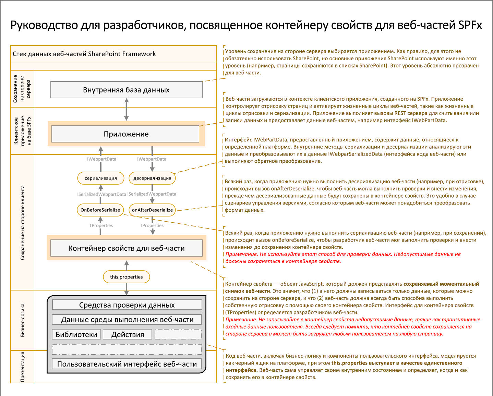

# <a name="integrate-web-part-properties-with-sharepoint"></a><span data-ttu-id="92c65-103">Интеграция свойств веб-части с SharePoint</span><span class="sxs-lookup"><span data-stu-id="92c65-103">Integrate web part properties with SharePoint</span></span>

<span data-ttu-id="92c65-104">При создании классических веб-частей их свойства изолировались от SharePoint, а их значениями управляли пользователи.</span><span class="sxs-lookup"><span data-stu-id="92c65-104">When building classic web parts, web part properties were isolated from SharePoint, and their values were managed by end-users.</span></span> <span data-ttu-id="92c65-105">SharePoint Framework включает новые возможности, упрощающие управление значениями свойств веб-части и их интеграцию со службой поиска SharePoint.</span><span class="sxs-lookup"><span data-stu-id="92c65-105">SharePoint Framework offers you a new set of capabilities that simplify managing web part properties' values and integrate them with SharePoint Search.</span></span> <span data-ttu-id="92c65-106">В этой статье описано, как использовать эти возможности при создании клиентских веб-частей SharePoint Framework.</span><span class="sxs-lookup"><span data-stu-id="92c65-106">This article explains how you can use these capabilities when building SharePoint Framework client-side web parts.</span></span>

> [!IMPORTANT] 
> <span data-ttu-id="92c65-107">Приведенное ниже руководство относится только к клиентским веб-частям SharePoint Framework, размещенным на современных страницах SharePoint.</span><span class="sxs-lookup"><span data-stu-id="92c65-107">The following guide applies only to SharePoint Framework client-side web parts placed on modern SharePoint pages.</span></span> <span data-ttu-id="92c65-108">Возможности, описанные в этой статье, не поддерживаются в классических веб-частях и клиентских веб-частях SharePoint Framework, размещенных на классических страницах.</span><span class="sxs-lookup"><span data-stu-id="92c65-108">Capabilities described in this article don't apply to classic web parts or SharePoint Framework client-side web parts placed on classic pages.</span></span>

## <a name="client-side-web-part-properties"></a><span data-ttu-id="92c65-109">Свойства клиентских веб-частей</span><span class="sxs-lookup"><span data-stu-id="92c65-109">Client-side web part properties</span></span>

<span data-ttu-id="92c65-p103">При создании клиентских веб-частей SharePoint Framework можно определять свойства, настраиваемые пользователями. Благодаря тому, что вместо фиксированных значений используются свойства, веб-части более универсальны.</span><span class="sxs-lookup"><span data-stu-id="92c65-p103">When building SharePoint Framework client-side web parts, you can define properties that can be configured by users. By using properties instead of fixed values, web parts are more flexible and suitable for many different scenarios.</span></span>

<span data-ttu-id="92c65-112">Обработка свойств веб-частей в SharePoint Framework реализована несколько иначе, чем в классических веб-частях.</span><span class="sxs-lookup"><span data-stu-id="92c65-112">Compared to classic web parts, there are some differences in how the SharePoint Framework handles web part properties.</span></span> <span data-ttu-id="92c65-113">На приведенной ниже схеме показано, как значения свойств веб-части проходят через разные уровни SharePoint.</span><span class="sxs-lookup"><span data-stu-id="92c65-113">The following schema illustrates how web part property values flow through the different layers of SharePoint.</span></span>



<br/>

<span data-ttu-id="92c65-115">Прежде чем принимать от пользователей значения свойств веб-части, всегда следует [проверять их](./validate-web-part-property-values.md).</span><span class="sxs-lookup"><span data-stu-id="92c65-115">Before accepting values for web part properties from end users, you should always [validate them](./validate-web-part-property-values.md).</span></span> <span data-ttu-id="92c65-116">Это не только позволяет обеспечить удобство работы с веб-частями, но и помогает избежать хранения недопустимых данных в конфигурации веб-части.</span><span class="sxs-lookup"><span data-stu-id="92c65-116">This not only allows you to ensure that your web parts are user-friendly, but also helps you prevent storing invalid data in the web part's configuration.</span></span> 

<span data-ttu-id="92c65-117">Кроме того, следует учитывать, что SharePoint Framework не поддерживает персонализацию, поэтому все пользователи видят одну и ту же конфигурацию определенной веб-части.</span><span class="sxs-lookup"><span data-stu-id="92c65-117">Additionally, you should consider that the SharePoint Framework doesn't support personalization, and all users see the same configuration of the particular web part.</span></span>

## <a name="specify-web-part-property-value-type"></a><span data-ttu-id="92c65-118">Указание типа значения свойства веб-части</span><span class="sxs-lookup"><span data-stu-id="92c65-118">Specify web part property value type</span></span>

<span data-ttu-id="92c65-p106">В классических веб-частях SharePoint значения свойств были изолированы от SharePoint. Если свойство веб-части содержало URL-адрес файла, хранящегося в SharePoint, при его перемещении или переименовании этот URL-адрес приходилось обновлять вручную. Кроме того, служба поиска SharePoint не индексировала вводимый пользователями текст, который отображался в веб-части.</span><span class="sxs-lookup"><span data-stu-id="92c65-p106">In classic SharePoint web parts, web part property values were isolated from SharePoint. If you had a web part property with a URL of a file stored in SharePoint, you had to manually ensure that this URL was valid and pointing to a correct document in case it was moved or renamed. Also, if you allowed users to enter some text to be displayed in the web part, that text wouldn't be indexed by SharePoint Search.</span></span>

<span data-ttu-id="92c65-122">При создании веб-частей на платформе SharePoint Framework можно указать тип значения, хранящегося в том или ином свойстве веб-части.</span><span class="sxs-lookup"><span data-stu-id="92c65-122">When building web parts, SharePoint Framework allows you to specify what kind of value the particular web part property holds.</span></span> <span data-ttu-id="92c65-123">Эта конфигурация определяет, как SharePoint будет обрабатывать значение.</span><span class="sxs-lookup"><span data-stu-id="92c65-123">This configuration determines how SharePoint handles the value.</span></span> <span data-ttu-id="92c65-124">В зависимости от заданной конфигурации, SharePoint может включать значение определенного свойства в индекс поиска, удалять небезопасный код HTML и даже обновлять ссылки на хранящиеся в SharePoint документы в случае их перемещения или переименования.</span><span class="sxs-lookup"><span data-stu-id="92c65-124">Depending on the specified configuration, SharePoint can include the value of the particular property in the Search index, remove unsafe HTML, and even keep links to documents stored in SharePoint up to date in case a file gets moved or renamed.</span></span>

<span data-ttu-id="92c65-125">Чтобы указать конфигурацию для свойств веб-части, в классе веб-части переопределите метод получения **propertiesMetadata**:</span><span class="sxs-lookup"><span data-stu-id="92c65-125">To specify the configuration for your web part properties, in the web part class, override the **propertiesMetadata** getter:</span></span>

```typescript
import {
  BaseClientSideWebPart,
  IPropertyPaneConfiguration,
  PropertyPaneTextField,
  IWebPartPropertiesMetadata
} from '@microsoft/sp-webpart-base';

// ...

export default class ArticleLinkWebPart extends BaseClientSideWebPart<IArticleLinkWebPartProps> {
  // ...
  protected get propertiesMetadata(): IWebPartPropertiesMetadata {
    return {
      'title': { isSearchablePlainText: true },
      'intro': { isHtmlString: true },
      'image': { isImageSource: true },
      'url': { isLink: true }
    };
  }
  // ...
}
```

<span data-ttu-id="92c65-126">Метод **propertiesMetadata** возвращает объект, свойство которого (строка) указывает имя свойства веб-части, а значение (объект) указывает способ обработки этого свойства.</span><span class="sxs-lookup"><span data-stu-id="92c65-126">The **propertiesMetadata** method returns an object, where the property is a string and specifies the name of the web part property, and the value is an object specifying how SharePoint should handle that particular property.</span></span> 

<span data-ttu-id="92c65-127">При переопределении метода **propertiesMetadata** не нужно указывать все свойства веб-части.</span><span class="sxs-lookup"><span data-stu-id="92c65-127">When overriding the **propertiesMetadata** method, you don't have to list all the web part properties.</span></span> <span data-ttu-id="92c65-128">По умолчанию SharePoint не обрабатывает значения свойств веб-части. Следует включать только те свойства, которые требуется обработать.</span><span class="sxs-lookup"><span data-stu-id="92c65-128">By default, web part properties' values are not processed by SharePoint, and you should include only those properties that you want to be processed.</span></span>

<span data-ttu-id="92c65-129">Ниже приведен список возможных значений, которые можно задать в метаданных свойств, и их влияние на то, как значение свойства веб-части обрабатывается SharePoint.</span><span class="sxs-lookup"><span data-stu-id="92c65-129">Following is the list of possible values that can be set in the properties metadata and their impact on how the value of the web part property is processed by SharePoint.</span></span>

<br/>

<span data-ttu-id="92c65-130">Значение метаданных</span><span class="sxs-lookup"><span data-stu-id="92c65-130">Metadata value</span></span>|<span data-ttu-id="92c65-131">Возможность поиска</span><span class="sxs-lookup"><span data-stu-id="92c65-131">Searchable</span></span>|<span data-ttu-id="92c65-132">Привязка ссылок</span><span class="sxs-lookup"><span data-stu-id="92c65-132">Link fixup</span></span>|<span data-ttu-id="92c65-133">Удаление небезопасного HTML-кода</span><span class="sxs-lookup"><span data-stu-id="92c65-133">Remove unsafe HTML</span></span>
--------------|:--------:|:--------:|:----------------:
<span data-ttu-id="92c65-134">нет (по умолчанию)</span><span class="sxs-lookup"><span data-stu-id="92c65-134">none (default)</span></span>|<span data-ttu-id="92c65-135">нет</span><span class="sxs-lookup"><span data-stu-id="92c65-135">no</span></span>|<span data-ttu-id="92c65-136">нет</span><span class="sxs-lookup"><span data-stu-id="92c65-136">no</span></span>|<span data-ttu-id="92c65-137">нет</span><span class="sxs-lookup"><span data-stu-id="92c65-137">no</span></span>
`isSearchablePlainText`|<span data-ttu-id="92c65-138">да</span><span class="sxs-lookup"><span data-stu-id="92c65-138">yes</span></span>|<span data-ttu-id="92c65-139">нет</span><span class="sxs-lookup"><span data-stu-id="92c65-139">no</span></span>|<span data-ttu-id="92c65-140">нет</span><span class="sxs-lookup"><span data-stu-id="92c65-140">no</span></span>
`isHtmlString`|<span data-ttu-id="92c65-141">да</span><span class="sxs-lookup"><span data-stu-id="92c65-141">yes</span></span>|<span data-ttu-id="92c65-142">да</span><span class="sxs-lookup"><span data-stu-id="92c65-142">yes</span></span>|<span data-ttu-id="92c65-143">да</span><span class="sxs-lookup"><span data-stu-id="92c65-143">yes</span></span>
`isImageSource`|<span data-ttu-id="92c65-144">да</span><span class="sxs-lookup"><span data-stu-id="92c65-144">yes</span></span>|<span data-ttu-id="92c65-145">да</span><span class="sxs-lookup"><span data-stu-id="92c65-145">yes</span></span>|<span data-ttu-id="92c65-146">нет</span><span class="sxs-lookup"><span data-stu-id="92c65-146">no</span></span>
`isLink`|<span data-ttu-id="92c65-147">да</span><span class="sxs-lookup"><span data-stu-id="92c65-147">yes</span></span>|<span data-ttu-id="92c65-148">да</span><span class="sxs-lookup"><span data-stu-id="92c65-148">yes</span></span>|<span data-ttu-id="92c65-149">нет</span><span class="sxs-lookup"><span data-stu-id="92c65-149">no</span></span>

<br/>

> [!IMPORTANT] 
> <span data-ttu-id="92c65-150">Определяя конфигурацию для свойств веб-части, для каждого свойства веб-части следует использовать только одно из указанных в таблице свойств.</span><span class="sxs-lookup"><span data-stu-id="92c65-150">When defining the configuration for your web part properties, you should use only one of the properties mentioned in the table for each web part property.</span></span> <span data-ttu-id="92c65-151">Указание нескольких свойств зачастую приводит к нежелательным результатом, и этого следует избегать.</span><span class="sxs-lookup"><span data-stu-id="92c65-151">Setting multiple properties will most likely lead to undesirable results, and you should avoid it.</span></span>

<span data-ttu-id="92c65-p110">По умолчанию значение свойства веб-части не индексируется службой поиска SharePoint и не обрабатывается SharePoint. Оно передается в веб-часть в том же виде, в котором его ввел пользователь, настраивающий веб-часть.</span><span class="sxs-lookup"><span data-stu-id="92c65-p110">By default the value of a web part property is not indexed by SharePoint Search and it's not processed by SharePoint in any way. It's passed to the web part exactly how it's been entered by the user configuring the web part.</span></span>

<span data-ttu-id="92c65-154">Если для свойства веб-части задан параметр `isSearchablePlainText`, оно будет включено в полнотекстовый индекс.</span><span class="sxs-lookup"><span data-stu-id="92c65-154">If you specify the web part property as `isSearchablePlainText`, it is included in the full-text Search index.</span></span> <span data-ttu-id="92c65-155">Когда пользователи ищут ключевые слова, включенные в значение этого свойства, служба поиска SharePoint возвращает страницу с веб-частью в результатах поиска.</span><span class="sxs-lookup"><span data-stu-id="92c65-155">Whenever users search for any keywords included in the value of that property, SharePoint Search returns the page with the web part in the search results.</span></span> <span data-ttu-id="92c65-156">Если значение содержит ссылку на хранящийся в SharePoint документ, то эта ссылка не будет обновлена при его перемещении или переименовании.</span><span class="sxs-lookup"><span data-stu-id="92c65-156">If the value contains a link to a document stored in SharePoint, that link won't be updated if the referenced document is moved or renamed.</span></span> <span data-ttu-id="92c65-157">Кроме того, весь введенный пользователями HTML-код остается без изменений.</span><span class="sxs-lookup"><span data-stu-id="92c65-157">Also, any HTML entered by users, is kept intact.</span></span> <span data-ttu-id="92c65-158">Работая со значением такого свойства, следует рассматривать его как обычный текст и экранировать вводимый пользователями HTML-код во избежание внедрения сценариев.</span><span class="sxs-lookup"><span data-stu-id="92c65-158">When working with the value of such a property, you should treat it as plain-text and escape HTML that might be entered by users before rendering it on the page to avoid script injection.</span></span>

<span data-ttu-id="92c65-159">Если для свойства веб-части задан параметр `isHtmlString`, SharePoint сначала удаляет весь небезопасный HTML-код (например, теги `script`) из значения свойства.</span><span class="sxs-lookup"><span data-stu-id="92c65-159">When a web part property is defined as `isHtmlString`, SharePoint first of all removes any unsafe HTML, such as `script` tags, from the property value.</span></span> <span data-ttu-id="92c65-160">Оставшийся HTML-код можно считать пригодным для отображения на странице.</span><span class="sxs-lookup"><span data-stu-id="92c65-160">The HTML that remains can be considered safe to render on a page.</span></span> <span data-ttu-id="92c65-161">Если значение содержит URL-адреса, указывающие на файлы, которые хранятся в SharePoint, то после переименования или перемещения одного из этих файлов SharePoint автоматически обновляет URL-адрес, хранящийся в свойстве веб-части.</span><span class="sxs-lookup"><span data-stu-id="92c65-161">If the value contains any URLs pointing to files stored in SharePoint, as soon as one of these files is renamed or moved, SharePoint automatically updates the URL stored in the web part property.</span></span> <span data-ttu-id="92c65-162">Это значительно упрощает управление URL-адресами во всех веб-частях и страницах в клиенте.</span><span class="sxs-lookup"><span data-stu-id="92c65-162">This significantly simplifies managing URLs across all web parts and pages in your tenant.</span></span> <span data-ttu-id="92c65-163">Свойства веб-части в формате HTML также доступны для поиска, поэтому пользователи могут искать любые ключевые слова, включенные в значение свойства.</span><span class="sxs-lookup"><span data-stu-id="92c65-163">HTML web part properties are also searchable, so users can look for any keywords included in the property value.</span></span>

<span data-ttu-id="92c65-164">Типы `isImageSource` и `isLink` предназначены для свойств веб-частей, содержащих только ссылку на изображение или файл, хранящийся в SharePoint.</span><span class="sxs-lookup"><span data-stu-id="92c65-164">Property value types `isImageSource` and `isLink` are meant to be used for web part properties that include nothing else but a link to an image or a file stored in SharePoint.</span></span> <span data-ttu-id="92c65-165">В обоих случаях служба поиска SharePoint включает содержимое в полнотекстовый индекс и обновляет указанный URL-адрес в случае переименования или перемещения файла.</span><span class="sxs-lookup"><span data-stu-id="92c65-165">In both cases, SharePoint Search includes the content in the full-text index and keeps the specified URL up to date in case the referenced file is renamed or moved.</span></span> <span data-ttu-id="92c65-166">Кроме того, может выполняться дополнительная обработка для ускорения загрузки изображений.</span><span class="sxs-lookup"><span data-stu-id="92c65-166">Additionally, image sources may get additional processing to help images download faster.</span></span> <span data-ttu-id="92c65-167">Если на странице есть изображение заголовка, являющееся одним из первых пяти изображений на странице или находящееся в первых двух ее строках, то оно загружается заранее.</span><span class="sxs-lookup"><span data-stu-id="92c65-167">If the page has a title image, and the image is among the first five images on the page, or the image is in the first two rows on the page, the image is preloaded.</span></span>
