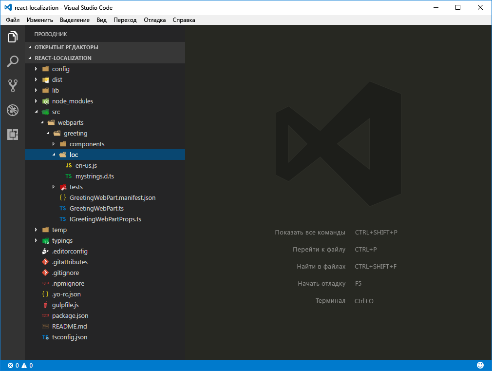

# <a name="localize-sharepoint-framework-client-side-web-parts"></a>Локализация клиентских веб-частей SharePoint Framework

Вы можете увеличить привлекательность клиентской веб-части SharePoint Framework, локализовав ее для пользователей SharePoint по всему миру. В этой статье показано, как локализовать веб-часть на нидерландский язык (Нидерланды) и проверить, отображаются ли правильно локализованные значения.

> [!NOTE] 
> Прежде чем выполнять действия, описанные в этой статье, [настройте среду разработки для создания клиентских веб-частей SharePoint](../../set-up-your-development-environment.md).

## <a name="prepare-the-project"></a>Подготовка проекта

### <a name="create-a-new-project"></a>Создание проекта

Для начала создайте папку проекта.

```sh
md react-localization
```

Перейдите в папку проекта.

```sh
cd react-localization
```

В папке проекта запустите генератор Yeoman для SharePoint Framework, чтобы сформировать шаблон проекта на платформе SharePoint Framework.

```sh
yo @microsoft/sharepoint
```

Когда отобразится соответствующий запрос, введите следующие значения:

- **react-localization** в качестве имени решения;
- **SharePoint Online only (latest)** (Только SharePoint Online, последняя версия) в качестве набора базовых пакетов;
- **Use the current folder** (Использовать текущую папку) в качестве расположения файлов;
- **y** для того, чтобы можно было выполнять развертывание на уровне клиента;
- **WebPart** (Веб-часть) в качестве типа создаваемого компонента;
- **Greeting** (Приветствие) в качестве имени веб-части;
- **Greets the user** (Приветствие пользователя) в качестве описания веб-части;
- **React** в качестве отправной точки создания веб-части.


После завершения скаффолдинга блокируйте версию зависимостей проекта, выполнив следующую команду:

```sh
npm shrinkwrap
```

Далее откройте папку проекта в редакторе кода. В инструкциях и на снимках экрана из этой статьи указан Visual Studio Code, но вы можете использовать любой редактор.


### <a name="replace-the-default-code"></a>Замена кода по умолчанию

В редакторе кода откройте файл **./src/webparts/greeting/GreetingWebPart.ts** и обновите определение интерфейса `IGreetingWebPartProps`, добавив следующий код:

```ts
export interface IGreetingWebPartProps {
  greeting: string;
}
```

Далее измените класс **GreetingWebPart** в том же файле, указав следующее:

```ts
export default class GreetingWebPart extends BaseClientSideWebPart<IGreetingWebPartProps> {

  public render(): void {
    const element: React.ReactElement<IGreetingProps > = React.createElement(
      Greeting,
      {
        greeting: this.properties.greeting
      }
    );

    ReactDom.render(element, this.domElement);
  }

  protected get dataVersion(): Version {
    return Version.parse('1.0');
  }

  protected getPropertyPaneConfiguration(): IPropertyPaneConfiguration {
    return {
      pages: [
        {
          header: {
            description: strings.PropertyPaneDescription
          },
          groups: [
            {
              groupName: strings.DisplayGroupName,
              groupFields: [
                PropertyPaneTextField('greeting', {
                  label: strings.GreetingFieldLabel
                })
              ]
            }
          ]
        }
      ]
    };
  }
}
```

Обновите основной компонент React, открыв файл **./src/webparts/greeting/components/Greeting.tsx** и заменив код на следующий:

```ts
import * as React from 'react';
import styles from './Greeting.module.scss';
import { IGreetingProps } from './IGreetingProps';
import { escape } from '@microsoft/sp-lodash-subset';

export default class Greeting extends React.Component<IGreetingProps, {}> {
  public render(): JSX.Element {
    return (
      <div className={styles.greeting}>
        <div className={styles.container}>
          <div className={`ms-Grid-row ms-bgColor-themeDark ms-fontColor-white ${styles.row}`}>
            <div className="ms-Grid-col ms-u-lg10 ms-u-xl8 ms-u-xlPush2 ms-u-lgPush1">
              <span className='ms-font-xl ms-fontColor-white'>
                Welcome to SharePoint!
              </span>
              <p className='ms-font-l ms-fontColor-white'>
                Customize SharePoint experiences using Web Parts.
              </p>
              <p className='ms-font-l ms-fontColor-white'>
                {escape(this.props.greeting)}
              </p>
              <a href="https://aka.ms/spfx" className={styles.button}>
                <span className={styles.label}>Learn more</span>
              </a>
            </div>
          </div>
        </div>
      </div>
    );
  }
}
```

Обновите интерфейс основного компонента React, открыв файл **./src/webparts/greeting/components/IGreetingProps.tsx** и заменив код на следующий:

```tsx
import { IGreetingWebPartProps } from '../GreetingWebPart';

export interface IGreetingProps extends IGreetingWebPartProps {
}
```

Обновите файл определения типа локализации TypeScript, открыв файл **./src/webparts/greeting/loc/mystrings.d.ts** и заменив код на следующий:

```ts
declare interface IGreetingWebPartStrings {
  PropertyPaneDescription: string;
  DisplayGroupName: string;
  GreetingFieldLabel: string;
}

declare module 'GreetingWebPartStrings' {
  const strings: IGreetingWebPartStrings;
  export = strings;
}
```

Обновите файл английского языка (США), открыв файл **./src/webparts/greeting/loc/en-us.js** и заменив код на следующий:

```js
define([], function() {
  return {
    "PropertyPaneDescription": "Greeting web part configuration",
    "DisplayGroupName": "Display",
    "GreetingFieldLabel": "Greeting to show in the web part"
  }
});
```

В манифесте веб-части обновите значение по умолчанию для свойства **greeting**, открыв файл **./src/webparts/greeting/GreetingWebPart.manifest.json** и заменив раздел **properties** на следующий:

```json
{
  // ...
  "preconfiguredEntries": [{
    "groupId": "5c03119e-3074-46fd-976b-c60198311f70", // Other
    "group": { "default": "Other" },
    "title": { "default": "Greeting" },
    "description": { "default": "Greets the user" },
    "officeFabricIconFontName": "Page",
    "properties": {
      "greeting": "Hello"
    }
  }]
}
```

Проверьте, правильно ли применили все изменения, с помощью следующей команды:

```sh
gulp serve
```

В среде разработки SharePoint добавьте веб-часть на страницу и откройте ее конфигурацию.


## <a name="localize-the-web-part-manifest"></a>Локализация манифеста веб-части

Каждая клиентская веб-часть SharePoint Framework состоит из кода и манифеста. Манифест содержит сведения о веб-части, например название, описание и значок. При добавлении веб-части на страницу пользователи видят сведения из манифеста веб-части. Благодаря этой информации они могут решить, нужна ли им данная веб-часть. Название и описание должны правильно отражать функциональность веб-части, если вы хотите, чтобы ею пользовались. Если веб-часть будет использоваться на сайтах не на английском языке, локализация метаданных сделает ее еще удобнее для пользователей.

В манифесте веб-части можно указывать локализованные значения некоторых свойств, например названия и описания. Полный список всех свойств манифеста веб-части, поддерживающих локализацию, см. в статье [Упрощенное добавление веб-частей с помощью предварительно настроенных записей](./simplify-adding-web-parts-with-preconfigured-entries.md#properties-of-a-preconfiguredentries-array-item). Свойства, поддерживающие локализацию, имеют тип **ILocalizedString**. Для каждой локализованной строки должно быть указано по крайней мере значение по умолчанию (при необходимости можно указать значения для других языковых стандартов).

### <a name="add-localized-values-for-title-description-and-group-name"></a>Добавление локализованных значений для названия, описания и имени группы

Откройте в редакторе кода файл **./src/webparts/greeting/GreetingWebPart.manifest.json**. В массиве **preconfiguredEntries** добавьте переводы для свойств **title**, **description** и **group** на нидерландском языке (Нидерланды), заменив код на следующий:

```json
{
  // ...
  "preconfiguredEntries": [{
    "groupId": "5c03119e-3074-46fd-976b-c60198311f70", // Other
    "group": { "default": "Other", "nl-nl": "Anders" },
    "title": { "default": "Greeting", "nl-nl": "Begroeting" },
    "description": { "default": "Greets the user", "nl-nl": "Begroet de gebruiker" },
    "officeFabricIconFontName": "Page",
    "properties": {
      "greeting": "Hello"
    }
  }]
}
```

Чтобы проверить, работает ли проект, выполните следующую команду:

```sh
gulp serve
```

> [!NOTE] 
> К сожалению, в настоящее время в среде разработки SharePoint нельзя просматривать локализованные значения из манифеста веб-части. Всегда используется перевод по умолчанию.

## <a name="localize-the-web-part-property-pane"></a>Локализация области свойств веб-части

Пользователям часто приходится настраивать веб-часть для своих потребностей. Подписав параметры конфигурации, вы можете сделать веб-часть удобнее для пользователей и уменьшить количество обращений в службу поддержки за помощью в настройке.

Область свойств веб-части состоит из разделов. Каждый раздел имеет заголовок и один или несколько элементов, с помощью которых пользователи могут настраивать веб-часть. Каждый из этих элементов содержит описание его назначения. По умолчанию веб-части загружают строковые подписи из файла ресурсов JavaScript. Если вы создавали классические веб-части с помощью решений с полным доверием, они похожи на файлы ресурсов RESX. Не обязательно использовать эти файлы ресурсов, а строки можно включать непосредственно в код. Однако настоятельно рекомендуем применять такие файлы. Немного дополнительных служебных данных — ничего по сравнению с усилиями, необходимыми для извлечения всех подписей, если впоследствии вам потребуется перевести веб-часть.

Файлы локализации, используемые веб-частью, хранятся в папке **./src/webparts/greeting/loc**.



Папка **loc** содержит файл определения типа TypeScript (**./src/webpart/greeting/loc/mystrings.d.ts**), который сообщает TypeScript о различных строках в локализованных файлах. На основе сведений из этого файла редактор кода может предоставлять подсказки IntelliSense при работе со строками в коде. Кроме того, при сборке проекта TypeScript может проверять, не ссылаетесь ли вы на неопределенные строки.


Переведенные строки для каждого языкового стандарта, поддерживаемого веб-частью, содержатся в обычном файле JavaScript (не TypeScript) с именем в нижнем регистре (например, **en-us.js**).


> **Важно!** Уделяйте особое внимание проверке того, чтобы все ключи, указанные в файле определения типа TypeScript как локализуемые, были переведены во всех файлах локализации JavaScript.

en-US — это языковой стандарт SharePoint Framework по умолчанию. Если языковой стандарт сайта не поддерживается веб-частью, SharePoint Framework использует языковой стандарт по умолчанию (en-US). Чтобы переопределить этот параметр, создайте файл языкового стандарта **default.js** с текстами перевода на предпочитаемые языки. Имя **default.js** не соответствует соглашению об именовании языковых стандартов, но оно дает указание SharePoint Framework использовать этот файл языкового стандарта, а не английский язык (США).

### <a name="add-localized-values-for-web-part-property-pane-strings"></a>Добавление локализованных значений для строк области свойств веб-части

В папке **./src/webparts/greetings/loc** создайте файл **nl-nl.js** и введите следующий код:

```js
define([], function() {
  return {
    "PropertyPaneDescription": "Instellingen van het begroeting webonderdeel",
    "DisplayGroupName": "Weergave",
    "GreetingFieldLabel": "Begroeting die in het webonderdeel getoond wordt"
  }
});
```

Убедитесь, что ключи в файле определения типа TypeScript для локализации соответствуют содержимому файлов языковых стандартов в случае английского (США) и нидерландского (Нидерланды) языков.


### <a name="verify-the-localized-web-part-property-pane-strings"></a>Проверка локализованных строк в области свойств веб части

При проверке веб-частей с помощью размещенной версии среды разработки SharePoint или сайтов группы на клиенте разработчика по умолчанию используется языковой стандарт сайта контекста, выраженный свойством **spPageContextInfo.currentUICultureName**. При проверке веб-частей с помощью локальной среды разработки SharePoint Framework по умолчанию использует языковой стандарт en-US для отображения строк области свойств веб-части. Проверить значения из других языковых стандартов, поддерживаемых веб-частью, можно двумя способами.

#### <a name="specify-the-locale-to-be-tested-in-the-project-configuration"></a>Указание проверяемого языкового стандарта в конфигурации проекта

Чтобы указать проверяемый языковой стандарт в среде разработки SharePoint, можно изменить конфигурацию проекта. Этот способ удобен, если вы и ваши коллеги работаете с языковым стандартом в течение долгого времени, или вы создаете веб-часть, которая не поддерживает английский язык (США). В редакторе кода откройте файл **./config/write-manifests.json** и измените его код на следующий:

```json
{
  "cdnBasePath": "<!-- PATH TO CDN -->",
  "debugLocale": "nl-nl"
}
```

Запустите среду разработки SharePoint с помощью следующей команды:

```sh
gulp serve
```

Когда вы добавите веб-часть на страницу и откроете ее конфигурацию, то увидите, что строки в области свойств веб-части отображаются на нидерландском языке (Нидерланды).


#### <a name="specify-the-locale-to-be-tested-using-the-command-line-argument"></a>Указание проверяемого языкового стандарта с помощью аргумента командной строки

Еще один способ указать языковой стандарт, который будет использоваться локальной средой разработки SharePoint, — указать его в качестве аргумента задачи gulp. Запустите среду разработки SharePoint с помощью следующей команды:

```sh
gulp serve --locale=nl-nl
```

Когда вы откроете конфигурацию веб-части, то увидите, что все строки в области свойств отображаются на нидерландском (Нидерланды), а не на английском языке (США) по умолчанию.


## <a name="localize-web-part-contents"></a>Локализация содержимого веб-части

Так же как строки в области свойств веб части, необходимо локализовать все строки, отображаемые в веб-части. Вы можете воспользоваться тем же способом. Добавьте ключ в файле определения TypeScript для каждой локализуемой строки и переведите ее на каждый из поддерживаемых языков в файле JavaScript соответствующего языкового стандарта.

### <a name="globalize-the-web-part-strings"></a>Глобализация строк веб-части

Строки стандартной веб-части, указанной в проекте SharePoint Framework, для которого выполнен скаффолдинг, внедрены в код. Прежде чем локализовать эти строки, необходимо заменить их на ссылки на локализованные строки. Этот процесс часто называется **глобализацией** или **интернационализацией** (или просто **i18n**).

В редакторе кода откройте файл **./src/webparts/greeting/components/Greetings.tsx**. В верхней части файла, сразу же после последнего оператора `import`, добавьте ссылку на локализованные строки:

```ts
import * as strings from 'GreetingWebPartStrings';
```

После этого замените содержимое класса **Greeting** на следующий код:

```ts
// ...
export default class Greeting extends React.Component<IGreetingProps, {}> {
  public render(): JSX.Element {
    return (
      <div className={styles.greeting}>
        <div className={styles.container}>
          <div className={`ms-Grid-row ms-bgColor-themeDark ms-fontColor-white ${styles.row}`}>
            <div className="ms-Grid-col ms-u-lg10 ms-u-xl8 ms-u-xlPush2 ms-u-lgPush1">
              <span className='ms-font-xl ms-fontColor-white'>
                Welcome to SharePoint!
              </span>
              <p className='ms-font-l ms-fontColor-white'>
                Customize SharePoint experiences using Web Parts.
              </p>
              <p className='ms-font-l ms-fontColor-white'>
                {escape(this.props.greeting)}
              </p>
              <a href="https://aka.ms/spfx" className={styles.button}>
                <span className={styles.label}>{strings.LearnMoreButtonLabel}</span>
              </a>
            </div>
          </div>
        </div>
      </div>
    );
  }
}
```

### <a name="add-the-new-string-to-the-localization-typescript-type-definition-file"></a>Добавление новой строки в файл определения типа локализации TypeScript

После замены строки на ссылку нужно добавить эту строку в файлы локализации, используемые веб-частью. В редакторе кода откройте файл **./src/webparts/greetings/loc/mystrings.d.ts** и измените его код на следующий:

```ts
declare interface IGreetingWebPartStrings {
  PropertyPaneDescription: string;
  DisplayGroupName: string;
  GreetingFieldLabel: string;
  LearnMoreButtonLabel: string;
}

declare module 'greetingStrings' {
  const strings: IGreetingWebPartStrings;
  export = strings;
}

```

### <a name="add-localized-values-for-the-new-string"></a>Добавление локализованных значений для новой строки

Вам осталось лишь указать локализованные версии для новой строки во всех языковых стандартах, поддерживаемых веб-частью. В редакторе кода откройте файл **./src/webparts/greeting/loc/en-us.js** и измените его код на следующий:

```js
define([], function() {
  return {
    "PropertyPaneDescription": "Greeting web part configuration",
    "DisplayGroupName": "Display",
    "GreetingFieldLabel": "Greeting to show in the web part",
    "LearnMoreButtonLabel": "Learn more"
  }
});
```

После этого откройте файл **./src/webparts/greeting/loc/nl-nl.js** и измените его код на следующий:

```js
define([], function() {
  return {
    "PropertyPaneDescription": "Instellingen van het begroeting webonderdeel",
    "DisplayGroupName": "Weergave",
    "GreetingFieldLabel": "Begroeting die in het webonderdeel getoond wordt",
    "LearnMoreButtonLabel": "Meer informatie"
  }
});
```

Проверьте, правильно ли отображается переведенная строка, с помощью следующей команды:

```sh
gulp serve --locale=nl-nl
```


## <a name="improve-globalizing-and-localizing-web-parts-using-pseudo-locales"></a>Как улучшить глобализацию и локализацию веб-частей с помощью языковых псевдостандартов

Локализация веб-частей обеспечивает явные преимущества, но разработчики часто ей пренебрегают. Часто переводы добавляются в конце проекта, и тест-инженерам трудно проверить, весь ли код должным образом поддерживает языковые стандарты.

Слова в разных языках имеют разную длину. Например, предложение, переведенное с английского на немецкий или нидерландский, может стать на 35 % длиннее. Не все переводы доступны заранее, поэтому разработчикам трудно адаптировать пользовательский интерфейс под длинные строки.

В некоторых языках используются специальные знаки, кроме стандартного набора символов ASCII. Если разработчики используют нестандартный шрифт, некоторые специальные знаки могут не поддерживаться.

Если вы узнаете обо всех этих проблемах в конце проекта, скорее всего, возникнут задержки и понадобятся дорогостоящие исправления. SharePoint Framework позволяет разработчикам использовать языковые псевдостандарты, чтобы решить эти проблемы при создании веб-частей.

> **Что такое языковые псевдостандарты?** Языковые псевдостандарты —это языковые стандарты, предназначенные для проверки поддержки специальных знаков, языков с письмом справа налево, размещения длинных строк в пользовательском интерфейсе и других аспектов локализации.

### <a name="add-the-base-pseudo-locale"></a>Добавление базового языкового псевдостандарта

В папке **./src/webparts/greeting/loc** добавьте новый файл **qps ploc.js** и вставьте следующий код:

```js
define([], function() {
  return {
    "PropertyPaneDescription": "[!!! Gřèèƭïñϱ ωèβ ƥářƭ çôñƒïϱúřáƭïôñ ℓôřè₥ ïƥƨú !!!]",
    "DisplayGroupName": "[!!! Ðïƨƥℓᥠℓ !!!]",
    "GreetingFieldLabel": "[!!! Gřèèƭïñϱ ƭô ƨλôω ïñ ƭλè ωèβ ƥářƭ ℓôřè₥ ïƥƨú !!!]",
    "LearnMoreButtonLabel": "[!!! £èářñ ₥ôřè ℓôř !!!]"
  }
});
```

> **Совет.** Вы можете преобразовать строки на английском языке (США) в базовый языковой псевдостандарт на сайте [http://www.pseudolocalize.com](http://www.pseudolocalize.com). Увеличив длину сгенерированной строки на 35 %, можно смоделировать длину строк, переведенных на языки, для которых характерны более длинные строки, например немецкий или нидерландский. Кроме того, заключив переводы в скобки и восклицательные знаки, вам будет проще понять, помещается ли на экране вся строка.

Проверьте проект с помощью базового языкового псевдостандарта, выполнив следующую команду:

```sh
gulp serve --locale=qps-ploc
```

После добавления веб-части на страницу вы сразу увидите, что две строки в веб-части не интернационализированы и отображаются на английском языке (США), а не на базовом языковом псевдостандарте.


Если вы откроете область свойств веб-части, то увидите, что все строки и специальные знаки отображаются правильно и помещаются в отведенном для них месте.


## <a name="localize-web-part-settings-values"></a>Локализация значений параметров веб-части

Microsoft SharePoint поддерживает многоязычный пользовательский интерфейс (MUI), когда администратор сайта может включить несколько языков интерфейса. Сайт будет автоматически отображаться на языке, выбранном пользователем.

Веб-части, используемые на многоязычных сайтах, должны автоматически определять текущий язык и отображать содержимое на этом языке. SharePoint Framework упрощает этот процесс, автоматически загружая файл ресурсов, соответствующий текущему языку. Кроме того, при проверке веб-частей SharePoint Framework с помощью размещенной версии среды разработки SharePoint также автоматически используется язык, выбранный пользователем.

Значения, настроенные с помощью свойств веб-части, не хранятся в файлах ресурсов. По умолчанию настроенное значение используется как есть, что может привести к несоответствиям, например отображению приветствия на английском языке, когда выбранный пользователем язык — голландский.


Используя стандартные блоки, доступные в SharePoint Framework, вы можете добавить поддержку хранения значений конфигурации на нескольких языках. Для каждого из поддерживаемых языков в области свойств будет отображаться текстовое поле, в котором пользователь может ввести переведенное значение этого свойства.


> [!NOTE] 
> Для проверки веб-части, показанной в этой статье, используется многоязычный веб-сайт SharePoint с поддержкой английского (США), нидерландского и немецкого языков. Дополнительные сведения о включении дополнительных языков на сайтах SharePoint см. в статье [Выбор языков, которые должны быть доступны для пользовательского интерфейса сайта](https://support.office.com/ru-RU/article/Choose-the-languages-you-want-to-make-available-for-a-site-s-user-interface-16d3a83c-05ab-4b50-8fbb-ff576a3351e8).

### <a name="add-list-of-languages-supported-by-sharepoint-online"></a>Добавление списка языков, которые поддерживаются в SharePoint Online

Список языков, включенных на многоязычном сайте SharePoint, возвращается в виде массива кодов языка. Например, английский язык (США) указывается как **1033**. Однако текущий язык возвращается в виде строки. Например, английский язык (США) указывается как **en-US**. Так как JavaScript не преобразовывает код языка в имя языкового стандарта и наоборот автоматически, вам нужно делать это самим.

В редакторе кода откройте файл **./src/webparts/greeting/GreetingWebPart.ts** и добавьте новую переменную класса **locales** в **GreetingWebPart** со следующим кодом:

```ts
export default class GreetingWebPart extends BaseClientSideWebPart<IGreetingWebPartProps> {
  private locales = {
    1025: 'ar-SA',
    1026: 'bg-BG',
    1027: 'ca-ES',
    1028: 'zh-TW',
    1029: 'cs-CZ',
    1030: 'da-DK',
    1031: 'de-DE',
    1032: 'el-GR',
    1033: 'en-US',
    1035: 'fi-FI',
    1036: 'fr-FR',
    1037: 'he-IL',
    1038: 'hu-HU',
    1040: 'it-IT',
    1041: 'ja-JP',
    1042: 'ko-KR',
    1043: 'nl-NL',
    1044: 'nb-NO',
    1045: 'pl-PL',
    1046: 'pt-BR',
    1048: 'ro-RO',
    1049: 'ru-RU',
    1050: 'hr-HR',
    1051: 'sk-SK',
    1053: 'sv-SE',
    1054: 'th-TH',
    1055: 'tr-TR',
    1057: 'id-ID',
    1058: 'uk-UA',
    1060: 'sl-SI',
    1061: 'et-EE',
    1062: 'lv-LV',
    1063: 'lt-LT',
    1066: 'vi-VN',
    1068: 'az-Latn-AZ',
    1069: 'eu-ES',
    1071: 'mk-MK',
    1081: 'hi-IN',
    1086: 'ms-MY',
    1087: 'kk-KZ',
    1106: 'cy-GB',
    1110: 'gl-ES',
    1164: 'prs-AF',
    2052: 'zh-CN',
    2070: 'pt-PT',
    2074: 'sr-Latn-CS',
    2108: 'ga-IE',
    3082: 'es-ES',
    5146: 'bs-Latn-BA',
    9242: 'sr-Latn-RS',
    10266: 'sr-Cyrl-RS',
  };

  // ...
}
```

В переменной **locales** указаны все языки, поддерживаемые в SharePoint Online.

После этого добавьте два метода class, которые позволяют преобразовывать имя языкового стандарта в код языка и наоборот:

```ts
export default class GreetingWebPart extends BaseClientSideWebPart<IGreetingWebPartProps> {
  // ...

  private getLocaleId(localeName: string): number {
    const pos: number = (Object as any).values(this.locales).indexOf(localeName);
    if (pos > -1) {
      return parseInt(Object.keys(this.locales)[pos]);
    }
    else {
      return 0;
    }
  }

  private getLocaleName(localeId: number): string {
    const pos: number = Object.keys(this.locales).indexOf(localeId.toString());
    if (pos > -1) {
      return (Object as any).values(this.locales)[pos];
    }
    else {
      return '';
    }
  }
}
```

### <a name="remove-the-standard-greeting-web-part-property"></a>Удаление стандартного свойства веб-части greeting

Изначально свойство **greeting** веб-части Greeting было определено, и пользователь мог указать приветствие, которое будет отображаться на экране. Чтобы веб-часть работала на многоязычных сайтах SharePoint, нужно хранить несколько значений; по одному для каждого языка. Так как вы не знаете заранее, какие языки будут включены на сайте, вы будете динамически генерировать свойства веб-части в среде выполнения, а не использовать одно статическое свойство веб-части.

В редакторе кода откройте файл **./src/webparts/greeting/GreetingWebPart.manifest.json** и удалите свойство **greeting** из свойства **properties**:

```json
{
  // ...

  "preconfiguredEntries": [{
    "groupId": "5c03119e-3074-46fd-976b-c60198311f70", // Other
    "group": { "default": "Other", "nl-nl": "Anders" },
    "title": { "default": "Greeting", "nl-nl": "Begroeting" },
    "description": { "default": "Greets the user", "nl-nl": "Begroet de gebruiker" },
    "officeFabricIconFontName": "Page",
    "properties": {
    }
  }]
}
```

После этого откройте файл **./src/webparts/greeting/GreetingWebPart.ts** и удалите свойство **greeting** из определения интерфейса `IGreetingWebPartProps`:

```ts
export interface IGreetingWebPartProps {
}
```

Так как основной компонент React должен отображать приветствие, откройте файл **./src/webparts/greeting/components/IGreetingProps.ts** и замените интерфейс **IGreetingProps** следующим:

```ts
export interface IGreetingProps {
  greeting: string;
}
```

Это изменение позволяет передать приветствие из веб-части в компонент React.

### <a name="display-property-pane-text-fields-for-all-enabled-languages"></a>Отображение текстовых полей области свойств для всех включенных языков

Изначально пользователь мог настроить приветствие с помощью конфигурации веб-части. Пользователь мог настроить одно значение, отображаемое для всех пользователей, независимо от их предпочитаемого языка. Получая список языков, включенных на текущем сайте, вы можете динамически отображать текстовые поля, чтобы пользователь мог добавлять в них переводы.

#### <a name="load-information-about-languages-enabled-in-the-current-site"></a>Загрузка сведений о языках, включенных на текущем сайте

Прежде всего нужно загрузить сведения обо всех языках, включенных на текущем сайте. В редакторе кода откройте файл **./src/webparts/greeting/GreetingWebPart.ts** и добавьте новую переменную класса **supportedLanguageIds**:

```ts
export default class GreetingWebPart extends BaseClientSideWebPart<IGreetingWebPartProps> {
  // ...
  private supportedLanguageIds: number[];
  // ...
}
```

Так как мы будем запрашивать данные в SharePoint, будем использовать HTTP-клиент SharePoint для выполнения операций. Добавьте указанные ниже операции импорта прямо перед **GreetingWebPart**.

```ts
import {
  SPHttpClient,
  SPHttpClientResponse
} from '@microsoft/sp-http';
```

После этого в классе **GreetingWebPart** добавьте новый метод **getSupportedLanguageIds**:

```ts
export default class GreetingWebPart extends BaseClientSideWebPart<IGreetingWebPartProps> {
  // ...

  private getSupportedLanguageIds(): Promise<number[]> {
    return new Promise<number[]>((resolve: (supportedLanguageIds: number[]) => void, reject: (error: any) => void): void => {
      if (this.supportedLanguageIds) {
        resolve(this.supportedLanguageIds);
        return;
      }

      this.context.spHttpClient.get(this.context.pageContext.web.absoluteUrl + '/_api/web?$select=SupportedUILanguageIds', SPHttpClient.configurations.v1)
      .then((response: SPHttpClientResponse): Promise<{ SupportedUILanguageIds: number[] }> => {
        return response.json();
      }).then((siteInfo: { SupportedUILanguageIds: number[] }): void => {
        this.supportedLanguageIds = siteInfo.SupportedUILanguageIds;
        resolve(siteInfo.SupportedUILanguageIds);
      }, (error: any): void => {
        reject(error);
      });
    });
  }
}
```

Список языков, включенных на текущем сайте, необходимо загрузить только один раз. Если сведения о языках еще не загружены, метод использует стандартный HTTP-клиент SharePoint Framework для вызова REST API SharePoint и получения сведений о языках, включенных на текущем сайте.

#### <a name="dynamically-render-text-fields-for-all-languages"></a>Динамическая отрисовка текстовых полей для всех языков

Теперь, когда вы можете получать сведения о языках, включенных на текущем сайте, для каждого из них будут отображаться текстовые поля, в которых пользователь сможет указать переводы приветствия.

В редакторе кода откройте файл **./src/webparts/greeting/GreetingWebPart.ts** и добавьте новую переменную класса **greetingFields** в класс **GreetingWebPart**:

```ts
export default class GreetingWebPart extends BaseClientSideWebPart<IGreetingWebPartProps> {
  // ...
  private greetingFields: IPropertyPaneField<any>[] = [];
  // ...
}
```

Измените оператор **import** для пакета **@microsoft/sp-webpart-base** на следующий:

```ts
import {
  BaseClientSideWebPart,
  IPropertyPaneConfiguration,
  PropertyPaneTextField,
  IPropertyPaneField
} from '@microsoft/sp-webpart-base';
```

Измените метод **propertyPaneSettings**, чтобы получить список текстовых полей из новой переменной класса **greetingFields**:

```ts
export default class GreetingWebPart extends BaseClientSideWebPart<IGreetingWebPartProps> {
  // ...

    protected getPropertyPaneConfiguration(): IPropertyPaneConfiguration {
    return {
      pages: [
        {
          header: {
            description: strings.PropertyPaneDescription
          },
          groups: [
            {
              groupName: strings.GreetingGroupName,
              groupFields: this.greetingFields
            }
          ]
        }
      ]
    };
  }

  // ...
}
```

Если на сайте включено несколько языков, в веб-части будет отображаться несколько полей, в которых пользователь сможет ввести приветствие. Чтобы дать понять, что эти поля связаны друг с другом, поместите их в отдельную группу. В редакторе кода откройте файл **./src/webparts/greeting/loc/mystrings.d.ts** и измените его код на следующий:

```ts
declare interface IGreetingWebPartStrings {
  PropertyPaneDescription: string;
  GreetingGroupName: string;
  LearnMoreButtonLabel: string;
}

declare module 'GreetingWebPartStrings' {
  const strings: IGreetingWebPartStrings;
  export = strings;
}
```

Обновите файлы ресурсов соответствующим образом, чтобы указать значения строки **GreetingGroupName**.

**./src/webparts/greeting/loc/en-us.js**:

```js
define([], function() {
  return {
    "PropertyPaneDescription": "Greeting web part configuration",
    "GreetingGroupName": "Greeting to show in the web part",
    "LearnMoreButtonLabel": "Learn more"
  }
});
```

**./src/webparts/greeting/loc/nl-nl.js**:

```js
define([], function() {
  return {
    "PropertyPaneDescription": "Instellingen van het begroeting webonderdeel",
    "GreetingGroupName": "Begroeting die in het webonderdeel getoond wordt",
    "LearnMoreButtonLabel": "Meer informatie"
  }
});
```

**./src/webparts/greeting/loc/qps-ploc.js**:

```js
define([], function() {
  return {
    "PropertyPaneDescription": "[!!! Gřèèƭïñϱ ωèβ ƥářƭ çôñƒïϱúřáƭïôñ ℓôřè₥ ïƥƨú !!!]",
    "GreetingGroupName": "[!!! Gřèèƭïñϱ ƭô ƨλôω ïñ ƭλè ωèβ ƥářƭ ℓôřè₥ ïƥƨú !!!]",
    "LearnMoreButtonLabel": "[!!! £èářñ ₥ôřè ℓôř !!!]"
  }
});
```

В файле **./src/webparts/greeting/GreetingWebPart.ts** переопределите метод **onPropertyPaneConfigurationStart** с помощью кода:

```ts
export default class GreetingWebPart extends BaseClientSideWebPart<IGreetingWebPartProps> {
  // ...
  protected onPropertyPaneConfigurationStart(): void {
    this.context.statusRenderer.displayLoadingIndicator(this.domElement, 'languages');

    this.getSupportedLanguageIds()
      .then((supportedLanguageIds: number[]): void => {
        this.greetingFields = [];
        supportedLanguageIds.forEach(localeId => {
          this.greetingFields.push(PropertyPaneTextField(`greeting_${localeId}`, {
            label: this.getLocaleName(localeId)
          }));
        });

        this.context.propertyPane.refresh();
        this.context.statusRenderer.clearLoadingIndicator(this.domElement);
        this.render();
      });
  }
}
```

Когда пользователь откроет область свойств веб-части, метод загрузит сведения о языках, включенных на текущем сайте. Так как загрузка этих сведений может занять некоторое время, метод отображает индикатор загрузки. После загрузки сведений о включенных языках метод создает текстовое поле области свойств, связанное с динамическим свойством веб-части **greeting__lcid_**. Например, **greeting_1033** для английского языка (США).

Когда текстовые поля для всех включенных языков созданы, метод обновляет область свойств, вызывая метод **IPropertyPaneAccessor.refresh**. После этого метод удаляет индикатор загрузки и обновляет веб-часть.


### <a name="show-the-greeting-for-the-preferred-user-language"></a>Отображение приветствия на выбранном пользователем языке

Изначально в веб-части отображалось одинаковое приветствие для всех пользователей, независимо от их предпочитаемого языка. Теперь, когда в веб-части сохранены различные переводы приветствия, оно должно отображаться на языке, выбранном текущим пользователем.

В файле **./src/webparts/greeting/GreetingWebPart.ts** измените метод **render** веб-части на следующий:

```ts
export default class GreetingWebPart extends BaseClientSideWebPart<IGreetingWebPartProps> {
  // ...

  public render(): void {
    const element: React.ReactElement<IGreetingProps> = React.createElement(Greeting, {
      greeting: this.getGreeting()
    });

    ReactDom.render(element, this.domElement);
  }
}
```

После этого в классе **GreetingWebPart** добавьте новый метод **getGreeting**:

```ts
export default class GreetingWebPart extends BaseClientSideWebPart<IGreetingWebPartProps> {
  // ...

  private getGreeting(): string {
    let localeId: number = this.getLocaleId(this.context.pageContext.cultureInfo.currentUICultureName);
    if (localeId === 0) {
      localeId = 1033;
    }

    return this.properties[`greeting_${localeId}`];
  }

  // ...
}
```

Этот метод возвращает текущий язык и преобразует его в код языка. Затем он возвращает значение свойства greeting, переведенное на этот язык.

## <a name="localization-in-different-build-types"></a>Локализация в различных типах сборки

В зависимости от выбранного режима сборки SharePoint Framework обрабатывает файлы локализации по-разному. Ниже перечислены некоторые отличия между файлами, созданными в отладочной сборке и сборке выпуска.

### <a name="localization-files-in-the-debug-build"></a>Файлы локализации в отладочной сборке

При сборке проектов SharePoint Framework в режиме отладки в манифест веб-части включаются только сведения о языковом стандарте по умолчанию. В режиме отладки SharePoint Framework использует языковой стандарт en-US по умолчанию или языковой стандарт, указанный в настройках проекта или с помощью аргумента командной строки **locale**. Файлы ресурсов с переведенными строками не включаются в папку **dist**. Они загружаются в среде выполнения из промежуточной папки **lib** с использованием пути в манифесте веб-части.

Проверив сведения о модуле **GreetingWebPartStrings** в манифесте веб-части, созданном во время отладочной сборки, вы увидите, что несмотря на различные языковые стандарты, поддерживаемые веб-частью (en-US, nl-NL и qps-ploc), по умолчанию используется путь к файлу ресурсов en-US, хранящемуся в промежуточной папке.

```json
{
  "id": "edbc4e31-6085-4ffa-85f4-eeffcb0ea2d4",
  "alias": "GreetingWebPart",
  "componentType": "WebPart",
  "version": "0.0.1",
  "manifestVersion": 2,
  // ...
  "loaderConfig": {
    "entryModuleId": "greeting-web-part",
    "internalModuleBaseUrls": [
      "https://localhost:4321/"
    ],
    "scriptResources": {
      "greeting-web-part": {
        "type": "path",
        "path": "dist/greeting-web-part.js"
      },
      "GreetingWebPartStrings": {
        "defaultPath": "lib/webparts/greeting/loc/en-us.js",
        "type": "localizedPath",
        "paths": {
          "en-US": "lib/webparts/greeting/loc/en-us.js",
          "nl-NL": "lib/webparts/greeting/loc/nl-nl.js",
          "qps-ploc": "lib/webparts/greeting/loc/qps-ploc.js"
        }
      },
      // ...
    }
  }
}
```

### <a name="localization-files-in-the-release-build"></a>Файлы локализации в сборке выпуска

При сборке проектов SharePoint Framework в режиме выпуска в манифест веб-части включаются сведения обо всех доступных языковых стандартах. Кроме того, ресурсы для каждого языкового стандарта хранятся в отдельном файле. Эти файлы ресурсов вместе с манифестом и пакетом веб-части копируются в папку **./temp/deploy**.

> **Важно!** В сборках выпуска файлы ресурсов копируются только в папку **./temp/deploy** и не копируются в папку **./dist**. При развертывании веб-части в рабочей среде всегда следует использовать файлы из папки **./temp/deploy**. Тогда точно будут развернуты все файлы, необходимые для веб-части.

Проверив последний манифест веб-части, созданный в сборке выпуска, вы увидите, что теперь модуль **GreetingWebPartStrings** содержит ссылки на все поддерживаемые языковые стандарты.

```json
{
  "id": "edbc4e31-6085-4ffa-85f4-eeffcb0ea2d4",
  "alias": "GreetingWebPart",
  "componentType": "WebPart",
  "version": "0.0.1",
  "manifestVersion": 2,
  // ...
  "loaderConfig": {
    "entryModuleId": "greeting-web-part",
    "internalModuleBaseUrls": [
      "https://cdn.contoso.com/"
    ],
    "scriptResources": {
      "greeting-web-part": {
        "type": "path",
        "path": "greeting-web-part_159d9eb591c6716cae6d0ff15b78a19a.js"
      },
      "GreetingWebPartStrings": {
        "defaultPath": "react-localization-greetingwebpartstrings_en-us_b5e89eba6e8d819bf1647b3ab505dae5.js",
        "type": "localizedPath",
        "paths": {
          "en-US": "react-localization-greetingwebpartstrings_en-us_b5e89eba6e8d819bf1647b3ab505dae5.js",
          "nl-NL": "react-localization-greetingwebpartstrings_nl-nl_d6e80ff75385975e7737774e0802641e.js",
          "qps-ploc": "react-localization-greetingwebpartstrings_qps-ploc_effe5ee4af9cadee91bbf84327eb7308.js"
        }
      },
      // ...
    }
  }
}
```

При загрузке веб-части на странице SharePoint Framework автоматически загрузит файл ресурсов для соответствующего языкового стандарта, используя информацию с сайта контекста. Если соответствующий файл ресурсов не будет найден, SharePoint Framework загрузит файл, указанный в свойстве **defaultPath**. Отдельные файлы ресурсов позволяют SharePoint Framework загружать на странице только данные для языкового стандарта, используемого на сайте.
