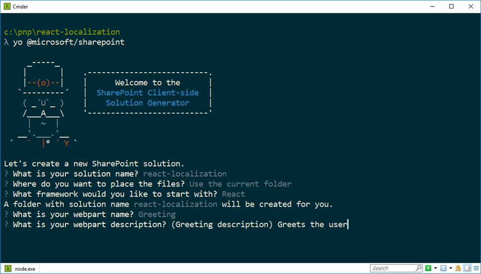
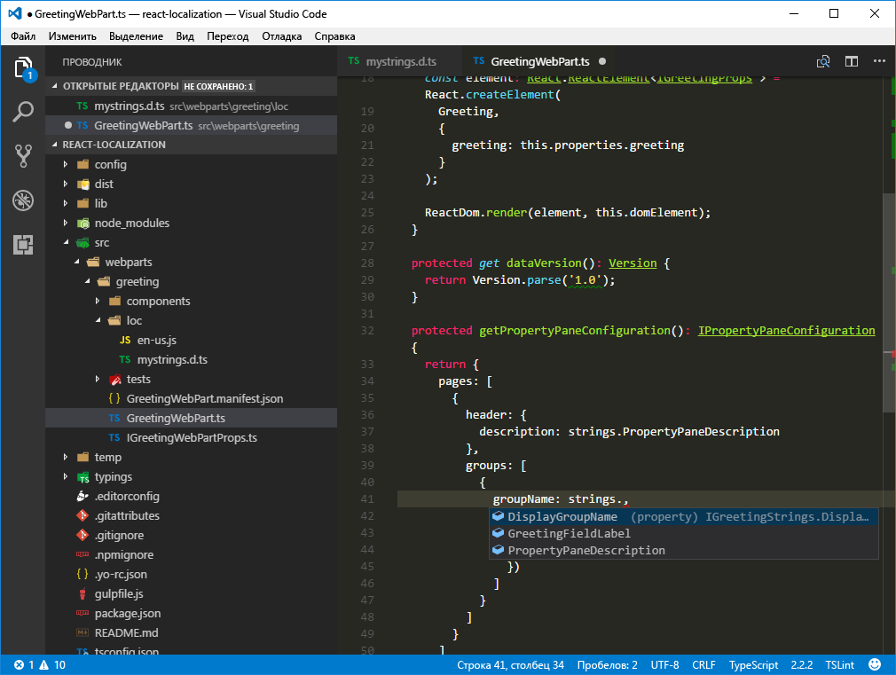
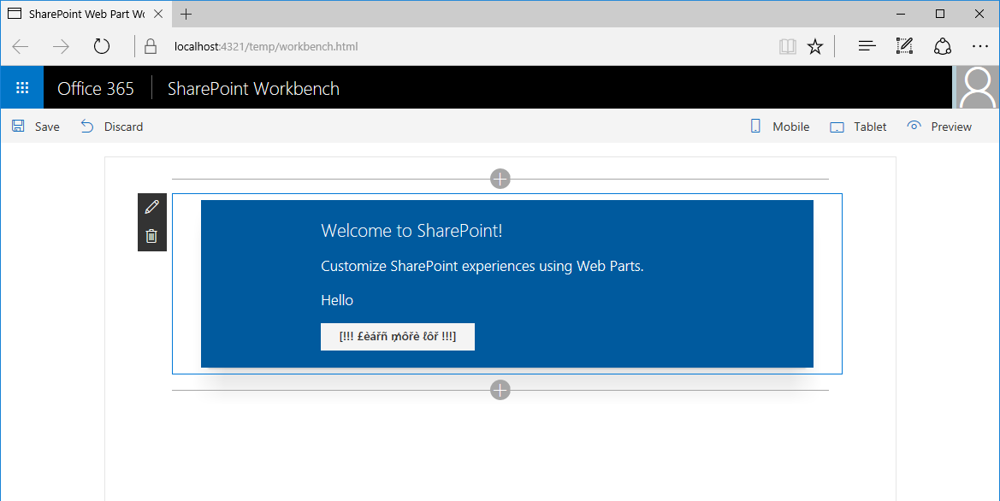

# <a name="localize-sharepoint-framework-client-side-web-parts"></a><span data-ttu-id="f78fe-102">Локализация клиентских веб-частей SharePoint Framework</span><span class="sxs-lookup"><span data-stu-id="f78fe-102">Localize SharePoint Framework client-side web parts</span></span>

<span data-ttu-id="f78fe-p101">Вы можете увеличить привлекательность клиентской веб-части SharePoint Framework, локализовав ее для пользователей SharePoint по всему миру. В этой статье показано, как локализовать веб-часть на нидерландский язык (Нидерланды) и проверить, отображаются ли правильно локализованные значения.</span><span class="sxs-lookup"><span data-stu-id="f78fe-p101">You can broaden the appeal of your SharePoint Framework client-side web part by localizing it for different languages spoken by SharePoint users all over the world. In this article, you will localize a web part to the Dutch (Netherlands) locale, and verify that the localized values are displayed correctly.</span></span>

> <span data-ttu-id="f78fe-105">**Примечание.** Прежде чем выполнять действия, описанные в этой статье, [настройте среду разработки клиентских веб-частей для SharePoint](../../set-up-your-development-environment.md).</span><span class="sxs-lookup"><span data-stu-id="f78fe-105">**Note:** Before following the steps in this article, be sure to [set up your SharePoint client-side web part development environment](../../set-up-your-development-environment.md).</span></span>

## <a name="prepare-the-project"></a><span data-ttu-id="f78fe-106">Подготовка проекта</span><span class="sxs-lookup"><span data-stu-id="f78fe-106">Prepare the project</span></span>

### <a name="create-a-new-project"></a><span data-ttu-id="f78fe-107">Создание проекта</span><span class="sxs-lookup"><span data-stu-id="f78fe-107">Create a new project</span></span>

<span data-ttu-id="f78fe-108">Для начала создайте папку проекта.</span><span class="sxs-lookup"><span data-stu-id="f78fe-108">Start by creating a new folder for your project.</span></span>

```sh
md react-localization
```

<span data-ttu-id="f78fe-109">Перейдите в папку проекта.</span><span class="sxs-lookup"><span data-stu-id="f78fe-109">Go to the project folder.</span></span>

```sh
cd react-localization
```

<span data-ttu-id="f78fe-110">В папке проекта запустите генератор Yeoman для SharePoint Framework, чтобы сформировать шаблон проекта на платформе SharePoint Framework.</span><span class="sxs-lookup"><span data-stu-id="f78fe-110">In the project folder run the SharePoint Framework Yeoman generator to scaffold a new SharePoint Framework project.</span></span>

```sh
yo @microsoft/sharepoint
```

<span data-ttu-id="f78fe-111">Когда отобразится соответствующий запрос, введите следующие значения:</span><span class="sxs-lookup"><span data-stu-id="f78fe-111">When prompted, enter the following values:</span></span>

- <span data-ttu-id="f78fe-112">**react-localization** в качестве имени решения;</span><span class="sxs-lookup"><span data-stu-id="f78fe-112">**react-localization** as your solution name.</span></span>
- <span data-ttu-id="f78fe-113">**SharePoint Online only (latest)** (Только SharePoint Online, последняя версия) в качестве набора базовых пакетов;</span><span class="sxs-lookup"><span data-stu-id="f78fe-113">**SharePoint Online only (latest)** as the baseline package set.</span></span>
- <span data-ttu-id="f78fe-114">**Use the current folder** (Использовать текущую папку) в качестве расположения файлов;</span><span class="sxs-lookup"><span data-stu-id="f78fe-114">**Use the current folder** for the location to place the files.</span></span>
- <span data-ttu-id="f78fe-115">**y** для того, чтобы можно было выполнять развертывание на уровне клиента;</span><span class="sxs-lookup"><span data-stu-id="f78fe-115">**y** to allow tenant-wide deployment.</span></span>
- <span data-ttu-id="f78fe-116">**WebPart** (Веб-часть) в качестве типа создаваемого компонента;</span><span class="sxs-lookup"><span data-stu-id="f78fe-116">**WebPart** as the type of client-side component to create.</span></span>
- <span data-ttu-id="f78fe-117">**Greeting** (Приветствие) в качестве имени веб-части;</span><span class="sxs-lookup"><span data-stu-id="f78fe-117">**Greeting** as your web part name.</span></span>
- <span data-ttu-id="f78fe-118">**Greets the user** (Приветствие пользователя) в качестве описания веб-части;</span><span class="sxs-lookup"><span data-stu-id="f78fe-118">**Greets the user** as your web part description.</span></span>
- <span data-ttu-id="f78fe-119">**React** в качестве отправной точки создания веб-части.</span><span class="sxs-lookup"><span data-stu-id="f78fe-119">**React** as the starting point to build the web part.</span></span>



<span data-ttu-id="f78fe-121">После завершения скаффолдинга блокируйте версию зависимостей проекта, выполнив следующую команду:</span><span class="sxs-lookup"><span data-stu-id="f78fe-121">Once the scaffolding completes, lock down the version of the project dependencies by running the following command:</span></span>

```sh
npm shrinkwrap
```

<span data-ttu-id="f78fe-122">Далее откройте папку проекта в редакторе кода.</span><span class="sxs-lookup"><span data-stu-id="f78fe-122">Next, open your project folder in your code editor.</span></span> <span data-ttu-id="f78fe-123">В инструкциях и на снимках экрана из этой статьи указан Visual Studio Code, но вы можете использовать любой редактор.</span><span class="sxs-lookup"><span data-stu-id="f78fe-123">Once the scaffolding completes, open your project folder in your code editor. This article uses Visual Studio Code in the steps and screenshots but you can use any editor you prefer.</span></span>


### <a name="replace-the-default-code"></a><span data-ttu-id="f78fe-125">Замена кода по умолчанию</span><span class="sxs-lookup"><span data-stu-id="f78fe-125">Replace the default code</span></span>

<span data-ttu-id="f78fe-126">В редакторе кода откройте файл **./src/webparts/greeting/GreetingWebPart.ts** и обновите определение интерфейса `IGreetingWebPartProps`, добавив следующий код:</span><span class="sxs-lookup"><span data-stu-id="f78fe-126">In the code editor, open the **./src/webparts/greeting/GreetingWebPart.ts** file and update the definition of the `IGreetingWebPartProps` interface to the following code:</span></span>

```ts
export interface IGreetingWebPartProps {
  greeting: string;
}
```

<span data-ttu-id="f78fe-127">Далее измените класс **GreetingWebPart** в том же файле, указав следующее:</span><span class="sxs-lookup"><span data-stu-id="f78fe-127">Next, open the ./src/webparts/greeting/GreetingWebPart.ts file and change the GreetingWebPart class to:</span></span>

```ts
export default class GreetingWebPart extends BaseClientSideWebPart<IGreetingWebPartProps> {

  public render(): void {
    const element: React.ReactElement<IGreetingProps > = React.createElement(
      Greeting,
      {
        greeting: this.properties.greeting
      }
    );

    ReactDom.render(element, this.domElement);
  }

  protected get dataVersion(): Version {
    return Version.parse('1.0');
  }

  protected getPropertyPaneConfiguration(): IPropertyPaneConfiguration {
    return {
      pages: [
        {
          header: {
            description: strings.PropertyPaneDescription
          },
          groups: [
            {
              groupName: strings.DisplayGroupName,
              groupFields: [
                PropertyPaneTextField('greeting', {
                  label: strings.GreetingFieldLabel
                })
              ]
            }
          ]
        }
      ]
    };
  }
}
```

<span data-ttu-id="f78fe-128">Обновите основной компонент React, открыв файл **./src/webparts/greeting/components/Greeting.tsx** и заменив код на следующий:</span><span class="sxs-lookup"><span data-stu-id="f78fe-128">Update the main React component by opening the **./src/webparts/greeting/components/Greeting.tsx** file and changing its code to:</span></span>

```ts
import * as React from 'react';
import styles from './Greeting.module.scss';
import { IGreetingProps } from './IGreetingProps';
import { escape } from '@microsoft/sp-lodash-subset';

export default class Greeting extends React.Component<IGreetingProps, {}> {
  public render(): JSX.Element {
    return (
      <div className={styles.greeting}>
        <div className={styles.container}>
          <div className={`ms-Grid-row ms-bgColor-themeDark ms-fontColor-white ${styles.row}`}>
            <div className="ms-Grid-col ms-u-lg10 ms-u-xl8 ms-u-xlPush2 ms-u-lgPush1">
              <span className='ms-font-xl ms-fontColor-white'>
                Welcome to SharePoint!
              </span>
              <p className='ms-font-l ms-fontColor-white'>
                Customize SharePoint experiences using Web Parts.
              </p>
              <p className='ms-font-l ms-fontColor-white'>
                {escape(this.props.greeting)}
              </p>
              <a href="https://aka.ms/spfx" className={styles.button}>
                <span className={styles.label}>Learn more</span>
              </a>
            </div>
          </div>
        </div>
      </div>
    );
  }
}
```

<span data-ttu-id="f78fe-129">Обновите интерфейс основного компонента React, открыв файл **./src/webparts/greeting/components/IGreetingProps.tsx** и заменив код на следующий:</span><span class="sxs-lookup"><span data-stu-id="f78fe-129">Update the main React component interface by opening the **./src/webparts/greeting/components/IGreetingProps.tsx** file and changing its code to:</span></span>

```tsx
import { IGreetingWebPartProps } from '../GreetingWebPart';

export interface IGreetingProps extends IGreetingWebPartProps {
}
```

<span data-ttu-id="f78fe-130">Обновите файл определения типа локализации TypeScript, открыв файл **./src/webparts/greeting/loc/mystrings.d.ts** и заменив код на следующий:</span><span class="sxs-lookup"><span data-stu-id="f78fe-130">Update the localization TypeScript type definition file by opening the **./src/webparts/greeting/loc/mystrings.d.ts** file and changing its code to:</span></span>

```ts
declare interface IGreetingWebPartStrings {
  PropertyPaneDescription: string;
  DisplayGroupName: string;
  GreetingFieldLabel: string;
}

declare module 'GreetingWebPartStrings' {
  const strings: IGreetingWebPartStrings;
  export = strings;
}
```

<span data-ttu-id="f78fe-131">Обновите файл английского языка (США), открыв файл **./src/webparts/greeting/loc/en-us.js** и заменив код на следующий:</span><span class="sxs-lookup"><span data-stu-id="f78fe-131">Update the US English locale file by opening the **./src/webparts/greeting/loc/en-us.js** file and changing its code to:</span></span>

```js
define([], function() {
  return {
    "PropertyPaneDescription": "Greeting web part configuration",
    "DisplayGroupName": "Display",
    "GreetingFieldLabel": "Greeting to show in the web part"
  }
});
```

<span data-ttu-id="f78fe-132">В манифесте веб-части обновите значение по умолчанию для свойства **greeting**, открыв файл **./src/webparts/greeting/GreetingWebPart.manifest.json** и заменив раздел **properties** на следующий:</span><span class="sxs-lookup"><span data-stu-id="f78fe-132">In the web part manifest update the default value of the **greeting** property by opening the **./src/webparts/greeting/GreetingWebPart.manifest.json** file and changing the **properties** section to:</span></span>

```json
{
  // ...
  "preconfiguredEntries": [{
    "groupId": "5c03119e-3074-46fd-976b-c60198311f70", // Other
    "group": { "default": "Other" },
    "title": { "default": "Greeting" },
    "description": { "default": "Greets the user" },
    "officeFabricIconFontName": "Page",
    "properties": {
      "greeting": "Hello"
    }
  }]
}
```

<span data-ttu-id="f78fe-133">Проверьте, правильно ли применили все изменения, с помощью следующей команды:</span><span class="sxs-lookup"><span data-stu-id="f78fe-133">Verify that you have applied all changes correctly by running the following command:</span></span>

```sh
gulp serve
```

<span data-ttu-id="f78fe-134">В среде разработки SharePoint добавьте веб-часть на страницу и откройте ее конфигурацию.</span><span class="sxs-lookup"><span data-stu-id="f78fe-134">In the SharePoint workbench add the web part to the page and open its configuration.</span></span>


## <a name="localize-the-web-part-manifest"></a><span data-ttu-id="f78fe-136">Локализация манифеста веб-части</span><span class="sxs-lookup"><span data-stu-id="f78fe-136">Localize the web part manifest</span></span>

<span data-ttu-id="f78fe-p103">Каждая клиентская веб-часть SharePoint Framework состоит из кода и манифеста. Манифест содержит сведения о веб-части, например название, описание и значок. При добавлении веб-части на страницу пользователи видят сведения из манифеста веб-части. Благодаря этой информации они могут решить, нужна ли им данная веб-часть. Название и описание должны правильно отражать функциональность веб-части, если вы хотите, чтобы ею пользовались. Если веб-часть будет использоваться на сайтах не на английском языке, локализация метаданных сделает ее еще удобнее для пользователей.</span><span class="sxs-lookup"><span data-stu-id="f78fe-p103">Every SharePoint Framework client-side web part consists of code, and a manifest. The manifest provides information about the web part such as its title, description, and icon. When adding a web part to the page, the information from the web part manifest is displayed to users. Using this information users decide if the web part is the one that they are looking for. Providing a title and description that correctly reflect the web part's functionality is essential if you want your web part to be used. If your web part will be used in non-English sites, then localizing its metadata can improve the user experience even further.</span></span>

<span data-ttu-id="f78fe-143">В манифесте веб-части можно указывать локализованные значения некоторых свойств, например названия и описания.</span><span class="sxs-lookup"><span data-stu-id="f78fe-143">Some properties defined in the web part manifest, such as title or description, support specifying localized values.</span></span> <span data-ttu-id="f78fe-144">Полный список всех свойств манифеста веб-части, поддерживающих локализацию, см. в статье [Упрощенное добавление веб-частей с помощью предварительно настроенных записей](./simplify-adding-web-parts-with-preconfigured-entries.md#properties-of-a-preconfiguredentries-array-item).</span><span class="sxs-lookup"><span data-stu-id="f78fe-144">For the complete list of all web part manifest properties that support localization read the [Simplify adding web parts with preconfigured entries](./simplify-adding-web-parts-with-preconfigured-entries.md#properties-of-a-preconfiguredentries-array-item) article.</span></span> <span data-ttu-id="f78fe-145">Свойства, поддерживающие локализацию, имеют тип **ILocalizedString**.</span><span class="sxs-lookup"><span data-stu-id="f78fe-145">Properties that support localization are of type **ILocalizedString**.</span></span> <span data-ttu-id="f78fe-146">Для каждой локализованной строки должно быть указано по крайней мере значение по умолчанию (при необходимости можно указать значения для других языковых стандартов).</span><span class="sxs-lookup"><span data-stu-id="f78fe-146">Each localized string must specify at least the default value and optionally values for other locales.</span></span>

### <a name="add-localized-values-for-title-description-and-group-name"></a><span data-ttu-id="f78fe-147">Добавление локализованных значений для названия, описания и имени группы</span><span class="sxs-lookup"><span data-stu-id="f78fe-147">Add localized values for title, description, and group name</span></span>

<span data-ttu-id="f78fe-148">Откройте в редакторе кода файл **./src/webparts/greeting/GreetingWebPart.manifest.json**.</span><span class="sxs-lookup"><span data-stu-id="f78fe-148">In the code editor open the **./src/webparts/greeting/GreetingWebPart.manifest.json file, and remove the greeting property from the properties** property:</span></span> <span data-ttu-id="f78fe-149">В массиве **preconfiguredEntries** добавьте переводы для свойств **title**, **description** и **group** на нидерландском языке (Нидерланды), заменив код на следующий:</span><span class="sxs-lookup"><span data-stu-id="f78fe-149">In the code editor open the ./src/webparts/greeting/GreetingWebPart.manifest.json file. In the **preconfiguredEntries** array add translations for the **title**, **description**, and **group** properties in Dutch (Netherlands), by changing the code to:</span></span>

```json
{
  // ...
  "preconfiguredEntries": [{
    "groupId": "5c03119e-3074-46fd-976b-c60198311f70", // Other
    "group": { "default": "Other", "nl-nl": "Anders" },
    "title": { "default": "Greeting", "nl-nl": "Begroeting" },
    "description": { "default": "Greets the user", "nl-nl": "Begroet de gebruiker" },
    "officeFabricIconFontName": "Page",
    "properties": {
      "greeting": "Hello"
    }
  }]
}
```

<span data-ttu-id="f78fe-150">Чтобы проверить, работает ли проект, выполните следующую команду:</span><span class="sxs-lookup"><span data-stu-id="f78fe-150">Run the following command to verify that the project is working:</span></span>

```sh
gulp serve
```

><span data-ttu-id="f78fe-151">**Примечание.** К сожалению, на данный момент в системе разработки SharePoint невозможно просмотреть локализованные значения из манифеста веб-части.</span><span class="sxs-lookup"><span data-stu-id="f78fe-151">**Note:** Unfortunately, the SharePoint workbench doesn't currently support previewing the localized values from the web part manifest. It always uses the default translation.</span></span> <span data-ttu-id="f78fe-152">Всегда используется перевод по умолчанию.</span><span class="sxs-lookup"><span data-stu-id="f78fe-152">It always uses the default translation.</span></span>

## <a name="localize-the-web-part-property-pane"></a><span data-ttu-id="f78fe-153">Локализация области свойств веб-части</span><span class="sxs-lookup"><span data-stu-id="f78fe-153">Localize the web part property pane</span></span>

<span data-ttu-id="f78fe-p107">Пользователям часто приходится настраивать веб-часть для своих потребностей. Подписав параметры конфигурации, вы можете сделать веб-часть удобнее для пользователей и уменьшить количество обращений в службу поддержки за помощью в настройке.</span><span class="sxs-lookup"><span data-stu-id="f78fe-p107">When working with web parts users often need to configure it for their specific needs. Providing descriptive labels for the different configuration settings improves the usability of the web part, and decreases the number of support requests from users for help configuring web parts.</span></span>

<span data-ttu-id="f78fe-p108">Область свойств веб-части состоит из разделов. Каждый раздел имеет заголовок и один или несколько элементов, с помощью которых пользователи могут настраивать веб-часть. Каждый из этих элементов содержит описание его назначения. По умолчанию веб-части загружают строковые подписи из файла ресурсов JavaScript. Если вы создавали классические веб-части с помощью решений с полным доверием, они похожи на файлы ресурсов RESX. Не обязательно использовать эти файлы ресурсов, а строки можно включать непосредственно в код. Однако настоятельно рекомендуем применять такие файлы. Немного дополнительных служебных данных — ничего по сравнению с усилиями, необходимыми для извлечения всех подписей, если впоследствии вам потребуется перевести веб-часть.</span><span class="sxs-lookup"><span data-stu-id="f78fe-p108">The web part property pane consists of sections. Each section has a header and one or more controls allowing users to configure the web part. Each of these controls contains a label that describes its purpose. By default, web parts load the string labels from a JavaScript resource file. If you've built classic web parts with full-trust solutions, they resemble .resx resource files. It's not required to use these resource files and you could include the strings directly in code. However, it's highly recommended that you use resource files. The little additional overhead they add outweighs the effort required to extract all labels afterwards should you need to translate the web part later on.</span></span>

<span data-ttu-id="f78fe-164">Файлы локализации, используемые веб-частью, хранятся в папке **./src/webparts/greeting/loc**.</span><span class="sxs-lookup"><span data-stu-id="f78fe-164">The localization files used by the web part are stored in the **./src/webparts/greeting/loc** folder.</span></span>


<span data-ttu-id="f78fe-166">Папка **loc** содержит файл определения типа TypeScript (**./src/webpart/greeting/loc/mystrings.d.ts**), который сообщает TypeScript о различных строках в локализованных файлах.</span><span class="sxs-lookup"><span data-stu-id="f78fe-166">The **loc** folder contains a TypeScript type definition file (**./src/webpart/greeting/loc/mystrings.d.ts**) that informs TypeScript of the different strings included in the localized files.</span></span> <span data-ttu-id="f78fe-167">На основе сведений из этого файла редактор кода может предоставлять подсказки IntelliSense при работе со строками в коде.</span><span class="sxs-lookup"><span data-stu-id="f78fe-167">Using the information from this file, your code editor can provide you with IntelliSense when working with strings in code.</span></span> <span data-ttu-id="f78fe-168">Кроме того, при сборке проекта TypeScript может проверять, не ссылаетесь ли вы на неопределенные строки.</span><span class="sxs-lookup"><span data-stu-id="f78fe-168">Additionally, while building your project, TypeScript can verify that you're not referring to a string that hasn't been defined.</span></span>



<span data-ttu-id="f78fe-170">Переведенные строки для каждого языкового стандарта, поддерживаемого веб-частью, содержатся в обычном файле JavaScript (не TypeScript) с именем в нижнем регистре (например, **en-us.js**).</span><span class="sxs-lookup"><span data-stu-id="f78fe-170">For each locale supported by your web part, there is also a plain JavaScript file (not TypeScript) named in lowercase after the locale (for example **en-us.js**) containing the translated strings.</span></span>


> <span data-ttu-id="f78fe-172">**Важно!** Уделяйте особое внимание проверке того, чтобы все ключи, указанные в файле определения типа TypeScript как локализуемые, были переведены во всех файлах локализации JavaScript.</span><span class="sxs-lookup"><span data-stu-id="f78fe-172">**Important:** You should pay extra attention to verifying that all keys specified in the TypeScript type definition file for localization have translations in all localization JavaScript files.</span></span>

<span data-ttu-id="f78fe-173">en-US — это языковой стандарт SharePoint Framework по умолчанию.</span><span class="sxs-lookup"><span data-stu-id="f78fe-173">en-US is the default locale used by the SharePoint Framework.</span></span> <span data-ttu-id="f78fe-174">Если языковой стандарт сайта не поддерживается веб-частью, SharePoint Framework использует языковой стандарт по умолчанию (en-US).</span><span class="sxs-lookup"><span data-stu-id="f78fe-174">If your web part is used on a site using a locale not supported by your web part, the SharePoint Framework will use en-US as the default locale.</span></span> <span data-ttu-id="f78fe-175">Чтобы переопределить этот параметр, создайте файл языкового стандарта **default.js** с текстами перевода на предпочитаемые языки.</span><span class="sxs-lookup"><span data-stu-id="f78fe-175">You can override this behavior by creating a locale file named **default.js** with the translations in your preferred language.</span></span> <span data-ttu-id="f78fe-176">Имя **default.js** не соответствует соглашению об именовании языковых стандартов, но оно дает указание SharePoint Framework использовать этот файл языкового стандарта, а не английский язык (США).</span><span class="sxs-lookup"><span data-stu-id="f78fe-176">While the name **default.js** doesn't follow the locale naming convention, it signals to the SharePoint Framework build process to use that particular locale file as the fallback locale instead of the standard US English locale.</span></span>

### <a name="add-localized-values-for-web-part-property-pane-strings"></a><span data-ttu-id="f78fe-177">Добавление локализованных значений для строк области свойств веб-части</span><span class="sxs-lookup"><span data-stu-id="f78fe-177">Add localized values for web part property pane strings</span></span>

<span data-ttu-id="f78fe-178">В папке **./src/webparts/greetings/loc** создайте файл **nl-nl.js** и введите следующий код:</span><span class="sxs-lookup"><span data-stu-id="f78fe-178">In the **./src/webparts/greetings/loc** folder create new file named **nl-nl.js** and enter the following code:</span></span>

```js
define([], function() {
  return {
    "PropertyPaneDescription": "Instellingen van het begroeting webonderdeel",
    "DisplayGroupName": "Weergave",
    "GreetingFieldLabel": "Begroeting die in het webonderdeel getoond wordt"
  }
});
```

<span data-ttu-id="f78fe-179">Убедитесь, что ключи в файле определения типа TypeScript для локализации соответствуют содержимому файлов языковых стандартов в случае английского (США) и нидерландского (Нидерланды) языков.</span><span class="sxs-lookup"><span data-stu-id="f78fe-179">Verify that the keys in the TypeScript type definition file for localization match the contents of the locale files for US English and Dutch (Netherlands).</span></span>


### <a name="verify-the-localized-web-part-property-pane-strings"></a><span data-ttu-id="f78fe-181">Проверка локализованных строк в области свойств веб части</span><span class="sxs-lookup"><span data-stu-id="f78fe-181">Verify the localized web part property pane strings</span></span>

<span data-ttu-id="f78fe-182">При проверке веб-частей с помощью размещенной версии среды разработки SharePoint или сайтов группы на клиенте разработчика по умолчанию используется языковой стандарт сайта контекста, выраженный свойством **spPageContextInfo.currentUICultureName**.</span><span class="sxs-lookup"><span data-stu-id="f78fe-182">When testing web parts using the hosted version of the SharePoint workbench or team sites on a developer tenant the locale of the context site expressed by the **spPageContextInfo.currentUICultureName** property is used as the default locale. When testing web parts using the local SharePoint workbench, the SharePoint Framework uses by default the en-US locale to display web part property pane strings. There are two ways in which you can test the values from other locales supported by your web part.</span></span> <span data-ttu-id="f78fe-183">При проверке веб-частей с помощью локальной среды разработки SharePoint Framework по умолчанию использует языковой стандарт en-US для отображения строк области свойств веб-части.</span><span class="sxs-lookup"><span data-stu-id="f78fe-183">When testing web parts using the local SharePoint workbench, the SharePoint Framework uses by default the en-US locale to display web part property pane strings.</span></span> <span data-ttu-id="f78fe-184">Проверить значения из других языковых стандартов, поддерживаемых веб-частью, можно двумя способами.</span><span class="sxs-lookup"><span data-stu-id="f78fe-184">There are two ways in which you can test the values from other locales supported by your web part.</span></span>

#### <a name="specify-the-locale-to-be-tested-in-the-project-configuration"></a><span data-ttu-id="f78fe-185">Указание проверяемого языкового стандарта в конфигурации проекта</span><span class="sxs-lookup"><span data-stu-id="f78fe-185">Specify the locale to be tested in the project configuration</span></span>

<span data-ttu-id="f78fe-186">Чтобы указать проверяемый языковой стандарт в среде разработки SharePoint, можно изменить конфигурацию проекта.</span><span class="sxs-lookup"><span data-stu-id="f78fe-186">One way to specify the locale to be tested in the SharePoint workbench is by editing the project configuration.</span></span> <span data-ttu-id="f78fe-187">Этот способ удобен, если вы и ваши коллеги работаете с языковым стандартом в течение долгого времени, или вы создаете веб-часть, которая не поддерживает английский язык (США).</span><span class="sxs-lookup"><span data-stu-id="f78fe-187">One way to specify the locale to be tested in the SharePoint workbench is by editing the project configuration. This approach is useful if you and your team members are working with a locale for a longer period of time or if you're building a web part that doesn't support US English. In the code editor open the ./config/write-manifests.json file and change its code to:</span></span> <span data-ttu-id="f78fe-188">В редакторе кода откройте файл **./config/write-manifests.json** и измените его код на следующий:</span><span class="sxs-lookup"><span data-stu-id="f78fe-188">In the code editor, open the **./src/webparts/recentDocument/components/IRecentDocumentProps.ts** file and change its code to:</span></span>

```json
{
  "cdnBasePath": "<!-- PATH TO CDN -->",
  "debugLocale": "nl-nl"
}
```

<span data-ttu-id="f78fe-189">Запустите среду разработки SharePoint с помощью следующей команды:</span><span class="sxs-lookup"><span data-stu-id="f78fe-189">Start the SharePoint workbench by running the following command:</span></span>

```sh
gulp serve
```

<span data-ttu-id="f78fe-190">Когда вы добавите веб-часть на страницу и откроете ее конфигурацию, то увидите, что строки в области свойств веб-части отображаются на нидерландском языке (Нидерланды).</span><span class="sxs-lookup"><span data-stu-id="f78fe-190">When you add the web part to the page and open its configuration you will see the strings in the web part property pane displayed in Dutch (Netherlands).</span></span>


#### <a name="specify-the-locale-to-be-tested-using-the-command-line-argument"></a><span data-ttu-id="f78fe-192">Указание проверяемого языкового стандарта с помощью аргумента командной строки</span><span class="sxs-lookup"><span data-stu-id="f78fe-192">Specify the locale to be tested using the command line argument</span></span>

<span data-ttu-id="f78fe-p113">Еще один способ указать языковой стандарт, который будет использоваться локальной средой разработки SharePoint, — указать его в качестве аргумента задачи gulp. Запустите среду разработки SharePoint с помощью следующей команды:</span><span class="sxs-lookup"><span data-stu-id="f78fe-p113">Another way to specify the locale to be used by the local SharePoint workbench is to specify it as an argument for the gulp task. Start the SharePoint workbench by running the following command:</span></span>

```sh
gulp serve --locale=nl-nl
```

<span data-ttu-id="f78fe-195">Когда вы откроете конфигурацию веб-части, то увидите, что все строки в области свойств отображаются на нидерландском (Нидерланды), а не на английском языке (США) по умолчанию.</span><span class="sxs-lookup"><span data-stu-id="f78fe-195">Once again, when you open your web part's configuration you will see that all property pane strings are displayed in Dutch (Netherlands) rather than the default US English.</span></span>


## <a name="localize-web-part-contents"></a><span data-ttu-id="f78fe-197">Локализация содержимого веб-части</span><span class="sxs-lookup"><span data-stu-id="f78fe-197">Localize web part contents</span></span>

<span data-ttu-id="f78fe-p114">Так же как строки в области свойств веб части, необходимо локализовать все строки, отображаемые в веб-части. Вы можете воспользоваться тем же способом. Добавьте ключ в файле определения TypeScript для каждой локализуемой строки и переведите ее на каждый из поддерживаемых языков в файле JavaScript соответствующего языкового стандарта.</span><span class="sxs-lookup"><span data-stu-id="f78fe-p114">The same way you localize web part property pane strings, you should localize all strings displayed by the web part in its body. You can use the same approach that you use when localizing web part property pane strings. For every string to be localized, add a key in the localization TypeScript definition file, and then translate the string to each of the supported locales in the corresponding locale JavaScript file.</span></span>

### <a name="globalize-the-web-part-strings"></a><span data-ttu-id="f78fe-201">Глобализация строк веб-части</span><span class="sxs-lookup"><span data-stu-id="f78fe-201">Globalize the web part strings</span></span>

<span data-ttu-id="f78fe-202">Строки стандартной веб-части, указанной в проекте SharePoint Framework, для которого выполнен скаффолдинг, внедрены в код.</span><span class="sxs-lookup"><span data-stu-id="f78fe-202">The default web part provided with the scaffolded SharePoint Framework project has its strings embedded in the code.</span></span> <span data-ttu-id="f78fe-203">Прежде чем локализовать эти строки, необходимо заменить их на ссылки на локализованные строки.</span><span class="sxs-lookup"><span data-stu-id="f78fe-203">Before you can localize these strings you have to replace them with references to the localized strings.</span></span> <span data-ttu-id="f78fe-204">Этот процесс часто называется **глобализацией** или **интернационализацией** (или просто **i18n**).</span><span class="sxs-lookup"><span data-stu-id="f78fe-204">This process is often referred to as **globalization** or **internationalization** (or **i18n** for short).</span></span>

<span data-ttu-id="f78fe-205">В редакторе кода откройте файл **./src/webparts/greeting/components/Greetings.tsx**.</span><span class="sxs-lookup"><span data-stu-id="f78fe-205">In the code editor, open the **./src/webparts/recentDocuments/components/RecentDocuments.tsx** file and paste the following code:</span></span> <span data-ttu-id="f78fe-206">В верхней части файла, сразу же после последнего оператора `import`, добавьте ссылку на локализованные строки:</span><span class="sxs-lookup"><span data-stu-id="f78fe-206">In the code editor, open the ./src/webparts/greeting/components/Greetings.tsx file. In the top section of the file, directly after the last `import` statement, add a reference to the localized strings:</span></span>

```ts
import * as strings from 'GreetingWebPartStrings';
```

<span data-ttu-id="f78fe-207">После этого замените содержимое класса **Greeting** на следующий код:</span><span class="sxs-lookup"><span data-stu-id="f78fe-207">Next, replace the contents of the **Greeting** class with the following code:</span></span>

```ts
// ...
export default class Greeting extends React.Component<IGreetingProps, {}> {
  public render(): JSX.Element {
    return (
      <div className={styles.greeting}>
        <div className={styles.container}>
          <div className={`ms-Grid-row ms-bgColor-themeDark ms-fontColor-white ${styles.row}`}>
            <div className="ms-Grid-col ms-u-lg10 ms-u-xl8 ms-u-xlPush2 ms-u-lgPush1">
              <span className='ms-font-xl ms-fontColor-white'>
                Welcome to SharePoint!
              </span>
              <p className='ms-font-l ms-fontColor-white'>
                Customize SharePoint experiences using Web Parts.
              </p>
              <p className='ms-font-l ms-fontColor-white'>
                {escape(this.props.greeting)}
              </p>
              <a href="https://aka.ms/spfx" className={styles.button}>
                <span className={styles.label}>{strings.LearnMoreButtonLabel}</span>
              </a>
            </div>
          </div>
        </div>
      </div>
    );
  }
}
```

### <a name="add-the-new-string-to-the-localization-typescript-type-definition-file"></a><span data-ttu-id="f78fe-208">Добавление новой строки в файл определения типа локализации TypeScript</span><span class="sxs-lookup"><span data-stu-id="f78fe-208">Add the new string to the localization TypeScript type definition file</span></span>

<span data-ttu-id="f78fe-209">После замены строки на ссылку нужно добавить эту строку в файлы локализации, используемые веб-частью.</span><span class="sxs-lookup"><span data-stu-id="f78fe-209">Having replaced the string with a reference, the next step is to add that string to the localization files used by the web part. In the code editor open the ./src/webparts/greetings/loc/mystrings.d.ts file, and change its code to:</span></span> <span data-ttu-id="f78fe-210">В редакторе кода откройте файл **./src/webparts/greetings/loc/mystrings.d.ts** и измените его код на следующий:</span><span class="sxs-lookup"><span data-stu-id="f78fe-210">In the code editor, open the **./src/webparts/gallery/loc/mystrings.d.ts** file. Change its code to:</span></span>

```ts
declare interface IGreetingWebPartStrings {
  PropertyPaneDescription: string;
  DisplayGroupName: string;
  GreetingFieldLabel: string;
  LearnMoreButtonLabel: string;
}

declare module 'greetingStrings' {
  const strings: IGreetingWebPartStrings;
  export = strings;
}

```

### <a name="add-localized-values-for-the-new-string"></a><span data-ttu-id="f78fe-211">Добавление локализованных значений для новой строки</span><span class="sxs-lookup"><span data-stu-id="f78fe-211">Add localized values for the new string</span></span>

<span data-ttu-id="f78fe-212">Вам осталось лишь указать локализованные версии для новой строки во всех языковых стандартах, поддерживаемых веб-частью.</span><span class="sxs-lookup"><span data-stu-id="f78fe-212">The last step is to provide localized versions for the new string in all locales supported by the web part. In the code editor, open the ./src/webparts/greeting/loc/en-us.js file and change its code to:</span></span> <span data-ttu-id="f78fe-213">В редакторе кода откройте файл **./src/webparts/greeting/loc/en-us.js** и измените его код на следующий:</span><span class="sxs-lookup"><span data-stu-id="f78fe-213">In the code editor, open the **./src/webparts/greeting/loc/en-us.js** file and change its code to:</span></span>

```js
define([], function() {
  return {
    "PropertyPaneDescription": "Greeting web part configuration",
    "DisplayGroupName": "Display",
    "GreetingFieldLabel": "Greeting to show in the web part",
    "LearnMoreButtonLabel": "Learn more"
  }
});
```

<span data-ttu-id="f78fe-214">После этого откройте файл **./src/webparts/greeting/loc/nl-nl.js** и измените его код на следующий:</span><span class="sxs-lookup"><span data-stu-id="f78fe-214">Next, open the **./src/webparts/greeting/loc/nl-nl.js** file and change its code to:</span></span>

```js
define([], function() {
  return {
    "PropertyPaneDescription": "Instellingen van het begroeting webonderdeel",
    "DisplayGroupName": "Weergave",
    "GreetingFieldLabel": "Begroeting die in het webonderdeel getoond wordt",
    "LearnMoreButtonLabel": "Meer informatie"
  }
});
```

<span data-ttu-id="f78fe-215">Проверьте, правильно ли отображается переведенная строка, с помощью следующей команды:</span><span class="sxs-lookup"><span data-stu-id="f78fe-215">Confirm that the translated string is correctly displayed by running the following command:</span></span>

```sh
gulp serve --locale=nl-nl
```


## <a name="improve-globalizing-and-localizing-web-parts-using-pseudo-locales"></a><span data-ttu-id="f78fe-217">Как улучшить глобализацию и локализацию веб-частей с помощью языковых псевдостандартов</span><span class="sxs-lookup"><span data-stu-id="f78fe-217">Improve globalizing and localizing web parts using pseudo-locales</span></span>

<span data-ttu-id="f78fe-p119">Локализация веб-частей обеспечивает явные преимущества, но разработчики часто ей пренебрегают. Часто переводы добавляются в конце проекта, и тест-инженерам трудно проверить, весь ли код должным образом поддерживает языковые стандарты.</span><span class="sxs-lookup"><span data-stu-id="f78fe-p119">Using localization when building web parts offers clear benefits but is also something that developers overlook easily. Often, translations to other locales are provided later in the project and it's hard for testers to verify that all code will properly support the different locales.</span></span>

<span data-ttu-id="f78fe-p120">Слова в разных языках имеют разную длину. Например, предложение, переведенное с английского на немецкий или нидерландский, может стать на 35 % длиннее. Не все переводы доступны заранее, поэтому разработчикам трудно адаптировать пользовательский интерфейс под длинные строки.</span><span class="sxs-lookup"><span data-stu-id="f78fe-p120">The same words in different locales have different lengths. For example, the same sentence translated from English to German or Dutch can become 35% longer. Without all translations available up front, it's hard for developers and designers to ensure that the user interface can properly accommodate longer strings.</span></span>

<span data-ttu-id="f78fe-p121">В некоторых языках используются специальные знаки, кроме стандартного набора символов ASCII. Если разработчики используют нестандартный шрифт, некоторые специальные знаки могут не поддерживаться.</span><span class="sxs-lookup"><span data-stu-id="f78fe-p121">Some languages use special characters beyond the standard ASCII character set. If designers use a non-standard font, it is possible that the font doesn't properly support some special characters.</span></span>

<span data-ttu-id="f78fe-p122">Если вы узнаете обо всех этих проблемах в конце проекта, скорее всего, возникнут задержки и понадобятся дорогостоящие исправления. SharePoint Framework позволяет разработчикам использовать языковые псевдостандарты, чтобы решить эти проблемы при создании веб-частей.</span><span class="sxs-lookup"><span data-stu-id="f78fe-p122">Finding out about all these issues late in the project will likely lead to delays and costly fixes. The SharePoint Framework allows developers to use pseudo-locales to address these issues while building web parts.</span></span>

> <span data-ttu-id="f78fe-227">**Что такое языковые псевдостандарты?**</span><span class="sxs-lookup"><span data-stu-id="f78fe-227">**What are pseudo-locales?**</span></span> <span data-ttu-id="f78fe-228">Языковые псевдостандарты —это языковые стандарты, предназначенные для проверки поддержки специальных знаков, языков с письмом справа налево, размещения длинных строк в пользовательском интерфейсе и других аспектов локализации.</span><span class="sxs-lookup"><span data-stu-id="f78fe-228">What are pseudo-locales? Pseudo-locales are locales designed to test software for proper support of the different aspects of the localization process such as support for special characters, right-to-left languages, or accommodating longer strings in the user interface.</span></span>

### <a name="add-the-base-pseudo-locale"></a><span data-ttu-id="f78fe-229">Добавление базового языкового псевдостандарта</span><span class="sxs-lookup"><span data-stu-id="f78fe-229">Add the base pseudo-locale</span></span>

<span data-ttu-id="f78fe-230">В папке **./src/webparts/greeting/loc** добавьте новый файл **qps ploc.js** и вставьте следующий код:</span><span class="sxs-lookup"><span data-stu-id="f78fe-230">In the **./src/webparts/greeting/loc** folder, add a new file named **qps-ploc.js** and paste the following code:</span></span>

```js
define([], function() {
  return {
    "PropertyPaneDescription": "[!!! Gřèèƭïñϱ ωèβ ƥářƭ çôñƒïϱúřáƭïôñ ℓôřè₥ ïƥƨú !!!]",
    "DisplayGroupName": "[!!! Ðïƨƥℓᥠℓ !!!]",
    "GreetingFieldLabel": "[!!! Gřèèƭïñϱ ƭô ƨλôω ïñ ƭλè ωèβ ƥářƭ ℓôřè₥ ïƥƨú !!!]",
    "LearnMoreButtonLabel": "[!!! £èářñ ₥ôřè ℓôř !!!]"
  }
});
```

> <span data-ttu-id="f78fe-231">**Совет.** Вы можете преобразовать строки на английском языке (США) в базовый языковой псевдостандарт на сайте [http://www.pseudolocalize.com](http://www.pseudolocalize.com). Увеличив длину сгенерированной строки на 35 %, можно смоделировать длину строк, переведенных на языки, для которых характерны более длинные строки, например немецкий или нидерландский.</span><span class="sxs-lookup"><span data-stu-id="f78fe-231">**Tip:** you can convert US English strings to their base pseudo-locale equivalent at [http://www.pseudolocalize.com](http://www.pseudolocalize.com). By increasing the length of the generated string with 35% you should be able to simulate the length of strings translated to longer locales such as German or Dutch. Additionally, by surrounding the translations with brackets and exclamation marks you can more easily see if the whole string is displayed on the screen.</span></span> <span data-ttu-id="f78fe-232">Кроме того, заключив переводы в скобки и восклицательные знаки, вам будет проще понять, помещается ли на экране вся строка.</span><span class="sxs-lookup"><span data-stu-id="f78fe-232">Additionally, by surrounding the translations with brackets and exclamation marks you can more easily see if the whole string is displayed on the screen.</span></span>

<span data-ttu-id="f78fe-233">Проверьте проект с помощью базового языкового псевдостандарта, выполнив следующую команду:</span><span class="sxs-lookup"><span data-stu-id="f78fe-233">Test the project using the base pseudo-locale by running the following command:</span></span>

```sh
gulp serve --locale=qps-ploc
```

<span data-ttu-id="f78fe-234">После добавления веб-части на страницу вы сразу увидите, что две строки в веб-части не интернационализированы и отображаются на английском языке (США), а не на базовом языковом псевдостандарте.</span><span class="sxs-lookup"><span data-stu-id="f78fe-234">After adding the web part to the page, you can quickly see that there are two strings in the web part body that have not been internationalized and are still displayed in US English rather than in the base pseudo-locale.</span></span>



<span data-ttu-id="f78fe-236">Если вы откроете область свойств веб-части, то увидите, что все строки и специальные знаки отображаются правильно и помещаются в отведенном для них месте.</span><span class="sxs-lookup"><span data-stu-id="f78fe-236">If you open the web part property pane, you can confirm that all strings and their special characters are displayed properly and that they fit in the available space correctly.</span></span>


## <a name="localize-web-part-settings-values"></a><span data-ttu-id="f78fe-238">Локализация значений параметров веб-части</span><span class="sxs-lookup"><span data-stu-id="f78fe-238">Localize web part settings values</span></span>

<span data-ttu-id="f78fe-p125">Microsoft SharePoint поддерживает многоязычный пользовательский интерфейс (MUI), когда администратор сайта может включить несколько языков интерфейса. Сайт будет автоматически отображаться на языке, выбранном пользователем.</span><span class="sxs-lookup"><span data-stu-id="f78fe-p125">Microsoft SharePoint supports Multilingual User Interface (MUI) where the site administrator can enable multiple languages for the user interface. When the user visits the site, its UI will automatically be displayed using the preferred language based on that user's preferences.</span></span>

<span data-ttu-id="f78fe-p126">Веб-части, используемые на многоязычных сайтах, должны автоматически определять текущий язык и отображать содержимое на этом языке. SharePoint Framework упрощает этот процесс, автоматически загружая файл ресурсов, соответствующий текущему языку. Кроме того, при проверке веб-частей SharePoint Framework с помощью размещенной версии среды разработки SharePoint также автоматически используется язык, выбранный пользователем.</span><span class="sxs-lookup"><span data-stu-id="f78fe-p126">Web parts used on multilingual sites should automatically detect the currently used language and display their contents in that language. The SharePoint Framework simplifies this process by automatically loading the resource file corresponding to the currently used language. Additionally, when testing SharePoint Framework web parts using the hosted version of the SharePoint workbench, the workbench also automatically uses the language preferred by the user.</span></span>

<span data-ttu-id="f78fe-p127">Значения, настроенные с помощью свойств веб-части, не хранятся в файлах ресурсов. По умолчанию настроенное значение используется как есть, что может привести к несоответствиям, например отображению приветствия на английском языке, когда выбранный пользователем язык — голландский.</span><span class="sxs-lookup"><span data-stu-id="f78fe-p127">Values configured through web part properties are not stored in resource files. By default, the configured value is used as-is, which might lead to inconsistencies such as greeting the user in English when the user's preferred language is Dutch.</span></span>


<span data-ttu-id="f78fe-p128">Используя стандартные блоки, доступные в SharePoint Framework, вы можете добавить поддержку хранения значений конфигурации на нескольких языках. Для каждого из поддерживаемых языков в области свойств будет отображаться текстовое поле, в котором пользователь может ввести переведенное значение этого свойства.</span><span class="sxs-lookup"><span data-stu-id="f78fe-p128">Using the building blocks provided with the SharePoint Framework, you can extend your web part with support for storing web part configuration values in multiple languages. For each of the supported languages the property pane will display a separate text field in which the user can enter the translated value for that property.</span></span>


> <span data-ttu-id="f78fe-250">**Примечание.** Для проверки веб-части, показанной в этой статье, используется многоязычный веб-сайт SharePoint с поддержкой английского (США), нидерландского и немецкого языков.</span><span class="sxs-lookup"><span data-stu-id="f78fe-250">**Note:** The SharePoint site used to test the web part shown in this article is a multilingual site with the US English, Dutch, and German languages enabled. For more information about enabling additional languages in SharePoint sites see the Choose the languages you want to make available for a site’s user interface support article.</span></span> <span data-ttu-id="f78fe-251">Дополнительные сведения о включении дополнительных языков на сайтах SharePoint см. в статье [Выбор языков, которые должны быть доступны для пользовательского интерфейса сайта](https://support.office.com/ru-RU/article/Choose-the-languages-you-want-to-make-available-for-a-site-s-user-interface-16d3a83c-05ab-4b50-8fbb-ff576a3351e8).</span><span class="sxs-lookup"><span data-stu-id="f78fe-251">Note: The SharePoint site used to test the web part shown in this article is a multilingual site with the US English, Dutch, and German languages enabled. For more information about enabling additional languages in SharePoint sites see the [Choose the languages you want to make available for a site’s user interface](https://support.office.com/ru-RU/article/Choose-the-languages-you-want-to-make-available-for-a-site-s-user-interface-16d3a83c-05ab-4b50-8fbb-ff576a3351e8) support article.</span></span>

### <a name="add-list-of-languages-supported-by-sharepoint-online"></a><span data-ttu-id="f78fe-252">Добавление списка языков, которые поддерживаются в SharePoint Online</span><span class="sxs-lookup"><span data-stu-id="f78fe-252">Add list of languages supported by SharePoint Online</span></span>

<span data-ttu-id="f78fe-253">Список языков, включенных на многоязычном сайте SharePoint, возвращается в виде массива кодов языка.</span><span class="sxs-lookup"><span data-stu-id="f78fe-253">The list of languages enabled on a multilingual SharePoint site is returned as an array of locale identifiers (LCID).</span></span> <span data-ttu-id="f78fe-254">Например, английский язык (США) указывается как **1033**.</span><span class="sxs-lookup"><span data-stu-id="f78fe-254">For example, **1033** for US English.</span></span> <span data-ttu-id="f78fe-255">Однако текущий язык возвращается в виде строки.</span><span class="sxs-lookup"><span data-stu-id="f78fe-255">The currently used language is however returned as a string.</span></span> <span data-ttu-id="f78fe-256">Например, английский язык (США) указывается как **en-US**.</span><span class="sxs-lookup"><span data-stu-id="f78fe-256">For example, **en-US** for US English.</span></span> <span data-ttu-id="f78fe-257">Так как JavaScript не преобразовывает код языка в имя языкового стандарта и наоборот автоматически, вам нужно делать это самим.</span><span class="sxs-lookup"><span data-stu-id="f78fe-257">As JavaScript doesn't have a native way of converting the LCID number to the locale name, and vice-versa, you have to do it yourself.</span></span>

<span data-ttu-id="f78fe-258">В редакторе кода откройте файл **./src/webparts/greeting/GreetingWebPart.ts** и добавьте новую переменную класса **locales** в **GreetingWebPart** со следующим кодом:</span><span class="sxs-lookup"><span data-stu-id="f78fe-258">In the code editor, open the **./src/webparts/greeting/GreetingWebPart.ts** file and add a new class variable named **locales** inside of existing **GreetingWebPart** with the following code:</span></span>

```ts
export default class GreetingWebPart extends BaseClientSideWebPart<IGreetingWebPartProps> {
  private locales = {
    1025: 'ar-SA',
    1026: 'bg-BG',
    1027: 'ca-ES',
    1028: 'zh-TW',
    1029: 'cs-CZ',
    1030: 'da-DK',
    1031: 'de-DE',
    1032: 'el-GR',
    1033: 'en-US',
    1035: 'fi-FI',
    1036: 'fr-FR',
    1037: 'he-IL',
    1038: 'hu-HU',
    1040: 'it-IT',
    1041: 'ja-JP',
    1042: 'ko-KR',
    1043: 'nl-NL',
    1044: 'nb-NO',
    1045: 'pl-PL',
    1046: 'pt-BR',
    1048: 'ro-RO',
    1049: 'ru-RU',
    1050: 'hr-HR',
    1051: 'sk-SK',
    1053: 'sv-SE',
    1054: 'th-TH',
    1055: 'tr-TR',
    1057: 'id-ID',
    1058: 'uk-UA',
    1060: 'sl-SI',
    1061: 'et-EE',
    1062: 'lv-LV',
    1063: 'lt-LT',
    1066: 'vi-VN',
    1068: 'az-Latn-AZ',
    1069: 'eu-ES',
    1071: 'mk-MK',
    1081: 'hi-IN',
    1086: 'ms-MY',
    1087: 'kk-KZ',
    1106: 'cy-GB',
    1110: 'gl-ES',
    1164: 'prs-AF',
    2052: 'zh-CN',
    2070: 'pt-PT',
    2074: 'sr-Latn-CS',
    2108: 'ga-IE',
    3082: 'es-ES',
    5146: 'bs-Latn-BA',
    9242: 'sr-Latn-RS',
    10266: 'sr-Cyrl-RS',
  };

  // ...
}
```

<span data-ttu-id="f78fe-259">В переменной **locales** указаны все языки, поддерживаемые в SharePoint Online.</span><span class="sxs-lookup"><span data-stu-id="f78fe-259">The **locales** variable lists all languages supported by SharePoint Online.</span></span>

<span data-ttu-id="f78fe-260">После этого добавьте два метода class, которые позволяют преобразовывать имя языкового стандарта в код языка и наоборот:</span><span class="sxs-lookup"><span data-stu-id="f78fe-260">Next, add two class methods that will allow you to get the LCID from the locale name, and the locale name from the LCID:</span></span>

```ts
export default class GreetingWebPart extends BaseClientSideWebPart<IGreetingWebPartProps> {
  // ...

  private getLocaleId(localeName: string): number {
    const pos: number = (Object as any).values(this.locales).indexOf(localeName);
    if (pos > -1) {
      return parseInt(Object.keys(this.locales)[pos]);
    }
    else {
      return 0;
    }
  }

  private getLocaleName(localeId: number): string {
    const pos: number = Object.keys(this.locales).indexOf(localeId.toString());
    if (pos > -1) {
      return (Object as any).values(this.locales)[pos];
    }
    else {
      return '';
    }
  }
}
```

### <a name="remove-the-standard-greeting-web-part-property"></a><span data-ttu-id="f78fe-261">Удаление стандартного свойства веб-части greeting</span><span class="sxs-lookup"><span data-stu-id="f78fe-261">Remove the standard greeting web part property</span></span>

<span data-ttu-id="f78fe-262">Изначально свойство **greeting** веб-части Greeting было определено, и пользователь мог указать приветствие, которое будет отображаться на экране.</span><span class="sxs-lookup"><span data-stu-id="f78fe-262">Originally, the Greeting web part had the **greeting** property defined where the user could specify the greeting to be displayed on the screen.</span></span> <span data-ttu-id="f78fe-263">Чтобы веб-часть работала на многоязычных сайтах SharePoint, нужно хранить несколько значений; по одному для каждого языка.</span><span class="sxs-lookup"><span data-stu-id="f78fe-263">To adapt the web part to support multilingual SharePoint sites, you need to store multiple values; one for each language.</span></span> <span data-ttu-id="f78fe-264">Так как вы не знаете заранее, какие языки будут включены на сайте, вы будете динамически генерировать свойства веб-части в среде выполнения, а не использовать одно статическое свойство веб-части.</span><span class="sxs-lookup"><span data-stu-id="f78fe-264">Originally, the Greeting web part had the greeting property defined where the user could specify the greeting to be displayed on the screen. To adapt the web part to support multilingual SharePoint sites, you need to store multiple values; one for each language. Because you cannot know up front which languages will be enabled on the site, rather than using one static web part property, you will dynamically generate web part properties at runtime.</span></span>

<span data-ttu-id="f78fe-265">В редакторе кода откройте файл **./src/webparts/greeting/GreetingWebPart.manifest.json** и удалите свойство **greeting** из свойства **properties**:</span><span class="sxs-lookup"><span data-stu-id="f78fe-265">In the code editor open the **./src/webparts/greeting/GreetingWebPart.manifest.json** file, and remove the **greeting** property from the **properties** property:</span></span>

```json
{
  // ...

  "preconfiguredEntries": [{
    "groupId": "5c03119e-3074-46fd-976b-c60198311f70", // Other
    "group": { "default": "Other", "nl-nl": "Anders" },
    "title": { "default": "Greeting", "nl-nl": "Begroeting" },
    "description": { "default": "Greets the user", "nl-nl": "Begroet de gebruiker" },
    "officeFabricIconFontName": "Page",
    "properties": {
    }
  }]
}
```

<span data-ttu-id="f78fe-266">После этого откройте файл **./src/webparts/greeting/GreetingWebPart.ts** и удалите свойство **greeting** из определения интерфейса `IGreetingWebPartProps`:</span><span class="sxs-lookup"><span data-stu-id="f78fe-266">Next, open the **./src/webparts/greeting/IGreetingWebPartProps.ts** file, and remove the greeting property from the interface definition:</span></span>

```ts
export interface IGreetingWebPartProps {
}
```

<span data-ttu-id="f78fe-267">Так как основной компонент React должен отображать приветствие, откройте файл **./src/webparts/greeting/components/IGreetingProps.ts** и замените интерфейс **IGreetingProps** следующим:</span><span class="sxs-lookup"><span data-stu-id="f78fe-267">Because the main React component should display a greeting, open the **./src/webparts/greeting/components/IGreetingProps.ts** file, and change the **IGreetingProps** interface to:</span></span>

```ts
export interface IGreetingProps {
  greeting: string;
}
```

<span data-ttu-id="f78fe-268">Это изменение позволяет передать приветствие из веб-части в компонент React.</span><span class="sxs-lookup"><span data-stu-id="f78fe-268">With this modification, you can pass the greeting to be displayed from the web part to the React component.</span></span>

### <a name="display-property-pane-text-fields-for-all-enabled-languages"></a><span data-ttu-id="f78fe-269">Отображение текстовых полей области свойств для всех включенных языков</span><span class="sxs-lookup"><span data-stu-id="f78fe-269">Display property pane text fields for all enabled languages</span></span>

<span data-ttu-id="f78fe-p132">Изначально пользователь мог настроить приветствие с помощью конфигурации веб-части. Пользователь мог настроить одно значение, отображаемое для всех пользователей, независимо от их предпочитаемого языка. Получая список языков, включенных на текущем сайте, вы можете динамически отображать текстовые поля, чтобы пользователь мог добавлять в них переводы.</span><span class="sxs-lookup"><span data-stu-id="f78fe-p132">Initially, by using the web part configuration the user could configure a welcome message. The web part allowed the user to configure a single value which was displayed to all users no matter their language preference. By retrieving the list of languages enabled in the current site, you can dynamically display text fields to allow the user to provide translations for all the languages enabled in the site.</span></span>

#### <a name="load-information-about-languages-enabled-in-the-current-site"></a><span data-ttu-id="f78fe-273">Загрузка сведений о языках, включенных на текущем сайте</span><span class="sxs-lookup"><span data-stu-id="f78fe-273">Load information about languages enabled in the current site</span></span>

<span data-ttu-id="f78fe-274">Прежде всего нужно загрузить сведения обо всех языках, включенных на текущем сайте.</span><span class="sxs-lookup"><span data-stu-id="f78fe-274">The first step is to load the information about all languages enabled in the current site. In the code editor, open the ./src/webparts/greeting/GreetingWebPart.ts file, and add a new class variable named supportedLanguageIds:</span></span> <span data-ttu-id="f78fe-275">В редакторе кода откройте файл **./src/webparts/greeting/GreetingWebPart.ts** и добавьте новую переменную класса **supportedLanguageIds**:</span><span class="sxs-lookup"><span data-stu-id="f78fe-275">In the code editor, open the ./src/webparts/greeting/GreetingWebPart.ts file, and add a new class variable named greetingFields to the GreetingWebPart class:</span></span>

```ts
export default class GreetingWebPart extends BaseClientSideWebPart<IGreetingWebPartProps> {
  // ...
  private supportedLanguageIds: number[];
  // ...
}
```

<span data-ttu-id="f78fe-276">Так как мы будем запрашивать данные в SharePoint, будем использовать HTTP-клиент SharePoint для выполнения операций.</span><span class="sxs-lookup"><span data-stu-id="f78fe-276">Since we will be querying data in SharePoint, we will be using SharePoint Http Client for the operations. Add following imports just above the GreetingWebPart.</span></span> <span data-ttu-id="f78fe-277">Добавьте указанные ниже операции импорта прямо перед **GreetingWebPart**.</span><span class="sxs-lookup"><span data-stu-id="f78fe-277">Add following imports just above the **GreetingWebPart**.</span></span>

```ts
import {
  SPHttpClient,
  SPHttpClientResponse
} from '@microsoft/sp-http';
```

<span data-ttu-id="f78fe-278">После этого в классе **GreetingWebPart** добавьте новый метод **getSupportedLanguageIds**:</span><span class="sxs-lookup"><span data-stu-id="f78fe-278">Next, in the **GreetingWebPart** class, add a new method named **getSupportedLanguageIds**:</span></span>

```ts
export default class GreetingWebPart extends BaseClientSideWebPart<IGreetingWebPartProps> {
  // ...

  private getSupportedLanguageIds(): Promise<number[]> {
    return new Promise<number[]>((resolve: (supportedLanguageIds: number[]) => void, reject: (error: any) => void): void => {
      if (this.supportedLanguageIds) {
        resolve(this.supportedLanguageIds);
        return;
      }

      this.context.spHttpClient.get(this.context.pageContext.web.absoluteUrl + '/_api/web?$select=SupportedUILanguageIds', SPHttpClient.configurations.v1)
      .then((response: SPHttpClientResponse): Promise<{ SupportedUILanguageIds: number[] }> => {
        return response.json();
      }).then((siteInfo: { SupportedUILanguageIds: number[] }): void => {
        this.supportedLanguageIds = siteInfo.SupportedUILanguageIds;
        resolve(siteInfo.SupportedUILanguageIds);
      }, (error: any): void => {
        reject(error);
      });
    });
  }
}
```

<span data-ttu-id="f78fe-p135">Список языков, включенных на текущем сайте, необходимо загрузить только один раз. Если сведения о языках еще не загружены, метод использует стандартный HTTP-клиент SharePoint Framework для вызова REST API SharePoint и получения сведений о языках, включенных на текущем сайте.</span><span class="sxs-lookup"><span data-stu-id="f78fe-p135">The list of languages enabled in the current site should be loaded only once. If the information about the languages hasn't been loaded yet, the method uses the standard SharePoint Framework HTTP Client to call the SharePoint REST API and retrieve the information about languages enabled on the current site.</span></span>

#### <a name="dynamically-render-text-fields-for-all-languages"></a><span data-ttu-id="f78fe-281">Динамическая отрисовка текстовых полей для всех языков</span><span class="sxs-lookup"><span data-stu-id="f78fe-281">Dynamically render text fields for all languages</span></span>

<span data-ttu-id="f78fe-282">Теперь, когда вы можете получать сведения о языках, включенных на текущем сайте, для каждого из них будут отображаться текстовые поля, в которых пользователь сможет указать переводы приветствия.</span><span class="sxs-lookup"><span data-stu-id="f78fe-282">Now that you can retrieve the information about the languages enabled on the current site, you will display text fields for each of these languages so that the user can specify translated values for the greeting message.</span></span>

<span data-ttu-id="f78fe-283">В редакторе кода откройте файл **./src/webparts/greeting/GreetingWebPart.ts** и добавьте новую переменную класса **greetingFields** в класс **GreetingWebPart**:</span><span class="sxs-lookup"><span data-stu-id="f78fe-283">In the code editor, open the **./src/webparts/greeting/GreetingWebPart.ts** file, and add a new class variable named **greetingFields** to the **GreetingWebPart** class:</span></span>

```ts
export default class GreetingWebPart extends BaseClientSideWebPart<IGreetingWebPartProps> {
  // ...
  private greetingFields: IPropertyPaneField<any>[] = [];
  // ...
}
```

<span data-ttu-id="f78fe-284">Измените оператор **import** для пакета **@microsoft/sp-webpart-base** на следующий:</span><span class="sxs-lookup"><span data-stu-id="f78fe-284">Change the **import** statement for the **@microsoft/sp-webpart-base** package to:</span></span>

```ts
import {
  BaseClientSideWebPart,
  IPropertyPaneConfiguration,
  PropertyPaneTextField,
  IPropertyPaneField
} from '@microsoft/sp-webpart-base';
```

<span data-ttu-id="f78fe-285">Измените метод **propertyPaneSettings**, чтобы получить список текстовых полей из новой переменной класса **greetingFields**:</span><span class="sxs-lookup"><span data-stu-id="f78fe-285">Change the **propertyPaneSettings** getter to get the list of text fields from the newly added **greetingFields** class variable:</span></span>

```ts
export default class GreetingWebPart extends BaseClientSideWebPart<IGreetingWebPartProps> {
  // ...

    protected getPropertyPaneConfiguration(): IPropertyPaneConfiguration {
    return {
      pages: [
        {
          header: {
            description: strings.PropertyPaneDescription
          },
          groups: [
            {
              groupName: strings.GreetingGroupName,
              groupFields: this.greetingFields
            }
          ]
        }
      ]
    };
  }

  // ...
}
```

<span data-ttu-id="f78fe-286">Если на сайте включено несколько языков, в веб-части будет отображаться несколько полей, в которых пользователь сможет ввести приветствие.</span><span class="sxs-lookup"><span data-stu-id="f78fe-286">If the site has multiple languages enabled, the web part will render multiple fields for the user to enter the greeting message. To make it clear that these fields belong together, put them in a separate group. In the code editor, open the ./src/webparts/greeting/loc/mystrings.d.ts file, and change its code to:</span></span> <span data-ttu-id="f78fe-287">Чтобы дать понять, что эти поля связаны друг с другом, поместите их в отдельную группу.</span><span class="sxs-lookup"><span data-stu-id="f78fe-287">To make it clear that these fields belong together, put them in a separate group.</span></span> <span data-ttu-id="f78fe-288">В редакторе кода откройте файл **./src/webparts/greeting/loc/mystrings.d.ts** и измените его код на следующий:</span><span class="sxs-lookup"><span data-stu-id="f78fe-288">In the code editor, open the **./src/webparts/gallery/loc/mystrings.d.ts** file. Change its code to:</span></span>

```ts
declare interface IGreetingWebPartStrings {
  PropertyPaneDescription: string;
  GreetingGroupName: string;
  LearnMoreButtonLabel: string;
}

declare module 'GreetingWebPartStrings' {
  const strings: IGreetingWebPartStrings;
  export = strings;
}
```

<span data-ttu-id="f78fe-289">Обновите файлы ресурсов соответствующим образом, чтобы указать значения строки **GreetingGroupName**.</span><span class="sxs-lookup"><span data-stu-id="f78fe-289">Update the resource files accordingly to provide values for the **GreetingGroupName** string.</span></span>

<span data-ttu-id="f78fe-290">**./src/webparts/greeting/loc/en-us.js**:</span><span class="sxs-lookup"><span data-stu-id="f78fe-290">**./src/webparts/greeting/loc/en-us.js**:</span></span>

```js
define([], function() {
  return {
    "PropertyPaneDescription": "Greeting web part configuration",
    "GreetingGroupName": "Greeting to show in the web part",
    "LearnMoreButtonLabel": "Learn more"
  }
});
```

<span data-ttu-id="f78fe-291">**./src/webparts/greeting/loc/nl-nl.js**:</span><span class="sxs-lookup"><span data-stu-id="f78fe-291">**./src/webparts/greeting/loc/nl-nl.js**:</span></span>

```js
define([], function() {
  return {
    "PropertyPaneDescription": "Instellingen van het begroeting webonderdeel",
    "GreetingGroupName": "Begroeting die in het webonderdeel getoond wordt",
    "LearnMoreButtonLabel": "Meer informatie"
  }
});
```

<span data-ttu-id="f78fe-292">**./src/webparts/greeting/loc/qps-ploc.js**:</span><span class="sxs-lookup"><span data-stu-id="f78fe-292">**./src/webparts/greeting/loc/qps-ploc.js**:</span></span>

```js
define([], function() {
  return {
    "PropertyPaneDescription": "[!!! Gřèèƭïñϱ ωèβ ƥářƭ çôñƒïϱúřáƭïôñ ℓôřè₥ ïƥƨú !!!]",
    "GreetingGroupName": "[!!! Gřèèƭïñϱ ƭô ƨλôω ïñ ƭλè ωèβ ƥářƭ ℓôřè₥ ïƥƨú !!!]",
    "LearnMoreButtonLabel": "[!!! £èářñ ₥ôřè ℓôř !!!]"
  }
});
```

<span data-ttu-id="f78fe-293">В файле **./src/webparts/greeting/GreetingWebPart.ts** переопределите метод **onPropertyPaneConfigurationStart** с помощью кода:</span><span class="sxs-lookup"><span data-stu-id="f78fe-293">In the **./src/webparts/greeting/GreetingWebPart.ts** file override the **onPropertyPaneConfigurationStart** method using the code:</span></span>

```ts
export default class GreetingWebPart extends BaseClientSideWebPart<IGreetingWebPartProps> {
  // ...
  protected onPropertyPaneConfigurationStart(): void {
    this.context.statusRenderer.displayLoadingIndicator(this.domElement, 'languages');

    this.getSupportedLanguageIds()
      .then((supportedLanguageIds: number[]): void => {
        this.greetingFields = [];
        supportedLanguageIds.forEach(localeId => {
          this.greetingFields.push(PropertyPaneTextField(`greeting_${localeId}`, {
            label: this.getLocaleName(localeId)
          }));
        });

        this.context.propertyPane.refresh();
        this.context.statusRenderer.clearLoadingIndicator(this.domElement);
        this.render();
      });
  }
}
```

<span data-ttu-id="f78fe-294">Когда пользователь откроет область свойств веб-части, метод загрузит сведения о языках, включенных на текущем сайте.</span><span class="sxs-lookup"><span data-stu-id="f78fe-294">When the user opens the web part property pane, the method will load the information about the languages enabled in the current site.</span></span> <span data-ttu-id="f78fe-295">Так как загрузка этих сведений может занять некоторое время, метод отображает индикатор загрузки.</span><span class="sxs-lookup"><span data-stu-id="f78fe-295">Because loading this information might take a moment, the method displays a loading indicator communicating its status to the user.</span></span> <span data-ttu-id="f78fe-296">После загрузки сведений о включенных языках метод создает текстовое поле области свойств, связанное с динамическим свойством веб-части **greeting__lcid_**.</span><span class="sxs-lookup"><span data-stu-id="f78fe-296">Once the information about the enabled languages is loaded, the method creates a new property pane text field linked to a dynamic web part property named **greeting__lcid_**.</span></span> <span data-ttu-id="f78fe-297">Например, **greeting_1033** для английского языка (США).</span><span class="sxs-lookup"><span data-stu-id="f78fe-297">For example, **greeting_1033** for US English.</span></span>

<span data-ttu-id="f78fe-298">Когда текстовые поля для всех включенных языков созданы, метод обновляет область свойств, вызывая метод **IPropertyPaneAccessor.refresh**.</span><span class="sxs-lookup"><span data-stu-id="f78fe-298">Once text fields for all enabled languages are constructed, the method refreshes the property pane by calling the **refreshPropertyPane** method. Finally, the method clears the web part loading indicator and re-renders the web part body.</span></span> <span data-ttu-id="f78fe-299">После этого метод удаляет индикатор загрузки и обновляет веб-часть.</span><span class="sxs-lookup"><span data-stu-id="f78fe-299">Once text fields for all enabled languages are constructed, the method refreshes the property pane by calling the refreshPropertyPane method. Finally, the method clears the web part loading indicator and re-renders the web part body.</span></span>


### <a name="show-the-greeting-for-the-preferred-user-language"></a><span data-ttu-id="f78fe-301">Отображение приветствия на выбранном пользователем языке</span><span class="sxs-lookup"><span data-stu-id="f78fe-301">Show the greeting for the preferred user language</span></span>

<span data-ttu-id="f78fe-p139">Изначально в веб-части отображалось одинаковое приветствие для всех пользователей, независимо от их предпочитаемого языка. Теперь, когда в веб-части сохранены различные переводы приветствия, оно должно отображаться на языке, выбранном текущим пользователем.</span><span class="sxs-lookup"><span data-stu-id="f78fe-p139">Originally the web part showed the same greeting for all users no matter their preferred language. Now that the web part has different translations of the welcome message stored, it should display the greeting using the language preferred by the current user.</span></span>

<span data-ttu-id="f78fe-304">В файле **./src/webparts/greeting/GreetingWebPart.ts** измените метод **render** веб-части на следующий:</span><span class="sxs-lookup"><span data-stu-id="f78fe-304">In the **./src/webparts/greeting/GreetingWebPart.ts** file, change the web part's **render** method to:</span></span>

```ts
export default class GreetingWebPart extends BaseClientSideWebPart<IGreetingWebPartProps> {
  // ...

  public render(): void {
    const element: React.ReactElement<IGreetingProps> = React.createElement(Greeting, {
      greeting: this.getGreeting()
    });

    ReactDom.render(element, this.domElement);
  }
}
```

<span data-ttu-id="f78fe-305">После этого в классе **GreetingWebPart** добавьте новый метод **getGreeting**:</span><span class="sxs-lookup"><span data-stu-id="f78fe-305">Next, in the **GreetingWebPart** add a new method named **getGreeting**:</span></span>

```ts
export default class GreetingWebPart extends BaseClientSideWebPart<IGreetingWebPartProps> {
  // ...

  private getGreeting(): string {
    let localeId: number = this.getLocaleId(this.context.pageContext.cultureInfo.currentUICultureName);
    if (localeId === 0) {
      localeId = 1033;
    }

    return this.properties[`greeting_${localeId}`];
  }

  // ...
}
```

<span data-ttu-id="f78fe-p140">Этот метод возвращает текущий язык и преобразует его в код языка. Затем он возвращает значение свойства greeting, переведенное на этот язык.</span><span class="sxs-lookup"><span data-stu-id="f78fe-p140">This method gets the currently used language and converts it to a locale ID. Then it returns the value of the greeting property translated to that language.</span></span>

## <a name="localization-in-different-build-types"></a><span data-ttu-id="f78fe-308">Локализация в различных типах сборки</span><span class="sxs-lookup"><span data-stu-id="f78fe-308">Localization in different build types</span></span>

<span data-ttu-id="f78fe-p141">В зависимости от выбранного режима сборки SharePoint Framework обрабатывает файлы локализации по-разному. Ниже перечислены некоторые отличия между файлами, созданными в отладочной сборке и сборке выпуска.</span><span class="sxs-lookup"><span data-stu-id="f78fe-p141">Depending on the selected build mode, the SharePoint Framework handles localization files differently. Following are some of the differences between the files generated in a debug and a release build.</span></span>

### <a name="localization-files-in-the-debug-build"></a><span data-ttu-id="f78fe-311">Файлы локализации в отладочной сборке</span><span class="sxs-lookup"><span data-stu-id="f78fe-311">Localization files in the debug build</span></span>

<span data-ttu-id="f78fe-312">При сборке проектов SharePoint Framework в режиме отладки в манифест веб-части включаются только сведения о языковом стандарте по умолчанию.</span><span class="sxs-lookup"><span data-stu-id="f78fe-312">When building SharePoint Framework projects in debug mode, only the information about the default locale is included in the generated web part manifest.</span></span> <span data-ttu-id="f78fe-313">В режиме отладки SharePoint Framework использует языковой стандарт en-US по умолчанию или языковой стандарт, указанный в настройках проекта или с помощью аргумента командной строки **locale**.</span><span class="sxs-lookup"><span data-stu-id="f78fe-313">In debug mode SharePoint Framework either uses the default en-US locale or the locale that has been specified in the project configuration or using the **locale** argument in command line.</span></span> <span data-ttu-id="f78fe-314">Файлы ресурсов с переведенными строками не включаются в папку **dist**.</span><span class="sxs-lookup"><span data-stu-id="f78fe-314">Resource files with translated strings are not included in the output **dist** folder.</span></span> <span data-ttu-id="f78fe-315">Они загружаются в среде выполнения из промежуточной папки **lib** с использованием пути в манифесте веб-части.</span><span class="sxs-lookup"><span data-stu-id="f78fe-315">Instead they are loaded at runtime from the intermediate **lib** folder using the path in the generated web part manifest.</span></span>

<span data-ttu-id="f78fe-316">Проверив сведения о модуле **GreetingWebPartStrings** в манифесте веб-части, созданном во время отладочной сборки, вы увидите, что несмотря на различные языковые стандарты, поддерживаемые веб-частью (en-US, nl-NL и qps-ploc), по умолчанию используется путь к файлу ресурсов en-US, хранящемуся в промежуточной папке.</span><span class="sxs-lookup"><span data-stu-id="f78fe-316">Looking at the information about the **greetingStrings** module in the web part manifest generated during a debug build, you can see that despite the different locales supported by the web part (en-US, nl-NL and qps-ploc) the path to the en-US resource file stored in the intermediate location has been assigned as the default path of the localization module.</span></span>

```json
{
  "id": "edbc4e31-6085-4ffa-85f4-eeffcb0ea2d4",
  "alias": "GreetingWebPart",
  "componentType": "WebPart",
  "version": "0.0.1",
  "manifestVersion": 2,
  // ...
  "loaderConfig": {
    "entryModuleId": "greeting-web-part",
    "internalModuleBaseUrls": [
      "https://localhost:4321/"
    ],
    "scriptResources": {
      "greeting-web-part": {
        "type": "path",
        "path": "dist/greeting-web-part.js"
      },
      "GreetingWebPartStrings": {
        "defaultPath": "lib/webparts/greeting/loc/en-us.js",
        "type": "localizedPath",
        "paths": {
          "en-US": "lib/webparts/greeting/loc/en-us.js",
          "nl-NL": "lib/webparts/greeting/loc/nl-nl.js",
          "qps-ploc": "lib/webparts/greeting/loc/qps-ploc.js"
        }
      },
      // ...
    }
  }
}
```

### <a name="localization-files-in-the-release-build"></a><span data-ttu-id="f78fe-317">Файлы локализации в сборке выпуска</span><span class="sxs-lookup"><span data-stu-id="f78fe-317">Localization files in the release build</span></span>

<span data-ttu-id="f78fe-318">При сборке проектов SharePoint Framework в режиме выпуска в манифест веб-части включаются сведения обо всех доступных языковых стандартах.</span><span class="sxs-lookup"><span data-stu-id="f78fe-318">When building SharePoint Framework projects in release mode, the information about all available locales is included in the generated web part manifest.</span></span> <span data-ttu-id="f78fe-319">Кроме того, ресурсы для каждого языкового стандарта хранятся в отдельном файле.</span><span class="sxs-lookup"><span data-stu-id="f78fe-319">Additionally, resources for each locale are stored in a separate file.</span></span> <span data-ttu-id="f78fe-320">Эти файлы ресурсов вместе с манифестом и пакетом веб-части копируются в папку **./temp/deploy**.</span><span class="sxs-lookup"><span data-stu-id="f78fe-320">These resource files are copied, along with the web part manifest and the web part bundle to the **./temp/deploy** folder.</span></span>

> <span data-ttu-id="f78fe-321">**Важно!** В сборках выпуска файлы ресурсов копируются только в папку **./temp/deploy** и не копируются в папку **./dist**.</span><span class="sxs-lookup"><span data-stu-id="f78fe-321">**Important:** In release builds resource files are copied only to the **./temp/deploy** folder and not to the **./dist** folder.</span></span> <span data-ttu-id="f78fe-322">При развертывании веб-части в рабочей среде всегда следует использовать файлы из папки **./temp/deploy**. Тогда точно будут развернуты все файлы, необходимые для веб-части.</span><span class="sxs-lookup"><span data-stu-id="f78fe-322">Important: In release builds resource files are copied only to the ./temp/deploy folder and not to the ./dist folder. When deploying your web part to production you should always use files from the **./temp/deploy** folder to ensure that you are deploying all files required by your web part.</span></span>

<span data-ttu-id="f78fe-323">Проверив последний манифест веб-части, созданный в сборке выпуска, вы увидите, что теперь модуль **GreetingWebPartStrings** содержит ссылки на все поддерживаемые языковые стандарты.</span><span class="sxs-lookup"><span data-stu-id="f78fe-323">Examining the latest web part manifest generated in a release build, you can see that now the **greetingStrings** module contains references to all supported locales.</span></span>

```json
{
  "id": "edbc4e31-6085-4ffa-85f4-eeffcb0ea2d4",
  "alias": "GreetingWebPart",
  "componentType": "WebPart",
  "version": "0.0.1",
  "manifestVersion": 2,
  // ...
  "loaderConfig": {
    "entryModuleId": "greeting-web-part",
    "internalModuleBaseUrls": [
      "https://cdn.contoso.com/"
    ],
    "scriptResources": {
      "greeting-web-part": {
        "type": "path",
        "path": "greeting-web-part_159d9eb591c6716cae6d0ff15b78a19a.js"
      },
      "GreetingWebPartStrings": {
        "defaultPath": "react-localization-greetingwebpartstrings_en-us_b5e89eba6e8d819bf1647b3ab505dae5.js",
        "type": "localizedPath",
        "paths": {
          "en-US": "react-localization-greetingwebpartstrings_en-us_b5e89eba6e8d819bf1647b3ab505dae5.js",
          "nl-NL": "react-localization-greetingwebpartstrings_nl-nl_d6e80ff75385975e7737774e0802641e.js",
          "qps-ploc": "react-localization-greetingwebpartstrings_qps-ploc_effe5ee4af9cadee91bbf84327eb7308.js"
        }
      },
      // ...
    }
  }
}
```

<span data-ttu-id="f78fe-324">При загрузке веб-части на странице SharePoint Framework автоматически загрузит файл ресурсов для соответствующего языкового стандарта, используя информацию с сайта контекста.</span><span class="sxs-lookup"><span data-stu-id="f78fe-324">When loading the web part on the page, the SharePoint Framework will automatically load the resource file for the corresponding locale by using the information from the context site.</span></span> <span data-ttu-id="f78fe-325">Если соответствующий файл ресурсов не будет найден, SharePoint Framework загрузит файл, указанный в свойстве **defaultPath**.</span><span class="sxs-lookup"><span data-stu-id="f78fe-325">If no matching resource file is found, the SharePoint Framework will load the file specified in the **defaultPath** property.</span></span> <span data-ttu-id="f78fe-326">Отдельные файлы ресурсов позволяют SharePoint Framework загружать на странице только данные для языкового стандарта, используемого на сайте.</span><span class="sxs-lookup"><span data-stu-id="f78fe-326">By keeping the resource files separate, the SharePoint Framework minimizes the amount of data loaded on the page to the locale that matches the one used in the site.</span></span>
