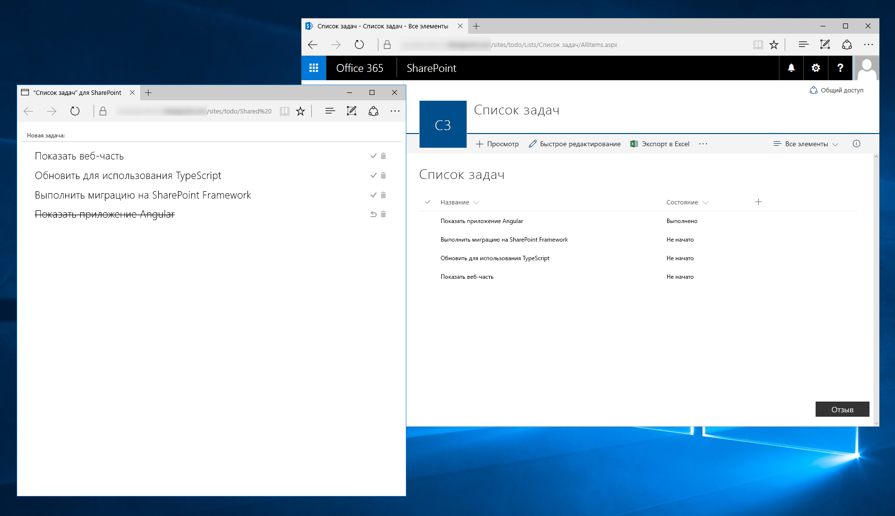
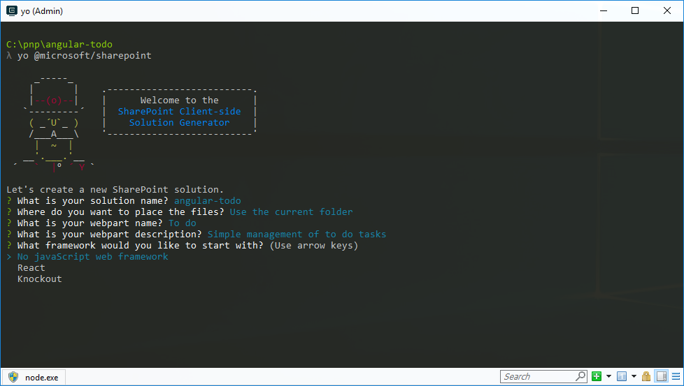
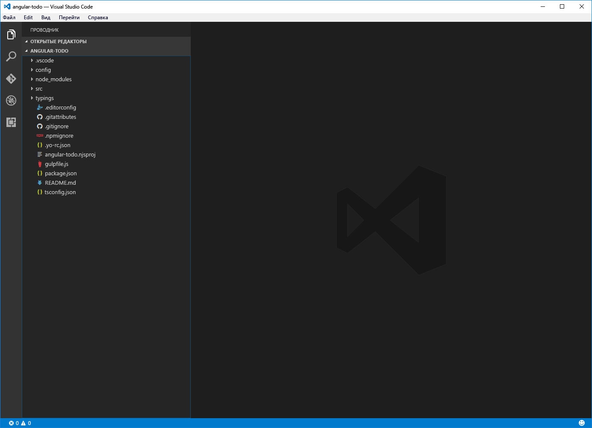
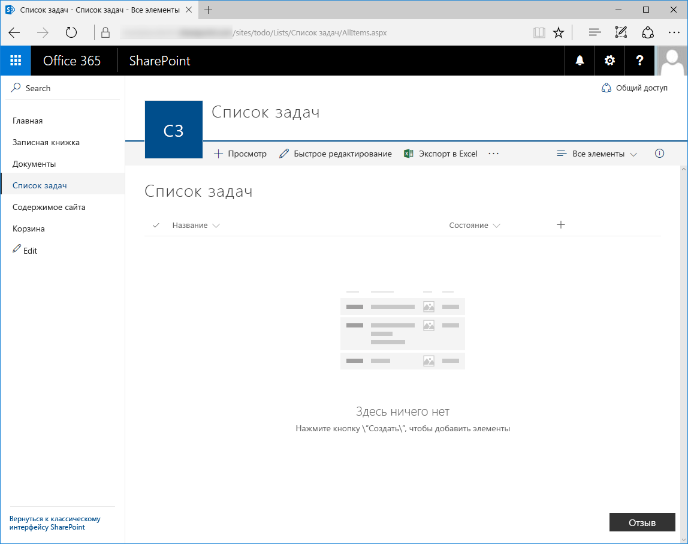
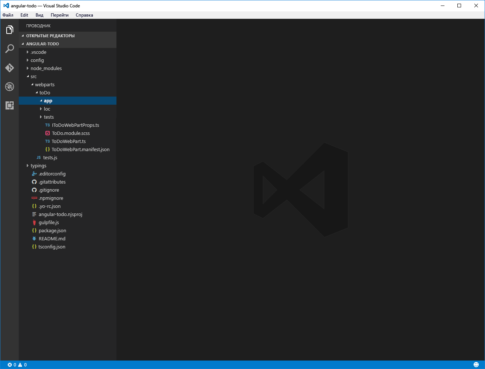
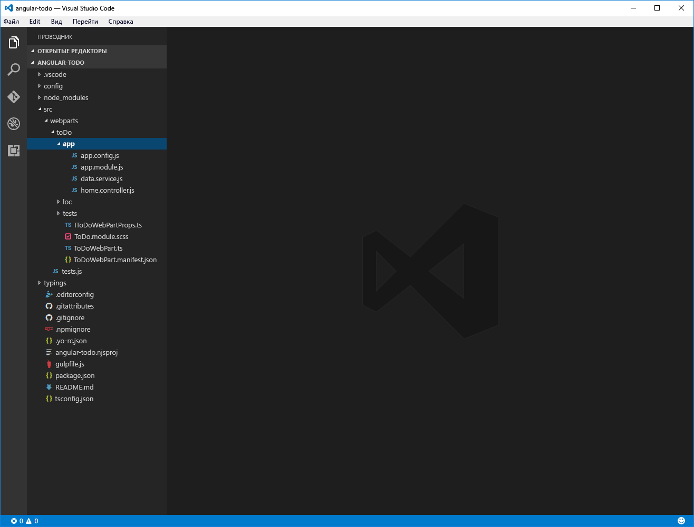
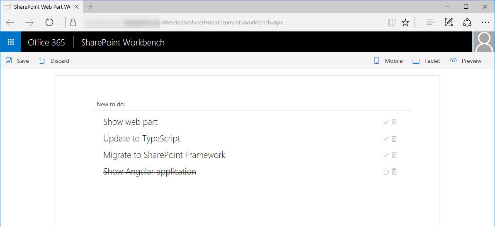

# <a name="migrate-angularjs-applications-to-sharepoint-framework"></a>Перенос приложений AngularJS на платформу SharePoint Framework

Раньше во многих организациях решения для SharePoint создавались с помощью AngularJS. В этой статье показано, как перенести имеющееся приложение AngularJS, стиль которого создан с помощью [ngOfficeUIFabric](http://ngofficeuifabric.com) (директив AngularJS для Office UI Fabric), в клиентскую веб-часть SharePoint Framework. Приложение, используемое в этом руководстве, управляет элементами списка дел, сохраненными в списке SharePoint.



Исходный код приложения AngularJS доступен на сайте GitHub по адресу [https://github.com/SharePoint/sp-dev-fx-webparts/tree/dev/samples/angular-migration/angular-todo](https://github.com/SharePoint/sp-dev-fx-webparts/tree/dev/samples/angular-migration/angular-todo).

Исходный код приложения AngularJS, перенесенного на платформу SharePoint Framework, доступен на сайте GitHub по адресу [https://github.com/SharePoint/sp-dev-fx-webparts/tree/master/samples/angular-todo](https://github.com/SharePoint/sp-dev-fx-webparts/tree/master/samples/angular-todo).

> **Примечание.** Прежде чем выполнять действия, описанные в этой статье, [настройте среду разработки](http://dev.office.com/sharepoint/docs/spfx/set-up-your-development-environment) для создания решений на платформе SharePoint Framework.

## <a name="setup-project"></a>Настройка проекта

Прежде чем приступить к переносу приложения AngularJS, создайте и настройте новый проект на платформе SharePoint Framework для размещения приложения AngularJS.

### <a name="create-new-project"></a>Создание проекта

Для начала создайте папку проекта.

```sh
md angular-todo
```

Перейдите в папку проекта:

```sh
cd angular-todo
```

В папке проекта запустите генератор Yeoman для SharePoint Framework, чтобы сформировать шаблон проекта на платформе SharePoint Framework:

```sh
yo @microsoft/sharepoint
```

Определите значения следующим образом:

- **angular-todo** как имя решения
- расположение файлов — **Use the current folder** (Использовать текущую папку)
- имя веб-части — **To do** (Текущие дела)
- описание веб-части — **Simple management of to do tasks** (Простое управление задачами)
- отправная точка создания веб-части — **No JavaScript web framework** (Без веб-платформы JavaScript).



После завершения скаффолдинга блокируйте версию зависимостей проекта, выполнив следующую команду:

```sh
npm shrinkwrap
```

Далее откройте папку проекта в редакторе кода. В этом руководстве используется Visual Studio Code.



### <a name="add-angularjs-and-ngofficeuifabric"></a>Добавление AngularJS и ngOfficeUIFabric

В этом руководстве AngularJS и ngOfficeUIFabric загружаются из CDN. Для этого откройте в редакторе кода файл **config/config.json** и добавьте следующие строки в свойстве **externals**:

```json
"angular": {
  "path": "https://cdnjs.cloudflare.com/ajax/libs/angular.js/1.6.6/angular.min.js",
  "globalName": "angular"
},
"ng-office-ui-fabric": "https://cdnjs.cloudflare.com/ajax/libs/ngOfficeUiFabric/0.12.3/ngOfficeUiFabric.js"
```

### <a name="add-angularjs-typings-for-typescript"></a>Добавление определений типа AngularJS для TypeScript

Так как в коде веб-части вы будете ссылаться на AngularJS, вам также потребуются определения типов AngularJS для TypeScript. Чтобы установить их, выполните в командной строке следующую команду:

```sh
npm install @types/angular --save-dev
```

## <a name="migrate-the-angularjs-application-as-is"></a>Перенос приложения AngularJS "как есть"

Для начала мы перенесем приложение AngularJS с минимальными изменениями кода. Позже мы обновим обычный код JavaScript приложения до TypeScript и улучшим его интеграцию с клиентской веб-частью.

### <a name="create-sharepoint-list"></a>Создание списка SharePoint

Создайте на сайте SharePoint новый список под названием **Todo** (Список дел). Добавьте в список новый столбец вариантов под названием **Status** (Состояние). Укажите следующие варианты:

```text
Not started
In progress
Completed
```



### <a name="copy-angularjs-application-files-to-the-web-part-project"></a>Копирование файлов приложения AngularJS в проект веб-части

В проекте веб-части создайте в папке **src/webparts/toDo** дочернюю папку с именем `app`.



Скопируйте содержимое папки **app** из исходного приложения в новую папку **app** проекта веб-части.



### <a name="load-the-angularjs-application-in-the-client-side-web-part"></a>Загрузка приложения AngularJS в клиентской веб-части

В редакторе кода откройте файл **./src/webparts/toDo/ToDoWebPart.ts**.

После последнего оператора `import` добавьте следующий код:

```ts
import * as angular from 'angular';
import 'ng-office-ui-fabric';
```

Замените содержимое метода **render** на следующий код:

```ts
export default class ToDoWebPart extends BaseClientSideWebPart<IToDoWebPartProps> {
  // ...
  public render(): void {
    if (this.renderedOnce === false) {
      require('./app/app.module');
      require('./app/app.config');
      require('./app/data.service');
      require('./app/home.controller');

      this.domElement.innerHTML = `
        <div class="${styles.toDo}">
          <div data-ng-controller="homeController as vm">
            <div class="${styles.loading}" ng-show="vm.isLoading">
              <uif-spinner>Loading...</uif-spinner>
            </div>
            <div class="entryform" ng-show="vm.isLoading === false">
              <uif-textfield uif-label="New to do:" uif-underlined ng-model="vm.newItem" ng-keydown="vm.todoKeyDown($event)"></uif-textfield>
            </div>
            <uif-list class="items" ng-show="vm.isLoading === false" >
              <uif-list-item ng-repeat="todo in vm.todoCollection" uif-item="todo" ng-class="{'done': todo.done}">
                <uif-list-item-primary-text>{{todo.title}}</uif-list-item-primary-text>
                <uif-list-item-actions>
                  <uif-list-item-action ng-click="vm.completeTodo(todo)" ng-show="todo.done === false">
                    <uif-icon uif-type="check"></uif-icon>
                  </uif-list-item-action>
                  <uif-list-item-action ng-click="vm.undoTodo(todo)" ng-show="todo.done">
                    <uif-icon uif-type="reactivate"></uif-icon>
                  </uif-list-item-action>
                  <uif-list-item-action ng-click="vm.deleteTodo(todo)">
                    <uif-icon uif-type="trash"></uif-icon>
                  </uif-list-item-action>
                </uif-list-item-actions>
              </uif-list-item>
            </uif-list>
          </div>
        </div>`;

      angular.bootstrap(this.domElement, ['todoapp']);
    }
  }
  // ...
}
```

### <a name="update-site-path"></a>Обновление пути к сайту

Откройте в редакторе кода файл **./src/webparts/toDo/app/app.config.js**. Замените значение константы **sharepointApi** на относительный касательно сервера URL-адрес для сайта SharePoint, на котором создан список дел, и добавьте к нему строку `/_api/`.

### <a name="add-css-styles"></a>Добавление стилей CSS

Кроме того, необходимо реализовать стили CSS, которые вы используете с шаблоном. В редакторе кода откройте файл **ToDoWebPart.module.scss** и замените его содержимое на следующие строки:

```scss
.toDo {
  .loading {
    margin: 0 auto;
    width: 6em;
  }
}
```

### <a name="trust-the-development-certificate"></a>Доверие сертификату разработки

По умолчанию сертификат разработки, необходимый для загрузки рабочей области SharePoint и ее ресурсов по протоколу HTTPS, не является доверенным, и при ее запуске в веб-браузере появляется предупреждение. В некоторых веб-браузерах рабочая область SharePoint не загружается, если SSL-сертификат не является доверенным. Чтобы избежать этой проблемы, следует одобрить сертификат разработки, предоставленный вместе с платформой SharePoint Framework.

Выполните в командной строке следующую команду:

```sh
gulp trust-dev-cert
```

### <a name="preview-web-part-in-the-hosted-workbench"></a>Просмотр веб-части в размещенной системе разработки

Выполните в командной строке следующую команду:

```sh
gulp serve --nobrowser
```

К URL-адресу сайта SharePoint добавьте `/_layouts/workbench.aspx`, например `https://contoso.sharepoint.com/_layouts/workbench.aspx`, а затем перейдите по этому адресу в веб-браузере.

Если вы правильно выполнили все действия, в браузере должна появиться веб-часть с формой для добавления элементов в список дел.


Добавьте несколько элементов списка дел, чтобы проверить работу веб-части.


### <a name="fix-web-part-styling"></a>Исправление стиля веб-части

Веб-часть работает правильно, но выглядит не так, как исходное приложение AngularJS. Это связано с тем, что ngOfficeUIFabric использует более раннюю версию Office UI Fabric, чем система разработки SharePoint. Ситуацию легко исправить, загрузив стили CSS, используемые в ngOfficeUIFabric. Но эти стили будут конфликтовать со стилями Office UI Fabric, используемыми в рабочей области SharePoint. В результате изменится ее пользовательский интерфейс. Более эффективное решение — добавить стили, необходимые определенным компонентам, к стилям веб-части.

Откройте в редакторе кода файл **./src/webparts/toDo/ToDoWebPart.module.scss**. Замените его содержимое следующим:

```scss
.toDo {
  .loading {
    margin: 0 auto;
    width: 6em;
  }

  .done :global .ms-ListItem-primaryText {
    text-decoration: line-through;
  }

  ul, li {
    margin: 0;
    padding: 0;
  }

  :global {
    .ms-Spinner{position:relative;height:20px}.ms-Spinner.ms-Spinner--large{height:28px}.ms-Spinner.ms-Spinner--large .ms-Spinner-label{left:34px;top:6px}.ms-Spinner-circle{position:absolute;border-radius:100px;background-color:#0078d7;opacity:0}@media screen and (-ms-high-contrast:active){.ms-Spinner-circle{background-color:#fff}}@media screen and (-ms-high-contrast:black-on-white){.ms-Spinner-circle{background-color:#000}}.ms-Spinner-label{position:relative;color:#333;font-family:Segoe UI Regular WestEuropean,Segoe UI,Tahoma,Arial,sans-serif;font-size:12px;font-weight:400;color:#0078d7;left:28px;top:2px}
    .ms-TextField{color:#333;font-family:Segoe UI Regular WestEuropean,Segoe UI,Tahoma,Arial,sans-serif;font-size:14px;font-weight:400;box-sizing:border-box;margin:0;padding:0;box-shadow:none;margin-bottom:8px}.ms-TextField.is-disabled .ms-TextField-field{background-color:#f4f4f4;border-color:#f4f4f4;pointer-events:none;cursor:default}.ms-TextField.is-disabled:-moz-placeholder,.ms-TextField.is-disabled:-ms-input-placeholder,.ms-TextField.is-disabled::-moz-placeholder,.ms-TextField.is-disabled::-webkit-input-placeholder{color:#a6a6a6}.ms-TextField.is-required .ms-Label:after{content:' *';color:#a80000}.ms-TextField.is-required:-moz-placeholder:after,.ms-TextField.is-required:-ms-input-placeholder:after,.ms-TextField.is-required::-moz-placeholder:after,.ms-TextField.is-required::-webkit-input-placeholder:after{content:' *';color:#a80000}.ms-TextField.is-active{border-color:#0078d7}.ms-TextField-field{box-sizing:border-box;margin:0;padding:0;box-shadow:none;border:1px solid #c8c8c8;border-radius:0;font-family:Segoe UI Semilight WestEuropean,Segoe UI Semilight,Segoe UI,Tahoma,Arial,sans-serif;font-size:12px;color:#333;height:32px;padding:6px 10px 8px;width:100%;min-width:180px;outline:0}.ms-TextField-field:hover{border-color:#767676}.ms-TextField-field:focus{border-color:#0078d7}@media screen and (-ms-high-contrast:active){.ms-TextField-field:focus,.ms-TextField-field:hover{border-color:#1aebff}}@media screen and (-ms-high-contrast:black-on-white){.ms-TextField-field:focus,.ms-TextField-field:hover{border-color:#37006e}}.ms-TextField-field:-moz-placeholder,.ms-TextField-field:-ms-input-placeholder,.ms-TextField-field::-moz-placeholder,.ms-TextField-field::-webkit-input-placeholder{color:#666}.ms-TextField-description{color:#767676;font-size:11px}.ms-TextField.ms-TextField--placeholder{position:relative}.ms-TextField.ms-TextField--placeholder .ms-Label{position:absolute;font-family:Segoe UI Semilight WestEuropean,Segoe UI Semilight,Segoe UI,Tahoma,Arial,sans-serif;font-size:12px;color:#666;padding:7px 0 7px 10px}.ms-TextField.ms-TextField--placeholder.is-disabled,.ms-TextField.ms-TextField--placeholder.is-disabled .ms-Label{color:#a6a6a6}@media screen and (-ms-high-contrast:active){.ms-TextField.ms-TextField--placeholder.is-disabled .ms-Label{color:#0f0}}@media screen and (-ms-high-contrast:black-on-white){.ms-TextField.ms-TextField--placeholder.is-disabled .ms-Label{color:#600000}}.ms-TextField.ms-TextField--underlined{border-bottom:1px solid #c8c8c8;display:table;width:100%;min-width:180px}.ms-TextField.ms-TextField--underlined:hover{border-color:#767676}@media screen and (-ms-high-contrast:active){.ms-TextField.ms-TextField--underlined:hover{border-color:#1aebff}}@media screen and (-ms-high-contrast:black-on-white){.ms-TextField.ms-TextField--underlined:hover{border-color:#37006e}}.ms-TextField.ms-TextField--underlined:active,.ms-TextField.ms-TextField--underlined:focus{border-color:#0078d7}.ms-TextField.ms-TextField--underlined .ms-Label{font-size:12px;margin-right:8px;display:table-cell;vertical-align:bottom;padding-left:12px;padding-bottom:5px;height:32px;width:1%;white-space:nowrap}.ms-TextField.ms-TextField--underlined .ms-TextField-field{border:0;float:left;display:table-cell;text-align:left;padding-top:8px;padding-bottom:2px}.ms-TextField.ms-TextField--underlined .ms-TextField-field:active,.ms-TextField.ms-TextField--underlined .ms-TextField-field:focus,.ms-TextField.ms-TextField--underlined .ms-TextField-field:hover{outline:0}.ms-TextField.ms-TextField--underlined.is-disabled{border-bottom-color:#eaeaea}.ms-TextField.ms-TextField--underlined.is-disabled .ms-Label{color:#a6a6a6}@media screen and (-ms-high-contrast:active){.ms-TextField.ms-TextField--underlined.is-disabled .ms-Label{color:#0f0}}@media screen and (-ms-high-contrast:black-on-white){.ms-TextField.ms-TextField--underlined.is-disabled .ms-Label{color:#600000}}.ms-TextField.ms-TextField--underlined.is-disabled .ms-TextField-field{background-color:transparent;color:#a6a6a6}.ms-TextField.ms-TextField--underlined.is-active{border-color:#0078d7}@media screen and (-ms-high-contrast:active){.ms-TextField.ms-TextField--underlined.is-active{border-color:#1aebff}}@media screen and (-ms-high-contrast:black-on-white){.ms-TextField.ms-TextField--underlined.is-active{border-color:#37006e}}.ms-TextField.ms-TextField--multiline .ms-TextField-field{line-height:17px;min-height:60px;min-width:260px;padding-top:6px;overflow:auto}.ms-Label,.ms-TextField.ms-TextField--multiline .ms-TextField-field{color:#333;font-family:Segoe UI Regular WestEuropean,Segoe UI,Tahoma,Arial,sans-serif;font-size:12px;font-weight:400}
    .ms-Label{margin:0;padding:0;box-shadow:none;box-sizing:border-box;display:block;padding:5px 0}.ms-Label.is-required:after{content:' *';color:#a80000}.ms-Label.is-disabled{color:#a6a6a6}@media screen and (-ms-high-contrast:active){.ms-Label.is-disabled{color:#0f0}}@media screen and (-ms-high-contrast:black-on-white){.ms-Label.is-disabled{color:#600000}}.is-disabled .ms-Label{color:#a6a6a6}@media screen and (-ms-high-contrast:active){.is-disabled .ms-Label{color:#0f0}}@media screen and (-ms-high-contrast:black-on-white){.is-disabled .ms-Label{color:#600000}}.ms-Toggle{color:#333;font-family:Segoe UI Regular WestEuropean,Segoe UI,Tahoma,Arial,sans-serif;font-size:14px;font-weight:400;box-sizing:border-box;margin:0;padding:0;box-shadow:none;position:relative;display:block;margin-bottom:26px}.ms-Toggle .ms-Label{position:relative;padding:0 0 0 62px;font-size:12px}.ms-Toggle:hover .ms-Label{color:#000}.ms-Toggle:active .ms-Label{color:#333}.ms-Toggle.is-disabled .ms-Label{color:#a6a6a6}@media screen and (-ms-high-contrast:active){.ms-Toggle.is-disabled .ms-Label{color:#0f0}}@media screen and (-ms-high-contrast:black-on-white){.ms-Toggle.is-disabled .ms-Label{color:#600000}}
    .ms-ListItem{font-family:"Segoe UI WestEuropean","Segoe UI",-apple-system,BlinkMacSystemFont,Roboto,"Helvetica Neue",sans-serif;-webkit-font-smoothing:antialiased;font-size:14px;font-weight:400;box-sizing:border-box;margin:0;padding:0;box-shadow:none;padding:9px 28px 3px;position:relative;display:block}.ms-ListItem::after,.ms-ListItem::before{display:table;content:"";line-height:0}.ms-ListItem::after{clear:both}.ms-ListItem-primaryText,.ms-ListItem-secondaryText,.ms-ListItem-tertiaryText{display:block;overflow:hidden;text-overflow:ellipsis;white-space:nowrap;display:block}.ms-ListItem-primaryText{font-family:"Segoe UI WestEuropean","Segoe UI",-apple-system,BlinkMacSystemFont,Roboto,"Helvetica Neue",sans-serif;-webkit-font-smoothing:antialiased;font-size:21px;font-weight:100;padding-right:80px;position:relative;top:-4px}.ms-ListItem-secondaryText{font-family:"Segoe UI WestEuropean","Segoe UI",-apple-system,BlinkMacSystemFont,Roboto,"Helvetica Neue",sans-serif;-webkit-font-smoothing:antialiased;font-size:14px;font-weight:400;line-height:25px;position:relative;top:-7px;padding-right:30px}.ms-ListItem-tertiaryText{font-family:"Segoe UI WestEuropean","Segoe UI",-apple-system,BlinkMacSystemFont,Roboto,"Helvetica Neue",sans-serif;-webkit-font-smoothing:antialiased;font-size:14px;font-weight:400;position:relative;top:-9px;margin-bottom:-4px;padding-right:30px}.ms-ListItem-metaText{font-family:"Segoe UI WestEuropean","Segoe UI",-apple-system,BlinkMacSystemFont,Roboto,"Helvetica Neue",sans-serif;-webkit-font-smoothing:antialiased;font-size:11px;font-weight:400;position:absolute;right:30px;top:39px}.ms-ListItem-image{float:left;height:70px;margin-left:-8px;margin-right:10px;width:70px}.ms-ListItem-selectionTarget{display:none}.ms-ListItem-actions{max-width:80px;position:absolute;right:30px;text-align:right;top:10px}.ms-ListItem-action{color:#a6a6a6;display:inline-block;font-size:15px;position:relative;text-align:center;top:3px;cursor:pointer;height:16px;width:16px}.ms-ListItem-action .ms-Icon{vertical-align:top}.ms-ListItem-action:hover{color:#666666;outline:1px solid transparent}.ms-ListItem.is-unread{border-left:3px solid #0078d7;padding-left:27px}.ms-ListItem.is-unread .ms-ListItem-metaText,.ms-ListItem.is-unread .ms-ListItem-secondaryText{color:#0078d7;font-weight:600}.ms-ListItem.is-unseen:after{border-right:10px solid transparent;border-top:10px solid #0078d7;left:0;position:absolute;top:0}.ms-ListItem.is-selectable .ms-ListItem-selectionTarget{display:block;height:20px;left:6px;position:absolute;top:13px;width:20px}.ms-ListItem.is-selectable .ms-ListItem-image{margin-left:0}.ms-ListItem.is-selectable:hover{background-color:#eaeaea;cursor:pointer;outline:1px solid transparent}.ms-ListItem.is-selectable:hover:before{-moz-osx-font-smoothing:grayscale;-webkit-font-smoothing:antialiased;display:inline-block;font-family:FabricMDL2Icons;font-style:normal;font-weight:400;speak:none;position:absolute;top:12px;left:6px;height:15px;width:15px;border:1px solid #767676}.ms-ListItem.is-selected:before{border:1px solid transparent}.ms-ListItem.is-selected:before,.ms-ListItem.is-selected:hover:before{-moz-osx-font-smoothing:grayscale;-webkit-font-smoothing:antialiased;display:inline-block;font-family:FabricMDL2Icons;font-style:normal;font-weight:400;speak:none;content:'\e041';font-size:15px;color:#767676;position:absolute;top:12px;left:6px}.ms-ListItem.is-selected:hover{background-color:#c7e0f4;outline:1px solid transparent}.ms-ListItem.ms-ListItem--document{padding:0}.ms-ListItem.ms-ListItem--document .ms-ListItem-itemIcon{width:70px;height:70px;float:left;text-align:center}.ms-ListItem.ms-ListItem--document .ms-ListItem-itemIcon .ms-Icon{font-size:38px;line-height:70px;color:#666666}.ms-ListItem.ms-ListItem--document .ms-ListItem-primaryText{display:block;overflow:hidden;text-overflow:ellipsis;white-space:nowrap;font-size:14px;padding-top:15px;padding-right:0;position:static}.ms-ListItem.ms-ListItem--document .ms-ListItem-secondaryText{display:block;overflow:hidden;text-overflow:ellipsis;white-space:nowrap;font-family:"Segoe UI WestEuropean","Segoe UI",-apple-system,BlinkMacSystemFont,Roboto,"Helvetica Neue",sans-serif;-webkit-font-smoothing:antialiased;font-size:11px;font-weight:400;padding-top:6px}.MailList{overflow-y:auto;-webkit-overflow-scrolling:touch;max-height:500px}.MailTile{margin-bottom:5px;padding:10px;background:red}
  }
}
```

В файле **./src/webparts/toDo/ToDoWebPart.ts** найдите метод **render** и измените шаблон отрисовки приложения так, чтобы использовались новые значки Office UI Fabric.

```ts
export default class ToDoWebPart extends BaseClientSideWebPart<IToDoWebPartProps> {
  // ...
  public render(): void {
    if (this.renderedOnce === false) {
      require('./app/app.module');
      require('./app/app.config');
      require('./app/data.service');
      require('./app/home.controller');

      this.domElement.innerHTML = `
        <div class="${styles.toDo}">
          <div data-ng-controller="homeController as vm">
            <div class="${styles.loading}" ng-show="vm.isLoading">
              <uif-spinner>Loading...</uif-spinner>
            </div>
            <div id="entryform" ng-show="vm.isLoading === false">
              <uif-textfield uif-label="New to do:" uif-underlined ng-model="vm.newItem" ng-keydown="vm.todoKeyDown($event)"></uif-textfield>
            </div>
            <uif-list id="items" ng-show="vm.isLoading === false" >
              <uif-list-item ng-repeat="todo in vm.todoCollection" uif-item="todo" ng-class="{'${styles.done}': todo.done}">
                <uif-list-item-primary-text>{{todo.title}}</uif-list-item-primary-text>
                <uif-list-item-actions>
                  <uif-list-item-action ng-click="vm.completeTodo(todo)" ng-show="todo.done === false">
                    <i class="ms-Icon ms-Icon--CheckMark" aria-hidden="true"></i>
                  </uif-list-item-action>
                  <uif-list-item-action ng-click="vm.undoTodo(todo)" ng-show="todo.done">
                    <i class="ms-Icon ms-Icon--RevToggleKey" aria-hidden="true"></i>
                  </uif-list-item-action>
                  <uif-list-item-action ng-click="vm.deleteTodo(todo)">
                    <i class="ms-Icon ms-Icon--Delete" aria-hidden="true"></i>
                  </uif-list-item-action>
                </uif-list-item-actions>
              </uif-list-item>
            </uif-list>
          </div>
        </div>`;

      angular.bootstrap(this.domElement, ['todoapp']);
    }
  }
  // ...
}
```

Когда вы обновите страницу веб-части в браузере, стиль станет правильным.



## <a name="upgrade-the-angularjs-application-to-typescript"></a>Обновление приложения AngularJS до TypeScript

Исходное приложение AngularJS написано на обычном JavaScript, из-за чего в нем могут возникать ошибки. При создании клиентских веб-частей на платформе SharePoint Framework можно использовать TypeScript и его функции обеспечения безопасности типа во время разработки. На этом этапе мы преобразуем обычный код JavaScript AngularJS в TypeScript.

### <a name="upgrade-application-configuration"></a>Обновление конфигурации приложения

В проекте переименуйте файл **./src/webparts/toDo/app/app.config.js** в `app.config.ts`. Измените его содержимое на следующее:

```ts
import * as angular from 'angular';

export default function() {
  const todoapp: ng.IModule = angular.module('todoapp');
  todoapp.constant('sharepointApi', '/todo/_api/');
  todoapp.constant('todoListName', 'Todo');
  todoapp.constant('hideFinishedTasks', false);
}
```

### <a name="upgrade-data-service"></a>Обновление службы данных

В проекте переименуйте файл **./src/webparts/toDo/app/data.service.js** в `DataService.ts`. Измените его содержимое на следующее:

```ts
import * as angular from 'angular';

export interface ITodo {
  id: number;
  title: string;
  done: boolean;
}

interface ITodoItem {
  Id: number;
  Title: string;
  Status: string;
}

export interface IDataService {
  getTodos: () => angular.IPromise<ITodo[]>;
  addTodo: (todo: string) => angular.IPromise<{}>;
  deleteTodo: (todo: ITodo) => angular.IPromise<{}>;
  setTodoStatus: (todo: ITodo, done: boolean) => angular.IPromise<{}>;
}

export default class DataService implements IDataService {
  public static $inject: string[] = ['$q', '$http', 'sharepointApi', 'todoListName', 'hideFinishedTasks'];

  constructor(private $q: angular.IQService,
    private $http: angular.IHttpService,
    private sharepointApi: string,
    private todoListName: string,
    private hideFinishedTasks: boolean) {
  }

  public getTodos(): angular.IPromise<ITodo[]> {
    const deferred: angular.IDeferred<ITodo[]> = this.$q.defer();

    let url: string = `${this.sharepointApi}web/lists/getbytitle('${this.todoListName}')/items?$select=Id,Title,Status&$orderby=ID desc`;

    if (this.hideFinishedTasks === true) {
      url += "&$filter=Status ne 'Completed'";
    }

    this.$http({
      url: url,
      method: 'GET',
      headers: {
        'Accept': 'application/json;odata=nometadata'
      }
    }).then((result: angular.IHttpPromiseCallbackArg<{ value: ITodoItem[] }>): void => {
      const todos: ITodo[] = [];
      for (let i: number = 0; i < result.data.value.length; i++) {
        const todo: ITodoItem = result.data.value[i];
        todos.push({
          id: todo.Id,
          title: todo.Title,
          done: todo.Status === 'Completed'
        });
      }
      deferred.resolve(todos);
    });

    return deferred.promise;
  }

  public addTodo(todo: string): angular.IPromise<{}> {
    const deferred: angular.IDeferred<{}> = this.$q.defer();

    let listItemEntityTypeFullName: string = undefined;
    this.getListItemEntityTypeFullName()
      .then((entityTypeName: string): angular.IPromise<string> => {
        listItemEntityTypeFullName = entityTypeName;
        return this.getRequestDigest();
      })
      .then((requestDigest: string): void => {
        const body: string = JSON.stringify({
          '__metadata': { 'type': listItemEntityTypeFullName },
          'Title': todo
        });
        this.$http({
          url: `${this.sharepointApi}web/lists/getbytitle('${this.todoListName}')/items`,
          method: 'POST',
          headers: {
            'Accept': 'application/json;odata=nometadata',
            'Content-type': 'application/json;odata=verbose',
            'X-RequestDigest': requestDigest
          },
          data: body
        }).then((result: angular.IHttpPromiseCallbackArg<{}>): void => {
          deferred.resolve();
        });
      });

    return deferred.promise;
  }

  public deleteTodo(todo: ITodo): angular.IPromise<{}> {
    const deferred: angular.IDeferred<{}> = this.$q.defer();

    this.getRequestDigest()
      .then((requestDigest: string): void => {
        this.$http({
          url: `${this.sharepointApi}web/lists/getbytitle('${this.todoListName}')/items(${todo.id})`,
          method: 'POST',
          headers: {
            'Accept': 'application/json;odata=nometadata',
            'X-RequestDigest': requestDigest,
            'IF-MATCH': '*',
            'X-HTTP-Method': 'DELETE'
          }
        }).then((result: angular.IHttpPromiseCallbackArg<{}>): void => {
          deferred.resolve();
        });
      });

    return deferred.promise;
  }

  public setTodoStatus(todo: ITodo, done: boolean): angular.IPromise<{}> {
    const deferred: angular.IDeferred<{}> = this.$q.defer();

    let listItemEntityTypeFullName: string = undefined;
    this.getListItemEntityTypeFullName()
      .then((entityTypeName: string): angular.IPromise<string> => {
        listItemEntityTypeFullName = entityTypeName;
        return this.getRequestDigest();
      })
      .then((requestDigest: string): void => {
        const body: string = JSON.stringify({
          '__metadata': { 'type': listItemEntityTypeFullName },
          'Status': done ? 'Completed' : 'Not started'
        });
        this.$http({
          url: `${this.sharepointApi}web/lists/getbytitle('${this.todoListName}')/items(${todo.id})`,
          method: 'POST',
          headers: {
            'Accept': 'application/json;odata=nometadata',
            'Content-type': 'application/json;odata=verbose',
            'X-RequestDigest': requestDigest,
            'IF-MATCH': '*',
            'X-HTTP-Method': 'MERGE'
          },
          data: body
        }).then((result: angular.IHttpPromiseCallbackArg<{}>): void => {
          deferred.resolve();
        });
      });

    return deferred.promise;
  }

  private getRequestDigest(): angular.IPromise<string> {
    const deferred: angular.IDeferred<string> = this.$q.defer();

    this.$http({
      url: this.sharepointApi + 'contextinfo',
      method: 'POST',
      headers: {
        'Accept': 'application/json;odata=nometadata'
      }
    }).then((result: angular.IHttpPromiseCallbackArg<{ FormDigestValue: string }>): void => {
      deferred.resolve(result.data.FormDigestValue);
    }, (err: any): void => {
      deferred.reject(err);
    });

    return deferred.promise;
  }

  private getListItemEntityTypeFullName(): angular.IPromise<string> {
    const deferred: angular.IDeferred<string> = this.$q.defer();

    this.$http({
      url: `${this.sharepointApi}web/lists/getbytitle('${this.todoListName}')?$select=ListItemEntityTypeFullName`,
      method: 'GET',
      headers: {
        'Accept': 'application/json;odata=nometadata'
      }
    }).then((result: angular.IHttpPromiseCallbackArg<{ ListItemEntityTypeFullName: string }>): void => {
      deferred.resolve(result.data.ListItemEntityTypeFullName);
    }, (err: any): void => {
      deferred.reject(err);
    });

    return deferred.promise;
  }
}
```

### <a name="upgrade-home-controller"></a>Обновление контроллера домашней страницы

В проекте переименуйте файл **./src/webparts/toDo/app/home.controller.js** в `HomeController.ts`. Измените его содержимое на следующее:

```ts
import * as angular from 'angular';
import { IDataService, ITodo } from './DataService';

export default class HomeController {
  public isLoading: boolean = false;
  public newItem: string = null;
  public todoCollection: ITodo[] = [];

  public static $inject: string[] = ['DataService', '$window'];

  constructor(private dataService: IDataService, private $window: angular.IWindowService) {
    this.loadTodos();
  }

  private loadTodos(): void {
    this.isLoading = true;
    this.dataService.getTodos()
      .then((todos: ITodo[]): void => {
        this.todoCollection = todos;
      })
      .finally((): void => {
        this.isLoading = false;
      });
  }

  public todoKeyDown($event: KeyboardEvent): void {
    if ($event.keyCode === 13 && this.newItem.length > 0) {
      $event.preventDefault();

      this.todoCollection.unshift({ id: -1, title: this.newItem, done: false });

      this.dataService.addTodo(this.newItem)
        .then((): void => {
          this.newItem = null;
          this.dataService.getTodos()
            .then((todos: ITodo[]): void => {
              this.todoCollection = todos;
            });
        });
    }
  }

  public deleteTodo(todo: ITodo): void {
    if (this.$window.confirm('Are you sure you want to delete this todo item?')) {
      let index: number = -1;
      for (let i: number = 0; i < this.todoCollection.length; i++) {
        if (this.todoCollection[i].id === todo.id) {
          index = i;
          break;
        }
      }

      if (index > -1) {
        this.todoCollection.splice(index, 1);
      }

      this.dataService.deleteTodo(todo)
        .then((): void => {
          this.dataService.getTodos()
            .then((todos: ITodo[]): void => {
              this.todoCollection = todos;
            });
        });
    }
  }

  public completeTodo(todo: ITodo): void {
    todo.done = true;

    this.dataService.setTodoStatus(todo, true)
      .then((): void => {
        this.dataService.getTodos()
          .then((todos: ITodo[]): void => {
            this.todoCollection = todos;
          });
      });
  }

  public undoTodo(todo: ITodo): void {
    todo.done = false;

    this.dataService.setTodoStatus(todo, false)
      .then((): void => {
        this.dataService.getTodos()
          .then((todos: ITodo[]): void => {
            this.todoCollection = todos;
          });
      });
  }
}
```

### <a name="upgrade-application-module"></a>Обновление модуля приложения

В проекте переименуйте файл **./src/webparts/toDo/app/app.module.js** в `app.module.ts`. Замените его содержимое следующим:

```ts
import * as angular from 'angular';
import config from './app.config';
import HomeController from './HomeController';
import DataService from './DataService';

import 'ng-office-ui-fabric';

const todoapp: angular.IModule = angular.module('todoapp', [
  'officeuifabric.core',
  'officeuifabric.components'
]);

config();

todoapp
  .controller('HomeController', HomeController)
  .service('DataService', DataService);
```

### <a name="update-reference-to-angularjs-application-in-the-web-part"></a>Обновление ссылки на приложение AngularJS в веб-части

Теперь, когда приложение AngularJS написано на TypeScript, а его фрагменты ссылаются друг на друга, веб-части больше не требуется ссылаться на все фрагменты приложения. Ей достаточно загрузить главный модуль, который загрузит все остальные элементы приложения AngularJS.

В редакторе кода откройте файл **./src/webparts/toDo/ToDoWebPart.ts**. Замените метод **render** следующим:

```ts
export default class ToDoWebPart extends BaseClientSideWebPart<IToDoWebPartProps> {
  // ...
  public render(): void {
    if (this.renderedOnce === false) {
      require('./app/app.module');

      this.domElement.innerHTML = `
        <div class="${styles.toDo}">
          <div data-ng-controller="HomeController as vm">
            <div class="${styles.loading}" ng-show="vm.isLoading">
              <uif-spinner>Loading...</uif-spinner>
            </div>
            <div id="entryform" ng-show="vm.isLoading === false">
              <uif-textfield uif-label="New to do:" uif-underlined ng-model="vm.newItem" ng-keydown="vm.todoKeyDown($event)"></uif-textfield>
            </div>
            <uif-list id="items" ng-show="vm.isLoading === false" >
              <uif-list-item ng-repeat="todo in vm.todoCollection" uif-item="todo" ng-class="{'${styles.done}': todo.done}">
                <uif-list-item-primary-text>{{todo.title}}</uif-list-item-primary-text>
                <uif-list-item-actions>
                  <uif-list-item-action ng-click="vm.completeTodo(todo)" ng-show="todo.done === false">
                    <i class="ms-Icon ms-Icon--CheckMark" aria-hidden="true"></i>
                  </uif-list-item-action>
                  <uif-list-item-action ng-click="vm.undoTodo(todo)" ng-show="todo.done">
                    <i class="ms-Icon ms-Icon--RevToggleKey" aria-hidden="true"></i>
                  </uif-list-item-action>
                  <uif-list-item-action ng-click="vm.deleteTodo(todo)">
                    <i class="ms-Icon ms-Icon--Delete" aria-hidden="true"></i>
                  </uif-list-item-action>
                </uif-list-item-actions>
              </uif-list-item>
            </uif-list>
          </div>
        </div>`;

      angular.bootstrap(this.domElement, ['todoapp']);
    }
  }
  // ...
}
```

Чтобы убедиться, что код успешно обновлен до TypeScript, выполните в командной строке следующую команду:

```sh
gulp serve --nobrowser
```

Обновите страницу системы разработки SharePoint в веб-браузере. Веб-часть должна отображаться так же, как и раньше.


Внешний вид веб-части не изменился, но ее код стал лучше. Если вы захотите ее обновить, вам будет проще проверять правильность и целостность кода во время разработки.

## <a name="improve-integration-of-the-angularjs-application-with-the-sharepoint-framework"></a>Улучшение интеграции приложения AngularJS с платформой SharePoint Framework

На этом этапе приложение AngularJS работает правильно и заключено в клиентскую веб-часть на платформе SharePoint Framework. Пользователи могут добавить веб-часть на страницу, но не могут настроить ее работу. Все значения конфигурации внедрены в код приложения AngularJS. В этом разделе показано расширение веб-части, позволяющее пользователям указывать имя списка дел и управлять отображением выполненных задач.

### <a name="define-web-part-properties"></a>Определение свойств веб-части

В редакторе кода откройте файл **./src/webparts/toDo/ToDoWebPart.manifest.json**. Замените раздел **properties** следующим:

```json
"properties": {
  "todoListName": "Todo",
  "hideFinishedTasks": false
}
```

В файле **./src/webparts/toDo/ToDoWebPart.ts** замените определение интерфейса `IToDoWebPartProps` следующим:

```ts
export interface IToDoWebPartProps {
  todoListName: string;
  hideFinishedTasks: boolean;
}
```

В файле **./src/webparts/toDo/ToDoWebPart.ts** замените первый оператор импорта на следующий:

```ts
import {
  BaseClientSideWebPart,
  IPropertyPaneSettings,
  PropertyPaneTextField,
  PropertyPaneToggle
} from '@microsoft/sp-webpart-base';
```

После этого в файле примера измените замените метод **getPropertyPaneConfiguration** следующим:

```ts
export default class ToDoWebPart extends BaseClientSideWebPart<IToDoWebPartProps> {
  // ...
  protected getPropertyPaneConfiguration(): IPropertyPaneConfiguration {
    return {
      pages: [
        {
          header: {
            description: strings.PropertyPaneDescription
          },
          groups: [
            {
              groupName: strings.BasicGroupName,
              groupFields: [
                PropertyPaneTextField('todoListName', {
                  label: strings.ListNameFieldLabel
                }),
                PropertyPaneToggle('hideFinishedTasks', {
                  label: strings.HideFinishedTasksFieldLabel
                })
              ]
            }
          ]
        }
      ]
    };
  }
  // ...
}
```

Добавьте недостающие строки ресурсов, заменив содержимое файла **./src/webparts/toDo/loc/mystrings.d.ts** на следующее:

```ts
declare interface IToDoWebPartStrings {
  PropertyPaneDescription: string;
  BasicGroupName: string;
  ListNameFieldLabel: string;
  HideFinishedTasksFieldLabel: string;
}

declare module 'ToDoWebPartStrings' {
  const strings: IToDoWebPartStrings;
  export = strings;
}
```

В файле **./src/webparts/toDo/loc/en-us.js** добавьте переводы для новых строк:

```js
define([], function() {
  return {
    "PropertyPaneDescription": "Description",
    "BasicGroupName": "Group Name",
    "ListNameFieldLabel": "List name",
    "HideFinishedTasksFieldLabel": "Hide finished tasks"
  }
});
```

### <a name="pass-web-part-properties-values-to-the-angularjs-application"></a>Передача значений свойств веб-части в приложение AngularJS

На этом этапе пользователи могут настраивать работу веб-части, но приложение AngularJS не использует эти значения. В этом разделе мы расширим приложение AngularJS, чтобы оно использовало значения конфигурации, указанные пользователем в области свойств веб-части. Для этого можно транслировать событие AngularJS в методе **render** и подписаться на это событие в контроллере, используемом веб-частью.

#### <a name="delete-angularjs-configuration-file"></a>Удаление файла конфигурации AngularJS

Удалите из проекта файл **./src/webparts/toDo/app/app.config.ts**. Позже мы обновим приложение, чтобы оно получало значения конфигурации из свойств веб-части.

#### <a name="remove-reference-to-configuration"></a>Удаление ссылки на конфигурацию

В файле **./src/webparts/toDo/app/app.module.ts** удалите ссылку на конфигурацию AngularJS, заменив его содержимое следующим:

```ts
import * as angular from 'angular';
import HomeController from './HomeController';
import DataService from './DataService';

import 'ng-office-ui-fabric';

const todoapp: angular.IModule = angular.module('todoapp', [
  'officeuifabric.core',
  'officeuifabric.components'
]);

todoapp
  .controller('HomeController', HomeController)
  .service('DataService', DataService);
```

#### <a name="update-data-service-to-accept-configuration-value-in-method-parameters"></a>Обновление службы данных для принятия значений конфигурации в параметрах методов

Изначально служба данных получала свою конфигурацию из констант, определенных в файле **app.config.ts**. Чтобы использовать вместо них значения конфигурации, настроенные в свойствах веб-части, определенные методы должны принимать параметры.

Откройте в редакторе кода файл **./src/webparts/toDo/app/DataService.ts** и замените его содержимое на следующее:

```ts
import * as angular from 'angular';

export interface ITodo {
  id: number;
  title: string;
  done: boolean;
}

interface ITodoItem {
  Id: number;
  Title: string;
  Status: string;
}

export interface IDataService {
  getTodos: (sharePointApi: string, todoListName: string, hideFinishedTasks: boolean) => angular.IPromise<ITodo[]>;
  addTodo: (todo: string, sharePointApi: string, todoListName: string) => angular.IPromise<{}>;
  deleteTodo: (todo: ITodo, sharePointApi: string, todoListName: string) => angular.IPromise<{}>;
  setTodoStatus: (todo: ITodo, done: boolean, sharePointApi: string, todoListName: string) => angular.IPromise<{}>;
}

export default class DataService implements IDataService {
  public static $inject: string[] = ['$q', '$http'];

  constructor(private $q: angular.IQService, private $http: angular.IHttpService) {
  }

  public getTodos(sharePointApi: string, todoListName: string, hideFinishedTasks: boolean): angular.IPromise<ITodo[]> {
    const deferred: angular.IDeferred<ITodo[]> = this.$q.defer();

    let url: string = `${sharePointApi}web/lists/getbytitle('${todoListName}')/items?$select=Id,Title,Status&$orderby=ID desc`;

    if (hideFinishedTasks === true) {
      url += "&$filter=Status ne 'Completed'";
    }

    this.$http({
      url: url,
      method: 'GET',
      headers: {
        'Accept': 'application/json;odata=nometadata'
      }
    }).then((result: angular.IHttpPromiseCallbackArg<{ value: ITodoItem[] }>): void => {
      const todos: ITodo[] = [];
      for (let i: number = 0; i < result.data.value.length; i++) {
        const todo: ITodoItem = result.data.value[i];
        todos.push({
          id: todo.Id,
          title: todo.Title,
          done: todo.Status === 'Completed'
        });
      }
      deferred.resolve(todos);
    });

    return deferred.promise;
  }

  public addTodo(todo: string, sharePointApi: string, todoListName: string): angular.IPromise<{}> {
    const deferred: angular.IDeferred<{}> = this.$q.defer();

    let listItemEntityTypeFullName: string = undefined;
    this.getListItemEntityTypeFullName(sharePointApi, todoListName)
      .then((entityTypeName: string): angular.IPromise<string> => {
        listItemEntityTypeFullName = entityTypeName;
        return this.getRequestDigest(sharePointApi);
      })
      .then((requestDigest: string): void => {
        const body: string = JSON.stringify({
          '__metadata': { 'type': listItemEntityTypeFullName },
          'Title': todo
        });
        this.$http({
          url: `${sharePointApi}web/lists/getbytitle('${todoListName}')/items`,
          method: 'POST',
          headers: {
            'Accept': 'application/json;odata=nometadata',
            'Content-type': 'application/json;odata=verbose',
            'X-RequestDigest': requestDigest
          },
          data: body
        }).then((result: angular.IHttpPromiseCallbackArg<{}>): void => {
          deferred.resolve();
        });
      });

    return deferred.promise;
  }

  public deleteTodo(todo: ITodo, sharePointApi: string, todoListName: string): angular.IPromise<{}> {
    const deferred: angular.IDeferred<{}> = this.$q.defer();

    this.getRequestDigest(sharePointApi)
      .then((requestDigest: string): void => {
        this.$http({
          url: `${sharePointApi}web/lists/getbytitle('${todoListName}')/items(${todo.id})`,
          method: 'POST',
          headers: {
            'Accept': 'application/json;odata=nometadata',
            'X-RequestDigest': requestDigest,
            'IF-MATCH': '*',
            'X-HTTP-Method': 'DELETE'
          }
        }).then((result: angular.IHttpPromiseCallbackArg<{}>): void => {
          deferred.resolve();
        });
      });

    return deferred.promise;
  }

  public setTodoStatus(todo: ITodo, done: boolean, sharePointApi: string, todoListName: string): angular.IPromise<{}> {
    const deferred: angular.IDeferred<{}> = this.$q.defer();

    let listItemEntityTypeFullName: string = undefined;
    this.getListItemEntityTypeFullName(sharePointApi, todoListName)
      .then((entityTypeName: string): angular.IPromise<string> => {
        listItemEntityTypeFullName = entityTypeName;
        return this.getRequestDigest(sharePointApi);
      })
      .then((requestDigest: string): void => {
        const body: string = JSON.stringify({
          '__metadata': { 'type': listItemEntityTypeFullName },
          'Status': done ? 'Completed' : 'Not started'
        });
        this.$http({
          url: `${sharePointApi}web/lists/getbytitle('${todoListName}')/items(${todo.id})`,
          method: 'POST',
          headers: {
            'Accept': 'application/json;odata=nometadata',
            'Content-type': 'application/json;odata=verbose',
            'X-RequestDigest': requestDigest,
            'IF-MATCH': '*',
            'X-HTTP-Method': 'MERGE'
          },
          data: body
        }).then((result: angular.IHttpPromiseCallbackArg<{}>): void => {
          deferred.resolve();
        });
      });

    return deferred.promise;
  }

  private getRequestDigest(sharePointApi: string): angular.IPromise<string> {
    const deferred: angular.IDeferred<string> = this.$q.defer();

    this.$http({
      url: sharePointApi + 'contextinfo',
      method: 'POST',
      headers: {
        'Accept': 'application/json;odata=nometadata'
      }
    }).then((result: angular.IHttpPromiseCallbackArg<{ FormDigestValue: string }>): void => {
      deferred.resolve(result.data.FormDigestValue);
    }, (err: any): void => {
      deferred.reject(err);
    });

    return deferred.promise;
  }

  private getListItemEntityTypeFullName(sharePointApi: string, todoListName: string): angular.IPromise<string> {
    const deferred: angular.IDeferred<string> = this.$q.defer();

    this.$http({
      url: `${sharePointApi}web/lists/getbytitle('${todoListName}')?$select=ListItemEntityTypeFullName`,
      method: 'GET',
      headers: {
        'Accept': 'application/json;odata=nometadata'
      }
    }).then((result: angular.IHttpPromiseCallbackArg<{ ListItemEntityTypeFullName: string }>): void => {
      deferred.resolve(result.data.ListItemEntityTypeFullName);
    }, (err: any): void => {
      deferred.reject(err);
    });

    return deferred.promise;
  }
}
```

#### <a name="broadcast-properties-change-event"></a>Трансляция события изменения свойств

В файле **./src/webparts/toDo/ToDoWebPart.ts** добавьте к классу **ToDoWebPart** новое свойство под названием `$injector`:

```ts
export default class ToDoWebPart extends BaseClientSideWebPart<IToDoWebPartProps> {
  private $injector: angular.auto.IInjectorService;
  // ...
}
```

В том же файле измените метод **render** так:

```ts
export default class ToDoWebPart extends BaseClientSideWebPart<IToDoWebPartProps> {
  // ...
  public render(): void {
    if (this.renderedOnce === false) {
      require('./app/app.module');

      this.domElement.innerHTML = `
        <div class="${styles.toDo}">
          <div data-ng-controller="HomeController as vm">
            <div class="${styles.configurationNeeded}" ng-show="vm.configurationNeeded">
              Please configure the web part
            </div>
            <div ng-show="vm.configurationNeeded === false">
              <div id="loading" ng-show="vm.isLoading">
                <uif-spinner>Loading...</uif-spinner>
              </div>
              <div id="entryform" ng-show="vm.isLoading === false">
                <uif-textfield uif-label="New to do:" uif-underlined ng-model="vm.newItem" ng-keydown="vm.todoKeyDown($event)"></uif-textfield>
              </div>
              <uif-list id="items" ng-show="vm.isLoading === false" >
                <uif-list-item ng-repeat="todo in vm.todoCollection" uif-item="todo" ng-class="{'${styles.done}': todo.done}">
                  <uif-list-item-primary-text>{{todo.title}}</uif-list-item-primary-text>
                  <uif-list-item-actions>
                    <uif-list-item-action ng-click="vm.completeTodo(todo)" ng-show="todo.done === false">
                      <i class="ms-Icon ms-Icon--CheckMark" aria-hidden="true"></i>
                    </uif-list-item-action>
                    <uif-list-item-action ng-click="vm.undoTodo(todo)" ng-show="todo.done">
                      <i class="ms-Icon ms-Icon--RevToggleKey" aria-hidden="true"></i>
                    </uif-list-item-action>
                    <uif-list-item-action ng-click="vm.deleteTodo(todo)">
                      <i class="ms-Icon ms-Icon--Delete" aria-hidden="true"></i>
                    </uif-list-item-action>
                  </uif-list-item-actions>
                </uif-list-item>
              </uif-list>
            </div>
          </div>
        </div>`;

      this.$injector = angular.bootstrap(this.domElement, ['todoapp']);
    }

    this.$injector.get('$rootScope').$broadcast('configurationChanged', {
      sharePointApi: this.context.pageContext.web.absoluteUrl + '/_api/',
      todoListName: this.properties.todoListName,
      hideFinishedTasks: this.properties.hideFinishedTasks
    });
  }
  // ...
}
```

В файле **./src/webparts/toDo/ToDoWebPart.module.scss** добавьте недостающие стили для класса **.configurationNeeded**:

```scss
.toDo {
  /* ... */
  .configurationNeeded {
    margin: 0 auto;
    width: 100%;
    text-align: center;
  }
  /* ... */
}
```

#### <a name="subscribe-to-the-properties-changed-event"></a>Подписка на событие изменения свойств

Откройте в редакторе кода файл **./src/webparts/toDo/app/HomeController.ts**.

Добавьте в класс **HomeController** следующие свойства:

```ts
export default class HomeController {
  // ...
  private sharePointApi: string = undefined;
  private todoListName: string = undefined;
  private hideFinishedTasks: boolean = false;
  private configurationNeeded: boolean = true;
  // ...
}
```

Расширьте конструктор класса **HomeController**, внедрив службу корневой области, и замените его содержимое следующим кодом:

```ts
export default class HomeController {
  // ...
  public static $inject: string[] = ['DataService', '$window', '$rootScope'];

  constructor(private dataService: IDataService,
    private $window: angular.IWindowService,
    $rootScope: angular.IRootScopeService) {
    const vm: HomeController = this;
    this.init(undefined, undefined);

    $rootScope.$on('configurationChanged',
      (event: angular.IAngularEvent,
       args: {
         sharePointApi: string;
         todoListName: string;
         hideFinishedTasks: boolean;
        }): void => {
      vm.init(args.sharePointApi, args.todoListName, args.hideFinishedTasks);
    });
  }

  // ...
}
```

Добавьте в класс **HomeController** метод **init**:

```ts
export default class HomeController {
  // ...
  private init(sharePointApi: string, todoListName: string, hideFinishedTasks?: boolean): void {
    if (sharePointApi !== undefined && sharePointApi.length > 0 &&
      todoListName !== undefined && todoListName.length > 0) {
      this.sharePointApi = sharePointApi;
      this.todoListName = todoListName;
      this.hideFinishedTasks = hideFinishedTasks;
      this.loadTodos();
      this.configurationNeeded = false;
    }
    else {
      this.configurationNeeded = true;
    }
  }
  // ...
}
```

Обновите все остальные методы класса **HomeController**, чтобы в них использовались значения конфигурации из свойств класса:

```ts
export default class HomeController {
  // ...
  private loadTodos(): void {
    this.isLoading = true;
    this.dataService.getTodos(this.sharePointApi, this.todoListName, this.hideFinishedTasks)
      .then((todos: ITodo[]): void => {
        this.todoCollection = todos;
      })
      .finally((): void => {
        this.isLoading = false;
      });
  }

  public todoKeyDown($event: KeyboardEvent): void {
    if ($event.keyCode === 13 && this.newItem.length > 0) {
      $event.preventDefault();

      this.todoCollection.unshift({ id: -1, title: this.newItem, done: false });

      this.dataService.addTodo(this.newItem, this.sharePointApi, this.todoListName)
        .then((): void => {
          this.newItem = null;
          this.dataService.getTodos(this.sharePointApi, this.todoListName, this.hideFinishedTasks)
            .then((todos: ITodo[]): void => {
              this.todoCollection = todos;
            });
        });
    }
  }

  public deleteTodo(todo: ITodo): void {
    if (this.$window.confirm('Are you sure you want to delete this todo item?')) {
      let index: number = -1;
      for (let i: number = 0; i < this.todoCollection.length; i++) {
        if (this.todoCollection[i].id === todo.id) {
          index = i;
          break;
        }
      }

      if (index > -1) {
        this.todoCollection.splice(index, 1);
      }

      this.dataService.deleteTodo(todo, this.sharePointApi, this.todoListName)
        .then((): void => {
          this.dataService.getTodos(this.sharePointApi, this.todoListName, this.hideFinishedTasks)
            .then((todos: ITodo[]): void => {
              this.todoCollection = todos;
            });
        });
    }
  }

  public completeTodo(todo: ITodo): void {
    todo.done = true;

    this.dataService.setTodoStatus(todo, true, this.sharePointApi, this.todoListName)
      .then((): void => {
        this.dataService.getTodos(this.sharePointApi, this.todoListName, this.hideFinishedTasks)
          .then((todos: ITodo[]): void => {
            this.todoCollection = todos;
          });
      });
  }

  public undoTodo(todo: ITodo): void {
    todo.done = false;

    this.dataService.setTodoStatus(todo, false, this.sharePointApi, this.todoListName)
      .then((): void => {
        this.dataService.getTodos(this.sharePointApi, this.todoListName, this.hideFinishedTasks)
          .then((todos: ITodo[]): void => {
            this.todoCollection = todos;
          });
      });
  }
}
```

Проверьте работу веб-части, выполнив в командной строке следующую команду:

```sh
gulp serve --nobrowser
```

В веб-браузере откройте рабочую область SharePoint и добавьте веб-часть на холст. Если переместить переключатель **Hide finished tasks** (Скрыть выполненные задачи), выполненные задачи будут показаны или скрыты.


