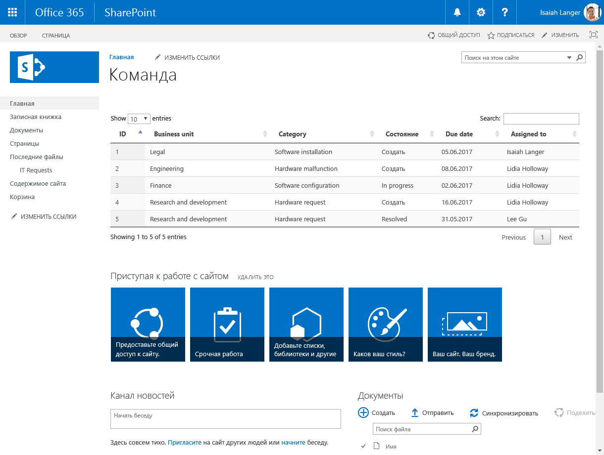
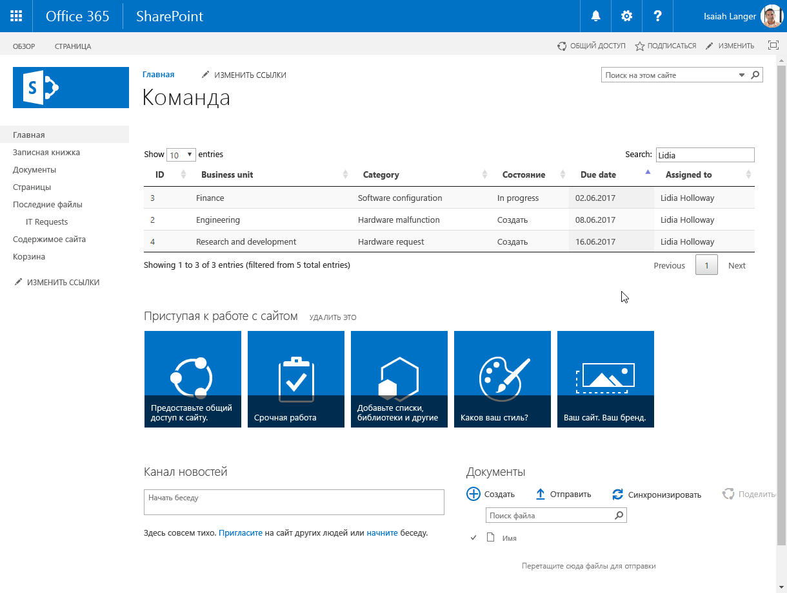
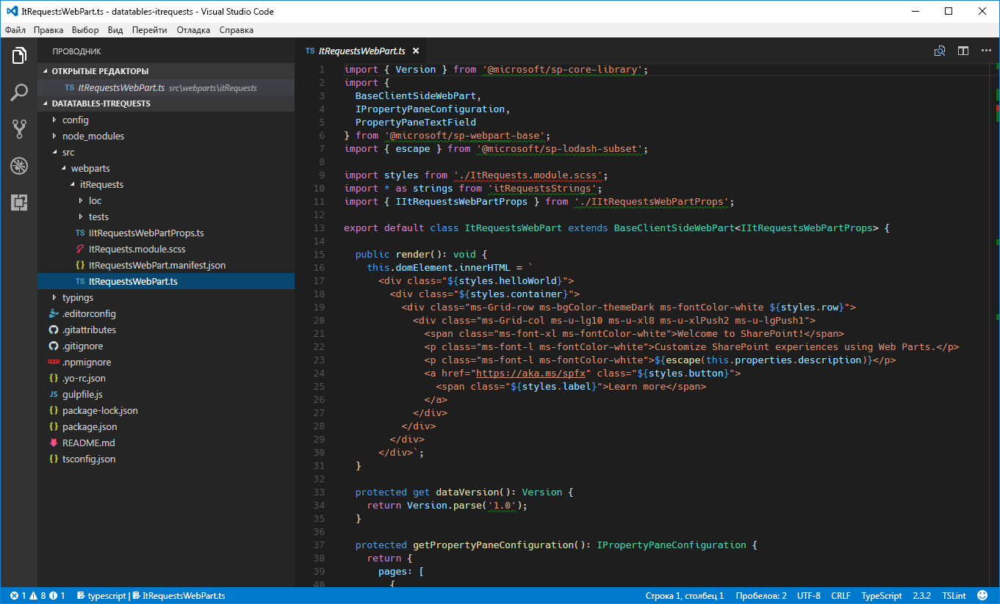
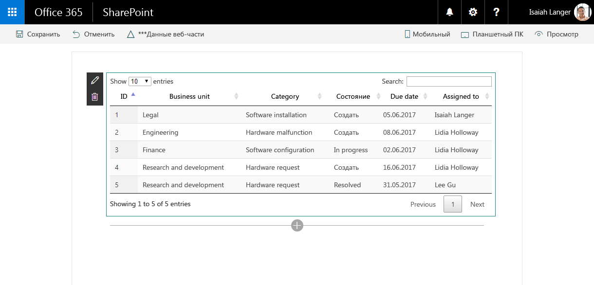
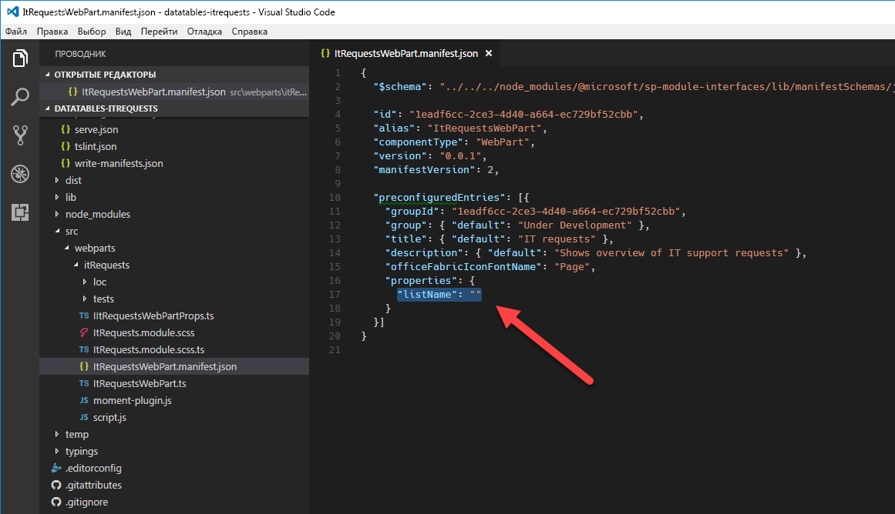
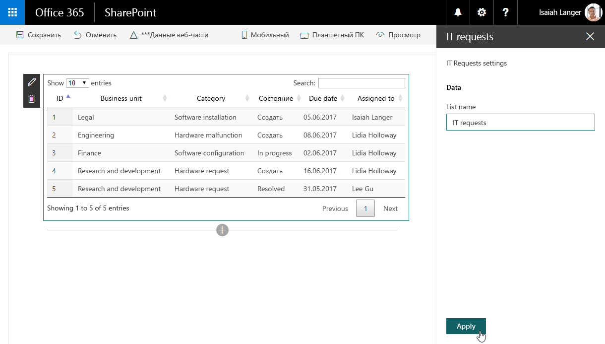

# <a name="migrate-jquery-and-datatables-solution-built-using-script-editor-web-part-to-sharepoint-framework"></a><span data-ttu-id="4dbf2-103">Перенос решения с jQuery или DataTables, созданного при помощи веб-части редактора скриптов, в SharePoint Framework</span><span class="sxs-lookup"><span data-stu-id="4dbf2-103">Migrate jQuery and DataTables solution built using Script Editor Web Part to SharePoint Framework</span></span>

<span data-ttu-id="4dbf2-104">Один из часто используемых подключаемых модулей jQuery — [DataTables](https://datatables.net/).</span><span class="sxs-lookup"><span data-stu-id="4dbf2-104">One of the frequently used jQuery plug-ins is [DataTables](https://datatables.net/).</span></span> <span data-ttu-id="4dbf2-105">С помощью DataTables можно легко создавать подробные обзоры данных, поступающих из SharePoint и внешних API.</span><span class="sxs-lookup"><span data-stu-id="4dbf2-105">With DataTables, you can easily build powerful data overviews of data coming from both SharePoint and external APIs.</span></span>

## <a name="list-of-it-requests-built-using-the-script-editor-web-part"></a><span data-ttu-id="4dbf2-106">Список запросов в службу поддержки, созданный с помощью веб-части редактора скриптов</span><span class="sxs-lookup"><span data-stu-id="4dbf2-106">List of IT requests built using the Script Editor Web Part</span></span>

<span data-ttu-id="4dbf2-107">Чтобы проиллюстрировать перенос модификации SharePoint, для которой применяется DataTables, в SharePoint Framework, мы будем использовать представленное ниже решение, которое показывает обзор запросов о технической поддержке, полученных из списка SharePoint.</span><span class="sxs-lookup"><span data-stu-id="4dbf2-107">To illustrate the process of migrating a SharePoint customization using DataTables to the SharePoint Framework, use the following solution that shows an overview of IT support requests retrieved from a SharePoint list.</span></span>



<br/>

<span data-ttu-id="4dbf2-p102">Решение создано с помощью стандартной веб-части редактора скриптов SharePoint. Ниже представлен код, используемый модификацией.</span><span class="sxs-lookup"><span data-stu-id="4dbf2-p102">The solution is built by using the standard SharePoint Script Editor Web Part. Following is the code used by the customization.</span></span>

```html
<script src="https://code.jquery.com/jquery-1.12.4.js"></script>
<script src="https://cdn.datatables.net/1.10.15/js/jquery.dataTables.js"></script>
<script src="https://momentjs.com/downloads/moment.min.js"></script>
<link rel="stylesheet" type="text/css" href="https://cdn.datatables.net/1.10.15/css/jquery.dataTables.min.css" />
<table id="requests" class="display" cellspacing="0" width="100%">
    <thead>
        <tr>
            <th>ID</th>
            <th>Business unit</th>
            <th>Category</th>
            <th>Status</th>
            <th>Due date</th>
            <th>Assigned to</th>
        </tr>
    </thead>
</table>
<script>
// UMD
(function(factory) {
    "use strict";

    if (typeof define === 'function' && define.amd) {
        // AMD
        define(['jquery'], function ($) {
            return factory( $, window, document );
        });
    }
    else if (typeof exports === 'object') {
        // CommonJS
        module.exports = function (root, $) {
            if (!root) {
                root = window;
            }

            if (!$) {
                $ = typeof window !== 'undefined' ?
                    require('jquery') :
                    require('jquery')( root );
            }

            return factory($, root, root.document);
        };
    }
    else {
        // Browser
        factory(jQuery, window, document);
    }
}
(function($, window, document) {
    $.fn.dataTable.render.moment = function (from, to, locale) {
        // Argument shifting
        if (arguments.length === 1) {
            locale = 'en';
            to = from;
            from = 'YYYY-MM-DD';
        }
        else if (arguments.length === 2) {
            locale = 'en';
        }

        return function (d, type, row) {
            var m = window.moment(d, from, locale, true);

            // Order and type get a number value from Moment, everything else
            // sees the rendered value
            return m.format(type === 'sort' || type === 'type' ? 'x' : to);
        };
    };
}));
</script>
<script>
$(document).ready(function() {
    $('#requests').DataTable({
        'ajax': {
        'url': "../_api/web/lists/getbytitle('IT Requests')/items?$select=ID,BusinessUnit,Category,Status,DueDate,AssignedTo/Title&$expand=AssignedTo/Title",
        'headers': { 'Accept': 'application/json;odata=nometadata' },
        'dataSrc': function(data) {
            return data.value.map(function(item) {
                return [
                    item.ID,
                    item.BusinessUnit,
                    item.Category,
                    item.Status,
                    new Date(item.DueDate),
                    item.AssignedTo.Title
                ];
            });
        }
    },
    columnDefs: [{
        targets: 4,
        render: $.fn.dataTable.render.moment('YYYY/MM/DD')
    }]
    });
});
</script>
```

<span data-ttu-id="4dbf2-111">Для начала модификация загружает свои библиотеки: jQuery, DataTables и Moment.js (строки 1–4).</span><span class="sxs-lookup"><span data-stu-id="4dbf2-111">First, the customization loads the libraries it uses: jQuery, DataTables, and Moment.js (lines 1-4).</span></span> 

<span data-ttu-id="4dbf2-112">Затем она задает структуру таблицы, используемой для представления данных (строки 5–16).</span><span class="sxs-lookup"><span data-stu-id="4dbf2-112">Next, it specifies the structure of the table used to present the data (lines 5-16).</span></span> 

<span data-ttu-id="4dbf2-113">После создания таблицы она включает библиотеку Moment.js в подключаемый модуль DataTables, чтобы отображаемые в таблице даты можно было форматировать (первый блок скрипта в строках 17–70).</span><span class="sxs-lookup"><span data-stu-id="4dbf2-113">After creating the table, it wraps Moment.js into a DataTables plug-in so that dates displayed in the table can be formatted (first script block on lines 17-70).</span></span> 

<span data-ttu-id="4dbf2-114">Наконец, модификация использует модуль DataTables для загрузки и показа списка запросов о технической поддержке.</span><span class="sxs-lookup"><span data-stu-id="4dbf2-114">Finally, the customization uses DataTables to load and present the list of IT support requests.</span></span> <span data-ttu-id="4dbf2-115">Данные загружаются с помощью AJAX из списка SharePoint (строки 71–96).</span><span class="sxs-lookup"><span data-stu-id="4dbf2-115">The data is loaded by using AJAX from a SharePoint list (lines 71-96).</span></span>

<span data-ttu-id="4dbf2-116">Благодаря модулю DataTables пользователи получают функциональное решение, в котором легко фильтровать, сортировать и перелистывать результаты, не прилагая дополнительных усилий.</span><span class="sxs-lookup"><span data-stu-id="4dbf2-116">Thanks to using DataTables, end users get a powerful solution where they can easily filter, sort, and page through the results without any additional development effort.</span></span>



## <a name="migrate-the-it-requests-overview-solution-from-the-script-editor-web-part-to-the-sharepoint-framework"></a><span data-ttu-id="4dbf2-118">Перенос решения для просмотра запросов в службу поддержки из веб-части редактора скриптов на платформу SharePoint Framework</span><span class="sxs-lookup"><span data-stu-id="4dbf2-118">Migrate the IT requests overview solution from the Script Editor Web Part to the SharePoint Framework</span></span>

> [!NOTE] 
> <span data-ttu-id="4dbf2-119">Прежде чем выполнять действия, описанные в этой статье, [настройте среду разработки](../../set-up-your-development-environment.md) для создания решений на платформе SharePoint Framework.</span><span class="sxs-lookup"><span data-stu-id="4dbf2-119">Before following the steps in this article, be sure to [set up your development environment](../../set-up-your-development-environment.md) for building SharePoint Framework solutions.</span></span>

<span data-ttu-id="4dbf2-p104">Преобразование этой модификации для платформы SharePoint Framework обеспечивает ряд преимуществ, таких как удобство настройки и централизованное управление решением. Ниже представлено пошаговое руководство по переносу решения на платформу SharePoint Framework. Для начала мы перенесем решение на платформу SharePoint Framework, внося как можно меньше изменений в первоначальный код. Затем преобразуем код решения в TypeScript, чтобы воспользоваться функциями обеспечения безопасности типов во время разработки.</span><span class="sxs-lookup"><span data-stu-id="4dbf2-p104">Transforming this customization to the SharePoint Framework offers a number of benefits such as more user-friendly configuration and centralized management of the solution. Following is a step-by-step description of how you would migrate the solution to the SharePoint Framework. First, you will migrate the solution to the SharePoint Framework with as few changes to the original code as possible. Later, you will transform the solution's code to TypeScript to benefit from its development-time type safety features.</span></span>

> [!NOTE] 
> <span data-ttu-id="4dbf2-124">Исходный код проекта на разных этапах миграции представлен в статье [Руководство. Перенос решения jQuery или DataTables, созданного с помощью веб-части редактора скриптов, в SharePoint Framework](https://github.com/SharePoint/sp-dev-fx-webparts/tree/master/tutorials/tutorial-migrate-datatables).</span><span class="sxs-lookup"><span data-stu-id="4dbf2-124">The source code of the project in the different stages of migration is available at [Tutorial: Migrate jQuery and DataTables solution built using Script Editor Web Part to SharePoint Framework](https://github.com/SharePoint/sp-dev-fx-webparts/tree/master/tutorials/tutorial-migrate-datatables).</span></span>

### <a name="create-new-sharepoint-framework-project"></a><span data-ttu-id="4dbf2-125">Создание проекта SharePoint Framework</span><span class="sxs-lookup"><span data-stu-id="4dbf2-125">Create new SharePoint Framework project</span></span>

1. <span data-ttu-id="4dbf2-126">Для начала создайте папку проекта:</span><span class="sxs-lookup"><span data-stu-id="4dbf2-126">Start by creating a new folder for your project:</span></span>

    ```sh
    md datatables-itrequests
    ```

2. <span data-ttu-id="4dbf2-127">Перейдите в папку проекта:</span><span class="sxs-lookup"><span data-stu-id="4dbf2-127">Navigate to the project folder:</span></span>

    ```sh
    cd datatables-itrequests
    ```

3. <span data-ttu-id="4dbf2-128">В папке проекта запустите генератор Yeoman для SharePoint Framework, чтобы выполнить скаффолдинг нового проекта на платформе SharePoint Framework:</span><span class="sxs-lookup"><span data-stu-id="4dbf2-128">In the project folder, run the SharePoint Framework Yeoman generator to scaffold a new SharePoint Framework project:</span></span>

    ```sh
    yo @microsoft/sharepoint
    ```

4. <span data-ttu-id="4dbf2-129">Определите значения следующим образом:</span><span class="sxs-lookup"><span data-stu-id="4dbf2-129">When prompted, define values as follows:</span></span>

    - <span data-ttu-id="4dbf2-130">имя решения — **datatables-itrequests**;</span><span class="sxs-lookup"><span data-stu-id="4dbf2-130">**datatables-itrequests** as your solution name</span></span>
    - <span data-ttu-id="4dbf2-131">расположение файлов — **Use the current folder** (Использовать текущую папку);</span><span class="sxs-lookup"><span data-stu-id="4dbf2-131">**Use the current folder** for the location to place the files</span></span>
    - <span data-ttu-id="4dbf2-132">отправная точка создания веб-части — **No javaScript web framework** (Без платформы JavaScript);</span><span class="sxs-lookup"><span data-stu-id="4dbf2-132">**No javaScript web framework** as the starting point to build the web part</span></span>
    - <span data-ttu-id="4dbf2-133">имя веб-части — **IT requests** (Запросы в службу поддержки);</span><span class="sxs-lookup"><span data-stu-id="4dbf2-133">**IT requests** as your web part name</span></span>
    - <span data-ttu-id="4dbf2-134">описание веб-части — **Shows overview of IT support requests** (Показывает обзор запросов в службу поддержки).</span><span class="sxs-lookup"><span data-stu-id="4dbf2-134">**Shows overview of IT support requests** as your web part description</span></span>

    

5. <span data-ttu-id="4dbf2-136">По завершении скаффолдинга заблокируйте версию зависимостей проекта, выполнив следующую команду:</span><span class="sxs-lookup"><span data-stu-id="4dbf2-136">After the scaffolding completes, lock down the version of the project dependencies by running the following command:</span></span>

    ```sh
    npm shrinkwrap
    ```

6. <span data-ttu-id="4dbf2-137">Откройте папку проекта в редакторе кода.</span><span class="sxs-lookup"><span data-stu-id="4dbf2-137">Open your project folder in your code editor.</span></span> <span data-ttu-id="4dbf2-138">В этом руководстве используется Visual Studio Code.</span><span class="sxs-lookup"><span data-stu-id="4dbf2-138">In this tutorial, you will use Visual Studio Code.</span></span>

    

### <a name="load-javascript-libraries"></a><span data-ttu-id="4dbf2-140">Загрузка библиотек JavaScript</span><span class="sxs-lookup"><span data-stu-id="4dbf2-140">Load JavaScript libraries</span></span>

<span data-ttu-id="4dbf2-p106">Как и в исходном решении, созданном с помощью веб-части редактора скриптов, сначала следует загрузить библиотеки JavaScript, необходимые решению. В SharePoint Framework эта операция обычно делится на два этапа: указание URL-адреса, с которого будет загружена библиотека, и обращение к библиотеке в коде.</span><span class="sxs-lookup"><span data-stu-id="4dbf2-p106">Similar to the original solution built using the Script Editor Web Part, first you need to load the JavaScript libraries required by the solution. In SharePoint Framework this usually consists of two steps: specifying the URL from which the library should be loaded, and referencing the library in the code.</span></span>

1. <span data-ttu-id="4dbf2-p107">Укажите URL-адрес, с которого следует загружать библиотеки. В редакторе кода откройте файл **./config/config.json** и замените раздел **externals** на следующий код:</span><span class="sxs-lookup"><span data-stu-id="4dbf2-p107">Specify the URLs from which libraries should be loaded. In the code editor, open the **./config/config.json** file, and change the **externals** section to:</span></span>

    ```json
    {
    "externals": {
        "jquery": "https://code.jquery.com/jquery-1.12.4.min.js",
        "datatables.net": "https://cdn.datatables.net/1.10.15/js/jquery.dataTables.min.js",
        "moment": "https://momentjs.com/downloads/moment.min.js"
    }
    }
    ```

2. <span data-ttu-id="4dbf2-145">Откройте файл **./src/webparts/itRequests/ItRequestsWebPart.ts** и после последнего оператора **import** добавьте следующий код:</span><span class="sxs-lookup"><span data-stu-id="4dbf2-145">Open the **./src/webparts/itRequests/ItRequestsWebPart.ts** file, and after the last **import** statement add:</span></span>

    ```typescript
    import 'jquery';
    import 'datatables.net';
    import 'moment';
    ```

### <a name="define-data-table"></a><span data-ttu-id="4dbf2-146">Определение таблицы данных</span><span class="sxs-lookup"><span data-stu-id="4dbf2-146">Define data table</span></span>

<span data-ttu-id="4dbf2-147">Как и в исходном решении, далее необходимо определить структуру таблицы, используемой для отображения данных.</span><span class="sxs-lookup"><span data-stu-id="4dbf2-147">Just as in the original solution, the next step is to define the structure of the table used to display the data.</span></span> 

<span data-ttu-id="4dbf2-148">Откройте в редакторе кода файл **./src/webparts/itRequests/ItRequestsWebPart.ts** и замените метод **render** на следующий код:</span><span class="sxs-lookup"><span data-stu-id="4dbf2-148">In the code editor, open the **./src/webparts/itRequests/ItRequestsWebPart.ts** file, and change the **render** method to:</span></span>

```typescript
    export default class ItRequestsWebPart extends BaseClientSideWebPart<IItRequestsWebPartProps> {
    public render(): void {
        this.domElement.innerHTML = `
        <link rel="stylesheet" type="text/css" href="https://cdn.datatables.net/1.10.15/css/jquery.dataTables.min.css" />
        <table id="requests" class="display ${styles.helloWorld}" cellspacing="0" width="100%">
            <thead>
                <tr>
                    <th>ID</th>
                    <th>Business unit</th>
                    <th>Category</th>
                    <th>Status</th>
                    <th>Due date</th>
                    <th>Assigned to</th>
                </tr>
            </thead>
        </table>`;
    }
    // ...
    }
```

### <a name="register-momentjs-plugin-for-datatables"></a><span data-ttu-id="4dbf2-149">Регистрация подключаемого модуля Moment.js для DataTables</span><span class="sxs-lookup"><span data-stu-id="4dbf2-149">Register Moment.js plugin for DataTables</span></span>

<span data-ttu-id="4dbf2-150">Далее необходимо определить подключаемый модуль Moment.js для DataTables, чтобы можно было форматировать даты в таблице.</span><span class="sxs-lookup"><span data-stu-id="4dbf2-150">The next step is to define the Moment.js plug-in for DataTables so that dates in the table can be formatted.</span></span> 

1. <span data-ttu-id="4dbf2-151">В папке **./src/webparts/itRequests** создайте файл с именем **moment-plugin.js** и вставьте следующий код:</span><span class="sxs-lookup"><span data-stu-id="4dbf2-151">In the **./src/webparts/itRequests** folder, create a new file named **moment-plugin.js**, and paste the following code:</span></span>

    ```js
    // UMD
    (function (factory) {
        "use strict";

        if (typeof define === 'function' && define.amd) {
            // AMD
            define(['jquery'], function ($) {
                return factory($, window, document);
            });
        }
        else if (typeof exports === 'object') {
            // CommonJS
            module.exports = function (root, $) {
                if (!root) {
                    root = window;
                }

                if (!$) {
                    $ = typeof window !== 'undefined' ?
                        require('jquery') :
                        require('jquery')(root);
                }

                return factory($, root, root.document);
            };
        }
        else {
            // Browser
            factory(jQuery, window, document);
        }
    }

    (function ($, window, document) {
        $.fn.dataTable.render.moment = function (from, to, locale) {
            // Argument shifting
            if (arguments.length === 1) {
                locale = 'en';
                to = from;
                from = 'YYYY-MM-DD';
            }
            else if (arguments.length === 2) {
                locale = 'en';
            }

            return function (d, type, row) {
                var moment = require('moment');
                var m = moment(d, from, locale, true);

                // Order and type get a number value from Moment, everything else
                // sees the rendered value
                return m.format(type === 'sort' || type === 'type' ? 'x' : to);
            };
        };
    }));
    ```

2. <span data-ttu-id="4dbf2-152">Чтобы загрузить подключаемый модуль, веб-часть должна ссылаться на новый файл **moment-plugin.js**.</span><span class="sxs-lookup"><span data-stu-id="4dbf2-152">For the web part to load the plug-in, it has to reference the newly created **moment-plugin.js** file.</span></span> <span data-ttu-id="4dbf2-153">Откройте в редакторе кода файл **./src/webparts/itRequests/ItRequestsWebPart.ts** и после последнего оператора **import** добавьте следующий код:</span><span class="sxs-lookup"><span data-stu-id="4dbf2-153">In the code editor, open the **./src/webparts/itRequests/ItRequestsWebPart.ts** file, and after the last **import** statement add:</span></span>

    ```typescript
    import './moment-plugin';
    ```

> [!NOTE] 
> <span data-ttu-id="4dbf2-154">Ссылаясь на другие файлы, не требуется включать расширение **JS**.</span><span class="sxs-lookup"><span data-stu-id="4dbf2-154">You don't need to include the **.js** extension when referencing other files.</span></span> <span data-ttu-id="4dbf2-155">SharePoint Framework автоматически распознает расширение.</span><span class="sxs-lookup"><span data-stu-id="4dbf2-155">SharePoint Framework automatically resolves the extension for you.</span></span>

### <a name="initiate-datatables-and-load-data"></a><span data-ttu-id="4dbf2-156">Инициализация модуля DataTables и загрузка данных</span><span class="sxs-lookup"><span data-stu-id="4dbf2-156">Initiate DataTables and load data</span></span>

<span data-ttu-id="4dbf2-157">Последний этап — добавление кода, инициализирующего таблицу данных и загружающего данные из SharePoint.</span><span class="sxs-lookup"><span data-stu-id="4dbf2-157">The last step is to include the code that initiates the data table and loads the data from SharePoint.</span></span> 

1. <span data-ttu-id="4dbf2-158">В папке **./src/webparts/itRequests** создайте файл с именем **script.js** и вставьте следующий код:</span><span class="sxs-lookup"><span data-stu-id="4dbf2-158">In the **./src/webparts/itRequests** folder, create a new file named **script.js**, and paste the following code:</span></span>

    ```js
    $(document).ready(function () {
        $('#requests').DataTable({
            'ajax': {
                'url': "../../_api/web/lists/getbytitle('IT Requests')/items?$select=ID,BusinessUnit,Category,Status,DueDate,AssignedTo/Title&$expand=AssignedTo/Title",
                'headers': { 'Accept': 'application/json;odata=nometadata' },
                'dataSrc': function (data) {
                    return data.value.map(function (item) {
                        return [
                            item.ID,
                            item.BusinessUnit,
                            item.Category,
                            item.Status,
                            new Date(item.DueDate),
                            item.AssignedTo.Title
                        ];
                    });
                }
            },
            columnDefs: [{
                targets: 4,
                render: $.fn.dataTable.render.moment('YYYY/MM/DD')
            }]
        });
    });
    ```

2. <span data-ttu-id="4dbf2-159">Чтобы сослаться на этот файл в веб-части, откройте в редакторе кода файл **./src/webparts/itRequests/ItRequestsWebPart.ts** и замените метод **render** на следующий код:</span><span class="sxs-lookup"><span data-stu-id="4dbf2-159">To reference this file in the web part, in the code editor, open the **./src/webparts/itRequests/ItRequestsWebPart.ts** file, and change the **render** method to:</span></span>

    ```typescript
    export default class ItRequestsWebPart extends BaseClientSideWebPart<IItRequestsWebPartProps> {
    public render(): void {
        this.domElement.innerHTML = `
        <link rel="stylesheet" type="text/css" href="https://cdn.datatables.net/1.10.15/css/jquery.dataTables.min.css" />
        <table id="requests" class="display ${styles.helloWorld}" cellspacing="0" width="100%">
            <thead>
                <tr>
                    <th>ID</th>
                    <th>Business unit</th>
                    <th>Category</th>
                    <th>Status</th>
                    <th>Due date</th>
                    <th>Assigned to</th>
                </tr>
            </thead>
        </table>`;

        require('./script');
    }
    // ...
    }
    ```

3. <span data-ttu-id="4dbf2-160">Убедитесь, что веб-часть работает надлежащим образом, выполнив в командной строке следующую команду:</span><span class="sxs-lookup"><span data-stu-id="4dbf2-160">Verify that the web part is working as expected in the command line by executing:</span></span>

    ```sh
    gulp serve --nobrowser
    ```

<span data-ttu-id="4dbf2-161">Так как веб-часть загружает свои данные из SharePoint, ее необходимо тестировать с помощью размещенной рабочей области SharePoint Framework.</span><span class="sxs-lookup"><span data-stu-id="4dbf2-161">Because the web part loads its data from SharePoint, you have to test the web part by using the hosted SharePoint Framework Workbench.</span></span> <span data-ttu-id="4dbf2-162">Перейдите по адресу `https://yourtenant.sharepoint.com/_layouts/workbench.aspx` и добавьте веб-часть на холст.</span><span class="sxs-lookup"><span data-stu-id="4dbf2-162">Navigate to `https://yourtenant.sharepoint.com/_layouts/workbench.aspx` and add the web part to the canvas.</span></span> <span data-ttu-id="4dbf2-163">Теперь запросы о технической поддержке должны отображаться с помощью подключаемого модуля DataTables для jQuery.</span><span class="sxs-lookup"><span data-stu-id="4dbf2-163">You should now see the IT requests displayed by using the DataTables jQuery plug-in.</span></span>



## <a name="add-support-for-configuring-the-web-part-through-web-part-properties"></a><span data-ttu-id="4dbf2-165">Добавление возможности настраивать веб-часть с помощью ее свойств</span><span class="sxs-lookup"><span data-stu-id="4dbf2-165">Add support for configuring the web part through web part properties</span></span>

<span data-ttu-id="4dbf2-166">На предыдущих этапах мы перенесли решение для просмотра запросов о технической поддержке из веб-части редактора скриптов на платформу SharePoint Framework.</span><span class="sxs-lookup"><span data-stu-id="4dbf2-166">In the previous steps, you migrated the IT requests solutions from the Script Editor Web Part to the SharePoint Framework.</span></span> <span data-ttu-id="4dbf2-167">Решение уже работает надлежащим образом, но не использует преимущества платформы SharePoint Framework.</span><span class="sxs-lookup"><span data-stu-id="4dbf2-167">While the solution already works as expected, it doesn't use any of the SharePoint Framework benefits.</span></span> <span data-ttu-id="4dbf2-168">Имя списка, из которого загружаются запросы о технической поддержке, включено в код, представляющий собой обычный JavaScript, который хуже поддается рефакторингу, чем TypeScript.</span><span class="sxs-lookup"><span data-stu-id="4dbf2-168">The name of the list from which IT requests are loaded is included in the code, and the code itself is plain JavaScript, which is harder to refactor than TypeScript.</span></span> 

<span data-ttu-id="4dbf2-169">В приведенных ниже разделах описано, как расширить имеющееся решение, чтобы пользователи могли указывать имя списка, из которого будут загружаться данные.</span><span class="sxs-lookup"><span data-stu-id="4dbf2-169">The following steps illustrate how to extend the existing solution to allow users to specify the name of the list to load the data from.</span></span> <span data-ttu-id="4dbf2-170">Позже мы преобразуем код в TypeScript, чтобы воспользоваться функциями обеспечения безопасности типов.</span><span class="sxs-lookup"><span data-stu-id="4dbf2-170">Later, you transform the code to TypeScript to benefit from its type safety features.</span></span>

### <a name="define-web-part-property-for-storing-the-name-of-the-list"></a><span data-ttu-id="4dbf2-171">Определение свойства веб-части для хранения имени списка</span><span class="sxs-lookup"><span data-stu-id="4dbf2-171">Define web part property for storing the name of the list</span></span>

1. <span data-ttu-id="4dbf2-172">Определите свойство веб-части для хранения имени списка, из которого будут загружаться запросы о технической поддержке.</span><span class="sxs-lookup"><span data-stu-id="4dbf2-172">Define a web part property to store the name of the list from which IT requests should be loaded.</span></span> <span data-ttu-id="4dbf2-173">В редакторе кода откройте файл **./src/webparts/itRequests/ItRequestsWebPart.manifest.json**, замените имя заданного по умолчанию свойства **description** на **listName** и удалите его значение.</span><span class="sxs-lookup"><span data-stu-id="4dbf2-173">In the code editor, open the **./src/webparts/itRequests/ItRequestsWebPart.manifest.json** file, and rename the default **description** property to **listName** and clear its value.</span></span>

    

2. <span data-ttu-id="4dbf2-175">Обновите интерфейс свойств веб-части, чтобы применить изменения манифеста.</span><span class="sxs-lookup"><span data-stu-id="4dbf2-175">Update the web part properties interface to reflect the changes in the manifest.</span></span> <span data-ttu-id="4dbf2-176">В редакторе кода откройте файл **./src/webparts/itRequests/IItRequestsWebPartProps.ts** и замените его содержимое на следующий код:</span><span class="sxs-lookup"><span data-stu-id="4dbf2-176">In the code editor, open the **./src/webparts/itRequests/IItRequestsWebPartProps.ts** file, and change its contents to:</span></span>

    ```typescript
    export interface IItRequestsWebPartProps {
    listName: string;
    }
    ```

3. <span data-ttu-id="4dbf2-177">Обновите метки отображения для свойства **listName**.</span><span class="sxs-lookup"><span data-stu-id="4dbf2-177">Update the display labels for the **listName** property.</span></span> <span data-ttu-id="4dbf2-178">Откройте файл **./src/webparts/itRequests/loc/mystrings.d.ts** и замените его содержимое на следующее:</span><span class="sxs-lookup"><span data-stu-id="4dbf2-178">Open the **./src/webparts/itRequests/loc/mystrings.d.ts** file, and change its contents to:</span></span>

    ```typescript
    declare interface IItRequestsStrings {
    PropertyPaneDescription: string;
    BasicGroupName: string;
    ListNameFieldLabel: string;
    }

    declare module 'itRequestsStrings' {
    const strings: IItRequestsStrings;
    export = strings;
    }
    ```

4. <span data-ttu-id="4dbf2-179">Откройте файл **./src/webparts/itRequests/loc/en-us.js** и измените его содержимое на следующее:</span><span class="sxs-lookup"><span data-stu-id="4dbf2-179">Open the **./src/webparts/itRequests/loc/en-us.js** file, and change its contents to:</span></span>

    ```js
    define([], function() {
    return {
        "PropertyPaneDescription": "IT Requests settings",
        "BasicGroupName": "Data",
        "ListNameFieldLabel": "List name"
    }
    });
    ```

5. <span data-ttu-id="4dbf2-180">Обновите веб-часть, чтобы использовалось новое свойство.</span><span class="sxs-lookup"><span data-stu-id="4dbf2-180">Update the web part to use the newly defined property.</span></span> <span data-ttu-id="4dbf2-181">В редакторе кода откройте файл **./src/webparts/itRequests/ItRequestsWebPart.ts** и замените код метода **getPropertyPaneConfiguration** на следующий:</span><span class="sxs-lookup"><span data-stu-id="4dbf2-181">In the code editor, open the **./src/webparts/itRequests/ItRequestsWebPart.ts** file, and change the **getPropertyPaneConfiguration** method to:</span></span>

    ```typescript
    export default class ItRequestsWebPart extends BaseClientSideWebPart<IItRequestsWebPartProps> {
    // ...
    protected getPropertyPaneConfiguration(): IPropertyPaneConfiguration {
        return {
        pages: [
            {
            header: {
                description: strings.PropertyPaneDescription
            },
            groups: [
                {
                groupName: strings.BasicGroupName,
                groupFields: [
                    PropertyPaneTextField('listName', {
                    label: strings.ListNameFieldLabel
                    })
                ]
                }
            ]
            }
        ]
        };
    }

    protected get disableReactivePropertyChanges(): boolean {
        return true;
    }
    }
    ```

<span data-ttu-id="4dbf2-182">Чтобы веб-часть не перезагружалась, когда пользователь вводит имя списка, она также должна использовать нереактивную область свойств. Для этого добавьте метод **disableReactivePropertyChanges** и задайте для него возвращаемое значение **true**.</span><span class="sxs-lookup"><span data-stu-id="4dbf2-182">To prevent the web part from reloading as users type the name of the list, you also configured the web part to use the non-reactive property pane by adding the **disableReactivePropertyChanges** method and setting its return value to **true**.</span></span>

### <a name="use-the-configured-name-of-the-list-to-load-the-data-from"></a><span data-ttu-id="4dbf2-183">Использование заданного имени списка для загрузки данных</span><span class="sxs-lookup"><span data-stu-id="4dbf2-183">Use the configured name of the list to load the data from</span></span>

<span data-ttu-id="4dbf2-184">Изначально имя списка, из которого загружаются данные, внедрялось в запрос REST.</span><span class="sxs-lookup"><span data-stu-id="4dbf2-184">Initially, the name of the list from which the data should be loaded was embedded in the REST query.</span></span> <span data-ttu-id="4dbf2-185">Теперь, когда пользователи могут настраивать это имя, указанное значение следует внедрять в запрос REST перед загрузкой данных.</span><span class="sxs-lookup"><span data-stu-id="4dbf2-185">Now that users can configure this name, the configured value should be injected into the REST query before loading the data.</span></span> <span data-ttu-id="4dbf2-186">Это проще всего сделать, переместив содержимое файла **script.js** в основной файл веб-части.</span><span class="sxs-lookup"><span data-stu-id="4dbf2-186">The easiest way to do that is by moving the contents of the **script.js** file to the main web part file.</span></span>

1. <span data-ttu-id="4dbf2-187">Откройте в редакторе кода файл **./src/webparts/itRequests/ItRequestsWebPart.ts** и замените метод **render** на следующий код:</span><span class="sxs-lookup"><span data-stu-id="4dbf2-187">In the code editor, open the **./src/webparts/itRequests/ItRequestsWebPart.ts** file, and change the **render** method to:</span></span>

    ```typescript
    var $: any = (window as any).$;

    export default class ItRequestsWebPart extends BaseClientSideWebPart<IItRequestsWebPartProps> {
    public render(): void {
        this.domElement.innerHTML = `
        <link rel="stylesheet" type="text/css" href="https://cdn.datatables.net/1.10.15/css/jquery.dataTables.min.css" />
        <table class="display ${styles.helloWorld}" cellspacing="0" width="100%">
            <thead>
                <tr>
                    <th>ID</th>
                    <th>Business unit</th>
                    <th>Category</th>
                    <th>Status</th>
                    <th>Due date</th>
                    <th>Assigned to</th>
                </tr>
            </thead>
        </table>`;

        $(document).ready(() => {
        $('table', this.domElement).DataTable({
            'ajax': {
            'url': `../../_api/web/lists/getbytitle('${escape(this.properties.listName)}')/items?$select=ID,BusinessUnit,Category,Status,DueDate,AssignedTo/Title&$expand=AssignedTo/Title`,
            'headers': { 'Accept': 'application/json;odata=nometadata' },
            'dataSrc': function (data) {
                return data.value.map(function (item) {
                return [
                    item.ID,
                    item.BusinessUnit,
                    item.Category,
                    item.Status,
                    new Date(item.DueDate),
                    item.AssignedTo.Title
                ];
                });
            }
            },
            columnDefs: [{
            targets: 4,
            render: $.fn.dataTable.render.moment('YYYY/MM/DD')
            }]
        });
        });
    }

    // ...
    }
    ```

2. <span data-ttu-id="4dbf2-188">Вместо того чтобы ссылаться на код из файла **script.js**, мы поместим все его содержимое в метод **render** веб-части.</span><span class="sxs-lookup"><span data-stu-id="4dbf2-188">Instead of referencing the code from the **script.js** file, all of its contents are a part of the web part's **render** method.</span></span> <span data-ttu-id="4dbf2-189">Теперь в строке 40 запроса REST можно заменить фиксированное имя списка на значение свойства **listName**, в котором хранится заданное пользователем имя списка.</span><span class="sxs-lookup"><span data-stu-id="4dbf2-189">In the REST query, in line 40, you can now replace the fixed name of the list with the value of the **listName** property which holds the name of the list as configured by the user.</span></span> <span data-ttu-id="4dbf2-190">Прежде чем использовать это значение, необходимо применить к нему функцию **escape** из lodash, чтобы запретить внедрение скриптов.</span><span class="sxs-lookup"><span data-stu-id="4dbf2-190">Before using the value, it's being escaped by using the lodash's **escape** function to disallow script injection.</span></span>

    <span data-ttu-id="4dbf2-191">На этом этапе значительная часть кода все еще написана на обычном JavaScript.</span><span class="sxs-lookup"><span data-stu-id="4dbf2-191">At this point, the bulk of the code is still written using plain JavaScript.</span></span> <span data-ttu-id="4dbf2-192">Чтобы во время сборки не возникали проблемы с переменной jQuery **$**, необходимо указать для нее тип **any** в строке 18.</span><span class="sxs-lookup"><span data-stu-id="4dbf2-192">To avoid build issues with the **$** jQuery variable, you had to define it as **any** type in line 18.</span></span> <span data-ttu-id="4dbf2-193">Позже, при преобразовании кода в TypeScript, следует заменить ее на подходящее определение типа.</span><span class="sxs-lookup"><span data-stu-id="4dbf2-193">Later, when transforming the code to TypeScript, you replace it with a proper type definition.</span></span>

    <span data-ttu-id="4dbf2-194">Так как мы только что переместили содержимое файла **script.js** в основной файл веб-части, файл **script.js** больше не требуется. Его можно удалить из проекта.</span><span class="sxs-lookup"><span data-stu-id="4dbf2-194">As you have just moved the contents of the **script.js** file into the main web part file, the **script.js** is no longer necessary, and you can delete it from the project.</span></span>

3. <span data-ttu-id="4dbf2-195">Чтобы проверить работу веб-части, выполните в командной строке следующую команду:</span><span class="sxs-lookup"><span data-stu-id="4dbf2-195">To verify that the web part is working as expected, run the following in the command line:</span></span>

    ```sh
    gulp serve --nobrowser
    ```

4. <span data-ttu-id="4dbf2-196">Перейдите к размещенной рабочей области и добавьте веб-часть на холст.</span><span class="sxs-lookup"><span data-stu-id="4dbf2-196">Navigate to the hosted Workbench and add the web part to the canvas.</span></span> <span data-ttu-id="4dbf2-197">Откройте область свойств веб-части, укажите имя списка запросов о технической поддержке и нажмите кнопку **Apply** (Применить), чтобы подтвердить изменения.</span><span class="sxs-lookup"><span data-stu-id="4dbf2-197">Open the web part property pane, specify the name of the list with IT requests, and select the **Apply** button to confirm the changes.</span></span> 

    <span data-ttu-id="4dbf2-198">Теперь в веб-части должны отображаться запросы о технической поддержке.</span><span class="sxs-lookup"><span data-stu-id="4dbf2-198">You should now see IT requests displayed in the web part.</span></span>

    

## <a name="transform-the-plain-javascript-code-to-typescript"></a><span data-ttu-id="4dbf2-200">Преобразование обычного кода JavaScript в TypeScript</span><span class="sxs-lookup"><span data-stu-id="4dbf2-200">Transform the plain JavaScript code to TypeScript</span></span>

<span data-ttu-id="4dbf2-201">Использование TypeScript вместо обычного JavaScript обеспечивает ряд преимуществ.</span><span class="sxs-lookup"><span data-stu-id="4dbf2-201">Using TypeScript over plain JavaScript offers a number of benefits.</span></span> <span data-ttu-id="4dbf2-202">Обслуживание и рефакторинг кода выполнять удобнее, если используется TypeScript. Кроме того, в таком коде можно раньше обнаруживать ошибки.</span><span class="sxs-lookup"><span data-stu-id="4dbf2-202">Not only is TypeScript easier to maintain and refactor, but it also allows you to catch errors earlier.</span></span> <span data-ttu-id="4dbf2-203">Ниже описано, как преобразовать первоначальный код JavaScript в TypeScript.</span><span class="sxs-lookup"><span data-stu-id="4dbf2-203">The following steps describe how you would transform the original JavaScript code to TypeScript.</span></span>

### <a name="add-type-definitions-for-used-libraries"></a><span data-ttu-id="4dbf2-204">Добавление определений типов для используемых библиотек</span><span class="sxs-lookup"><span data-stu-id="4dbf2-204">Add type definitions for used libraries</span></span>

<span data-ttu-id="4dbf2-p122">Для надлежащей работы TypeScript необходимы определения типов для различных библиотек, используемых в проекте. Определения типов часто распространяются в виде пакетов npm в пространстве имен @types.</span><span class="sxs-lookup"><span data-stu-id="4dbf2-p122">To function properly, TypeScript requires type definitions for the different libraries used in the project. Type definitions are often distributed as npm packages in the @types namespace.</span></span>

1. <span data-ttu-id="4dbf2-207">Чтобы установить определения типов для jQuery и DataTables, выполните в командной строке следующую команду:</span><span class="sxs-lookup"><span data-stu-id="4dbf2-207">Install type definitions for jQuery and DataTables by executing the following in the command line:</span></span>

    ```sh
    npm install --save-dev @types/jquery @types/jquery.datatables
    ```

    <span data-ttu-id="4dbf2-208">Определения типов для Moment.js доступны в пакете Moment.js.</span><span class="sxs-lookup"><span data-stu-id="4dbf2-208">Type definitions for Moment.js are distributed together with the Moment.js package.</span></span> <span data-ttu-id="4dbf2-209">Мы загружаем библиотеку Moment.js с URL-адреса, но для использования ее определений типов все равно необходимо установить пакет Moment.js в проекте.</span><span class="sxs-lookup"><span data-stu-id="4dbf2-209">Even though you're loading Moment.js from a URL, in order to use its typings, you still need to install the Moment.js package in the project.</span></span>

2. <span data-ttu-id="4dbf2-210">Установите пакет Moment.js, выполнив в командной строке следующую команду:</span><span class="sxs-lookup"><span data-stu-id="4dbf2-210">Install the Moment.js package by executing the following in the command line:</span></span>

    ```sh
    npm install --save moment
    ```

### <a name="update-package-references"></a><span data-ttu-id="4dbf2-211">Обновление ссылок на пакеты</span><span class="sxs-lookup"><span data-stu-id="4dbf2-211">Update package references</span></span>

<span data-ttu-id="4dbf2-212">Чтобы использовать типы из установленных определений, необходимо изменить ссылки на библиотеки.</span><span class="sxs-lookup"><span data-stu-id="4dbf2-212">To use types from the installed type definitions, you have to change how you reference libraries.</span></span> 

1. <span data-ttu-id="4dbf2-213">В редакторе кода откройте файл **./src/webparts/itRequests/ItRequestsWebPart.ts** и замените оператор `import 'jquery';` на следующий код:</span><span class="sxs-lookup"><span data-stu-id="4dbf2-213">In the code editor, open the **./src/webparts/itRequests/ItRequestsWebPart.ts** file, and change the `import 'jquery';` statement to:</span></span>

    ```typescript
    import * as $ from 'jquery';
    ```

2. <span data-ttu-id="4dbf2-214">Определив **$** как jQuery, вы можете удалить добавленное ранее локальное определение **$**:</span><span class="sxs-lookup"><span data-stu-id="4dbf2-214">Having defined **$** as jQuery, you can now remove the local definition of **$** that you added previously:</span></span>

    ```typescript
    var $: any = (window as any).$;
    ```

3. <span data-ttu-id="4dbf2-215">Так как DataTables представляет собой подключаемый модуль jQuery, присоединяющийся к jQuery, определение его типа невозможно загрузить напрямую.</span><span class="sxs-lookup"><span data-stu-id="4dbf2-215">Because DataTables is a jQuery plug-in that attaches itself to jQuery, you cannot load its type definition directly.</span></span> <span data-ttu-id="4dbf2-216">Вместо это необходимо добавить его в список глобально загружаемых типов.</span><span class="sxs-lookup"><span data-stu-id="4dbf2-216">Instead, you have to add it to the list of types loaded globally.</span></span> <span data-ttu-id="4dbf2-217">Откройте в редакторе кода файл **./tsconfig.json** и добавьте в массив **types** элемент **jquery.datatables**:</span><span class="sxs-lookup"><span data-stu-id="4dbf2-217">In the code editor, open the **./tsconfig.json** file, and to the **types** array, add **jquery.datatables**:</span></span>

    ```json
    {
    "compilerOptions": {
        "target": "es5",
        "forceConsistentCasingInFileNames": true,
        "module": "commonjs",
        "jsx": "react",
        "declaration": true,
        "sourceMap": true,
        "types": [
        "es6-promise",
        "es6-collections",
        "jquery.datatables",
        "webpack-env"
        ]
    }
    }
    ```

### <a name="update-main-web-part-files-to-typescript"></a><span data-ttu-id="4dbf2-218">Преобразование основных файлов веб-части в TypeScript</span><span class="sxs-lookup"><span data-stu-id="4dbf2-218">Update main web part files to TypeScript</span></span>

<span data-ttu-id="4dbf2-219">Теперь, когда у нас есть определения типов для всех библиотек, установленных в проекте, можно приступить к преобразованию обычного кода JavaScript в TypeScript.</span><span class="sxs-lookup"><span data-stu-id="4dbf2-219">Now that you have type definitions for all libraries installed in the project, you can start transforming the plain JavaScript code to TypeScript.</span></span>

1. <span data-ttu-id="4dbf2-220">Определите интерфейс для сведений, касающихся запросов о технической поддержке, получаемых из списка SharePoint.</span><span class="sxs-lookup"><span data-stu-id="4dbf2-220">Define an interface for the IT request information that you retrieve from the SharePoint list.</span></span> <span data-ttu-id="4dbf2-221">В редакторе кода откройте файл **./src/webparts/itRequests/ItRequestsWebPart.ts** и непосредственно над классом веб-части добавьте следующий фрагмент кода:</span><span class="sxs-lookup"><span data-stu-id="4dbf2-221">In the code editor, open the **./src/webparts/itRequests/ItRequestsWebPart.ts** file, and just above the web part class, add the following code snippet:</span></span>

    ```typescript
    interface IRequestItem {
    ID: number;
    BusinessUnit: string;
    Category: string;
    Status: string;
    DueDate: string;
    AssignedTo: { Title: string; };
    }
    ```

2. <span data-ttu-id="4dbf2-222">Затем в классе веб-части замените метод **render** на следующий код:</span><span class="sxs-lookup"><span data-stu-id="4dbf2-222">Next, in the web part class, change the **render** method to:</span></span>

    ```typescript
    export default class ItRequestsWebPart extends BaseClientSideWebPart<IItRequestsWebPartProps> {
    public render(): void {
        this.domElement.innerHTML = `
        <link rel="stylesheet" type="text/css" href="https://cdn.datatables.net/1.10.15/css/jquery.dataTables.min.css" />
        <table class="display ${styles.helloWorld}" cellspacing="0" width="100%">
            <thead>
                <tr>
                    <th>ID</th>
                    <th>Business unit</th>
                    <th>Category</th>
                    <th>Status</th>
                    <th>Due date</th>
                    <th>Assigned to</th>
                </tr>
            </thead>
        </table>`;

        $('table', this.domElement).DataTable({
        'ajax': {
            'url': `../../_api/web/lists/getbytitle('${escape(this.properties.listName)}')/items?$select=ID,BusinessUnit,Category,Status,DueDate,AssignedTo/Title&$expand=AssignedTo/Title`,
            'headers': { 'Accept': 'application/json;odata=nometadata' },
            'dataSrc': (data: { value: IRequestItem[] }): any[][] => {
            return data.value.map((item: IRequestItem): any[] => {
                return [
                item.ID,
                item.BusinessUnit,
                item.Category,
                item.Status,
                new Date(item.DueDate),
                item.AssignedTo.Title
                ];
            });
            }
        },
        columnDefs: [{
            targets: 4,
            render: $.fn.dataTable.render.moment('YYYY/MM/DD')
        }]
        });
    }

    // ...
    }
    ```

3. <span data-ttu-id="4dbf2-223">Обратите внимание на то, что теперь запрос AJAX на получение данных из списка SharePoint является типизированным и позволяет ссылаться на правильные свойства при передаче их в массив в модуле DataTables.</span><span class="sxs-lookup"><span data-stu-id="4dbf2-223">Notice how the AJAX request, to retrieve the data from the SharePoint list, is now typed and helps you ensure you're referring to correct properties when passing them into an array to DataTables.</span></span> <span data-ttu-id="4dbf2-224">Структура данных, используемая модулем DataTables для представления строки в таблице, является массивом смешанных типов, поэтому для простоты она была определена как **any[]**.</span><span class="sxs-lookup"><span data-stu-id="4dbf2-224">The data structure used by DataTables to represent a row in the table is an array of mixed types, so for simplicity it was defined as **any[]**.</span></span> <span data-ttu-id="4dbf2-225">Использовать тип **any** в этом контексте допустимо, так как данные, возвращаемые в свойстве **dataSrc**, используются только в модуле DataTables.</span><span class="sxs-lookup"><span data-stu-id="4dbf2-225">Using the **any** type in this context is not bad, because the data returned inside the **dataSrc** property is used internally by DataTables.</span></span>

    <span data-ttu-id="4dbf2-226">Обновляя метод **render**, мы также внесли еще два изменения.</span><span class="sxs-lookup"><span data-stu-id="4dbf2-226">As you're updating the **render** method, you have also added two more changes.</span></span> <span data-ttu-id="4dbf2-227">По-первых, мы удалили из таблицы атрибут **id**.</span><span class="sxs-lookup"><span data-stu-id="4dbf2-227">First, you removed the **id** attribute from the table.</span></span> <span data-ttu-id="4dbf2-228">Это позволяет добавить на страницу несколько экземпляров одной и той же веб-части.</span><span class="sxs-lookup"><span data-stu-id="4dbf2-228">This allows you to place multiple instances of the same web part on the page.</span></span> <span data-ttu-id="4dbf2-229">Кроме того, мы удалили ссылку на функцию `$(document).ready()`. Это не обязательно, так как модель DOM элемента, в котором отображается таблица данных, задается до кода инициализации модуля DataTables.</span><span class="sxs-lookup"><span data-stu-id="4dbf2-229">Also, you removed the reference to the `$(document).ready()` function, which isn't necessary because the DOM of the element where the data table is rendered is set before the DataTables initiation code.</span></span>

### <a name="update-the-momentjs-datatables-plugin-to-typescript"></a><span data-ttu-id="4dbf2-230">Преобразование подключаемого модуля Moment.js для DataTables в TypeScript</span><span class="sxs-lookup"><span data-stu-id="4dbf2-230">Update the Moment.js DataTables plugin to TypeScript</span></span>

<span data-ttu-id="4dbf2-231">Последний фрагмент решения, который необходимо преобразовать в TypeScript, — подключаемый модуль Moment.js для DataTables.</span><span class="sxs-lookup"><span data-stu-id="4dbf2-231">The last piece of the solution that needs to be transformed to TypeScript is the Moment.js DataTables plug-in.</span></span> 

1. <span data-ttu-id="4dbf2-232">Замените имя файла **./src/webparts/itRequests/moment-plugin.js** на **./src/webparts/itRequests/moment-plugin.ts**, чтобы его обрабатывал компилятор TypeScript.</span><span class="sxs-lookup"><span data-stu-id="4dbf2-232">Rename the **./src/webparts/itRequests/moment-plugin.js** file to **./src/webparts/itRequests/moment-plugin.ts** so that it is processed by the TypeScript compiler.</span></span> 

2. <span data-ttu-id="4dbf2-233">Откройте файл **moment-plugin.ts** в редакторе кода и замените его содержимое на следующий код:</span><span class="sxs-lookup"><span data-stu-id="4dbf2-233">Open the **moment-plugin.ts** file in the code editor, and replace its contents with:</span></span>

    ```typescript
    import * as $ from 'jquery';
    import * as moment from 'moment';

    /* tslint:disable:no-function-expression */
    $.fn.dataTable.render.moment = function (from: string, to: string, locale: string): (d: any, type: string, row: any) => string {
    /* tslint:enable */
        // Argument shifting
        if (arguments.length === 1) {
            locale = 'en';
            to = from;
            from = 'YYYY-MM-DD';
        }
        else if (arguments.length === 2) {
            locale = 'en';
        }

        return (d: any, type: string, row: any): string => {
            let m: moment.Moment = moment(d, from, locale, true);

            // Order and type get a number value from Moment, everything else
            // sees the rendered value
            return m.format(type === 'sort' || type === 'type' ? 'x' : to);
        };
    };
    ```

3. <span data-ttu-id="4dbf2-234">Для начала мы загружаем ссылки на jQuery и Moment.js, чтобы сообщить коду TypeScript, на что указывают соответствующие переменные.</span><span class="sxs-lookup"><span data-stu-id="4dbf2-234">You start with loading references to jQuery and Moment.js to let TypeScript know what the corresponding variables refer to.</span></span> <span data-ttu-id="4dbf2-235">Затем мы определяем функцию подключаемого модуля.</span><span class="sxs-lookup"><span data-stu-id="4dbf2-235">Next, you define the plug-in function.</span></span> <span data-ttu-id="4dbf2-236">Как правило, в TypeScript для функций используется стрелочная нотация (`=>`).</span><span class="sxs-lookup"><span data-stu-id="4dbf2-236">Usually in TypeScript you use the arrow notation for functions (`=>`).</span></span> <span data-ttu-id="4dbf2-237">Однако в данном случае, так как требуется доступ к свойству **arguments**, необходимо использовать обычное определение функции.</span><span class="sxs-lookup"><span data-stu-id="4dbf2-237">In this case, however, because you need access to the **arguments** property, you have to use the regular function definition.</span></span> <span data-ttu-id="4dbf2-238">Чтобы tslint не выдавал предупреждение о том, что стрелочная нотация не используется, вы можете явно отключить правило **no-function-expression** для определения функции.</span><span class="sxs-lookup"><span data-stu-id="4dbf2-238">To prevent tslint from reporting a warning about not using the arrow notation, you can explicitly disable the **no-function-expression** rule around the function definition.</span></span>

4. <span data-ttu-id="4dbf2-239">Чтобы убедиться, что все работает должным образом, выполните в командной строке следующую команду:</span><span class="sxs-lookup"><span data-stu-id="4dbf2-239">To confirm that everything is working as expected, in the command line, execute:</span></span>

    ```sh
    gulp serve --nobrowser
```

5. <span data-ttu-id="4dbf2-240">Перейдите к размещенной рабочей области и добавьте веб-часть на холст.</span><span class="sxs-lookup"><span data-stu-id="4dbf2-240">Navigate to the hosted Workbench and add the web part to the canvas.</span></span> <span data-ttu-id="4dbf2-241">Визуально ничего не изменилось, но новая кодовая база использует TypeScript и соответствующие определения типов, что упрощает обслуживание решения.</span><span class="sxs-lookup"><span data-stu-id="4dbf2-241">Although visually nothing has changed, the new code base uses TypeScript and its type definitions to help you maintain the solution.</span></span>
