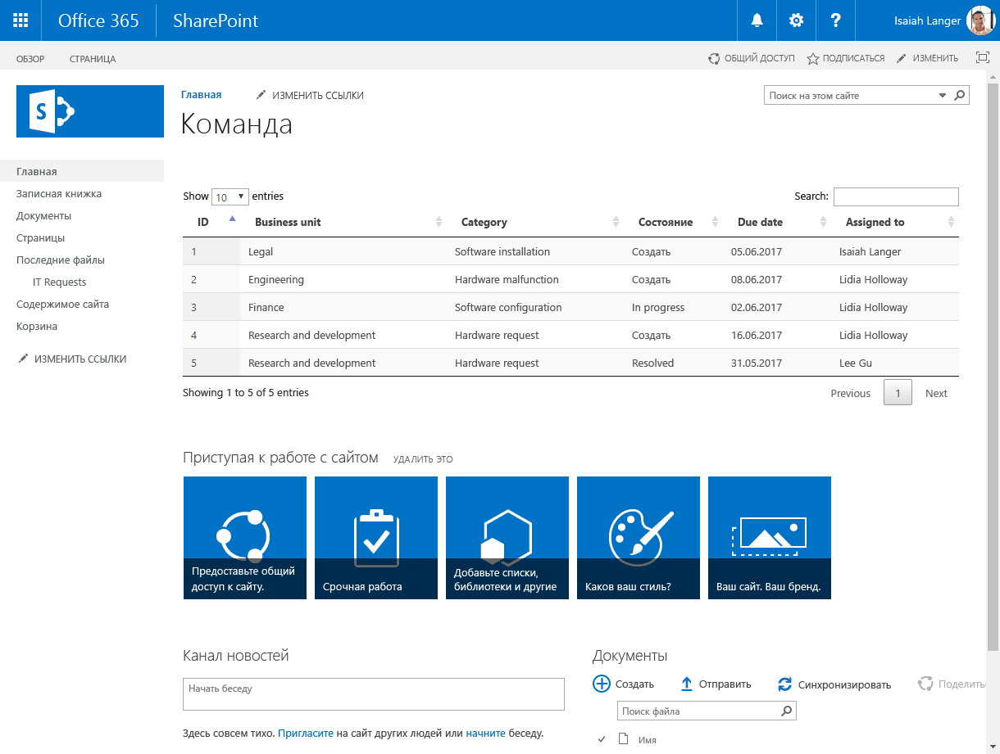
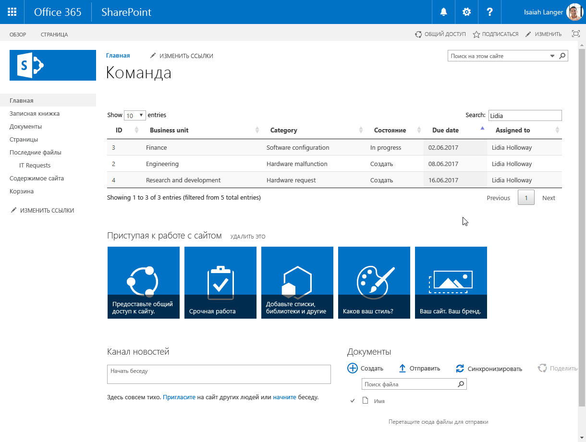
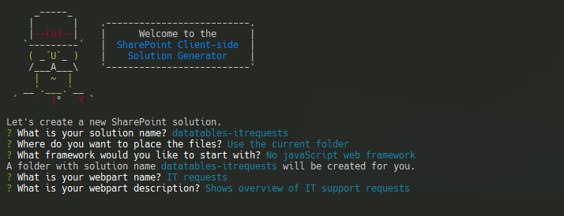
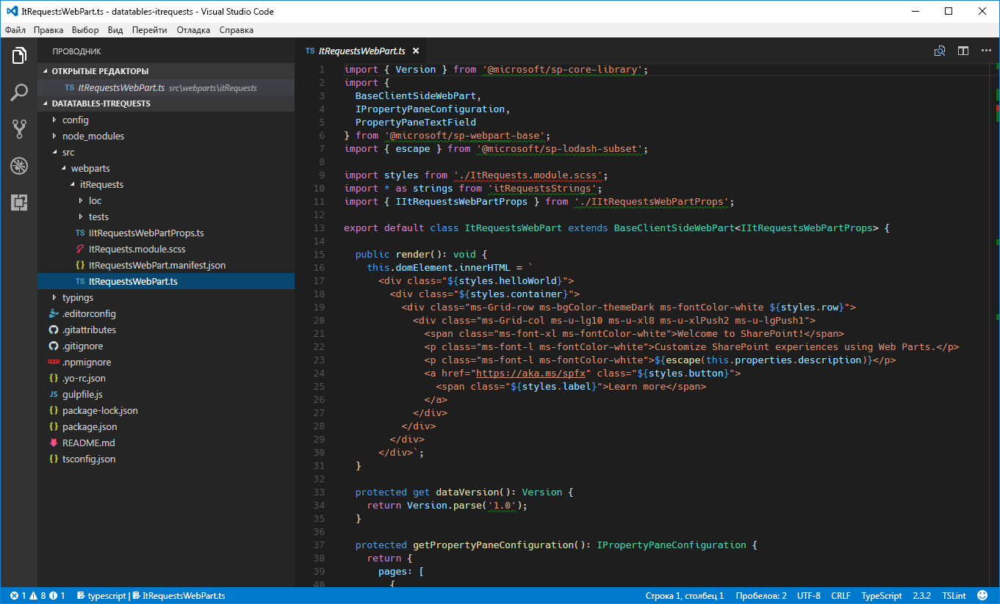
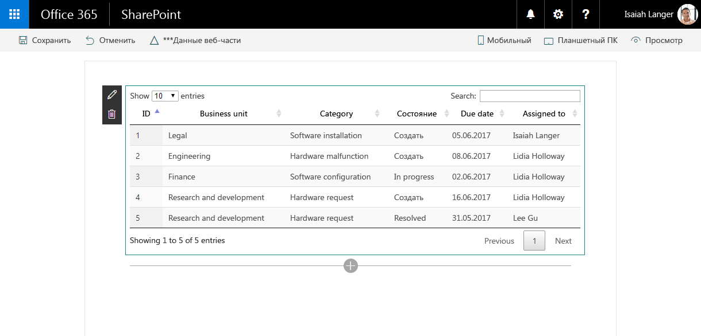
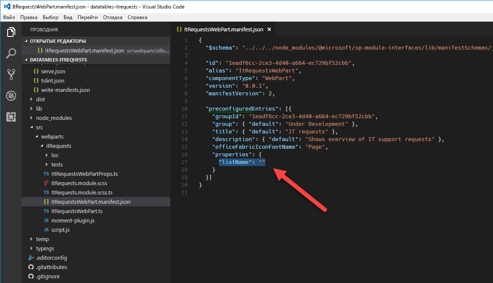

# <a name="migrate-jquery-and-datatables-solution-built-using-script-editor-web-part-to-sharepoint-framework"></a><span data-ttu-id="438cf-101">Перенос решения на основе jQuery и DataTables, созданного с помощью веб-части редактора скриптов, на платформу SharePoint Framework</span><span class="sxs-lookup"><span data-stu-id="438cf-101">Migrate jQuery and DataTables solution built using Script Editor Web Part to SharePoint Framework</span></span>

<span data-ttu-id="438cf-p101">Один из часто используемых подключаемых модулей jQuery — [DataTables](https://datatables.net/). С помощью таблиц данных вы можете легко создавать функциональные представления данных, поступающих из SharePoint и внешних API. В этой статье показано, как перенести модификацию SharePoint с использованием модуля DataTables, созданную с помощью веб-части редактора скриптов, на платформу SharePoint Framework.</span><span class="sxs-lookup"><span data-stu-id="438cf-p101">One of the frequently used jQuery plugins is [DataTables](https://datatables.net/). With DataTables you can easily build powerful data overviews of data coming both from SharePoint and external APIs. This article illustrates how you would migrate a SharePoint customization using DataTables built with the Script Editor Web Part to the SharePoint Framework.</span></span>

## <a name="list-of-it-requests-built-using-the-script-editor-web-part"></a><span data-ttu-id="438cf-105">Список запросов в службу поддержки, созданный с помощью веб-части редактора скриптов</span><span class="sxs-lookup"><span data-stu-id="438cf-105">List of IT requests built using the Script Editor Web Part</span></span>

<span data-ttu-id="438cf-106">Чтобы проиллюстрировать перенос модификации SharePoint с использованием модуля DataTables на платформу SharePoint Framework, мы будем использовать представленное ниже решение, которое показывает обзор запросов в службу поддержки, полученных из списка SharePoint.</span><span class="sxs-lookup"><span data-stu-id="438cf-106">To illustrate the process of migrating a SharePoint customization using DataTables to the SharePoint Framework you will use the following solution that shows an overview of IT support requests retrieved from a SharePoint list.</span></span>



<span data-ttu-id="438cf-p102">Решение создано с помощью стандартной веб-части редактора скриптов SharePoint. Ниже представлен код, используемый модификацией.</span><span class="sxs-lookup"><span data-stu-id="438cf-p102">The solution is built using the standard SharePoint Script Editor Web Part. Following is the code used by the customization.</span></span>

```html
<script src="https://code.jquery.com/jquery-1.12.4.js"></script>
<script src="https://cdn.datatables.net/1.10.15/js/jquery.dataTables.js"></script>
<script src="https://momentjs.com/downloads/moment.min.js"></script>
<link rel="stylesheet" type="text/css" href="https://cdn.datatables.net/1.10.15/css/jquery.dataTables.min.css" />
<table id="requests" class="display" cellspacing="0" width="100%">
    <thead>
        <tr>
            <th>ID</th>
            <th>Business unit</th>
            <th>Category</th>
            <th>Status</th>
            <th>Due date</th>
            <th>Assigned to</th>
        </tr>
    </thead>
</table>
<script>
// UMD
(function(factory) {
    "use strict";

    if (typeof define === 'function' && define.amd) {
        // AMD
        define(['jquery'], function ($) {
            return factory( $, window, document );
        });
    }
    else if (typeof exports === 'object') {
        // CommonJS
        module.exports = function (root, $) {
            if (!root) {
                root = window;
            }

            if (!$) {
                $ = typeof window !== 'undefined' ?
                    require('jquery') :
                    require('jquery')( root );
            }

            return factory($, root, root.document);
        };
    }
    else {
        // Browser
        factory(jQuery, window, document);
    }
}
(function($, window, document) {
    $.fn.dataTable.render.moment = function (from, to, locale) {
        // Argument shifting
        if (arguments.length === 1) {
            locale = 'en';
            to = from;
            from = 'YYYY-MM-DD';
        }
        else if (arguments.length === 2) {
            locale = 'en';
        }

        return function (d, type, row) {
            var m = window.moment(d, from, locale, true);

            // Order and type get a number value from Moment, everything else
            // sees the rendered value
            return m.format(type === 'sort' || type === 'type' ? 'x' : to);
        };
    };
}));
</script>
<script>
$(document).ready(function() {
    $('#requests').DataTable({
        'ajax': {
        'url': "../_api/web/lists/getbytitle('IT Requests')/items?$select=ID,BusinessUnit,Category,Status,DueDate,AssignedTo/Title&$expand=AssignedTo/Title",
        'headers': { 'Accept': 'application/json;odata=nometadata' },
        'dataSrc': function(data) {
            return data.value.map(function(item) {
                return [
                    item.ID,
                    item.BusinessUnit,
                    item.Category,
                    item.Status,
                    new Date(item.DueDate),
                    item.AssignedTo.Title
                ];
            });
        }
    },
    columnDefs: [{
        targets: 4,
        render: $.fn.dataTable.render.moment('YYYY/MM/DD')
    }]
    });
});
</script>
```

<span data-ttu-id="438cf-p103">Сначала модификация загружает используемые ею библиотеки: jQuery, DataTables и Moment.js (строки 1–4). Затем она задает структуру таблицы, используемой для представления данных (строки 5–16). После создания таблицы она помещает Moment.js в подключаемый модуль DataTables, чтобы отображаемые в таблице даты можно было форматировать (первый блок скрипта в строках 17–70). В завершение модификация загружает и представляет список запросов в службу поддержки с помощью модуля DataTables. Данные загружаются с помощью AJAX из списка SharePoint (строки 71–96).</span><span class="sxs-lookup"><span data-stu-id="438cf-p103">First, the customization loads the libraries it uses: jQuery, DataTables and Moment.js (lines 1-4). Next, it specifies the structure of the table used to present the data (lines 5-16). After creating the table, it wraps Moment.js into a DataTables plugin so that dates displayed in the table can be formatted (first script block on lines 17-70). Finally, the customization uses DataTables to load and present the list of IT support requests. The data is loaded using AJAX from a SharePoint list (lines 71-96).</span></span>

<span data-ttu-id="438cf-115">Благодаря модулю DataTables пользователи получают функциональное решение, в котором легко фильтровать, сортировать и перелистывать результаты, не прилагая дополнительных усилий.</span><span class="sxs-lookup"><span data-stu-id="438cf-115">Thanks to using DataTables, end-users get a powerful solution where they can easily filter, sort and page through the results without any additional development effort.</span></span>



## <a name="migrate-the-it-requests-overview-solution-from-the-script-editor-web-part-to-the-sharepoint-framework"></a><span data-ttu-id="438cf-117">Перенос решения для просмотра запросов в службу поддержки из веб-части редактора скриптов на платформу SharePoint Framework</span><span class="sxs-lookup"><span data-stu-id="438cf-117">Migrate the IT requests overview solution from the Script Editor Web Part to the SharePoint Framework</span></span>

> <span data-ttu-id="438cf-118">**Примечание.** Прежде чем выполнять действия, описанные в этой статье, [настройте среду разработки](../../set-up-your-development-environment) для создания решений на платформе SharePoint Framework.</span><span class="sxs-lookup"><span data-stu-id="438cf-118">**Note:** Before following the steps in this article, be sure to [set up your development environment](../../set-up-your-development-environment) for building SharePoint Framework solutions.</span></span>

<span data-ttu-id="438cf-p104">Преобразование этой модификации для платформы SharePoint Framework предоставляет ряд преимуществ, таких как удобство настройки и централизованное управление решением. Ниже представлено пошаговое руководство по переносу решения на платформу SharePoint Framework. Для начала мы перенесем решение на платформу SharePoint Framework, внося как можно меньше изменений в исходный код. Затем мы преобразуем код решения в TypeScript, чтобы воспользоваться функциями обеспечения безопасности типов во время разработки.</span><span class="sxs-lookup"><span data-stu-id="438cf-p104">Transforming this customization to the SharePoint Framework offers a number of benefits such as more user-friendly configuration and centralized management of the solution. Following is a step-by-step description of how you would migrate the solution to the SharePoint Framework. First, you will migrate the solution to the SharePoint Framework with as few changes to the original code as possible. Later, you will transform the solution's code to TypeScript to benefit of its development-time type safety features.</span></span>

> <span data-ttu-id="438cf-123">Исходный код проекта на разных этапах миграции доступен на странице [https://github.com/SharePoint/sp-dev-fx-webparts/tree/master/tutorials/tutorial-migrate-datatables](https://github.com/SharePoint/sp-dev-fx-webparts/tree/master/tutorials/tutorial-migrate-datatables).</span><span class="sxs-lookup"><span data-stu-id="438cf-123">The source code of the project in the different stages of migration is available at [https://github.com/SharePoint/sp-dev-fx-webparts/tree/master/tutorials/tutorial-migrate-datatables](https://github.com/SharePoint/sp-dev-fx-webparts/tree/master/tutorials/tutorial-migrate-datatables).</span></span>

### <a name="create-new-sharepoint-framework-project"></a><span data-ttu-id="438cf-124">Создание проекта SharePoint Framework</span><span class="sxs-lookup"><span data-stu-id="438cf-124">Create new SharePoint Framework project</span></span>

<span data-ttu-id="438cf-125">Для начала создайте папку проекта.</span><span class="sxs-lookup"><span data-stu-id="438cf-125">Start by creating a new folder for your project</span></span>

```sh
md datatables-itrequests
```

<span data-ttu-id="438cf-126">Перейдите в папку проекта:</span><span class="sxs-lookup"><span data-stu-id="438cf-126">Navigate to the project folder:</span></span>

```sh
cd datatables-itrequests
```

<span data-ttu-id="438cf-127">В папке проекта запустите генератор Yeoman для SharePoint Framework, чтобы сформировать шаблон проекта на платформе SharePoint Framework:</span><span class="sxs-lookup"><span data-stu-id="438cf-127">In the project folder run the SharePoint Framework Yeoman generator to scaffold a new SharePoint Framework project:</span></span>

```sh
yo @microsoft/sharepoint
```

<span data-ttu-id="438cf-128">Определите значения следующим образом:</span><span class="sxs-lookup"><span data-stu-id="438cf-128">When prompted, define values as follows:</span></span>
- <span data-ttu-id="438cf-129">имя решения — **datatables-itrequests**;</span><span class="sxs-lookup"><span data-stu-id="438cf-129">**datatables-itrequests** as your solution name</span></span>
- <span data-ttu-id="438cf-130">расположение файлов — **Use the current folder** (Использовать текущую папку);</span><span class="sxs-lookup"><span data-stu-id="438cf-130">**Use the current folder** for the location to place the files</span></span>
- <span data-ttu-id="438cf-131">отправная точка создания веб-части — **No javaScript web framework** (Без платформы JavaScript);</span><span class="sxs-lookup"><span data-stu-id="438cf-131">**No javaScript web framework** as the starting point to build the web part</span></span>
- <span data-ttu-id="438cf-132">имя веб-части — **IT requests** (Запросы в службу поддержки);</span><span class="sxs-lookup"><span data-stu-id="438cf-132">**IT requests** as your web part name</span></span>
- <span data-ttu-id="438cf-133">описание веб-части — **Shows overview of IT support requests** (Показывает обзор запросов в службу поддержки).</span><span class="sxs-lookup"><span data-stu-id="438cf-133">**Shows overview of IT support requests** as your web part description</span></span>



<span data-ttu-id="438cf-p105">Когда шаблон будет сформирован, откройте папку проекта в редакторе кода. В этом руководстве используется Visual Studio Code.</span><span class="sxs-lookup"><span data-stu-id="438cf-p105">Once the scaffolding completes, open your project folder in your code editor. In this tutorial, you will use Visual Studio Code.</span></span>



### <a name="load-javascript-libraries"></a><span data-ttu-id="438cf-138">Загрузка библиотек JavaScript</span><span class="sxs-lookup"><span data-stu-id="438cf-138">Load JavaScript libraries</span></span>

<span data-ttu-id="438cf-p106">Как и в исходном решении, созданном с помощью веб-части редактора скриптов, сначала следует загрузить библиотеки JavaScript, необходимые решению. В SharePoint Framework эта операция обычно делится на два этапа: указание URL-адреса, с которого будет загружена библиотека, и обращение к библиотеке в коде.</span><span class="sxs-lookup"><span data-stu-id="438cf-p106">Similarly to the original solution built using the Script Editor Web Part, first you need to load the JavaScript libraries required by the solution. In SharePoint Framework this usually consists of two steps: specifying the URL from which the library should be loaded, and referencing the library in the code.</span></span>

<span data-ttu-id="438cf-p107">Для начала укажите URL-адрес, с которого следует загружать библиотеки. В редакторе кода откройте файл **./config/config.json** и замените раздел **externals** на следующий код:</span><span class="sxs-lookup"><span data-stu-id="438cf-p107">Start, with specifying the URLs from which libraries should be loaded. In the code editor, open the **./config/config.json** file and change the **externals** section to:</span></span>

```json
{
  "externals": {
    "jquery": "https://code.jquery.com/jquery-1.12.4.min.js",
    "datatables.net": "https://cdn.datatables.net/1.10.15/js/jquery.dataTables.min.js",
    "moment": "https://momentjs.com/downloads/moment.min.js"
  }
}
```

<span data-ttu-id="438cf-143">Затем откройте файл **./src/webparts/itRequests/ItRequestsWebPart.ts** и после последнего оператора **import** добавьте следующий код:</span><span class="sxs-lookup"><span data-stu-id="438cf-143">Next, open the **./src/webparts/itRequests/ItRequestsWebPart.ts** file, and after the last **import** statement add:</span></span>

```ts
import 'jquery';
import 'datatables.net';
import 'moment';
```

### <a name="define-data-table"></a><span data-ttu-id="438cf-144">Определение таблицы данных</span><span class="sxs-lookup"><span data-stu-id="438cf-144">Define data table</span></span>

<span data-ttu-id="438cf-p108">Как и в исходном решении, дальше следует определить структуру таблицы, используемой для отображения данных. В редакторе кода откройте файл **./src/webparts/itRequests/ItRequestsWebPart.ts** и замените метод **render** на следующий код:</span><span class="sxs-lookup"><span data-stu-id="438cf-p108">Just as in the original solution, the next step is to define the structure of the table used to display the data. In the code editor, open the **./src/webparts/itRequests/ItRequestsWebPart.ts** file and change the **render** method to:</span></span>

```ts
export default class ItRequestsWebPart extends BaseClientSideWebPart<IItRequestsWebPartProps> {
  public render(): void {
    this.domElement.innerHTML = `
      <link rel="stylesheet" type="text/css" href="https://cdn.datatables.net/1.10.15/css/jquery.dataTables.min.css" />
      <table id="requests" class="display ${styles.itRequests}" cellspacing="0" width="100%">
        <thead>
            <tr>
                <th>ID</th>
                <th>Business unit</th>
                <th>Category</th>
                <th>Status</th>
                <th>Due date</th>
                <th>Assigned to</th>
            </tr>
        </thead>
      </table>`;
  }
  // ...
}
```

### <a name="register-momentjs-plugin-for-datatables"></a><span data-ttu-id="438cf-147">Регистрация подключаемого модуля Moment.js для DataTables</span><span class="sxs-lookup"><span data-stu-id="438cf-147">Register Moment.js plugin for DataTables</span></span>

<span data-ttu-id="438cf-p109">Теперь необходимо определить подключаемый модуль Moment.js для модуля DataTables, чтобы даты в таблице можно было форматировать. В папке **./src/webparts/itRequests** создайте файл с именем **moment-plugin.js** и вставьте следующий код:</span><span class="sxs-lookup"><span data-stu-id="438cf-p109">The next step is to define the Moment.js plugin for DataTables so that dates in the table can be formatted. In the **./src/webparts/itRequests** folder, create a new file named **moment-plugin.js** and paste the following code:</span></span>

```js
// UMD
(function (factory) {
    "use strict";

    if (typeof define === 'function' && define.amd) {
        // AMD
        define(['jquery'], function ($) {
            return factory($, window, document);
        });
    }
    else if (typeof exports === 'object') {
        // CommonJS
        module.exports = function (root, $) {
            if (!root) {
                root = window;
            }

            if (!$) {
                $ = typeof window !== 'undefined' ?
                    require('jquery') :
                    require('jquery')(root);
            }

            return factory($, root, root.document);
        };
    }
    else {
        // Browser
        factory(jQuery, window, document);
    }
}

(function ($, window, document) {
    $.fn.dataTable.render.moment = function (from, to, locale) {
        // Argument shifting
        if (arguments.length === 1) {
            locale = 'en';
            to = from;
            from = 'YYYY-MM-DD';
        }
        else if (arguments.length === 2) {
            locale = 'en';
        }

        return function (d, type, row) {
            var moment = require('moment');
            var m = moment(d, from, locale, true);

            // Order and type get a number value from Moment, everything else
            // sees the rendered value
            return m.format(type === 'sort' || type === 'type' ? 'x' : to);
        };
    };
}));
```

<span data-ttu-id="438cf-p110">Чтобы веб-часть загрузила подключаемый модуль, она должна ссылаться на новый файл **moment-plugin.js**. В редакторе кода откройте файл **./src/webparts/itRequests/ItRequestsWebPart.ts** и после последнего оператора **import** добавьте следующий код:</span><span class="sxs-lookup"><span data-stu-id="438cf-p110">For the web part to load the plugin, it has to reference the newly created **moment-plugin.js** file. In the code editor, open the **./src/webparts/itRequests/ItRequestsWebPart.ts** file and after the last **import** statement add:</span></span>

```ts
import './moment-plugin';
```

> <span data-ttu-id="438cf-p111">**Примечание.** Ссылаясь на другие файлы, не следует указывать расширение **.js**. SharePoint Framework автоматически определит расширение.</span><span class="sxs-lookup"><span data-stu-id="438cf-p111">**Note:** you don't need to include the **.js** extension when referencing other files. SharePoint Framework will automatically resolve the extension for you.</span></span>

### <a name="initiate-datatables-and-load-data"></a><span data-ttu-id="438cf-154">Инициализация модуля DataTables и загрузка данных</span><span class="sxs-lookup"><span data-stu-id="438cf-154">Initiate DataTables and load data</span></span>

<span data-ttu-id="438cf-p112">Последний этап — добавление кода, инициализирующего таблицу данных и загружающего данные из SharePoint. В папке **./src/webparts/itRequests** создайте файл с именем **script.js** и вставьте следующий код:</span><span class="sxs-lookup"><span data-stu-id="438cf-p112">The last step is to include the code that initiates the data table and loads the data from SharePoint. In the **./src/webparts/itRequests** folder, create a new file named **script.js** and paste the following code:</span></span>

```js
$(document).ready(function () {
    $('#requests').DataTable({
        'ajax': {
            'url': "../../_api/web/lists/getbytitle('IT Requests')/items?$select=ID,BusinessUnit,Category,Status,DueDate,AssignedTo/Title&$expand=AssignedTo/Title",
            'headers': { 'Accept': 'application/json;odata=nometadata' },
            'dataSrc': function (data) {
                return data.value.map(function (item) {
                    return [
                        item.ID,
                        item.BusinessUnit,
                        item.Category,
                        item.Status,
                        new Date(item.DueDate),
                        item.AssignedTo.Title
                    ];
                });
            }
        },
        columnDefs: [{
            targets: 4,
            render: $.fn.dataTable.render.moment('YYYY/MM/DD')
        }]
    });
});
```

<span data-ttu-id="438cf-157">Чтобы сослаться на этот файл в веб-части, откройте в редакторе кода файл **./src/webparts/itRequests/ItRequestsWebPart.ts** и измените метод **render** на следующий код:</span><span class="sxs-lookup"><span data-stu-id="438cf-157">In order to reference this file in the web part, in the code editor, open the **./src/webparts/itRequests/ItRequestsWebPart.ts** file and change the **render** method to:</span></span>

```ts
export default class ItRequestsWebPart extends BaseClientSideWebPart<IItRequestsWebPartProps> {
  public render(): void {
    this.domElement.innerHTML = `
      <link rel="stylesheet" type="text/css" href="https://cdn.datatables.net/1.10.15/css/jquery.dataTables.min.css" />
      <table id="requests" class="display ${styles.helloWorld}" cellspacing="0" width="100%">
        <thead>
            <tr>
                <th>ID</th>
                <th>Business unit</th>
                <th>Category</th>
                <th>Status</th>
                <th>Due date</th>
                <th>Assigned to</th>
            </tr>
        </thead>
      </table>`;

      require('./script');
  }
  // ...
}
```

<span data-ttu-id="438cf-158">Убедитесь, что веб-часть работает надлежащим образом, выполнив в командной строке следующую команду:</span><span class="sxs-lookup"><span data-stu-id="438cf-158">Verify, that the web part is working as expected by in the command line executing:</span></span>

```sh
gulp serve --nobrowser
```

<span data-ttu-id="438cf-p113">Так как веб-часть загружает свои данные из SharePoint, необходимо протестировать ее с помощью размещенного рабочего места SharePoint Framework. Перейдите на страницу **https://yourtenant.sharepoint.com/_layouts/workbench.aspx** и добавьте веб-часть на холст. Должны появиться запросы в службу поддержки, отображаемые с помощью подключаемого модуля DataTables для jQuery.</span><span class="sxs-lookup"><span data-stu-id="438cf-p113">Because the web part loads its data from SharePoint, you have to test the web part using the hosted SharePoint Framework workbench. Navigate to **https://yourtenant.sharepoint.com/_layouts/workbench.aspx** and add the web part to the canvas. You should now see the IT requests displayed using the DataTables jQuery plugin.</span></span>



## <a name="add-support-for-configuring-the-web-part-through-web-part-properties"></a><span data-ttu-id="438cf-163">Добавление поддержки настройки веб-части с помощью ее свойств</span><span class="sxs-lookup"><span data-stu-id="438cf-163">Add support for configuring the web part through web part properties</span></span>

<span data-ttu-id="438cf-p114">На предыдущих этапах мы перенесли решения для просмотра запросов в службу поддержки из веб-части редактора скриптов на платформу SharePoint Framework. Решение уже работает надлежащим образом, но не использует преимущества SharePoint Framework. Имя списка, из которого загружаются запросы в службу поддержки, включено в код, представляющий собой обычный код JavaScript, который сложнее оптимизировать, чем TypeScript. Ниже показано, как расширить имеющееся решение, чтобы пользователь мог указывать имя списка, из которого будут загружаться данные. Позже мы преобразуем код в TypeScript, чтобы воспользоваться функциями безопасности типов.</span><span class="sxs-lookup"><span data-stu-id="438cf-p114">In the previous steps you migrated the IT requests solutions from Script Editor Web Part to the SharePoint Framework. While the solution already works as expected, it doesn't use any of the SharePoint Framework benefits. The name of the list from which IT requests are loaded is included in the code and the code itself is plain JavaScript which is harder to refactor than TypeScript. The following steps illustrate how to extend the existing solution to allow users to specify the name of the list to load the data from. Later, you will transform the code to TypeScript to benefit of its type safety features.</span></span>

### <a name="define-web-part-property-for-storing-the-name-of-the-list"></a><span data-ttu-id="438cf-169">Определение свойства веб-части для хранения имени списка</span><span class="sxs-lookup"><span data-stu-id="438cf-169">Define web part property for storing the name of the list</span></span>

<span data-ttu-id="438cf-p115">Для начала определите свойство веб-части для хранения имени списка, из которого загружаются запросы в службу поддержки. В редакторе кода откройте файл **./src/webparts/itRequests/ItRequestsWebPart.manifest.json**, измените имя заданного по умолчанию свойства **description** на **listName** и удалите его значение.</span><span class="sxs-lookup"><span data-stu-id="438cf-p115">Start with defining a web part property to store the name of the list from which IT requests should be loaded. In the code editor, open the **./src/webparts/itRequests/ItRequestsWebPart.manifest.json** file and rename the default **description** property to **listName** and clear its value.</span></span>



<span data-ttu-id="438cf-p116">Затем обновите интерфейс свойств веб-части, чтобы увидеть изменения в манифесте. В редакторе кода откройте файл **./src/webparts/itRequests/IItRequestsWebPartProps.ts** и измените его содержимое на следующее:</span><span class="sxs-lookup"><span data-stu-id="438cf-p116">Next, update the web part properties interface to reflect the changes in the manifest. In the code editor, open the **./src/webparts/itRequests/IItRequestsWebPartProps.ts** file and change its contents to:</span></span>

```ts
export interface IItRequestsWebPartProps {
  listName: string;
}
```

<span data-ttu-id="438cf-p117">Затем обновите метки отображения свойства **listName**. Откройте файл **./src/webparts/itRequests/loc/mystrings.d.ts** и измените его содержимое на следующее:</span><span class="sxs-lookup"><span data-stu-id="438cf-p117">Then, update the display labels for the **listName** property. Open the **./src/webparts/itRequests/loc/mystrings.d.ts** file and change its contents to:</span></span>

```ts
declare interface IItRequestsStrings {
  PropertyPaneDescription: string;
  BasicGroupName: string;
  ListNameFieldLabel: string;
}

declare module 'itRequestsStrings' {
  const strings: IItRequestsStrings;
  export = strings;
}
```

<span data-ttu-id="438cf-177">Затем откройте файл **./src/webparts/itRequests/loc/en-us.js** и измените его содержимое на следующее:</span><span class="sxs-lookup"><span data-stu-id="438cf-177">Next, open the **./src/webparts/itRequests/loc/en-us.js** file and change its contents to:</span></span>

```js
define([], function() {
  return {
    "PropertyPaneDescription": "IT Requests settings",
    "BasicGroupName": "Data",
    "ListNameFieldLabel": "List name"
  }
});
```

<span data-ttu-id="438cf-p118">Напоследок обновите веб-часть, чтобы она использовала новое свойство. В редакторе кода откройте файл **./src/webparts/itRequests/ItRequestsWebPart.ts** и замените метод **getPropertyPaneConfiguration** на следующий код:</span><span class="sxs-lookup"><span data-stu-id="438cf-p118">Finally, update the web part to use the newly defined property. In the code editor, open the **./src/webparts/itRequests/ItRequestsWebPart.ts** file and change the **getPropertyPaneConfiguration** method to:</span></span>

```ts
export default class ItRequestsWebPart extends BaseClientSideWebPart<IItRequestsWebPartProps> {
  // ...
  protected getPropertyPaneConfiguration(): IPropertyPaneConfiguration {
    return {
      pages: [
        {
          header: {
            description: strings.PropertyPaneDescription
          },
          groups: [
            {
              groupName: strings.BasicGroupName,
              groupFields: [
                PropertyPaneTextField('listName', {
                  label: strings.ListNameFieldLabel
                })
              ]
            }
          ]
        }
      ]
    };
  }

  protected get disableReactivePropertyChanges(): boolean {
    return true;
  }
}
```

<span data-ttu-id="438cf-180">Чтобы веб-часть не перезагружалась, когда пользователь вводит имя списка, она также должна использовать нереактивную область свойств. Для этого добавьте метод **disableReactivePropertyChanges** и задайте для него возвращаемое значение **true**.</span><span class="sxs-lookup"><span data-stu-id="438cf-180">To prevent the web part from reloading as users type the name of the list, you've also configured the web part to use the non-reactive property pane by adding the **disableReactivePropertyChanges** method and settings its return value to **true**.</span></span>

### <a name="use-the-configured-name-of-the-list-to-load-the-data-from"></a><span data-ttu-id="438cf-181">Использование заданного имени списка для загрузки данных</span><span class="sxs-lookup"><span data-stu-id="438cf-181">Use the configured name of the list to load the data from</span></span>

<span data-ttu-id="438cf-p119">Изначально имя списка, из которого загружаются данные, было встроено в запрос REST. Теперь, когда пользователи могут настраивать это имя, указанное значение должно отправляться в запрос REST перед загрузкой данных. Это проще всего сделать, переместив содержимое файла **script.js** в основной файл веб-части.</span><span class="sxs-lookup"><span data-stu-id="438cf-p119">Initially, the name of the list from which the data should be loaded was embedded in the REST query. Now that users can configure this name, the configured value should be injected into the REST query before loading the data. The easiest way to do that, is by moving the contents of the **script.js** file to the main web part file.</span></span>

<span data-ttu-id="438cf-185">В редакторе кода откройте файл **./src/webparts/itRequests/ItRequestsWebPart.ts** и замените метод **render** на следующий код:</span><span class="sxs-lookup"><span data-stu-id="438cf-185">In the code editor, open the **./src/webparts/itRequests/ItRequestsWebPart.ts** file and change the **render** method to:</span></span>

```ts
var $: any = (window as any).$;

export default class ItRequestsWebPart extends BaseClientSideWebPart<IItRequestsWebPartProps> {
  public render(): void {
    this.domElement.innerHTML = `
      <link rel="stylesheet" type="text/css" href="https://cdn.datatables.net/1.10.15/css/jquery.dataTables.min.css" />
      <table class="display ${styles.helloWorld}" cellspacing="0" width="100%">
        <thead>
            <tr>
                <th>ID</th>
                <th>Business unit</th>
                <th>Category</th>
                <th>Status</th>
                <th>Due date</th>
                <th>Assigned to</th>
            </tr>
        </thead>
      </table>`;

    $(document).ready(() => {
      $('table', this.domElement).DataTable({
        'ajax': {
          'url': `../../_api/web/lists/getbytitle('${escape(this.properties.listName)}')/items?$select=ID,BusinessUnit,Category,Status,DueDate,AssignedTo/Title&$expand=AssignedTo/Title`,
          'headers': { 'Accept': 'application/json;odata=nometadata' },
          'dataSrc': function (data) {
            return data.value.map(function (item) {
              return [
                item.ID,
                item.BusinessUnit,
                item.Category,
                item.Status,
                new Date(item.DueDate),
                item.AssignedTo.Title
              ];
            });
          }
        },
        columnDefs: [{
          targets: 4,
          render: $.fn.dataTable.render.moment('YYYY/MM/DD')
        }]
      });
    });
  }

  // ...
}
```

<span data-ttu-id="438cf-p120">Вместо того чтобы ссылаться на код из файла **script.js**, мы включаем все содержимое в метод **render** веб-части. Теперь вы можете заменить фиксированное имя списка в запросе REST (строка 40) на значение свойства **listName**, в котором хранится указанное пользователем имя списка. Прежде чем использовать это значение, мы применим функцию lodash **escape**, чтобы запретить внедрение сценариев.</span><span class="sxs-lookup"><span data-stu-id="438cf-p120">Instead of referencing the code from the **script.js** file, all of its contents are a part of the web part's **render** method. In the REST query, in line 40, you can now replace the fixed name of the list with the value of the **listName** property which holds the name of the list as configured by the user. Before using the value, it's being escaped using the lodash's **escape** function to disallow script injection.</span></span>

<span data-ttu-id="438cf-p121">На этом этапе большая часть кода по-прежнему написана на обычном JavaScript. Во избежание проблем с переменной jQuery **$** при сборке мы определили для нее тип **any** в строке 18. Позже, когда мы будем преобразовывать код в TypeScript, мы заменим его на подходящее определение типа.</span><span class="sxs-lookup"><span data-stu-id="438cf-p121">At this point, the bulk of the code is still written using plain JavaScript. To avoid build issues with the **$** jQuery variable, you had to define it as **any** type in line 18. Later, when transforming the code to TypeScript you will replace it with a proper type definition.</span></span>

<span data-ttu-id="438cf-192">Так как мы только что переместили содержимое файла **script.js** в основной файл веб-части, файл **script.js** больше не требуется и его можно удалить из проекта.</span><span class="sxs-lookup"><span data-stu-id="438cf-192">As you have just moved the contents of the **script.js** file into the main web part file, the **script.js** is no longer necessary and you can delete it from the project.</span></span>

<span data-ttu-id="438cf-193">Чтобы убедиться, что веб-часть работает надлежащим образом, выполните в командной строке следующую команду:</span><span class="sxs-lookup"><span data-stu-id="438cf-193">To verify that the web part is working as expected, run in the command line:</span></span>

```sh
gulp serve --nobrowser
```

<span data-ttu-id="438cf-p122">Перейдите к размещенному рабочему месту и добавьте веб-часть на холст. Откройте область свойств веб-части, укажите имя списка запросов в службу поддержки и нажмите кнопку **Применить**, чтобы подтвердить изменения. Теперь в веб-части должны отображаться запросы в службу поддержки.</span><span class="sxs-lookup"><span data-stu-id="438cf-p122">Navigate to the hosted workbench and add the web part to the canvas. Open the web part property pane, specify the name of the list with IT requests and click the **Apply** button to confirm the changes. You should now see IT requests displayed in the web part.</span></span>


## <a name="transform-the-plain-javascript-code-to-typescript"></a><span data-ttu-id="438cf-198">Преобразование обычного кода JavaScript в TypeScript</span><span class="sxs-lookup"><span data-stu-id="438cf-198">Transform the plain JavaScript code to TypeScript</span></span>

<span data-ttu-id="438cf-p123">Использование TypeScript вместо обычного JavaScript предоставляет ряд преимуществ. TypeScript не только упрощает поддержку и оптимизацию, но и позволяет раньше обнаруживать ошибки. Ниже описано, как преобразовать первоначальный код JavaScript в TypeScript.</span><span class="sxs-lookup"><span data-stu-id="438cf-p123">Using TypeScript over plain JavaScript offers a number of benefits. Not only is TypeScript easier to maintain and refactor but it also allows you to catch errors earlier. Following steps describe how you would transform the original JavaScript code to TypeScript.</span></span>

### <a name="add-type-definitions-for-used-libraries"></a><span data-ttu-id="438cf-202">Добавление определений типов для используемых библиотек</span><span class="sxs-lookup"><span data-stu-id="438cf-202">Add type definitions for used libraries</span></span>

<span data-ttu-id="438cf-p124">Для надлежащей работы TypeScript необходимы определения типов для различных библиотек, используемых в проекте. Определения типов часто распространяются в виде пакетов npm в пространстве имен @types.</span><span class="sxs-lookup"><span data-stu-id="438cf-p124">To function properly, TypeScript requires type definitions for the different libraries used in the project. Type definitions are often distributed as npm packages in the @types namespace.</span></span>

<span data-ttu-id="438cf-205">Для начала установите определения типов для jQuery и DataTables, выполнив в командной строке следующую команду:</span><span class="sxs-lookup"><span data-stu-id="438cf-205">Start by installing type definitions for jQuery and DataTables by executing in the command line:</span></span>

```sh
npm install --save-dev @types/jquery@1 @types/datatables.net
```

<span data-ttu-id="438cf-p125">Определения типов для пакета Moment.js распространяются вместе с ним. Несмотря на то что мы загружаем Moment.js с URL-адреса, для использования его типов все равно нужно установить в проекте пакет Moment.js.</span><span class="sxs-lookup"><span data-stu-id="438cf-p125">Type definitions for Moment.js are distributed together with the Moment.js package. Even though, you're loading Moment.js from a URL, in order to use its typings, you still need to install the Moment.js package in the project.</span></span>

<span data-ttu-id="438cf-208">Установите пакет Moment.js, выполнив в командной строке следующую команду:</span><span class="sxs-lookup"><span data-stu-id="438cf-208">Install the Moment.js package by executing in the command line:</span></span>

```sh
npm install --save moment
```

### <a name="update-package-references"></a><span data-ttu-id="438cf-209">Обновление ссылок на пакеты</span><span class="sxs-lookup"><span data-stu-id="438cf-209">Update package references</span></span>

<span data-ttu-id="438cf-p126">Чтобы использовать типы из установленных определений, необходимо изменить ссылки на библиотеки. В редакторе кода откройте файл **./src/webparts/itRequests/ItRequestsWebPart.ts** и замените оператор `import 'jquery';` на следующий:</span><span class="sxs-lookup"><span data-stu-id="438cf-p126">In order to use types from the installed type definitions, you have to change how you reference libraries. In the code editor, open the **./src/webparts/itRequests/ItRequestsWebPart.ts** file and change `import 'jquery';` statement to:</span></span>

```ts
import * as $ from 'jquery';
```

<span data-ttu-id="438cf-212">Определив **$** как jQuery, вы можете удалить добавленное ранее локальное определение **$**:</span><span class="sxs-lookup"><span data-stu-id="438cf-212">Having defined **$** as jQuery you can now remove the local definition of **$** that you've added previously:</span></span>

```ts
var $: any = (window as any).$;
```

<span data-ttu-id="438cf-p127">DataTables — это подключаемый модуль для jQuery, который присоединяется к jQuery, поэтому определение его типа невозможно загрузить напрямую. Вместо этого необходимо добавить его в список глобально загружаемых типов. В редакторе кода откройте файл **./tsconfig.json** и добавьте **datatables.net** в массив **types**:</span><span class="sxs-lookup"><span data-stu-id="438cf-p127">Because DataTables is a jQuery plugin that attaches itself to jQuery you cannot load its type definition directly. Instead, you have to add it to the list of types loaded globally. In the code editor, open the **./tsconfig.json** file and to the **types** array add **jquery.datatables**:</span></span>

```json
{
  "compilerOptions": {
    "target": "es5",
    "forceConsistentCasingInFileNames": true,
    "module": "commonjs",
    "jsx": "react",
    "declaration": true,
    "sourceMap": true,
    "types": [
      "es6-promise",
      "es6-collections",
      "datatables.net",
      "webpack-env"
    ]
  }
}
```

### <a name="update-main-web-part-files-to-typescript"></a><span data-ttu-id="438cf-216">Преобразование основных файлов веб-части в TypeScript</span><span class="sxs-lookup"><span data-stu-id="438cf-216">Update main web part files to TypeScript</span></span>

<span data-ttu-id="438cf-217">Теперь, когда у нас есть определения типов для всех библиотек, установленных в проекте, можно приступить к преобразованию обычного кода JavaScript в TypeScript.</span><span class="sxs-lookup"><span data-stu-id="438cf-217">Now that you have type definitions for all libraries installed in the project, you can start transforming the plain JavaScript code to TypeScript.</span></span>

<span data-ttu-id="438cf-p128">Для начала определите интерфейс для сведений о запросах в службу поддержки, полученных из списка SharePoint. В редакторе кода откройте файл **./src/webparts/itRequests/ItRequestsWebPart.ts** и сразу над классом веб-части добавьте следующий фрагмент кода:</span><span class="sxs-lookup"><span data-stu-id="438cf-p128">Start, with defining an interface for the IT request information that you retrieve from the SharePoint list. In the code editor, open the **./src/webparts/itRequests/ItRequestsWebPart.ts** file and just above the web part class, add the following code snippet:</span></span>

```ts
interface IRequestItem {
  ID: number;
  BusinessUnit: string;
  Category: string;
  Status: string;
  DueDate: string;
  AssignedTo: { Title: string; };
}
```

<span data-ttu-id="438cf-220">Затем в классе веб-части замените метод **render** на следующий код:</span><span class="sxs-lookup"><span data-stu-id="438cf-220">Next, in the web part class, change the **render** method to:</span></span>

```ts
export default class ItRequestsWebPart extends BaseClientSideWebPart<IItRequestsWebPartProps> {
  public render(): void {
    this.domElement.innerHTML = `
      <link rel="stylesheet" type="text/css" href="https://cdn.datatables.net/1.10.15/css/jquery.dataTables.min.css" />
      <table class="display ${styles.helloWorld}" cellspacing="0" width="100%">
        <thead>
            <tr>
                <th>ID</th>
                <th>Business unit</th>
                <th>Category</th>
                <th>Status</th>
                <th>Due date</th>
                <th>Assigned to</th>
            </tr>
        </thead>
      </table>`;

    $('table', this.domElement).DataTable({
      'ajax': {
        'url': `../../_api/web/lists/getbytitle('${escape(this.properties.listName)}')/items?$select=ID,BusinessUnit,Category,Status,DueDate,AssignedTo/Title&$expand=AssignedTo/Title`,
        'headers': { 'Accept': 'application/json;odata=nometadata' },
        'dataSrc': (data: { value: IRequestItem[] }): any[][] => {
          return data.value.map((item: IRequestItem): any[] => {
            return [
              item.ID,
              item.BusinessUnit,
              item.Category,
              item.Status,
              new Date(item.DueDate),
              item.AssignedTo.Title
            ];
          });
        }
      },
      columnDefs: [{
        targets: 4,
        render: ($.fn as any).dataTable.render.moment('YYYY/MM/DD')
      }]
    });
  }

  // ...
}
```

<span data-ttu-id="438cf-p129">Обратите внимание, что запрос AJAX для получения данных из списка SharePoint теперь типизирован и помогает гарантировать, что вы ссылаетесь на правильные свойства, передавая их в массив в модуле DataTables. Структура данных, используемая модулем DataTables для представления строки в таблице, — это массив смешанных типов, поэтому для простоты она была определена как **any[]**. Использование типа **any** в этом контексте допустимо, так как данные, возвращаемые в свойстве **dataSrc**, используются внутри модуля DataTables.</span><span class="sxs-lookup"><span data-stu-id="438cf-p129">Notice, how the AJAX request, to retrieve the data from the SharePoint list, is now typed and helps you ensure you're referring to correct properties when passing them into an array to DataTables. The data structure used by DataTables to represent a row in the table, is an array of mixed types so for simplicity it was defined as **any[]**. Using the **any** type in this context is not bad, because the data returned inside the **dataSrc** property is used internally by DataTables.</span></span>

<span data-ttu-id="438cf-p130">Обновляя метод **render**, мы внесли еще два изменения. Во-первых, мы удалили из таблицы атрибут **id**. Это позволяет размещать на странице несколько экземпляров одной веб-части. Кроме того, удалена ссылка на функцию `$(document).ready()`, в которой нет необходимости, так как модель DOM элемента, где отрисовывается таблица данных, задается перед кодом инициализации DataTables.</span><span class="sxs-lookup"><span data-stu-id="438cf-p130">As you're updating the **render** method, you have also added two more changes. First, you removed the **id** attribute from the table. This allows you to place multiple instances of the same web part on the page. Also, you removed the reference to the `$(document).ready()` function which isn't necessary as the DOM of the element, where the data table is rendered, is set before the DataTables initiation code.</span></span>

### <a name="update-the-momentjs-datatables-plugin-to-typescript"></a><span data-ttu-id="438cf-228">Преобразование подключаемого модуля Moment.js для DataTables в TypeScript</span><span class="sxs-lookup"><span data-stu-id="438cf-228">Update the Moment.js DataTables plugin to TypeScript</span></span>

<span data-ttu-id="438cf-p131">Последний компонент решения, который необходимо преобразовать в TypeScript, — это подключаемый модуль Moment.js для DataTables. Для начала измените имя файла **./src/webparts/itRequests/moment-plugin.js** на **./src/webparts/itRequests/moment-plugin.ts**, чтобы его обрабатывал компилятор TypeScript. Затем откройте файл **moment-plugin.ts** в редакторе кода и замените его содержимое на следующее:</span><span class="sxs-lookup"><span data-stu-id="438cf-p131">The last piece of the solution that needs to be transformed to TypeScript is the Moment.js DataTables plugin. First, rename the **./src/webparts/itRequests/moment-plugin.js** file to **./src/webparts/itRequests/moment-plugin.ts** so that it will be processed by the TypeScript compiler. Next, open the **moment-plugin.ts** file in the code editor, and replace its contents with:</span></span>

```ts
import * as $ from 'jquery';
import * as moment from 'moment';

/* tslint:disable:no-function-expression */
($.fn as any).dataTable.render.moment = function (from: string, to: string, locale: string): (d: any, type: string, row: any) => string {
/* tslint:enable */
    // Argument shifting
    if (arguments.length === 1) {
        locale = 'en';
        to = from;
        from = 'YYYY-MM-DD';
    }
    else if (arguments.length === 2) {
        locale = 'en';
    }

    return (d: any, type: string, row: any): string => {
        let m: moment.Moment = moment(d, from, locale, true);

        // Order and type get a number value from Moment, everything else
        // sees the rendered value
        return m.format(type === 'sort' || type === 'type' ? 'x' : to);
    };
};
```

<span data-ttu-id="438cf-p132">Для начала мы загрузим ссылки на jQuery и Moment.js, чтобы сообщить TypeScript, на что ссылаются соответствующие переменные. Затем мы определим функцию подключаемого модуля. Как правило, в TypeScript для функций используется стрелочная нотация (`=>`). Однако в данном случае, так как нам требуется доступ к свойству **arguments**, необходимо использовать обычное определение функции. Чтобы tslint не выводил предупреждение о том, что не используется стрелочная нотация, вы можете в явной форме отключить правило **no-function-expression** для определения функции.</span><span class="sxs-lookup"><span data-stu-id="438cf-p132">You start with loading references to jQuery and Moment.js to let TypeScript know what the corresponding variables refer to. Next, you define the plugin function. Usually in TypeScript you use the arrow notation for functions (`=>`). In this case however, because you need the access to the **arguments** property, you have to use the regular function definition. To prevent tslint from reporting warning about not using the arrow notation, you can explicitly disable the **no-function-expression** rule around the function definition.</span></span>

<span data-ttu-id="438cf-237">Чтобы убедиться, что все работает должным образом, в командной строке выполните следующую команду:</span><span class="sxs-lookup"><span data-stu-id="438cf-237">To confirm that everything is working as expected, in the command line execute:</span></span>

```sh
gulp serve --nobrowser
```

<span data-ttu-id="438cf-p133">Перейдите к размещенному рабочему месту и добавьте веб-часть на холст. Визуально ничего не изменилось, но новая кодовая база использует TypeScript и соответствующие определения типов, упрощая поддержку решения.</span><span class="sxs-lookup"><span data-stu-id="438cf-p133">Navigate to the hosted workbench and add the web part to the canvas. Although visually nothing has changed, the new code base uses TypeScript and its type definitions to help you maintain the solution.</span></span>