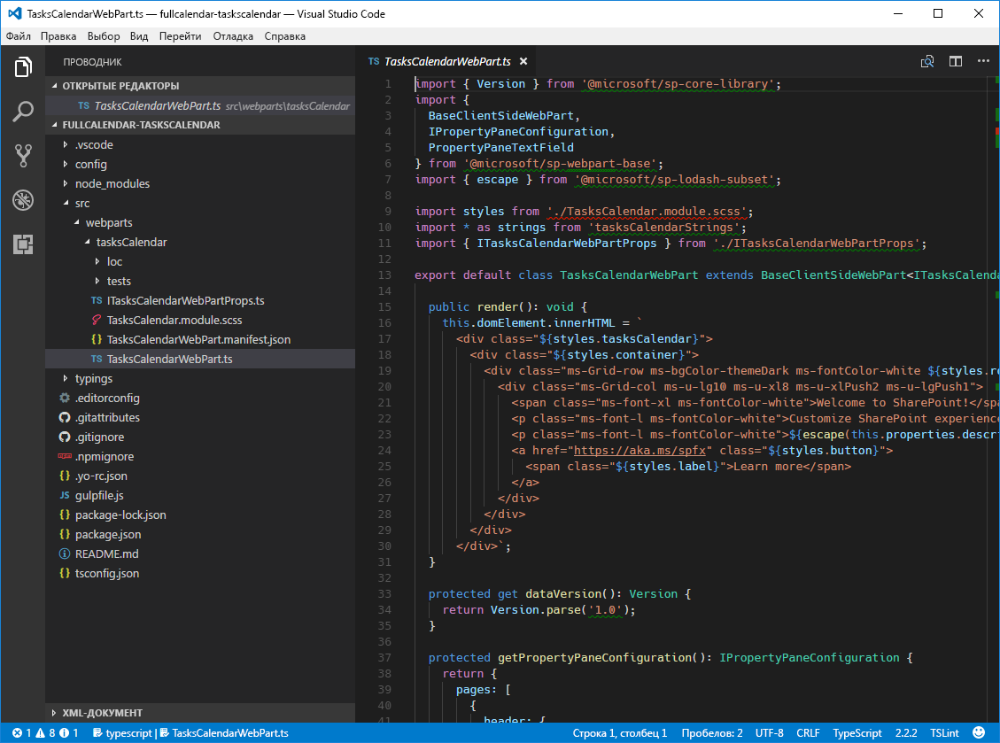

# <a name="migrate-jquery-and-fullcalendar-solution-built-using-script-editor-web-part-to-sharepoint-framework"></a>Перенос решения с jQuery и FullCalendar, созданного с помощью веб-части редактора скриптов, на платформу SharePoint Framework

При создании решений для SharePoint разработчики часто используют подключаемый модуль [FullCalendar](https://fullcalendar.io) для jQuery, чтобы выводить данные в представлении календаря. FullCalendar — это отличная альтернатива стандартному представлению календаря SharePoint, так как она позволяет представлять данные из нескольких списков календарей, данные из других списков и даже данные, находящиеся за пределами SharePoint. В этой статье показано, как перенести модификацию SharePoint с использованием FullCalendar, созданную с помощью веб-части редактора скриптов, на платформу SharePoint Framework.

## <a name="list-of-tasks-displayed-as-a-calendar-built-using-the-script-editor-web-part"></a>Список задач, отображаемый в виде календаря, созданного с помощью веб-части редактора скриптов

Чтобы проиллюстрировать перенос модификации SharePoint с использованием FullCalendar на платформу SharePoint Framework, мы будем использовать представленное ниже решение, которое показывает представление календаря с задачами, полученными из списка SharePoint.


Решение создано с помощью стандартной веб-части редактора скриптов SharePoint. Ниже представлен код, используемый модификацией.

```html
<script src="//code.jquery.com/jquery-1.11.1.min.js"></script>
<script src="//cdnjs.cloudflare.com/ajax/libs/moment.js/2.10.6/moment.min.js"></script>
<script src="//cdnjs.cloudflare.com/ajax/libs/fullcalendar/3.4.0/fullcalendar.min.js"></script>
<link type="text/css" rel="stylesheet" href="//cdnjs.cloudflare.com/ajax/libs/fullcalendar/3.4.0/fullcalendar.min.css" />
<div id="calendar"></div>

<script>
  var PATH_TO_DISPFORM = _spPageContextInfo.webAbsoluteUrl + "/Lists/Tasks/DispForm.aspx";
  var TASK_LIST = "Tasks";
  var COLORS = ['#466365', '#B49A67', '#93B7BE', '#E07A5F', '#849483', '#084C61', '#DB3A34'];

  displayTasks();

  function displayTasks() {
    $('#calendar').fullCalendar('destroy');
    $('#calendar').fullCalendar({
      weekends: false,
      header: {
        left: 'prev,next today',
        center: 'title',
        right: 'month,basicWeek,basicDay'
      },
      displayEventTime: false,
      // open up the display form when a user clicks on an event
      eventClick: function (calEvent, jsEvent, view) {
        window.location = PATH_TO_DISPFORM + "?ID=" + calEvent.id;
      },
      editable: true,
      timezone: "UTC",
      droppable: true, // this allows things to be dropped onto the calendar
      // update the end date when a user drags and drops an event 
      eventDrop: function (event, delta, revertFunc) {
        updateTask(event.id, event.start, event.end);
      },
      // put the events on the calendar 
      events: function (start, end, timezone, callback) {
        var startDate = start.format('YYYY-MM-DD');
        var endDate = end.format('YYYY-MM-DD');

        var restQuery = "/_api/Web/Lists/GetByTitle('" + TASK_LIST + "')/items?$select=ID,Title,\
Status,StartDate,DueDate,AssignedTo/Title&$expand=AssignedTo&\
$filter=((DueDate ge '" + startDate + "' and DueDate le '" + endDate + "')or(StartDate ge '" + startDate + "' and StartDate le '" + endDate + "'))";

        $.ajax({
          url: _spPageContextInfo.webAbsoluteUrl + restQuery,
          type: "GET",
          dataType: "json",
          headers: {
            Accept: "application/json;odata=nometadata"
          }
        })
          .done(function (data, textStatus, jqXHR) {
            var personColors = {};
            var colorNo = 0;

            var events = data.value.map(function (task) {
              var assignedTo = task.AssignedTo.map(function (person) {
                return person.Title;
              }).join(', ');

              var color = personColors[assignedTo];
              if (!color) {
                color = COLORS[colorNo++];
                personColors[assignedTo] = color;
              }
              if (colorNo >= COLORS.length) {
                colorNo = 0;
              }

              return {
                title: task.Title + " - " + assignedTo,
                id: task.ID,
                color: color, // specify the background color and border color can also create a class and use className parameter. 
                start: moment.utc(task.StartDate).add("1", "days"),
                end: moment.utc(task.DueDate).add("1", "days") // add one day to end date so that calendar properly shows event ending on that day
              };
            });

            callback(events);
          });
      }
    });
  }

  function updateTask(id, startDate, dueDate) {
    // subtract the previously added day to the date to store correct date
    var sDate = moment.utc(startDate).add("-1", "days").format('YYYY-MM-DD') + "T" +
      startDate.format("hh:mm") + ":00Z";
    if (!dueDate) {
      dueDate = startDate;
    }
    var dDate = moment.utc(dueDate).add("-1", "days").format('YYYY-MM-DD') + "T" +
      dueDate.format("hh:mm") + ":00Z";

    $.ajax({
      url: _spPageContextInfo.webAbsoluteUrl + '/_api/contextinfo',
      type: 'POST',
      headers: {
        'Accept': 'application/json;odata=nometadata'
      }
    })
      .then(function (data, textStatus, jqXHR) {
        return $.ajax({
          url: _spPageContextInfo.webAbsoluteUrl +
          "/_api/Web/Lists/getByTitle('" + TASK_LIST + "')/Items(" + id + ")",
          type: 'POST',
          data: JSON.stringify({
            StartDate: sDate,
            DueDate: dDate,
          }),
          headers: {
            Accept: "application/json;odata=nometadata",
            "Content-Type": "application/json;odata=nometadata",
            "X-RequestDigest": data.FormDigestValue,
            "IF-MATCH": "*",
            "X-Http-Method": "PATCH"
          }
        });
      })
      .done(function (data, textStatus, jqXHR) {
        alert("Update Successful");
      })
      .fail(function (jqXHR, textStatus, errorThrown) {
        alert("Update Failed");
      })
      .always(function () {
        displayTasks();
      });
  }
</script>
```

> Это решение основано на работе Марка Рекли (Mark Rackley) — специалиста со статусом MVP по серверам и службам Office и директора по стратегическим вопросам в группе PAIT. Дополнительные сведения об исходном решении см. по адресу [http://www.markrackley.net/2017/06/07/using-fullcalendar-io-to-create-custom-calendars-in-sharepoint/](http://www.markrackley.net/2017/06/07/using-fullcalendar-io-to-create-custom-calendars-in-sharepoint/).

Для начала модификация загружает используемые ею библиотеки: jQuery, Moment.js и FullCalendar (строки 1–4). Затем она определяет разделитель, в который будет внедрено созданное представление календаря (строка 5). После этого она определяет две функции: **displayTasks** (используется для отображения задач в представлении календаря) и **updateTask** (вызывается после перетаскивания задачи на другую дату и обновляет даты для соответствующего элемента списка). Каждая функция определяет собственный запрос REST, с помощью которого она обращается к REST API списков SharePoint, чтобы получить или обновить элементы списка.

Используя подключаемый модуль FullCalendar для jQuery, можно с минимальными усилиями создавать функциональные решения, предоставляющие пользователям такие возможности, как пометка событий разными цветами и упорядочивание событий путем перетаскивания.


## <a name="migrate-the-tasks-calendar-solution-from-the-script-editor-web-part-to-the-sharepoint-framework"></a>Перенос решения для просмотра календаря задач из веб-части редактора скриптов на платформу SharePoint Framework

> **Примечание.** Прежде чем выполнять действия, описанные в этой статье, [настройте среду разработки](../../set-up-your-development-environment.md) для создания решений на платформе SharePoint Framework.

Преобразование модификации на основе веб-части редактора скриптов для платформы SharePoint Framework предоставляет ряд преимуществ, таких как удобство настройки и централизованное управление решением. Ниже представлено пошаговое руководство по переносу решения на платформу SharePoint Framework. Для начала мы перенесем решение на платформу SharePoint Framework, внося как можно меньше изменений в исходный код. Затем мы преобразуем код решения в TypeScript, чтобы воспользоваться функциями обеспечения безопасности типов во время разработки, а также заменим некоторые фрагменты кода для применения API SharePoint Framework, чтобы сделать доступными возможности этой платформы и сделать решение еще проще.

> Исходный код проекта на разных этапах миграции доступен на странице [https://github.com/SharePoint/sp-dev-fx-webparts/tree/master/tutorials/tutorial-migrate-fullcalendar](https://github.com/SharePoint/sp-dev-fx-webparts/tree/master/tutorials/tutorial-migrate-fullcalendar).

### <a name="create-new-sharepoint-framework-project"></a>Создание проекта SharePoint Framework

Для начала создайте папку проекта.

```sh
md fullcalendar-taskscalendar
```

Перейдите в папку проекта:

```sh
cd fullcalendar-taskscalendar
```

В папке проекта запустите генератор Yeoman для SharePoint Framework, чтобы сформировать шаблон проекта на платформе SharePoint Framework:

```sh
yo @microsoft/sharepoint
```

Определите значения следующим образом:
- имя решения — **fullcalendar-taskscalendar**;
- расположение файлов — **Use the current folder** (Использовать текущую папку);
- создаваемый клиентский компонент — **WebPart**;
- имя веб-части — **Tasks calendar**;
- описание веб-части **Shows tasks in the calendar view** (Показывает задачи в представлении календаря);
- отправная точка создания веб-части — **No javaScript web framework** (Без платформы JavaScript).


После завершения скаффолдинга заблокируйте версию зависимостей проекта, выполнив следующую команду:

```sh
npm shrinkwrap
```

Далее откройте папку проекта в редакторе кода. В этом руководстве используется Visual Studio Code.



### <a name="load-javascript-libraries"></a>Загрузка библиотек JavaScript

Как и в исходном решении, созданном с помощью веб-части редактора скриптов, сначала следует загрузить библиотеки JavaScript, необходимые решению. В SharePoint Framework эта операция обычно делится на два этапа: указание URL-адреса, с которого будет загружена библиотека, и обращение к библиотеке в коде.

Для начала укажите URL-адрес, с которого следует загружать библиотеки. В редакторе кода откройте файл **./config/config.json** и замените раздел **externals** на следующий код:

```json
{
  "externals": {
    "jquery": "https://code.jquery.com/jquery-1.11.1.min.js",
    "moment": "https://cdnjs.cloudflare.com/ajax/libs/moment.js/2.10.6/moment.min.js",
    "fullcalendar": "https://cdnjs.cloudflare.com/ajax/libs/fullcalendar/3.4.0/fullcalendar.min.js"
  }
}
```

Затем откройте файл **./src/webparts/tasksCalendar/TasksCalendarWebPart.ts** и после последнего оператора **import** добавьте следующий код:

```ts
import 'jquery';
import 'moment';
import 'fullcalendar';
```

### <a name="define-container-div"></a>Определение разделителя контейнера

Как и в исходном решении, далее необходимо определить, где будет отрисовываться календарь. В редакторе кода откройте файл **./src/webparts/tasksCalendar/TasksCalendarWebPart.ts** и замените метод **render** на следующий код:

```ts
export default class ItRequestsWebPart extends BaseClientSideWebPart<IItRequestsWebPartProps> {
  public render(): void {
    this.domElement.innerHTML = `
      <div class="${styles.tasksCalendar}">
        <link type="text/css" rel="stylesheet" href="//cdnjs.cloudflare.com/ajax/libs/fullcalendar/3.4.0/fullcalendar.min.css" />
        <div id="calendar"></div>
      </div>`;
  }
  // ...
}
```

### <a name="initiate-fullcalendar-and-load-data"></a>Инициализация модуля FullCalendar и загрузка данных

Последний этап — добавление кода, инициализирующего подключаемый модуль FullCalendar для jQuery и загружающего данные из SharePoint. В папке **./src/webparts/tasksCalendar** создайте файл с именем **script.js** и вставьте следующий код:

```js
var moment = require('moment');

var PATH_TO_DISPFORM = window.webAbsoluteUrl + "/Lists/Tasks/DispForm.aspx";
var TASK_LIST = "Tasks";
var COLORS = ['#466365', '#B49A67', '#93B7BE', '#E07A5F', '#849483', '#084C61', '#DB3A34'];

displayTasks();

function displayTasks() {
  $('#calendar').fullCalendar('destroy');
  $('#calendar').fullCalendar({
    weekends: false,
    header: {
      left: 'prev,next today',
      center: 'title',
      right: 'month,basicWeek,basicDay'
    },
    displayEventTime: false,
    // open up the display form when a user clicks on an event
    eventClick: function (calEvent, jsEvent, view) {
      window.location = PATH_TO_DISPFORM + "?ID=" + calEvent.id;
    },
    editable: true,
    timezone: "UTC",
    droppable: true, // this allows things to be dropped onto the calendar
    // update the end date when a user drags and drops an event 
    eventDrop: function (event, delta, revertFunc) {
      updateTask(event.id, event.start, event.end);
    },
    // put the events on the calendar 
    events: function (start, end, timezone, callback) {
      var startDate = start.format('YYYY-MM-DD');
      var endDate = end.format('YYYY-MM-DD');

      var restQuery = "/_api/Web/Lists/GetByTitle('" + TASK_LIST + "')/items?$select=ID,Title,\
Status,StartDate,DueDate,AssignedTo/Title&$expand=AssignedTo&\
$filter=((DueDate ge '" + startDate + "' and DueDate le '" + endDate + "')or(StartDate ge '" + startDate + "' and StartDate le '" + endDate + "'))";

      $.ajax({
        url: window.webAbsoluteUrl + restQuery,
        type: "GET",
        dataType: "json",
        headers: {
          Accept: "application/json;odata=nometadata"
        }
      })
        .done(function (data, textStatus, jqXHR) {
          var personColors = {};
          var colorNo = 0;

          var events = data.value.map(function (task) {
            var assignedTo = task.AssignedTo.map(function (person) {
              return person.Title;
            }).join(', ');

            var color = personColors[assignedTo];
            if (!color) {
              color = COLORS[colorNo++];
              personColors[assignedTo] = color;
            }
            if (colorNo >= COLORS.length) {
              colorNo = 0;
            }

            return {
              title: task.Title + " - " + assignedTo,
              id: task.ID,
              color: color, // specify the background color and border color can also create a class and use className parameter. 
              start: moment.utc(task.StartDate).add("1", "days"),
              end: moment.utc(task.DueDate).add("1", "days") // add one day to end date so that calendar properly shows event ending on that day
            };
          });

          callback(events);
        });
    }
  });
}

function updateTask(id, startDate, dueDate) {
  // subtract the previously added day to the date to store correct date
  var sDate = moment.utc(startDate).add("-1", "days").format('YYYY-MM-DD') + "T" +
    startDate.format("hh:mm") + ":00Z";
  if (!dueDate) {
    dueDate = startDate;
  }
  var dDate = moment.utc(dueDate).add("-1", "days").format('YYYY-MM-DD') + "T" +
    dueDate.format("hh:mm") + ":00Z";

  $.ajax({
    url: window.webAbsoluteUrl + '/_api/contextinfo',
    type: 'POST',
    headers: {
      'Accept': 'application/json;odata=nometadata'
    }
  })
    .then(function (data, textStatus, jqXHR) {
      return $.ajax({
        url: window.webAbsoluteUrl +
        "/_api/Web/Lists/getByTitle('" + TASK_LIST + "')/Items(" + id + ")",
        type: 'POST',
        data: JSON.stringify({
          StartDate: sDate,
          DueDate: dDate,
        }),
        headers: {
          Accept: "application/json;odata=nometadata",
          "Content-Type": "application/json;odata=nometadata",
          "X-RequestDigest": data.FormDigestValue,
          "IF-MATCH": "*",
          "X-Http-Method": "PATCH"
        }
      });
    })
    .done(function (data, textStatus, jqXHR) {
      alert("Update Successful");
    })
    .fail(function (jqXHR, textStatus, errorThrown) {
      alert("Update Failed");
    })
    .always(function () {
      displayTasks();
    });
}
```

Этот код практически идентичен первоначальному коду модификации на основе веб-части редактора скриптов. Единственное отличие заключается в том, что первоначальный код получал URL-адрес текущего сайта из глобальной переменной **\_spPageContextInfo**, которую задала среда SharePoint (строки 8, 45, 96 и 104), а на платформе SharePoint Framework используется пользовательская переменная, которую потребуется задать в веб-части. Клиентские веб-части SharePoint Framework можно использовать как на классических, так и на современных страницах. Переменная **_spPageContextInfo** присутствует на классических, но недоступна на современных страницах, поэтому не стоит рассчитывать на нее. Необходимо создать настраиваемое свойство, которое можно задавать самостоятельно.

Чтобы сослаться на этот файл в веб-части, откройте в редакторе кода файл **./src/webparts/tasksCalendar/TasksCalendarWebPart.ts** и замените метод **render** на следующий код:

```ts
export default class ItRequestsWebPart extends BaseClientSideWebPart<IItRequestsWebPartProps> {
  public render(): void {
    this.domElement.innerHTML = `
      <div class="${styles.tasksCalendar}">
        <link type="text/css" rel="stylesheet" href="//cdnjs.cloudflare.com/ajax/libs/fullcalendar/3.4.0/fullcalendar.min.css" />
        <div id="calendar"></div>
      </div>`;

    (window as any).webAbsoluteUrl = this.context.pageContext.web.absoluteUrl;
    require('./script');
  }
  // ...
}
```

Убедитесь, что веб-часть работает надлежащим образом, выполнив в командной строке следующую команду:

```sh
gulp serve --nobrowser
```

Так как веб-часть загружает свои данные из SharePoint, необходимо протестировать ее с помощью размещенного рабочего места SharePoint Framework. Перейдите на страницу **https://yourtenant.sharepoint.com/_layouts/workbench.aspx** и добавьте веб-часть на холст. Должны появиться задачи, отображаемые в представлении календаря с помощью подключаемого модуля FullCalendar для jQuery.


## <a name="add-support-for-configuring-the-web-part-through-web-part-properties"></a>Добавление поддержки настройки веб-части с помощью ее свойств

На предыдущих этапах мы перенесли решения для просмотра календаря задач из веб-части редактора скриптов на платформу SharePoint Framework. Решение уже работает надлежащим образом, но не использует преимущества SharePoint Framework. Имя списка, из которого загружаются задачи, включено в код, представляющий собой обычный код JavaScript, который сложнее оптимизировать, чем TypeScript. Ниже показано, как расширить имеющееся решение, чтобы пользователь мог указывать имя списка, из которого будут загружаться данные. Позже мы преобразуем код в TypeScript, чтобы воспользоваться функциями обеспечения безопасности типов.

### <a name="define-web-part-property-for-storing-the-name-of-the-list"></a>Определение свойства веб-части для хранения имени списка

Для начала определите свойство веб-части для хранения имени списка, из которого загружаются задачи. В редакторе кода откройте файл **./src/webparts/tasksCalendar/TasksCalendarWebPart.manifest.json**, измените имя заданного по умолчанию свойства **description** на **listName** и удалите его значение.


Затем обновите интерфейс свойств веб-части, чтобы увидеть изменения в манифесте. В редакторе кода откройте файл **./src/webparts/tasksCalendar/ITasksCalendarWebPartProps.ts** и измените его содержимое на следующее:

```ts
export interface ITasksCalendarWebPartProps {
  listName: string;
}
```

Затем обновите метки отображения свойства **listName**. Откройте файл **./src/webparts/tasksCalendar/loc/mystrings.d.ts** и измените его содержимое на следующее:

```ts
declare interface ITasksCalendarStrings {
  PropertyPaneDescription: string;
  BasicGroupName: string;
  ListNameFieldLabel: string;
}

declare module 'tasksCalendarStrings' {
  const strings: ITasksCalendarStrings;
  export = strings;
}
```

Затем откройте файл **./src/webparts/tasksCalendar/loc/en-us.js** и измените его содержимое на следующее:

```js
define([], function() {
  return {
    "PropertyPaneDescription": "Tasks calendar settings",
    "BasicGroupName": "Data",
    "ListNameFieldLabel": "List name"
  }
});
```

Напоследок обновите веб-часть, чтобы она использовала новое свойство. В редакторе кода откройте файл **./src/webparts/tasksCalendar/TasksCalendarWebPart.ts** и замените метод **getPropertyPaneConfiguration** на следующий код:

```ts
export default class TasksCalendarWebPart extends BaseClientSideWebPart<ITasksCalendarWebPartProps> {
  // ...
  protected getPropertyPaneConfiguration(): IPropertyPaneConfiguration {
    return {
      pages: [
        {
          header: {
            description: strings.PropertyPaneDescription
          },
          groups: [
            {
              groupName: strings.BasicGroupName,
              groupFields: [
                PropertyPaneTextField('listName', {
                  label: strings.ListNameFieldLabel
                })
              ]
            }
          ]
        }
      ]
    };
  }

  protected get disableReactivePropertyChanges(): boolean {
    return true;
  }
}
```

Чтобы веб-часть не перезагружалась, когда пользователь вводит имя списка, она также должна использовать нереактивную область свойств. Для этого добавьте метод **disableReactivePropertyChanges** и задайте для него возвращаемое значение **true**.

### <a name="use-the-configured-name-of-the-list-to-load-the-data-from"></a>Использование заданного имени списка для загрузки данных

Изначально имя списка, из которого загружаются данные, было встроено в запросы REST. Теперь, когда пользователи могут настраивать это имя, указанное значение должно внедряться в запросы REST перед их выполнением. Это проще всего сделать, переместив содержимое файла **script.js** в основной файл веб-части.

В редакторе кода откройте файл **./src/webparts/tasksCalendar/TasksCalendarWebPart.ts**.

Для начала измените оператор импорта для загрузки необходимых библиотек:

```ts
var $: any = require('jquery');
var moment: any = require('moment');

import 'fullcalendar';

var COLORS = ['#466365', '#B49A67', '#93B7BE', '#E07A5F', '#849483', '#084C61', '#DB3A34'];
```

Так как в коде, который мы будем использовать позже, есть ссылки на библиотеку Moment.js, ее имя должно быть известно компилятору TypeScript. В противном случае при сборке проекта возникнет ошибка. Это относится и к jQuery. FullCalendar — это подключаемый модуль для jQuery, который присоединяется к объекту jQuery, поэтому его можно импортировать так же, как и раньше. Напоследок необходимо скопировать список цветов, которые будут использоваться для пометки различных событий.

Затем скопируйте функции **displayTasks** и **updateTask** из файла **script.js** и вставьте их в класс **TasksCalendarWebPart**, как показано ниже.

```ts
export default class TasksCalendarWebPart extends BaseClientSideWebPart<ITasksCalendarWebPartProps> {
  // ...

  private displayTasks() {
    $('#calendar').fullCalendar('destroy');
    $('#calendar').fullCalendar({
      weekends: false,
      header: {
        left: 'prev,next today',
        center: 'title',
        right: 'month,basicWeek,basicDay'
      },
      displayEventTime: false,
      // open up the display form when a user clicks on an event
      eventClick: (calEvent, jsEvent, view) => {
        (window as any).location = this.context.pageContext.web.absoluteUrl +
          "/Lists/" + escape(this.properties.listName) + "/DispForm.aspx?ID=" + calEvent.id;
      },
      editable: true,
      timezone: "UTC",
      droppable: true, // this allows things to be dropped onto the calendar
      // update the end date when a user drags and drops an event 
      eventDrop: (event, delta, revertFunc) => {
        this.updateTask(event.id, event.start, event.end);
      },
      // put the events on the calendar 
      events: (start, end, timezone, callback) => {
        var startDate = start.format('YYYY-MM-DD');
        var endDate = end.format('YYYY-MM-DD');

        var restQuery = "/_api/Web/Lists/GetByTitle('" + escape(this.properties.listName) + "')/items?$select=ID,Title,\
Status,StartDate,DueDate,AssignedTo/Title&$expand=AssignedTo&\
$filter=((DueDate ge '" + startDate + "' and DueDate le '" + endDate + "')or(StartDate ge '" + startDate + "' and StartDate le '" + endDate + "'))";

        $.ajax({
          url: this.context.pageContext.web.absoluteUrl + restQuery,
          type: "GET",
          dataType: "json",
          headers: {
            Accept: "application/json;odata=nometadata"
          }
        })
          .done((data, textStatus, jqXHR) => {
            var personColors = {};
            var colorNo = 0;

            var events = data.value.map((task) => {
              var assignedTo = task.AssignedTo.map((person) => {
                return person.Title;
              }).join(', ');

              var color = personColors[assignedTo];
              if (!color) {
                color = COLORS[colorNo++];
                personColors[assignedTo] = color;
              }
              if (colorNo >= COLORS.length) {
                colorNo = 0;
              }

              return {
                title: task.Title + " - " + assignedTo,
                id: task.ID,
                color: color, // specify the background color and border color can also create a class and use className parameter. 
                start: moment.utc(task.StartDate).add("1", "days"),
                end: moment.utc(task.DueDate).add("1", "days") // add one day to end date so that calendar properly shows event ending on that day
              };
            });

            callback(events);
          });
      }
    });
  }

  private updateTask(id, startDate, dueDate) {
    // subtract the previously added day to the date to store correct date
    var sDate = moment.utc(startDate).add("-1", "days").format('YYYY-MM-DD') + "T" +
      startDate.format("hh:mm") + ":00Z";
    if (!dueDate) {
      dueDate = startDate;
    }
    var dDate = moment.utc(dueDate).add("-1", "days").format('YYYY-MM-DD') + "T" +
      dueDate.format("hh:mm") + ":00Z";

    $.ajax({
      url: this.context.pageContext.web.absoluteUrl + '/_api/contextinfo',
      type: 'POST',
      headers: {
        'Accept': 'application/json;odata=nometadata'
      }
    })
      .then((data, textStatus, jqXHR) => {
        return $.ajax({
          url: this.context.pageContext.web.absoluteUrl +
          "/_api/Web/Lists/getByTitle('" + escape(this.properties.listName) + "')/Items(" + id + ")",
          type: 'POST',
          data: JSON.stringify({
            StartDate: sDate,
            DueDate: dDate,
          }),
          headers: {
            Accept: "application/json;odata=nometadata",
            "Content-Type": "application/json;odata=nometadata",
            "X-RequestDigest": data.FormDigestValue,
            "IF-MATCH": "*",
            "X-Http-Method": "PATCH"
          }
        });
      })
      .done((data, textStatus, jqXHR) => {
        alert("Update Successful");
      })
      .fail((jqXHR, textStatus, errorThrown) => {
        alert("Update Failed");
      })
      .always(() => {
        this.displayTasks();
      });
  }

  // ...
}
```

По сравнению с предыдущим состоянием в коде произошел ряд изменений. Обычные функции JavaScript заменены на методы TypeScript путем замены ключевого слова **function** на модификатор **private**. Это необходимо, чтобы их можно было добавить в класс **TaskCalendarWebPart**. Оба метода теперь находятся в том же файле, что и веб-часть, поэтому, вместо того чтобы определять глобальную переменную для хранения URL-адреса текущего сайта, вы можете обращаться к нему непосредственно из контекста веб-части с помощью свойства `this.context.pageContext.web.absoluteUrl`. Кроме того, во всех запросах REST фиксированное имя списка заменяется на значение свойства **listName**, в котором хранится заданное пользователем имя списка. Перед использованием этого значения к нему применяется функция lodash **escape**, чтобы запретить внедрение сценариев.

Напоследок измените метод **render**, чтобы он вызывал новый метод **displayTasks**:

```ts
export default class TasksCalendarWebPart extends BaseClientSideWebPart<ITasksCalendarWebPartProps> {
  public render(): void {
    this.domElement.innerHTML = `
      <div class="${styles.tasksCalendar}">
        <link type="text/css" rel="stylesheet" href="//cdnjs.cloudflare.com/ajax/libs/fullcalendar/3.4.0/fullcalendar.min.css" />
        <div id="calendar"></div>
      </div>`;

    this.displayTasks();
  }
  // ...
}
```

Так как мы только что переместили содержимое файла **script.js** в основной файл веб-части, файл **script.js** больше не требуется и его можно удалить из проекта.

Чтобы убедиться, что веб-часть работает надлежащим образом, выполните в командной строке следующую команду:

```sh
gulp serve --nobrowser
```

Перейдите к размещенному рабочему месту и добавьте веб-часть на холст. Откройте область свойств веб-части, укажите имя списка задач и нажмите кнопку **Применить**, чтобы подтвердить изменения. Теперь в веб-части должны отображаться задачи в представлении календаря.


## <a name="transform-the-plain-javascript-code-to-typescript"></a>Преобразование обычного кода JavaScript в TypeScript

Использование TypeScript вместо обычного JavaScript предоставляет ряд преимуществ. TypeScript не только упрощает поддержку и оптимизацию, но и позволяет раньше обнаруживать ошибки. Ниже описано, как преобразовать первоначальный код JavaScript в TypeScript.

### <a name="add-type-definitions-for-used-libraries"></a>Добавление определений типов для используемых библиотек

Для надлежащей работы TypeScript необходимы определения типов для различных библиотек, используемых в проекте. Определения типов часто распространяются в виде пакетов npm в пространстве имен @types.

Для начала установите определения типов для jQuery и FullCalendar, выполнив в командной строке следующую команду:

```sh
npm install --save-dev @types/jquery@1 @types/fullcalendar
```

Определения типов для пакета Moment.js распространяются вместе с ним. Несмотря на то что мы загружаем Moment.js с URL-адреса, для использования его типов все равно нужно установить в проекте пакет Moment.js.

Установите пакет Moment.js, выполнив в командной строке следующую команду:

```sh
npm install --save moment
```

### <a name="update-package-references"></a>Обновление ссылок на пакеты

Чтобы использовать типы из установленных определений, необходимо изменить ссылки на библиотеки. В редакторе кода откройте файл **./src/webparts/tasksCalendar/TasksCalendarWebPart.ts** и замените операторы импорта на следующий код:

```ts
import * as $ from 'jquery';
import 'fullcalendar';
import * as moment from 'moment';
```

### <a name="update-main-web-part-files-to-typescript"></a>Преобразование основных файлов веб-части в TypeScript

Теперь, когда у нас есть определения типов для всех библиотек, установленных в проекте, можно приступить к преобразованию обычного кода JavaScript в TypeScript.

Для начала определите интерфейс для задачи, полученной из списка SharePoint. В редакторе кода откройте файл **./src/webparts/tasksCalendar/TasksCalendarWebPart.ts** и непосредственно над классом веб-части добавьте следующий фрагмент кода:

```ts
interface ITask {
  ID: number;
  Title: string;
  StartDate: string;
  DueDate: string;
  AssignedTo: [{ Title: string }];
}
```

Затем в классе веб-части замените методы **displayTasks** и **updateTask** на следующий код:

```ts
export default class TasksCalendarWebPart extends BaseClientSideWebPart<ITasksCalendarWebPartProps> {
  private readonly colors: string[] = ['#466365', '#B49A67', '#93B7BE', '#E07A5F', '#849483', '#084C61', '#DB3A34'];

  // ...

  private displayTasks(): void {
    $('#calendar').fullCalendar('destroy');
    $('#calendar').fullCalendar({
      weekends: false,
      header: {
        left: 'prev,next today',
        center: 'title',
        right: 'month,basicWeek,basicDay'
      },
      displayEventTime: false,
      // open up the display form when a user clicks on an event
      eventClick: (calEvent: FC.EventObject, jsEvent: MouseEvent, view: FC.ViewObject): void => {
        (window as any).location = `${this.context.pageContext.web.absoluteUrl}\
/Lists/${escape(this.properties.listName)}/DispForm.aspx?ID=${calEvent.id}`;
      },
      editable: true,
      timezone: "UTC",
      droppable: true, // this allows things to be dropped onto the calendar
      // update the end date when a user drags and drops an event 
      eventDrop: (event: FC.EventObject, delta: moment.Duration, revertFunc: Function): void => {
        this.updateTask(event.id, <moment.Moment>event.start, <moment.Moment>event.end);
      },
      // put the events on the calendar 
      events: (start: moment.Moment, end: moment.Moment, timezone: string, callback: Function): void => {
        const startDate: string = start.format('YYYY-MM-DD');
        const endDate: string = end.format('YYYY-MM-DD');

        const restQuery: string = `/_api/Web/Lists/GetByTitle('${escape(this.properties.listName)}')/items?$select=ID,Title,\
Status,StartDate,DueDate,AssignedTo/Title&$expand=AssignedTo&\
$filter=((DueDate ge '${startDate}' and DueDate le '${endDate}')or(StartDate ge '${startDate}' and StartDate le '${endDate}'))`;

        $.ajax({
          url: this.context.pageContext.web.absoluteUrl + restQuery,
          type: "GET",
          dataType: "json",
          headers: {
            Accept: "application/json;odata=nometadata"
          }
        })
          .done((data: { value: ITask[] }, textStatus: string, jqXHR: JQueryXHR): void => {
            let personColors: { [person: string]: string; } = {};
            let colorNo: number = 0;

            const events: FC.EventObject[] = data.value.map((task: ITask): FC.EventObject => {
              const assignedTo: string = task.AssignedTo.map((person: { Title: string }): string => {
                return person.Title;
              }).join(', ');

              let color: string = personColors[assignedTo];
              if (!color) {
                color = this.colors[colorNo++];
                personColors[assignedTo] = color;
              }
              if (colorNo >= this.colors.length) {
                colorNo = 0;
              }

              return {
                title: `${task.Title} - ${assignedTo}`,
                id: task.ID,
                // specify the background color and border color can also create a class and use className parameter
                color: color,
                start: moment.utc(task.StartDate).add("1", "days"),
                // add one day to end date so that calendar properly shows event ending on that day
                end: moment.utc(task.DueDate).add("1", "days")
              };
            });

            callback(events);
          });
      }
    });
  }

  private updateTask(id: number, startDate: moment.Moment, dueDate: moment.Moment): void {
    // subtract the previously added day to the date to store correct date
    const sDate: string = moment.utc(startDate).add("-1", "days").format('YYYY-MM-DD') + "T" +
      startDate.format("hh:mm") + ":00Z";
    if (!dueDate) {
      dueDate = startDate;
    }
    const dDate: string = moment.utc(dueDate).add("-1", "days").format('YYYY-MM-DD') + "T" +
      dueDate.format("hh:mm") + ":00Z";

    $.ajax({
      url: this.context.pageContext.web.absoluteUrl + '/_api/contextinfo',
      type: 'POST',
      headers: {
        'Accept': 'application/json;odata=nometadata'
      }
    })
      .then((data: { FormDigestValue: string }, textStatus: string, jqXHR: JQueryXHR): JQueryXHR => {
        return $.ajax({
          url: `${this.context.pageContext.web.absoluteUrl}\
/_api/Web/Lists/getByTitle('${escape(this.properties.listName)}')/Items(${id})`,
          type: 'POST',
          data: JSON.stringify({
            StartDate: sDate,
            DueDate: dDate,
          }),
          headers: {
            Accept: "application/json;odata=nometadata",
            "Content-Type": "application/json;odata=nometadata",
            "X-RequestDigest": data.FormDigestValue,
            "IF-MATCH": "*",
            "X-Http-Method": "PATCH"
          }
        });
      })
      .done((data: {}, textStatus: string, jqXHR: JQueryXHR): void => {
        alert("Update Successful");
      })
      .fail((jqXHR: JQueryXHR, textStatus: string, errorThrown: string): void => {
        alert("Update Failed");
      })
      .always((): void => {
        this.displayTasks();
      });
  }

  // ...
}
```

Первое (и самое очевидное) изменение при преобразовании обычного JavaScript в TypeScript — это явные типы. Использовать их необязательно, но они помогают понять, какие типы данных ожидаются. TypeScript мгновенно обнаруживает любое отклонение от указанного соглашения, помогая вам быстро находить возможные проблемы. Это особенно полезно при работе с откликами AJAX и их данными.

Еще одно изменение, которое вы уже могли заметить, — интерполяция строк TypeScript. Строковая интерполяция упрощает динамическое составление строк и делает код более удобочитаемым. Сравните код на обычном JavaScript:

```js
var restQuery = "/_api/Web/Lists/GetByTitle('" + TASK_LIST + "')/items?$select=ID,Title,\
Status,StartDate,DueDate,AssignedTo/Title&$expand=AssignedTo&\
$filter=((DueDate ge '" + startDate + "' and DueDate le '" + endDate + "')or(StartDate ge '" + startDate + "' and StartDate le '" + endDate + "'))";
```

со следующим кодом:

```ts
const restQuery: string = `/_api/Web/Lists/GetByTitle('${escape(this.properties.listName)}')/items?$select=ID,Title,\
Status,StartDate,DueDate,AssignedTo/Title&$expand=AssignedTo&\
$filter=((DueDate ge '${startDate}' and DueDate le '${endDate}')or(StartDate ge '${startDate}' and StartDate le '${endDate}'))`;
```

Еще одно преимущество строковой интерполяции TypeScript — отсутствие необходимости отменять кавычки, что также упрощает запросы REST.

Чтобы убедиться, что все работает должным образом, в командной строке выполните следующую команду:

```sh
gulp serve --nobrowser
```

Перейдите к размещенному рабочему месту и добавьте веб-часть на холст. Визуально ничего не изменилось, но новая кодовая база использует TypeScript и соответствующие определения типов, упрощая поддержку решения.

### <a name="replace-jquery-ajax-calls-with-sharepoint-framework-api"></a>Замена вызовов AJAX jQuery на API SharePoint Framework

В данный момент решение использует вызовы AJAX jQuery для связи с REST API SharePoint. Для обычных запросов GET так же удобно использовать API AJAX jQuery, как и SPHttpClient на платформе SharePoint Framework. Разница становится заметна при выполнении запросов POST, таких как следующий запрос на обновление события:

```ts
$.ajax({
  url: this.context.pageContext.web.absoluteUrl + '/_api/contextinfo',
  type: 'POST',
  headers: {
    'Accept': 'application/json;odata=nometadata'
  }
})
  .then((data: { FormDigestValue: string }, textStatus: string, jqXHR: JQueryXHR): JQueryXHR => {
    return $.ajax({
      url: `${this.context.pageContext.web.absoluteUrl}\
/_api/Web/Lists/getByTitle('${escape(this.properties.listName)}')/Items(${id})`,
      type: 'POST',
      data: JSON.stringify({
        StartDate: sDate,
        DueDate: dDate,
      }),
      headers: {
        Accept: "application/json;odata=nometadata",
        "Content-Type": "application/json;odata=nometadata",
        "X-RequestDigest": data.FormDigestValue,
        "IF-MATCH": "*",
        "X-Http-Method": "PATCH"
      }
    });
  })
  .done((data: {}, textStatus: string, jqXHR: JQueryXHR): void => {
    alert("Update Successful");
  })
  // ...
```

Так как нам требуется обновить элемент списка, необходимо предоставить среде SharePoint действительный маркер дайджеста запроса. Он доступен на классических страницах, но срок его действия составляет 3 минуты, поэтому всегда надежнее получать действительный маркер самостоятельно, прежде чем выполнять операцию обновления. После получения дайджеста запроса необходимо добавить его в заголовки запроса на обновление. В противном случае запрос не будет выполнен.

SPHttpClient на платформе SharePoint Framework упрощает связь с SharePoint, так как он автоматически определяет запросы POST и необходимость действительного дайджеста запроса. Если он требуется, SPHttpClient автоматически получает маркер из SharePoint и добавляет его в запрос. Для сравнения, такой же запрос, отправленный с помощью SPHttpClient, выглядит так:

```ts
this.context.spHttpClient.post(`${this.context.pageContext.web.absoluteUrl}\
/_api/Web/Lists/getByTitle('${escape(this.properties.listName)}')/Items(${id})`, SPHttpClient.configurations.v1, {
  body: JSON.stringify({
    StartDate: sDate,
    DueDate: dDate,
  }),
  headers: {
    Accept: "application/json;odata=nometadata",
    "Content-Type": "application/json;odata=nometadata",
    "IF-MATCH": "*",
    "X-Http-Method": "PATCH"
  }
})
.then((response: SPHttpClientResponse): void => {
  // ...
});
```

Чтобы заменить исходные вызовы AJAX jQuery на API SPHttpClient платформы SharePoint Framework, в редакторе кода откройте файл **./src/webparts/tasksCalendar/TasksCalendarWebPart.ts**. В список импорта добавьте следующее:

```ts
import { SPHttpClient, SPHttpClientResponse } from '@microsoft/sp-http';
```

В классе **TasksCalendarWebPart** замените методы **displayTasks** и **updateTask** на следующий код:

```ts
export default class TasksCalendarWebPart extends BaseClientSideWebPart<ITasksCalendarWebPartProps> {
  // ...

  private displayTasks(): void {
    $('#calendar').fullCalendar('destroy');
    $('#calendar').fullCalendar({
      weekends: false,
      header: {
        left: 'prev,next today',
        center: 'title',
        right: 'month,basicWeek,basicDay'
      },
      displayEventTime: false,
      // open up the display form when a user clicks on an event
      eventClick: (calEvent: FC.EventObject, jsEvent: MouseEvent, view: FC.ViewObject): void => {
        (window as any).location = `${this.context.pageContext.web.absoluteUrl}\
/Lists/${escape(this.properties.listName)}/DispForm.aspx?ID=${calEvent.id}`;
      },
      editable: true,
      timezone: "UTC",
      droppable: true, // this allows things to be dropped onto the calendar
      // update the end date when a user drags and drops an event 
      eventDrop: (event: FC.EventObject, delta: moment.Duration, revertFunc: Function): void => {
        this.updateTask(event.id, <moment.Moment>event.start, <moment.Moment>event.end);
      },
      // put the events on the calendar 
      events: (start: moment.Moment, end: moment.Moment, timezone: string, callback: Function): void => {
        const startDate: string = start.format('YYYY-MM-DD');
        const endDate: string = end.format('YYYY-MM-DD');

        const restQuery: string = `/_api/Web/Lists/GetByTitle('${escape(this.properties.listName)}')/items?$select=ID,Title,\
Status,StartDate,DueDate,AssignedTo/Title&$expand=AssignedTo&\
$filter=((DueDate ge '${startDate}' and DueDate le '${endDate}')or(StartDate ge '${startDate}' and StartDate le '${endDate}'))`;

        this.context.spHttpClient.get(this.context.pageContext.web.absoluteUrl + restQuery, SPHttpClient.configurations.v1, {
          headers: {
            'Accept': "application/json;odata.metadata=none"
          }
        })
          .then((response: SPHttpClientResponse): Promise<{ value: ITask[] }> => {
            return response.json();
          })
          .then((data: { value: ITask[] }): void => {
            let personColors: { [person: string]: string; } = {};
            let colorNo: number = 0;

            const events: FC.EventObject[] = data.value.map((task: ITask): FC.EventObject => {
              const assignedTo: string = task.AssignedTo.map((person: { Title: string }): string => {
                return person.Title;
              }).join(', ');

              let color: string = personColors[assignedTo];
              if (!color) {
                color = this.colors[colorNo++];
                personColors[assignedTo] = color;
              }
              if (colorNo >= this.colors.length) {
                colorNo = 0;
              }

              return {
                title: `${task.Title} - ${assignedTo}`,
                id: task.ID,
                // specify the background color and border color can also create a class and use className paramter
                color: color,
                start: moment.utc(task.StartDate).add("1", "days"),
                // add one day to end date so that calendar properly shows event ending on that day
                end: moment.utc(task.DueDate).add("1", "days")
              };
            });

            callback(events);
          });
      }
    });
  }

  private updateTask(id: number, startDate: moment.Moment, dueDate: moment.Moment): void {
    // subtract the previously added day to the date to store correct date
    const sDate: string = moment.utc(startDate).add("-1", "days").format('YYYY-MM-DD') + "T" +
      startDate.format("hh:mm") + ":00Z";
    if (!dueDate) {
      dueDate = startDate;
    }
    const dDate: string = moment.utc(dueDate).add("-1", "days").format('YYYY-MM-DD') + "T" +
      dueDate.format("hh:mm") + ":00Z";

    this.context.spHttpClient.post(`${this.context.pageContext.web.absoluteUrl}\
/_api/Web/Lists/getByTitle('${escape(this.properties.listName)}')/Items(${id})`, SPHttpClient.configurations.v1, {
        body: JSON.stringify({
          StartDate: sDate,
          DueDate: dDate,
        }),
        headers: {
          Accept: "application/json;odata=nometadata",
          "Content-Type": "application/json;odata=nometadata",
          "IF-MATCH": "*",
          "X-Http-Method": "PATCH"
        }
      })
      .then((response: SPHttpClientResponse): void => {
        if (response.ok) {
          alert("Update Successful");
        }
        else {
          alert("Update Failed");
        }

        this.displayTasks();
      });
  }

  // ...
}
```

> **Важно!** Если вы скрываете метаданные в откликах REST API SharePoint, то при использовании SPHttpClient на платформе SharePoint Framework необходимо убедиться, что для заголовка **Accept** используется значение `application/json;odata.metadata=none`, а не `application/json;odata=nometadata`. SPHttpClient использует OData 4.0, и ему необходимо первое значение. При использовании последнего значения запрос завершается ошибкой с откликом **406 Not Acceptable**.

Чтобы убедиться, что все работает должным образом, в командной строке выполните следующую команду:

```sh
gulp serve --nobrowser
```

Перейдите к размещенному рабочему месту и добавьте веб-часть на холст. Внешне ничего не изменилось, но в новом коде используется SPHttpClient на платформе SharePoint Framework, чтобы упрощает код и поддержку решения.
