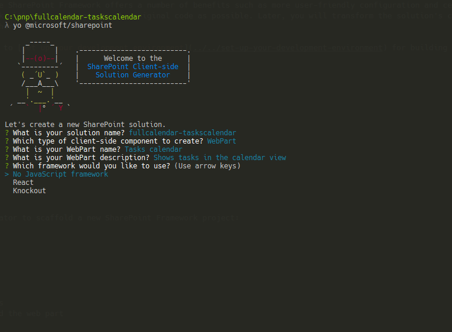

# <a name="migrate-jquery-and-fullcalendar-solution-built-using-script-editor-web-part-to-sharepoint-framework"></a><span data-ttu-id="a5bb9-102">Перенос решения с jQuery и FullCalendar, созданного с помощью веб-части редактора скриптов, на платформу SharePoint Framework</span><span class="sxs-lookup"><span data-stu-id="a5bb9-102">Migrate jQuery and FullCalendar solution built using Script Editor Web Part to SharePoint Framework</span></span>

<span data-ttu-id="a5bb9-p101">При создании решений для SharePoint разработчики часто используют подключаемый модуль [FullCalendar](https://fullcalendar.io) для jQuery, чтобы выводить данные в представлении календаря. FullCalendar — это отличная альтернатива стандартному представлению календаря SharePoint, так как она позволяет представлять данные из нескольких списков календарей, данные из других списков и даже данные, находящиеся за пределами SharePoint. В этой статье показано, как перенести модификацию SharePoint с использованием FullCalendar, созданную с помощью веб-части редактора скриптов, на платформу SharePoint Framework.</span><span class="sxs-lookup"><span data-stu-id="a5bb9-p101">When building SharePoint solutions, SharePoint developers often use the [FullCalendar](https://fullcalendar.io) jQuery plugin to display data in calendar view. FullCalendar is a great alternative to the standard SharePoint calendar view, as it allows you to render as calendar data from multiple calendar lists, data from non-calendar lists or even data from outside of SharePoint. This article illustrates how you would migrate a SharePoint customization using FullCalendar built with the Script Editor Web Part to the SharePoint Framework.</span></span>

## <a name="list-of-tasks-displayed-as-a-calendar-built-using-the-script-editor-web-part"></a><span data-ttu-id="a5bb9-106">Список задач, отображаемый в виде календаря, созданного с помощью веб-части редактора скриптов</span><span class="sxs-lookup"><span data-stu-id="a5bb9-106">List of tasks displayed as a calendar built using the Script Editor Web Part</span></span>

<span data-ttu-id="a5bb9-107">Чтобы проиллюстрировать перенос модификации SharePoint с использованием FullCalendar на платформу SharePoint Framework, мы будем использовать представленное ниже решение, которое показывает представление календаря с задачами, полученными из списка SharePoint.</span><span class="sxs-lookup"><span data-stu-id="a5bb9-107">To illustrate the process of migrating a SharePoint customization using FullCalendar to the SharePoint Framework you will use the following solution that shows a calendar view of tasks retrieved from a SharePoint list.</span></span>


<span data-ttu-id="a5bb9-p102">Решение создано с помощью стандартной веб-части редактора скриптов SharePoint. Ниже представлен код, используемый модификацией.</span><span class="sxs-lookup"><span data-stu-id="a5bb9-p102">The solution is built using the standard SharePoint Script Editor Web Part. Following is the code used by the customization.</span></span>

```html
<script src="//code.jquery.com/jquery-1.11.1.min.js"></script>
<script src="//cdnjs.cloudflare.com/ajax/libs/moment.js/2.10.6/moment.min.js"></script>
<script src="//cdnjs.cloudflare.com/ajax/libs/fullcalendar/3.4.0/fullcalendar.min.js"></script>
<link type="text/css" rel="stylesheet" href="//cdnjs.cloudflare.com/ajax/libs/fullcalendar/3.4.0/fullcalendar.min.css" />
<div id="calendar"></div>

<script>
  var PATH_TO_DISPFORM = _spPageContextInfo.webAbsoluteUrl + "/Lists/Tasks/DispForm.aspx";
  var TASK_LIST = "Tasks";
  var COLORS = ['#466365', '#B49A67', '#93B7BE', '#E07A5F', '#849483', '#084C61', '#DB3A34'];

  displayTasks();

  function displayTasks() {
    $('#calendar').fullCalendar('destroy');
    $('#calendar').fullCalendar({
      weekends: false,
      header: {
        left: 'prev,next today',
        center: 'title',
        right: 'month,basicWeek,basicDay'
      },
      displayEventTime: false,
      // open up the display form when a user clicks on an event
      eventClick: function (calEvent, jsEvent, view) {
        window.location = PATH_TO_DISPFORM + "?ID=" + calEvent.id;
      },
      editable: true,
      timezone: "UTC",
      droppable: true, // this allows things to be dropped onto the calendar
      // update the end date when a user drags and drops an event 
      eventDrop: function (event, delta, revertFunc) {
        updateTask(event.id, event.start, event.end);
      },
      // put the events on the calendar 
      events: function (start, end, timezone, callback) {
        var startDate = start.format('YYYY-MM-DD');
        var endDate = end.format('YYYY-MM-DD');

        var restQuery = "/_api/Web/Lists/GetByTitle('" + TASK_LIST + "')/items?$select=ID,Title,\
Status,StartDate,DueDate,AssignedTo/Title&$expand=AssignedTo&\
$filter=((DueDate ge '" + startDate + "' and DueDate le '" + endDate + "')or(StartDate ge '" + startDate + "' and StartDate le '" + endDate + "'))";

        $.ajax({
          url: _spPageContextInfo.webAbsoluteUrl + restQuery,
          type: "GET",
          dataType: "json",
          headers: {
            Accept: "application/json;odata=nometadata"
          }
        })
          .done(function (data, textStatus, jqXHR) {
            var personColors = {};
            var colorNo = 0;

            var events = data.value.map(function (task) {
              var assignedTo = task.AssignedTo.map(function (person) {
                return person.Title;
              }).join(', ');

              var color = personColors[assignedTo];
              if (!color) {
                color = COLORS[colorNo++];
                personColors[assignedTo] = color;
              }
              if (colorNo >= COLORS.length) {
                colorNo = 0;
              }

              return {
                title: task.Title + " - " + assignedTo,
                id: task.ID,
                color: color, // specify the background color and border color can also create a class and use className parameter. 
                start: moment.utc(task.StartDate).add("1", "days"),
                end: moment.utc(task.DueDate).add("1", "days") // add one day to end date so that calendar properly shows event ending on that day
              };
            });

            callback(events);
          });
      }
    });
  }

  function updateTask(id, startDate, dueDate) {
    // subtract the previously added day to the date to store correct date
    var sDate = moment.utc(startDate).add("-1", "days").format('YYYY-MM-DD') + "T" +
      startDate.format("hh:mm") + ":00Z";
    if (!dueDate) {
      dueDate = startDate;
    }
    var dDate = moment.utc(dueDate).add("-1", "days").format('YYYY-MM-DD') + "T" +
      dueDate.format("hh:mm") + ":00Z";

    $.ajax({
      url: _spPageContextInfo.webAbsoluteUrl + '/_api/contextinfo',
      type: 'POST',
      headers: {
        'Accept': 'application/json;odata=nometadata'
      }
    })
      .then(function (data, textStatus, jqXHR) {
        return $.ajax({
          url: _spPageContextInfo.webAbsoluteUrl +
          "/_api/Web/Lists/getByTitle('" + TASK_LIST + "')/Items(" + id + ")",
          type: 'POST',
          data: JSON.stringify({
            StartDate: sDate,
            DueDate: dDate,
          }),
          headers: {
            Accept: "application/json;odata=nometadata",
            "Content-Type": "application/json;odata=nometadata",
            "X-RequestDigest": data.FormDigestValue,
            "IF-MATCH": "*",
            "X-Http-Method": "PATCH"
          }
        });
      })
      .done(function (data, textStatus, jqXHR) {
        alert("Update Successful");
      })
      .fail(function (jqXHR, textStatus, errorThrown) {
        alert("Update Failed");
      })
      .always(function () {
        displayTasks();
      });
  }
</script>
```

> <span data-ttu-id="a5bb9-p103">Это решение основано на работе Марка Рекли (Mark Rackley) — специалиста со статусом MVP по серверам и службам Office и директора по стратегическим вопросам в группе PAIT. Дополнительные сведения об исходном решении см. по адресу [http://www.markrackley.net/2017/06/07/using-fullcalendar-io-to-create-custom-calendars-in-sharepoint/](http://www.markrackley.net/2017/06/07/using-fullcalendar-io-to-create-custom-calendars-in-sharepoint/).</span><span class="sxs-lookup"><span data-stu-id="a5bb9-p103">This solution is based on the work of Mark Rackley, Office Servers and Services MVP and Chief Strategy Officer at PAIT Group. For more information about the original solution visit [http://www.markrackley.net/2017/06/07/using-fullcalendar-io-to-create-custom-calendars-in-sharepoint/](http://www.markrackley.net/2017/06/07/using-fullcalendar-io-to-create-custom-calendars-in-sharepoint/).</span></span>

<span data-ttu-id="a5bb9-p104">Для начала модификация загружает используемые ею библиотеки: jQuery, Moment.js и FullCalendar (строки 1–4). Затем она определяет разделитель, в который будет внедрено созданное представление календаря (строка 5). После этого она определяет две функции: **displayTasks** (используется для отображения задач в представлении календаря) и **updateTask** (вызывается после перетаскивания задачи на другую дату и обновляет даты для соответствующего элемента списка). Каждая функция определяет собственный запрос REST, с помощью которого она обращается к REST API списков SharePoint, чтобы получить или обновить элементы списка.</span><span class="sxs-lookup"><span data-stu-id="a5bb9-p104">First, the customization loads the libraries it uses: jQuery, Moment.js and FullCalendar (lines 1-4). Next, it defines the div into which the generated calendar view will be injected (line 5). Then, it defines two functions: **displayTasks** - used to display tasks in the calendar view, and **updateTask** which is triggered after dragging and dropping a task to a different date and which updates the dates on the underlying list item. Each function defines its own REST query which is then used to communicate with the SharePoint List REST API to retrieve or update list items.</span></span>

<span data-ttu-id="a5bb9-117">Используя подключаемый модуль FullCalendar для jQuery, можно с минимальными усилиями создавать функциональные решения, предоставляющие пользователям такие возможности, как пометка событий разными цветами и упорядочивание событий путем перетаскивания.</span><span class="sxs-lookup"><span data-stu-id="a5bb9-117">Using the FullCalendar jQuery plugin, with little effort users get rich solutions capable of things such as using different colors to mark different events or using drag and drop to reorganize events.</span></span>


## <a name="migrate-the-tasks-calendar-solution-from-the-script-editor-web-part-to-the-sharepoint-framework"></a><span data-ttu-id="a5bb9-119">Перенос решения для просмотра календаря задач из веб-части редактора скриптов на платформу SharePoint Framework</span><span class="sxs-lookup"><span data-stu-id="a5bb9-119">Migrate the Tasks calendar solution from the Script Editor Web Part to the SharePoint Framework</span></span>

> <span data-ttu-id="a5bb9-120">**Примечание.** Прежде чем выполнять действия, описанные в этой статье, [настройте среду разработки](../../set-up-your-development-environment.md) для создания решений на платформе SharePoint Framework.</span><span class="sxs-lookup"><span data-stu-id="a5bb9-120">**Note:** Before following the steps in this article, be sure to [set up your development environment](../../set-up-your-development-environment.md) for building SharePoint Framework solutions.</span></span>

<span data-ttu-id="a5bb9-p105">Преобразование модификации на основе веб-части редактора скриптов для платформы SharePoint Framework предоставляет ряд преимуществ, таких как удобство настройки и централизованное управление решением. Ниже представлено пошаговое руководство по переносу решения на платформу SharePoint Framework. Для начала мы перенесем решение на платформу SharePoint Framework, внося как можно меньше изменений в исходный код. Затем мы преобразуем код решения в TypeScript, чтобы воспользоваться функциями обеспечения безопасности типов во время разработки, а также заменим некоторые фрагменты кода для применения API SharePoint Framework, чтобы сделать доступными возможности этой платформы и сделать решение еще проще.</span><span class="sxs-lookup"><span data-stu-id="a5bb9-p105">Transforming a Script Editor Web Part-based customization to the SharePoint Framework offers a number of benefits such as more user-friendly configuration and centralized management of the solution. Following is a step-by-step description of how you would migrate the solution to the SharePoint Framework. First, you will migrate the solution to the SharePoint Framework with as few changes to the original code as possible. Later, you will transform the solution's code to TypeScript to benefit of its development-time type safety features and replace some of the code with the SharePoint Framework API to fully benefit of its capabilities and simplify the solution even further.</span></span>

> <span data-ttu-id="a5bb9-125">Исходный код проекта на разных этапах миграции доступен на странице [https://github.com/SharePoint/sp-dev-fx-webparts/tree/master/tutorials/tutorial-migrate-fullcalendar](https://github.com/SharePoint/sp-dev-fx-webparts/tree/master/tutorials/tutorial-migrate-fullcalendar).</span><span class="sxs-lookup"><span data-stu-id="a5bb9-125">The source code of the project in the different stages of migration is available at [https://github.com/SharePoint/sp-dev-fx-webparts/tree/master/tutorials/tutorial-migrate-fullcalendar](https://github.com/SharePoint/sp-dev-fx-webparts/tree/master/tutorials/tutorial-migrate-fullcalendar).</span></span>

### <a name="create-new-sharepoint-framework-project"></a><span data-ttu-id="a5bb9-126">Создание проекта SharePoint Framework</span><span class="sxs-lookup"><span data-stu-id="a5bb9-126">Create new SharePoint Framework project</span></span>

<span data-ttu-id="a5bb9-127">Для начала создайте папку проекта.</span><span class="sxs-lookup"><span data-stu-id="a5bb9-127">Start by creating a new folder for your project</span></span>

```sh
md fullcalendar-taskscalendar
```

<span data-ttu-id="a5bb9-128">Перейдите в папку проекта:</span><span class="sxs-lookup"><span data-stu-id="a5bb9-128">Navigate to the project folder:</span></span>

```sh
cd fullcalendar-taskscalendar
```

<span data-ttu-id="a5bb9-129">В папке проекта запустите генератор Yeoman для SharePoint Framework, чтобы сформировать шаблон проекта на платформе SharePoint Framework:</span><span class="sxs-lookup"><span data-stu-id="a5bb9-129">In the project folder run the SharePoint Framework Yeoman generator to scaffold a new SharePoint Framework project:</span></span>

```sh
yo @microsoft/sharepoint
```

<span data-ttu-id="a5bb9-130">Определите значения следующим образом:</span><span class="sxs-lookup"><span data-stu-id="a5bb9-130">When prompted, define values as follows:</span></span>
- <span data-ttu-id="a5bb9-131">имя решения — **fullcalendar-taskscalendar**;</span><span class="sxs-lookup"><span data-stu-id="a5bb9-131">**fullcalendar-taskscalendar** as your solution name</span></span>
- <span data-ttu-id="a5bb9-132">расположение файлов — **Use the current folder** (Использовать текущую папку);</span><span class="sxs-lookup"><span data-stu-id="a5bb9-132">**Use the current folder** for the location to place the files</span></span>
- <span data-ttu-id="a5bb9-133">создаваемый клиентский компонент — **WebPart**;</span><span class="sxs-lookup"><span data-stu-id="a5bb9-133">**WebPart** as the client-side component to create</span></span>
- <span data-ttu-id="a5bb9-134">имя веб-части — **Tasks calendar**;</span><span class="sxs-lookup"><span data-stu-id="a5bb9-134">**Tasks calendar** as your web part name</span></span>
- <span data-ttu-id="a5bb9-135">описание веб-части **Shows tasks in the calendar view** (Показывает задачи в представлении календаря);</span><span class="sxs-lookup"><span data-stu-id="a5bb9-135">**Shows tasks in the calendar view** as your web part description</span></span>
- <span data-ttu-id="a5bb9-136">отправная точка создания веб-части — **No javaScript web framework** (Без платформы JavaScript).</span><span class="sxs-lookup"><span data-stu-id="a5bb9-136">**No javaScript web framework** as the starting point to build the web part</span></span>



<span data-ttu-id="a5bb9-138">После завершения скаффолдинга заблокируйте версию зависимостей проекта, выполнив следующую команду:</span><span class="sxs-lookup"><span data-stu-id="a5bb9-138">Once the scaffolding completes, lock down the version of the project dependencies by running the following command:</span></span>

```sh
npm shrinkwrap
```

<span data-ttu-id="a5bb9-139">Далее откройте папку проекта в редакторе кода.</span><span class="sxs-lookup"><span data-stu-id="a5bb9-139">Next, open your project folder in your code editor.</span></span> <span data-ttu-id="a5bb9-140">В этом руководстве используется Visual Studio Code.</span><span class="sxs-lookup"><span data-stu-id="a5bb9-140">Once the scaffolding completes, open your project folder in your code editor. In this tutorial, you will use Visual Studio Code.</span></span>


### <a name="load-javascript-libraries"></a><span data-ttu-id="a5bb9-142">Загрузка библиотек JavaScript</span><span class="sxs-lookup"><span data-stu-id="a5bb9-142">Load JavaScript libraries</span></span>

<span data-ttu-id="a5bb9-p107">Как и в исходном решении, созданном с помощью веб-части редактора скриптов, сначала следует загрузить библиотеки JavaScript, необходимые решению. В SharePoint Framework эта операция обычно делится на два этапа: указание URL-адреса, с которого будет загружена библиотека, и обращение к библиотеке в коде.</span><span class="sxs-lookup"><span data-stu-id="a5bb9-p107">Similarly to the original solution built using the Script Editor Web Part, first you need to load the JavaScript libraries required by the solution. In SharePoint Framework this usually consists of two steps: specifying the URL from which the library should be loaded, and referencing the library in the code.</span></span>

<span data-ttu-id="a5bb9-p108">Для начала укажите URL-адрес, с которого следует загружать библиотеки. В редакторе кода откройте файл **./config/config.json** и замените раздел **externals** на следующий код:</span><span class="sxs-lookup"><span data-stu-id="a5bb9-p108">Start, with specifying the URLs from which libraries should be loaded. In the code editor, open the **./config/config.json** file and change the **externals** section to:</span></span>

```json
{
  "externals": {
    "jquery": "https://code.jquery.com/jquery-1.11.1.min.js",
    "moment": "https://cdnjs.cloudflare.com/ajax/libs/moment.js/2.10.6/moment.min.js",
    "fullcalendar": "https://cdnjs.cloudflare.com/ajax/libs/fullcalendar/3.4.0/fullcalendar.min.js"
  }
}
```

<span data-ttu-id="a5bb9-147">Затем откройте файл **./src/webparts/tasksCalendar/TasksCalendarWebPart.ts** и после последнего оператора **import** добавьте следующий код:</span><span class="sxs-lookup"><span data-stu-id="a5bb9-147">Next, open the **./src/webparts/tasksCalendar/TasksCalendarWebPart.ts** file, and after the last **import** statement add:</span></span>

```ts
import 'jquery';
import 'moment';
import 'fullcalendar';
```

### <a name="define-container-div"></a><span data-ttu-id="a5bb9-148">Определение разделителя контейнера</span><span class="sxs-lookup"><span data-stu-id="a5bb9-148">Define container div</span></span>

<span data-ttu-id="a5bb9-p109">Как и в исходном решении, далее необходимо определить, где будет отрисовываться календарь. В редакторе кода откройте файл **./src/webparts/tasksCalendar/TasksCalendarWebPart.ts** и замените метод **render** на следующий код:</span><span class="sxs-lookup"><span data-stu-id="a5bb9-p109">Just as in the original solution, the next step is to define the location where the calendar should be rendered. In the code editor, open the **./src/webparts/tasksCalendar/TasksCalendarWebPart.ts** file and change the **render** method to:</span></span>

```ts
export default class ItRequestsWebPart extends BaseClientSideWebPart<IItRequestsWebPartProps> {
  public render(): void {
    this.domElement.innerHTML = `
      <div class="${styles.tasksCalendar}">
        <link type="text/css" rel="stylesheet" href="//cdnjs.cloudflare.com/ajax/libs/fullcalendar/3.4.0/fullcalendar.min.css" />
        <div id="calendar"></div>
      </div>`;
  }
  // ...
}
```

### <a name="initiate-fullcalendar-and-load-data"></a><span data-ttu-id="a5bb9-151">Инициализация модуля FullCalendar и загрузка данных</span><span class="sxs-lookup"><span data-stu-id="a5bb9-151">Initiate FullCalendar and load data</span></span>

<span data-ttu-id="a5bb9-p110">Последний этап — добавление кода, инициализирующего подключаемый модуль FullCalendar для jQuery и загружающего данные из SharePoint. В папке **./src/webparts/tasksCalendar** создайте файл с именем **script.js** и вставьте следующий код:</span><span class="sxs-lookup"><span data-stu-id="a5bb9-p110">The last step is to include the code that initiates the FullCalendar jQuery plugin and loads the data from SharePoint. In the **./src/webparts/tasksCalendar** folder, create a new file named **script.js** and paste the following code:</span></span>

```js
var moment = require('moment');

var PATH_TO_DISPFORM = window.webAbsoluteUrl + "/Lists/Tasks/DispForm.aspx";
var TASK_LIST = "Tasks";
var COLORS = ['#466365', '#B49A67', '#93B7BE', '#E07A5F', '#849483', '#084C61', '#DB3A34'];

displayTasks();

function displayTasks() {
  $('#calendar').fullCalendar('destroy');
  $('#calendar').fullCalendar({
    weekends: false,
    header: {
      left: 'prev,next today',
      center: 'title',
      right: 'month,basicWeek,basicDay'
    },
    displayEventTime: false,
    // open up the display form when a user clicks on an event
    eventClick: function (calEvent, jsEvent, view) {
      window.location = PATH_TO_DISPFORM + "?ID=" + calEvent.id;
    },
    editable: true,
    timezone: "UTC",
    droppable: true, // this allows things to be dropped onto the calendar
    // update the end date when a user drags and drops an event 
    eventDrop: function (event, delta, revertFunc) {
      updateTask(event.id, event.start, event.end);
    },
    // put the events on the calendar 
    events: function (start, end, timezone, callback) {
      var startDate = start.format('YYYY-MM-DD');
      var endDate = end.format('YYYY-MM-DD');

      var restQuery = "/_api/Web/Lists/GetByTitle('" + TASK_LIST + "')/items?$select=ID,Title,\
Status,StartDate,DueDate,AssignedTo/Title&$expand=AssignedTo&\
$filter=((DueDate ge '" + startDate + "' and DueDate le '" + endDate + "')or(StartDate ge '" + startDate + "' and StartDate le '" + endDate + "'))";

      $.ajax({
        url: window.webAbsoluteUrl + restQuery,
        type: "GET",
        dataType: "json",
        headers: {
          Accept: "application/json;odata=nometadata"
        }
      })
        .done(function (data, textStatus, jqXHR) {
          var personColors = {};
          var colorNo = 0;

          var events = data.value.map(function (task) {
            var assignedTo = task.AssignedTo.map(function (person) {
              return person.Title;
            }).join(', ');

            var color = personColors[assignedTo];
            if (!color) {
              color = COLORS[colorNo++];
              personColors[assignedTo] = color;
            }
            if (colorNo >= COLORS.length) {
              colorNo = 0;
            }

            return {
              title: task.Title + " - " + assignedTo,
              id: task.ID,
              color: color, // specify the background color and border color can also create a class and use className parameter. 
              start: moment.utc(task.StartDate).add("1", "days"),
              end: moment.utc(task.DueDate).add("1", "days") // add one day to end date so that calendar properly shows event ending on that day
            };
          });

          callback(events);
        });
    }
  });
}

function updateTask(id, startDate, dueDate) {
  // subtract the previously added day to the date to store correct date
  var sDate = moment.utc(startDate).add("-1", "days").format('YYYY-MM-DD') + "T" +
    startDate.format("hh:mm") + ":00Z";
  if (!dueDate) {
    dueDate = startDate;
  }
  var dDate = moment.utc(dueDate).add("-1", "days").format('YYYY-MM-DD') + "T" +
    dueDate.format("hh:mm") + ":00Z";

  $.ajax({
    url: window.webAbsoluteUrl + '/_api/contextinfo',
    type: 'POST',
    headers: {
      'Accept': 'application/json;odata=nometadata'
    }
  })
    .then(function (data, textStatus, jqXHR) {
      return $.ajax({
        url: window.webAbsoluteUrl +
        "/_api/Web/Lists/getByTitle('" + TASK_LIST + "')/Items(" + id + ")",
        type: 'POST',
        data: JSON.stringify({
          StartDate: sDate,
          DueDate: dDate,
        }),
        headers: {
          Accept: "application/json;odata=nometadata",
          "Content-Type": "application/json;odata=nometadata",
          "X-RequestDigest": data.FormDigestValue,
          "IF-MATCH": "*",
          "X-Http-Method": "PATCH"
        }
      });
    })
    .done(function (data, textStatus, jqXHR) {
      alert("Update Successful");
    })
    .fail(function (jqXHR, textStatus, errorThrown) {
      alert("Update Failed");
    })
    .always(function () {
      displayTasks();
    });
}
```

<span data-ttu-id="a5bb9-p111">Этот код практически идентичен первоначальному коду модификации на основе веб-части редактора скриптов. Единственное отличие заключается в том, что первоначальный код получал URL-адрес текущего сайта из глобальной переменной **\_spPageContextInfo**, которую задала среда SharePoint (строки 8, 45, 96 и 104), а на платформе SharePoint Framework используется пользовательская переменная, которую потребуется задать в веб-части. Клиентские веб-части SharePoint Framework можно использовать как на классических, так и на современных страницах. Переменная **_spPageContextInfo** присутствует на классических, но недоступна на современных страницах, поэтому не стоит рассчитывать на нее. Необходимо создать настраиваемое свойство, которое можно задавать самостоятельно.</span><span class="sxs-lookup"><span data-stu-id="a5bb9-p111">This code is almost identical with the original code of the Script Editor Web Part customization. The only difference is that where the original code retrieved the URL of the current web from the global **\_spPageContextInfo** variable set by SharePoint (lines 8, 45, 96 and 104), the code in the SharePoint Framework uses a custom variable that you will have to set in the web part. SharePoint Framework client-side web parts can be used both on classic and modern pages. While the **_spPageContextInfo** variable is present on classic pages, it's not available on modern pages which is why you can't rely on it and need a custom property that you can control yourself instead.</span></span>

<span data-ttu-id="a5bb9-158">Чтобы сослаться на этот файл в веб-части, откройте в редакторе кода файл **./src/webparts/tasksCalendar/TasksCalendarWebPart.ts** и замените метод **render** на следующий код:</span><span class="sxs-lookup"><span data-stu-id="a5bb9-158">In order to reference this file in the web part, in the code editor, open the **./src/webparts/tasksCalendar/TasksCalendarWebPart.ts** file and change the **render** method to:</span></span>

```ts
export default class ItRequestsWebPart extends BaseClientSideWebPart<IItRequestsWebPartProps> {
  public render(): void {
    this.domElement.innerHTML = `
      <div class="${styles.tasksCalendar}">
        <link type="text/css" rel="stylesheet" href="//cdnjs.cloudflare.com/ajax/libs/fullcalendar/3.4.0/fullcalendar.min.css" />
        <div id="calendar"></div>
      </div>`;

    (window as any).webAbsoluteUrl = this.context.pageContext.web.absoluteUrl;
    require('./script');
  }
  // ...
}
```

<span data-ttu-id="a5bb9-159">Убедитесь, что веб-часть работает надлежащим образом, выполнив в командной строке следующую команду:</span><span class="sxs-lookup"><span data-stu-id="a5bb9-159">Verify, that the web part is working as expected by in the command line executing:</span></span>

```sh
gulp serve --nobrowser
```

<span data-ttu-id="a5bb9-p112">Так как веб-часть загружает свои данные из SharePoint, необходимо протестировать ее с помощью размещенного рабочего места SharePoint Framework. Перейдите на страницу **https://yourtenant.sharepoint.com/_layouts/workbench.aspx** и добавьте веб-часть на холст. Должны появиться задачи, отображаемые в представлении календаря с помощью подключаемого модуля FullCalendar для jQuery.</span><span class="sxs-lookup"><span data-stu-id="a5bb9-p112">Because the web part loads its data from SharePoint, you have to test the web part using the hosted SharePoint Framework workbench. Navigate to **https://yourtenant.sharepoint.com/_layouts/workbench.aspx** and add the web part to the canvas. You should now see the tasks displayed in a calendar view using the FullCalendar jQuery plugin.</span></span>


## <a name="add-support-for-configuring-the-web-part-through-web-part-properties"></a><span data-ttu-id="a5bb9-164">Добавление поддержки настройки веб-части с помощью ее свойств</span><span class="sxs-lookup"><span data-stu-id="a5bb9-164">Add support for configuring the web part through web part properties</span></span>

<span data-ttu-id="a5bb9-p113">На предыдущих этапах мы перенесли решения для просмотра календаря задач из веб-части редактора скриптов на платформу SharePoint Framework. Решение уже работает надлежащим образом, но не использует преимущества SharePoint Framework. Имя списка, из которого загружаются задачи, включено в код, представляющий собой обычный код JavaScript, который сложнее оптимизировать, чем TypeScript. Ниже показано, как расширить имеющееся решение, чтобы пользователь мог указывать имя списка, из которого будут загружаться данные. Позже мы преобразуем код в TypeScript, чтобы воспользоваться функциями обеспечения безопасности типов.</span><span class="sxs-lookup"><span data-stu-id="a5bb9-p113">In the previous steps you migrated the Tasks calendar solutions from Script Editor Web Part to the SharePoint Framework. While the solution already works as expected, it doesn't use any of the SharePoint Framework benefits. The name of the list from which tasks are loaded is included in the code and the code itself is plain JavaScript which is harder to refactor than TypeScript. The following steps illustrate how to extend the existing solution to allow users to specify the name of the list to load the data from. Later, you will transform the code to TypeScript to benefit of its type safety features.</span></span>

### <a name="define-web-part-property-for-storing-the-name-of-the-list"></a><span data-ttu-id="a5bb9-170">Определение свойства веб-части для хранения имени списка</span><span class="sxs-lookup"><span data-stu-id="a5bb9-170">Define web part property for storing the name of the list</span></span>

<span data-ttu-id="a5bb9-p114">Для начала определите свойство веб-части для хранения имени списка, из которого загружаются задачи. В редакторе кода откройте файл **./src/webparts/tasksCalendar/TasksCalendarWebPart.manifest.json**, измените имя заданного по умолчанию свойства **description** на **listName** и удалите его значение.</span><span class="sxs-lookup"><span data-stu-id="a5bb9-p114">Start with defining a web part property to store the name of the list from which tasks should be loaded. In the code editor, open the **./src/webparts/tasksCalendar/TasksCalendarWebPart.manifest.json** file and rename the default **description** property to **listName** and clear its value.</span></span>


<span data-ttu-id="a5bb9-p115">Затем обновите интерфейс свойств веб-части, чтобы увидеть изменения в манифесте. В редакторе кода откройте файл **./src/webparts/tasksCalendar/ITasksCalendarWebPartProps.ts** и измените его содержимое на следующее:</span><span class="sxs-lookup"><span data-stu-id="a5bb9-p115">Next, update the web part properties interface to reflect the changes in the manifest. In the code editor, open the **./src/webparts/tasksCalendar/ITasksCalendarWebPartProps.ts** file and change its contents to:</span></span>

```ts
export interface ITasksCalendarWebPartProps {
  listName: string;
}
```

<span data-ttu-id="a5bb9-p116">Затем обновите метки отображения свойства **listName**. Откройте файл **./src/webparts/tasksCalendar/loc/mystrings.d.ts** и измените его содержимое на следующее:</span><span class="sxs-lookup"><span data-stu-id="a5bb9-p116">Then, update the display labels for the **listName** property. Open the **./src/webparts/tasksCalendar/loc/mystrings.d.ts** file and change its contents to:</span></span>

```ts
declare interface ITasksCalendarStrings {
  PropertyPaneDescription: string;
  BasicGroupName: string;
  ListNameFieldLabel: string;
}

declare module 'tasksCalendarStrings' {
  const strings: ITasksCalendarStrings;
  export = strings;
}
```

<span data-ttu-id="a5bb9-178">Затем откройте файл **./src/webparts/tasksCalendar/loc/en-us.js** и измените его содержимое на следующее:</span><span class="sxs-lookup"><span data-stu-id="a5bb9-178">Next, open the **./src/webparts/tasksCalendar/loc/en-us.js** file and change its contents to:</span></span>

```js
define([], function() {
  return {
    "PropertyPaneDescription": "Tasks calendar settings",
    "BasicGroupName": "Data",
    "ListNameFieldLabel": "List name"
  }
});
```

<span data-ttu-id="a5bb9-p117">Напоследок обновите веб-часть, чтобы она использовала новое свойство. В редакторе кода откройте файл **./src/webparts/tasksCalendar/TasksCalendarWebPart.ts** и замените метод **getPropertyPaneConfiguration** на следующий код:</span><span class="sxs-lookup"><span data-stu-id="a5bb9-p117">Finally, update the web part to use the newly defined property. In the code editor, open the **./src/webparts/tasksCalendar/TasksCalendarWebPart.ts** file and change the **getPropertyPaneConfiguration** method to:</span></span>

```ts
export default class TasksCalendarWebPart extends BaseClientSideWebPart<ITasksCalendarWebPartProps> {
  // ...
  protected getPropertyPaneConfiguration(): IPropertyPaneConfiguration {
    return {
      pages: [
        {
          header: {
            description: strings.PropertyPaneDescription
          },
          groups: [
            {
              groupName: strings.BasicGroupName,
              groupFields: [
                PropertyPaneTextField('listName', {
                  label: strings.ListNameFieldLabel
                })
              ]
            }
          ]
        }
      ]
    };
  }

  protected get disableReactivePropertyChanges(): boolean {
    return true;
  }
}
```

<span data-ttu-id="a5bb9-181">Чтобы веб-часть не перезагружалась, когда пользователь вводит имя списка, она также должна использовать нереактивную область свойств. Для этого добавьте метод **disableReactivePropertyChanges** и задайте для него возвращаемое значение **true**.</span><span class="sxs-lookup"><span data-stu-id="a5bb9-181">To prevent the web part from reloading as users type the name of the list, you've also configured the web part to use the non-reactive property pane by adding the **disableReactivePropertyChanges** method and settings its return value to **true**.</span></span>

### <a name="use-the-configured-name-of-the-list-to-load-the-data-from"></a><span data-ttu-id="a5bb9-182">Использование заданного имени списка для загрузки данных</span><span class="sxs-lookup"><span data-stu-id="a5bb9-182">Use the configured name of the list to load the data from</span></span>

<span data-ttu-id="a5bb9-p118">Изначально имя списка, из которого загружаются данные, было встроено в запросы REST. Теперь, когда пользователи могут настраивать это имя, указанное значение должно внедряться в запросы REST перед их выполнением. Это проще всего сделать, переместив содержимое файла **script.js** в основной файл веб-части.</span><span class="sxs-lookup"><span data-stu-id="a5bb9-p118">Initially, the name of the list from which the data should be loaded was embedded in the REST queries. Now that users can configure this name, the configured value should be injected into the REST queries before executing them. The easiest way to do that, is by moving the contents of the **script.js** file to the main web part file.</span></span>

<span data-ttu-id="a5bb9-186">В редакторе кода откройте файл **./src/webparts/tasksCalendar/TasksCalendarWebPart.ts**.</span><span class="sxs-lookup"><span data-stu-id="a5bb9-186">In the code editor, open the **./src/webparts/tasksCalendar/TasksCalendarWebPart.ts** file.</span></span>

<span data-ttu-id="a5bb9-187">Для начала измените оператор импорта для загрузки необходимых библиотек:</span><span class="sxs-lookup"><span data-stu-id="a5bb9-187">Start, by changing the import statement to load the required libraries to:</span></span>

```ts
var $: any = require('jquery');
var moment: any = require('moment');

import 'fullcalendar';

var COLORS = ['#466365', '#B49A67', '#93B7BE', '#E07A5F', '#849483', '#084C61', '#DB3A34'];
```

<span data-ttu-id="a5bb9-p119">Так как в коде, который мы будем использовать позже, есть ссылки на библиотеку Moment.js, ее имя должно быть известно компилятору TypeScript. В противном случае при сборке проекта возникнет ошибка. Это относится и к jQuery. FullCalendar — это подключаемый модуль для jQuery, который присоединяется к объекту jQuery, поэтому его можно импортировать так же, как и раньше. Напоследок необходимо скопировать список цветов, которые будут использоваться для пометки различных событий.</span><span class="sxs-lookup"><span data-stu-id="a5bb9-p119">Because Moment.js is referenced in the code that you will be using later, its name must be known to TypeScript or building the project will fail. The same applies to jQuery. Because FullCalendar is a jQuery plugin that attaches itself to the jQuery object, it can be imported the same way as previously. The last part, includes copying the list of colors to use for marking the different events.</span></span>

<span data-ttu-id="a5bb9-192">Затем скопируйте функции **displayTasks** и **updateTask** из файла **script.js** и вставьте их в класс **TasksCalendarWebPart**, как показано ниже.</span><span class="sxs-lookup"><span data-stu-id="a5bb9-192">Next, copy the **displayTasks** and **updateTask** functions from the **script.js** file and paste them as follows inside the **TasksCalendarWebPart** class:</span></span>

```ts
export default class TasksCalendarWebPart extends BaseClientSideWebPart<ITasksCalendarWebPartProps> {
  // ...

  private displayTasks() {
    $('#calendar').fullCalendar('destroy');
    $('#calendar').fullCalendar({
      weekends: false,
      header: {
        left: 'prev,next today',
        center: 'title',
        right: 'month,basicWeek,basicDay'
      },
      displayEventTime: false,
      // open up the display form when a user clicks on an event
      eventClick: (calEvent, jsEvent, view) => {
        (window as any).location = this.context.pageContext.web.absoluteUrl +
          "/Lists/" + escape(this.properties.listName) + "/DispForm.aspx?ID=" + calEvent.id;
      },
      editable: true,
      timezone: "UTC",
      droppable: true, // this allows things to be dropped onto the calendar
      // update the end date when a user drags and drops an event 
      eventDrop: (event, delta, revertFunc) => {
        this.updateTask(event.id, event.start, event.end);
      },
      // put the events on the calendar 
      events: (start, end, timezone, callback) => {
        var startDate = start.format('YYYY-MM-DD');
        var endDate = end.format('YYYY-MM-DD');

        var restQuery = "/_api/Web/Lists/GetByTitle('" + escape(this.properties.listName) + "')/items?$select=ID,Title,\
Status,StartDate,DueDate,AssignedTo/Title&$expand=AssignedTo&\
$filter=((DueDate ge '" + startDate + "' and DueDate le '" + endDate + "')or(StartDate ge '" + startDate + "' and StartDate le '" + endDate + "'))";

        $.ajax({
          url: this.context.pageContext.web.absoluteUrl + restQuery,
          type: "GET",
          dataType: "json",
          headers: {
            Accept: "application/json;odata=nometadata"
          }
        })
          .done((data, textStatus, jqXHR) => {
            var personColors = {};
            var colorNo = 0;

            var events = data.value.map((task) => {
              var assignedTo = task.AssignedTo.map((person) => {
                return person.Title;
              }).join(', ');

              var color = personColors[assignedTo];
              if (!color) {
                color = COLORS[colorNo++];
                personColors[assignedTo] = color;
              }
              if (colorNo >= COLORS.length) {
                colorNo = 0;
              }

              return {
                title: task.Title + " - " + assignedTo,
                id: task.ID,
                color: color, // specify the background color and border color can also create a class and use className parameter. 
                start: moment.utc(task.StartDate).add("1", "days"),
                end: moment.utc(task.DueDate).add("1", "days") // add one day to end date so that calendar properly shows event ending on that day
              };
            });

            callback(events);
          });
      }
    });
  }

  private updateTask(id, startDate, dueDate) {
    // subtract the previously added day to the date to store correct date
    var sDate = moment.utc(startDate).add("-1", "days").format('YYYY-MM-DD') + "T" +
      startDate.format("hh:mm") + ":00Z";
    if (!dueDate) {
      dueDate = startDate;
    }
    var dDate = moment.utc(dueDate).add("-1", "days").format('YYYY-MM-DD') + "T" +
      dueDate.format("hh:mm") + ":00Z";

    $.ajax({
      url: this.context.pageContext.web.absoluteUrl + '/_api/contextinfo',
      type: 'POST',
      headers: {
        'Accept': 'application/json;odata=nometadata'
      }
    })
      .then((data, textStatus, jqXHR) => {
        return $.ajax({
          url: this.context.pageContext.web.absoluteUrl +
          "/_api/Web/Lists/getByTitle('" + escape(this.properties.listName) + "')/Items(" + id + ")",
          type: 'POST',
          data: JSON.stringify({
            StartDate: sDate,
            DueDate: dDate,
          }),
          headers: {
            Accept: "application/json;odata=nometadata",
            "Content-Type": "application/json;odata=nometadata",
            "X-RequestDigest": data.FormDigestValue,
            "IF-MATCH": "*",
            "X-Http-Method": "PATCH"
          }
        });
      })
      .done((data, textStatus, jqXHR) => {
        alert("Update Successful");
      })
      .fail((jqXHR, textStatus, errorThrown) => {
        alert("Update Failed");
      })
      .always(() => {
        this.displayTasks();
      });
  }

  // ...
}
```

<span data-ttu-id="a5bb9-p120">По сравнению с предыдущим состоянием в коде произошел ряд изменений. Обычные функции JavaScript заменены на методы TypeScript путем замены ключевого слова **function** на модификатор **private**. Это необходимо, чтобы их можно было добавить в класс **TaskCalendarWebPart**. Оба метода теперь находятся в том же файле, что и веб-часть, поэтому, вместо того чтобы определять глобальную переменную для хранения URL-адреса текущего сайта, вы можете обращаться к нему непосредственно из контекста веб-части с помощью свойства `this.context.pageContext.web.absoluteUrl`. Кроме того, во всех запросах REST фиксированное имя списка заменяется на значение свойства **listName**, в котором хранится заданное пользователем имя списка. Перед использованием этого значения к нему применяется функция lodash **escape**, чтобы запретить внедрение сценариев.</span><span class="sxs-lookup"><span data-stu-id="a5bb9-p120">There are a few changes in the code comparing to the previous situation. Plain JavaScript functions are now changed into TypeScript methods by replacing the **function** keyword with the **private** modifier. This is required to be able to add them to the **TaskCalendarWebPart** class. Because both methods are now in the same file as the web part, instead of defining a global variable to hold the URL of the current site, you can access it directly from the web part context using the `this.context.pageContext.web.absoluteUrl` property. Additionally, in all REST queries, the fixed list name is replaced with the value of the **listName** property which holds the name of the list as configured by the user. Before using the value, it's being escaped using the lodash's **escape** function to disallow script injection.</span></span>

<span data-ttu-id="a5bb9-199">Напоследок измените метод **render**, чтобы он вызывал новый метод **displayTasks**:</span><span class="sxs-lookup"><span data-stu-id="a5bb9-199">As the last step, change the **render** method to call the newly added **displayTasks** method:</span></span>

```ts
export default class TasksCalendarWebPart extends BaseClientSideWebPart<ITasksCalendarWebPartProps> {
  public render(): void {
    this.domElement.innerHTML = `
      <div class="${styles.tasksCalendar}">
        <link type="text/css" rel="stylesheet" href="//cdnjs.cloudflare.com/ajax/libs/fullcalendar/3.4.0/fullcalendar.min.css" />
        <div id="calendar"></div>
      </div>`;

    this.displayTasks();
  }
  // ...
}
```

<span data-ttu-id="a5bb9-200">Так как мы только что переместили содержимое файла **script.js** в основной файл веб-части, файл **script.js** больше не требуется и его можно удалить из проекта.</span><span class="sxs-lookup"><span data-stu-id="a5bb9-200">As you have just moved the contents of the **script.js** file into the main web part file, the **script.js** is no longer necessary and you can delete it from the project.</span></span>

<span data-ttu-id="a5bb9-201">Чтобы убедиться, что веб-часть работает надлежащим образом, выполните в командной строке следующую команду:</span><span class="sxs-lookup"><span data-stu-id="a5bb9-201">To verify that the web part is working as expected, run in the command line:</span></span>

```sh
gulp serve --nobrowser
```

<span data-ttu-id="a5bb9-p121">Перейдите к размещенному рабочему месту и добавьте веб-часть на холст. Откройте область свойств веб-части, укажите имя списка задач и нажмите кнопку **Применить**, чтобы подтвердить изменения. Теперь в веб-части должны отображаться задачи в представлении календаря.</span><span class="sxs-lookup"><span data-stu-id="a5bb9-p121">Navigate to the hosted workbench and add the web part to the canvas. Open the web part property pane, specify the name of the list with tasks and click the **Apply** button to confirm the changes. You should now see tasks displayed in a calendar view in the web part.</span></span>


## <a name="transform-the-plain-javascript-code-to-typescript"></a><span data-ttu-id="a5bb9-206">Преобразование обычного кода JavaScript в TypeScript</span><span class="sxs-lookup"><span data-stu-id="a5bb9-206">Transform the plain JavaScript code to TypeScript</span></span>

<span data-ttu-id="a5bb9-p122">Использование TypeScript вместо обычного JavaScript предоставляет ряд преимуществ. TypeScript не только упрощает поддержку и оптимизацию, но и позволяет раньше обнаруживать ошибки. Ниже описано, как преобразовать первоначальный код JavaScript в TypeScript.</span><span class="sxs-lookup"><span data-stu-id="a5bb9-p122">Using TypeScript over plain JavaScript offers a number of benefits. Not only is TypeScript easier to maintain and refactor but it also allows you to catch errors earlier. Following steps describe how you would transform the original JavaScript code to TypeScript.</span></span>

### <a name="add-type-definitions-for-used-libraries"></a><span data-ttu-id="a5bb9-210">Добавление определений типов для используемых библиотек</span><span class="sxs-lookup"><span data-stu-id="a5bb9-210">Add type definitions for used libraries</span></span>

<span data-ttu-id="a5bb9-p123">Для надлежащей работы TypeScript необходимы определения типов для различных библиотек, используемых в проекте. Определения типов часто распространяются в виде пакетов npm в пространстве имен @types.</span><span class="sxs-lookup"><span data-stu-id="a5bb9-p123">To function properly, TypeScript requires type definitions for the different libraries used in the project. Type definitions are often distributed as npm packages in the @types namespace.</span></span>

<span data-ttu-id="a5bb9-213">Для начала установите определения типов для jQuery и FullCalendar, выполнив в командной строке следующую команду:</span><span class="sxs-lookup"><span data-stu-id="a5bb9-213">Start by installing type definitions for jQuery and FullCalendar by executing in the command line:</span></span>

```sh
npm install --save-dev @types/jquery@1 @types/fullcalendar
```

<span data-ttu-id="a5bb9-p124">Определения типов для пакета Moment.js распространяются вместе с ним. Несмотря на то что мы загружаем Moment.js с URL-адреса, для использования его типов все равно нужно установить в проекте пакет Moment.js.</span><span class="sxs-lookup"><span data-stu-id="a5bb9-p124">Type definitions for Moment.js are distributed together with the Moment.js package. Even though, you're loading Moment.js from a URL, in order to use its typings, you still need to install the Moment.js package in the project.</span></span>

<span data-ttu-id="a5bb9-216">Установите пакет Moment.js, выполнив в командной строке следующую команду:</span><span class="sxs-lookup"><span data-stu-id="a5bb9-216">Install the Moment.js package by executing in the command line:</span></span>

```sh
npm install --save moment
```

### <a name="update-package-references"></a><span data-ttu-id="a5bb9-217">Обновление ссылок на пакеты</span><span class="sxs-lookup"><span data-stu-id="a5bb9-217">Update package references</span></span>

<span data-ttu-id="a5bb9-p125">Чтобы использовать типы из установленных определений, необходимо изменить ссылки на библиотеки. В редакторе кода откройте файл **./src/webparts/tasksCalendar/TasksCalendarWebPart.ts** и замените операторы импорта на следующий код:</span><span class="sxs-lookup"><span data-stu-id="a5bb9-p125">In order to use types from the installed type definitions, you have to change how you reference libraries. In the code editor, open the **./src/webparts/tasksCalendar/TasksCalendarWebPart.ts** file and change the import statements to:</span></span>

```ts
import * as $ from 'jquery';
import 'fullcalendar';
import * as moment from 'moment';
```

### <a name="update-main-web-part-files-to-typescript"></a><span data-ttu-id="a5bb9-220">Преобразование основных файлов веб-части в TypeScript</span><span class="sxs-lookup"><span data-stu-id="a5bb9-220">Update main web part files to TypeScript</span></span>

<span data-ttu-id="a5bb9-221">Теперь, когда у нас есть определения типов для всех библиотек, установленных в проекте, можно приступить к преобразованию обычного кода JavaScript в TypeScript.</span><span class="sxs-lookup"><span data-stu-id="a5bb9-221">Now that you have type definitions for all libraries installed in the project, you can start transforming the plain JavaScript code to TypeScript.</span></span>

<span data-ttu-id="a5bb9-p126">Для начала определите интерфейс для задачи, полученной из списка SharePoint. В редакторе кода откройте файл **./src/webparts/tasksCalendar/TasksCalendarWebPart.ts** и непосредственно над классом веб-части добавьте следующий фрагмент кода:</span><span class="sxs-lookup"><span data-stu-id="a5bb9-p126">Start, with defining an interface for a task that you retrieve from the SharePoint list. In the code editor, open the **./src/webparts/tasksCalendar/TasksCalendarWebPart.ts** file and just above the web part class, add the following code snippet:</span></span>

```ts
interface ITask {
  ID: number;
  Title: string;
  StartDate: string;
  DueDate: string;
  AssignedTo: [{ Title: string }];
}
```

<span data-ttu-id="a5bb9-224">Затем в классе веб-части замените методы **displayTasks** и **updateTask** на следующий код:</span><span class="sxs-lookup"><span data-stu-id="a5bb9-224">Next, in the web part class, change the **displayTasks** and **updateTask** methods to:</span></span>

```ts
export default class TasksCalendarWebPart extends BaseClientSideWebPart<ITasksCalendarWebPartProps> {
  private readonly colors: string[] = ['#466365', '#B49A67', '#93B7BE', '#E07A5F', '#849483', '#084C61', '#DB3A34'];

  // ...

  private displayTasks(): void {
    $('#calendar').fullCalendar('destroy');
    $('#calendar').fullCalendar({
      weekends: false,
      header: {
        left: 'prev,next today',
        center: 'title',
        right: 'month,basicWeek,basicDay'
      },
      displayEventTime: false,
      // open up the display form when a user clicks on an event
      eventClick: (calEvent: FC.EventObject, jsEvent: MouseEvent, view: FC.ViewObject): void => {
        (window as any).location = `${this.context.pageContext.web.absoluteUrl}\
/Lists/${escape(this.properties.listName)}/DispForm.aspx?ID=${calEvent.id}`;
      },
      editable: true,
      timezone: "UTC",
      droppable: true, // this allows things to be dropped onto the calendar
      // update the end date when a user drags and drops an event 
      eventDrop: (event: FC.EventObject, delta: moment.Duration, revertFunc: Function): void => {
        this.updateTask(event.id, <moment.Moment>event.start, <moment.Moment>event.end);
      },
      // put the events on the calendar 
      events: (start: moment.Moment, end: moment.Moment, timezone: string, callback: Function): void => {
        const startDate: string = start.format('YYYY-MM-DD');
        const endDate: string = end.format('YYYY-MM-DD');

        const restQuery: string = `/_api/Web/Lists/GetByTitle('${escape(this.properties.listName)}')/items?$select=ID,Title,\
Status,StartDate,DueDate,AssignedTo/Title&$expand=AssignedTo&\
$filter=((DueDate ge '${startDate}' and DueDate le '${endDate}')or(StartDate ge '${startDate}' and StartDate le '${endDate}'))`;

        $.ajax({
          url: this.context.pageContext.web.absoluteUrl + restQuery,
          type: "GET",
          dataType: "json",
          headers: {
            Accept: "application/json;odata=nometadata"
          }
        })
          .done((data: { value: ITask[] }, textStatus: string, jqXHR: JQueryXHR): void => {
            let personColors: { [person: string]: string; } = {};
            let colorNo: number = 0;

            const events: FC.EventObject[] = data.value.map((task: ITask): FC.EventObject => {
              const assignedTo: string = task.AssignedTo.map((person: { Title: string }): string => {
                return person.Title;
              }).join(', ');

              let color: string = personColors[assignedTo];
              if (!color) {
                color = this.colors[colorNo++];
                personColors[assignedTo] = color;
              }
              if (colorNo >= this.colors.length) {
                colorNo = 0;
              }

              return {
                title: `${task.Title} - ${assignedTo}`,
                id: task.ID,
                // specify the background color and border color can also create a class and use className parameter
                color: color,
                start: moment.utc(task.StartDate).add("1", "days"),
                // add one day to end date so that calendar properly shows event ending on that day
                end: moment.utc(task.DueDate).add("1", "days")
              };
            });

            callback(events);
          });
      }
    });
  }

  private updateTask(id: number, startDate: moment.Moment, dueDate: moment.Moment): void {
    // subtract the previously added day to the date to store correct date
    const sDate: string = moment.utc(startDate).add("-1", "days").format('YYYY-MM-DD') + "T" +
      startDate.format("hh:mm") + ":00Z";
    if (!dueDate) {
      dueDate = startDate;
    }
    const dDate: string = moment.utc(dueDate).add("-1", "days").format('YYYY-MM-DD') + "T" +
      dueDate.format("hh:mm") + ":00Z";

    $.ajax({
      url: this.context.pageContext.web.absoluteUrl + '/_api/contextinfo',
      type: 'POST',
      headers: {
        'Accept': 'application/json;odata=nometadata'
      }
    })
      .then((data: { FormDigestValue: string }, textStatus: string, jqXHR: JQueryXHR): JQueryXHR => {
        return $.ajax({
          url: `${this.context.pageContext.web.absoluteUrl}\
/_api/Web/Lists/getByTitle('${escape(this.properties.listName)}')/Items(${id})`,
          type: 'POST',
          data: JSON.stringify({
            StartDate: sDate,
            DueDate: dDate,
          }),
          headers: {
            Accept: "application/json;odata=nometadata",
            "Content-Type": "application/json;odata=nometadata",
            "X-RequestDigest": data.FormDigestValue,
            "IF-MATCH": "*",
            "X-Http-Method": "PATCH"
          }
        });
      })
      .done((data: {}, textStatus: string, jqXHR: JQueryXHR): void => {
        alert("Update Successful");
      })
      .fail((jqXHR: JQueryXHR, textStatus: string, errorThrown: string): void => {
        alert("Update Failed");
      })
      .always((): void => {
        this.displayTasks();
      });
  }

  // ...
}
```

<span data-ttu-id="a5bb9-p127">Первое (и самое очевидное) изменение при преобразовании обычного JavaScript в TypeScript — это явные типы. Использовать их необязательно, но они помогают понять, какие типы данных ожидаются. TypeScript мгновенно обнаруживает любое отклонение от указанного соглашения, помогая вам быстро находить возможные проблемы. Это особенно полезно при работе с откликами AJAX и их данными.</span><span class="sxs-lookup"><span data-stu-id="a5bb9-p127">First, and the most obvious, change when transforming plain JavaScript to TypeScript are explicit types. While they are not required, they make it clear which type of data is expected where. Any deviation from the specified contract is immediately caught by TypeScript helping you find possible issues as soon as possible during the development process. This is particularly useful when working with AJAX responses and their data.</span></span>

<span data-ttu-id="a5bb9-p128">Еще одно изменение, которое вы уже могли заметить, — интерполяция строк TypeScript. Строковая интерполяция упрощает динамическое составление строк и делает код более удобочитаемым. Сравните код на обычном JavaScript:</span><span class="sxs-lookup"><span data-stu-id="a5bb9-p128">Another change, that you might have noticed already, is TypeScript string interpolation. Using string interpolation simplifies dynamic string composition and increases the readability of your code. Compare plain JavaScript:</span></span>

```js
var restQuery = "/_api/Web/Lists/GetByTitle('" + TASK_LIST + "')/items?$select=ID,Title,\
Status,StartDate,DueDate,AssignedTo/Title&$expand=AssignedTo&\
$filter=((DueDate ge '" + startDate + "' and DueDate le '" + endDate + "')or(StartDate ge '" + startDate + "' and StartDate le '" + endDate + "'))";
```

<span data-ttu-id="a5bb9-232">со следующим кодом:</span><span class="sxs-lookup"><span data-stu-id="a5bb9-232">to:</span></span>

```ts
const restQuery: string = `/_api/Web/Lists/GetByTitle('${escape(this.properties.listName)}')/items?$select=ID,Title,\
Status,StartDate,DueDate,AssignedTo/Title&$expand=AssignedTo&\
$filter=((DueDate ge '${startDate}' and DueDate le '${endDate}')or(StartDate ge '${startDate}' and StartDate le '${endDate}'))`;
```

<span data-ttu-id="a5bb9-233">Еще одно преимущество строковой интерполяции TypeScript — отсутствие необходимости отменять кавычки, что также упрощает запросы REST.</span><span class="sxs-lookup"><span data-stu-id="a5bb9-233">Additional benefit of using TypeScript string interpolation is, that you don't need to escape quotes, which also simplifies composing REST queries.</span></span>

<span data-ttu-id="a5bb9-234">Чтобы убедиться, что все работает должным образом, в командной строке выполните следующую команду:</span><span class="sxs-lookup"><span data-stu-id="a5bb9-234">To confirm that everything is working as expected, in the command line execute:</span></span>

```sh
gulp serve --nobrowser
```

<span data-ttu-id="a5bb9-p129">Перейдите к размещенному рабочему месту и добавьте веб-часть на холст. Визуально ничего не изменилось, но новая кодовая база использует TypeScript и соответствующие определения типов, упрощая поддержку решения.</span><span class="sxs-lookup"><span data-stu-id="a5bb9-p129">Navigate to the hosted workbench and add the web part to the canvas. Although visually nothing has changed, the new code base uses TypeScript and its type definitions to help you maintain the solution.</span></span>

### <a name="replace-jquery-ajax-calls-with-sharepoint-framework-api"></a><span data-ttu-id="a5bb9-237">Замена вызовов AJAX jQuery на API SharePoint Framework</span><span class="sxs-lookup"><span data-stu-id="a5bb9-237">Replace jQuery AJAX calls with SharePoint Framework API</span></span>

<span data-ttu-id="a5bb9-p130">В данный момент решение использует вызовы AJAX jQuery для связи с REST API SharePoint. Для обычных запросов GET так же удобно использовать API AJAX jQuery, как и SPHttpClient на платформе SharePoint Framework. Разница становится заметна при выполнении запросов POST, таких как следующий запрос на обновление события:</span><span class="sxs-lookup"><span data-stu-id="a5bb9-p130">At this moment, the solution uses jQuery AJAX calls to communicate with the SharePoint REST API. For regular GET requests, the jQuery AJAX API is just as convenient as using the SharePoint Framework SPHttpClient. The real difference is when performing POST requests such as the one for updating the event:</span></span>

```ts
$.ajax({
  url: this.context.pageContext.web.absoluteUrl + '/_api/contextinfo',
  type: 'POST',
  headers: {
    'Accept': 'application/json;odata=nometadata'
  }
})
  .then((data: { FormDigestValue: string }, textStatus: string, jqXHR: JQueryXHR): JQueryXHR => {
    return $.ajax({
      url: `${this.context.pageContext.web.absoluteUrl}\
/_api/Web/Lists/getByTitle('${escape(this.properties.listName)}')/Items(${id})`,
      type: 'POST',
      data: JSON.stringify({
        StartDate: sDate,
        DueDate: dDate,
      }),
      headers: {
        Accept: "application/json;odata=nometadata",
        "Content-Type": "application/json;odata=nometadata",
        "X-RequestDigest": data.FormDigestValue,
        "IF-MATCH": "*",
        "X-Http-Method": "PATCH"
      }
    });
  })
  .done((data: {}, textStatus: string, jqXHR: JQueryXHR): void => {
    alert("Update Successful");
  })
  // ...
```

<span data-ttu-id="a5bb9-p131">Так как нам требуется обновить элемент списка, необходимо предоставить среде SharePoint действительный маркер дайджеста запроса. Он доступен на классических страницах, но срок его действия составляет 3 минуты, поэтому всегда надежнее получать действительный маркер самостоятельно, прежде чем выполнять операцию обновления. После получения дайджеста запроса необходимо добавить его в заголовки запроса на обновление. В противном случае запрос не будет выполнен.</span><span class="sxs-lookup"><span data-stu-id="a5bb9-p131">Because you want to update a list item, you need to provide SharePoint with a valid request digest token. While it's available on classic pages, it's valid for 3 minutes, so it's always the safest to retrieve a valid token yourself before performing an update operation. Once you obtained the request digest, you have to add it to request headers of the update request. If you don't, the request will fail.</span></span>

<span data-ttu-id="a5bb9-p132">SPHttpClient на платформе SharePoint Framework упрощает связь с SharePoint, так как он автоматически определяет запросы POST и необходимость действительного дайджеста запроса. Если он требуется, SPHttpClient автоматически получает маркер из SharePoint и добавляет его в запрос. Для сравнения, такой же запрос, отправленный с помощью SPHttpClient, выглядит так:</span><span class="sxs-lookup"><span data-stu-id="a5bb9-p132">SharePoint Framework SPHttpClient simplifies communicating with SharePoint as it automatically detects if the request is a POST request and needs a valid request digest. If it does, the SPHttpClient automatically retrieves it from SharePoint and adds it to the request. By comparison, the same request issued using the SPHttpClient would look like this:</span></span>

```ts
this.context.spHttpClient.post(`${this.context.pageContext.web.absoluteUrl}\
/_api/Web/Lists/getByTitle('${escape(this.properties.listName)}')/Items(${id})`, SPHttpClient.configurations.v1, {
  body: JSON.stringify({
    StartDate: sDate,
    DueDate: dDate,
  }),
  headers: {
    Accept: "application/json;odata=nometadata",
    "Content-Type": "application/json;odata=nometadata",
    "IF-MATCH": "*",
    "X-Http-Method": "PATCH"
  }
})
.then((response: SPHttpClientResponse): void => {
  // ...
});
```

<span data-ttu-id="a5bb9-p133">Чтобы заменить исходные вызовы AJAX jQuery на API SPHttpClient платформы SharePoint Framework, в редакторе кода откройте файл **./src/webparts/tasksCalendar/TasksCalendarWebPart.ts**. В список импорта добавьте следующее:</span><span class="sxs-lookup"><span data-stu-id="a5bb9-p133">To replace the original jQuery AJAX calls with the SharePoint Framework SPHttpClient API, in the code editor open the **./src/webparts/tasksCalendar/TasksCalendarWebPart.ts** file. To the list of imports add:</span></span>

```ts
import { SPHttpClient, SPHttpClientResponse } from '@microsoft/sp-http';
```

<span data-ttu-id="a5bb9-250">В классе **TasksCalendarWebPart** замените методы **displayTasks** и **updateTask** на следующий код:</span><span class="sxs-lookup"><span data-stu-id="a5bb9-250">In the **TasksCalendarWebPart** class replace the **displayTasks** and **updateTask** methods with the following code:</span></span>

```ts
export default class TasksCalendarWebPart extends BaseClientSideWebPart<ITasksCalendarWebPartProps> {
  // ...

  private displayTasks(): void {
    $('#calendar').fullCalendar('destroy');
    $('#calendar').fullCalendar({
      weekends: false,
      header: {
        left: 'prev,next today',
        center: 'title',
        right: 'month,basicWeek,basicDay'
      },
      displayEventTime: false,
      // open up the display form when a user clicks on an event
      eventClick: (calEvent: FC.EventObject, jsEvent: MouseEvent, view: FC.ViewObject): void => {
        (window as any).location = `${this.context.pageContext.web.absoluteUrl}\
/Lists/${escape(this.properties.listName)}/DispForm.aspx?ID=${calEvent.id}`;
      },
      editable: true,
      timezone: "UTC",
      droppable: true, // this allows things to be dropped onto the calendar
      // update the end date when a user drags and drops an event 
      eventDrop: (event: FC.EventObject, delta: moment.Duration, revertFunc: Function): void => {
        this.updateTask(event.id, <moment.Moment>event.start, <moment.Moment>event.end);
      },
      // put the events on the calendar 
      events: (start: moment.Moment, end: moment.Moment, timezone: string, callback: Function): void => {
        const startDate: string = start.format('YYYY-MM-DD');
        const endDate: string = end.format('YYYY-MM-DD');

        const restQuery: string = `/_api/Web/Lists/GetByTitle('${escape(this.properties.listName)}')/items?$select=ID,Title,\
Status,StartDate,DueDate,AssignedTo/Title&$expand=AssignedTo&\
$filter=((DueDate ge '${startDate}' and DueDate le '${endDate}')or(StartDate ge '${startDate}' and StartDate le '${endDate}'))`;

        this.context.spHttpClient.get(this.context.pageContext.web.absoluteUrl + restQuery, SPHttpClient.configurations.v1, {
          headers: {
            'Accept': "application/json;odata.metadata=none"
          }
        })
          .then((response: SPHttpClientResponse): Promise<{ value: ITask[] }> => {
            return response.json();
          })
          .then((data: { value: ITask[] }): void => {
            let personColors: { [person: string]: string; } = {};
            let colorNo: number = 0;

            const events: FC.EventObject[] = data.value.map((task: ITask): FC.EventObject => {
              const assignedTo: string = task.AssignedTo.map((person: { Title: string }): string => {
                return person.Title;
              }).join(', ');

              let color: string = personColors[assignedTo];
              if (!color) {
                color = this.colors[colorNo++];
                personColors[assignedTo] = color;
              }
              if (colorNo >= this.colors.length) {
                colorNo = 0;
              }

              return {
                title: `${task.Title} - ${assignedTo}`,
                id: task.ID,
                // specify the background color and border color can also create a class and use className paramter
                color: color,
                start: moment.utc(task.StartDate).add("1", "days"),
                // add one day to end date so that calendar properly shows event ending on that day
                end: moment.utc(task.DueDate).add("1", "days")
              };
            });

            callback(events);
          });
      }
    });
  }

  private updateTask(id: number, startDate: moment.Moment, dueDate: moment.Moment): void {
    // subtract the previously added day to the date to store correct date
    const sDate: string = moment.utc(startDate).add("-1", "days").format('YYYY-MM-DD') + "T" +
      startDate.format("hh:mm") + ":00Z";
    if (!dueDate) {
      dueDate = startDate;
    }
    const dDate: string = moment.utc(dueDate).add("-1", "days").format('YYYY-MM-DD') + "T" +
      dueDate.format("hh:mm") + ":00Z";

    this.context.spHttpClient.post(`${this.context.pageContext.web.absoluteUrl}\
/_api/Web/Lists/getByTitle('${escape(this.properties.listName)}')/Items(${id})`, SPHttpClient.configurations.v1, {
        body: JSON.stringify({
          StartDate: sDate,
          DueDate: dDate,
        }),
        headers: {
          Accept: "application/json;odata=nometadata",
          "Content-Type": "application/json;odata=nometadata",
          "IF-MATCH": "*",
          "X-Http-Method": "PATCH"
        }
      })
      .then((response: SPHttpClientResponse): void => {
        if (response.ok) {
          alert("Update Successful");
        }
        else {
          alert("Update Failed");
        }

        this.displayTasks();
      });
  }

  // ...
}
```

> <span data-ttu-id="a5bb9-p134">**Важно!** Если вы скрываете метаданные в откликах REST API SharePoint, то при использовании SPHttpClient на платформе SharePoint Framework необходимо убедиться, что для заголовка **Accept** используется значение `application/json;odata.metadata=none`, а не `application/json;odata=nometadata`. SPHttpClient использует OData 4.0, и ему необходимо первое значение. При использовании последнего значения запрос завершается ошибкой с откликом **406 Not Acceptable**.</span><span class="sxs-lookup"><span data-stu-id="a5bb9-p134">**Important:** If you're suppressing metadata in the responses of the SharePoint REST API, when using the SharePoint Framework SPHttpClient you have to ensure that you're using `application/json;odata.metadata=none` and not `application/json;odata=nometadata` as the value of the **Accept** header. SPHttpClient uses OData 4.0 and requires the first value. If you use the latter instead, the request will fail with a **406 Not Acceptable** response.</span></span>

<span data-ttu-id="a5bb9-254">Чтобы убедиться, что все работает должным образом, в командной строке выполните следующую команду:</span><span class="sxs-lookup"><span data-stu-id="a5bb9-254">To confirm that everything is working as expected, in the command line execute:</span></span>

```sh
gulp serve --nobrowser
```

<span data-ttu-id="a5bb9-p135">Перейдите к размещенному рабочему месту и добавьте веб-часть на холст. Внешне ничего не изменилось, но в новом коде используется SPHttpClient на платформе SharePoint Framework, чтобы упрощает код и поддержку решения.</span><span class="sxs-lookup"><span data-stu-id="a5bb9-p135">Navigate to the hosted workbench and add the web part to the canvas. Although there are still no visual changes, the new code uses the SharePoint Framework SPHttpClient which simplifies your code and maintaining your solution.</span></span>
