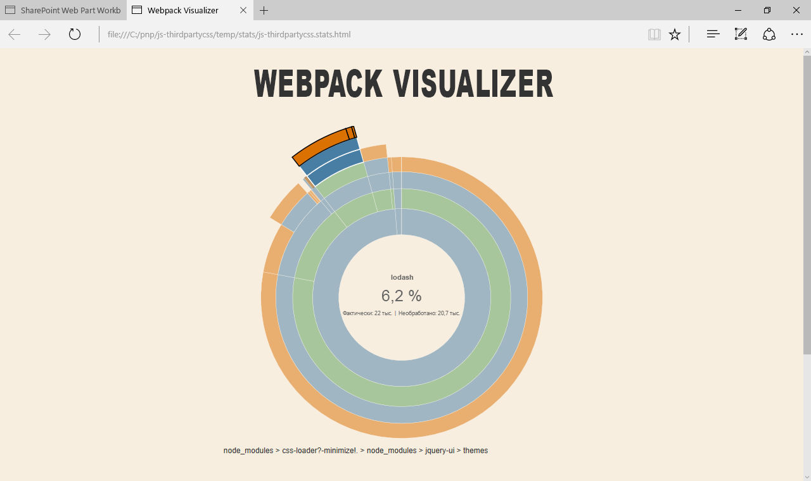

# <a name="reference-third-party-css-styles-in-sharepoint-framework-web-parts"></a>Ссылки на сторонние стили CSS в веб-частях SharePoint Framework

Существует множество сторонних библиотек, которые можно использовать для создания полнофункциональных клиентских веб-частей SharePoint Framework. Кроме сценариев, эти библиотеки часто содержат дополнительные ресурсы, такие как таблицы стилей. Эта статья показывает два разных подхода, позволяющих включить сторонние стили CSS в веб-части, а также описывает, как каждый из них влияет на создание пакета веб-частей. Веб-часть, которая приведена в этой статье для примера, использует библиотеки jQuery и jQuery UI для отображения элемента Accordion.


> **Примечание.** Прежде чем выполнять действия, описанные в этой статье, [настройте среду разработки клиентских веб-частей для SharePoint](../../set-up-your-development-environment.md).

## <a name="prepare-the-project"></a>Подготовка проекта

### <a name="create-a-new-project"></a>Создание проекта

Для начала создайте папку проекта.

```sh
md js-thirdpartycss
```

Перейдите в папку проекта.

```sh
cd js-thirdpartycss
```

В папке проекта запустите генератор Yeoman для SharePoint Framework, чтобы сформировать шаблон проекта на платформе SharePoint Framework.

```sh
yo @microsoft/sharepoint
```

Когда отобразится соответствующий запрос, введите следующие значения:

- **js-thirdpartycss** в качестве имени решения;
- **Use the current folder** (Использовать текущую папку) в качестве расположения файлов;
- **no javaScript web framework** (Без платформы веб-приложений JavaScript) в качестве отправной точки для создания веб-части;
- **jQuery accordion** (Элемент Accordion jQuery) в качестве имени веб-части;
- **Shows jQuery accordion** (Отображает элемент Accordion jQuery) в качестве описания веб-части.


После завершения скаффолдинга заблокируйте версию зависимостей проекта, выполнив следующую команду:

```sh
npm shrinkwrap
```

Далее откройте папку проекта в редакторе кода. В этой статье в инструкциях и на снимках экрана указан Visual Studio Code, но вы можете использовать любой редактор.


### <a name="add-test-content"></a>Добавление содержимого теста

В редакторе кода откройте файл **./src/webparts/jQueryAccordion/JQueryAccordionWebPart.ts**. Замените код метода **render** следующим:

```ts
export default class JQueryAccordionWebPart extends BaseClientSideWebPart<IJQueryAccordionWebPartProps> {
  // ...
  public render(): void {
    this.domElement.innerHTML = `
      <div>
        <div class="accordion">
          <h3>Information</h3>
          <div>
            <p>
            The Volcanoes, crags, and caves park is a scenic destination for
            many visitors each year. To ensure everyone has a good
            experience and to preserve the natural beauty, access is
            restricted based on a permit system.
            </p>
            <p>
            Activities include viewing active volcanoes, skiing on mountains,
            walking across lava fields, and caving (spelunking) in caves
            left behind by the lava.
            </p>
          </div>
          <h3>Snow permit</h3>
          <div>
            <p>
            The Northern region has snow in the mountains during winter.
            Purchase a snow permit for access to approved ski areas.
            </p>
          </div>
          <h3>Hiking permit</h3>
          <div>
            <p>
            The entire region has hiking trails for your enjoyment.
            Purchase a hiking permit for access to approved trails.
            </p>
          </div>
          <h3>Volcano access</h3>
          <div>
            <p>
            The volcanic region is beautiful but also dangerous. Each
            area may have restrictions based on wind and volcanic
            conditions. There are three type of permits based on activity.
            </p>
            <ul>
              <li>Volcano drive car pass</li>
              <li>Lava field access permit</li>
              <li>Caving permit</li>
            </ul>
          </div>
        </div>
      </div>`;

      ($('.accordion', this.domElement) as any).accordion();
  }
  // ...
}
```

Если вы создадите проект сейчас, то отобразится сообщение об ошибке, уведомляющее о том, что параметр **$** не определен. Причина кроется в том, что проект обращается к библиотеке jQuery, не загрузив ее. Загрузить библиотеку можно двумя способами. Какой бы вы ни выбрали, это не отобразится на использовании скриптов в коде.

## <a name="approach-1-include-third-party-libraries-in-the-bundle"></a>Способ 1. Включение в пакет веб-частей сторонних библиотек

Самый простой способ ссылаться на стороннюю библиотеку в проектах SharePoint Framework — включить ее в созданный пакет веб-частей. Библиотека устанавливается как пакет, ссылки на нее добавляются в проект. Когда проект будет упаковываться, Webpack соберет ссылки на библиотеку и включит их в созданный пакет веб-частей.

### <a name="install-libraries"></a>Установка библиотек

Установите библиотеки jQuery и jQuery UI, выполнив указанную ниже команду.

```sh
npm install jquery jquery-ui --save
```

Так как вы создаете веб-часть, используя TypeScript, вам понадобятся определения типов TypeScript для библиотеки jQuery. Их можно установить, выполнив указанную ниже команду.

```sh
npm install @types/jquery --save
```

### <a name="reference-libraries-in-the-web-part"></a>Добавление ссылок на библиотеки в веб-частях

Когда вы установите библиотеки, нужно будет добавить на них ссылки в проект. В редакторе кода откройте файл **./src/webparts/jQueryAccordion/JQueryAccordionWebPart.ts**. В верхней его части, сразу после последнего оператора **import**, добавьте ссылки на jQuery и jQuery UI.

```ts
import * as $ from 'jquery';
require('../../../node_modules/jquery-ui/ui/widgets/accordion');
```

Так как вы установили определения типов TypeScript для пакета jQuery, вы можете добавить ссылки на него с помощью оператора **import**. Пакет jQuery UI создается иначе. Сколько бы модулей ни структурировалось, не существует основной точки входа со ссылкой на все компоненты, которые вы можете использовать. Необходимо добавлять ссылку на каждый конкретный компонент, который требуется. Точка входа этого компонента содержит все ссылки на зависимости, необходимые для его правильной работы.

Подтвердите сборку проекта, выполнив следующую команду:

```sh
gulp serve
```

Когда вы добавите веб-часть на холст, элемент Accordion должен заработать.


Вы пока добавили ссылки только на скрипты jQuery UI, поэтому элемент Accordion отображается без стилей. Далее следует добавить недостающие таблицы стилей CSS, чтобы оформить этот элемент должным образом.

### <a name="reference-third-party-css-stylesheets-in-the-web-part"></a>Добавление ссылок на сторонние таблицы стилей CSS в веб-части

Ссылки на сторонние таблицы стилей CSS, представляющие собой часть установленных в проекте пакетов, можно добавить так же легко, как и ссылки на сами пакеты. SharePoint Framework обеспечивает стандартную поддержку загрузки CSS-файлов с помощью Webpack.

В редакторе кода откройте файл **./src/webparts/jQueryAccordion/JQueryAccordionWebPart.ts**. Сразу под последним оператором **require** добавьте ссылки на CSS-файлы Accordion jQuery UI.

```ts
require('../../../node_modules/jquery-ui/themes/base/core.css');
require('../../../node_modules/jquery-ui/themes/base/accordion.css');
require('../../../node_modules/jquery-ui/themes/base/theme.css');
```

Добавить ссылки на CSS-файлы, которые представляют собой часть пакета в проекте, можно так же, как и ссылки на файлы JavaScript. Все, что нужно сделать, — указать относительный путь к CSS-файлу, который необходимо загрузить, включая расширение **CSS**. Когда вы будете упаковывать проект, Webpack обработает эти ссылки и включит файлы в созданный пакет веб-частей.

Подтвердите сборку проекта, выполнив следующую команду:

```sh
gulp serve
```

Элемент Accordion должен будет правильно отображаться, к нему будет применена стандартная тема jQuery UI.


### <a name="analyze-the-contents-of-the-generated-web-part-bundle"></a>Анализ содержимого пакета веб-частей, который уже создан

Самый простой способ использовать сторонние библиотеки и их ресурсы — включить их в созданный пакет веб-частей. В этом случае Webpack автоматически урегулирует все зависимости между разными библиотеками и обеспечит загрузку скриптов в правильном порядке. Недостаток такого подхода: ресурсы, на которые добавляются ссылки, загружаются отдельно для каждой веб-части. Если у вас несколько веб-частей в проекте, каждая из которых использует jQuery UI, все они загрузят собственную копию jQuery UI, что замедлит обработку страницы.

Чтобы посмотреть, как добавление библиотек повлияло на размер созданного пакета веб-части, после упаковки проекта откройте файл **./dist/js-thirdpartycss.stats.html** в веб-браузере. Наведите указатель мыши на диаграмму, и вы увидите, например, что размер CSS-файлов пользовательского интерфейса jQuery, на которые ссылается веб-часть, составляет более 6 % от размера всего пакета веб-части.



Как указано под диаграммой, показаны приблизительные значения, дающие представление о размере отладочной версии пакета веб-частей. Версия пакета веб-частей, предназначенная для выпуска, будет значительно меньше. И все же не помешает знать, каковы составляющие пакета веб-частей и каков размер каждой из них по сравнению с другими элементами этого пакета.

## <a name="approach-2-load-third-party-libraries-from-a-url"></a>Способ 2. Загрузка сторонних библиотек по URL-ссылке

Еще один способ ссылаться на сторонние библиотеки в SharePoint Framework — использовать для этого URL-ссылки (например, ссылки на CDN или локально управляемое расположение). Основное преимущество этого подхода заключается в том, что если вы загружаете часто используемую библиотеку из общедоступного расположения, существует вероятность, что пользователь уже скачал ее на свой компьютер. В этом случае SharePoint Framework повторно использует кэшированную библиотеку, что ускорит загрузку вашей веб-части.

Даже если вы не можете использовать общедоступную сеть CDN для централизованной загрузки библиотек, такой способ хорош для увеличения производительности. Указание URL-ссылки позволяет пользователям применять скрипт на всем портале, скачав его всего лишь раз, что значительно ускоряет загрузку страниц и улучшает впечатления от использования.

Выбирая загрузку сторонних библиотек по общедоступным URL-ссылкам, помните, что использование этих библиотек связано с некоторым риском. Так как вы не управляете расположением, в котором размещен определенный скрипт, вы не можете быть уверены в содержимом. Скрипты, загруженные SharePoint Framework, выполняются в контексте текущего пользователя и могут делать все, что разрешено пользователю. Кроме того, если у ресурса, на котором размещены скрипты, не будет доступа к Интернету, веб-часть не будет работать.

### <a name="install-typings-for-libraries"></a>Установка определений типов для библиотек

Когда веб-часть ссылается на сторонние библиотеки с использованием URL-ссылки, вам не нужно их устанавливать как пакеты в проекте. Необходимо установить соответствующие определения типов TypeScript, чтобы при разработке выполнять проверки безопасности типов.

Если вы начали с пустого проекта, созданного согласно инструкциям, приведенным ранее в этой статье, установите определения типов TypeScript для jQuery, выполнив следующую команду:

```sh
npm install @types/jquery --save
```

### <a name="specify-urls-of-libraries"></a>Указание URL-ссылок для библиотек

Чтобы загрузить сторонние библиотеки по URL-ссылкам, необходимо указать URL-ссылки в конфигурации вашего проекта. В редакторе кода откройте файл **./config/config.json**. В разделе **externals** добавьте следующий код JSON:

```json
{
  //...
  "externals": {
    //...
    "jquery": "https://code.jquery.com/jquery-3.1.1.min.js",
    "jquery-ui": "https://code.jquery.com/ui/1.12.1/jquery-ui.min.js"
    //...
  }
  //...
}
```

### <a name="reference-libraries-from-the-url-in-the-web-part"></a>Обращение веб-частей к библиотекам с помощью URL-ссылок

Определив URL-ссылку, которую SharePoint Framework следует использовать для загрузки jQuery и jQuery UI, следует добавить в проект ссылки на эти библиотеки. В редакторе кода откройте файл **./src/webparts/jQueryAccordion/JQueryAccordionWebPart.ts**. В верхней его части, сразу после последнего оператора **import**, добавьте указанные ниже ссылки на jQuery и jQuery UI.

```ts
import * as $ from 'jquery';
require('jquery-ui');
```

Обращение к обеим библиотекам с помощью URL-ссылок похоже на добавление ссылок на эти библиотеки при их установке как пакетов в проекте. Так как у библиотеки jQuery есть установленные определения типов TypeScript, на нее можно ссылаться с помощью оператора **import**. В случае jQuery UI нужно только загрузить скрипт на страницу.

Так как вы зарегистрировали **jquery** и **jquery-ui** в конфигурации проекта как внешние ресурсы, когда вы будете добавлять ссылку на любую из этих библиотек, SharePoint Framework с помощью указанных URL-ссылок загрузит их в среде выполнения. Когда вы будете упаковывать проект, эти ресурсы будут отмечены как внешние и, как следствие, исключены из пакета веб-частей.

Единственное отличие заключается в том, что ранее вы указывали загрузку элемента Accordion из пакета jQuery UI, а сейчас ссылаетесь на jQuery UI из сети CDN, содержащей все компоненты jQuery UI.

Подтвердите сборку проекта, выполнив указанную ниже команду.

```sh
gulp serve
```

Когда вы добавите веб-часть на холст, элемент Accordion должен заработать.


В веб-браузере откройте средства разработчика, перейдите на вкладку с запросами сети и повторно загрузите страницу. Библиотеки jQuery и jQuery UI должны загрузиться из CDN.


Вы пока добавили ссылки только на скрипты jQuery UI, поэтому элемент Accordion отображается без стилей. Далее следует добавить недостающие таблицы стилей CSS, чтобы оформить этот элемент должным образом.

### <a name="reference-third-party-css-stylesheets-from-url-in-the-web-part"></a>Добавление в веб-часть ссылок на сторонние таблицы стилей CSS с помощью URL-ссылок

Добавление ссылок на сторонние таблицы стилей CSS с помощью URL-ссылок отличается от добавления ссылок на ресурсы из пакетов проектов. Конфигурация проекта в файле **config.json** позволяет указывать внешние ресурсы только для сценариев. Чтобы добавить ссылки на таблицы стилей CSS с помощью URL-ссылки, нужно использовать **SPComponentLoader**.

#### <a name="load-css-from-the-url-using-the-spcomponentloader"></a>Загрузка CSS-файла с помощью URL-ссылки и SPComponentLoader

В редакторе кода откройте файл **./src/webparts/jQueryAccordion/JQueryAccordionWebPart.ts**. В верхней части файла, сразу после оператора **import**, добавьте следующий код:

```ts
import { SPComponentLoader } from '@microsoft/sp-loader';
```

В том же файле переопределите метод onInit () так, как представлено ниже.

```ts
export default class JQueryAccordionWebPart extends BaseClientSideWebPart<IJQueryAccordionWebPartProps> {
  protected onInit(): Promise<void> {
    SPComponentLoader.loadCss('https://code.jquery.com/ui/1.12.1/themes/base/jquery-ui.min.css');
    return super.onInit();
  }

  // ...
}
```

Когда на странице создан экземпляр веб-части, она загрузит CSS-файл jQuery с помощью указанной URL-ссылки. Эта таблица стилей CSS — объединенная и оптимизированная версия CSS jQuery UI, содержащая базовые стили, тему и оформление для всех компонентов.

Подтвердите сборку проекта, выполнив следующую команду:

```sh
gulp serve
```

Элемент Accordion должен будет правильно отображаться, к нему будет применена стандартная тема jQuery UI.


### <a name="analyze-the-contents-of-the-generated-web-part-bundle-loading-resources-from-url"></a>Анализ содержимого созданного пакета веб-части, который загружает ресурсы с URL-адреса

Создав проект в веб-браузере, откройте файл **./temp/stats/js-thirdpartycss.stats.html**. Обратите внимание, что общий размер пакета веб-части значительно уменьшился (сейчас он составляет 7 КБ, а когда в него включались библиотека jQuery и ее пользовательский интерфейс, он превышал 300 КБ), а также что библиотека jQuery и ее пользовательский интерфейс не указаны в диаграмме, так как они были загружены в среде выполнения.
