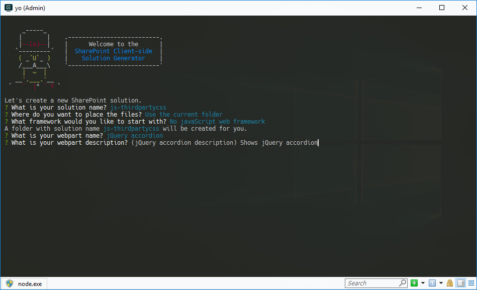
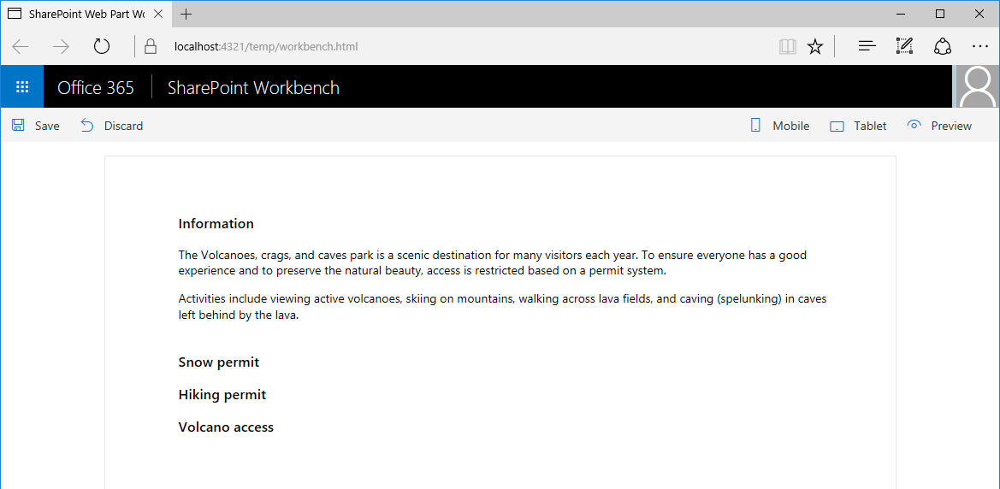

# <a name="reference-third-party-css-styles-in-sharepoint-framework-web-parts"></a><span data-ttu-id="ccaff-103">Ссылки на сторонние стили CSS в веб-частях SharePoint Framework</span><span class="sxs-lookup"><span data-stu-id="ccaff-103">Reference third-party CSS styles in SharePoint Framework web parts</span></span>

<span data-ttu-id="ccaff-104">Для создания полнофункциональных клиентских веб-частей SharePoint Framework можно использовать множество сторонних библиотек.</span><span class="sxs-lookup"><span data-stu-id="ccaff-104">To build rich SharePoint Framework client-side web parts, you can leverage many third-party libraries.</span></span> <span data-ttu-id="ccaff-105">Кроме сценариев, эти библиотеки часто содержат дополнительные ресурсы, такие как таблицы стилей.</span><span class="sxs-lookup"><span data-stu-id="ccaff-105">In addition to scripts, these libraries often contain additional assets such as stylesheets.</span></span> <span data-ttu-id="ccaff-106">В этой статье описаны два подхода, позволяющих включить сторонние стили CSS в веб-части, а также показано влияние каждого из них на создание пакета веб-частей.</span><span class="sxs-lookup"><span data-stu-id="ccaff-106">This article describes two approaches to including third-party CSS styles in web parts, and how each approach affects the resulting web part bundle.</span></span> <span data-ttu-id="ccaff-107">Веб-часть, которая приведена в этой статье для примера, использует библиотеки jQuery и jQuery UI для отображения элемента Accordion.</span><span class="sxs-lookup"><span data-stu-id="ccaff-107">The example web part discussed in this article uses jQuery and jQuery UI to display an accordion.</span></span>


> [!NOTE] 
> <span data-ttu-id="ccaff-109">Прежде чем выполнять действия, описанные в этой статье, [настройте среду разработки для создания клиентских веб-частей SharePoint](../../set-up-your-development-environment.md).</span><span class="sxs-lookup"><span data-stu-id="ccaff-109">Before following the steps in this article, be sure to [set up your SharePoint client-side web part development environment](../../set-up-your-development-environment.md).</span></span>

## <a name="prepare-the-project"></a><span data-ttu-id="ccaff-110">Подготовка проекта</span><span class="sxs-lookup"><span data-stu-id="ccaff-110">Prepare the project</span></span>

### <a name="create-a-new-project"></a><span data-ttu-id="ccaff-111">Создание проекта</span><span class="sxs-lookup"><span data-stu-id="ccaff-111">Create a new project</span></span>

1. <span data-ttu-id="ccaff-112">Создайте папку для проекта.</span><span class="sxs-lookup"><span data-stu-id="ccaff-112">Create a new folder for your project:</span></span>

  ```sh
  md js-thirdpartycss
  ```

2. <span data-ttu-id="ccaff-113">Перейдите в папку проекта.</span><span class="sxs-lookup"><span data-stu-id="ccaff-113">Go to the project folder.</span></span>

  ```sh
  cd js-thirdpartycss
  ```

3. <span data-ttu-id="ccaff-114">В папке проекта запустите генератор Yeoman для SharePoint Framework, чтобы сформировать шаблон проекта на платформе SharePoint Framework.</span><span class="sxs-lookup"><span data-stu-id="ccaff-114">In the project folder, run the SharePoint Framework Yeoman generator to scaffold a new SharePoint Framework project.</span></span>

  ```sh
  yo @microsoft/sharepoint
  ```

4. <span data-ttu-id="ccaff-115">Когда появится соответствующий запрос, укажите следующие значения:</span><span class="sxs-lookup"><span data-stu-id="ccaff-115">When prompted, enter the following values:</span></span>

  - <span data-ttu-id="ccaff-116">**js-thirdpartycss** в качестве имени решения;</span><span class="sxs-lookup"><span data-stu-id="ccaff-116">**js-thirdpartycss** as your solution name</span></span>
  - <span data-ttu-id="ccaff-117">**Use the current folder** (Использовать текущую папку) в качестве расположения файлов;</span><span class="sxs-lookup"><span data-stu-id="ccaff-117">**Use the current folder** for the location to place the files</span></span>
  - <span data-ttu-id="ccaff-118">**no javaScript web framework** (Без платформы веб-приложений JavaScript) в качестве отправной точки для создания веб-части;</span><span class="sxs-lookup"><span data-stu-id="ccaff-118">**no javaScript web framework** as the starting point to build the web part</span></span>
  - <span data-ttu-id="ccaff-119">**jQuery accordion** (Элемент Accordion jQuery) в качестве имени веб-части;</span><span class="sxs-lookup"><span data-stu-id="ccaff-119">**jQuery accordion** as your web part name</span></span>
  - <span data-ttu-id="ccaff-120">**Shows jQuery accordion** (Отображает элемент Accordion jQuery) в качестве описания веб-части.</span><span class="sxs-lookup"><span data-stu-id="ccaff-120">**Shows jQuery accordion** as your web part description</span></span>

  

5. <span data-ttu-id="ccaff-122">После завершения скаффолдинга заблокируйте версию зависимостей проекта, выполнив следующую команду:</span><span class="sxs-lookup"><span data-stu-id="ccaff-122">After the scaffolding completes, lock down the version of the project dependencies by running the following command:</span></span>

  ```sh
  npm shrinkwrap
  ```

6. <span data-ttu-id="ccaff-123">Откройте папку проекта в редакторе кода.</span><span class="sxs-lookup"><span data-stu-id="ccaff-123">Open your project folder in your code editor.</span></span> <span data-ttu-id="ccaff-124">В этой статье в инструкциях и на снимках экрана используется Visual Studio Code, но вы можете использовать любой другой редактор.</span><span class="sxs-lookup"><span data-stu-id="ccaff-124">This article uses Visual Studio Code in the steps and screenshots, but you can use any editor that you prefer.</span></span>

  

  <br/>

### <a name="add-test-content"></a><span data-ttu-id="ccaff-126">Добавление содержимого теста</span><span class="sxs-lookup"><span data-stu-id="ccaff-126">Add test content</span></span>

<span data-ttu-id="ccaff-127">В редакторе кода откройте файл **./src/webparts/jQueryAccordion/JQueryAccordionWebPart.ts**, а затем замените код метода **render** следующим:</span><span class="sxs-lookup"><span data-stu-id="ccaff-127">In the code editor, open the **./src/webparts/itRequests/ItRequestsWebPart.ts** file and change the **render** method to:</span></span>

```typescript
export default class JQueryAccordionWebPart extends BaseClientSideWebPart<IJQueryAccordionWebPartProps> {
  // ...
  public render(): void {
    this.domElement.innerHTML = `
      <div>
        <div class="accordion">
          <h3>Information</h3>
          <div>
            <p>
            The Volcanoes, crags, and caves park is a scenic destination for
            many visitors each year. To ensure everyone has a good
            experience and to preserve the natural beauty, access is
            restricted based on a permit system.
            </p>
            <p>
            Activities include viewing active volcanoes, skiing on mountains,
            walking across lava fields, and caving (spelunking) in caves
            left behind by the lava.
            </p>
          </div>
          <h3>Snow permit</h3>
          <div>
            <p>
            The Northern region has snow in the mountains during winter.
            Purchase a snow permit for access to approved ski areas.
            </p>
          </div>
          <h3>Hiking permit</h3>
          <div>
            <p>
            The entire region has hiking trails for your enjoyment.
            Purchase a hiking permit for access to approved trails.
            </p>
          </div>
          <h3>Volcano access</h3>
          <div>
            <p>
            The volcanic region is beautiful but also dangerous. Each
            area may have restrictions based on wind and volcanic
            conditions. There are three type of permits based on activity.
            </p>
            <ul>
              <li>Volcano drive car pass</li>
              <li>Lava field access permit</li>
              <li>Caving permit</li>
            </ul>
          </div>
        </div>
      </div>`;

      ($('.accordion', this.domElement) as any).accordion();
  }
  // ...
}
```

<br/>

<span data-ttu-id="ccaff-p103">Если вы создадите проект сейчас, то отобразится сообщение об ошибке, уведомляющее о том, что параметр **$** не определен. Причина кроется в том, что проект обращается к библиотеке jQuery, не загрузив ее. Загрузить библиотеку можно двумя способами. Какой бы вы ни выбрали, это не отобразится на использовании скриптов в коде.</span><span class="sxs-lookup"><span data-stu-id="ccaff-p103">If you build the project now, you get an error stating that **$** is undefined. This is because the project refers to jQuery without loading it first. There are two approaches to loading the libraries. Neither approach impacts how you use the scripts in code.</span></span>

## <a name="approach-1-include-third-party-libraries-in-the-bundle"></a><span data-ttu-id="ccaff-132">Способ 1. Включение в пакет веб-частей сторонних библиотек</span><span class="sxs-lookup"><span data-stu-id="ccaff-132">Approach 1: Include third-party libraries in the bundle</span></span>

<span data-ttu-id="ccaff-133">Самый простой способ ссылаться на стороннюю библиотеку в проектах SharePoint Framework — включить ее в созданный пакет веб-частей.</span><span class="sxs-lookup"><span data-stu-id="ccaff-133">The easiest way to reference a third-party library in SharePoint Framework projects is to include it in the generated bundle.</span></span> <span data-ttu-id="ccaff-134">Библиотека устанавливается как пакет, ссылки на нее добавляются в проект.</span><span class="sxs-lookup"><span data-stu-id="ccaff-134">The library is installed as a package and referenced in the project.</span></span> <span data-ttu-id="ccaff-135">При упаковке проекта Webpack соберет ссылки на библиотеку и включит их в созданный пакет веб-частей.</span><span class="sxs-lookup"><span data-stu-id="ccaff-135">When bundling the project, Webpack picks up the reference to the library and includes it in the generated bundle.</span></span>

### <a name="install-libraries"></a><span data-ttu-id="ccaff-136">Установка библиотек</span><span class="sxs-lookup"><span data-stu-id="ccaff-136">Install libraries</span></span>

1. <span data-ttu-id="ccaff-137">Установите библиотеки jQuery и jQuery UI, выполнив указанную ниже команду.</span><span class="sxs-lookup"><span data-stu-id="ccaff-137">Install jQuery and jQuery UI by running the following command:</span></span>

  ```sh
  npm install jquery jquery-ui --save
  ```

2. <span data-ttu-id="ccaff-138">Так как вы создаете веб-часть, используя TypeScript, вам понадобятся определения типов TypeScript для библиотеки jQuery. Их можно установить, выполнив следующую команду:</span><span class="sxs-lookup"><span data-stu-id="ccaff-138">Because you are building your web part in TypeScript you also need TypeScript typings for jQuery that you can install by running the following command:</span></span>

  ```sh
  npm install @types/jquery --save
  ```

### <a name="reference-libraries-in-the-web-part"></a><span data-ttu-id="ccaff-139">Добавление ссылок на библиотеки в веб-частях</span><span class="sxs-lookup"><span data-stu-id="ccaff-139">Reference libraries in the web part</span></span>

<span data-ttu-id="ccaff-140">Когда вы установите библиотеки, нужно будет добавить на них ссылки в проект.</span><span class="sxs-lookup"><span data-stu-id="ccaff-140">After installing libraries, the next step is to reference them in the project.</span></span> 

1. <span data-ttu-id="ccaff-141">В редакторе кода откройте файл **./src/webparts/jQueryAccordion/JQueryAccordionWebPart.ts**.</span><span class="sxs-lookup"><span data-stu-id="ccaff-141">In the code editor open the **./src/webparts/jQueryAccordion/JQueryAccordionWebPart.ts** file. Change the render method to:</span></span> <span data-ttu-id="ccaff-142">В верхней его части, сразу после последнего оператора **import**, добавьте ссылки на jQuery и jQuery UI.</span><span class="sxs-lookup"><span data-stu-id="ccaff-142">In its top section, just under the last **import** statement, add references to jQuery and jQuery UI.</span></span>

  ```typescript
  import * as $ from 'jquery';
  require('../../../node_modules/jquery-ui/ui/widgets/accordion');
  ```

  <span data-ttu-id="ccaff-143">Так как вы установили определения типов TypeScript для пакета jQuery, вы можете добавить ссылки на него с помощью оператора **import**.</span><span class="sxs-lookup"><span data-stu-id="ccaff-143">Because you installed the TypeScript typings for the jQuery package, you can reference it by using an **import** statement.</span></span> <span data-ttu-id="ccaff-144">Пакет jQuery UI создается иначе.</span><span class="sxs-lookup"><span data-stu-id="ccaff-144">However, the jQuery UI package is built differently.</span></span> <span data-ttu-id="ccaff-145">Сколько бы модулей ни структурировалось, не существует основной точки входа со ссылкой на все компоненты, которые вы можете использовать.</span><span class="sxs-lookup"><span data-stu-id="ccaff-145">Unlike how many modules are structured, there is no main entry point with a reference to all components that you can use.</span></span> <span data-ttu-id="ccaff-146">Необходимо добавлять ссылку на каждый конкретный компонент, который требуется.</span><span class="sxs-lookup"><span data-stu-id="ccaff-146">Instead, you refer directly to the specific component that you want to use.</span></span> <span data-ttu-id="ccaff-147">Точка входа этого компонента содержит все ссылки на зависимости, необходимые для его правильной работы.</span><span class="sxs-lookup"><span data-stu-id="ccaff-147">The entry point of that component contains all references to dependencies that it needs to work correctly.</span></span>

2. <span data-ttu-id="ccaff-148">Подтвердите сборку проекта, выполнив следующую команду:</span><span class="sxs-lookup"><span data-stu-id="ccaff-148">Confirm that the project is building by running the following command:</span></span>

  ```sh
  gulp serve
  ```

3. <span data-ttu-id="ccaff-149">Когда вы добавите веб-часть на холст, элемент Accordion должен заработать.</span><span class="sxs-lookup"><span data-stu-id="ccaff-149">After adding the web part to the canvas you should see the accordion working.</span></span>

  

<span data-ttu-id="ccaff-151">Вы пока добавили ссылки только на скрипты jQuery UI, поэтому элемент Accordion отображается без стилей.</span><span class="sxs-lookup"><span data-stu-id="ccaff-151">At this point you have referenced only the jQuery UI scripts which explains why the accordion is not styled. Next you will add the missing CSS stylesheets to brand the accordion.</span></span> <span data-ttu-id="ccaff-152">Далее нужно добавить недостающие таблицы стилей CSS, чтобы оформить этот элемент должным образом.</span><span class="sxs-lookup"><span data-stu-id="ccaff-152">Next, you add the missing CSS stylesheets to brand the accordion.</span></span>

### <a name="reference-third-party-css-stylesheets-in-the-web-part"></a><span data-ttu-id="ccaff-153">Добавление ссылок на сторонние таблицы стилей CSS в веб-части</span><span class="sxs-lookup"><span data-stu-id="ccaff-153">Reference third-party CSS stylesheets in the web part</span></span>

<span data-ttu-id="ccaff-154">Ссылки на сторонние таблицы стилей CSS, представляющие собой часть установленных в проекте пакетов, можно добавить так же легко, как и ссылки на сами пакеты.</span><span class="sxs-lookup"><span data-stu-id="ccaff-154">Adding references to third-party CSS stylesheets that are a part of packages installed in the project is as simple as adding references to the packages themselves. The SharePoint Framework offers standard support for loading CSS files through Webpack.</span></span> <span data-ttu-id="ccaff-155">SharePoint Framework обеспечивает стандартную поддержку загрузки CSS-файлов с помощью Webpack.</span><span class="sxs-lookup"><span data-stu-id="ccaff-155">The SharePoint Framework offers standard support for loading CSS files through Webpack.</span></span>

1. <span data-ttu-id="ccaff-156">В редакторе кода откройте файл **./src/webparts/jQueryAccordion/JQueryAccordionWebPart.ts**.</span><span class="sxs-lookup"><span data-stu-id="ccaff-156">In the code editor open the **./src/webparts/jQueryAccordion/JQueryAccordionWebPart.ts** file. Change the render method to:</span></span> <span data-ttu-id="ccaff-157">Сразу под последним оператором **require** добавьте ссылки на CSS-файлы Accordion jQuery UI.</span><span class="sxs-lookup"><span data-stu-id="ccaff-157">In the code editor open the ./src/webparts/jQueryAccordion/JQueryAccordionWebPart.ts file. Just below the last **require** statement, add references to jQuery UI accordion CSS files.</span></span>

  ```typescript
  require('../../../node_modules/jquery-ui/themes/base/core.css');
  require('../../../node_modules/jquery-ui/themes/base/accordion.css');
  require('../../../node_modules/jquery-ui/themes/base/theme.css');
  ```

  <span data-ttu-id="ccaff-158">Добавить ссылки на CSS-файлы, которые представляют собой часть пакета в проекте, можно так же, как и ссылки на файлы JavaScript.</span><span class="sxs-lookup"><span data-stu-id="ccaff-158">Referencing CSS files that are part of a package in the project is similar to adding references to JavaScript files.</span></span> <span data-ttu-id="ccaff-159">Все, что нужно сделать, — указать относительный путь к CSS-файлу, который необходимо загрузить, включая расширение **CSS**.</span><span class="sxs-lookup"><span data-stu-id="ccaff-159">All you need to do is specify the relative path to the CSS file that you want to load, including the **.css** extension.</span></span> <span data-ttu-id="ccaff-160">Когда вы будете упаковывать проект, Webpack обработает эти ссылки и включит файлы в созданный пакет веб-частей.</span><span class="sxs-lookup"><span data-stu-id="ccaff-160">When bundling the project, Webpack processes these references and includes the files in the generated web part bundle.</span></span>

2. <span data-ttu-id="ccaff-161">Подтвердите сборку проекта, выполнив следующую команду:</span><span class="sxs-lookup"><span data-stu-id="ccaff-161">Confirm that the project is building by running the following command:</span></span>

  ```sh
  gulp serve
  ```

<span data-ttu-id="ccaff-162">Элемент Accordion должен будет правильно отображаться, и к нему будет применена стандартная тема jQuery UI.</span><span class="sxs-lookup"><span data-stu-id="ccaff-162">The accordion should be displayed correctly and branded using the standard jQuery UI theme.</span></span>


### <a name="analyze-the-contents-of-the-generated-web-part-bundle"></a><span data-ttu-id="ccaff-164">Анализ содержимого пакета веб-частей, который уже создан</span><span class="sxs-lookup"><span data-stu-id="ccaff-164">Analyze the contents of the generated web part bundle</span></span>

<span data-ttu-id="ccaff-165">Самый простой способ использовать сторонние библиотеки и их ресурсы — включить их в созданный пакет веб-частей.</span><span class="sxs-lookup"><span data-stu-id="ccaff-165">The easiest way to use third-party libraries and their resources is by including them in the generated web part bundle.</span></span> <span data-ttu-id="ccaff-166">В этом случае Webpack автоматически урегулирует все зависимости между разными библиотеками и обеспечит загрузку скриптов в правильном порядке.</span><span class="sxs-lookup"><span data-stu-id="ccaff-166">In this approach Webpack automatically resolves all dependencies between the different libraries and ensures that all scripts are loaded in the correct order.</span></span> <span data-ttu-id="ccaff-167">Недостаток такого подхода: ресурсы, на которые добавляются ссылки, загружаются отдельно для каждой веб-части.</span><span class="sxs-lookup"><span data-stu-id="ccaff-167">The downside of this approach is that all referenced resources are loaded separately with every web part.</span></span> <span data-ttu-id="ccaff-168">Так, если у вас несколько веб-частей в проекте, каждая из которых использует jQuery UI, все они загружают собственную копию jQuery UI, что замедляет обработку страницы.</span><span class="sxs-lookup"><span data-stu-id="ccaff-168">So if you have multiple web parts in your project, all using jQuery UI, each web part loads its own copy of jQuery UI and slows down the page.</span></span>

<span data-ttu-id="ccaff-169">Чтобы посмотреть, как добавление библиотек повлияло на размер созданного пакета веб-части, после упаковки проекта откройте файл **./temp/stats/js-thirdpartycss.stats.html** в веб-браузере.</span><span class="sxs-lookup"><span data-stu-id="ccaff-169">To see the impact of the libraries on the size of the generated web part bundle, after bundling the project open the **./temp/stats/js-thirdpartycss.stats.html** file in the web browser. Move your mouse over the chart and you will see, for example, that the jQuery UI CSS files referenced by the web part make up over 6% of the total web part bundle size.</span></span> <span data-ttu-id="ccaff-170">Наведите указатель мыши на диаграмму. Вы увидите, например, что размер CSS-файлов пользовательского интерфейса jQuery, на которые ссылается веб-часть, составляет более 6 % от размера всего пакета веб-части.</span><span class="sxs-lookup"><span data-stu-id="ccaff-170">To see the impact of the libraries on the size of the generated web part bundle, after bundling the project open the ./temp/stats/js-thirdpartycss.stats.html file in the web browser. Move your mouse over the chart and you will see, for example, that the jQuery UI CSS files referenced by the web part make up over 6% of the total web part bundle size.</span></span>


<span data-ttu-id="ccaff-172">Как указано под диаграммой, показаны приблизительные значения, дающие представление о размере отладочной версии пакета веб-частей.</span><span class="sxs-lookup"><span data-stu-id="ccaff-172">As mentioned in the disclaimer following the chart, the sizes are indicative and reflect the size of the debug version of the bundle.</span></span> <span data-ttu-id="ccaff-173">Версия пакета веб-частей, предназначенная для выпуска, имеет значительно меньший размер.</span><span class="sxs-lookup"><span data-stu-id="ccaff-173">The release version of the bundle is significantly smaller.</span></span> <span data-ttu-id="ccaff-174">И все же не помешает знать, каковы составляющие пакета веб-частей и каков размер каждой из них по сравнению с другими элементами этого пакета.</span><span class="sxs-lookup"><span data-stu-id="ccaff-174">Still, it's good to realize which different pieces compose the web part bundle and their relative size compared to other elements in the bundle.</span></span>

## <a name="approach-2-load-third-party-libraries-from-a-url"></a><span data-ttu-id="ccaff-175">Способ 2. Загрузка сторонних библиотек по URL-ссылке</span><span class="sxs-lookup"><span data-stu-id="ccaff-175">Approach 2: Load third-party libraries from a URL</span></span>

<span data-ttu-id="ccaff-176">Еще один способ ссылаться на сторонние библиотеки в SharePoint Framework — использовать для этого URL-ссылки (например, ссылки на CDN или локально управляемое расположение).</span><span class="sxs-lookup"><span data-stu-id="ccaff-176">Another way to reference third-party libraries in the SharePoint Framework is by referencing them from a URL such as a public CDN or a privately managed location.</span></span> <span data-ttu-id="ccaff-177">Основное преимущество этого подхода заключается в том, что если вы загружаете часто используемую библиотеку из общедоступного расположения, существует вероятность, что пользователь уже скачал ее на свой компьютер.</span><span class="sxs-lookup"><span data-stu-id="ccaff-177">Another way to reference third-party libraries in the SharePoint Framework is by referencing them from a URL such as a public CDN or a privately managed location. The biggest benefit is that if you're loading a frequently used library from a public location, there is a chance that users might already have that particular library downloaded on their computer. In that case the SharePoint Framework will reuse the cached library loading your web part faster.</span></span> <span data-ttu-id="ccaff-178">В этом случае SharePoint Framework повторно использует кэшированную библиотеку, ускоряя загрузку вашей веб-части.</span><span class="sxs-lookup"><span data-stu-id="ccaff-178">In that case, the SharePoint Framework reuses the cached library, loading your web part faster.</span></span>

<span data-ttu-id="ccaff-179">Даже если вы не можете использовать общедоступную сеть CDN для централизованной загрузки библиотек, такой способ хорош для увеличения производительности.</span><span class="sxs-lookup"><span data-stu-id="ccaff-179">Even if you cannot use a public CDN to load libraries from a central location it is a good practice from the performance point of view. Pointing to a URL allows your users to download the script only once and reuse it across the whole portal, significantly speeding up loading pages and improving the user experience.</span></span> <span data-ttu-id="ccaff-180">Указание URL-ссылки позволяет пользователям применять скрипт на всем портале, скачав его всего лишь раз, что значительно ускоряет загрузку страниц и улучшает впечатления от использования.</span><span class="sxs-lookup"><span data-stu-id="ccaff-180">Even if you cannot use a public CDN to load libraries from a central location it is a good practice from the performance point of view. Pointing to a URL allows your users to download the script only once and reuse it across the whole portal, significantly speeding up loading pages and improving the user experience.</span></span>

<span data-ttu-id="ccaff-181">Выбирая загрузку сторонних библиотек по общедоступным URL-ссылкам, помните, что использование этих библиотек связано с некоторым риском.</span><span class="sxs-lookup"><span data-stu-id="ccaff-181">When loading third-party libraries from public URLs, keep in mind that there is a risk involved in using those libraries.</span></span> <span data-ttu-id="ccaff-182">Так как вы не управляете местом размещения определенного скрипта, вы не можете быть уверены в его содержимом.</span><span class="sxs-lookup"><span data-stu-id="ccaff-182">Because you don't manage the hosting location of any particular script, you can't be sure of its contents.</span></span> <span data-ttu-id="ccaff-183">Скрипты, загруженные SharePoint Framework, выполняются в контексте текущего пользователя и могут делать все, что разрешено пользователю.</span><span class="sxs-lookup"><span data-stu-id="ccaff-183">Scripts loaded by the SharePoint Framework run under the context of the current user and are allowed to do whatever that user can do.</span></span> <span data-ttu-id="ccaff-184">Кроме того, если у ресурса, на котором размещены скрипты, не будет доступа к Интернету, веб-часть не будет работать.</span><span class="sxs-lookup"><span data-stu-id="ccaff-184">Also, if the hosting location is offline, your web part won't work.</span></span>

### <a name="install-typings-for-libraries"></a><span data-ttu-id="ccaff-185">Установка определений типов для библиотек</span><span class="sxs-lookup"><span data-stu-id="ccaff-185">Install typings for libraries</span></span>

<span data-ttu-id="ccaff-p117">Когда веб-часть ссылается на сторонние библиотеки с использованием URL-ссылки, вам не нужно их устанавливать как пакеты в проекте. Необходимо установить соответствующие определения типов TypeScript, чтобы при разработке выполнять проверки безопасности типов.</span><span class="sxs-lookup"><span data-stu-id="ccaff-p117">When you reference third-party libraries from a URL, you don't need to install them as packages in your project. You do have to install their TypeScript typings if you want the benefit of type safety checks during development.</span></span>

<span data-ttu-id="ccaff-188">Если вы начали с пустого проекта, созданного согласно инструкциям, приведенным ранее в этой статье, установите определения типов TypeScript для jQuery, выполнив следующую команду:</span><span class="sxs-lookup"><span data-stu-id="ccaff-188">Assuming you start with an empty project created as described previously in this article, install TypeScript typings for jQuery by running the following command:</span></span>

```sh
npm install @types/jquery --save
```

### <a name="specify-urls-of-libraries"></a><span data-ttu-id="ccaff-189">Указание URL-ссылок для библиотек</span><span class="sxs-lookup"><span data-stu-id="ccaff-189">Specify URLs of libraries</span></span>

<span data-ttu-id="ccaff-190">Чтобы загрузить сторонние библиотеки по URL-ссылкам, необходимо указать URL-ссылки в конфигурации вашего проекта.</span><span class="sxs-lookup"><span data-stu-id="ccaff-190">To load third-party libraries from a URL, you have to specify the URL where they are located in the configuration of your project. In the code editor open the ./config/config.json file. In the externals section add the following JSON:</span></span> <span data-ttu-id="ccaff-191">В редакторе кода откройте файл **./config/config.json**.</span><span class="sxs-lookup"><span data-stu-id="ccaff-191">In the code editor, open the **./config/config.json** file, and change the externals section to:</span></span> <span data-ttu-id="ccaff-192">В разделе **externals** добавьте следующий код JSON:</span><span class="sxs-lookup"><span data-stu-id="ccaff-192">In the code editor open the ./config/config.json file. In the **externals** section add the following JSON:</span></span>

```json
{
  //...
  "externals": {
    //...
    "jquery": "https://code.jquery.com/jquery-3.1.1.min.js",
    "jquery-ui": "https://code.jquery.com/ui/1.12.1/jquery-ui.min.js"
    //...
  }
  //...
}
```

### <a name="reference-libraries-from-the-url-in-the-web-part"></a><span data-ttu-id="ccaff-193">Обращение веб-частей к библиотекам с помощью URL-ссылок</span><span class="sxs-lookup"><span data-stu-id="ccaff-193">Reference libraries from the URL in the web part</span></span>

<span data-ttu-id="ccaff-194">Определив URL-ссылку, которую SharePoint Framework следует использовать для загрузки jQuery и jQuery UI, следует добавить в проект ссылки на эти библиотеки.</span><span class="sxs-lookup"><span data-stu-id="ccaff-194">Having specified the URL that the SharePoint Framework should use to load jQuery and jQuery UI, the next step is to reference them in the project. In the code editor open the ./src/webparts/jQueryAccordion/JQueryAccordionWebPart.ts file. In its top section, just below the last import statement, add the following references to jQuery and jQuery UI:</span></span> 

1. <span data-ttu-id="ccaff-195">В редакторе кода откройте файл **./src/webparts/jQueryAccordion/JQueryAccordionWebPart.ts**.</span><span class="sxs-lookup"><span data-stu-id="ccaff-195">In the code editor open the **./src/webparts/jQueryAccordion/JQueryAccordionWebPart.ts** file. Change the render method to:</span></span> <span data-ttu-id="ccaff-196">В верхней его части, сразу под последним оператором **import**, добавьте указанные ниже ссылки на jQuery и jQuery UI.</span><span class="sxs-lookup"><span data-stu-id="ccaff-196">In its top section, just under the last **import** statement, add the following references to jQuery and jQuery UI:</span></span>

  ```typescript
  import * as $ from 'jquery';
  require('jquery-ui');
  ```

  <span data-ttu-id="ccaff-197">Обращение к обеим библиотекам с помощью URL-ссылок похоже на добавление ссылок на эти библиотеки при их установке как пакетов в проекте.</span><span class="sxs-lookup"><span data-stu-id="ccaff-197">Compared to how you were referencing both libraries when they were installed as packages in your project, referencing them from the URL is very similar. Because jQuery has its TypeScript typings installed it can be referenced using an import statement. For jQuery UI all you want is to load the script on the page.</span></span> <span data-ttu-id="ccaff-198">Так как у библиотеки jQuery есть установленные определения типов TypeScript, на нее можно ссылаться с помощью оператора **import**.</span><span class="sxs-lookup"><span data-stu-id="ccaff-198">Because jQuery has its TypeScript typings installed, it can be referenced by using an **import** statement.</span></span> <span data-ttu-id="ccaff-199">В случае jQuery UI нужно только загрузить скрипт на страницу.</span><span class="sxs-lookup"><span data-stu-id="ccaff-199">For jQuery UI all you want is to load the script on the page.</span></span>

  <span data-ttu-id="ccaff-200">Так как вы зарегистрировали **jquery** и **jquery-ui** в конфигурации проекта как внешние ресурсы, то при добавлении ссылок на любую из этих библиотек SharePoint Framework с помощью указанных URL-ссылок загрузит их в среде выполнения.</span><span class="sxs-lookup"><span data-stu-id="ccaff-200">Because you registered **jquery** and **jquery-ui** in the project configuration as external resources, when you reference any of these libraries, the SharePoint Framework will use the specified URLs to load them at runtime. When bundling the project, these resources will be marked as externals and will therefore be excluded from the bundle.</span></span> <span data-ttu-id="ccaff-201">При упаковке проекта эти ресурсы будут отмечены как внешние и, как следствие, исключены из пакета веб-частей.</span><span class="sxs-lookup"><span data-stu-id="ccaff-201">When bundling the project, these resources are marked as externals and are therefore excluded from the bundle.</span></span>

  <span data-ttu-id="ccaff-202">Единственное отличие заключается в том, что ранее вы указывали загрузку элемента Accordion из пакета jQuery UI, а сейчас ссылаетесь на jQuery UI из сети CDN, содержащей все компоненты jQuery UI.</span><span class="sxs-lookup"><span data-stu-id="ccaff-202">One difference to keep in mind is that previously you specified to load the accordion from the jQuery UI package, but now you're referring to jQuery UI from the CDN which contains all jQuery UI components.</span></span>

2. <span data-ttu-id="ccaff-203">Подтвердите сборку проекта, выполнив следующую команду:</span><span class="sxs-lookup"><span data-stu-id="ccaff-203">Confirm that the project is building by running the following command:</span></span>

  ```sh
  gulp serve
  ```

  <span data-ttu-id="ccaff-204">Когда вы добавите веб-часть на холст, элемент Accordion должен заработать.</span><span class="sxs-lookup"><span data-stu-id="ccaff-204">After adding the web part to the canvas you should see the accordion working.</span></span>

  

3. <span data-ttu-id="ccaff-p122">В веб-браузере откройте средства разработчика, перейдите на вкладку с запросами сети и повторно загрузите страницу. Библиотеки jQuery и jQuery UI должны загрузиться из CDN.</span><span class="sxs-lookup"><span data-stu-id="ccaff-p122">In your web browser, open the developer tools, switch to the tab showing the network requests, and reload the page. You should see how both jQuery and jQuery UI are loaded from the CDN.</span></span>

  

<span data-ttu-id="ccaff-209">Вы пока добавили ссылки только на скрипты jQuery UI, поэтому элемент Accordion не имеет стилевого оформления.</span><span class="sxs-lookup"><span data-stu-id="ccaff-209">At this point you have referenced only the jQuery UI scripts which explains why the accordion is not styled. Next you will add the missing CSS stylesheets to brand the accordion.</span></span> <span data-ttu-id="ccaff-210">Далее нужно добавить недостающие таблицы стилей CSS, чтобы оформить этот элемент должным образом.</span><span class="sxs-lookup"><span data-stu-id="ccaff-210">Next, you add the missing CSS stylesheets to brand the accordion.</span></span>

### <a name="reference-third-party-css-stylesheets-from-url-in-the-web-part"></a><span data-ttu-id="ccaff-211">Добавление в веб-часть ссылок на сторонние таблицы стилей CSS с помощью URL-ссылок</span><span class="sxs-lookup"><span data-stu-id="ccaff-211">Reference third-party CSS stylesheets from URL in the web part</span></span>

<span data-ttu-id="ccaff-212">Добавление ссылок на таблицы стилей CSS с помощью URL-ссылок отличается от добавления ссылок на ресурсы в пакетах проектов.</span><span class="sxs-lookup"><span data-stu-id="ccaff-212">Adding references to third-party CSS stylesheets from a URL is different from referencing resources from project packages.</span></span> <span data-ttu-id="ccaff-213">Конфигурация проекта в файле **config.json** позволяет вам указывать внешние ресурсы только в случае скриптов.</span><span class="sxs-lookup"><span data-stu-id="ccaff-213">While the project configuration in the **config.json** file allows you to specify external resources, it applies only to scripts.</span></span> <span data-ttu-id="ccaff-214">Чтобы добавить ссылки на таблицы стилей CSS с помощью URL-адреса, нужно использовать **SPComponentLoader**.</span><span class="sxs-lookup"><span data-stu-id="ccaff-214">To reference CSS stylesheets from a URL, you must use the **SPComponentLoader** instead.</span></span>

#### <a name="load-css-from-the-url-using-the-spcomponentloader"></a><span data-ttu-id="ccaff-215">Загрузка CSS-файла с помощью URL-ссылки и SPComponentLoader</span><span class="sxs-lookup"><span data-stu-id="ccaff-215">Load CSS from the URL using the SPComponentLoader</span></span>

1. <span data-ttu-id="ccaff-216">В редакторе кода откройте файл **./src/webparts/jQueryAccordion/JQueryAccordionWebPart.ts**.</span><span class="sxs-lookup"><span data-stu-id="ccaff-216">In the code editor open the **./src/webparts/jQueryAccordion/JQueryAccordionWebPart.ts** file. Change the render method to:</span></span> <span data-ttu-id="ccaff-217">В верхней части файла, сразу после оператора **import**, добавьте следующий код:</span><span class="sxs-lookup"><span data-stu-id="ccaff-217">In the code editor open the ./src/webparts/jQueryAccordion/JQueryAccordionWebPart.ts file. In the top section of the file, just after the last **import** statement, add the following code:</span></span>

  ```typescript
  import { SPComponentLoader } from '@microsoft/sp-loader';
  ```

2. <span data-ttu-id="ccaff-218">В том же файле переопределите метод onInit () так, как представлено ниже.</span><span class="sxs-lookup"><span data-stu-id="ccaff-218">In the same file override the onInit() method as follows:</span></span>

  ```typescript
  export default class JQueryAccordionWebPart extends BaseClientSideWebPart<IJQueryAccordionWebPartProps> {
    protected onInit(): Promise<void> {
      SPComponentLoader.loadCss('https://code.jquery.com/ui/1.12.1/themes/base/jquery-ui.min.css');
      return super.onInit();
    }

    // ...
  }
  ```

  <span data-ttu-id="ccaff-219">Когда на странице будет создан экземпляр веб-части, она загрузит CSS-файл jQuery UI с помощью указанной URL-ссылки.</span><span class="sxs-lookup"><span data-stu-id="ccaff-219">When the web part is instantiated on the page, it loads the jQuery UI CSS from the specified URL.</span></span> <span data-ttu-id="ccaff-220">Эта таблица стилей CSS — объединенная и оптимизированная версия CSS jQuery UI, содержащая базовые стили, тему и оформление для всех компонентов.</span><span class="sxs-lookup"><span data-stu-id="ccaff-220">When the web part is instantiated on the page, it will load the jQuery UI CSS from the specified URL. This CSS stylesheet is the combined and optimized version of the jQuery UI CSS that contains the basic styles, theme, and styling for all components.</span></span>

3. <span data-ttu-id="ccaff-221">Подтвердите сборку проекта, выполнив следующую команду:</span><span class="sxs-lookup"><span data-stu-id="ccaff-221">Confirm that the project is building by running the following command:</span></span>

  ```sh
  gulp serve
  ```

<span data-ttu-id="ccaff-222">Элемент Accordion должен отображаться правильно и использовать стандартную тему jQuery UI.</span><span class="sxs-lookup"><span data-stu-id="ccaff-222">The accordion should be displayed correctly and branded using the standard jQuery UI Theme.</span></span>


### <a name="analyze-the-contents-of-the-generated-web-part-bundle-loading-resources-from-url"></a><span data-ttu-id="ccaff-224">Анализ содержимого созданного пакета веб-части, который загружает ресурсы с URL-адреса</span><span class="sxs-lookup"><span data-stu-id="ccaff-224">Analyze the contents of the generated web part bundle loading resources from URL</span></span>

<span data-ttu-id="ccaff-225">Создав проект в веб-браузере, откройте файл **./temp/stats/js-thirdpartycss.stats.html**.</span><span class="sxs-lookup"><span data-stu-id="ccaff-225">After building the project in the web browser, open the **./temp/stats/js-thirdpartycss.stats.html** file.</span></span> 

<span data-ttu-id="ccaff-226">Обратите внимание, что общий размер пакета веб-части значительно уменьшился (сейчас он составляет 7 КБ, а когда в него включались библиотека jQuery и ее пользовательский интерфейс, он превышал 300 КБ), а также что библиотека jQuery и ее пользовательский интерфейс не указаны в диаграмме, так как они загружены в среде выполнения.</span><span class="sxs-lookup"><span data-stu-id="ccaff-226">After building the project in the web browser open the ./temp/stats/js-thirdpartycss.stats.html file. Notice how the overall bundle is significantly smaller (7KB compared to over 300KB when including jQuery and jQuery UI in the bundle) and how jQuery and jQuery UI are not listed in the chart since they are loaded at runtime.</span></span>


## <a name="see-also"></a><span data-ttu-id="ccaff-227">См. также</span><span class="sxs-lookup"><span data-stu-id="ccaff-227">See also</span></span>

- [<span data-ttu-id="ccaff-228">Обзор SharePoint Framework</span><span class="sxs-lookup"><span data-stu-id="ccaff-228">SharePoint Framework Extensions Overview</span></span>](../../sharepoint-framework-overview.md)