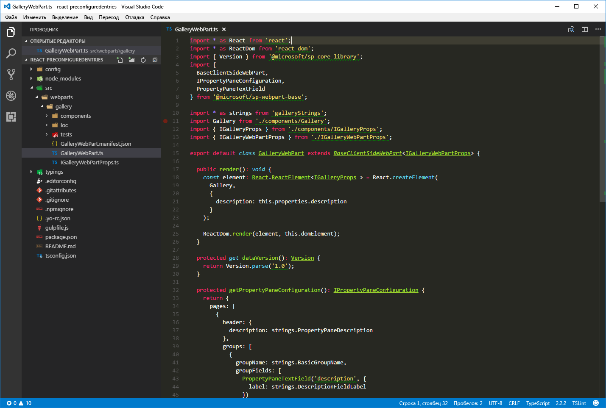
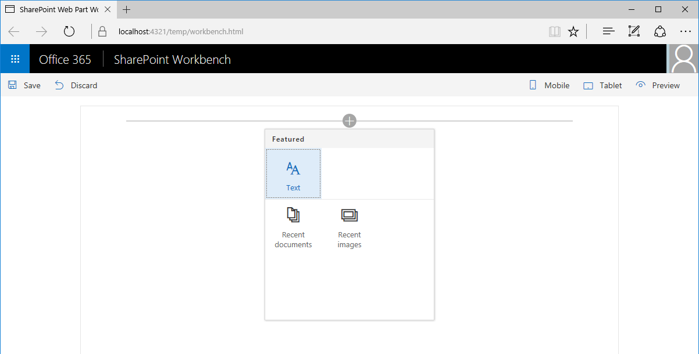
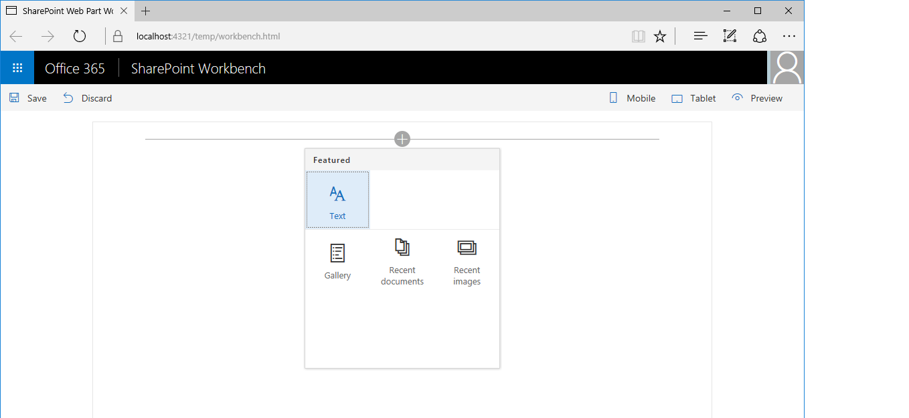

# <a name="simplify-adding-web-parts-with-preconfigured-entries"></a>Упрощенное добавление веб-частей с помощью предварительно настроенных записей

Сложные клиентские веб-части SharePoint Framework часто содержат много свойств, которые необходимо настраивать пользователю. Вы можете помочь пользователям, добавив предварительно настроенные записи свойств для определенных сценариев. Такая запись инициализирует веб-часть, используя предварительно заданные значения.

> [!NOTE] 
> Прежде чем выполнять действия, описанные в этой статье, [настройте среду разработки для создания клиентских веб-частей SharePoint](../../set-up-your-development-environment.md).

## <a name="web-part-preconfigured-entries"></a>Предварительно настроенные записи веб-части

Каждая клиентская веб-часть SharePoint Framework состоит из двух частей: 

- манифест, описывающий веб-часть;
- код веб-части.

Среди свойств, указанных в манифесте веб части, есть свойство **preconfiguredEntries**.

```json
{
  "$schema": "../../../node_modules/@microsoft/sp-module-interfaces/lib/manifestSchemas/jsonSchemas/clientSideComponentManifestSchema.json",

  "id": "6737645a-4443-4210-a70e-e5e2a219133a",
  "alias": "GalleryWebPart",
  "componentType": "WebPart",
  "version": "0.0.1",
  "manifestVersion": 2,

  "preconfiguredEntries": [{
    "groupId": "1edbd9a8-0bfb-4aa2-9afd-14b8c45dd489", // Discover
    "group": { "default": "Under Development" },
    "title": { "default": "Gallery" },
    "description": { "default": "Shows items from the selected list" },
    "officeFabricIconFontName": "Page",
    "properties": {
      "description": "Gallery"
    }
  }]
}
```

Свойство **preconfiguredEntries** предоставляет сведения о веб-части, которые используются на панели элементов. Когда пользователь добавляет веб-часть на страницу, данные из свойства **preconfiguredEntries** используются для отображения веб-части на панели элементов и определения ее параметров по умолчанию.

Если вы уже создавали классические веб-части, включающие решения с полным доверием, можете рассматривать каждую запись в массиве **preconfiguredEntries** как соответствующий **WEBPART**-файл. Как и **WEBPART**-файл, каждая запись в свойстве **preconfiguredEntries** связана с кодом веб-части и задает основные сведения о ней, например название или описание, а также значения свойств по умолчанию.

### <a name="properties-of-a-preconfiguredentries-array-item"></a>Свойства элемента массива **preconfiguredEntries**

Каждый элемент массива **preconfiguredEntries** состоит из нескольких свойств. В приведенной ниже таблице описывается назначение каждого свойства.

|Имя свойства |Тип значения |Обязательное  |Назначение  |Пример значения |
|:-------------|:----------|:--------:|:---------|:-------------|
|title         |ILocalizedString |Да |Название веб-части, которое отображается на панели элементов. |`"title": { "default": "Weather", "nl-nl": "Weerbericht" }`|
|description             |ILocalizedString|Да     |Описание веб-части, которое отображается в подсказках панели элементов.|`"description": { "default": "Shows weather in the given location", "nl-nl": "Toont weerbericht voor de opgegeven locatie" } `|
|officeFabricIconFontName|string          |Нет      |Значок веб-части, который отображается на панели элементов. Значение этого параметра должно быть одним из [имен значков Office UI Fabric](https://dev.office.com/fabric#/styles/icons). Если у этого свойства есть значение, свойство **iconImageUrl** игнорируется.|`"officeFabricIconFontName": "Sunny"`|
|iconImageUrl            |string          |Нет      |Значок веб-части, который отображается на панели элементов и представлен URL-адресом изображения. Размер изображения, находящегося по этому URL-адресу, должен составлять 40 x 28 пикселей. Если у свойства **officeFabricIconName** нет значения, необходимо его задать.|`"iconImageUrl": "https://cdn.contoso.com/weather.png"`|
|groupId                 |string          |да     |Идентификатор группы, определяющий, какая современная группа содержит веб-часть на современной странице сайта. Платформа SharePoint Framework резервирует идентификаторы для [стандартных групп](#predefined-modern-groups). Разработчик может выбрать одну из них. Если разработчик указывает идентификатор, не относящийся к стандартной группе, веб-часть возвращается в группу **Другие**.|`"groupId": "1edbd9a8-0bfb-4aa2-9afd-14b8c45dd489"`|
|group                   |ILocalizedString|нет      |Имя группы, в которой будет отображаться веб-часть на классической странице. Если значение не указано, веб-часть отображается в группе **Разное**.|`"group": { "default": "Content", "nl-nl": "Inhoud" }`|
|dataVersion             |string          |нет      |Это поле используется для указания версии предварительно настроенных данных, предоставленных веб-части. Обратите внимание, что версия данных и поле версии в манифесте — это не одно и то же. Версия манифеста используется для управления версиями кода веб-части, а версия данных — для управления версиями сериализованных данных веб-части. Дополнительные сведения см. в описании поля dataVersion для веб-части. Поддерживаемый формат значений: версия MAJOR.MINOR|`"dataVersion": "1.0"`|
|properties              |TProperties     |да     |Объект пары "ключ-значение" со значениями по умолчанию для свойств веб-части.|`"properties": { "location": "Redmond", "numberOfDays": 3, "showIcon": true }`|

<br/>

Некоторые свойства веб-части принимают значения типа **ILocalizedString**. Этот тип представляет собой объект пары "ключ-значение", с помощью которого разработчики могут указывать строки для различных языковых стандартов. Значение типа **ILocalizedString** должно содержать хотя бы значение **default**. 

При необходимости разработчик может указать перевод этого значения для разных языковых стандартов, поддерживаемых веб-частью. Если веб-часть размещена на странице для языкового стандарта, не указанного в локализованной строке, используется значение по умолчанию.

Допустимые значения **ILocalizedString**:

```json
"title": {
  "default": "Weather",
  "nl-nl": "Weerbericht"
}
```

```json
"title": {
  "default": "Weather"
}
```

<br/>

Значение **ILocalizedString**, не являющееся допустимым, так как отсутствует ключ **default**:

```json
"title": {
  "en-us": "Weather"
}
```

### <a name="predefined-modern-groups"></a>Предварительно определенные современные группы

В приведенной ниже таблице представлены 7 стандартных групп. Используйте идентификатор группы в свойстве `groupId`.

| Имя группы                      | Идентификатор                                     | Содержимое группы |   
|---------------------------------|----------------------------------------|---------------|
| Текст, мультимедиа и контент        | `cf066440-0614-43d6-98ae-0b31cf14c7c3` | Веб-части, отображающие текст, мультимедиа, документы, информацию из Интернета и другой контент. |
| Обнаружение                        | `1edbd9a8-0bfb-4aa2-9afd-14b8c45dd489` | Веб-части, которые упорядочивают, группируют и фильтруют контент, помогая пользователям находить нужные сведения.                 |
| Связь и совместная работа | `75e22ed5-fa14-4829-850a-c890608aca2d` | Веб-части, которые помогают делиться информацией, а также упрощают работу в команде и социальное взаимодействие.                     |
| Планирование и процессы            | `1bc7927e-4a5e-4520-b540-71305c79c20a` | Веб-части, которые повышают производительность команды при помощи инструментов планирования и управления процессами.                   |
| Бизнес и аналитика       | `4aca9e90-eff5-4fa1-bac7-728f5f157b66` | Веб-части для отслеживания и анализа данных, а также для интеграции бизнес-процессов со страницами.               |
| Инструменты сайта                      | `070951d7-94da-4db8-b06e-9d581f1f55b1` | Веб-части для управления сайтом и получения сведений о нем.                                                         |
| Другие                           | `5c03119e-3074-46fd-976b-c60198311f70` | Веб-части, не входящие в другие группы.                                                                         |

Если разработчик использует идентификатор, не указанный в приведенном выше списке, веб-часть возвращается в группу **Другие**.

Чтобы увидеть, как можно использовать предварительно настроенные записи при создании веб-частей, вы можете создать пример веб-части с коллекцией. С помощью нескольких свойств пользователи могут настраивать эту веб-часть так, чтобы в ней определенным образом отображались элементы из выбранного списка. Для краткости мы опустим фактическую реализацию логики веб-части и сосредоточимся на том, как предоставлять предварительно настроенные версии веб-части коллекции с помощью свойства **preconfiguredEntries**.


## <a name="create-a-new-web-part-project"></a>Создание проекта веб-части

1. Для начала создайте папку проекта.

  ```sh
  md react-preconfiguredentries
  ```

2. Перейдите в папку проекта.

  ```sh
  cd react-preconfiguredentries
  ```

3. В папке проекта запустите генератор Yeoman для SharePoint Framework, чтобы сформировать шаблон проекта на платформе SharePoint Framework.

  ```sh
  yo @microsoft/sharepoint
  ```

4. Когда появится соответствующий запрос, укажите следующие значения:

  - **react-preconfiguredentries** в качестве имени решения;
  - **Use the current folder** (Использовать текущую папку) в качестве расположения файлов;
  - **Gallery** (Коллекция) в качестве имени веб-части;
  - **Shows items from the selected list** (Показывает элементы из выбранного списка) в качестве описания веб-части;
  - **React** как отправную точку создания веб-части.

  

5. По завершении формирования шаблона заблокируйте версию зависимостей проекта, выполнив следующую команду:

  ```sh
  npm shrinkwrap
  ```

6. Откройте папку проекта в редакторе кода. В инструкциях и на снимках экрана из этой статьи используется Visual Studio Code, но вы можете использовать любой редактор.

  

## <a name="add-web-part-properties"></a>Добавление свойств веб-части

Добавьте свойства в манифесте веб-части, чтобы пользователи могли настраивать веб-часть коллекции. 

1. Откройте в редакторе кода файл **./src/webparts/gallery/GalleryWebPart.manifest.json**. 

2. Замените раздел **properties** следующим кодом JSON:

  ```json
  {
    //...
    "preconfiguredEntries": [{
      //...
      "properties": {
        "listName": "",
        "order": "",
        "numberOfItems": 10,
        "style": ""
      }
    }]
  }
  ```

  Обратите внимание на следующие особенности этого кода:
  - Свойство **listName** задает имя списка, элементы которого будут отображаться. 
  - Свойство **order** задает порядок отображения элементов: по возрастанию или убыванию времени добавления. 
  - Свойство **numberOfItems** задает количество отображаемых элементов. 
  - Свойство **style** задает способ отображения элементов, например в виде эскизов (удобно для показа изображений) или списка (лучше подходит для документов).

  Указанные в манифесте свойства веб-части также необходимо добавить в интерфейс свойств. 
  
3. Откройте в редакторе кода файл **./src/webparts/gallery/IGalleryWebPartProps.ts**. Измените его код на следующий:

  ```ts
  export interface IGalleryWebPartProps {
    listName: string;
    order: string;
    numberOfItems: number;
    style: string;
  }
  ```

  Создавая клиентские веб-части SharePoint Framework с помощью React, после того как вы измените интерфейс свойств веб-части, необходимо обновить метод **render**, который использует этот интерфейс для создания главного компонента React. 
  
4. Откройте в редакторе кода файл **./src/webparts/gallery/GalleryWebPart.ts**. Замените содержимое метода **render** следующим кодом:

  ```ts
  export default class GalleryWebPart extends BaseClientSideWebPart<IGalleryWebPartProps> {
    // ...
    public render(): void {
      const element: React.ReactElement<IGalleryProps> = React.createElement(Gallery, {
        listName: this.properties.listName,
        order: this.properties.order,
        numberOfItems: this.properties.numberOfItems,
        style: this.properties.style
      });

      ReactDom.render(element, this.domElement);
    }
    // ...
  }
  ```

5. Измените главный компонент React так, чтобы отображались значения свойств. Если веб-часть не настроена, должен отображаться стандартный заполнитель веб-части. Откройте в редакторе кода файл **./src/webparts/gallery/components/Gallery.tsx** и измените его код на следующий:

  ```ts
  import * as React from 'react';
  import styles from './Gallery.module.scss';
  import { IGalleryProps } from './IGalleryProps';

  export default class Gallery extends React.Component<IGalleryProps, void> {
    public render(): JSX.Element {
      if (this.needsConfiguration()) {
        return <div className="ms-Grid" style={{ color: "#666", backgroundColor: "#f4f4f4", padding: "80px 0", alignItems: "center", boxAlign: "center" }}>
          <div className="ms-Grid-row" style={{ color: "#333" }}>
            <div className="ms-Grid-col ms-u-hiddenSm ms-u-md3"></div>
            <div className="ms-Grid-col ms-u-sm12 ms-u-md6" style={{ height: "100%", whiteSpace: "nowrap", textAlign: "center" }}>
              <i className="ms-fontSize-su ms-Icon ms-Icon--ThumbnailView" style={{ display: "inline-block", verticalAlign: "middle", whiteSpace: "normal" }}></i><span className="ms-fontWeight-light ms-fontSize-xxl" style={{ paddingLeft: "20px", display: "inline-block", verticalAlign: "middle", whiteSpace: "normal" }}>Gallery</span>
            </div>
            <div className="ms-Grid-col ms-u-hiddenSm ms-u-md3"></div>
          </div>
          <div className="ms-Grid-row" style={{ width: "65%", verticalAlign: "middle", margin: "0 auto", textAlign: "center" }}>
            <span style={{ color: "#666", fontSize: "17px", display: "inline-block", margin: "24px 0", fontWeight: 100 }}>Show items from the selected list</span>
          </div>
          <div className="ms-Grid-row"></div>
        </div>;
      }
      else {
        return (
          <div className={styles.gallery}>
            <div className={styles.container}>
              <div className={`ms-Grid-row ms-bgColor-themeDark ms-fontColor-white ${styles.row}`}>
                <div className='ms-Grid-col ms-u-lg10 ms-u-xl8 ms-u-xlPush2 ms-u-lgPush1'>
                  <span className="ms-font-xl ms-fontColor-white">
                    Welcome to SharePoint!
                  </span>
                  <p className='ms-font-l ms-fontColor-white'>
                    Customize SharePoint experiences using Web Parts.
                  </p>
                  <p className='ms-font-l ms-fontColor-white'>
                    List: {this.props.listName}<br />
                    Order: {this.props.order}<br />
                    Number of items: {this.props.numberOfItems}<br />
                    Style: {this.props.style}
                  </p>
                  <a href="https://aka.ms/spfx" className={styles.button}>
                    <span className={styles.label}>Learn more</span>
                  </a>
                </div>
              </div>
            </div>
          </div>
        );
      }
    }

    private needsConfiguration(): boolean {
      return Gallery.isEmpty(this.props.listName) ||
        Gallery.isEmpty(this.props.order) ||
        Gallery.isEmpty(this.props.style);
    }

    private static isEmpty(value: string): boolean {
      return value === undefined ||
        value === null ||
        value.length === 0;
    }
  }
  ```

6. Обновите интерфейс основного компонента React в соответствии со свойством веб-части Interface, так как мы обходим все свойства веб-части для этого компонента. Откройте в редакторе кода файл **./src/webparts/gallery/components/IGalleryProps.ts** и измените его код на следующий:

  ```ts
  import { IGalleryWebPartProps } from '../IGalleryWebPartProps';

  export interface IGalleryProps extends IGalleryWebPartProps {
  }
  ```

## <a name="render-web-part-properties-in-the-property-pane"></a>Отображение свойств веб-части в области свойств

Чтобы пользователи могли настраивать веб-часть с помощью новых свойств, эти свойства должны отображаться в области свойств веб-части. 

1. Откройте в редакторе кода файл **./src/webparts/gallery/GalleryWebPart.ts**. В верхнем разделе файла замените оператор импорта **@microsoft/sp-webpart-base** следующим кодом:

  ```ts
  import {
    BaseClientSideWebPart,
    IPropertyPaneConfiguration,
    PropertyPaneDropdown,
    PropertyPaneSlider,
    PropertyPaneChoiceGroup
  } from '@microsoft/sp-webpart-base';
  ```

2. Замените содержимое метода **propertyPaneSettings** следующим кодом:

  ```ts
  export default class GalleryWebPart extends BaseClientSideWebPart<IGalleryWebPartProps> {
    // ...
    protected getPropertyPaneConfiguration(): IPropertyPaneConfiguration {
      return {
        pages: [
          {
            header: {
              description: strings.PropertyPaneDescription
            },
            groups: [
              {
                groupName: strings.BasicGroupName,
                groupFields: [
                  PropertyPaneDropdown('listName', {
                    label: strings.ListNameFieldLabel,
                    options: [{
                      key: 'Documents',
                      text: 'Documents'
                    },
                    {
                      key: 'Images',
                      text: 'Images'
                    }]
                  }),
                  PropertyPaneChoiceGroup('order', {
                    label: strings.OrderFieldLabel,
                    options: [{
                      key: 'chronological',
                      text: strings.OrderFieldChronologicalOptionLabel
                    },
                    {
                      key: 'reversed',
                      text: strings.OrderFieldReversedOptionLabel
                    }]
                  }),
                  PropertyPaneSlider('numberOfItems', {
                    label: strings.NumberOfItemsFieldLabel,
                    min: 1,
                    max: 10,
                    step: 1
                  }),
                  PropertyPaneChoiceGroup('style', {
                    label: strings.StyleFieldLabel,
                    options: [{
                      key: 'thumbnails',
                      text: strings.StyleFieldThumbnailsOptionLabel
                    },
                    {
                      key: 'list',
                      text: strings.StyleFieldListOptionLabel
                    }]
                  })
                ]
              }
            ]
          }
        ]
      };
    }
  }
  ```

<br/>

В реальной ситуации вы получали бы список списков с текущего сайта SharePoint. Для краткости в этом примере используется фиксированный список.

## <a name="add-localization-labels"></a>Добавление меток локализации

1. Откройте в редакторе кода файл **./src/webparts/gallery/loc/mystrings.d.ts**. Измените его код на следующий:

  ```ts
  declare interface IGalleryStrings {
    PropertyPaneDescription: string;
    BasicGroupName: string;
    ListNameFieldLabel: string;
    OrderFieldLabel: string;
    OrderFieldChronologicalOptionLabel: string;
    OrderFieldReversedOptionLabel: string;
    NumberOfItemsFieldLabel: string;
    StyleFieldLabel: string;
    StyleFieldThumbnailsOptionLabel: string;
    StyleFieldListOptionLabel: string;
  }

  declare module 'galleryStrings' {
    const strings: IGalleryStrings;
    export = strings;
  }
  ```

2. Добавьте отсутствующие строки ресурсов, открыв файл **./src/webparts/gallery/loc/en-us.js** и изменив его код на следующий:

  ```js
  define([], function() {
    return {
      "PropertyPaneDescription": "Description",
      "BasicGroupName": "Group Name",
      "ListNameFieldLabel": "List",
      "OrderFieldLabel": "Items order",
      "OrderFieldChronologicalOptionLabel": "chronological",
      "OrderFieldReversedOptionLabel": "reversed chronological",
      "NumberOfItemsFieldLabel": "Number of items to show",
      "StyleFieldLabel": "Items display style",
      "StyleFieldThumbnailsOptionLabel": "thumbnails",
      "StyleFieldListOptionLabel": "list"
    }
  });
  ```

3. Подтвердите сборку проекта, выполнив следующую команду:

  ```sh
  gulp serve
  ```

4. В веб-браузере добавьте веб-часть на холст и откройте ее область свойств. Должны появиться все свойства, которые могут настраивать пользователи.

  

Для веб-части не заданы значения по умолчанию, поэтому каждый раз, когда пользователь добавляет веб-часть на страницу, ее необходимо настраивать. Вы можете упростить работу, указав значения по умолчанию для наиболее распространенных ситуаций.

## <a name="specify-default-values-for-the-web-part"></a>Указание значений по умолчанию для веб-части

Допустим, пользователи часто используют веб-часть коллекции, чтобы показать пять последних добавленных изображений. Чтобы пользователям не приходилось каждый раз настраивать веб-часть вручную, вы можете предоставить им предварительно настроенную версию с подходящими параметрами.

1. Откройте в редакторе кода файл **./src/webparts/gallery/GalleryWebPart.manifest.json**. Измените имеющуюся запись в свойстве **preconfiguredEntries** на следующую:

  ```json
  {
    // ...
    "preconfiguredEntries": [{
      "groupId": "6737645a-4443-4210-a70e-e5e2a219133a",
      "group": { "default": "Content" },
      "title": { "default": "Recent images" },
      "description": { "default": "Shows 5 most recent images" },
      "officeFabricIconFontName": "Picture",
      "properties": {
        "listName": "Images",
        "order": "reversed",
        "numberOfItems": 5,
        "style": "thumbnails"
      }
    }]
  }
  ```

2. Начните отладку проекта, выполнив следующую команду:

  ```sh
  gulp serve
  ```

  > [!NOTE] 
  > Если отладка проекта уже выполнялась, остановите ее и начните заново. Изменения, внесенные в манифест веб-части, не отображаются в Workbench во время отладки. Чтобы увидеть их, необходимо повторно собрать проект.

3. Открыв панель элементов веб-частей, чтобы добавить веб-часть на холст, вы увидите, что ее название и значок изменились в соответствии с предварительно настроенными параметрами.

  

4. Веб-часть начнет работать сразу после добавления на страницу, используя предварительно настроенные параметры.

  

## <a name="specify-multiple-preconfigured-web-part-entries"></a>Указание нескольких предварительно настроенных записей веб-части

Представьте, что еще одна группа пользователей часто обращается к веб-части коллекции, чтобы просматривать последние добавленные на сайт документы. Чтобы помочь этим пользователям работать с веб-частью, вы можете добавить еще один набор предварительно настроенных записей, соответствующий их потребностям.

1. Откройте в редакторе кода файл **./src/webparts/gallery/GalleryWebPart.manifest.json**. Замените содержимое свойства **preconfiguredEntries** следующим кодом:

  ```json
  {
    // ...
    "preconfiguredEntries": [{
      "groupId": "6737645a-4443-4210-a70e-e5e2a219133a",
      "group": { "default": "Content" },
      "title": { "default": "Recent images" },
      "description": { "default": "Shows 5 most recent images" },
      "officeFabricIconFontName": "Picture",
      "properties": {
        "listName": "Images",
        "order": "reversed",
        "numberOfItems": 5,
        "style": "thumbnails"
      }
    },
    {
      "groupId": "6737645a-4443-4210-a70e-e5e2a219133a",
      "group": { "default": "Content" },
      "title": { "default": "Recent documents" },
      "description": { "default": "Shows 10 most recent documents" },
      "officeFabricIconFontName": "Documentation",
      "properties": {
        "listName": "Documents",
        "order": "reversed",
        "numberOfItems": 10,
        "style": "list"
      }
    }]
  }
  ```

2. Обратите внимание, что благодаря другим значениям свойств добавление новой предварительно настроенной записи не влияет на предыдущую.

3. Чтобы увидеть результат, запустите отладку проекта, выполнив следующую команду:

  ```sh
  gulp serve
  ```

4. Открыв панель элементов веб-частей для добавления веб-части на холст, вы увидите, что можно выбрать одну из двух веб-частей.

  

5. Веб-часть **Последние документы** начнет работать сразу после добавления на страницу, используя предварительно настроенные параметры.

  

## <a name="specify-an-unconfigured-instance-of-the-web-part"></a>Добавление ненастроенного экземпляра веб-части

При создании веб-частей часто требуется обеспечивать поддержку определенных сценариев. Благодаря предварительно настроенным записям для этих сценариев пользователям будет проще использовать веб-часть.

В зависимости от того, как вы создаете веб-часть, можно также обеспечить поддержку других непредвиденных случаев. Если предоставить предварительно настроенные записи только для специфических случаев, пользователи могут не понять, что веб-часть можно использовать в других ситуациях. Рекомендуем предоставить универсальный ненастроенный вариант веб-части.

1. Откройте в редакторе кода файл **./src/webparts/gallery/GalleryWebPart.manifest.json**. Замените содержимое свойства **preconfiguredEntries** следующим кодом:

  ```json
  {
    // ...
    "preconfiguredEntries": [{
      "groupId": "6737645a-4443-4210-a70e-e5e2a219133a",
      "group": { "default": "Content" },
      "title": { "default": "Recent images" },
      "description": { "default": "Shows 5 most recent images" },
      "officeFabricIconFontName": "Picture",
      "properties": {
        "listName": "Images",
        "order": "reversed",
        "numberOfItems": 5,
        "style": "thumbnails"
      }
    },
    {
      "groupId": "6737645a-4443-4210-a70e-e5e2a219133a",
      "group": { "default": "Content" },
      "title": { "default": "Recent documents" },
      "description": { "default": "Shows 10 most recent documents" },
      "officeFabricIconFontName": "Documentation",
      "properties": {
        "listName": "Documents",
        "order": "reversed",
        "numberOfItems": 10,
        "style": "list"
      }
    },
    {
      "groupId": "6737645a-4443-4210-a70e-e5e2a219133a",
      "group": { "default": "Content" },
      "title": { "default": "Gallery" },
      "description": { "default": "Shows items from the selected list" },
      "officeFabricIconFontName": "CustomList",
      "properties": {
        "listName": "",
        "order": "",
        "numberOfItems": 5,
        "style": ""
      }
    }]
  }
  ```

2. Обратите внимание, что универсальная ненастроенная версия веб-части добавляется к конфигурациям для определенных сценариев. Таким образом, если для потребностей пользователя нет соответствующей конфигурации, он может выбрать универсальную версию и настроить ее по своему усмотрению.

3. Чтобы увидеть результат, запустите отладку проекта, выполнив следующую команду:

  ```sh
  gulp serve
  ```

4. Открыв панель элементов веб-частей для добавления веб-части на холст, вы увидите, что теперь пользователь может выбрать одну из трех веб-частей.

  
