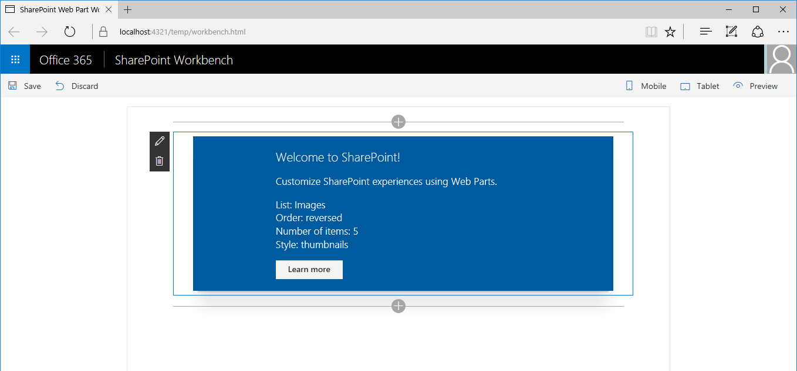

# <a name="simplify-adding-web-parts-with-preconfigured-entries"></a><span data-ttu-id="5ee15-102">Упрощенное добавление веб-частей с помощью предварительно настроенных записей</span><span class="sxs-lookup"><span data-stu-id="5ee15-102">Simplify adding web parts with preconfigured entries</span></span>

<span data-ttu-id="5ee15-p101">Сложные клиентские веб-части на платформе SharePoint Framework часто содержат много свойств, которые необходимо настраивать пользователю. Вы можете помочь пользователям, добавив предварительно настроенные записи для определенных сценариев. Такая запись инициализирует веб-часть, используя предварительно заданные значения. Из этой статьи вы узнаете, как использовать предварительно настроенные записи в клиентской веб-части на платформе SharePoint Framework, чтобы предоставить пользователям уже настроенные версии этой веб-части.</span><span class="sxs-lookup"><span data-stu-id="5ee15-p101">More complex SharePoint Framework client-side web parts will likely have many properties that the user must configure. You can help users by adding preconfigured property entries for specific scenarios. A preconfigured entry will initialize the web part with preset values. In this article you will learn how you to use preconfigured entries in a SharePoint Framework client-side web part to provide users with preconfigured versions of your web part.</span></span>

> <span data-ttu-id="5ee15-107">**Примечание.** Прежде чем выполнять действия, описанные в этой статье, [настройте среду разработки клиентских веб-частей для SharePoint](../../set-up-your-development-environment.md).</span><span class="sxs-lookup"><span data-stu-id="5ee15-107">**Note:** Before following the steps in this article, be sure to [set up your SharePoint client-side web part development environment](../../set-up-your-development-environment.md).</span></span>

## <a name="what-are-web-part-preconfigured-entries"></a><span data-ttu-id="5ee15-108">Что такое предварительно настроенные записи веб-части</span><span class="sxs-lookup"><span data-stu-id="5ee15-108">What are web part preconfigured entries</span></span>

<span data-ttu-id="5ee15-109">Каждая клиентская веб-часть на платформе SharePoint Framework состоит из двух частей: манифеста с описанием веб-части и ее кода.</span><span class="sxs-lookup"><span data-stu-id="5ee15-109">Each SharePoint Framework client-side web part consists of two pieces: the manifest, that describes the web part, and the web part code.</span></span>

<span data-ttu-id="5ee15-110">Среди свойств, указанных в манифесте веб части, есть свойство **preconfiguredEntries**.</span><span class="sxs-lookup"><span data-stu-id="5ee15-110">One of the properties specified in the web part manifest is the **preconfiguredEntries** property.</span></span>

```json
{
  "$schema": "../../../node_modules/@microsoft/sp-module-interfaces/lib/manifestSchemas/jsonSchemas/clientSideComponentManifestSchema.json",

  "id": "6737645a-4443-4210-a70e-e5e2a219133a",
  "alias": "GalleryWebPart",
  "componentType": "WebPart",
  "version": "0.0.1",
  "manifestVersion": 2,

  "preconfiguredEntries": [{
    "groupId": "6737645a-4443-4210-a70e-e5e2a219133a",
    "group": { "default": "Under Development" },
    "title": { "default": "Gallery" },
    "description": { "default": "Shows items from the selected list" },
    "officeFabricIconFontName": "Page",
    "properties": {
      "description": "Gallery"
    }
  }]
}
```

<span data-ttu-id="5ee15-p102">Свойство **preconfiguredEntries** предоставляет сведения о веб-части, которые используются на панели элементов. Когда пользователь добавляет веб-часть на страницу, данные из свойства **preconfiguredEntries** используются для отображения веб-части на панели элементов и определения ее параметров по умолчанию.</span><span class="sxs-lookup"><span data-stu-id="5ee15-p102">The **preconfiguredEntries** property provides information about your web part for use in the web part toolbox. When users add web parts to the page, the information from the **preconfiguredEntries** property is used to display the web part in the toolbox and define its default settings when it's added to the page.</span></span>

<span data-ttu-id="5ee15-p103">Если вы уже создавали классические веб-части с решениями, обладающими полным доверием, можете рассматривать каждую запись в массиве **preconfiguredEntries** как соответствующий **WEBPART**-файл. Как и **WEBPART**-файл, каждая запись в свойстве **preconfiguredEntries** связана с кодом веб-части и задает основные сведения о ней, например название или описание, а также значения свойств по умолчанию.</span><span class="sxs-lookup"><span data-stu-id="5ee15-p103">If you've built classic web parts with full-trust solutions, then you can think of each entry in the **preconfiguredEntries** array as corresponding to a **.webpart** file. Just like a **.webpart** file, each entry in the **preconfiguredEntries** property is linked to the web part code and specifies basic information about the web part such as its title or description as well as default values for its properties.</span></span>

### <a name="properties-of-a-preconfiguredentries-array-item"></a><span data-ttu-id="5ee15-115">Свойства элемента массива, называющегося **preconfiguredEntries**</span><span class="sxs-lookup"><span data-stu-id="5ee15-115">Properties of a **preconfiguredEntries** array item</span></span>

<span data-ttu-id="5ee15-p104">Каждый элемент массива **preconfiguredEntries** состоит из нескольких свойств. В приведенной ниже таблице описывается назначение каждого свойства.</span><span class="sxs-lookup"><span data-stu-id="5ee15-p104">Each item in the **preconfiguredEntries** array consists of several properties. The following table explains the purpose of each property.</span></span>

<span data-ttu-id="5ee15-118">Имя свойства</span><span class="sxs-lookup"><span data-stu-id="5ee15-118">Property name</span></span>           |<span data-ttu-id="5ee15-119">Тип значения</span><span class="sxs-lookup"><span data-stu-id="5ee15-119">Value type</span></span>      |<span data-ttu-id="5ee15-120">Обязательное</span><span class="sxs-lookup"><span data-stu-id="5ee15-120">Required</span></span>|<span data-ttu-id="5ee15-121">Назначение</span><span class="sxs-lookup"><span data-stu-id="5ee15-121">Purpose</span></span>                                               |<span data-ttu-id="5ee15-122">Пример значения</span><span class="sxs-lookup"><span data-stu-id="5ee15-122">Sample value</span></span>
------------------------|----------------|:------:|------------------------------------------------------|------------
<span data-ttu-id="5ee15-123">title</span><span class="sxs-lookup"><span data-stu-id="5ee15-123">title</span></span>                   |<span data-ttu-id="5ee15-124">ILocalizedString</span><span class="sxs-lookup"><span data-stu-id="5ee15-124">ILocalizedString</span></span>|<span data-ttu-id="5ee15-125">Да</span><span class="sxs-lookup"><span data-stu-id="5ee15-125">yes</span></span>     |<span data-ttu-id="5ee15-126">Название веб-части, которое отображается на панели элементов.</span><span class="sxs-lookup"><span data-stu-id="5ee15-126">The web part title that is displayed in the toolbox.</span></span>              |`"title": { "default": "Weather", "nl-nl": "Weerbericht" }`
<span data-ttu-id="5ee15-127">description</span><span class="sxs-lookup"><span data-stu-id="5ee15-127">description</span></span>             |<span data-ttu-id="5ee15-128">ILocalizedString</span><span class="sxs-lookup"><span data-stu-id="5ee15-128">ILocalizedString</span></span>|<span data-ttu-id="5ee15-129">Да</span><span class="sxs-lookup"><span data-stu-id="5ee15-129">yes</span></span>     |<span data-ttu-id="5ee15-130">Описание веб-части, которое отображается в подсказках панели элементов.</span><span class="sxs-lookup"><span data-stu-id="5ee15-130">The web part description that is displayed in the toolbox tooltips.</span></span>|`"description": { "default": "Shows weather in the given location", "nl-nl": "Toont weerbericht voor de opgegeven locatie" } `
<span data-ttu-id="5ee15-131">officeFabricIconFontName</span><span class="sxs-lookup"><span data-stu-id="5ee15-131">officeFabricIconFontName</span></span>|<span data-ttu-id="5ee15-132">string</span><span class="sxs-lookup"><span data-stu-id="5ee15-132">string</span></span>          |<span data-ttu-id="5ee15-133">нет</span><span class="sxs-lookup"><span data-stu-id="5ee15-133">no</span></span>      |<span data-ttu-id="5ee15-p105">Значок веб-части, который отображается на панели элементов. Значение этого параметра должно быть одним из [имен значков Office UI Fabric](https://dev.office.com/fabric#/styles/icons). Если у этого свойства есть значение, свойство **iconImageUrl** игнорируется.</span><span class="sxs-lookup"><span data-stu-id="5ee15-p105">The icon for the web part that is displayed in the toolbox. Its value must be one of the [Office UI Fabric icon names](https://dev.office.com/fabric#/styles/icons). If this property has a value, the **iconImageUrl** property will be ignored.</span></span>|`"officeFabricIconFontName": "Sunny"`
<span data-ttu-id="5ee15-137">iconImageUrl</span><span class="sxs-lookup"><span data-stu-id="5ee15-137">iconImageUrl</span></span>            |<span data-ttu-id="5ee15-138">string</span><span class="sxs-lookup"><span data-stu-id="5ee15-138">string</span></span>          |<span data-ttu-id="5ee15-139">нет</span><span class="sxs-lookup"><span data-stu-id="5ee15-139">no</span></span>      |<span data-ttu-id="5ee15-p106">Значок веб-части, который отображается на панели элементов и представлен URL-адресом изображения. Размер изображения, находящегося по этому URL-адресу, должен составлять 40 x 28 пикселей. Если у свойства **officeFabricIconName** нет значения, необходимо задать значение для данного свойства.</span><span class="sxs-lookup"><span data-stu-id="5ee15-p106">The icon for the web part that is displayed in the toolbox and is represented by an image URL. The image at the URL must be exactly 40 x 28 px. If the **officeFabricIconName** property does not have a value, this property must have a value.</span></span>|`"iconImageUrl": "https://cdn.contoso.com/weather.png"`
<span data-ttu-id="5ee15-143">groupId</span><span class="sxs-lookup"><span data-stu-id="5ee15-143">groupId</span></span>                 |<span data-ttu-id="5ee15-144">string</span><span class="sxs-lookup"><span data-stu-id="5ee15-144">string</span></span>          |<span data-ttu-id="5ee15-145">Да</span><span class="sxs-lookup"><span data-stu-id="5ee15-145">yes</span></span>     |<span data-ttu-id="5ee15-p107">Идентификатор группы определяет, в какой группе панели элементов будет отображаться веб-часть. Платформа SharePoint Framework резервирует идентификаторы для групп по умолчанию. Разработчик может выбрать одну из них. Если указан идентификатор группы, свойство **group** игнорируется. Кроме того, разработчик может выбрать уникальные идентификатор и имя группы. В этом случае веб-часть будет отображаться в отдельной группе панели элементов.</span><span class="sxs-lookup"><span data-stu-id="5ee15-p107">The group id determines which toolbox group will contain the web part. The SharePoint Framework reserves group ids for default groups. The developer can pick one of those groups. If a group id is specified, then the **group** property will be ignored. Alternatively, the developer can pick a completely unique id and a group name. The toolbox will then show the web part in its own group.</span></span>|`"groupId": "6737645a-4443-4210-a70e-e5e2a219133a"`
<span data-ttu-id="5ee15-152">group</span><span class="sxs-lookup"><span data-stu-id="5ee15-152">group</span></span>                   |<span data-ttu-id="5ee15-153">ILocalizedString</span><span class="sxs-lookup"><span data-stu-id="5ee15-153">ILocalizedString</span></span>|<span data-ttu-id="5ee15-154">нет</span><span class="sxs-lookup"><span data-stu-id="5ee15-154">no</span></span>      |<span data-ttu-id="5ee15-p108">Имя группы панели элементов, в которой будет отображаться веб-часть. Если значение не указано, веб-часть отображается в группе **Пользовательские**.</span><span class="sxs-lookup"><span data-stu-id="5ee15-p108">The name of the group in the toolbox in which the web part will be displayed. If no value is provided, then the web part will be displayed in the **Custom** group.</span></span>|`"group": { "default": "Content", "nl-nl": "Inhoud" }`
<span data-ttu-id="5ee15-157">dataVersion</span><span class="sxs-lookup"><span data-stu-id="5ee15-157">dataVersion</span></span>             |<span data-ttu-id="5ee15-158">string</span><span class="sxs-lookup"><span data-stu-id="5ee15-158">string</span></span>          |<span data-ttu-id="5ee15-159">нет</span><span class="sxs-lookup"><span data-stu-id="5ee15-159">no</span></span>      |<span data-ttu-id="5ee15-p109">В этом поле можно указать версию предварительно настроенных данных, предоставленных в веб-часть. Обратите внимание, что версия данных и поле версии в манифесте — это не одно и то же. Версия манифеста используется для управления версиями кода веб-части, а версия данных — для управления версиями сериализованных данных веб-части. Дополнительные сведения см. в поле dataVersion веб-части. Формат поддерживаемых значений: версия MAJOR.MINOR.</span><span class="sxs-lookup"><span data-stu-id="5ee15-p109">Use this field to specify the data version of the pre-configured data provided to the web part. Note that data version is different from the version field in the manifest. The manifest version is used to control the versioning of the web part code, while data version is used to control the versioning of the serialized data of the web part. Refer to dataVersion field of your web part for more information. Supported values format: MAJOR.MINOR version</span></span>|`"dataVersion": "1.0"`
<span data-ttu-id="5ee15-165">properties</span><span class="sxs-lookup"><span data-stu-id="5ee15-165">properties</span></span>              |<span data-ttu-id="5ee15-166">TProperties</span><span class="sxs-lookup"><span data-stu-id="5ee15-166">TProperties</span></span>     |<span data-ttu-id="5ee15-167">Да</span><span class="sxs-lookup"><span data-stu-id="5ee15-167">yes</span></span>     |<span data-ttu-id="5ee15-168">Объект пары "ключ-значение" со значениями по умолчанию для свойств веб-части.</span><span class="sxs-lookup"><span data-stu-id="5ee15-168">A Key-value pair object with default values for web part properties.</span></span>|`"properties": { "location": "Redmond", "numberOfDays": 3, "showIcon": true }`

<span data-ttu-id="5ee15-169">Категории по умолчанию отслеживают, что можно использовать для свойства `groupId`.</span><span class="sxs-lookup"><span data-stu-id="5ee15-169">Out of the box Categories are following, which can be used for the `groupId` property.</span></span>

<span data-ttu-id="5ee15-170">Имя категории</span><span class="sxs-lookup"><span data-stu-id="5ee15-170">Category Name</span></span> |<span data-ttu-id="5ee15-171">GUID</span><span class="sxs-lookup"><span data-stu-id="5ee15-171">Guid</span></span> |<span data-ttu-id="5ee15-172">Сопоставление для средства выбора веб-частей</span><span class="sxs-lookup"><span data-stu-id="5ee15-172">Map to web part picker</span></span> |<span data-ttu-id="5ee15-173">Описание</span><span class="sxs-lookup"><span data-stu-id="5ee15-173">Description</span></span>        
--- |--- |--- |---
<span data-ttu-id="5ee15-174">Текст, мультимедиа и контент</span><span class="sxs-lookup"><span data-stu-id="5ee15-174">Text, media, and content</span></span> | `cf066440-0614-43d6-98ae-0b31cf14c7c3`| <span data-ttu-id="5ee15-175">Мультимедиа и контент</span><span class="sxs-lookup"><span data-stu-id="5ee15-175">Media and Content</span></span>  |<span data-ttu-id="5ee15-176">Эта категория включает веб-части, отображающие текст, мультимедиа, документы, информацию из сети и другой контент.</span><span class="sxs-lookup"><span data-stu-id="5ee15-176">This category includes web parts that display text, multi-media, documents, information from the web, and other rich content.</span></span>   
<span data-ttu-id="5ee15-177">Обнаружение</span><span class="sxs-lookup"><span data-stu-id="5ee15-177">Discover</span></span> | `1edbd9a8-0bfb-4aa2-9afd-14b8c45dd489`| <span data-ttu-id="5ee15-178">Обнаружение</span><span class="sxs-lookup"><span data-stu-id="5ee15-178">Discovery</span></span>  |<span data-ttu-id="5ee15-179">Эта категория включает веб-части, которые организовывают, группируют и фильтруют контент, помогая пользователям находить информацию.</span><span class="sxs-lookup"><span data-stu-id="5ee15-179">This category includes web parts that organize, group, and filter content to help users discover information.</span></span> 
<span data-ttu-id="5ee15-180">Связь и взаимодействие</span><span class="sxs-lookup"><span data-stu-id="5ee15-180">Communication and collaboration</span></span> | `75e22ed5-fa14-4829-850a-c890608aca2d`| <span data-ttu-id="5ee15-181">Совместная работа пользователей</span><span class="sxs-lookup"><span data-stu-id="5ee15-181">Social Collaboration</span></span> |<span data-ttu-id="5ee15-182">Эта категория включает веб-части, которые помогают делиться информацией, облегчают командную работу и социальное взаимодействие.</span><span class="sxs-lookup"><span data-stu-id="5ee15-182">This category includes web parts that facilitate information sharing, team work, and social interactions.</span></span>
<span data-ttu-id="5ee15-183">Планирование и процесс</span><span class="sxs-lookup"><span data-stu-id="5ee15-183">Planning and process</span></span> | `1bc7927e-4a5e-4520-b540-71305c79c20a`| <span data-ttu-id="5ee15-184">Бизнес-данные</span><span class="sxs-lookup"><span data-stu-id="5ee15-184">Business Data</span></span> | <span data-ttu-id="5ee15-185">Эта категория включает веб-части, которые повышают производительность команды при помощи инструментов планирования и процесса.</span><span class="sxs-lookup"><span data-stu-id="5ee15-185">This category includes web parts that empower team productivity with the use of planning and process tools.</span></span> 
<span data-ttu-id="5ee15-186">Бизнес и аналитика</span><span class="sxs-lookup"><span data-stu-id="5ee15-186">Business and intelligence</span></span> | `4aca9e90-eff5-4fa1-bac7-728f5f157b66`| <span data-ttu-id="5ee15-187">Бизнес-данные</span><span class="sxs-lookup"><span data-stu-id="5ee15-187">Business Data</span></span> | <span data-ttu-id="5ee15-188">Эта категория включает веб-части для отслеживания и анализа данных, а также для интеграции бизнес-процессов со страницами.</span><span class="sxs-lookup"><span data-stu-id="5ee15-188">This category includes web parts for tracking and analyzing data, and for integrating business flow with pages.</span></span> 
<span data-ttu-id="5ee15-189">Инструменты сайта</span><span class="sxs-lookup"><span data-stu-id="5ee15-189">Site tools</span></span> | `070951d7-94da-4db8-b06e-9d581f1f55b1`| <span data-ttu-id="5ee15-190">Инструменты сайта</span><span class="sxs-lookup"><span data-stu-id="5ee15-190">Site tools</span></span>  |<span data-ttu-id="5ee15-191">Эта категория включает веб-части для управления сайтом и получения сведений о нем.</span><span class="sxs-lookup"><span data-stu-id="5ee15-191">This category includes web parts for site information and management.</span></span> 
<span data-ttu-id="5ee15-192">Другие</span><span class="sxs-lookup"><span data-stu-id="5ee15-192">Other</span></span> | `5c03119e-3074-46fd-976b-c60198311f70`| <span data-ttu-id="5ee15-193">Другие</span><span class="sxs-lookup"><span data-stu-id="5ee15-193">Others</span></span> | <span data-ttu-id="5ee15-194">Эта категория включает веб-части, не вошедшие в другие категории.</span><span class="sxs-lookup"><span data-stu-id="5ee15-194">This category includes web parts not in other categories.</span></span>            

<span data-ttu-id="5ee15-p110">Некоторые свойства веб-части принимают значения типа **ILocalizedString**. Этот тип представляет собой объект пары "ключ-значение", с помощью которого разработчики могут указывать строки для различных языковых стандартов. Значение типа **ILocalizedString** должно содержать хотя бы значение **default**. При необходимости разработчик может предоставить перевод этого значения для разных языковых стандартов, поддерживаемых веб-частью. Если веб-часть размещена на странице для языкового стандарта, не указанного в локализованной строке, используется значение по умолчанию.</span><span class="sxs-lookup"><span data-stu-id="5ee15-p110">Some web part properties have a value of type **ILocalizedString**. This type is a key-value pair object that allows developers to specify strings for the different locales. At a minimum, a value of type **ILocalizedString** must contain the **default** value. Optionally developers can provide the translations of that value to the different locales that their web part supports. If the web part is placed on a page in a locale that isn't listed in the localized string, the default value is used instead.</span></span>

<span data-ttu-id="5ee15-200">Допустимые значения **ILocalizedString**:</span><span class="sxs-lookup"><span data-stu-id="5ee15-200">Valid **ILocalizedString** values:</span></span>

```json
"title": {
  "default": "Weather",
  "nl-nl": "Weerbericht"
}
```

```json
"title": {
  "default": "Weather"
}
```

<span data-ttu-id="5ee15-201">Значение **ILocalizedString**, не являющееся допустимым, так как отсутствует ключ **default**:</span><span class="sxs-lookup"><span data-stu-id="5ee15-201">A **ILocalizedString** value that is not valid because the **default** key is missing:</span></span>

```json
"title": {
  "en-us": "Weather"
}
```

## <a name="using-preconfigured-entries-in-web-parts"></a><span data-ttu-id="5ee15-202">Использование предварительно настроенных записей в веб-частях</span><span class="sxs-lookup"><span data-stu-id="5ee15-202">Using preconfigured entries in web parts</span></span>

<span data-ttu-id="5ee15-p111">Чтобы увидеть, как можно использовать предварительно настроенные записи при создании веб-частей, вы можете создать пример веб-части с коллекцией. С помощью нескольких свойств пользователи могут настраивать эту веб-часть так, чтобы в ней определенным образом отображались элементы из выбранного списка. Для краткости мы опустим фактическую реализацию логики веб-части и сосредоточимся на том, как предоставлять предварительно настроенные версии веб-части коллекции с помощью свойства **preconfiguredEntries**.</span><span class="sxs-lookup"><span data-stu-id="5ee15-p111">To see how you can use preconfigured entries when building web parts, you will build a sample gallery web part. Using several properties, users can configure this web part to show items from a selected list in a specific way. For brevity, you will omit the actual implementation of the web part logic and will focus on using the **preconfiguredEntries** property to provide preconfigured versions of the gallery web part.</span></span>


### <a name="create-a-new-project"></a><span data-ttu-id="5ee15-207">Создание проекта</span><span class="sxs-lookup"><span data-stu-id="5ee15-207">Create a new project</span></span>

<span data-ttu-id="5ee15-208">Для начала создайте папку проекта.</span><span class="sxs-lookup"><span data-stu-id="5ee15-208">Start by creating a new folder for your project.</span></span>

```sh
md react-preconfiguredentries
```

<span data-ttu-id="5ee15-209">Перейдите в папку проекта.</span><span class="sxs-lookup"><span data-stu-id="5ee15-209">Go to the project folder.</span></span>

```sh
cd react-preconfiguredentries
```

<span data-ttu-id="5ee15-210">В папке проекта запустите генератор Yeoman для SharePoint Framework, чтобы сформировать шаблон проекта на платформе SharePoint Framework.</span><span class="sxs-lookup"><span data-stu-id="5ee15-210">In the project folder run the SharePoint Framework Yeoman generator to scaffold a new SharePoint Framework project.</span></span>

```sh
yo @microsoft/sharepoint
```

<span data-ttu-id="5ee15-211">Когда отобразится соответствующий запрос, введите следующие значения:</span><span class="sxs-lookup"><span data-stu-id="5ee15-211">When prompted, enter the following values:</span></span>

- <span data-ttu-id="5ee15-212">**react-preconfiguredentries** в качестве имени решения;</span><span class="sxs-lookup"><span data-stu-id="5ee15-212">**react-preconfiguredentries** as your solution name</span></span>
- <span data-ttu-id="5ee15-213">**Use the current folder** (Использовать текущую папку) в качестве расположения файлов;</span><span class="sxs-lookup"><span data-stu-id="5ee15-213">**Use the current folder** for the location to place the files</span></span>
- <span data-ttu-id="5ee15-214">**Gallery** (Коллекция) в качестве имени веб-части;</span><span class="sxs-lookup"><span data-stu-id="5ee15-214">**Gallery** as your web part name</span></span>
- <span data-ttu-id="5ee15-215">**Shows items from the selected list** (Показывает элементы из выбранного списка) в качестве описания веб-части;</span><span class="sxs-lookup"><span data-stu-id="5ee15-215">**Shows items from the selected list** as your web part description</span></span>
- <span data-ttu-id="5ee15-216">**React** как отправную точку создания веб-части.</span><span class="sxs-lookup"><span data-stu-id="5ee15-216">**React** as the starting point to build the web part</span></span>


<span data-ttu-id="5ee15-218">После завершения скаффолдинга заблокируйте версию зависимостей проекта, выполнив следующую команду:</span><span class="sxs-lookup"><span data-stu-id="5ee15-218">Once the scaffolding completes, lock down the version of the project dependencies by running the following command:</span></span>

```sh
npm shrinkwrap
```

<span data-ttu-id="5ee15-219">Далее откройте папку проекта в редакторе кода.</span><span class="sxs-lookup"><span data-stu-id="5ee15-219">Next, open your project folder in your code editor.</span></span> <span data-ttu-id="5ee15-220">В этой статье в инструкциях и на снимках экрана указан Visual Studio Code, но вы можете использовать любой редактор.</span><span class="sxs-lookup"><span data-stu-id="5ee15-220">Once the scaffolding completes, open your project folder in your code editor. This article uses Visual Studio Code in the steps and screenshots but you can use any editor you prefer.</span></span>


### <a name="add-web-part-properties"></a><span data-ttu-id="5ee15-222">Добавление свойств веб-части</span><span class="sxs-lookup"><span data-stu-id="5ee15-222">Add web part properties</span></span>

<span data-ttu-id="5ee15-p113">Добавьте свойства в манифесте веб-части, чтобы пользователи могли настраивать веб-часть коллекции. Откройте в редакторе кода файл **./src/webparts/gallery/GalleryWebPart.manifest.json**. Замените раздел **properties** следующим кодом JSON:</span><span class="sxs-lookup"><span data-stu-id="5ee15-p113">In the web part manifest, add web part properties so that users can configure the gallery web part. In the code editor, open the **./src/webparts/gallery/GalleryWebPart.manifest.json** file. Replace the **properties** section with the following JSON:</span></span>

```json
{
  //...
  "preconfiguredEntries": [{
    //...
    "properties": {
      "listName": "",
      "order": "",
      "numberOfItems": 10,
      "style": ""
    }
  }]
}
```

<span data-ttu-id="5ee15-p114">Свойство **listName** задает имя списка, элементы которого будут отображаться. Свойство **order** задает порядок отображения элементов: по возрастанию или убыванию времени добавления. Свойство **numberOfItems** задает количество отображаемых элементов. Наконец, свойство **style** задает способ отображения элементов, например в виде эскизов (удобно для показа изображений) или списка (лучше подходит для документов).</span><span class="sxs-lookup"><span data-stu-id="5ee15-p114">The **listName** property specifies the name of the list from which list items should be displayed. The **order** property specifies the order in which items should be shown, that is chronological, or reverse chronological order. The **numberOfItems** property specifies how many items should be displayed. Finally, the **style** property specifies how the items should be displayed, such as thumbnails, which is useful for showing images, or as a list which is more suitable for documents.</span></span>

<span data-ttu-id="5ee15-p115">Указанные в манифесте свойства веб-части также необходимо добавить в интерфейс свойств. Откройте в редакторе кода файл **./src/webparts/gallery/IGalleryWebPartProps.ts**. Измените его код на следующий:</span><span class="sxs-lookup"><span data-stu-id="5ee15-p115">Web part properties specified in the manifest must also be added to the web part properties interface. In the code editor, open the **./src/webparts/gallery/IGalleryWebPartProps.ts** file. Change its code to:</span></span>

```ts
export interface IGalleryWebPartProps {
  listName: string;
  order: string;
  numberOfItems: number;
  style: string;
}
```

<span data-ttu-id="5ee15-p116">Создавая клиентские веб-части SharePoint Framework с помощью React, после того как вы измените интерфейс свойств веб-части, необходимо обновить метод **render**, который использует этот интерфейс для создания главного компонента React. Откройте в редакторе кода файл **./src/webparts/gallery/GalleryWebPart.ts**. Измените код метода **render** веб-части на следующий:</span><span class="sxs-lookup"><span data-stu-id="5ee15-p116">When building SharePoint Framework client-side web parts using React, after changing the web part properties interface, you need to update the web part's **render** method that uses that interface to create an instance of the main React component. In the code editor, open the **./src/webparts/gallery/GalleryWebPart.ts** file. Change the web part **render** method to:</span></span>

```ts
export default class GalleryWebPart extends BaseClientSideWebPart<IGalleryWebPartProps> {
  // ...
  public render(): void {
    const element: React.ReactElement<IGalleryProps> = React.createElement(Gallery, {
      listName: this.properties.listName,
      order: this.properties.order,
      numberOfItems: this.properties.numberOfItems,
      style: this.properties.style
    });

    ReactDom.render(element, this.domElement);
  }
  // ...
}
```

<span data-ttu-id="5ee15-p117">Измените главный компонент React так, чтобы отображались значения свойств. Если веб-часть не настроена, должен отображаться стандартный заполнитель веб-части. Откройте в редакторе кода файл **./src/webparts/gallery/components/Gallery.tsx** и измените его код на следующий:</span><span class="sxs-lookup"><span data-stu-id="5ee15-p117">Update the main React component to display the values of the properties. If the web part hasn't been configured, show the standard web part placeholder. In the code editor, open the **./src/webparts/gallery/components/Gallery.tsx** file and change its code to:</span></span>

```ts
import * as React from 'react';
import styles from './Gallery.module.scss';
import { IGalleryProps } from './IGalleryProps';

export default class Gallery extends React.Component<IGalleryProps, void> {
  public render(): JSX.Element {
    if (this.needsConfiguration()) {
      return <div className="ms-Grid" style={{ color: "#666", backgroundColor: "#f4f4f4", padding: "80px 0", alignItems: "center", boxAlign: "center" }}>
        <div className="ms-Grid-row" style={{ color: "#333" }}>
          <div className="ms-Grid-col ms-u-hiddenSm ms-u-md3"></div>
          <div className="ms-Grid-col ms-u-sm12 ms-u-md6" style={{ height: "100%", whiteSpace: "nowrap", textAlign: "center" }}>
            <i className="ms-fontSize-su ms-Icon ms-Icon--ThumbnailView" style={{ display: "inline-block", verticalAlign: "middle", whiteSpace: "normal" }}></i><span className="ms-fontWeight-light ms-fontSize-xxl" style={{ paddingLeft: "20px", display: "inline-block", verticalAlign: "middle", whiteSpace: "normal" }}>Gallery</span>
          </div>
          <div className="ms-Grid-col ms-u-hiddenSm ms-u-md3"></div>
        </div>
        <div className="ms-Grid-row" style={{ width: "65%", verticalAlign: "middle", margin: "0 auto", textAlign: "center" }}>
          <span style={{ color: "#666", fontSize: "17px", display: "inline-block", margin: "24px 0", fontWeight: 100 }}>Show items from the selected list</span>
        </div>
        <div className="ms-Grid-row"></div>
      </div>;
    }
    else {
      return (
        <div className={styles.gallery}>
          <div className={styles.container}>
            <div className={`ms-Grid-row ms-bgColor-themeDark ms-fontColor-white ${styles.row}`}>
              <div className='ms-Grid-col ms-u-lg10 ms-u-xl8 ms-u-xlPush2 ms-u-lgPush1'>
                <span className="ms-font-xl ms-fontColor-white">
                  Welcome to SharePoint!
                </span>
                <p className='ms-font-l ms-fontColor-white'>
                  Customize SharePoint experiences using Web Parts.
                </p>
                <p className='ms-font-l ms-fontColor-white'>
                  List: {this.props.listName}<br />
                  Order: {this.props.order}<br />
                  Number of items: {this.props.numberOfItems}<br />
                  Style: {this.props.style}
                </p>
                <a href="https://aka.ms/spfx" className={styles.button}>
                  <span className={styles.label}>Learn more</span>
                </a>
              </div>
            </div>
          </div>
        </div>
      );
    }
  }

  private needsConfiguration(): boolean {
    return Gallery.isEmpty(this.props.listName) ||
      Gallery.isEmpty(this.props.order) ||
      Gallery.isEmpty(this.props.style);
  }

  private static isEmpty(value: string): boolean {
    return value === undefined ||
      value === null ||
      value.length === 0;
  }
}
```

<span data-ttu-id="5ee15-p118">Обновите интерфейс основного компонента React в соответствии со свойством веб-части Interface, так как мы обходим все свойства веб-части для этого компонента. Откройте в редакторе кода файл **./src/webparts/gallery/components/IGalleryProps.ts** и измените его код на следующий:</span><span class="sxs-lookup"><span data-stu-id="5ee15-p118">Update the main React component Interface to match on the web part property Interface, since we are bypassing all the web part properties to this component. In the code editor, open the **./src/webparts/gallery/components/IGalleryProps.ts** file and change its code to:</span></span>

```ts
import { IGalleryWebPartProps } from '../IGalleryWebPartProps';

export interface IGalleryProps extends IGalleryWebPartProps {
}
```

### <a name="render-web-part-properties-in-the-property-pane"></a><span data-ttu-id="5ee15-241">Отображение свойств веб-части в области свойств</span><span class="sxs-lookup"><span data-stu-id="5ee15-241">Render web part properties in the property pane</span></span>

<span data-ttu-id="5ee15-p119">Чтобы пользователи могли настраивать веб-часть с помощью новых свойств, эти свойства должны отображаться в области свойств веб-части. Откройте в редакторе кода файл **./src/webparts/gallery/GalleryWebPart.ts**. В верхнем разделе файла измените оператор импорта **@microsoft/sp-webpart-base** на следующий:</span><span class="sxs-lookup"><span data-stu-id="5ee15-p119">For users to be able to use the newly defined properties to configure the web part, the properties must be displayed in the web part property pane. In the code editor, open the **./src/webparts/gallery/GalleryWebPart.ts** file. In the top section of the file change the **@microsoft/sp-webpart-base** import statement to:</span></span>

```ts
import {
  BaseClientSideWebPart,
  IPropertyPaneConfiguration,
  PropertyPaneDropdown,
  PropertyPaneSlider,
  PropertyPaneChoiceGroup
} from '@microsoft/sp-webpart-base';
```

<span data-ttu-id="5ee15-245">Затем измените метод **propertyPaneSettings** на следующий:</span><span class="sxs-lookup"><span data-stu-id="5ee15-245">Next, change the **propertyPaneSettings** getter to:</span></span>

```ts
export default class GalleryWebPart extends BaseClientSideWebPart<IGalleryWebPartProps> {
  // ...
  protected getPropertyPaneConfiguration(): IPropertyPaneConfiguration {
    return {
      pages: [
        {
          header: {
            description: strings.PropertyPaneDescription
          },
          groups: [
            {
              groupName: strings.BasicGroupName,
              groupFields: [
                PropertyPaneDropdown('listName', {
                  label: strings.ListNameFieldLabel,
                  options: [{
                    key: 'Documents',
                    text: 'Documents'
                  },
                  {
                    key: 'Images',
                    text: 'Images'
                  }]
                }),
                PropertyPaneChoiceGroup('order', {
                  label: strings.OrderFieldLabel,
                  options: [{
                    key: 'chronological',
                    text: strings.OrderFieldChronologicalOptionLabel
                  },
                  {
                    key: 'reversed',
                    text: strings.OrderFieldReversedOptionLabel
                  }]
                }),
                PropertyPaneSlider('numberOfItems', {
                  label: strings.NumberOfItemsFieldLabel,
                  min: 1,
                  max: 10,
                  step: 1
                }),
                PropertyPaneChoiceGroup('style', {
                  label: strings.StyleFieldLabel,
                  options: [{
                    key: 'thumbnails',
                    text: strings.StyleFieldThumbnailsOptionLabel
                  },
                  {
                    key: 'list',
                    text: strings.StyleFieldListOptionLabel
                  }]
                })
              ]
            }
          ]
        }
      ]
    };
  }
}
```

<span data-ttu-id="5ee15-p120">В реальной ситуации вы получали бы список списков с текущего сайта SharePoint. Для краткости в этом примере используется фиксированный список.</span><span class="sxs-lookup"><span data-stu-id="5ee15-p120">In a real-life scenario, you would retrieve the list of lists from the current SharePoint site. For brevity, in this example you use a fixed list instead.</span></span>

### <a name="add-localization-labels"></a><span data-ttu-id="5ee15-248">Добавление меток локализации</span><span class="sxs-lookup"><span data-stu-id="5ee15-248">Add localization labels</span></span>

<span data-ttu-id="5ee15-p121">Откройте в редакторе кода файл **./src/webparts/gallery/loc/mystrings.d.ts**. Измените его код на следующий:</span><span class="sxs-lookup"><span data-stu-id="5ee15-p121">In the code editor, open the **./src/webparts/gallery/loc/mystrings.d.ts** file. Change its code to:</span></span>

```ts
declare interface IGalleryStrings {
  PropertyPaneDescription: string;
  BasicGroupName: string;
  ListNameFieldLabel: string;
  OrderFieldLabel: string;
  OrderFieldChronologicalOptionLabel: string;
  OrderFieldReversedOptionLabel: string;
  NumberOfItemsFieldLabel: string;
  StyleFieldLabel: string;
  StyleFieldThumbnailsOptionLabel: string;
  StyleFieldListOptionLabel: string;
}

declare module 'galleryStrings' {
  const strings: IGalleryStrings;
  export = strings;
}
```

<span data-ttu-id="5ee15-251">Добавьте отсутствующие строки ресурсов, открыв в редакторе кода файл **./src/webparts/gallery/loc/en-us.js** и изменив его код на следующий:</span><span class="sxs-lookup"><span data-stu-id="5ee15-251">Add the missing resource strings by opening in the code editor the **./src/webparts/gallery/loc/en-us.js** file and changing its code to:</span></span>

```js
define([], function() {
  return {
    "PropertyPaneDescription": "Description",
    "BasicGroupName": "Group Name",
    "ListNameFieldLabel": "List",
    "OrderFieldLabel": "Items order",
    "OrderFieldChronologicalOptionLabel": "chronological",
    "OrderFieldReversedOptionLabel": "reversed chronological",
    "NumberOfItemsFieldLabel": "Number of items to show",
    "StyleFieldLabel": "Items display style",
    "StyleFieldThumbnailsOptionLabel": "thumbnails",
    "StyleFieldListOptionLabel": "list"
  }
});
```

<span data-ttu-id="5ee15-252">Подтвердите сборку проекта, выполнив следующую команду:</span><span class="sxs-lookup"><span data-stu-id="5ee15-252">Confirm that the project is building by running the following command:</span></span>

```sh
gulp serve
```

<span data-ttu-id="5ee15-p122">В веб-браузере добавьте веб-часть на холст и откройте ее область свойств. Вы должны увидеть все свойства, которые могут настраивать пользователи.</span><span class="sxs-lookup"><span data-stu-id="5ee15-p122">In the web browser add the web part to the canvas and open its property pane. You should see all properties available for users to configure.</span></span>


<span data-ttu-id="5ee15-p123">Для веб-части не заданы значения по умолчанию, поэтому каждый раз, когда пользователь добавляет веб-часть на страницу, ее необходимо настраивать. Вы можете упростить работу, предоставив значения по умолчанию для наиболее распространенных ситуаций.</span><span class="sxs-lookup"><span data-stu-id="5ee15-p123">Because you didn't specify any default values for the web part, every time users add the web part to the page they have to configure it first. You can simplify this experience by providing default values for the most common scenarios.</span></span>

### <a name="specify-default-values-for-the-web-part"></a><span data-ttu-id="5ee15-258">Указание значений по умолчанию для веб-части</span><span class="sxs-lookup"><span data-stu-id="5ee15-258">Specify default values for the web part</span></span>

<span data-ttu-id="5ee15-p124">Представьте, что пользователи часто используют веб-часть коллекции, чтобы показать пять последних добавленных изображений. Чтобы пользователям не приходилось каждый раз настраивать веб-часть вручную, вы можете предоставить им предварительно настроенную версию с использованием правильных параметров.</span><span class="sxs-lookup"><span data-stu-id="5ee15-p124">Imagine that users often use the gallery web part to show the five most recently added images. Rather than requiring users to configure the web part each time manually, you could provide them with a preconfigured version using correct settings.</span></span>

<span data-ttu-id="5ee15-p125">Откройте в редакторе кода файл **./src/webparts/gallery/GalleryWebPart.manifest.json**. Измените имеющуюся запись в свойстве **preconfiguredEntries** на следующую:</span><span class="sxs-lookup"><span data-stu-id="5ee15-p125">In the code editor, open the **./src/webparts/gallery/GalleryWebPart.manifest.json** file. Change the existing entry in the **preconfiguredEntries** property to:</span></span>

```json
{
  // ...
  "preconfiguredEntries": [{
    "groupId": "6737645a-4443-4210-a70e-e5e2a219133a",
    "group": { "default": "Content" },
    "title": { "default": "Recent images" },
    "description": { "default": "Shows 5 most recent images" },
    "officeFabricIconFontName": "Picture",
    "properties": {
      "listName": "Images",
      "order": "reversed",
      "numberOfItems": 5,
      "style": "thumbnails"
    }
  }]
}
```

<span data-ttu-id="5ee15-263">Начните отладку проекта, выполнив следующую команду:</span><span class="sxs-lookup"><span data-stu-id="5ee15-263">Start debugging the project by running the following command:</span></span>

```sh
gulp serve
```

> <span data-ttu-id="5ee15-p126">**Примечание**. Если отладка проекта уже выполнялась, остановите ее и начните заново. Изменения, внесенные в манифест веб-части, не показываются на рабочем месте во время отладки. Чтобы увидеть их, необходимо повторно собрать проект.</span><span class="sxs-lookup"><span data-stu-id="5ee15-p126">**Note**: If you were debugging the project previously, stop debugging and start it again. Changes made to the web part manifest are not automatically reflected in the workbench while debugging, and you have to rebuild the project in order to see them.</span></span>

<span data-ttu-id="5ee15-266">Открыв панель элементов веб-частей, чтобы добавить веб-часть на холст, вы увидите, что ее название и значок изменились в соответствии с предварительно настроенными параметрами.</span><span class="sxs-lookup"><span data-stu-id="5ee15-266">When you open the web part toolbox to add the web part to the canvas, you will see that its name and icon changed to reflect the preconfigured settings.</span></span>


<span data-ttu-id="5ee15-268">Веб-часть начнет работать сразу после добавления на страницу, используя предварительно настроенные параметры.</span><span class="sxs-lookup"><span data-stu-id="5ee15-268">After adding the web part to the page, it works immediately using the preconfigured settings.</span></span>



### <a name="specify-multiple-preconfigured-web-part-entries"></a><span data-ttu-id="5ee15-270">Указание нескольких предварительно настроенных записей веб-части</span><span class="sxs-lookup"><span data-stu-id="5ee15-270">Specify multiple preconfigured web part entries</span></span>

<span data-ttu-id="5ee15-p127">Представьте, что еще одна группа пользователей часто обращается к веб-части коллекции, чтобы просматривать последние добавленные на сайт документы. Чтобы помочь этим пользователям работать с веб-частью, вы можете добавить еще один набор предварительно настроенных записей, соответствующий их потребностям.</span><span class="sxs-lookup"><span data-stu-id="5ee15-p127">Imagine that another group of users often uses your gallery web part to show documents recently added to their site. To help them use your web part, you can add another set of presets that addresses their configuration needs.</span></span>

<span data-ttu-id="5ee15-p128">Откройте в редакторе кода файл **./src/webparts/gallery/GalleryWebPart.manifest.json**. Измените содержимое свойства **preconfiguredEntries** на следующее:</span><span class="sxs-lookup"><span data-stu-id="5ee15-p128">In the code editor, open the **./src/webparts/gallery/GalleryWebPart.manifest.json** file. Change the **preconfiguredEntries** property to:</span></span>

```json
{
  // ...
  "preconfiguredEntries": [{
    "groupId": "6737645a-4443-4210-a70e-e5e2a219133a",
    "group": { "default": "Content" },
    "title": { "default": "Recent images" },
    "description": { "default": "Shows 5 most recent images" },
    "officeFabricIconFontName": "Picture",
    "properties": {
      "listName": "Images",
      "order": "reversed",
      "numberOfItems": 5,
      "style": "thumbnails"
    }
  },
  {
    "groupId": "6737645a-4443-4210-a70e-e5e2a219133a",
    "group": { "default": "Content" },
    "title": { "default": "Recent documents" },
    "description": { "default": "Shows 10 most recent documents" },
    "officeFabricIconFontName": "Documentation",
    "properties": {
      "listName": "Documents",
      "order": "reversed",
      "numberOfItems": 10,
      "style": "list"
    }
  }]
}
```

<span data-ttu-id="5ee15-275">Обратите внимание, что предыдущая предварительно настроенная запись остается без изменений и добавляется еще одна, использующая другие значения свойств.</span><span class="sxs-lookup"><span data-stu-id="5ee15-275">Notice how you keep the previous preconfigured entry intact and add another one beside it using different values for properties.</span></span>

<span data-ttu-id="5ee15-276">Чтобы увидеть результат, запустите отладку проекта, выполнив следующую команду:</span><span class="sxs-lookup"><span data-stu-id="5ee15-276">To see the result start debugging the project by running the following command:</span></span>

```sh
gulp serve
```

<span data-ttu-id="5ee15-277">Открыв панель элементов веб-частей для добавления веб-части на холст, вы увидите, что можно выбрать одну из двух веб-частей.</span><span class="sxs-lookup"><span data-stu-id="5ee15-277">When you open the web part toolbox to add the web part to the canvas, you will see that there are two web parts for you to choose from.</span></span>


<span data-ttu-id="5ee15-279">Веб-часть **Последние документы** начнет работать сразу после добавления на страницу, используя предварительно настроенные параметры.</span><span class="sxs-lookup"><span data-stu-id="5ee15-279">After adding the **Recent documents** web part to the page, it works immediately using its specific preconfigured settings.</span></span>


### <a name="specify-an-unconfigured-instance-of-the-web-part"></a><span data-ttu-id="5ee15-281">Добавление ненастроенного экземпляра веб-части</span><span class="sxs-lookup"><span data-stu-id="5ee15-281">Specify an unconfigured instance of the web part</span></span>

<span data-ttu-id="5ee15-p129">При создании веб-частей часто требуется обеспечивать поддержку определенных сценариев. Благодаря предварительно настроенным записям для этих сценариев пользователям будет проще использовать веб-часть.</span><span class="sxs-lookup"><span data-stu-id="5ee15-p129">When building web parts there are often specific scenarios that the web part should support. Providing preconfigured entries for those scenarios makes it easier for users to use the web part.</span></span>

<span data-ttu-id="5ee15-p130">В зависимости от того, как вы создаете веб-часть, можно также обеспечить поддержку других непредвиденных случаев. Если предоставить только определенные предварительно настроенные записи, пользователи могут не понять, что веб-часть можно использовать в других ситуациях. Рекомендуем предоставить универсальный ненастроенный вариант веб-части.</span><span class="sxs-lookup"><span data-stu-id="5ee15-p130">Depending how you build your web part, it could be possible that the web part can support other unforeseen scenarios as well. If you only provide specific preconfigured entries, users might not realize they can use your web part for a different scenario. It might be a good idea to provide a generic unconfigured variant of your web part as well.</span></span>

<span data-ttu-id="5ee15-p131">Откройте в редакторе кода файл **./src/webparts/gallery/GalleryWebPart.manifest.json**. Измените содержимое свойства **preconfiguredEntries** на следующее:</span><span class="sxs-lookup"><span data-stu-id="5ee15-p131">In the code editor, open the **./src/webparts/gallery/GalleryWebPart.manifest.json** file. Change the **preconfiguredEntries** property to:</span></span>

```json
{
  // ...
  "preconfiguredEntries": [{
    "groupId": "6737645a-4443-4210-a70e-e5e2a219133a",
    "group": { "default": "Content" },
    "title": { "default": "Recent images" },
    "description": { "default": "Shows 5 most recent images" },
    "officeFabricIconFontName": "Picture",
    "properties": {
      "listName": "Images",
      "order": "reversed",
      "numberOfItems": 5,
      "style": "thumbnails"
    }
  },
  {
    "groupId": "6737645a-4443-4210-a70e-e5e2a219133a",
    "group": { "default": "Content" },
    "title": { "default": "Recent documents" },
    "description": { "default": "Shows 10 most recent documents" },
    "officeFabricIconFontName": "Documentation",
    "properties": {
      "listName": "Documents",
      "order": "reversed",
      "numberOfItems": 10,
      "style": "list"
    }
  },
  {
    "groupId": "6737645a-4443-4210-a70e-e5e2a219133a",
    "group": { "default": "Content" },
    "title": { "default": "Gallery" },
    "description": { "default": "Shows items from the selected list" },
    "officeFabricIconFontName": "CustomList",
    "properties": {
      "listName": "",
      "order": "",
      "numberOfItems": 5,
      "style": ""
    }
  }]
}
```

<span data-ttu-id="5ee15-p132">Универсальная ненастроенная версия веб-части добавится к конфигурациям для определенных сценариев. Таким образом, если для потребностей пользователя нет соответствующей конфигурации, он может выбрать универсальную версию и настроить ее по своему усмотрению.</span><span class="sxs-lookup"><span data-stu-id="5ee15-p132">The generic unconfigured version of the web part is added beside the configurations that target specific scenarios. This way, if there is no specific configuration addressing users' needs, they can always use the generic version and configure it according to their requirements.</span></span>

<span data-ttu-id="5ee15-291">Чтобы увидеть результат, запустите отладку проекта, выполнив следующую команду:</span><span class="sxs-lookup"><span data-stu-id="5ee15-291">To see the result start debugging the project by running the following command:</span></span>

```sh
gulp serve
```

<span data-ttu-id="5ee15-292">Открыв панель элементов веб-частей для добавления веб-части на холст, вы увидите, что теперь пользователь может выбрать одну из трех веб-частей.</span><span class="sxs-lookup"><span data-stu-id="5ee15-292">When you open the web part toolbox to add the web part to the canvas, you will see that there are now three web parts that users can choose from.</span></span>


