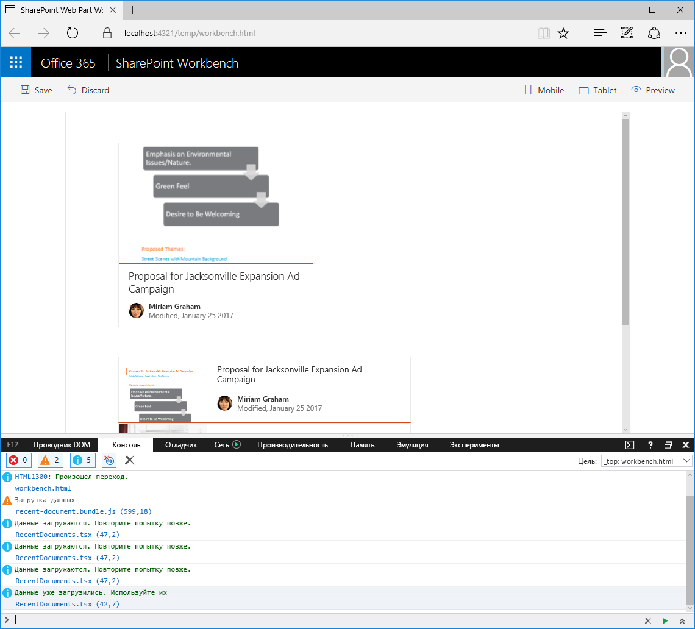

<span data-ttu-id="58b94-p128">После загрузки данные хранятся в глобальной переменной **loadedData**. Для переменной **loadingData** задается значение **false**, а обещание разрешается с помощью полученных данных. В следующий раз, когда веб-часть запросит свои данные, служба данных вернет ранее загруженные данные, не совершая никаких запросов к удаленным API.</span><span class="sxs-lookup"><span data-stu-id="58b94-p128">Once the data is loaded, it is stored in the **loadedData** global variable. The value of the **loadingData** variable is set to **false** and the promise is resolved with the retrieved data. The next time a web part requests its data, the data service will return the data loaded previously eliminating any requests to the remote APIs.</span></span>

После загрузки данные хранятся в глобальной переменной **loadedData**. Для переменной **loadingData** задается значение **false**, а обещание разрешается с помощью полученных данных. В следующий раз, когда веб-часть запросит свои данные, служба данных вернет ранее загруженные данные, не совершая никаких запросов к удаленным API.

<span data-ttu-id="58b94-264">Убедитесь, что обе веб-части работают надлежащим образом. Для этого выполните следующую команду:</span><span class="sxs-lookup"><span data-stu-id="58b94-264">Confirm, that both web parts are working correctly, by running the following command:</span></span>

```sh
gulp serve
```


<span data-ttu-id="58b94-266">Если добавить операторы ведения журнала в разных частях метода **DocumentsService.ensureRecentDocuments**, вы увидите, что данные загружаются один раз, после чего используются повторно.</span><span class="sxs-lookup"><span data-stu-id="58b94-266">If you added logging statements in the different parts of the **DocumentsService.ensureRecentDocuments** method, you would see, that the data is loaded once and reused for the second web part.</span></span>



## <a name="see-also"></a><span data-ttu-id="58b94-268">См. также</span><span class="sxs-lookup"><span data-stu-id="58b94-268">See also</span></span>

- [<span data-ttu-id="58b94-269">Совместное использование данных клиентскими веб-частями</span><span class="sxs-lookup"><span data-stu-id="58b94-269">Share data between client-side web parts</span></span>](./share-data-between-web-parts)