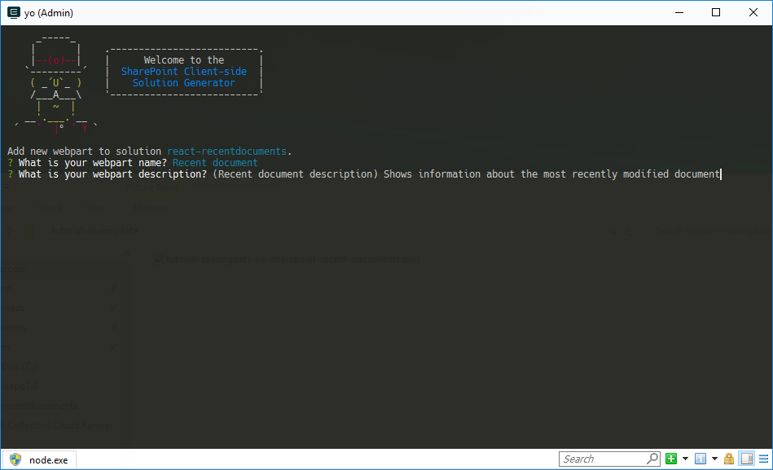

# <a name="share-data-between-web-parts-using-a-global-variable-tutorial"></a>Совместное использование данных разными веб-частями с применением глобальной переменной (руководство)

> Примечание. Эта статья еще не была проверена на общедоступной версии SPFx, поэтому у вас могут возникнуть трудности при использовании последнего выпуска.

При создании клиентских веб-частей можно загрузить данные один раз и повторно использовать их в разных веб-частях. Это ускорит загрузку страниц и уменьшит нагрузку на сеть. В этом пошаговом руководстве показано, как веб-части могут совместно использовать данные с помощью глобальной переменной.

> **Примечание.** Прежде чем выполнять действия, описанные в этой статье, [настройте среду разработки клиентских веб-частей для SharePoint](../../set-up-your-development-environment.md).

## <a name="prepare-the-project"></a>Подготовка проекта

### <a name="create-a-new-project"></a>Создание проекта

С помощью командной строки создайте папку для проекта:

```sh
md react-recentdocuments
```

Перейдите в папку проекта.

```sh
cd react-recentdocuments
```

В папке проекта запустите генератор Yeoman для SharePoint Framework, чтобы сформировать шаблон проекта на платформе SharePoint Framework:

```sh
yo @microsoft/sharepoint
```

Когда появится соответствующий запрос, укажите следующие значения:

- **WebPart** в качестве типа создаваемого клиентского компонента;
- **react-recentdocuments** в качестве имени решения;
- **Use the current folder** (Использовать текущую папку) в качестве расположения файлов;
- **Recent documents** (Последние документы) в качестве имени веб-части;
- **Shows recently modified documents** (Показывает недавно измененные документы) в качестве описания веб-части;
- **React** в качестве используемой платформы.


После завершения скаффолдинга заблокируйте версию зависимостей проекта, выполнив следующую команду:

```sh
npm shrinkwrap
```

Далее откройте папку проекта в редакторе кода. В этой статье в инструкциях и на снимках экрана указан Visual Studio Code, но вы можете использовать любой редактор.


## <a name="show-the-recently-modified-documents"></a>Отображение недавно измененных документов

Веб-часть Recent documents (Последние документы) показывает сведения о последних измененных документах в виде карточек, используя Office UI Fabric.


### <a name="remove-the-standard-description-property"></a>Удаление стандартного свойства _description_

Для начала удалите стандартное свойство `description` из интерфейса `IRecentDocumentsWebPartProps`. В редакторе кода откройте файл **./src/webparts/recentDocuments/IRecentDocumentsWebPartProps.ts** и вставьте следующий код:

```ts
export interface IRecentDocumentsWebPartProps {
}
```

Удалите стандартное свойство `description` из манифеста веб-части. Откройте файл **./src/webparts/recentDocuments/RecentDocumentsWebPart.manifest.json** и удалите из свойства `properties` свойство `description`:

```json
{
  "$schema": "../../../node_modules/@microsoft/sp-module-interfaces/lib/manifestSchemas/jsonSchemas/clientSideComponentManifestSchema.json",

  "id": "7a7e3aa9-5d8a-4155-936b-0b0e06e9ca11",
  "alias": "RecentDocumentsWebPart",
  "componentType": "WebPart",
  "version": "0.0.1",
  "manifestVersion": 2,

  "preconfiguredEntries": [{
    "groupId": "7a7e3aa9-5d8a-4155-936b-0b0e06e9ca11",
    "group": { "default": "Under Development" },
    "title": { "default": "Recent documents" },
    "description": { "default": "Shows recently modified documents" },
    "officeFabricIconFontName": "Page",
    "properties": {
    }
  }]
}
```

Наконец удалите стандартное свойство `description` из веб-части. Откройте в редакторе кода файл **./src/webparts/recentDocuments/RecentDocumentsWebPart.ts**. Замените метод `render` на следующий код:

```ts
export default class RecentDocumentsWebPart extends BaseClientSideWebPart<IRecentDocumentsWebPartProps> {
  // ...
  public render(): void {
    const element: React.ReactElement<IRecentDocumentsProps > = React.createElement(
      RecentDocuments,
      {
      }
    );

    ReactDom.render(element, this.domElement);
  }
  // ...
}
```

Затем замените метод `getPropertyPaneConfiguration` на следующий код:

```ts
export default class RecentDocumentsWebPart extends BaseClientSideWebPart<IRecentDocumentsWebPartProps> {
  // ...

  protected getPropertyPaneConfiguration(): IPropertyPaneConfiguration {
    return {
      pages: [
        {
          header: {
            description: strings.PropertyPaneDescription
          },
          groups: [
            {
              groupName: strings.BasicGroupName,
              groupFields: []
            }
          ]
        }
      ]
    };
  }
}
```

### <a name="create-the-idocumentactivity-interface"></a>Создание интерфейса IDocumentActivity

В папке **./src/webparts/recentDocuments** создайте файл с именем **IDocumentActivity.ts** и вставьте следующий код:

```ts
export interface IDocumentActivity {
    title: string;
    actorName: string;
    actorImageUrl: string;
}
```

Этот интерфейс используется для отображения сведений о действиях с определенным документом на карточке.

### <a name="create-the-idocument-interface"></a>Создание интерфейса IDocument

В папке **./src/webparts/recentDocuments** создайте файл с именем **IDocument.ts** и вставьте следующий код:

```ts
import { IDocumentActivity } from './IDocumentActivity';

export interface IDocument {
    title: string;
    url: string;
    imageUrl: string;
    iconUrl: string;
    activity: IDocumentActivity;
}
```

Этот интерфейс представляет документ со всей необходимой информацией для отображения документа в качестве карточки.

### <a name="show-recent-documents-in-the-recentdocuments-react-component"></a>Отображение последних документов в компоненте React RecentDocuments

Добавьте свойство **documents** к интерфейсу **IRecentDocumentsProps**. В редакторе кода откройте файл **./src/webparts/recentDocuments/components/IRecentDocumentsProps.ts** и вставьте следующий код:

```ts
import { IDocument } from '../IDocument';

export interface IRecentDocumentsProps {
  documents: IDocument[];
}
```

В редакторе кода откройте файл **./src/webparts/recentDocuments/components/RecentDocuments.tsx** и вставьте следующий код:

```tsx
import * as React from 'react';
import {
  DocumentCard,
  DocumentCardType,
  DocumentCardPreview,
  DocumentCardTitle,
  DocumentCardActivity
} from 'office-ui-fabric-react';
import { IDocument } from '../IDocument';
import styles from './RecentDocuments.module.scss';
import { IRecentDocumentsProps } from './IRecentDocumentsProps';

export default class RecentDocuments extends React.Component<IRecentDocumentsProps, void> {
  public render(): React.ReactElement<IRecentDocumentsProps> {
    const documents: JSX.Element[] = this.props.documents.map((document: IDocument, index: number, array: IDocument[]): JSX.Element => {
      return (
        <DocumentCard type={DocumentCardType.compact} onClickHref={document.url} accentColor='#ce4b1f' key={index}>
          <DocumentCardPreview previewImages={[{
            name: document.title,
            url: document.url,
            previewImageSrc: document.imageUrl,
            iconSrc: document.iconUrl,
            width: 144
          }]} />
          <div className='ms-DocumentCard-details'>
            <DocumentCardTitle
              title={document.title}
              shouldTruncate={true} />
            <DocumentCardActivity
              activity={document.activity.title}
              people={
                [
                  { name: document.activity.actorName, profileImageSrc: document.activity.actorImageUrl }
                ]
              }
              />
          </div>
        </DocumentCard>
      );
    });
    return (
      <div className={styles.helloWorld}>
        {documents}
      </div>
    );
  }
}
```

Для начала компонент просматривает документы, переданные с помощью свойства `documents`. Для каждого документа он создает [карточку документа Office UI Fabric](https://dev.office.com/fabric#/components/documentcard), заполняя ее свойства соответствующими сведениями о конкретном документе. После создания карточек для всех документов компонент добавляет их в основной текст и возвращает полную разметку.

### <a name="load-the-information-about-the-recent-documents"></a>Загрузка сведений о последних документах

В этом примере сведения о недавно измененных документах загружаются из статического набора данных. Однако вы легко можете изменить эту реализацию, чтобы данные загружались из библиотеки документов SharePoint.

В редакторе кода откройте файл **./src/webparts/recentDocuments/RecentDocumentsWebPart.ts**. Добавьте оператор импорта для интерфейса `IDocument` после других операторов импорта в начале файла, используя следующий код:

```ts
import { IDocument } from './IDocument';
```

В классе `RecentDocumentsWebPart` добавьте новую частную переменную с именем `documents`, используя следующий код:

```ts
export default class RecentDocumentsWebPart extends BaseClientSideWebPart<IRecentDocumentsWebPartProps> {
    private static documents: IDocument[] = [
        {
            title: 'Proposal for Jacksonville Expansion Ad Campaign',
            url: 'https://contoso-my.sharepoint.com/personal/miriamg_contoso_onmicrosoft_com/_layouts/15/WopiFrame.aspx?sourcedoc=%7BCBF65183-0378-485B-AB67-791E0FC81D72%7D&file=Jacksonville%20Ad%20Campaign%20(draft).docx&action=view&DefaultItemOpen=1',
            imageUrl: 'https://contoso-my.sharepoint.com/_layouts/15/getpreview.ashx?guidSite=ca6fa69c-347d-4c07-886c-67105dc5a357&guidWeb=237a3f3f-59a4-46e8-b0a8-6effd78bd327&guidFile=%7BCBF65183-0378-485B-AB67-791E0FC81D72%7D&docId=17592965474834&metadataToken=&clienttype=DelveWebHomeFeed',
            iconUrl: '',
            activity: {
                title: 'Modified, January 25 2017',
                actorName: 'Miriam Graham',
                actorImageUrl: 'https://contoso-my.sharepoint.com/_vti_bin/DelveApi.ashx/people/profileimage?userId=miriamg@contoso.onmicrosoft.com&size=L'
            }
        },
        {
            title: 'Customer Feedback for ZT1000',
            url: 'https://contoso-my.sharepoint.com/personal/miriamg_contoso_onmicrosoft_com/_layouts/15/WopiFrame.aspx?sourcedoc=%7B5449CE24-BFB7-442E-843D-E0C86CEB71CC%7D&file=Customer%20Feedback%20for%20ZT1000.pptx&action=view&DefaultItemOpen=1',
            imageUrl: 'https://contoso-my.sharepoint.com/_layouts/15/getpreview.ashx?guidSite=ca6fa69c-347d-4c07-886c-67105dc5a357&guidWeb=237a3f3f-59a4-46e8-b0a8-6effd78bd327&guidFile=%7B5449CE24-BFB7-442E-843D-E0C86CEB71CC%7D&docId=17592968714930&metadataToken=&clienttype=DelveWebHomeFeed',
            iconUrl: '',
            activity: {
                title: 'Modified, January 23 2017',
                actorName: 'Miriam Graham',
                actorImageUrl: 'https://contoso-my.sharepoint.com/_vti_bin/DelveApi.ashx/people/profileimage?userId=miriamg@contoso.onmicrosoft.com&size=L'
            }
        },
        {
            title: 'Asia Q3 Marketing Overview',
            url: 'https://contoso-my.sharepoint.com/personal/alexw_contoso_onmicrosoft_com/_layouts/15/WopiFrame.aspx?sourcedoc=%7BFD077A94-AB7D-45F9-A810-36229E518A94%7D&file=Asia%20Q3%20Marketing%20Overview%20Beta.pptx&action=view&DefaultItemOpen=1',
            imageUrl: 'https://contoso-my.sharepoint.com/_layouts/15/getpreview.ashx?guidSite=18231116-2bf0-474c-93ee-eb362681b293&guidWeb=237a3f3f-59a4-46e8-b0a8-6effd78bd327&guidFile=%7BFD077A94-AB7D-45F9-A810-36229E518A94%7D&docId=17592969984791&metadataToken=&clienttype=DelveWebHomeFeed',
            iconUrl: '',
            activity: {
                title: 'Modified, January 23 2017',
                actorName: 'Alex Wilber',
                actorImageUrl: 'https://contoso-my.sharepoint.com/_vti_bin/DelveApi.ashx/people/profileimage?userId=alexw@contoso.onmicrosoft.com&size=L'
            }
        },
        {
            title: 'Trey Research Business Development Plan',
            url: 'https://contoso.sharepoint.com/sites/contoso/Resources/Document%20Center/_layouts/15/WopiFrame.aspx?sourcedoc=%7B743A6C44-D3F8-4ECC-A1B7-EA9844911314%7D&file=Trey%20Research%20Business%20Development%20Plan.pptx&action=view&DefaultItemOpen=1',
            imageUrl: 'https://contoso-my.sharepoint.com/_layouts/15/getpreview.ashx?guidSite=923a6ce1-7b67-4bd0-a59f-89d37f233804&guidWeb=c12486eb-661c-46c7-baba-073a8a45b610&guidFile=%7B743A6C44-D3F8-4ECC-A1B7-EA9844911314%7D&docId=265998788&metadataToken=&clienttype=DelveWebHomeFeed',
            iconUrl: '',
            activity: {
                title: 'Modified, January 15 2017',
                actorName: 'Alex Wilber',
                actorImageUrl: 'https://contoso-my.sharepoint.com/_vti_bin/DelveApi.ashx/people/profileimage?userId=alexw@contoso.onmicrosoft.com&size=L'
            }
        },
        {
            title: 'XT1000 Marketing Analysis',
            url: 'https://contoso-my.sharepoint.com/personal/henriettam_contoso_onmicrosoft_com/_layouts/15/WopiFrame.aspx?sourcedoc=%7BA8B9F935-E5A1-47AD-B052-D5ED30E682AB%7D&file=XT1000%20Marketing%20Analysis.pptx&action=view&DefaultItemOpen=1',
            imageUrl: 'https://contoso-my.sharepoint.com/_layouts/15/getpreview.ashx?guidSite=b187e1dd-7687-49e0-87ff-6250e61e56ac&guidWeb=237a3f3f-59a4-46e8-b0a8-6effd78bd327&guidFile=%7BA8B9F935-E5A1-47AD-B052-D5ED30E682AB%7D&docId=17592963604695&metadataToken=&clienttype=DelveWebHomeFeed',
            iconUrl: '',
            activity: {
                title: 'Modified, December 15 2016',
                actorName: 'Henrietta Mueller',
                actorImageUrl: 'https://contoso-my.sharepoint.com/_vti_bin/DelveApi.ashx/people/profileimage?userId=henriettam@contoso.onmicrosoft.com&size=L'
            }
        }
    ];

    // ...
}
```

Измените метод `render`, чтобы он загружал и отображал сведения о недавно измененных документах:

```ts
export default class RecentDocumentsWebPart extends BaseClientSideWebPart<IRecentDocumentsWebPartProps> {
  // ...
  public render(): void {
    this.context.statusRenderer.displayLoadingIndicator(this.domElement, 'documents');

    window.setTimeout((): void => {
      const element: React.ReactElement<IRecentDocumentsProps> = React.createElement(
        RecentDocuments,
        {
          documents: RecentDocumentsWebPart.documents.slice(0, 3)
        }
      );

      this.context.statusRenderer.clearLoadingIndicator(this.domElement);
      ReactDom.render(element, this.domElement);
    }, 300);
  }
  // ...
}
```

Убедитесь, что веб-часть работает надлежащим образом и отображает сведения о трех последних измененных документах. Для этого с помощью командной строки выполните в каталоге проекта следующую команду:

```sh
gulp serve
```

Добавьте веб-часть Recent Documents (Последние документы) на холст рабочего места SharePoint.


## <a name="show-the-most-recently-modified-document"></a>Отображение последнего измененного документа

В веб-части Recent document (Последний документ) отображаются сведения о последнем измененном документе.


### <a name="add-the-second-web-part"></a>Добавление второй веб-части

Чтобы продемонстрировать совместное использование данных разными веб-частями, добавьте к проекту вторую веб-часть.

С помощью командной строки запустите в папке проекта генератор Yeoman для SharePoint Framework.

```sh
yo @microsoft/sharepoint
```

Когда появится соответствующий запрос, укажите следующие значения:


- **WebPart** в качестве типа создаваемого клиентского компонента;
- **Recent document** (Последний документ) в качестве имени веб-части;
- **Shows information about the most recently modified document** (Показывает сведения о последнем измененном документе) в качестве описания веб-части.



### <a name="remove-the-standard-description-property"></a>Удаление стандартного свойства _description_

Для начала удалите свойство `description` из интерфейса `IRecentDocumentWebPartProps`. В редакторе кода откройте файл **./src/webparts/recentDocument/IRecentDocumentWebPartProps.ts** и вставьте следующий код:

```ts
export interface IRecentDocumentWebPartProps {
}
```

Удалите стандартное свойство `description` из манифеста веб-части. Откройте файл **./src/webparts/recentDocument/RecentDocumentWebPart.manifest.json** и удалите из свойства `properties` свойство `description`:

```json
{
  "$schema": "../../../node_modules/@microsoft/sp-module-interfaces/lib/manifestSchemas/jsonSchemas/clientSideComponentManifestSchema.json",

  "id": "71a6f643-1ac1-47ee-a9f1-502ef52f26d4",
  "alias": "RecentDocumentWebPart",
  "componentType": "WebPart",
  "version": "0.0.1",
  "manifestVersion": 2,

  "preconfiguredEntries": [{
    "groupId": "71a6f643-1ac1-47ee-a9f1-502ef52f26d4",
    "group": { "default": "Under Development" },
    "title": { "default": "Recent document" },
    "description": { "default": "Shows information about the most recently modified document" },
    "officeFabricIconFontName": "Page",
    "properties": {
    }
  }]
}
```

Наконец, удалите стандартное свойство `description` из области свойств веб-части. Откройте в редакторе кода файл **./src/webparts/recentDocument/RecentDocumentWebPart.ts**. Замените метод `render` на следующий код:

```ts
export default class RecentDocumentWebPart extends BaseClientSideWebPart<IRecentDocumentWebPartProps> {
  // ...
  public render(): void {
    const element: React.ReactElement<IRecentDocumentProps> = React.createElement(
      RecentDocument,
      {
      }
    );

    ReactDom.render(element, this.domElement);
  }
  // ...
}
```

Затем замените метод `getPropertyPaneConfiguration` на следующий код:

```ts
export default class RecentDocumentWebPart extends BaseClientSideWebPart<IRecentDocumentWebPartProps> {
  // ...

  protected getPropertyPaneConfiguration(): IPropertyPaneConfiguration {
    return {
      pages: [
        {
          header: {
            description: strings.PropertyPaneDescription
          },
          groups: [
            {
              groupName: strings.BasicGroupName,
              groupFields: []
            }
          ]
        }
      ]
    };
  }
}
```

### <a name="reuse-the-idocument-and-idocumentactivity-interfaces"></a>Повторное использование интерфейсов _IDocument_ и _IDocumentActivity_

Веб-части Recent document (Последний документ) и Recent documents (Последние документы) отображают сведения о последнем измененном документе по-разному, но они используют одну и ту же структуру данных для представления документа. Вместо того чтобы дублировать интерфейсы `IDocument` и `IDocumentActivity`, вы можете использовать их в обеих веб-частях.

В Visual Studio Code откройте область обозревателя и в папке **./src/webparts/recentDocuments** переместите файлы **IDocument.ts** и **IDocumentActivity.ts** на один уровень выше, в папку **./src/webparts**.


#### <a name="update-references-to-the-moved-files"></a>Обновление ссылок на перемещенные файлы

Переместив файлы в другую папку проекта, необходимо обновить пути в ссылках на них.

В редакторе кода откройте файл **./src/webparts/recentDocuments/components/IRecentDocumentsProps.ts** и измените его код на следующий:

```ts
import { IDocument } from '../../IDocument';

export interface IRecentDocumentsProps {
  documents: IDocument[];
}
```

Затем откройте файл **./src/webparts/recentDocuments/components/RecentDocuments.tsx** и замените оператор `import` в интерфейсе `IDocument` на следующий код:

```ts
import { IDocument } from '../../IDocument';
```

Наконец, откройте файл **./src/webparts/recentDocuments/RecentDocumentsWebPart.ts** и замените оператор `import` в интерфейсе `IDocument` на следующий код:

```ts
import { IDocument } from '../IDocument';
```

### <a name="show-the-most-recent-document-in-the-recentdocument-react-component"></a>Отображение последнего документа в компоненте React RecentDocument

Добавьте свойство `document` к интерфейсу `IRecentDocumentProps`. В редакторе кода откройте файл **./src/webparts/recentDocument/components/IRecentDocumentProps.ts** и вставьте следующий код:

```ts
import { IDocument } from '../../IDocument';

export interface IRecentDocumentProps {
  document: IDocument;
}
```

В редакторе кода откройте файл **./src/webparts/recentDocument/components/RecentDocument.tsx** и вставьте следующий код:

```tsx
import * as React from 'react';
import {
  DocumentCard,
  DocumentCardPreview,
  DocumentCardTitle,
  DocumentCardActivity,
  ImageFit
} from 'office-ui-fabric-react';
import { IDocument } from '../../IDocument';
import styles from './RecentDocument.module.scss';
import { IRecentDocumentProps } from './IRecentDocumentProps';

export default class RecentDocument extends React.Component<IRecentDocumentProps, void> {
  public render(): React.ReactElement<IRecentDocumentProps> {
    const document: IDocument = this.props.document;

    return (
      <div className={styles.helloWorld}>
        <DocumentCard onClickHref={document.url}>
          <DocumentCardPreview previewImages={[{
            name: document.title,
            url: document.url,
            previewImageSrc: document.imageUrl,
            iconSrc: document.iconUrl,
            imageFit: ImageFit.cover,
            width: 318,
            height: 196,
            accentColor: '#ce4b1f'
          }]} />
          <DocumentCardTitle
            title={document.title}
            shouldTruncate={true} />
          <DocumentCardActivity
            activity={document.activity.title}
            people={
              [
                { name: document.activity.actorName, profileImageSrc: document.activity.actorImageUrl }
              ]
            }
            />
        </DocumentCard>
      </div>
    );
  }
}
```

Компонент React `RecentDocument` использует сведения о последнем измененном документе, переданные в свойстве `document`, и отображает с их помощью карточки документа Office UI Fabric.

### <a name="load-the-information-about-the-recent-document"></a>Загрузка сведений о последнем документе

В этом примере сведения о последнем измененном документе загружаются из статического набора данных. Однако вы легко можете изменить эту реализацию, чтобы данные загружались из библиотеки документов SharePoint.

В редакторе кода откройте файл **./src/webparts/recentDocument/RecentDocumentWebPart.ts**. Добавьте оператор импорта для интерфейса `IDocument` после других операторов импорта в начале файла, используя следующий код:

```ts
import { IDocument } from '../IDocument';
```

В классе `RecentDocumentWebPart` добавьте новую частную переменную с именем `document`, используя следующий код:

```ts
export default class RecentDocumentWebPart extends BaseClientSideWebPart<IRecentDocumentWebPartProps> {
    private static document: IDocument = {
        title: 'Proposal for Jacksonville Expansion Ad Campaign',
        url: 'https://contoso-my.sharepoint.com/personal/miriamg_contoso_onmicrosoft_com/_layouts/15/WopiFrame.aspx?sourcedoc=%7BCBF65183-0378-485B-AB67-791E0FC81D72%7D&file=Jacksonville%20Ad%20Campaign%20(draft).docx&action=view&DefaultItemOpen=1',
        imageUrl: 'https://contoso-my.sharepoint.com/_layouts/15/getpreview.ashx?guidSite=ca6fa69c-347d-4c07-886c-67105dc5a357&guidWeb=237a3f3f-59a4-46e8-b0a8-6effd78bd327&guidFile=%7BCBF65183-0378-485B-AB67-791E0FC81D72%7D&docId=17592965474834&metadataToken=&clienttype=DelveWebHomeFeed',
        iconUrl: '',
        activity: {
            title: 'Modified, January 25 2017',
            actorName: 'Miriam Graham',
            actorImageUrl: 'https://contoso-my.sharepoint.com/_vti_bin/DelveApi.ashx/people/profileimage?userId=miriamg@contoso.onmicrosoft.com&size=L'
        }
    };

    // ...
}
```

Измените метод `render`, чтобы он загружал и отображал сведения о последнем измененном документе:

```ts
export default class RecentDocumentsWebPart extends BaseClientSideWebPart<IRecentDocumentsWebPartProps> {
  // ...
  public render(): void {
    this.context.statusRenderer.displayLoadingIndicator(this.domElement, 'documents');

    window.setTimeout((): void => {
      const element: React.ReactElement<IRecentDocumentProps> = React.createElement(
        RecentDocument,
        {
          document: RecentDocumentWebPart.document
        }
      );

      this.context.statusRenderer.clearLoadingIndicator(this.domElement);
      ReactDom.render(element, this.domElement);
    }, 300);
  }
  // ...
}
```

Убедитесь, что веб-часть работает надлежащим образом и отображает сведения о последнем измененном документе. Для этого с помощью командной строки выполните в папке проекта следующую команду:

```sh
gulp serve
```

Добавьте веб-часть Recent document (Последний документ) на холст рабочего места SharePoint.


Текущая реализация — типичный пример независимой разработки двух веб-частей. Если они обе располагаются на одной странице и загружают данные из SharePoint, то для получения похожих сведений приходится выполнять два отдельных запроса. Если в тот или иной момент вам потребуется изменить источник, из которого загружаются данные о недавно измененных документах, то придется обновлять обе веб-части. Чтобы ускорить загрузку страницы и упростить работу с кодом веб-части, вы можете централизовать логику получения данных и сделать однажды полученные данные доступными обеим веб-частям.

## <a name="centralize-loading-data"></a>Централизованная загрузка данных

Чтобы централизовать загрузку сведений о недавно измененных документах, создайте службу, на которую будут ссылаться обе веб-части.

### <a name="move-the-data-model-interfaces"></a>Перемещение интерфейсов модели данных

Создайте в папке проекта путь **./src/services/documentsService**. Переместите файлы **IDocument.ts** и **IDocumentActivity.ts** из папки **./src/webparts** в папку **./src/services/documentsService**.


### <a name="build-the-data-access-service"></a>Создание службы доступа к данным

В папке **./src/services/documentsService** создайте файл с именем **DocumentsService.ts** и вставьте следующий код:

```ts
import { IDocument } from './IDocument';

export class DocumentsService {
    private static documents: IDocument[] = [
        {
            title: 'Proposal for Jacksonville Expansion Ad Campaign',
            url: 'https://contoso-my.sharepoint.com/personal/miriamg_contoso_onmicrosoft_com/_layouts/15/WopiFrame.aspx?sourcedoc=%7BCBF65183-0378-485B-AB67-791E0FC81D72%7D&file=Jacksonville%20Ad%20Campaign%20(draft).docx&action=view&DefaultItemOpen=1',
            imageUrl: 'https://contoso-my.sharepoint.com/_layouts/15/getpreview.ashx?guidSite=ca6fa69c-347d-4c07-886c-67105dc5a357&guidWeb=237a3f3f-59a4-46e8-b0a8-6effd78bd327&guidFile=%7BCBF65183-0378-485B-AB67-791E0FC81D72%7D&docId=17592965474834&metadataToken=&clienttype=DelveWebHomeFeed',
            iconUrl: '',
            activity: {
                title: 'Modified, January 25 2017',
                actorName: 'Miriam Graham',
                actorImageUrl: 'https://contoso-my.sharepoint.com/_vti_bin/DelveApi.ashx/people/profileimage?userId=miriamg@contoso.onmicrosoft.com&size=L'
            }
        },
        {
            title: 'Customer Feedback for ZT1000',
            url: 'https://contoso-my.sharepoint.com/personal/miriamg_contoso_onmicrosoft_com/_layouts/15/WopiFrame.aspx?sourcedoc=%7B5449CE24-BFB7-442E-843D-E0C86CEB71CC%7D&file=Customer%20Feedback%20for%20ZT1000.pptx&action=view&DefaultItemOpen=1',
            imageUrl: 'https://contoso-my.sharepoint.com/_layouts/15/getpreview.ashx?guidSite=ca6fa69c-347d-4c07-886c-67105dc5a357&guidWeb=237a3f3f-59a4-46e8-b0a8-6effd78bd327&guidFile=%7B5449CE24-BFB7-442E-843D-E0C86CEB71CC%7D&docId=17592968714930&metadataToken=&clienttype=DelveWebHomeFeed',
            iconUrl: '',
            activity: {
                title: 'Modified, January 23 2017',
                actorName: 'Miriam Graham',
                actorImageUrl: 'https://contoso-my.sharepoint.com/_vti_bin/DelveApi.ashx/people/profileimage?userId=miriamg@contoso.onmicrosoft.com&size=L'
            }
        },
        {
            title: 'Asia Q3 Marketing Overview',
            url: 'https://contoso-my.sharepoint.com/personal/alexw_contoso_onmicrosoft_com/_layouts/15/WopiFrame.aspx?sourcedoc=%7BFD077A94-AB7D-45F9-A810-36229E518A94%7D&file=Asia%20Q3%20Marketing%20Overview%20Beta.pptx&action=view&DefaultItemOpen=1',
            imageUrl: 'https://contoso-my.sharepoint.com/_layouts/15/getpreview.ashx?guidSite=18231116-2bf0-474c-93ee-eb362681b293&guidWeb=237a3f3f-59a4-46e8-b0a8-6effd78bd327&guidFile=%7BFD077A94-AB7D-45F9-A810-36229E518A94%7D&docId=17592969984791&metadataToken=&clienttype=DelveWebHomeFeed',
            iconUrl: '',
            activity: {
                title: 'Modified, January 23 2017',
                actorName: 'Alex Wilber',
                actorImageUrl: 'https://contoso-my.sharepoint.com/_vti_bin/DelveApi.ashx/people/profileimage?userId=alexw@contoso.onmicrosoft.com&size=L'
            }
        },
        {
            title: 'Trey Research Business Development Plan',
            url: 'https://contoso.sharepoint.com/sites/contoso/Resources/Document%20Center/_layouts/15/WopiFrame.aspx?sourcedoc=%7B743A6C44-D3F8-4ECC-A1B7-EA9844911314%7D&file=Trey%20Research%20Business%20Development%20Plan.pptx&action=view&DefaultItemOpen=1',
            imageUrl: 'https://contoso-my.sharepoint.com/_layouts/15/getpreview.ashx?guidSite=923a6ce1-7b67-4bd0-a59f-89d37f233804&guidWeb=c12486eb-661c-46c7-baba-073a8a45b610&guidFile=%7B743A6C44-D3F8-4ECC-A1B7-EA9844911314%7D&docId=265998788&metadataToken=&clienttype=DelveWebHomeFeed',
            iconUrl: '',
            activity: {
                title: 'Modified, January 15 2017',
                actorName: 'Alex Wilber',
                actorImageUrl: 'https://contoso-my.sharepoint.com/_vti_bin/DelveApi.ashx/people/profileimage?userId=alexw@contoso.onmicrosoft.com&size=L'
            }
        },
        {
            title: 'XT1000 Marketing Analysis',
            url: 'https://contoso-my.sharepoint.com/personal/henriettam_contoso_onmicrosoft_com/_layouts/15/WopiFrame.aspx?sourcedoc=%7BA8B9F935-E5A1-47AD-B052-D5ED30E682AB%7D&file=XT1000%20Marketing%20Analysis.pptx&action=view&DefaultItemOpen=1',
            imageUrl: 'https://contoso-my.sharepoint.com/_layouts/15/getpreview.ashx?guidSite=b187e1dd-7687-49e0-87ff-6250e61e56ac&guidWeb=237a3f3f-59a4-46e8-b0a8-6effd78bd327&guidFile=%7BA8B9F935-E5A1-47AD-B052-D5ED30E682AB%7D&docId=17592963604695&metadataToken=&clienttype=DelveWebHomeFeed',
            iconUrl: '',
            activity: {
                title: 'Modified, December 15 2016',
                actorName: 'Henrietta Mueller',
                actorImageUrl: 'https://contoso-my.sharepoint.com/_vti_bin/DelveApi.ashx/people/profileimage?userId=henriettam@contoso.onmicrosoft.com&size=L'
            }
        }
    ];

    public static getRecentDocument(): Promise<IDocument> {
        return new Promise<IDocument>((resolve: (document: IDocument) => void, reject: (error: any) => void): void => {
            window.setTimeout((): void => {
                resolve(DocumentsService.documents[0]);
            }, 300);
        });
    }

    public static getRecentDocuments(startFrom: number = 0): Promise<IDocument[]> {
        return new Promise<IDocument[]>((resolve: (documents: IDocument[]) => void, reject: (error: any) => void): void => {
            window.setTimeout((): void => {
                resolve(DocumentsService.documents.slice(startFrom, startFrom + 3));
            }, 300);
        });
    }
}
```

Класс `DocumentsService` — это пример службы, загружающей сведения о последних документах. В этом примере используется статический набор данных, но вы легко можете изменить его реализацию, чтобы данные загружались из библиотеки документов SharePoint. На этом этапе класс `DocumentsService` уже предоставляет центральную точку доступа к данным для всех веб-частей, но еще не сохраняет ранее загруженные данные. Эту возможность мы реализуем позже.

### <a name="create-a-barrel-for-the-service-files"></a>Создание блока данных для системных файлов

Ссылаясь на файлы в проекте, вы указываете относительный путь. При изменении этого пути потребуется обновить все ссылки на соответствующий файл. Такие изменения очень вероятны на раннем этапе разработки, когда добавляются различные элементы, а окончательная структура проекта еще не определена. Во избежание частых изменений ссылок на файлы в проекте вы можете использовать блоки данных.

Блок данных — это контейнер, объединяющий ряд экспортированных объектов. С их помощью вы можете абстрагировать точное расположение файлов от других элементов проекта, использующих их.

В папке **./src/services/documentsService** создайте файл с именем **index.ts** и вставьте следующий код:

```ts
export { IDocument } from './IDocument';
export { IDocumentActivity } from './IDocumentActivity';
export { DocumentsService } from './DocumentsService';
```

После определения блока данных другие элементы проекта смогут ссылаться на любой из экспортированных типов по относительному пути к папке **./src/services/documentsService**, а не точному пути к отдельному файлу. Например, ссылка на интерфейс `IDocument` может быть такой:

```ts
import { IDocument } from '../services/documentsService';
```

а не такой:

```ts
import { IDocument } from '../services/documentsService/IDocument.ts';
```

Если в тот или иной момент вы решите, что предпочтительней переместить файл **IDocument.ts** во вложенную папку или объединить несколько файлов, изменить потребуется только путь к определению блока данных (**./src/services/documentsService/index.ts**). Все элементы проекта по-прежнему могут использовать тот же относительный путь к папке **documentsService**, чтобы ссылаться на интерфейс `IDocument`.

### <a name="update-references-to-the-moved-files-to-use-the-barrel"></a>Обновление ссылок на перемещенные файлы для использования блока данных

Так как вы переместили файлы **IDocument.ts** и **IDocumentActivity.ts** в другое расположение, необходимо обновить ссылки на них. Благодаря блокам данных после этого вам не придется менять эти ссылки.

#### <a name="update-references-in-the-recent-documents-web-part"></a>Обновление ссылок в веб-части Recent documents (Последние документы)

В редакторе кода откройте файл **./src/webparts/recentDocuments/components/IRecentDocumentsProps.ts** и измените его код на следующий:

```ts
import { IDocument } from '../../../services/documentsService';

export interface IRecentDocumentsProps {
  documents: IDocument[];
}
```

Затем откройте файл **./src/webparts/recentDocuments/components/RecentDocuments.tsx** и замените оператор `import` в интерфейсе `IDocument` на следующий код:

```ts
import { IDocument } from '../../../services/documentsService';
```

Затем откройте файл **./src/webparts/recentDocuments/RecentDocumentsWebPart.ts** и замените оператор `import` в интерфейсе `IDocument` на следующий код:

```ts
import { IDocument } from '../../services/documentsService';
```

#### <a name="update-references-in-the-recent-document-web-part"></a>Обновление ссылок в веб-части Recent document (Последний документ)

В редакторе кода откройте файл **./src/webparts/recentDocument/components/IRecentDocumentProps.ts** и измените его код на следующий:

```ts
import { IDocument } from '../../../services/documentsService';

export interface IRecentDocumentProps {
  document: IDocument;
}
```

Затем откройте файл **./src/webparts/recentDocument/components/RecentDocument.tsx** и измените оператор `import` в интерфейсе `IDocument` на следующий:

```ts
import { IDocument } from '../../../services/documentsService';
```

Затем откройте файл **./src/webparts/recentDocument/RecentDocumentWebPart.ts** и замените оператор `import` в интерфейсе `IDocument` на следующий:

```ts
import { IDocument } from '../../services/documentsService';
```

Убедитесь, что ваши изменения работают надлежащим образом. Для этого с помощью командной строки выполните в папке проекта следующую команду:

```sh
gulp serve
```


### <a name="load-web-part-data-using-the-data-service"></a>Загрузка данных веб-частей с помощью службы данных

Когда служба данных будет готова, необходимо выполнить рефакторинг обеих веб-частей, чтобы они загружали свои данные с помощью службы данных.

#### <a name="load-information-about-the-recently-modified-documents"></a>Загрузка информации о недавно измененных документах

Откройте в редакторе кода файл **./src/webparts/recentDocuments/RecentDocumentsWebPart.ts**. Замените оператор `import`, ссылающийся на интерфейс `IDocument`, на следующий оператор:

```ts
import { IDocument, DocumentsService } from '../../services/documentsService';
```

Затем обновите метод `render`, используя следующий код:

```ts
export default class RecentDocumentsWebPart extends BaseClientSideWebPart<IRecentDocumentsWebPartProps> {
  // ...
  public render(): void {
    this.context.statusRenderer.displayLoadingIndicator(this.domElement, 'documents');

    DocumentsService.getRecentDocuments()
      .then((documents: IDocument[]): void => {
        const element: React.ReactElement<IRecentDocumentsProps> = React.createElement(
          RecentDocuments,
          {
            documents: documents
          }
        );

        this.context.statusRenderer.clearLoadingIndicator(this.domElement);
        ReactDom.render(element, this.domElement);
      });
  }
  // ...
}
```

#### <a name="load-information-about-the-most-recently-modified-document"></a>Загрузка информации о последних измененных документах

Откройте в редакторе кода файл **./src/webparts/recentDocument/RecentDocumentWebPart.ts**. Замените оператор `import`, ссылающийся на интерфейс `IDocument`, на следующий оператор:

```ts
import { IDocument, DocumentsService } from '../../services/documentsService';
```

Затем обновите метод `render`, используя следующий код:

```ts
export default class RecentDocumentWebPart extends BaseClientSideWebPart<IRecentDocumentWebPartProps> {
  // ...
  public render(): void {
    this.context.statusRenderer.displayLoadingIndicator(this.domElement, 'document');

    DocumentsService.getRecentDocument()
      .then((document: IDocument): void => {
        const element: React.ReactElement<IRecentDocumentProps> = React.createElement(
          RecentDocument,
          {
            document: document
          }
        );

        this.context.statusRenderer.clearLoadingIndicator(this.domElement);
        ReactDom.render(element, this.domElement);
      });
  }
  // ...
}
```

Убедитесь, что обе веб-части работают надлежащим образом. Для этого с помощью командной строки выполните в папке проекта следующую команду:

```sh
gulp serve
```


### <a name="share-data-between-web-parts"></a>Совместное использование данных разными веб-частями

Теперь, когда обе веб-части загружают свои данные с помощью службы данных, необходимо расширить службу данных так, чтобы она загружала данные только один раз и использовала их для обеих веб-частей.

Откройте в редакторе кода файл **./src/services/documentsService/DocumentsService.ts** и вставьте следующий код:

```ts
import { IDocument } from './IDocument';

export class DocumentsService {
    private static documents: IDocument[] = [
        {
            title: 'Proposal for Jacksonville Expansion Ad Campaign',
            url: 'https://contoso-my.sharepoint.com/personal/miriamg_contoso_onmicrosoft_com/_layouts/15/WopiFrame.aspx?sourcedoc=%7BCBF65183-0378-485B-AB67-791E0FC81D72%7D&file=Jacksonville%20Ad%20Campaign%20(draft).docx&action=view&DefaultItemOpen=1',
            imageUrl: 'https://contoso-my.sharepoint.com/_layouts/15/getpreview.ashx?guidSite=ca6fa69c-347d-4c07-886c-67105dc5a357&guidWeb=237a3f3f-59a4-46e8-b0a8-6effd78bd327&guidFile=%7BCBF65183-0378-485B-AB67-791E0FC81D72%7D&docId=17592965474834&metadataToken=&clienttype=DelveWebHomeFeed',
            iconUrl: '',
            activity: {
                title: 'Modified, January 25 2017',
                actorName: 'Miriam Graham',
                actorImageUrl: 'https://contoso-my.sharepoint.com/_vti_bin/DelveApi.ashx/people/profileimage?userId=miriamg@contoso.onmicrosoft.com&size=L'
            }
        },
        {
            title: 'Customer Feedback for ZT1000',
            url: 'https://contoso-my.sharepoint.com/personal/miriamg_contoso_onmicrosoft_com/_layouts/15/WopiFrame.aspx?sourcedoc=%7B5449CE24-BFB7-442E-843D-E0C86CEB71CC%7D&file=Customer%20Feedback%20for%20ZT1000.pptx&action=view&DefaultItemOpen=1',
            imageUrl: 'https://contoso-my.sharepoint.com/_layouts/15/getpreview.ashx?guidSite=ca6fa69c-347d-4c07-886c-67105dc5a357&guidWeb=237a3f3f-59a4-46e8-b0a8-6effd78bd327&guidFile=%7B5449CE24-BFB7-442E-843D-E0C86CEB71CC%7D&docId=17592968714930&metadataToken=&clienttype=DelveWebHomeFeed',
            iconUrl: '',
            activity: {
                title: 'Modified, January 23 2017',
                actorName: 'Miriam Graham',
                actorImageUrl: 'https://contoso-my.sharepoint.com/_vti_bin/DelveApi.ashx/people/profileimage?userId=miriamg@contoso.onmicrosoft.com&size=L'
            }
        },
        {
            title: 'Asia Q3 Marketing Overview',
            url: 'https://contoso-my.sharepoint.com/personal/alexw_contoso_onmicrosoft_com/_layouts/15/WopiFrame.aspx?sourcedoc=%7BFD077A94-AB7D-45F9-A810-36229E518A94%7D&file=Asia%20Q3%20Marketing%20Overview%20Beta.pptx&action=view&DefaultItemOpen=1',
            imageUrl: 'https://contoso-my.sharepoint.com/_layouts/15/getpreview.ashx?guidSite=18231116-2bf0-474c-93ee-eb362681b293&guidWeb=237a3f3f-59a4-46e8-b0a8-6effd78bd327&guidFile=%7BFD077A94-AB7D-45F9-A810-36229E518A94%7D&docId=17592969984791&metadataToken=&clienttype=DelveWebHomeFeed',
            iconUrl: '',
            activity: {
                title: 'Modified, January 23 2017',
                actorName: 'Alex Wilber',
                actorImageUrl: 'https://contoso-my.sharepoint.com/_vti_bin/DelveApi.ashx/people/profileimage?userId=alexw@contoso.onmicrosoft.com&size=L'
            }
        },
        {
            title: 'Trey Research Business Development Plan',
            url: 'https://contoso.sharepoint.com/sites/contoso/Resources/Document%20Center/_layouts/15/WopiFrame.aspx?sourcedoc=%7B743A6C44-D3F8-4ECC-A1B7-EA9844911314%7D&file=Trey%20Research%20Business%20Development%20Plan.pptx&action=view&DefaultItemOpen=1',
            imageUrl: 'https://contoso-my.sharepoint.com/_layouts/15/getpreview.ashx?guidSite=923a6ce1-7b67-4bd0-a59f-89d37f233804&guidWeb=c12486eb-661c-46c7-baba-073a8a45b610&guidFile=%7B743A6C44-D3F8-4ECC-A1B7-EA9844911314%7D&docId=265998788&metadataToken=&clienttype=DelveWebHomeFeed',
            iconUrl: '',
            activity: {
                title: 'Modified, January 15 2017',
                actorName: 'Alex Wilber',
                actorImageUrl: 'https://contoso-my.sharepoint.com/_vti_bin/DelveApi.ashx/people/profileimage?userId=alexw@contoso.onmicrosoft.com&size=L'
            }
        },
        {
            title: 'XT1000 Marketing Analysis',
            url: 'https://contoso-my.sharepoint.com/personal/henriettam_contoso_onmicrosoft_com/_layouts/15/WopiFrame.aspx?sourcedoc=%7BA8B9F935-E5A1-47AD-B052-D5ED30E682AB%7D&file=XT1000%20Marketing%20Analysis.pptx&action=view&DefaultItemOpen=1',
            imageUrl: 'https://contoso-my.sharepoint.com/_layouts/15/getpreview.ashx?guidSite=b187e1dd-7687-49e0-87ff-6250e61e56ac&guidWeb=237a3f3f-59a4-46e8-b0a8-6effd78bd327&guidFile=%7BA8B9F935-E5A1-47AD-B052-D5ED30E682AB%7D&docId=17592963604695&metadataToken=&clienttype=DelveWebHomeFeed',
            iconUrl: '',
            activity: {
                title: 'Modified, December 15 2016',
                actorName: 'Henrietta Mueller',
                actorImageUrl: 'https://contoso-my.sharepoint.com/_vti_bin/DelveApi.ashx/people/profileimage?userId=henriettam@contoso.onmicrosoft.com&size=L'
            }
        }
    ];

    public static getRecentDocument(): Promise<IDocument> {
        return new Promise<IDocument>((resolve: (document: IDocument) => void, reject: (error: any) => void): void => {
            DocumentsService.ensureRecentDocuments()
                .then((recentDocuments: IDocument[]): void => {
                    resolve(recentDocuments[0]);
                });
        });
    }

    public static getRecentDocuments(startFrom: number = 0): Promise<IDocument[]> {
        return new Promise<IDocument[]>((resolve: (documents: IDocument[]) => void, reject: (error: any) => void): void => {
            DocumentsService.ensureRecentDocuments()
                .then((recentDocuments: IDocument[]): void => {
                    resolve(recentDocuments.slice(startFrom, startFrom + 3));
                });
        });
    }

    private static ensureRecentDocuments(): Promise<IDocument[]> {
        return new Promise<IDocument[]>((resolve: (recentDocuments: IDocument[]) => void, reject: (error: any) => void): void => {
            if ((window as any).loadedData) {
                // data already loaded. reuse
                resolve((window as any).loadedData);
                return;
            }

            if ((window as any).loadingData) {
                // data is being loaded. wait a moment and try again
                window.setTimeout((): void => {
                    DocumentsService.ensureRecentDocuments()
                        .then((recentDocuments: IDocument[]): void => {
                            resolve(recentDocuments);
                        });
                }, 100);
            }
            else {
                (window as any).loadingData = true;
                window.setTimeout((): void => {
                    // store the data for subsequent requests and resolve the Promise
                    (window as any).loadedData = DocumentsService.documents;
                    (window as any).loadingData = false;
                    resolve((window as any).loadedData);
                }, 300);
            }
        });
    }
}
```

Когда веб-часть впервые вызывает службу данных, чтобы загрузить свои данные, служба задает для глобальной переменной `loadingData` значение `true`. Это означает, что в данный момент данные загружаются. Это необходимо, чтобы данные не загружались несколько раз, например если другая веб-часть также запросит загрузку данных, в то время как изначальный запрос на загрузку данных еще не был выполнен. В этом примере данные загружаются из статического набора данных, но вы легко можете изменить реализацию, чтобы данные загружались из библиотеки документов SharePoint.

После загрузки данные хранятся в глобальной переменной `loadedData`. Для переменной `loadingData` задается значение `false`, а обещание разрешается с помощью полученных данных. В следующий раз, когда веб-часть запросит свои данные, служба данных вернет ранее загруженные данные, не совершая никаких дополнительных запросов к удаленным API.

Убедитесь, что обе веб-части работают надлежащим образом. Для этого с помощью командной строки выполните в папке проекта следующую команду:

```sh
gulp serve
```


Если добавить операторы ведения журнала в разных частях метода `DocumentsService.ensureRecentDocuments`, вы увидите, что данные загружаются один раз, после чего используются повторно.


## <a name="see-also"></a>См. также

- [Совместное использование данных клиентскими веб-частями](./share-data-between-web-parts.md)
