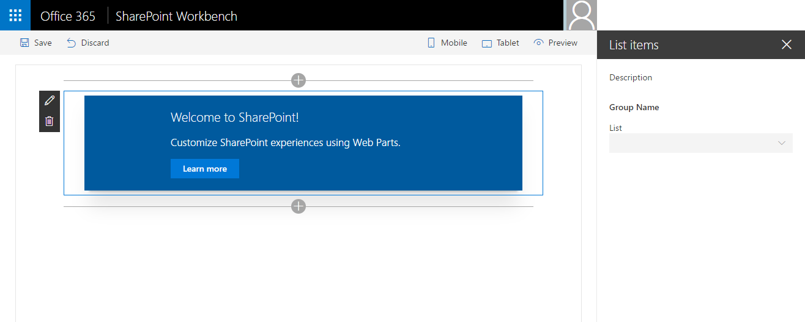

# <a name="use-cascading-dropdowns-in-web-part-properties"></a>Использование каскадных раскрывающихся меню для свойств веб-частей

При создании области свойств для клиентских веб-частей SharePoint параметры одного свойства веб-части могут отображаться с учетом значения, выбранного для другого свойства. Такое обычно происходит, если применяются каскадные раскрывающиеся меню. В этой статье описано, как создавать каскадные раскрывающиеся меню в области свойств веб-части, не создавая собственный элемент управления.


Исходный код рабочей веб-части доступен в репозитории [sp-dev-fx-webparts/samples/react-custompropertypanecontrols/](https://github.com/SharePoint/sp-dev-fx-webparts/tree/master/samples/react-custompropertypanecontrols) на сайте GitHub.

> [!NOTE] 
> Прежде чем выполнять действия, описанные в этой статье, [настройте среду разработки для создания клиентских веб-частей SharePoint](../../set-up-your-development-environment.md).

## <a name="create-new-project"></a>Создание проекта

1. Для начала создайте папку проекта:

  ```sh
  md react-cascadingdropdowns
  ```

2. Перейдите в папку проекта:

  ```sh
  cd react-cascadingdropdowns
  ```

3. В папке проекта запустите генератор Yeoman для SharePoint Framework, чтобы сформировать шаблон проекта на платформе SharePoint Framework:

  ```sh
  yo @microsoft/sharepoint
  ```

4. Когда появится соответствующий запрос, укажите следующие значения:

  - **react-cascadingdropdowns** в качестве имени решения;
  - **Use the current folder** (Использовать текущую папку) в качестве расположения файлов;
  - **React** как отправную точку создания веб-части;
  - **List items** (Элементы списка) в качестве имени веб-части;
  - **Shows list items from the selected list** (Показывает элементы списка из выбранного списка) в качестве описания веб-части.

  

5. По завершении скаффолдинга заблокируйте версию зависимостей проекта, выполнив следующую команду:

  ```sh
  npm shrinkwrap
  ```

6. Откройте папку проекта в редакторе кода. В инструкциях и на снимках экрана из этой статьи используется Visual Studio Code, но вы можете использовать любой другой редактор.

  

## <a name="define-a-web-part-property-to-store-the-selected-list"></a>Определение свойства веб-части для хранения выбранного списка

Мы создадим веб-часть, в которой отображаются элементы выбранного списка SharePoint. Пользователи смогут выбрать список в области свойств веб-части. Для хранения выбранного списка создайте свойство веб-части с именем **listName**.

1. В редакторе кода откройте файл **src/webparts/listItems/ListItemsWebPartManifest.json**. Замените заданное по умолчанию свойство **description** на новое свойство `listName`.

  

2. Откройте файл **src/webparts/listItems/IListItemsWebPartProps.ts** и замените его содержимое следующим кодом:

  ```typescript
  export interface IListItemsWebPartProps {
    listName: string;
  }
  ```

3. В файле **src/webparts/listItems/ListItemsWebPart.ts** замените метод **render** следующим кодом:

  ```typescript
  export default class ListItemsWebPart extends BaseClientSideWebPart<IListItemsWebPartProps> {
    // ...
    public render(): void {
      const element: React.ReactElement<IListItemsProps> = React.createElement(ListItems, {
        listName: this.properties.listName
      });

      ReactDom.render(element, this.domElement);
    }
    // ...
  }
  ```

4. Замените содержимое метода **propertyPaneSettings** следующим кодом:

  ```typescript
  export default class ListItemsWebPart extends BaseClientSideWebPart<IListItemsWebPartProps> {
    // ...
    protected getPropertyPaneConfiguration(): IPropertyPaneConfiguration {
      return {
        pages: [
          {
            header: {
              description: strings.PropertyPaneDescription
            },
            groups: [
              {
                groupName: strings.BasicGroupName,
                groupFields: [
                  PropertyPaneTextField('listName', {
                    label: strings.ListNameFieldLabel
                  })
                ]
              }
            ]
          }
        ]
      };
    }
    // ...
  }
  ```

5. В файле **src/webparts/listItems/loc/mystrings.d.ts** замените интерфейс **IListItemsStrings** следующим кодом:

  ```typescript
  declare interface IListItemsStrings {
    PropertyPaneDescription: string;
    BasicGroupName: string;
    ListNameFieldLabel: string;
  }
  ```

6. В файле **src/webparts/listItems/loc/en-us.js** добавьте отсутствующее определение для строки **ListNameFieldLabel**.

  ```js
  define([], function() {
    return {
      "PropertyPaneDescription": "Description",
      "BasicGroupName": "Group Name",
      "ListNameFieldLabel": "List"
    }
  });
  ```

7. В файле **src/webparts/listItems/components/ListItems.tsx** замените содержимое метода **render** следующим кодом:

  ```tsx
  export default class ListItems extends React.Component<IListItemsProps, {}> {
  public render(): JSX.Element {
      return (
          <div className={styles.listItems}>
          <div className={styles.container}>
            <div className={`ms-Grid-row ms-bgColor-themeDark ms-fontColor-white ${styles.row}`}>
              <div className="ms-Grid-col ms-u-lg10 ms-u-xl8 ms-u-xlPush2 ms-u-lgPush1">
                <span className="ms-font-xl ms-fontColor-white">Welcome to SharePoint!</span>
                <p className="ms-font-l ms-fontColor-white">Customize SharePoint experiences using Web Parts.</p>
                <p className="ms-font-l ms-fontColor-white">{escape(this.props.listName)}</p>
                <a href="https://aka.ms/spfx" className={styles.button}>
                  <span className={styles.label}>Learn more</span>
                </a>
              </div>
            </div>
          </div>
        </div>
      );
    }
  }
  ```

8. В файле **src/webparts/listItems/components/IListItemsProps.ts** замените интерфейс **IListItemsProps** следующим:

  ```typescript
  export interface IListItemsProps {
    listName: string;
  }
  ```

9. Чтобы убедиться, что проект работает, выполните следующую команду:

  ```sh
  gulp serve
  ```

10. В веб-браузере добавьте веб-часть **List items** на полотно и откройте ее свойства. Убедитесь, что значение свойства **List** отображается в теле веб-части.

  


## <a name="populate-the-dropdown-with-sharepoint-lists-to-choose-from"></a>Заполнение раскрывающегося меню списками SharePoint, из которых следует выбирать

На этом шаге пользователь указывает имя списка, который должна использовать веб-часть. В этом случае возможна ошибка. В идеале пользователь должен выбрать один из списков на текущем сайте SharePoint.

### <a name="use-dropdown-control-to-render-the-listname-property"></a>Отрисовка свойства listName с использованием раскрывающегося меню

1. В классе **ListItemsWebPart** добавьте ссылку на класс **PropertyPaneDropdown** в верхнем разделе кода веб-части. Замените предложение импорта, загружающее класс **PropertyPaneTextField**, следующим кодом:

  ```typescript
  import {
    BaseClientSideWebPart,
    IPropertyPaneConfiguration,
    PropertyPaneTextField,
    PropertyPaneDropdown,
    IPropertyPaneDropdownOption
  } from '@microsoft/sp-webpart-base';
  ```

2. В классе **ListItemsWebPart** добавьте новую переменную **lists** для хранения сведений обо всех доступных списках на текущем сайте.

  ```typescript
  export default class ListItemsWebPart extends BaseClientSideWebPart<IListItemsWebPartProps> {
    private lists: IPropertyPaneDropdownOption[];
    // ...
  }
  ```

3. Добавьте новую переменную класса **listsDropdownDisabled**. Она определяет, включено ли раскрывающееся меню со списками. Пока веб-часть не получит сведения о доступных списках на текущем сайте, раскрывающееся меню должно быть отключено.

  ```typescript
  export default class ListItemsWebPart extends BaseClientSideWebPart<IListItemsWebPartProps> {
    // ...
    private listsDropdownDisabled: boolean = true;
    // ...
  }
  ```

4. Измените метод получения **propertyPaneSettings** так, чтобы он использовал раскрывающееся меню для отрисовки свойства **listName**.

  ```typescript
  export default class ListItemsWebPart extends BaseClientSideWebPart<IListItemsWebPartProps> {
    // ...
    protected get propertyPaneSettings(): IPropertyPaneSettings {
      return {
        pages: [
          {
            header: {
              description: strings.PropertyPaneDescription
            },
            groups: [
              {
                groupName: strings.BasicGroupName,
                groupFields: [
                  PropertyPaneDropdown('listName', {
                    label: strings.ListNameFieldLabel,
                    options: this.lists,
                    disabled: this.listsDropdownDisabled
                  })
                ]
              }
            ]
          }
        ]
      };
    }
  }
  ```

5. Чтобы убедиться, что все работает должным образом, выполните следующую команду:

  ```sh
  gulp serve
  ```

  


### <a name="show-available-lists-in-the-list-dropdown"></a>Отображение доступных списков в раскрывающемся меню

Ранее мы сопоставили раскрывающееся меню свойства **listName** со свойством класса **lists**. Так как мы пока не загрузили в него никаких значений, раскрывающееся меню **List** в области свойств веб-части остается отключенным. В этом разделе мы сделаем так, чтобы веб-часть загружала сведения о доступных списках.

1. В классе **ListItemsWebPart** добавьте метод для загрузки доступных списков. Мы используем фиктивные данные, но вы также можете вызвать REST API SharePoint, чтобы получить список доступных списков с текущего веб-сайта. Для имитации загрузки параметров из внешней службы метод создает двухсекундную задержку.

  ```typescript
  export default class ListItemsWebPart extends BaseClientSideWebPart<IListItemsWebPartProps> {
    // ...
    private loadLists(): Promise<IPropertyPaneDropdownOption[]> {
      return new Promise<IPropertyPaneDropdownOption[]>((resolve: (options: IPropertyPaneDropdownOption[]) => void, reject: (error: any) => void) => {
        setTimeout((): void => {
          resolve([{
            key: 'sharedDocuments',
            text: 'Shared Documents'
          },
          {
            key: 'myDocuments',
            text: 'My Documents'
          }]);
        }, 2000);
      });
    }
  }
  ```

2. Загрузите сведения о доступных списках в раскрывающееся меню со списками. В классе **ListItemsWebPart** переопределите метод **onPropertyPaneConfigurationStart**, используя следующий код:

  ```typescript
  export default class ListItemsWebPart extends BaseClientSideWebPart<IListItemsWebPartProps> {
    // ...
    protected onPropertyPaneConfigurationStart(): void {
      this.listsDropdownDisabled = !this.lists;

      if (this.lists) {
        return;
      }

      this.context.statusRenderer.displayLoadingIndicator(this.domElement, 'lists');

      this.loadLists()
        .then((listOptions: IPropertyPaneDropdownOption[]): void => {
          this.lists = listOptions;
          this.listsDropdownDisabled = false;
          this.context.propertyPane.refresh();
          this.context.statusRenderer.clearLoadingIndicator(this.domElement);
          this.render();
        });
    }
    // ...
  }
  ```

  SharePoint Framework вызывает метод **onPropertyPaneConfigurationStart** после открытия области свойств веб-части. 
  - Сначала метод проверяет, загружена ли информация о списках, доступных на текущем сайте. 
  - Если она загружена, включается раскрывающееся меню со списками. 
  - Если же она пока не загружена, появится индикатор загрузки, сообщающий пользователю, что веб-часть загружает информацию о списках.

  

  Когда информация о доступных списках загрузится, метод назначит полученные данные переменной класса **lists**, из которой они попадут в раскрывающееся меню со списками. 
  
  После этого включается раскрывающееся меню, где пользователь сможет выбрать список. При вызове метода **this.context.propertyPane.refresh()** область свойств веб-части обновляется, и в ней применяются последние изменения раскрывающегося меню со списками. 
  
  После загрузки сведений индикатор загрузки удаляется вызовом метода **clearLoadingIndicator**. Так как вызов этого метода очищает интерфейс веб-части, вызывается метод **render** для повторной отрисовки веб-части.

3. Выполните следующую команду, чтобы убедиться, что всё работает правильно:

  ```sh
  gulp serve
  ```

  Когда вы добавляете веб-часть на холст и открываете панель ее свойств, раскрывающееся меню со списками должно заполниться доступными списками, из которых может выбирать пользователь.

  


## <a name="allow-users-to-select-an-item-from-the-selected-list"></a>Предоставление пользователям возможности выбрать элемент в указанном списке

При создании веб-частей часто требуется предоставить пользователям возможность выбирать из набора значений, которые определяются ранее указанным значением (например, выбрать страну после указания континента или элемент после указания списка). Это можно сделать с помощью каскадных раскрывающихся меню. Вы можете создавать каскадные раскрывающиеся меню в области свойств веб-части, используя стандартные возможности клиентских веб-частей SharePoint Framework. Для этого в веб-часть добавляется возможность выбирать элемент на основе уже выбранного списка.


### <a name="add-item-web-part-property"></a>Добавление свойства веб-части для выбора элементов

1. В редакторе кода откройте файл **src/webparts/listItems/ListItemsWebPart.manifest.json**. В разделе **properties** добавьте свойство **itemName**, чтобы манифест выглядел так:

  ```json
  {
    // ...
    "properties": {
      "listName": "",
      "itemName": ""
    }
    // ...
  }
  ```

  <br/>

  

2. Замените код в файле **src/webparts/listItems/IListItemsWebPartProps.ts** следующим:

  ```typescript
  export interface IListItemsWebPartProps {
    listName: string;
    itemName: string;
  }
  ```

3. Замените код в файле **src/webparts/listItems/components/IListItemsProps.ts** следующим:

  ```typescript
  export interface IListItemsProps {
    listName: string;
    itemName: string;
  }
  ```

4. В файле **src/webparts/listItems/ListItemsWebPart.ts** замените код метода **render** следующим:

  ```typescript
  export default class ListItemsWebPart extends BaseClientSideWebPart<IListItemsWebPartProps> {
    // ...
    public render(): void {
      const element: React.ReactElement<IListItemsProps> = React.createElement(ListItems, {
        listName: this.properties.listName,
        itemName: this.properties.itemName
      });

      ReactDom.render(element, this.domElement);
    }
    // ...
  }
  ```

5. В файле **src/webparts/listItems/loc/mystrings.d.ts** измените интерфейс **IListItemsStrings** на следующий:

  ```typescript
  declare interface IListItemsStrings {
    PropertyPaneDescription: string;
    BasicGroupName: string;
    ListNameFieldLabel: string;
    ItemNameFieldLabel: string;
  }
  ```

6. В файле **src/webparts/listItems/loc/en-us.js** добавьте отсутствующее определение для строки **ItemNameFieldLabel**.

  ```js
  define([], function() {
    return {
      "PropertyPaneDescription": "Description",
      "BasicGroupName": "Group Name",
      "ListNameFieldLabel": "List",
      "ItemNameFieldLabel": "Item"
    }
  });
  ```

### <a name="render-the-value-of-the-item-web-part-property"></a>Отрисовка значения свойства веб-части item

В файле **src/webparts/listItems/components/ListItems.tsx** измените метод **render** на следующий:

```tsx
export default class ListItems extends React.Component<IListItemsProps, {}> {
  public render(): JSX.Element {
    return (
        <div className={styles.listItems}>
        <div className={styles.container}>
          <div className={`ms-Grid-row ms-bgColor-themeDark ms-fontColor-white ${styles.row}`}>
            <div className="ms-Grid-col ms-u-lg10 ms-u-xl8 ms-u-xlPush2 ms-u-lgPush1">
              <span className="ms-font-xl ms-fontColor-white">Welcome to SharePoint!</span>
              <p className="ms-font-l ms-fontColor-white">Customize SharePoint experiences using Web Parts.</p>
              <p className="ms-font-l ms-fontColor-white">{escape(this.props.listName)}</p>
              <p className="ms-font-l ms-fontColor-white">{escape(this.props.itemName)}</p>
              <a href="https://aka.ms/spfx" className={styles.button}>
                <span className={styles.label}>Learn more</span>
              </a>
            </div>
          </div>
        </div>
      </div>
    );
  }
}
```

### <a name="allow-users-to-choose-the-item-from-a-list"></a>Предоставление пользователям возможности выбрать элемент списка

У пользователей должна быть возможность выбрать элемент списка аналогично тому, как они выбирают список в раскрывающемся меню.

1. В классе **ListItemsWebPart** добавьте новую переменную **items** для хранения информации обо всех доступных элементах в выбранном списке.

  ```typescript
  export default class ListItemsWebPart extends BaseClientSideWebPart<IListItemsWebPartProps> {
    // ...
    private items: IPropertyPaneDropdownOption[];
    // ...
  }
  ```

2. Добавьте новую переменную класса **itemsDropdownDisabled**. Она определяет, следует ли включать раскрывающееся меню. У пользователей должна появиться возможность выбора элемента только после выбора соответствующего списка.

  ```typescript
  export default class ListItemsWebPart extends BaseClientSideWebPart<IListItemsWebPartProps> {
    // ...
    private itemsDropdownDisabled: boolean = true;
    // ...
  }
  ```

3. Измените метод считывания **propertyPaneSettings** так, чтобы он использовал раскрывающееся меню для отрисовки свойства **itemName**.

  ```typescript
  export default class ListItemsWebPart extends BaseClientSideWebPart<IListItemsWebPartProps> {
    // ...
    protected getPropertyPaneConfiguration(): IPropertyPaneConfiguration {
      return {
        pages: [
          {
            header: {
              description: strings.PropertyPaneDescription
            },
            groups: [
              {
                groupName: strings.BasicGroupName,
                groupFields: [
                  PropertyPaneDropdown('listName', {
                    label: strings.ListNameFieldLabel,
                    options: this.lists,
                    disabled: this.listsDropdownDisabled
                  }),
                  PropertyPaneDropdown('itemName', {
                    label: strings.ItemNameFieldLabel,
                    options: this.items,
                    disabled: this.itemsDropdownDisabled
                  })
                ]
              }
            ]
          }
        ]
      };
    }
  }
  ```

4. Чтобы проверить правильность работы, выполните указанную ниже команду.

  ```sh
  gulp serve
  ```

  


### <a name="show-items-available-in-the-selected-list-in-the-item-dropdown"></a>Отображение доступных элементов выбранного списка в раскрывающемся меню

Ранее мы определили раскрывающееся меню для отрисовки свойства **itemName** в области свойств веб-части. Далее следует добавить в веб-часть возможность загружать сведения о доступных элементах выбранного списка и отображать эти элементы в раскрывающемся меню.

1. Добавьте метод для загрузки элементов списка. В файле **src/webparts/listItems/ListItemsWebPart.ts** добавьте метод в классе **ListItemsWebPart** для загрузки доступных элементов из выбранного списка. Как и при загрузке доступных списков, здесь используются фиктивные данные.

  ```typescript
  export default class ListItemsWebPart extends BaseClientSideWebPart<IListItemsWebPartProps> {
    // ...
    private loadItems(): Promise<IPropertyPaneDropdownOption[]> {
      if (!this.properties.listName) {
        // resolve to empty options since no list has been selected
        return Promise.resolve();
      }

      const wp: ListItemsWebPart = this;

      return new Promise<IPropertyPaneDropdownOption[]>((resolve: (options: IPropertyPaneDropdownOption[]) => void, reject: (error: any) => void) => {
        setTimeout(() => {
          const items = {
            sharedDocuments: [
              {
                key: 'spfx_presentation.pptx',
                text: 'SPFx for the masses'
              },
              {
                key: 'hello-world.spapp',
                text: 'hello-world.spapp'
              }
            ],
            myDocuments: [
              {
                key: 'isaiah_cv.docx',
                text: 'Isaiah CV'
              },
              {
                key: 'isaiah_expenses.xlsx',
                text: 'Isaiah Expenses'
              }
            ]
          };
          resolve(items[wp.properties.listName]);
        }, 2000);
      });
    }
  }
  ```

  Метод **loadItems** возвращает фиктивные элементы списка для ранее выбранного списка. Если список не выбран, метод разрешает обещание без данных.

2. Загрузите сведения о доступных элементах в раскрывающееся меню. В классе **ListItemsWebPart** измените метод **onPropertyPaneConfigurationStart** так, чтобы он загружал элементы выбранного списка:

  ```typescript
  export default class ListItemsWebPart extends BaseClientSideWebPart<IListItemsWebPartProps> {
    // ...
    protected onPropertyPaneConfigurationStart(): void {
      this.listsDropdownDisabled = !this.lists;
      this.itemsDropdownDisabled = !this.properties.listName || !this.items;

      if (this.lists) {
        return;
      }

      this.context.statusRenderer.displayLoadingIndicator(this.domElement, 'options');

      this.loadLists()
        .then((listOptions: IPropertyPaneDropdownOption[]): Promise<IPropertyPaneDropdownOption[]> => {
          this.lists = listOptions;
          this.listsDropdownDisabled = false;
          this.context.propertyPane.refresh();
          return this.loadItems();
        })
        .then((itemOptions: IPropertyPaneDropdownOption[]): void => {
          this.items = itemOptions;
          this.itemsDropdownDisabled = !this.properties.listName;
          this.context.propertyPane.refresh();
          this.context.statusRenderer.clearLoadingIndicator(this.domElement);
          this.render();
        });
    }
    // ...
  }
  ```

  При инициализации веб-часть сначала определяет, следует ли включать раскрывающееся меню. Пользователь может выбрать элемент этого списка, если он уже выбрал список. Если список не выбран, раскрывающееся меню будет отключено.

  Измените ранее определенный код, загружающий сведения о доступных списках, так, чтобы он загружал и сведения о доступных элементах выбранного списка. Этот код затем назначит полученные сведения переменной класса **items** для использования в раскрывающемся меню. Наконец код очистит индикатор загрузки и позволит пользователю начать работать с веб-частью.

3. Выполните следующую команду, чтобы убедиться, что всё работает правильно:

  ```sh
  gulp serve
  ```

  При необходимости раскрывающееся меню может быть изначально отключено, чтобы пользователи сначала выбирали список. На данном этапе, даже после выбора списка, раскрывающееся меню элементов остается отключенным.

  

4. Обновите область свойств веб-части после выбора списка. Когда пользователь выбирает список на панели свойств, страница веб-части должна обновиться так, чтобы включить раскрывающееся меню и отобразить список доступных элементов выбранного списка.

  Откройте файл **ListItemsWebPart.ts** и переопределите в классе **ListItemsWebPart** метод **onPropertyPaneFieldChanged**, добавив следующий код:

  ```typescript
  export default class ListItemsWebPart extends BaseClientSideWebPart<IListItemsWebPartProps> {
    // ...
    protected onPropertyPaneFieldChanged(propertyPath: string, oldValue: any, newValue: any): void {
      if (propertyPath === 'listName' &&
          newValue) {
        // push new list value
        super.onPropertyPaneFieldChanged(propertyPath, oldValue, newValue);
        // get previously selected item
        const previousItem: string = this.properties.itemName;
        // reset selected item
        this.properties.itemName = undefined;
        // push new item value
        this.onPropertyPaneFieldChanged('itemName', previousItem, this.properties.itemName);
        // disable item selector until new items are loaded
        this.itemsDropdownDisabled = true;
        // refresh the item selector control by repainting the property pane
        this.context.propertyPane.refresh();
        // communicate loading items
        this.context.statusRenderer.displayLoadingIndicator(this.domElement, 'items');

        this.loadItems()
          .then((itemOptions: IPropertyPaneDropdownOption[]): void => {
            // store items
            this.items = itemOptions;
            // enable item selector
            this.itemsDropdownDisabled = false;
            // clear status indicator
            this.context.statusRenderer.clearLoadingIndicator(this.domElement);
            // re-render the web part as clearing the loading indicator removes the web part body
            this.render();
            // refresh the item selector control by repainting the property pane
            this.context.propertyPane.refresh();
          });
      }
      else {
        super.onPropertyPaneFieldChanged(propertyPath, oldValue, newValue);
      }
    }
    // ...
  }
  ```

  Когда пользователь выберет список, веб-часть сохранит только что выбранное значение. Так как выбранный список изменился, веб-часть сбросит элемент выбранного ранее списка. Когда список будет выбран, на панель свойств загрузятся элементы конкретного списка. При загрузке элементов у пользователя не должно быть возможности выбрать элемент.

  Когда элементы выбранного списка загрузятся, они будут назначены переменной класса **items**, где на них сможет ссылаться раскрывающееся меню элементов. После загрузки сведений о доступных элементах списка включится раскрывающееся меню, в котором пользователи смогут выбрать элемент. Индикатор загрузки удаляется, в результате чего очищается интерфейс веб-части, поэтому ее необходимо отрисовать повторно. Область свойств веб-части обновляется, чтобы применить последние изменения.

  > [!NOTE] 
  > В выпуске 6 SharePoint Framework присутствует ошибка в компоненте Office UI Fabric React Dropdown, из-за которой раскрывающееся меню работает неправильно. Для временного решения проблемы измените строку **12027** в файле **node_modules/@microsoft/office-ui-fabric-react-bundle/dist/office-ui-fabric-react.bundle.js** с:
> 
> ```js
> isDisabled: this.props.isDisabled !== undefined ? this.props.isDisabled : this.props.disabled
> ```
>
> на значение:
> 
> ```js
> isDisabled: newProps.isDisabled !== undefined ? newProps.isDisabled : newProps.disabled
> ```

<br/>


## <a name="see-also"></a>См. также

- [Создание пользовательских элементов управления для области свойств](./build-custom-property-pane-controls.md)
