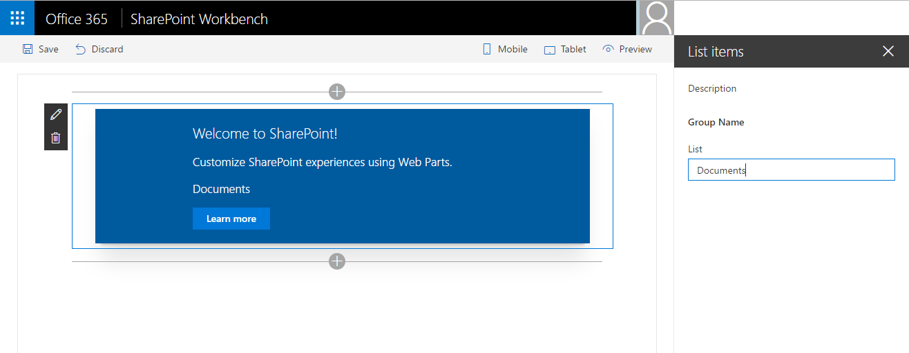
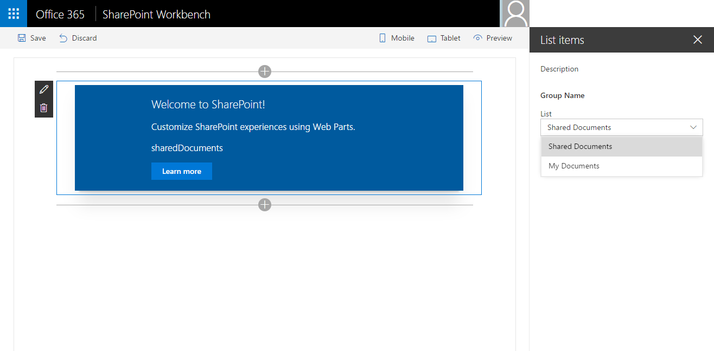

# <a name="use-cascading-dropdowns-in-web-part-properties"></a>Использование каскадных раскрывающихся меню для свойств веб-частей

Когда вы создаете панель свойств для клиентских веб-частей SharePoint, параметры одного свойства веб-части могут отображаться с учетом значения, выбранного для другого свойства. Такое обычно происходит, если применяются каскадные раскрывающиеся меню. В этой статье описано, как создавать каскадные раскрывающиеся меню на панели свойств веб-части, не создавая соответствующий пользовательский элемент управления.


Исходный код рабочей веб-части доступен на сайте GitHub по адресу [https://github.com/SharePoint/sp-dev-fx-webparts/tree/master/samples/react-custompropertypanecontrols](https://github.com/SharePoint/sp-dev-fx-webparts/tree/master/samples/react-custompropertypanecontrols).

> **Примечание.** Прежде чем выполнять действия, описанные в этой статье, [настройте среду разработки клиентских веб-частей для SharePoint](../../set-up-your-development-environment.md).

## <a name="create-new-project"></a>Создание проекта

Для начала создайте папку проекта.

```sh
md react-cascadingdropdowns
```

Перейдите в папку проекта.

```sh
cd react-cascadingdropdowns
```

В папке проекта запустите генератор Yeoman для SharePoint Framework, чтобы сформировать шаблон проекта на платформе SharePoint Framework.

```sh
yo @microsoft/sharepoint
```

Когда отобразится соответствующий запрос, введите следующие значения:

- **react-cascadingdropdowns** в качестве имени решения;
- **Use the current folder** (Использовать текущую папку) в качестве расположения файлов;
- **React** как отправную точку создания веб-части;
- **List items** (Элементы списка) в качестве имени веб-части;
- **Shows list items from the selected list** (Показывает элементы списка из выбранного списка) в качестве описания веб-части.


После скаффолдинга заблокируйте версию зависимостей проекта, выполнив следующую команду:

```sh
npm shrinkwrap
```

Далее откройте папку проекта в редакторе кода. В этой статье инструкции и снимки экрана основаны на Visual Studio Code, но вы можете использовать любой редактор.


## <a name="define-a-web-part-property-to-store-the-selected-list"></a>Определение свойства веб-части для хранения выбранного списка

Вы создадите веб-часть, отображающую элементы выбранного списка SharePoint. Пользователи смогут выбрать список на панели свойств веб-части. Для хранения выбранного списка создайте свойство веб-части с именем **listName**.

В редакторе кода откройте файл **src/webparts/listItems/ListItemsWebPartManifest.json**. Замените свойство по умолчанию **description** на новое свойство `listName`.


Далее откройте файл **src/webparts/listItems/IListItemsWebPartProps.ts** и замените его содержимое на следующее:

```ts
export interface IListItemsWebPartProps {
  listName: string;
}
```

В файле **src/webparts/listItems/ListItemsWebPart.ts** измените метод **render** на следующий:

```ts
export default class ListItemsWebPart extends BaseClientSideWebPart<IListItemsWebPartProps> {
  // ...
  public render(): void {
    const element: React.ReactElement<IListItemsProps> = React.createElement(ListItems, {
      listName: this.properties.listName
    });

    ReactDom.render(element, this.domElement);
  }
  // ...
}
```

Измените метод **propertyPaneSettings** на следующий:

```ts
export default class ListItemsWebPart extends BaseClientSideWebPart<IListItemsWebPartProps> {
  // ...
  protected getPropertyPaneConfiguration(): IPropertyPaneConfiguration {
    return {
      pages: [
        {
          header: {
            description: strings.PropertyPaneDescription
          },
          groups: [
            {
              groupName: strings.BasicGroupName,
              groupFields: [
                PropertyPaneTextField('listName', {
                  label: strings.ListNameFieldLabel
                })
              ]
            }
          ]
        }
      ]
    };
  }
  // ...
}
```

В файле **src/webparts/listItems/loc/mystrings.d.ts** измените интерфейс **IListItemsStrings** на следующий:

```ts
declare interface IListItemsStrings {
  PropertyPaneDescription: string;
  BasicGroupName: string;
  ListNameFieldLabel: string;
}
```

В файле **src/webparts/listItems/loc/en-us.js** добавьте отсутствующее определение для строки **ListNameFieldLabel**.

```js
define([], function() {
  return {
    "PropertyPaneDescription": "Description",
    "BasicGroupName": "Group Name",
    "ListNameFieldLabel": "List"
  }
});
```

В файле **src/webparts/listItems/components/ListItems.tsx** замените содержимое метода **render** следующим:

```tsx
export default class ListItems extends React.Component<IListItemsProps, {}> {
 public render(): JSX.Element {
    return (
        <div className={styles.listItems}>
        <div className={styles.container}>
          <div className={`ms-Grid-row ms-bgColor-themeDark ms-fontColor-white ${styles.row}`}>
            <div className="ms-Grid-col ms-u-lg10 ms-u-xl8 ms-u-xlPush2 ms-u-lgPush1">
              <span className="ms-font-xl ms-fontColor-white">Welcome to SharePoint!</span>
              <p className="ms-font-l ms-fontColor-white">Customize SharePoint experiences using Web Parts.</p>
              <p className="ms-font-l ms-fontColor-white">{escape(this.props.listName)}</p>
              <a href="https://aka.ms/spfx" className={styles.button}>
                <span className={styles.label}>Learn more</span>
              </a>
            </div>
          </div>
        </div>
      </div>
    );
  }
}
```
В файле **src/webparts/listItems/components/IListItemsProps.ts** замените интерфейс **IListItemsProps** следующим:

```ts
export interface IListItemsProps {
  listName: string;
}
```

Чтобы убедиться, что проект работает, выполните следующую команду:

```sh
gulp serve
```

В веб-браузере добавьте веб-часть **List items** на полотно и откройте ее свойства. Убедитесь, что значение свойства **List** отображается в теле веб-части.



## <a name="populate-the-dropdown-with-sharepoint-lists-to-choose-from"></a>Заполнение раскрывающегося меню списками SharePoint, из которых следует выбирать

На этом этапе пользователь указывает, какой список должна использовать веб-часть, вручную введя его. В этом случае возможна ошибка, в идеале пользователь должен выбрать один из существующих списков на текущем сайте SharePoint.

### <a name="use-dropdown-control-to-render-the-listname-property"></a>Отрисовка свойства listName с использованием раскрывающегося меню

Вверху веб-части добавьте в классе **ListItemsWebPart** ссылку на класс **PropertyPaneDropdown**. Замените часть кода, которая загружает класс **PropertyPaneTextField** (import), следующим:

```ts
import {
  BaseClientSideWebPart,
  IPropertyPaneConfiguration,
  PropertyPaneTextField,
  PropertyPaneDropdown,
  IPropertyPaneDropdownOption
} from '@microsoft/sp-webpart-base';
```

В классе **ListItemsWebPart** добавьте новую переменную **lists** для хранения сведений обо всех доступных списках на текущем сайте.

```ts
export default class ListItemsWebPart extends BaseClientSideWebPart<IListItemsWebPartProps> {
  private lists: IPropertyPaneDropdownOption[];
  // ...
}
```

Далее добавьте новую переменную класса **listsDropdownDisabled**. Она определяет, включено ли раскрывающееся меню со списками. Пока веб-часть не получит сведения о доступных списках на текущем сайте, раскрывающееся меню должно быть отключено.

```ts
export default class ListItemsWebPart extends BaseClientSideWebPart<IListItemsWebPartProps> {
  // ...
  private listsDropdownDisabled: boolean = true;
  // ...
}
```

Измените метод считывания **propertyPaneSettings** так, чтобы он использовал раскрывающееся меню для отрисовки свойства **listName**.

```ts
export default class ListItemsWebPart extends BaseClientSideWebPart<IListItemsWebPartProps> {
  // ...
  protected get propertyPaneSettings(): IPropertyPaneSettings {
    return {
      pages: [
        {
          header: {
            description: strings.PropertyPaneDescription
          },
          groups: [
            {
              groupName: strings.BasicGroupName,
              groupFields: [
                PropertyPaneDropdown('listName', {
                  label: strings.ListNameFieldLabel,
                  options: this.lists,
                  disabled: this.listsDropdownDisabled
                })
              ]
            }
          ]
        }
      ]
    };
  }
}
```

Чтобы проверить правильность работы, выполните указанную ниже команду.

```sh
gulp serve
```


### <a name="show-available-lists-in-the-list-dropdown"></a>Отображение доступных списков в раскрывающемся меню

Ранее вы сопоставляли раскрывающееся меню свойства **listName** со свойством класса **lists**. Так как вы пока не загрузили в него никаких значений, раскрывающееся меню **List** на панели свойств веб-части остается отключенным. На этом этапе веб-часть загрузит сведения о доступных списках.

#### <a name="add-a-method-to-load-available-lists"></a>Добавление метода для загрузки доступных списков

В классе **ListItemsWebPart** добавьте метод для загрузки доступных списков. В этой статье используются фиктивные данные, но вы также можете вызвать REST API SharePoint, чтобы извлечь список доступных списков из текущего веб-сайта. Для имитации загрузки параметров из внешней службы метод использует двухсекундную задержку.

```ts
export default class ListItemsWebPart extends BaseClientSideWebPart<IListItemsWebPartProps> {
  // ...
  private loadLists(): Promise<IPropertyPaneDropdownOption[]> {
    return new Promise<IPropertyPaneDropdownOption[]>((resolve: (options: IPropertyPaneDropdownOption[]) => void, reject: (error: any) => void) => {
      setTimeout((): void => {
        resolve([{
          key: 'sharedDocuments',
          text: 'Shared Documents'
        },
        {
          key: 'myDocuments',
          text: 'My Documents'
        }]);
      }, 2000);
    });
  }
}
```

#### <a name="load-information-about-available-lists-into-the-list-dropdown"></a>Загрузка сведений о доступных списках в раскрывающееся меню со списками

В классе **ListItemsWebPart** переопределите метод **onPropertyPaneConfigurationStart**, используя следующий код:

```ts
export default class ListItemsWebPart extends BaseClientSideWebPart<IListItemsWebPartProps> {
  // ...
  protected onPropertyPaneConfigurationStart(): void {
    this.listsDropdownDisabled = !this.lists;

    if (this.lists) {
      return;
    }

    this.context.statusRenderer.displayLoadingIndicator(this.domElement, 'lists');

    this.loadLists()
      .then((listOptions: IPropertyPaneDropdownOption[]): void => {
        this.lists = listOptions;
        this.listsDropdownDisabled = false;
        this.context.propertyPane.refresh();
        this.context.statusRenderer.clearLoadingIndicator(this.domElement);
        this.render();
      });
  }
  // ...
}
```

SharePoint Framework вызывает метод **onPropertyPaneConfigurationStart** после открытия панели свойств для веб-части. Сначала метод проверяет, загружена ли информация о доступных списках на текущем сайте. Если она загружена, будет включено раскрывающееся меню со списками. Если она пока не загружена, отобразится индикатор загрузки, информирующий пользователя о том, что веб-часть загружает сведения о списках.


Когда информация о доступных списках загрузится, метод назначит полученные данные переменной класса **lists**, благодаря чему будет возможно отображение этих сведений в раскрывающемся меню со списками. Далее будет включено раскрывающееся меню, позволяющее пользователю выбрать список. Благодаря вызову метода **this.context.propertyPane.refresh()** обновляется область свойств веб-части, чтобы отобразить последние изменения в раскрывающемся меню со списками. Когда информация загрузится, индикатор загрузки будет удален благодаря вызову метода **clearLoadingIndicator**. Так как при вызове метода очищается пользовательский интерфейс веб-части, вызывается метод **render**, чтобы веб-часть отрисовалась вновь.

Выполните следующую команду, чтобы убедиться, что всё работает правильно:

```sh
gulp serve
```

Когда вы добавляете веб-часть на холст и открываете панель ее свойств, раскрывающееся меню со списками должно заполниться доступными списками, из которых может выбирать пользователь.



## <a name="allow-users-to-select-an-item-from-the-selected-list"></a>Предоставление пользователям возможности выбрать элемент в указанном списке

При создании веб-частей часто требуется предоставить пользователям возможность выбирать из набора значений, которые определяются ранее указанным значением (например, выбрать страну после указания континента или выбрать элемент списка после указания списка). Это позволяют сделать каскадные раскрывающиеся меню. Вы можете создать каскадные раскрывающиеся меню на панели свойств веб-части, используя стандартные возможности клиентских веб-частей SharePoint Framework. Для этого вы добавите в ранее созданную веб-часть возможность выбрать элемент списка, обусловленный выбранным списком.


### <a name="add-item-web-part-property"></a>Добавление свойства веб-части item

В редакторе кода откройте файл **src/webparts/listItems/ListItemsWebPart.manifest.json**. В разделе **properties** добавьте свойство **itemName**, чтобы оно выглядело следующим образом:

```json
{
  // ...
  "properties": {
    "listName": "",
    "itemName": ""
  }
  // ...
}
```


Замените код в файле **src/webparts/listItems/IListItemsWebPartProps.ts** следующим:

```ts
export interface IListItemsWebPartProps {
  listName: string;
  itemName: string;
}
```

Замените код в файле **src/webparts/listItems/components/IListItemsProps.ts** следующим:

```ts
export interface IListItemsProps {
  listName: string;
  itemName: string;
}
```

В файле **src/webparts/listItems/ListItemsWebPart.ts** замените код метода **render** следующим:

```ts
export default class ListItemsWebPart extends BaseClientSideWebPart<IListItemsWebPartProps> {
  // ...
  public render(): void {
    const element: React.ReactElement<IListItemsProps> = React.createElement(ListItems, {
      listName: this.properties.listName,
      itemName: this.properties.itemName
    });

    ReactDom.render(element, this.domElement);
  }
  // ...
}
```

В файле **src/webparts/listItems/loc/mystrings.d.ts** измените интерфейс **IListItemsStrings** на следующий:

```ts
declare interface IListItemsStrings {
  PropertyPaneDescription: string;
  BasicGroupName: string;
  ListNameFieldLabel: string;
  ItemNameFieldLabel: string;
}
```

В файле **src/webparts/listItems/loc/en-us.js** добавьте отсутствующее определение для строки **ItemNameFieldLabel**.

```js
define([], function() {
  return {
    "PropertyPaneDescription": "Description",
    "BasicGroupName": "Group Name",
    "ListNameFieldLabel": "List",
    "ItemNameFieldLabel": "Item"
  }
});
```

### <a name="render-the-value-of-the-item-web-part-property"></a>Отрисовка значения свойства веб-части item

В файле **src/webparts/listItems/components/ListItems.tsx** измените метод **render** на следующий:

```tsx
export default class ListItems extends React.Component<IListItemsProps, {}> {
  public render(): JSX.Element {
    return (
        <div className={styles.listItems}>
        <div className={styles.container}>
          <div className={`ms-Grid-row ms-bgColor-themeDark ms-fontColor-white ${styles.row}`}>
            <div className="ms-Grid-col ms-u-lg10 ms-u-xl8 ms-u-xlPush2 ms-u-lgPush1">
              <span className="ms-font-xl ms-fontColor-white">Welcome to SharePoint!</span>
              <p className="ms-font-l ms-fontColor-white">Customize SharePoint experiences using Web Parts.</p>
              <p className="ms-font-l ms-fontColor-white">{escape(this.props.listName)}</p>
              <p className="ms-font-l ms-fontColor-white">{escape(this.props.itemName)}</p>
              <a href="https://aka.ms/spfx" className={styles.button}>
                <span className={styles.label}>Learn more</span>
              </a>
            </div>
          </div>
        </div>
      </div>
    );
  }
}
```

### <a name="allow-users-to-choose-the-item-from-a-list"></a>Предоставление пользователям возможности выбрать элемент списка

У пользователей должна быть возможность выбрать список в раскрывающемся меню точно так же, как выбрать элемент в списке доступных.

В классе **ListItemsWebPart** добавьте новую переменную **items** для хранения информации о доступных элементах в только что выбранном списке.

```ts
export default class ListItemsWebPart extends BaseClientSideWebPart<IListItemsWebPartProps> {
  // ...
  private items: IPropertyPaneDropdownOption[];
  // ...
}
```

Далее добавьте новую переменную класса **itemsDropdownDisabled**. Она определяет, необходимо ли включать раскрывающееся меню. У пользователей должна появиться возможность выбора элемента только после выбора соответствующего списка.

```ts
export default class ListItemsWebPart extends BaseClientSideWebPart<IListItemsWebPartProps> {
  // ...
  private itemsDropdownDisabled: boolean = true;
  // ...
}
```

Измените метод считывания **propertyPaneSettings** так, чтобы он использовал раскрывающееся меню для отрисовки свойства **itemName**.

```ts
export default class ListItemsWebPart extends BaseClientSideWebPart<IListItemsWebPartProps> {
  // ...
  protected getPropertyPaneConfiguration(): IPropertyPaneConfiguration {
    return {
      pages: [
        {
          header: {
            description: strings.PropertyPaneDescription
          },
          groups: [
            {
              groupName: strings.BasicGroupName,
              groupFields: [
                PropertyPaneDropdown('listName', {
                  label: strings.ListNameFieldLabel,
                  options: this.lists,
                  disabled: this.listsDropdownDisabled
                }),
                PropertyPaneDropdown('itemName', {
                  label: strings.ItemNameFieldLabel,
                  options: this.items,
                  disabled: this.itemsDropdownDisabled
                })
              ]
            }
          ]
        }
      ]
    };
  }
}
```

Чтобы проверить правильность работы, выполните указанную ниже команду.

```sh
gulp serve
```


### <a name="show-items-available-in-the-selected-list-in-the-item-dropdown"></a>Отображение доступных элементов выбранного списка в раскрывающемся меню

Ранее вы определили раскрывающееся меню для отрисовки свойства **itemName** на панели свойств веб-части. Далее следует добавить в веб-часть возможность загружать сведения о доступных элементах выбранного списка и отображать эти элементы в раскрывающемся меню.

#### <a name="add-method-to-load-list-items"></a>Добавление метода для загрузки элементов списка

В файле **src/webparts/listItems/ListItemsWebPart.ts** в классе **ListItemsWebPart** добавьте метод для загрузки доступных элементов из выбранного списка. Как и для загрузки доступных списков, здесь используются фиктивные данные.

```ts
export default class ListItemsWebPart extends BaseClientSideWebPart<IListItemsWebPartProps> {
  // ...
  private loadItems(): Promise<IPropertyPaneDropdownOption[]> {
    if (!this.properties.listName) {
      // resolve to empty options since no list has been selected
      return Promise.resolve();
    }

    const wp: ListItemsWebPart = this;

    return new Promise<IPropertyPaneDropdownOption[]>((resolve: (options: IPropertyPaneDropdownOption[]) => void, reject: (error: any) => void) => {
      setTimeout(() => {
        const items = {
          sharedDocuments: [
            {
              key: 'spfx_presentation.pptx',
              text: 'SPFx for the masses'
            },
            {
              key: 'hello-world.spapp',
              text: 'hello-world.spapp'
            }
          ],
          myDocuments: [
            {
              key: 'isaiah_cv.docx',
              text: 'Isaiah CV'
            },
            {
              key: 'isaiah_expenses.xlsx',
              text: 'Isaiah Expenses'
            }
          ]
        };
        resolve(items[wp.properties.listName]);
      }, 2000);
    });
  }
}
```

Метод **loadItems** возвращает фиктивные элементы списка для ранее выбранного списка. Если список не выбран, метод разрешает обещание без данных.

#### <a name="load-information-about-available-items-into-the-item-dropdown"></a>Загрузка сведений о доступных элементах в раскрывающееся меню

В классе **ListItemsWebPart** измените метод **onPropertyPaneConfigurationStart** так, чтобы он загружал элементы выбранного списка.

```ts
export default class ListItemsWebPart extends BaseClientSideWebPart<IListItemsWebPartProps> {
  // ...
  protected onPropertyPaneConfigurationStart(): void {
    this.listsDropdownDisabled = !this.lists;
    this.itemsDropdownDisabled = !this.properties.listName || !this.items;

    if (this.lists) {
      return;
    }

    this.context.statusRenderer.displayLoadingIndicator(this.domElement, 'options');

    this.loadLists()
      .then((listOptions: IPropertyPaneDropdownOption[]): Promise<IPropertyPaneDropdownOption[]> => {
        this.lists = listOptions;
        this.listsDropdownDisabled = false;
        this.context.propertyPane.refresh();
        return this.loadItems();
      })
      .then((itemOptions: IPropertyPaneDropdownOption[]): void => {
        this.items = itemOptions;
        this.itemsDropdownDisabled = !this.properties.listName;
        this.context.propertyPane.refresh();
        this.context.statusRenderer.clearLoadingIndicator(this.domElement);
        this.render();
      });
  }
  // ...
}
```

При инициализации веб-часть сначала определит, следует ли включать раскрывающееся меню. Если пользователь ранее выбрал список, он сможет выбрать и элемент этого списка. Если он не выбирал список, раскрывающееся меню будет отключено.

Измените ранее определенный код, загружающий сведения о доступных списках, так, чтобы он загружал и сведения о доступных элементах выбранного списка. Этот код затем назначит полученные сведения переменной класса **items** для использования в раскрывающемся меню. Наконец код очистит индикатор загрузки и позволит пользователю начать работать с веб-частью.

Выполните следующую команду, чтобы убедиться, что всё работает правильно:

```sh
gulp serve
```

При необходимости раскрывающееся меню может быть изначально отключено, чтобы пользователи сначала выбирали список. На данном этапе, даже после выбора списка, раскрывающееся меню элементов остается отключенным.


#### <a name="update-web-part-property-pane-after-selecting-a-list"></a>Обновление панели свойств веб-части после выбора списка

Когда пользователь выбирает список на панели свойств, страница веб-части должна обновиться так, чтобы включить раскрывающееся меню и отобразить список доступных элементов выбранного списка.

Откройте файл **ListItemsWebPart.ts** и переопределите в классе **ListItemsWebPart** метод **onPropertyPaneFieldChanged**, указав следующий код:

```ts
export default class ListItemsWebPart extends BaseClientSideWebPart<IListItemsWebPartProps> {
  // ...
  protected onPropertyPaneFieldChanged(propertyPath: string, oldValue: any, newValue: any): void {
    if (propertyPath === 'listName' &&
        newValue) {
      // push new list value
      super.onPropertyPaneFieldChanged(propertyPath, oldValue, newValue);
      // get previously selected item
      const previousItem: string = this.properties.itemName;
      // reset selected item
      this.properties.itemName = undefined;
      // push new item value
      this.onPropertyPaneFieldChanged('itemName', previousItem, this.properties.itemName);
      // disable item selector until new items are loaded
      this.itemsDropdownDisabled = true;
      // refresh the item selector control by repainting the property pane
      this.context.propertyPane.refresh();
      // communicate loading items
      this.context.statusRenderer.displayLoadingIndicator(this.domElement, 'items');

      this.loadItems()
        .then((itemOptions: IPropertyPaneDropdownOption[]): void => {
          // store items
          this.items = itemOptions;
          // enable item selector
          this.itemsDropdownDisabled = false;
          // clear status indicator
          this.context.statusRenderer.clearLoadingIndicator(this.domElement);
          // re-render the web part as clearing the loading indicator removes the web part body
          this.render();
          // refresh the item selector control by repainting the property pane
          this.context.propertyPane.refresh();
        });
    }
    else {
      super.onPropertyPaneFieldChanged(propertyPath, oldValue, newValue);
    }
  }
  // ...
}
```

Когда пользователь выберет список, веб-часть сохранит только что выбранное значение. Так как выбранный список изменился, веб-часть сбросит элемент выбранного ранее списка. Когда список будет выбран, на панель свойств загрузятся элементы конкретного списка. При загрузке элементов у пользователя не должно быть возможности выбрать элемент.

Когда элементы выбранного списка загрузятся, они будут назначены переменной класса **items**, с помощью которой раскрывающееся меню сможет их использовать. Когда сведения о доступных элементах списка загрузятся, включится раскрывающееся меню, в котором пользователи смогут выбрать элемент. Индикатор загрузки удаляется, в результате чего очищается тело веб-части. Следовательно, веб-часть должна быть отрисована повторно. Наконец обновляется панель свойств веб-части для отображения последних изменений.

> **Примечание.** В выпуске 6 SharePoint Framework допущена ошибка в компоненте Office UI Fabric React Dropdown, из-за которой раскрывающееся меню работает неправильно. Чтобы временно решить эту проблему, измените строку **12027** в файле **node_modules/@microsoft/office-ui-fabric-react-bundle/dist/office-ui-fabric-react.bundle.js**. Исходный вариант:
> 
> ```js
> isDisabled: this.props.isDisabled !== undefined ? this.props.isDisabled : this.props.disabled
> ```
>
> на значение:
> 
> ```js
> isDisabled: newProps.isDisabled !== undefined ? newProps.isDisabled : newProps.disabled
> ```


