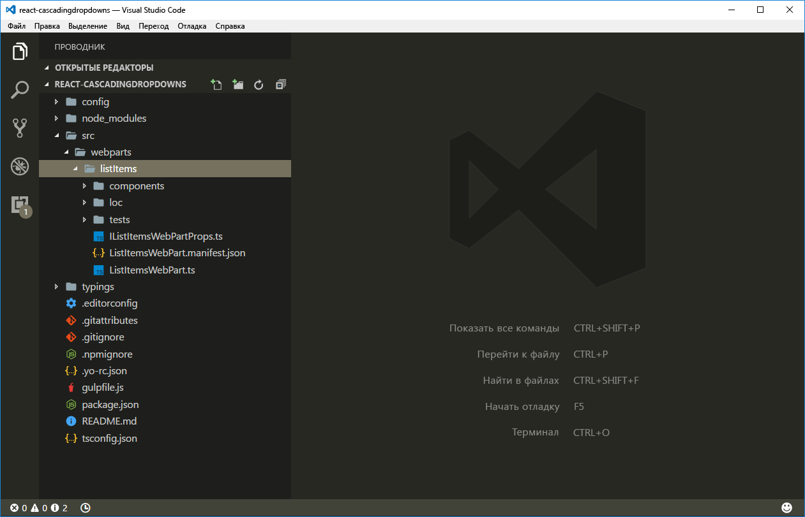

# <a name="use-cascading-dropdowns-in-web-part-properties"></a><span data-ttu-id="1802a-103">Использование каскадных раскрывающихся меню для свойств веб-частей</span><span class="sxs-lookup"><span data-stu-id="1802a-103">Use cascading dropdowns in web part properties</span></span>

<span data-ttu-id="1802a-104">При создании области свойств для клиентских веб-частей SharePoint параметры одного свойства веб-части могут отображаться с учетом значения, выбранного для другого свойства.</span><span class="sxs-lookup"><span data-stu-id="1802a-104">When designing the property pane for your SharePoint client-side web parts, you may have one web part property that displays its options based on the  value selected in another property. This scenario typically occurs when implementing cascading dropdown controls. In this article, you will learn how to create cascading dropdown controls in the web part property pane without developing a custom property pane control.</span></span> <span data-ttu-id="1802a-105">Такое обычно происходит, если применяются каскадные раскрывающиеся меню.</span><span class="sxs-lookup"><span data-stu-id="1802a-105">This scenario typically occurs when implementing cascading dropdown controls.</span></span> <span data-ttu-id="1802a-106">В этой статье описано, как создавать каскадные раскрывающиеся меню в области свойств веб-части, не создавая собственный элемент управления.</span><span class="sxs-lookup"><span data-stu-id="1802a-106">In this article, you learn how to create cascading dropdown controls in the web part property pane without developing a custom property pane control.</span></span>


<span data-ttu-id="1802a-108">Исходный код рабочей веб-части доступен в репозитории [sp-dev-fx-webparts/samples/react-custompropertypanecontrols/](https://github.com/SharePoint/sp-dev-fx-webparts/tree/master/samples/react-custompropertypanecontrols) на сайте GitHub.</span><span class="sxs-lookup"><span data-stu-id="1802a-108">The source of the working web part is available on GitHub at [https://github.com/SharePoint/sp-dev-fx-webparts/tree/master/samples/react-custompropertypanecontrols](https://github.com/SharePoint/sp-dev-fx-webparts/tree/master/samples/react-custompropertypanecontrols).</span></span>

> [!NOTE] 
> <span data-ttu-id="1802a-109">Прежде чем выполнять действия, описанные в этой статье, [настройте среду разработки для создания клиентских веб-частей SharePoint](../../set-up-your-development-environment.md).</span><span class="sxs-lookup"><span data-stu-id="1802a-109">Before following the steps in this article, be sure to [set up your SharePoint client-side web part development environment](../../set-up-your-development-environment.md).</span></span>

## <a name="create-new-project"></a><span data-ttu-id="1802a-110">Создание проекта</span><span class="sxs-lookup"><span data-stu-id="1802a-110">Create new project</span></span>

1. <span data-ttu-id="1802a-111">Для начала создайте папку проекта:</span><span class="sxs-lookup"><span data-stu-id="1802a-111">Start by creating a new folder for your project.</span></span>

  ```sh
  md react-cascadingdropdowns
  ```

2. <span data-ttu-id="1802a-112">Перейдите в папку проекта:</span><span class="sxs-lookup"><span data-stu-id="1802a-112">Go to the project folder:</span></span>

  ```sh
  cd react-cascadingdropdowns
  ```

3. <span data-ttu-id="1802a-113">В папке проекта запустите генератор Yeoman для SharePoint Framework, чтобы сформировать шаблон проекта на платформе SharePoint Framework:</span><span class="sxs-lookup"><span data-stu-id="1802a-113">In the project folder, run the SharePoint Framework Yeoman generator to scaffold a new SharePoint Framework project:</span></span>

  ```sh
  yo @microsoft/sharepoint
  ```

4. <span data-ttu-id="1802a-114">Когда появится соответствующий запрос, укажите следующие значения:</span><span class="sxs-lookup"><span data-stu-id="1802a-114">When prompted, enter the following values:</span></span>

  - <span data-ttu-id="1802a-115">**react-cascadingdropdowns** в качестве имени решения;</span><span class="sxs-lookup"><span data-stu-id="1802a-115">**react-cascadingdropdowns** as your solution name</span></span>
  - <span data-ttu-id="1802a-116">**Use the current folder** (Использовать текущую папку) в качестве расположения файлов;</span><span class="sxs-lookup"><span data-stu-id="1802a-116">**Use the current folder** for the location to place the files</span></span>
  - <span data-ttu-id="1802a-117">**React** как отправную точку создания веб-части;</span><span class="sxs-lookup"><span data-stu-id="1802a-117">**React** as the starting point to build the web part</span></span>
  - <span data-ttu-id="1802a-118">**List items** (Элементы списка) в качестве имени веб-части;</span><span class="sxs-lookup"><span data-stu-id="1802a-118">**List items** as your web part name</span></span>
  - <span data-ttu-id="1802a-119">**Shows list items from the selected list** (Показывает элементы списка из выбранного списка) в качестве описания веб-части.</span><span class="sxs-lookup"><span data-stu-id="1802a-119">**Shows list items from the selected list** as your web part description</span></span>

  

5. <span data-ttu-id="1802a-121">По завершении формирования шаблона заблокируйте версию зависимостей проекта, выполнив следующую команду:</span><span class="sxs-lookup"><span data-stu-id="1802a-121">After the scaffolding completes, lock down the version of the project dependencies by running the following command:</span></span>

  ```sh
  npm shrinkwrap
  ```

6. <span data-ttu-id="1802a-122">Откройте папку проекта в редакторе кода.</span><span class="sxs-lookup"><span data-stu-id="1802a-122">Next, open your project folder in your code editor.</span></span> <span data-ttu-id="1802a-123">В инструкциях и на снимках экрана из этой статьи используется Visual Studio Code, но вы можете использовать любой другой редактор.</span><span class="sxs-lookup"><span data-stu-id="1802a-123">This article uses Visual Studio Code in the steps and screenshots, but you can use any editor that you prefer.</span></span>

  

## <a name="define-a-web-part-property-to-store-the-selected-list"></a><span data-ttu-id="1802a-125">Определение свойства веб-части для хранения выбранного списка</span><span class="sxs-lookup"><span data-stu-id="1802a-125">Define a web part property to store the selected list</span></span>

<span data-ttu-id="1802a-126">Мы создадим веб-часть, в которой отображаются элементы выбранного списка SharePoint.</span><span class="sxs-lookup"><span data-stu-id="1802a-126">You will build a web part that displays list items from a selected SharePoint list.</span></span> <span data-ttu-id="1802a-127">Пользователи смогут выбрать список в области свойств веб-части.</span><span class="sxs-lookup"><span data-stu-id="1802a-127">Users are able to select a list in the web part property pane.</span></span> <span data-ttu-id="1802a-128">Для хранения выбранного списка создайте свойство веб-части с именем **listName**.</span><span class="sxs-lookup"><span data-stu-id="1802a-128">To store the selected list, create a new web part property named **listName**.</span></span>

1. <span data-ttu-id="1802a-p104">В редакторе кода откройте файл **src/webparts/listItems/ListItemsWebPartManifest.json**. Замените заданное по умолчанию свойство **description** на новое свойство `listName`.</span><span class="sxs-lookup"><span data-stu-id="1802a-p104">In the code editor, open the **src/webparts/listItems/ListItemsWebPartManifest.json** file. Replace the default **description** property with a new property named `listName`.</span></span>

  

2. <span data-ttu-id="1802a-132">Откройте файл **src/webparts/listItems/IListItemsWebPartProps.ts** и замените его содержимое следующим кодом:</span><span class="sxs-lookup"><span data-stu-id="1802a-132">Next, open the **src/webparts/listItems/IListItemsWebPartProps.ts** file, and replace its contents with:</span></span>

  ```ts
  export interface IListItemsWebPartProps {
    listName: string;
  }
  ```

3. <span data-ttu-id="1802a-133">В файле **src/webparts/listItems/ListItemsWebPart.ts** замените метод **render** следующим кодом:</span><span class="sxs-lookup"><span data-stu-id="1802a-133">In the **src/webparts/listItems/ListItemsWebPart.ts** file, change the **render** method to:</span></span>

  ```ts
  export default class ListItemsWebPart extends BaseClientSideWebPart<IListItemsWebPartProps> {
    // ...
    public render(): void {
      const element: React.ReactElement<IListItemsProps> = React.createElement(ListItems, {
        listName: this.properties.listName
      });

      ReactDom.render(element, this.domElement);
    }
    // ...
  }
  ```

4. <span data-ttu-id="1802a-134">Замените содержимое метода **propertyPaneSettings** следующим кодом:</span><span class="sxs-lookup"><span data-stu-id="1802a-134">Update the **propertyPaneSettings** getter to:</span></span>

  ```ts
  export default class ListItemsWebPart extends BaseClientSideWebPart<IListItemsWebPartProps> {
    // ...
    protected getPropertyPaneConfiguration(): IPropertyPaneConfiguration {
      return {
        pages: [
          {
            header: {
              description: strings.PropertyPaneDescription
            },
            groups: [
              {
                groupName: strings.BasicGroupName,
                groupFields: [
                  PropertyPaneTextField('listName', {
                    label: strings.ListNameFieldLabel
                  })
                ]
              }
            ]
          }
        ]
      };
    }
    // ...
  }
  ```

5. <span data-ttu-id="1802a-135">В файле **src/webparts/listItems/loc/mystrings.d.ts** замените интерфейс **IListItemsStrings** следующим кодом:</span><span class="sxs-lookup"><span data-stu-id="1802a-135">In the **src/webparts/listItems/loc/mystrings.d.ts** file, change the **IListItemsStrings** interface to:</span></span>

  ```ts
  declare interface IListItemsStrings {
    PropertyPaneDescription: string;
    BasicGroupName: string;
    ListNameFieldLabel: string;
  }
  ```

6. <span data-ttu-id="1802a-136">В файле **src/webparts/listItems/loc/en-us.js** добавьте отсутствующее определение для строки **ListNameFieldLabel**.</span><span class="sxs-lookup"><span data-stu-id="1802a-136">In the **src/webparts/listItems/loc/en-us.js** file, add the missing definition for the **ListNameFieldLabel** string.</span></span>

  ```js
  define([], function() {
    return {
      "PropertyPaneDescription": "Description",
      "BasicGroupName": "Group Name",
      "ListNameFieldLabel": "List"
    }
  });
  ```

7. <span data-ttu-id="1802a-137">В файле **src/webparts/listItems/components/ListItems.tsx** замените содержимое метода **render** следующим кодом:</span><span class="sxs-lookup"><span data-stu-id="1802a-137">In the **src/webparts/listItems/components/ListItems.tsx** file, change the contents of the **render** method to:</span></span>

  ```tsx
  export default class ListItems extends React.Component<IListItemsProps, {}> {
  public render(): JSX.Element {
      return (
          <div className={styles.listItems}>
          <div className={styles.container}>
            <div className={`ms-Grid-row ms-bgColor-themeDark ms-fontColor-white ${styles.row}`}>
              <div className="ms-Grid-col ms-u-lg10 ms-u-xl8 ms-u-xlPush2 ms-u-lgPush1">
                <span className="ms-font-xl ms-fontColor-white">Welcome to SharePoint!</span>
                <p className="ms-font-l ms-fontColor-white">Customize SharePoint experiences using Web Parts.</p>
                <p className="ms-font-l ms-fontColor-white">{escape(this.props.listName)}</p>
                <a href="https://aka.ms/spfx" className={styles.button}>
                  <span className={styles.label}>Learn more</span>
                </a>
              </div>
            </div>
          </div>
        </div>
      );
    }
  }
  ```

8. <span data-ttu-id="1802a-138">В файле **src/webparts/listItems/components/IListItemsProps.ts** замените интерфейс **IListItemsProps** следующим:</span><span class="sxs-lookup"><span data-stu-id="1802a-138">In the **src/webparts/listItems/components/IListItemsProps.ts** file, change the **IListItemsProps** interface to:</span></span>

  ```ts
  export interface IListItemsProps {
    listName: string;
  }
  ```

9. <span data-ttu-id="1802a-139">Чтобы убедиться, что проект работает, выполните следующую команду:</span><span class="sxs-lookup"><span data-stu-id="1802a-139">Run the following command to verify that the project is running:</span></span>

  ```sh
  gulp serve
  ```

10. <span data-ttu-id="1802a-p105">В веб-браузере добавьте веб-часть **List items** на полотно и откройте ее свойства. Убедитесь, что значение свойства **List** отображается в теле веб-части.</span><span class="sxs-lookup"><span data-stu-id="1802a-p105">In the web browser, add the **List items** web part to the canvas and open its properties. Verify that the value set for the **List** property is displayed in the web part body.</span></span>

  


## <a name="populate-the-dropdown-with-sharepoint-lists-to-choose-from"></a><span data-ttu-id="1802a-143">Заполнение раскрывающегося меню списками SharePoint, из которых следует выбирать</span><span class="sxs-lookup"><span data-stu-id="1802a-143">Populate the dropdown with SharePoint lists to choose from</span></span>

<span data-ttu-id="1802a-144">На этом шаге пользователь указывает имя списка, который должна использовать веб-часть.</span><span class="sxs-lookup"><span data-stu-id="1802a-144">At this point, a user specifies which list the web part should use by manually entering the list name. This is error-prone and ideally you want users to choose one of the lists existing in the current SharePoint site.</span></span> <span data-ttu-id="1802a-145">В этом случае возможна ошибка. В идеале пользователь должен выбрать один из списков на текущем сайте SharePoint.</span><span class="sxs-lookup"><span data-stu-id="1802a-145">At this point, a user specifies which list the web part should use by manually entering the list name. This is error-prone and ideally you want users to choose one of the lists existing in the current SharePoint site.</span></span>

### <a name="use-dropdown-control-to-render-the-listname-property"></a><span data-ttu-id="1802a-146">Отрисовка свойства listName с использованием раскрывающегося меню</span><span class="sxs-lookup"><span data-stu-id="1802a-146">Use dropdown control to render the listName property</span></span>

1. <span data-ttu-id="1802a-147">В классе **ListItemsWebPart** добавьте ссылку на класс **PropertyPaneDropdown** в верхнем разделе кода веб-части.</span><span class="sxs-lookup"><span data-stu-id="1802a-147">In the **ListItemsWebPart** class add a reference to the **PropertyPaneDropdown** class in the top section of the web part. Replace the import clause that loads the PropertyPaneTextField class with:</span></span> <span data-ttu-id="1802a-148">Замените предложение импорта, загружающее класс **PropertyPaneTextField**, следующим кодом:</span><span class="sxs-lookup"><span data-stu-id="1802a-148">Replace the import clause that loads the **PropertyPaneTextField** class with:</span></span>

  ```ts
  import {
    BaseClientSideWebPart,
    IPropertyPaneConfiguration,
    PropertyPaneTextField,
    PropertyPaneDropdown,
    IPropertyPaneDropdownOption
  } from '@microsoft/sp-webpart-base';
  ```

2. <span data-ttu-id="1802a-149">В классе **ListItemsWebPart** добавьте новую переменную **lists** для хранения сведений обо всех доступных списках на текущем сайте.</span><span class="sxs-lookup"><span data-stu-id="1802a-149">In the **ListItemsWebPart** class, add a new variable named **lists** to store information about all available lists in the current site.</span></span>

  ```ts
  export default class ListItemsWebPart extends BaseClientSideWebPart<IListItemsWebPartProps> {
    private lists: IPropertyPaneDropdownOption[];
    // ...
  }
  ```

3. <span data-ttu-id="1802a-150">Добавьте новую переменную класса **listsDropdownDisabled**.</span><span class="sxs-lookup"><span data-stu-id="1802a-150">Add a new class variable named **listsDropdownDisabled**.</span></span> <span data-ttu-id="1802a-151">Она определяет, включено ли раскрывающееся меню со списками.</span><span class="sxs-lookup"><span data-stu-id="1802a-151">This variable determines whether the list dropdown is enabled or not.</span></span> <span data-ttu-id="1802a-152">Пока веб-часть не получит сведения о доступных списках на текущем сайте, раскрывающееся меню должно быть отключено.</span><span class="sxs-lookup"><span data-stu-id="1802a-152">Next, add a new class variable named listsDropdownDisabled. This variable determines whether the list dropdown is enabled or not. Until the web part retrieves the information about the lists available in the current site, the dropdown should be disabled.</span></span>

  ```ts
  export default class ListItemsWebPart extends BaseClientSideWebPart<IListItemsWebPartProps> {
    // ...
    private listsDropdownDisabled: boolean = true;
    // ...
  }
  ```

4. <span data-ttu-id="1802a-153">Измените метод получения **propertyPaneSettings** так, чтобы он использовал раскрывающееся меню для отрисовки свойства **listName**.</span><span class="sxs-lookup"><span data-stu-id="1802a-153">Change the **propertyPaneSettings** getter to use the dropdown control to render the **listName** property.</span></span>

  ```ts
  export default class ListItemsWebPart extends BaseClientSideWebPart<IListItemsWebPartProps> {
    // ...
    protected get propertyPaneSettings(): IPropertyPaneSettings {
      return {
        pages: [
          {
            header: {
              description: strings.PropertyPaneDescription
            },
            groups: [
              {
                groupName: strings.BasicGroupName,
                groupFields: [
                  PropertyPaneDropdown('listName', {
                    label: strings.ListNameFieldLabel,
                    options: this.lists,
                    disabled: this.listsDropdownDisabled
                  })
                ]
              }
            ]
          }
        ]
      };
    }
  }
  ```

5. <span data-ttu-id="1802a-154">Чтобы убедиться, что все работает должным образом, выполните следующую команду:</span><span class="sxs-lookup"><span data-stu-id="1802a-154">Run the following command to verify that it's working as expected:</span></span>

  ```sh
  gulp serve
  ```

  


### <a name="show-available-lists-in-the-list-dropdown"></a><span data-ttu-id="1802a-156">Отображение доступных списков в раскрывающемся меню</span><span class="sxs-lookup"><span data-stu-id="1802a-156">Show available lists in the list dropdown</span></span>

<span data-ttu-id="1802a-157">Ранее мы сопоставили раскрывающееся меню свойства **listName** со свойством класса **lists**.</span><span class="sxs-lookup"><span data-stu-id="1802a-157">Previously, you associated the dropdown control of the **listName** property with the **lists** class property.</span></span> <span data-ttu-id="1802a-158">Так как мы пока не загрузили в него никаких значений, раскрывающееся меню **List** в области свойств веб-части остается отключенным.</span><span class="sxs-lookup"><span data-stu-id="1802a-158">Because you haven't loaded any values into it yet, the **List** dropdown in the web part property pane remains disabled.</span></span> <span data-ttu-id="1802a-159">В этом разделе мы сделаем так, чтобы веб-часть загружала сведения о доступных списках.</span><span class="sxs-lookup"><span data-stu-id="1802a-159">In this section, you will extend the web part to load the information about available lists.</span></span>

1. <span data-ttu-id="1802a-p110">В классе **ListItemsWebPart** добавьте метод для загрузки доступных списков. Мы используем фиктивные данные, но вы также можете вызвать REST API SharePoint, чтобы получить список доступных списков с текущего веб-сайта. Для имитации загрузки параметров из внешней службы метод создает двухсекундную задержку.</span><span class="sxs-lookup"><span data-stu-id="1802a-p110">In the **ListItemsWebPart** class, add a method to load available lists. In this article you will use mock data, but you could also call the SharePoint REST API to retrieve the list of available lists from the current web. To simulate loading options from an external service the method uses a two-second delay.</span></span>

  ```ts
  export default class ListItemsWebPart extends BaseClientSideWebPart<IListItemsWebPartProps> {
    // ...
    private loadLists(): Promise<IPropertyPaneDropdownOption[]> {
      return new Promise<IPropertyPaneDropdownOption[]>((resolve: (options: IPropertyPaneDropdownOption[]) => void, reject: (error: any) => void) => {
        setTimeout((): void => {
          resolve([{
            key: 'sharedDocuments',
            text: 'Shared Documents'
          },
          {
            key: 'myDocuments',
            text: 'My Documents'
          }]);
        }, 2000);
      });
    }
  }
  ```

2. <span data-ttu-id="1802a-163">Загрузите сведения о доступных списках в раскрывающееся меню со списками.</span><span class="sxs-lookup"><span data-stu-id="1802a-163">Load information about available lists into the list dropdown</span></span> <span data-ttu-id="1802a-164">В классе **ListItemsWebPart** переопределите метод **onPropertyPaneConfigurationStart**, используя следующий код:</span><span class="sxs-lookup"><span data-stu-id="1802a-164">In the **ListItemsWebPart** class, override the **onPropertyPaneConfigurationStart** method using the following code:</span></span>

  ```ts
  export default class ListItemsWebPart extends BaseClientSideWebPart<IListItemsWebPartProps> {
    // ...
    protected onPropertyPaneConfigurationStart(): void {
      this.listsDropdownDisabled = !this.lists;

      if (this.lists) {
        return;
      }

      this.context.statusRenderer.displayLoadingIndicator(this.domElement, 'lists');

      this.loadLists()
        .then((listOptions: IPropertyPaneDropdownOption[]): void => {
          this.lists = listOptions;
          this.listsDropdownDisabled = false;
          this.context.propertyPane.refresh();
          this.context.statusRenderer.clearLoadingIndicator(this.domElement);
          this.render();
        });
    }
    // ...
  }
  ```

  <span data-ttu-id="1802a-165">SharePoint Framework вызывает метод **onPropertyPaneConfigurationStart** после открытия области свойств веб-части.</span><span class="sxs-lookup"><span data-stu-id="1802a-165">The **onPropertyPaneConfigurationStart** method is called by the SharePoint Framework after the web part property pane for the web part has been opened.</span></span> 
  - <span data-ttu-id="1802a-166">Сначала метод проверяет, загружена ли информация о списках, доступных на текущем сайте.</span><span class="sxs-lookup"><span data-stu-id="1802a-166">First, the method checks if the information about the lists available in the current site has been loaded.</span></span> 
  - <span data-ttu-id="1802a-167">Если она загружена, включается раскрывающееся меню со списками.</span><span class="sxs-lookup"><span data-stu-id="1802a-167">If the list information is loaded, the list dropdown is enabled.</span></span> 
  - <span data-ttu-id="1802a-168">Если же она пока не загружена, появится индикатор загрузки, сообщающий пользователю, что веб-часть загружает информацию о списках.</span><span class="sxs-lookup"><span data-stu-id="1802a-168">If the list information about lists has not been loaded yet, the loading indicator is displayed, which informs the user that the web part is loading information about lists.</span></span>

  

  <span data-ttu-id="1802a-170">Когда информация о доступных списках загрузится, метод назначит полученные данные переменной класса **lists**, из которой они попадут в раскрывающееся меню со списками.</span><span class="sxs-lookup"><span data-stu-id="1802a-170">After the information about available lists has been loaded, the method assigns the retrieved data to the **lists** class variable, from which it can be used by the list dropdown.</span></span> 
  
  <span data-ttu-id="1802a-171">После этого включается раскрывающееся меню, где пользователь сможет выбрать список.</span><span class="sxs-lookup"><span data-stu-id="1802a-171">Next, the dropdown is enabled allowing the user to select a list.</span></span> <span data-ttu-id="1802a-172">При вызове метода **this.context.propertyPane.refresh()** область свойств веб-части обновляется, и в ней применяются последние изменения раскрывающегося меню со списками.</span><span class="sxs-lookup"><span data-stu-id="1802a-172">By calling **this.context.propertyPane.refresh()**, the web part property pane is refreshed and it reflects the latest changes to the list dropdown.</span></span> 
  
  <span data-ttu-id="1802a-173">После загрузки сведений индикатор загрузки удаляется вызовом метода **clearLoadingIndicator**.</span><span class="sxs-lookup"><span data-stu-id="1802a-173">After list information is loaded, the loading indicator is removed by a call to the **clearLoadingIndicator** method.</span></span> <span data-ttu-id="1802a-174">Так как вызов этого метода очищает интерфейс веб-части, вызывается метод **render** для повторной отрисовки веб-части.</span><span class="sxs-lookup"><span data-stu-id="1802a-174">Because calling this method clears the web part user interface, the **render** method is called to force the web part to re-render.</span></span>

3. <span data-ttu-id="1802a-175">Выполните следующую команду, чтобы убедиться, что всё работает правильно:</span><span class="sxs-lookup"><span data-stu-id="1802a-175">Run the following command to confirm that everything is working as expected:</span></span>

  ```sh
  gulp serve
  ```

  <span data-ttu-id="1802a-176">Когда вы добавляете веб-часть на холст и открываете панель ее свойств, раскрывающееся меню со списками должно заполниться доступными списками, из которых может выбирать пользователь.</span><span class="sxs-lookup"><span data-stu-id="1802a-176">When you add a web part to the canvas and open its property pane, you should see the lists dropdown filled with available lists for the user to choose from.</span></span>

  


## <a name="allow-users-to-select-an-item-from-the-selected-list"></a><span data-ttu-id="1802a-178">Предоставление пользователям возможности выбрать элемент в указанном списке</span><span class="sxs-lookup"><span data-stu-id="1802a-178">Allow users to select an item from the selected list</span></span>

<span data-ttu-id="1802a-179">При создании веб-частей часто требуется предоставить пользователям возможность выбирать из набора значений, которые определяются ранее указанным значением (например, выбрать страну после указания континента или элемент после указания списка).</span><span class="sxs-lookup"><span data-stu-id="1802a-179">When building web parts you often need to allow users to choose an option from a set of values determined by a previously selected value, such as choosing a country/region based on the selected continent or choosing a list item from a selected list.</span></span> <span data-ttu-id="1802a-180">Это можно сделать с помощью каскадных раскрывающихся меню.</span><span class="sxs-lookup"><span data-stu-id="1802a-180">This user experience is often referred to as cascading dropdowns.</span></span> <span data-ttu-id="1802a-181">Вы можете создавать каскадные раскрывающиеся меню в области свойств веб-части, используя стандартные возможности клиентских веб-частей SharePoint Framework.</span><span class="sxs-lookup"><span data-stu-id="1802a-181">Using the standard SharePoint Framework client-side web parts capabilities you can build cascading dropdowns in the web part property pane.</span></span> <span data-ttu-id="1802a-182">Для этого в веб-часть добавляется возможность выбирать элемент на основе уже выбранного списка.</span><span class="sxs-lookup"><span data-stu-id="1802a-182">To learn how to do it you will extend the previously built web part with the ability to choose a list item based on the previously selected list.</span></span>


### <a name="add-item-web-part-property"></a><span data-ttu-id="1802a-184">Добавление свойства веб-части для выбора элементов</span><span class="sxs-lookup"><span data-stu-id="1802a-184">Add item web part property</span></span>

1. <span data-ttu-id="1802a-185">В редакторе кода откройте файл **src/webparts/listItems/ListItemsWebPart.manifest.json**.</span><span class="sxs-lookup"><span data-stu-id="1802a-185">In the code editor, open the **src/webparts/listItems/ListItemsWebPart.manifest.json** file.</span></span> <span data-ttu-id="1802a-186">В разделе **properties** добавьте свойство **itemName**, чтобы манифест выглядел так:</span><span class="sxs-lookup"><span data-stu-id="1802a-186">In the code editor open the src/webparts/listItems/ListItemsWebPart.manifest.json file. To the **properties** section add a new property named **itemName** so that it appears as follows:</span></span>

  ```json
  {
    // ...
    "properties": {
      "listName": "",
      "itemName": ""
    }
    // ...
  }
  ```

  <br/>

  

2. <span data-ttu-id="1802a-188">Замените код в файле **src/webparts/listItems/IListItemsWebPartProps.ts** следующим:</span><span class="sxs-lookup"><span data-stu-id="1802a-188">Change the code in the **src/webparts/listItems/IListItemsWebPartProps.ts** file to:</span></span>

  ```ts
  export interface IListItemsWebPartProps {
    listName: string;
    itemName: string;
  }
  ```

3. <span data-ttu-id="1802a-189">Замените код в файле **src/webparts/listItems/components/IListItemsProps.ts** следующим:</span><span class="sxs-lookup"><span data-stu-id="1802a-189">Change the code in the **src/webparts/listItems/components/IListItemsProps.ts** file to:</span></span>

  ```ts
  export interface IListItemsProps {
    listName: string;
    itemName: string;
  }
  ```

4. <span data-ttu-id="1802a-190">В файле **src/webparts/listItems/ListItemsWebPart.ts** замените код метода **render** следующим:</span><span class="sxs-lookup"><span data-stu-id="1802a-190">In the **src/webparts/listItems/ListItemsWebPart.ts** file, change the code of the **render** method to:</span></span>

  ```ts
  export default class ListItemsWebPart extends BaseClientSideWebPart<IListItemsWebPartProps> {
    // ...
    public render(): void {
      const element: React.ReactElement<IListItemsProps> = React.createElement(ListItems, {
        listName: this.properties.listName,
        itemName: this.properties.itemName
      });

      ReactDom.render(element, this.domElement);
    }
    // ...
  }
  ```

5. <span data-ttu-id="1802a-191">В файле **src/webparts/listItems/loc/mystrings.d.ts** измените интерфейс **IListItemsStrings** на следующий:</span><span class="sxs-lookup"><span data-stu-id="1802a-191">In the **src/webparts/listItems/loc/mystrings.d.ts** file, change the **IListItemsStrings** interface to:</span></span>

  ```ts
  declare interface IListItemsStrings {
    PropertyPaneDescription: string;
    BasicGroupName: string;
    ListNameFieldLabel: string;
    ItemNameFieldLabel: string;
  }
  ```

6. <span data-ttu-id="1802a-192">В файле **src/webparts/listItems/loc/en-us.js** добавьте отсутствующее определение для строки **ItemNameFieldLabel**.</span><span class="sxs-lookup"><span data-stu-id="1802a-192">In the **src/webparts/listItems/loc/en-us.js** file, add the missing definition for the **ItemNameFieldLabel** string.</span></span>

  ```js
  define([], function() {
    return {
      "PropertyPaneDescription": "Description",
      "BasicGroupName": "Group Name",
      "ListNameFieldLabel": "List",
      "ItemNameFieldLabel": "Item"
    }
  });
  ```

### <a name="render-the-value-of-the-item-web-part-property"></a><span data-ttu-id="1802a-193">Отрисовка значения свойства веб-части item</span><span class="sxs-lookup"><span data-stu-id="1802a-193">Render the value of the item web part property</span></span>

<span data-ttu-id="1802a-194">В файле **src/webparts/listItems/components/ListItems.tsx** измените метод **render** на следующий:</span><span class="sxs-lookup"><span data-stu-id="1802a-194">In the **src/webparts/listItems/components/ListItems.tsx** file, change the **render** method to:</span></span>

```tsx
export default class ListItems extends React.Component<IListItemsProps, {}> {
  public render(): JSX.Element {
    return (
        <div className={styles.listItems}>
        <div className={styles.container}>
          <div className={`ms-Grid-row ms-bgColor-themeDark ms-fontColor-white ${styles.row}`}>
            <div className="ms-Grid-col ms-u-lg10 ms-u-xl8 ms-u-xlPush2 ms-u-lgPush1">
              <span className="ms-font-xl ms-fontColor-white">Welcome to SharePoint!</span>
              <p className="ms-font-l ms-fontColor-white">Customize SharePoint experiences using Web Parts.</p>
              <p className="ms-font-l ms-fontColor-white">{escape(this.props.listName)}</p>
              <p className="ms-font-l ms-fontColor-white">{escape(this.props.itemName)}</p>
              <a href="https://aka.ms/spfx" className={styles.button}>
                <span className={styles.label}>Learn more</span>
              </a>
            </div>
          </div>
        </div>
      </div>
    );
  }
}
```

### <a name="allow-users-to-choose-the-item-from-a-list"></a><span data-ttu-id="1802a-195">Предоставление пользователям возможности выбрать элемент списка</span><span class="sxs-lookup"><span data-stu-id="1802a-195">Allow users to choose the item from a list</span></span>

<span data-ttu-id="1802a-196">У пользователей должна быть возможность выбрать элемент списка аналогично тому, как они выбирают список в раскрывающемся меню.</span><span class="sxs-lookup"><span data-stu-id="1802a-196">Similar to how users can select a list using a dropdown, they should be able to select the item from the list of available items.</span></span>

1. <span data-ttu-id="1802a-197">В классе **ListItemsWebPart** добавьте новую переменную **items** для хранения информации обо всех доступных элементах в выбранном списке.</span><span class="sxs-lookup"><span data-stu-id="1802a-197">In the **ListItemsWebPart** class, add a new variable named **items** which you will use to store information about all available items in the currently selected list.</span></span>

  ```ts
  export default class ListItemsWebPart extends BaseClientSideWebPart<IListItemsWebPartProps> {
    // ...
    private items: IPropertyPaneDropdownOption[];
    // ...
  }
  ```

2. <span data-ttu-id="1802a-198">Добавьте новую переменную класса **itemsDropdownDisabled**.</span><span class="sxs-lookup"><span data-stu-id="1802a-198">Add a new class variable named **itemsDropdownDisabled**.</span></span> <span data-ttu-id="1802a-199">Она определяет, следует ли включать раскрывающееся меню.</span><span class="sxs-lookup"><span data-stu-id="1802a-199">This variable determines whether the items dropdown should be enabled or not.</span></span> <span data-ttu-id="1802a-200">У пользователей должна появиться возможность выбора элемента только после выбора соответствующего списка.</span><span class="sxs-lookup"><span data-stu-id="1802a-200">Users should be able to select an item only after they selected a list.</span></span>

  ```ts
  export default class ListItemsWebPart extends BaseClientSideWebPart<IListItemsWebPartProps> {
    // ...
    private itemsDropdownDisabled: boolean = true;
    // ...
  }
  ```

3. <span data-ttu-id="1802a-201">Измените метод считывания **propertyPaneSettings** так, чтобы он использовал раскрывающееся меню для отрисовки свойства **itemName**.</span><span class="sxs-lookup"><span data-stu-id="1802a-201">Change the **propertyPaneSettings** getter to use the dropdown control to render the **itemName** property.</span></span>

  ```ts
  export default class ListItemsWebPart extends BaseClientSideWebPart<IListItemsWebPartProps> {
    // ...
    protected getPropertyPaneConfiguration(): IPropertyPaneConfiguration {
      return {
        pages: [
          {
            header: {
              description: strings.PropertyPaneDescription
            },
            groups: [
              {
                groupName: strings.BasicGroupName,
                groupFields: [
                  PropertyPaneDropdown('listName', {
                    label: strings.ListNameFieldLabel,
                    options: this.lists,
                    disabled: this.listsDropdownDisabled
                  }),
                  PropertyPaneDropdown('itemName', {
                    label: strings.ItemNameFieldLabel,
                    options: this.items,
                    disabled: this.itemsDropdownDisabled
                  })
                ]
              }
            ]
          }
        ]
      };
    }
  }
  ```

4. <span data-ttu-id="1802a-202">Чтобы проверить правильность работы, выполните указанную ниже команду.</span><span class="sxs-lookup"><span data-stu-id="1802a-202">Run the following command to verify that it's working as expected:</span></span>

  ```sh
  gulp serve
  ```

  


### <a name="show-items-available-in-the-selected-list-in-the-item-dropdown"></a><span data-ttu-id="1802a-204">Отображение доступных элементов выбранного списка в раскрывающемся меню</span><span class="sxs-lookup"><span data-stu-id="1802a-204">Show items available in the selected list in the item dropdown</span></span>

<span data-ttu-id="1802a-205">Ранее мы определили раскрывающееся меню для отрисовки свойства **itemName** в области свойств веб-части.</span><span class="sxs-lookup"><span data-stu-id="1802a-205">Previously, you defined a dropdown control to render the **itemName** property in the web part property pane.</span></span> <span data-ttu-id="1802a-206">Далее следует добавить в веб-часть возможность загружать сведения о доступных элементах выбранного списка и отображать эти элементы в раскрывающемся меню.</span><span class="sxs-lookup"><span data-stu-id="1802a-206">Previously, you defined a dropdown control to render the itemName property in the web part property pane. Next, you will extend the web part to load the information about items available in the selected list and show the items in the item dropdown.</span></span>

1. <span data-ttu-id="1802a-207">Добавьте метод для загрузки элементов списка.</span><span class="sxs-lookup"><span data-stu-id="1802a-207">Add method to load list items</span></span> <span data-ttu-id="1802a-208">В файле **src/webparts/listItems/ListItemsWebPart.ts** добавьте метод в классе **ListItemsWebPart** для загрузки доступных элементов из выбранного списка.</span><span class="sxs-lookup"><span data-stu-id="1802a-208">In the **src/webparts/listItems/ListItemsWebPart.ts** file, in the **ListItemsWebPart** class add a new method to load available list items from the selected list. Like the method for loading available lists, you will use mock data.</span></span> <span data-ttu-id="1802a-209">Как и при загрузке доступных списков, здесь используются фиктивные данные.</span><span class="sxs-lookup"><span data-stu-id="1802a-209">(Like the method for loading available lists, you use mock data.)</span></span>

  ```ts
  export default class ListItemsWebPart extends BaseClientSideWebPart<IListItemsWebPartProps> {
    // ...
    private loadItems(): Promise<IPropertyPaneDropdownOption[]> {
      if (!this.properties.listName) {
        // resolve to empty options since no list has been selected
        return Promise.resolve();
      }

      const wp: ListItemsWebPart = this;

      return new Promise<IPropertyPaneDropdownOption[]>((resolve: (options: IPropertyPaneDropdownOption[]) => void, reject: (error: any) => void) => {
        setTimeout(() => {
          const items = {
            sharedDocuments: [
              {
                key: 'spfx_presentation.pptx',
                text: 'SPFx for the masses'
              },
              {
                key: 'hello-world.spapp',
                text: 'hello-world.spapp'
              }
            ],
            myDocuments: [
              {
                key: 'isaiah_cv.docx',
                text: 'Isaiah CV'
              },
              {
                key: 'isaiah_expenses.xlsx',
                text: 'Isaiah Expenses'
              }
            ]
          };
          resolve(items[wp.properties.listName]);
        }, 2000);
      });
    }
  }
  ```

  <span data-ttu-id="1802a-p119">Метод **loadItems** возвращает фиктивные элементы списка для ранее выбранного списка. Если список не выбран, метод разрешает обещание без данных.</span><span class="sxs-lookup"><span data-stu-id="1802a-p119">The **loadItems** method returns mock list items for the previously selected list. When no list has been selected, the method resolves the promise without any data.</span></span>

2. <span data-ttu-id="1802a-212">Загрузите сведения о доступных элементах в раскрывающееся меню.</span><span class="sxs-lookup"><span data-stu-id="1802a-212">Load information about available items into the item dropdown</span></span> <span data-ttu-id="1802a-213">В классе **ListItemsWebPart** измените метод **onPropertyPaneConfigurationStart** так, чтобы он загружал элементы выбранного списка:</span><span class="sxs-lookup"><span data-stu-id="1802a-213">In the **ListItemsWebPart** class, extend the **onPropertyPaneConfigurationStart** method to load items for the selected list.</span></span>

  ```ts
  export default class ListItemsWebPart extends BaseClientSideWebPart<IListItemsWebPartProps> {
    // ...
    protected onPropertyPaneConfigurationStart(): void {
      this.listsDropdownDisabled = !this.lists;
      this.itemsDropdownDisabled = !this.properties.listName || !this.items;

      if (this.lists) {
        return;
      }

      this.context.statusRenderer.displayLoadingIndicator(this.domElement, 'options');

      this.loadLists()
        .then((listOptions: IPropertyPaneDropdownOption[]): Promise<IPropertyPaneDropdownOption[]> => {
          this.lists = listOptions;
          this.listsDropdownDisabled = false;
          this.context.propertyPane.refresh();
          return this.loadItems();
        })
        .then((itemOptions: IPropertyPaneDropdownOption[]): void => {
          this.items = itemOptions;
          this.itemsDropdownDisabled = !this.properties.listName;
          this.context.propertyPane.refresh();
          this.context.statusRenderer.clearLoadingIndicator(this.domElement);
          this.render();
        });
    }
    // ...
  }
  ```

  <span data-ttu-id="1802a-214">При инициализации веб-часть сначала определяет, следует ли включать раскрывающееся меню.</span><span class="sxs-lookup"><span data-stu-id="1802a-214">When initializing, the web part first determines if the items dropdown should be enabled or not.</span></span> <span data-ttu-id="1802a-215">Пользователь может выбрать элемент этого списка, если он уже выбрал список.</span><span class="sxs-lookup"><span data-stu-id="1802a-215">If the user previously selected a list, they can select an item from that list.</span></span> <span data-ttu-id="1802a-216">Если список не выбран, раскрывающееся меню будет отключено.</span><span class="sxs-lookup"><span data-stu-id="1802a-216">If no list was selected, the item dropdown is disabled.</span></span>

  <span data-ttu-id="1802a-p122">Измените ранее определенный код, загружающий сведения о доступных списках, так, чтобы он загружал и сведения о доступных элементах выбранного списка. Этот код затем назначит полученные сведения переменной класса **items** для использования в раскрывающемся меню. Наконец код очистит индикатор загрузки и позволит пользователю начать работать с веб-частью.</span><span class="sxs-lookup"><span data-stu-id="1802a-p122">You extended the previously defined code, which loads the information about available lists, to load the information about items available in the selected list. The code then assigns the retrieved information to the **items** class variable for use by the item dropdown. Finally, the code clears the loading indicator and allows the user to start working with the web part.</span></span>

3. <span data-ttu-id="1802a-220">Выполните следующую команду, чтобы убедиться, что всё работает правильно:</span><span class="sxs-lookup"><span data-stu-id="1802a-220">Run the following command to confirm that everything is working as expected:</span></span>

  ```sh
  gulp serve
  ```

  <span data-ttu-id="1802a-p123">При необходимости раскрывающееся меню может быть изначально отключено, чтобы пользователи сначала выбирали список. На данном этапе, даже после выбора списка, раскрывающееся меню элементов остается отключенным.</span><span class="sxs-lookup"><span data-stu-id="1802a-p123">As required, initially the item dropdown is disabled, requiring users to select a list first. But at this point, even after a list has been selected, the item dropdown remains disabled.</span></span>

  

4. <span data-ttu-id="1802a-224">Обновите область свойств веб-части после выбора списка.</span><span class="sxs-lookup"><span data-stu-id="1802a-224">Update web part property pane after selecting a list</span></span> <span data-ttu-id="1802a-225">Когда пользователь выбирает список на панели свойств, страница веб-части должна обновиться так, чтобы включить раскрывающееся меню и отобразить список доступных элементов выбранного списка.</span><span class="sxs-lookup"><span data-stu-id="1802a-225">When a user selects a list in the property pane, the web part should update, enabling the item dropdown and showing the list of items available in the selected list.</span></span>

  <span data-ttu-id="1802a-226">Откройте файл **ListItemsWebPart.ts** и переопределите в классе **ListItemsWebPart** метод **onPropertyPaneFieldChanged**, добавив следующий код:</span><span class="sxs-lookup"><span data-stu-id="1802a-226">In the **ListItemsWebPart.ts** file, in the **ListItemsWebPart** class override the **onPropertyPaneFieldChanged** method with the following code:</span></span>

  ```ts
  export default class ListItemsWebPart extends BaseClientSideWebPart<IListItemsWebPartProps> {
    // ...
    protected onPropertyPaneFieldChanged(propertyPath: string, oldValue: any, newValue: any): void {
      if (propertyPath === 'listName' &&
          newValue) {
        // push new list value
        super.onPropertyPaneFieldChanged(propertyPath, oldValue, newValue);
        // get previously selected item
        const previousItem: string = this.properties.itemName;
        // reset selected item
        this.properties.itemName = undefined;
        // push new item value
        this.onPropertyPaneFieldChanged('itemName', previousItem, this.properties.itemName);
        // disable item selector until new items are loaded
        this.itemsDropdownDisabled = true;
        // refresh the item selector control by repainting the property pane
        this.context.propertyPane.refresh();
        // communicate loading items
        this.context.statusRenderer.displayLoadingIndicator(this.domElement, 'items');

        this.loadItems()
          .then((itemOptions: IPropertyPaneDropdownOption[]): void => {
            // store items
            this.items = itemOptions;
            // enable item selector
            this.itemsDropdownDisabled = false;
            // clear status indicator
            this.context.statusRenderer.clearLoadingIndicator(this.domElement);
            // re-render the web part as clearing the loading indicator removes the web part body
            this.render();
            // refresh the item selector control by repainting the property pane
            this.context.propertyPane.refresh();
          });
      }
      else {
        super.onPropertyPaneFieldChanged(propertyPath, oldValue, newValue);
      }
    }
    // ...
  }
  ```

  <span data-ttu-id="1802a-p125">Когда пользователь выберет список, веб-часть сохранит только что выбранное значение. Так как выбранный список изменился, веб-часть сбросит элемент выбранного ранее списка. Когда список будет выбран, на панель свойств загрузятся элементы конкретного списка. При загрузке элементов у пользователя не должно быть возможности выбрать элемент.</span><span class="sxs-lookup"><span data-stu-id="1802a-p125">After the user selected a list, the web part persists the newly selected value. Because the selected list changed, the web part resets the previously selected list item. Now that a list is selected, the web part property pane loads list items for that particular list. While loading items, the user shouldn't be able to select an item.</span></span>

  <span data-ttu-id="1802a-231">Когда элементы выбранного списка загрузятся, они будут назначены переменной класса **items**, где на них сможет ссылаться раскрывающееся меню элементов.</span><span class="sxs-lookup"><span data-stu-id="1802a-231">After the items for the selected list are loaded, they are assigned to the **items** class variable from where they can be referenced by the item dropdown.</span></span> <span data-ttu-id="1802a-232">После загрузки сведений о доступных элементах списка включится раскрывающееся меню, в котором пользователи смогут выбрать элемент.</span><span class="sxs-lookup"><span data-stu-id="1802a-232">Now that the information about available list items is available, the item dropdown is enabled allowing users to choose an item.</span></span> <span data-ttu-id="1802a-233">Индикатор загрузки удаляется, в результате чего очищается интерфейс веб-части, поэтому ее необходимо отрисовать повторно.</span><span class="sxs-lookup"><span data-stu-id="1802a-233">The loading indicator is removed, which clears the web part body which is why the web part should re-render.</span></span> <span data-ttu-id="1802a-234">Область свойств веб-части обновляется, чтобы применить последние изменения.</span><span class="sxs-lookup"><span data-stu-id="1802a-234">Finally, the web part property pane refreshes to reflect the latest changes.</span></span>

  > [!NOTE] 
  > <span data-ttu-id="1802a-p127">В выпуске 6 SharePoint Framework присутствует ошибка в компоненте Office UI Fabric React Dropdown, из-за которой раскрывающееся меню работает неправильно. Для временного решения проблемы измените строку **12027** в файле **node_modules/@microsoft/office-ui-fabric-react-bundle/dist/office-ui-fabric-react.bundle.js** с:</span><span class="sxs-lookup"><span data-stu-id="1802a-p127">In drop 6 of the SharePoint Framework there is a bug in the Office UI Fabric React Dropdown component that causes the dropdown control to work incorrectly. A temporary workaround is to edit the **node_modules/@microsoft/office-ui-fabric-react-bundle/dist/office-ui-fabric-react.bundle.js** file and change line **12027** from:</span></span>
> 
> ```js
> isDisabled: this.props.isDisabled !== undefined ? this.props.isDisabled : this.props.disabled
> ```
>
> <span data-ttu-id="1802a-237">на значение:</span><span class="sxs-lookup"><span data-stu-id="1802a-237">to:</span></span>
> 
> ```js
> isDisabled: newProps.isDisabled !== undefined ? newProps.isDisabled : newProps.disabled
> ```

<br/>


## <a name="see-also"></a><span data-ttu-id="1802a-239">См. также</span><span class="sxs-lookup"><span data-stu-id="1802a-239">See also</span></span>

- [<span data-ttu-id="1802a-240">Создание пользовательских элементов управления для области свойств</span><span class="sxs-lookup"><span data-stu-id="1802a-240">Build custom controls for the property pane</span></span>](./build-custom-property-pane-controls.md)
