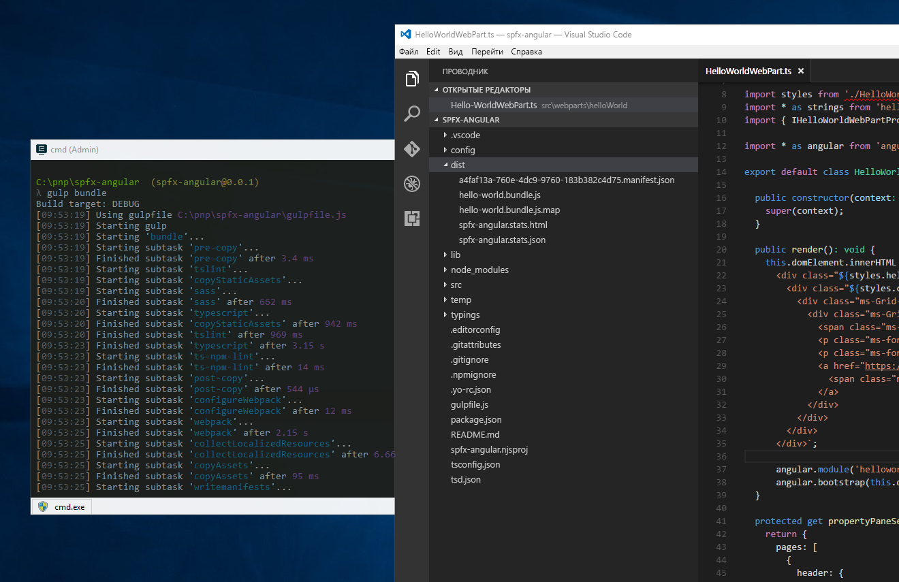
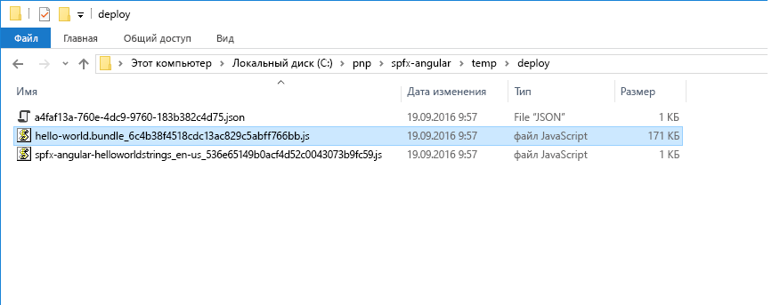
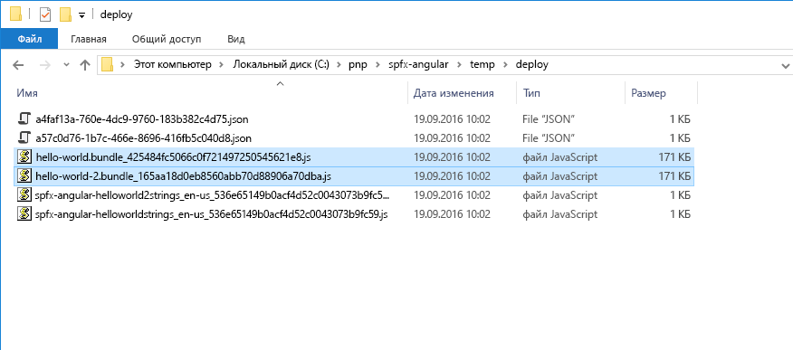
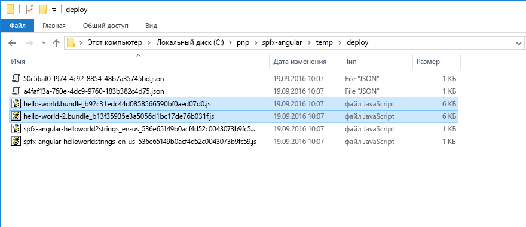

# <a name="use-existing-javascript-libraries-in-sharepoint-framework-client-side-web-parts"></a><span data-ttu-id="1c79d-103">Использование существующих библиотек JavaScript в клиентских веб-частях SharePoint Framework</span><span class="sxs-lookup"><span data-stu-id="1c79d-103">Use existing JavaScript libraries in SharePoint Framework client-side web parts</span></span>

<span data-ttu-id="1c79d-104">Для создания клиентских веб-частей на платформе SharePoint Framework можно использовать существующие библиотеки JavaScript.</span><span class="sxs-lookup"><span data-stu-id="1c79d-104">When building client-side web parts on the SharePoint Framework, you can benefit from using existing JavaScript libraries to build powerful solutions.</span></span> <span data-ttu-id="1c79d-105">Однако существует ряд факторов, которые следует учитывать, чтобы веб-части не снижали скорость загрузки страниц SharePoint, на которых они используются.</span><span class="sxs-lookup"><span data-stu-id="1c79d-105">When building client-side web parts on the SharePoint Framework you can benefit from using existing JavaScript libraries to build powerful solutions. There are however some considerations that you should take into account to ensure that your web parts won't negatively impact the performance of SharePoint pages that they are being used on.</span></span>

## <a name="reference-existing-libraries-as-packages"></a><span data-ttu-id="1c79d-106">Ссылка на существующие библиотеки как на пакеты</span><span class="sxs-lookup"><span data-stu-id="1c79d-106">Reference existing libraries as packages</span></span>

<span data-ttu-id="1c79d-107">Наиболее распространенный способ ссылки на существующие библиотеки JavaScript в клиентских веб-частях SharePoint Framework предполагает их установку в проекте в виде пакета.</span><span class="sxs-lookup"><span data-stu-id="1c79d-107">The most common way of referencing existing JavaScript libraries in SharePoint Framework client-side web parts is by installing them as a package in the project. Taking Angular as an example, to use it in a client-side web part, you would first install Angular using npm:</span></span> 

1. <span data-ttu-id="1c79d-108">Например, чтобы использовать Angular в клиентской веб-части, сначала нужно установить его с помощью **npm**:</span><span class="sxs-lookup"><span data-stu-id="1c79d-108">The most common way of referencing existing JavaScript libraries in SharePoint Framework client-side web parts is by installing them as a package in the project. Taking Angular as an example, to use it in a client-side web part, you would first install Angular using **npm**:</span></span>

  ```sh
  npm install angular --save
  ```

2. <span data-ttu-id="1c79d-109">Чтобы использовать Angular с TypeScript, необходимо установить определения типов с помощью **npm**:</span><span class="sxs-lookup"><span data-stu-id="1c79d-109">Next, to use Angular with TypeScript, you would install typings using **npm**:</span></span>

  ```sh
  npm install @types/angular --save
  ```

3. <span data-ttu-id="1c79d-110">Необходимо сослаться на Angular в веб-части с помощью оператора `import`:</span><span class="sxs-lookup"><span data-stu-id="1c79d-110">Finally, you would reference Angular in your web part using the `import` statement:</span></span>

  ```typescript
  import { Version } from '@microsoft/sp-core-library';
  import {
    BaseClientSideWebPart,
    IPropertyPaneConfiguration,
    PropertyPaneTextField
  } from '@microsoft/sp-webpart-base';
  import { escape } from '@microsoft/sp-lodash-subset';

  import styles from './HelloWorld.module.scss';
  import * as strings from 'helloWorldStrings';
  import { IHelloWorldWebPartProps } from './IHelloWorldWebPartProps';

  import * as angular from 'angular';

  export default class HelloWorldWebPart extends BaseClientSideWebPart<IHelloWorldWebPartProps> {
    public render(): void {
      this.domElement.innerHTML = `
        <div class="${styles.helloWorld}">
          <!-- omitted for brevity -->
        </div>`;

        angular.module('helloworld', []);

        angular.bootstrap(this.domElement, ['helloworld']);
    }

    // omitted for brevity
  }
  ```

## <a name="bundle-web-part-resources"></a><span data-ttu-id="1c79d-111">Объединение ресурсов веб-части в пакет</span><span class="sxs-lookup"><span data-stu-id="1c79d-111">Bundle web part resources</span></span>

<span data-ttu-id="1c79d-112">Платформа SharePoint Framework использует цепочку инструментов для сборки, основанную на инструментах с открытым кодом, таких как gulp и Webpack.</span><span class="sxs-lookup"><span data-stu-id="1c79d-112">SharePoint Framework uses a build toolchain based on open-source tooling such as gulp and Webpack.</span></span> <span data-ttu-id="1c79d-113">При создании проектов SharePoint Framework эти инструменты для сборки автоматически объединяют все ресурсы, на которые ссылается веб-часть, в один файл JavaScript. Этот процесс называется объединением.</span><span class="sxs-lookup"><span data-stu-id="1c79d-113">SharePoint Framework uses a build toolchain based on open-source tooling such as gulp and Webpack. When building SharePoint Framework projects, these build tools automatically combine all referenced resources into a single JavaScript file in the process called bundling.</span></span>



<span data-ttu-id="1c79d-115">У объединения в пакет есть ряд преимуществ.</span><span class="sxs-lookup"><span data-stu-id="1c79d-115">Bundling offers you a number of benefits.</span></span> <span data-ttu-id="1c79d-116">Во-первых, **все ресурсы, необходимые веб-части, доступны в одном файле JavaScript**.</span><span class="sxs-lookup"><span data-stu-id="1c79d-116">First of all, **all resources required by your web part are available in one single JavaScript file**.</span></span> <span data-ttu-id="1c79d-117">Это упрощает развертывание, так как веб-часть состоит из одного файла, и в процессе развертывания невозможно пропустить зависимость.</span><span class="sxs-lookup"><span data-stu-id="1c79d-117">This simplifies the deployment because the web part consists of a single file, and it's impossible to miss a dependency in the deployment process.</span></span>

<span data-ttu-id="1c79d-118">Так как веб-часть использует разные ресурсы, важно, чтобы они загружались в правильном порядке.</span><span class="sxs-lookup"><span data-stu-id="1c79d-118">Because your web part uses different resources, it's important that they are loaded in the right order.</span></span> <span data-ttu-id="1c79d-119">**Пакет веб-части, созданный средством Webpack при сборке, автоматически управляет загрузкой разных ресурсов**, в том числе сопоставляет зависимости между ними.</span><span class="sxs-lookup"><span data-stu-id="1c79d-119">Generated by Webpack during the build, **the web part bundle manages loading the different resources for you**, including resolving any dependencies between these resources.</span></span>

<span data-ttu-id="1c79d-120">У объединения веб-частей также есть преимущества для пользователей: быстрее скачать один большой файл, чем несколько маленьких.</span><span class="sxs-lookup"><span data-stu-id="1c79d-120">Bundling web parts also has benefits for end-users: generally speaking, it's faster to download a single, bigger file than a number of small files.</span></span> <span data-ttu-id="1c79d-121">**Веб-часть быстрее загружается на странице**.</span><span class="sxs-lookup"><span data-stu-id="1c79d-121">By combining a number of smaller files into one bigger bundle, **your web part loads faster on the page**.</span></span> 

<span data-ttu-id="1c79d-122">Но объединение существующих библиотек JavaScript с клиентскими веб-частями SharePoint Framework не лишено недостатков.</span><span class="sxs-lookup"><span data-stu-id="1c79d-122">However, bundling existing JavaScript libraries with SharePoint Framework client-side web parts isn't without drawbacks.</span></span>

<span data-ttu-id="1c79d-123">При объединении существующих платформ JavaScript на базе SharePoint Framework в пакет включаются все сценарии, на которые ссылается веб-часть.</span><span class="sxs-lookup"><span data-stu-id="1c79d-123">When bundling existing JavaScript frameworks in the SharePoint Framework, all referenced scripts are included in the generated bundle file. Following the Angular example, an optimized web part bundle including Angular is over 170KB.</span></span> <span data-ttu-id="1c79d-124">Например, размер оптимизированного пакета веб-части с Angular — более 170 КБ.</span><span class="sxs-lookup"><span data-stu-id="1c79d-124">Following the Angular example, an optimized web part bundle including Angular is over 170 KB.</span></span>



<br/>

<span data-ttu-id="1c79d-126">Если вы добавите в проект еще одну веб-часть на Angular и выполните сборку проекта, то получите два пакета размером более 170 КБ — по одному для каждой веб-части.</span><span class="sxs-lookup"><span data-stu-id="1c79d-126">If you add another web part to your project, that also uses Angular, and you build the project, you get two bundle files - one for each web part, each of them being over 170KB.</span></span>



<br/>

<span data-ttu-id="1c79d-128">Если вы добавите эти веб-части на страницу, каждый пользователь скачает Angular несколько раз.</span><span class="sxs-lookup"><span data-stu-id="1c79d-128">If you would add these web parts to a page, each user would be downloading Angular multiple times - once with each web part on the page. This approach is inefficient and slows down loading the page.</span></span> <span data-ttu-id="1c79d-129">Этот подход неэффективен и замедляет загрузку страницы.</span><span class="sxs-lookup"><span data-stu-id="1c79d-129">This approach is inefficient and slows down page load time.</span></span>

## <a name="reference-existing-libraries-as-external-resources"></a><span data-ttu-id="1c79d-130">Ссылка на существующие библиотеки как на внешние ресурсы</span><span class="sxs-lookup"><span data-stu-id="1c79d-130">Reference existing libraries as external resources</span></span>

<span data-ttu-id="1c79d-131">Предпочтительный способ использования существующих библиотек в клиентских веб-частях SharePoint Framework — сослаться на них как на внешние ресурсы.</span><span class="sxs-lookup"><span data-stu-id="1c79d-131">A better approach to leveraging existing libraries in SharePoint Framework client-side web parts is by referencing them as external resources.</span></span> <span data-ttu-id="1c79d-132">В этом случае в веб-часть будет включаться только URL-адрес сценария.</span><span class="sxs-lookup"><span data-stu-id="1c79d-132">That way, the only information about the particular script that is included in the web part is the script's URL.</span></span> <span data-ttu-id="1c79d-133">При добавлении на страницу веб-часть автоматически попытается загрузить все необходимые ресурсы с указанного URL-адреса.</span><span class="sxs-lookup"><span data-stu-id="1c79d-133">When added to the page, the web part automatically tries to load all required resources from the specified URL.</span></span>

<span data-ttu-id="1c79d-p109">Ссылаться на существующие библиотеки JavaScript на платформе SharePoint Framework легко, и для этого не требуется изменять код. Так как библиотека загружается при запуске с указанного URL-адреса, ее не нужно устанавливать как пакет в проекте.</span><span class="sxs-lookup"><span data-stu-id="1c79d-p109">Referencing existing JavaScript libraries in the SharePoint Framework is easy and doesn't require any specific changes in the code. Because the library is loaded on runtime from the specified URL, it doesn't need to be installed as a package in the project.</span></span>

<span data-ttu-id="1c79d-136">Например, чтобы сослаться на Angular как на внешний ресурс в клиентской веб-части, сначала установите определения типов TypeScript с помощью **npm**:</span><span class="sxs-lookup"><span data-stu-id="1c79d-136">Using Angular as an example, in order to reference it as an external resource in your client-side web part, you start by installing its TypeScript typings using **npm**:</span></span>

```sh
  npm install @types/angular --save
```

<br/>

<span data-ttu-id="1c79d-137">В файле **config/config.json** добавьте следующую запись к свойству **externals**:</span><span class="sxs-lookup"><span data-stu-id="1c79d-137">Next, in the **config/config.json** file, to the **externals** property you add the following entry:</span></span>

```json
  "angular": {
    "path": "https://cdnjs.cloudflare.com/ajax/libs/angular.js/1.5.8/angular.min.js",
    "globalName": "angular"
  }
```

<br/>

<span data-ttu-id="1c79d-138">Весь файл **config/config.json** будет выглядеть примерно так:</span><span class="sxs-lookup"><span data-stu-id="1c79d-138">The complete **config/config.json** file would then look similar to:</span></span>

```json
  {
    "entries": [
      {
        "entry": "./lib/webparts/helloWorld/HelloWorldWebPart.js",
        "manifest": "./src/webparts/helloWorld/HelloWorldWebPart.manifest.json",
        "outputPath": "./dist/hello-world.bundle.js"
      }
    ],
    "externals": {
      "angular": {
        "path": "https://cdnjs.cloudflare.com/ajax/libs/angular.js/1.5.8/angular.min.js",
        "globalName": "angular"
      }
    },
    "localizedResources": {
      "helloWorldStrings": "webparts/helloWorld/loc/{locale}.js"
    }
  }
```

<br/>

<span data-ttu-id="1c79d-139">Сошлитесь на Angular в веб-части так же, как раньше:</span><span class="sxs-lookup"><span data-stu-id="1c79d-139">Finally, you reference Angular in your web part, just like you did previously:</span></span>

```typescript
  import { Version } from '@microsoft/sp-core-library';
  import {
    BaseClientSideWebPart,
    IPropertyPaneConfiguration,
    PropertyPaneTextField
  } from '@microsoft/sp-webpart-base';
  import { escape } from '@microsoft/sp-lodash-subset';

  import styles from './HelloWorld.module.scss';
  import * as strings from 'helloWorldStrings';
  import { IHelloWorldWebPartProps } from './IHelloWorldWebPartProps';

  import * as angular from 'angular';

  export default class HelloWorldWebPart extends BaseClientSideWebPart<IHelloWorldWebPartProps> {
    public render(): void {
      this.domElement.innerHTML = `
        <div class="${styles.helloWorld}">
          <!-- omitted for brevity -->
        </div>`;

        angular.module('helloworld', []);

        angular.bootstrap(this.domElement, ['helloworld']);
    }

    // omitted for brevity
  }
```

<br/>

<span data-ttu-id="1c79d-140">Если вы выполните сборку проекта сейчас, размер созданного пакета составит всего 6 КБ.</span><span class="sxs-lookup"><span data-stu-id="1c79d-140">If you build your project now and take a look at the size of the generated bundle file, you will notice that it's only 6KB.</span></span>


<br/>

<span data-ttu-id="1c79d-142">Если вы добавите в проект еще одну веб-часть на Angular и выполните сборку проекта, размер каждого пакета составит 6 КБ.</span><span class="sxs-lookup"><span data-stu-id="1c79d-142">If you add another web part to your project, that also uses Angular, and you build the project again, both bundles would be 6KB each.</span></span>



<br/>

<span data-ttu-id="1c79d-144">Неправильно считать, что вы только что сэкономили более 300 КБ.</span><span class="sxs-lookup"><span data-stu-id="1c79d-144">It isn't correct to assume that you have just saved over 300 KB.</span></span> <span data-ttu-id="1c79d-145">Обеим веб-частям по-прежнему нужен Angular, и он будет загружен, когда пользователь перейдет на страницу с одной из веб-частей.</span><span class="sxs-lookup"><span data-stu-id="1c79d-145">It isn't correct to assume that you have just saved over 300KB. Both web parts still need Angular and will load it the first time the user visits the page where one of the web parts is placed.</span></span>


<br/>

<span data-ttu-id="1c79d-147">Даже если вы добавите на страницу обе веб-части Angular, SharePoint Framework скачает Angular только один раз.</span><span class="sxs-lookup"><span data-stu-id="1c79d-147">Even if you add both Angular web parts to the page, SharePoint Framework still downloads Angular only once.</span></span>


<br/>

<span data-ttu-id="1c79d-149">Ссылаться на существующие библиотеки JavaScript как внешние ресурсы особенно удобно, если ваша организация хранит все распространенные сценарии вместе или вы используете CDN.</span><span class="sxs-lookup"><span data-stu-id="1c79d-149">The real benefit of referencing existing JavaScript libraries as external resources is if your organization has a centralized location for all commonly-used scripts or you use a CDN.</span></span> <span data-ttu-id="1c79d-150">В таком случае определенная библиотека JavaScript может уже быть в кэше браузера пользователя.</span><span class="sxs-lookup"><span data-stu-id="1c79d-150">In such cases, there is a chance that the particular JavaScript library is already present in the user's browser cache.</span></span> <span data-ttu-id="1c79d-151">В результате нужно загрузить только пакет веб-части, что существенно ускоряет загрузку страницы.</span><span class="sxs-lookup"><span data-stu-id="1c79d-151">As a result, the only thing that needs to be loaded is the web part bundle which makes the page load significantly faster.</span></span>


<br/>

<span data-ttu-id="1c79d-153">В предыдущем примере показано, как загрузить Angular из сети CDN, но использовать общедоступную сеть CDN необязательно.</span><span class="sxs-lookup"><span data-stu-id="1c79d-153">The previous example shows how to load Angular from a CDN, but using a public CDN is not required.</span></span> <span data-ttu-id="1c79d-154">В конфигурации можно указать любое расположение: общедоступную сеть CDN, частный репозиторий или библиотеку документов SharePoint.</span><span class="sxs-lookup"><span data-stu-id="1c79d-154">In the configuration, you can point any location from a public CDN, a privately-hosted repository, to a SharePoint Document Library.</span></span> <span data-ttu-id="1c79d-155">Для нормальной работы веб-частей необходимо, чтобы у пользователей был доступ к указанным URL-адресам.</span><span class="sxs-lookup"><span data-stu-id="1c79d-155">As long as users working with your web parts are able to access the specified URLs, your web parts will work as expected.</span></span>

<span data-ttu-id="1c79d-156">Сети CDN оптимизированы для быстрой доставки ресурсов по всему миру.</span><span class="sxs-lookup"><span data-stu-id="1c79d-156">CDNs are optimized for fast resource delivery across the globe.</span></span> <span data-ttu-id="1c79d-157">Преимущество общедоступных сетей CDN также в том, что определенный сценарий уже мог использоваться на другом веб-сайте, который посещал пользователь.</span><span class="sxs-lookup"><span data-stu-id="1c79d-157">The additional advantage of referencing scripts from public CDNs is that there is a chance that the same script has been used on some other website the user has visited in the past.</span></span> <span data-ttu-id="1c79d-158">Так как сценарий уже есть в локальном кэше браузера, его не нужно скачивать специально для веб-части, поэтому страница с веб-частью будет загружаться еще быстрее.</span><span class="sxs-lookup"><span data-stu-id="1c79d-158">CDNs are optimized for fast resource delivery across the globe. The additional advantage of referencing scripts from public CDNs is, that there is a chance that the same script has been used on some other website that user has visited in the past. Because the script is already present in the local browser's cache it wouldn't need to be downloaded specifically for your web part which would make the page with the web part on it load even faster.</span></span>

<span data-ttu-id="1c79d-159">В некоторых организациях запрещен доступ к общедоступным CDN из корпоративной сети.</span><span class="sxs-lookup"><span data-stu-id="1c79d-159">Some organizations don't allow access to public CDNs from the corporate network.</span></span> <span data-ttu-id="1c79d-160">В таких случаях распространенные платформы JavaScript можно хранить в частном репозитории.</span><span class="sxs-lookup"><span data-stu-id="1c79d-160">In such cases, using a privately-hosted storage location for commonly-used JavaScript frameworks is a great alternative.</span></span> <span data-ttu-id="1c79d-161">Так как библиотеки размещаются в вашей организации, вы сможете управлять заголовками кэша, чтобы повысить скорость загрузки ресурсов.</span><span class="sxs-lookup"><span data-stu-id="1c79d-161">Some organizations don't allow access to public CDNs from the corporate network. In such cases using a privately-hosted storage location for commonly-used JavaScript frameworks is a great alternative. Because your organization hosts the libraries, it could also control the cache headers which could help you optimize your resources for performance even further.</span></span> 

## <a name="javascript-libraries-formats"></a><span data-ttu-id="1c79d-162">Форматы библиотек JavaScript</span><span class="sxs-lookup"><span data-stu-id="1c79d-162">JavaScript libraries formats</span></span>

<span data-ttu-id="1c79d-163">Разные библиотеки JavaScript создаются и упаковываются по-разному.</span><span class="sxs-lookup"><span data-stu-id="1c79d-163">Different JavaScript libraries are built and packaged in different ways.</span></span> <span data-ttu-id="1c79d-164">Одни упаковываются как модули, а другие представляют собой простые сценарии, которые выполняются в глобальной области (их часто называют немодульными сценариями).</span><span class="sxs-lookup"><span data-stu-id="1c79d-164">Some are packaged as modules, while others are plain scripts that run in the global scope (these scripts are often referred to as non-module scripts).</span></span> <span data-ttu-id="1c79d-165">При загрузке библиотек JavaScript с URL-адреса порядок регистрации внешнего сценария в проекте SharePoint Framework зависит от его формата.</span><span class="sxs-lookup"><span data-stu-id="1c79d-165">When loading JavaScript libraries from a URL, how you register an external script in a SharePoint Framework project depends on the format of the script.</span></span> <span data-ttu-id="1c79d-166">Существует несколько форматов модулей (AMD, UMD, CommonJS), но вам достаточно знать, является ли сценарий модулем.</span><span class="sxs-lookup"><span data-stu-id="1c79d-166">There are multiple module formats, such as AMD, UMD, or CommonJS, but the only thing that you have to know is if the particular script is a module or not.</span></span>

<span data-ttu-id="1c79d-167">При регистрации сценариев, упакованных в виде модулей, вам нужно лишь указать URL-адрес, с которого следует скачать сценарий.</span><span class="sxs-lookup"><span data-stu-id="1c79d-167">When registering scripts packaged as modules the only thing that you have to specify, is the URL where the particular script should be downloaded from. Dependencies to other scripts are handled already inside the script's module construct.</span></span> <span data-ttu-id="1c79d-168">Зависимости от других сценариев загружены в конструкцию модуля сценария.</span><span class="sxs-lookup"><span data-stu-id="1c79d-168">Dependencies to other scripts are handled inside the script's module construct.</span></span>

<span data-ttu-id="1c79d-169">С другой стороны, для немодульных сценариев необходимо указать по крайней мере URL-адрес для скачивания сценария и имя переменной для регистрации в глобальной области.</span><span class="sxs-lookup"><span data-stu-id="1c79d-169">Non-module scripts on the other hand require at minimum the URL from where the script should be downloaded and the name of the variable with which the script will be registered in the global scope. If the non-module script depends on other scripts, they can be listed as dependencies. To illustrate this, let's have a look at a few examples.</span></span> <span data-ttu-id="1c79d-170">Если немодульный сценарий зависит от других сценариев, их можно указать как зависимости.</span><span class="sxs-lookup"><span data-stu-id="1c79d-170">If the non-module script depends on other scripts, they can be listed as dependencies.</span></span> <span data-ttu-id="1c79d-171">Рассмотрим несколько примеров.</span><span class="sxs-lookup"><span data-stu-id="1c79d-171">To illustrate this, let's have a look at a few examples.</span></span>

<span data-ttu-id="1c79d-p118">Angular 1.x — это немодульный сценарий. Чтобы зарегистрировать его как внешний ресурс в проекте SharePoint Framework, необходимо указать его URL-адрес и имя глобальной переменной для регистрации:</span><span class="sxs-lookup"><span data-stu-id="1c79d-p118">Angular v1.x is a non-module script. You register it as an external resource in a SharePoint Framework project by specifying its URL and the name of the global variable it should register with:</span></span>

```json
"angular": {
  "path": "https://cdnjs.cloudflare.com/ajax/libs/angular.js/1.5.8/angular.min.js",
  "globalName": "angular"
}
```

<span data-ttu-id="1c79d-p119">Важно, чтобы имя, указанное в свойстве **globalName**, соответствовало имени, используемому в сценарии. В этом случае другие сценарии, которые от него зависят, смогут получить к нему доступ.</span><span class="sxs-lookup"><span data-stu-id="1c79d-p119">It's important that the name specified in the **globalName** property corresponds to the name used by the script. That way it can correctly expose itself to other scripts that might depend on it.</span></span>

<span data-ttu-id="1c79d-176">[ngOfficeUIFabric](http://ngofficeuifabric.com/) — директивы Angular для Office UI Fabric. Это модуль UMD, который зависит от Angular.</span><span class="sxs-lookup"><span data-stu-id="1c79d-176">[ngOfficeUIFabric](http://ngofficeuifabric.com/), the Angular directives for Office UI Fabric, is a UMD module that depends on Angular.</span></span> <span data-ttu-id="1c79d-177">Зависимость от Angular уже загружена в модуль, поэтому для его регистрации вам нужно лишь указать его URL-адрес:</span><span class="sxs-lookup"><span data-stu-id="1c79d-177">ngOfficeUIFabric - the Angular directives for Office UI Fabric, is a UMD module that depends on Angular. The dependency on Angular is already handled inside the module, so to register it all you need to specify is its URL:</span></span>

```json
"ng-office-ui-fabric": "https://cdnjs.cloudflare.com/ajax/libs/ngOfficeUiFabric/0.12.3/ngOfficeUiFabric.js"
```

<span data-ttu-id="1c79d-178">jQuery — это сценарий AMD.</span><span class="sxs-lookup"><span data-stu-id="1c79d-178">jQuery is an AMD script. To register it you could simply use:</span></span> <span data-ttu-id="1c79d-179">Вот как его можно зарегистрировать:</span><span class="sxs-lookup"><span data-stu-id="1c79d-179">jQuery is an AMD script. To register it you could simply use:</span></span>

```json
"jquery": "https://code.jquery.com/jquery-2.2.4.js"
```

<span data-ttu-id="1c79d-180">Теперь представим, что вы хотите использовать jQuery с подключаемым модулем jQuery, который распространяется как немодульный сценарий.</span><span class="sxs-lookup"><span data-stu-id="1c79d-180">Imagine now, that you wanted to use jQuery with a jQuery plugin that itself is distributed as a non-module script. If you registered both scripts using:</span></span> 

<span data-ttu-id="1c79d-181">Если вы зарегистрировали оба сценария, используя приведенный ниже код, загрузка веб-части, скорее всего, приведет к ошибке.</span><span class="sxs-lookup"><span data-stu-id="1c79d-181">If you registered both scripts by using the following code, loading the web part would very likely result in an error.</span></span> <span data-ttu-id="1c79d-182">Возможно, оба сценария будут загружаться параллельно и подключаемый модуль не сможет зарегистрироваться в jQuery.</span><span class="sxs-lookup"><span data-stu-id="1c79d-182">loading the web part would very likely result in an error: there is a chance that both scripts would be loaded in parallel and the plugin wouldn't be able to register itself with jQuery.</span></span>

```json
"jquery": "https://code.jquery.com/jquery-2.2.4.js",
"simpleWeather": {
  "path": "https://cdnjs.cloudflare.com/ajax/libs/jquery.simpleWeather/3.1.0/jquery.simpleWeather.min.js",
  "globalName": "jQuery"
}
```

<br/>


<br/>

<span data-ttu-id="1c79d-184">Как упоминалось ранее, платформа SharePoint Framework позволяет указать зависимости для немодульных подключаемых модулей. Эти зависимости задаются с помощью свойства **globalDependencies**:</span><span class="sxs-lookup"><span data-stu-id="1c79d-184">As mentioned before, SharePoint Framework allows you to specify dependencies for non-module plugins. These dependencies are specified using the **globalDependencies** property:</span></span>

```json
"jquery": "https://code.jquery.com/jquery-2.2.4.js",
"simpleWeather": {
  "path": "https://cdnjs.cloudflare.com/ajax/libs/jquery.simpleWeather/3.1.0/jquery.simpleWeather.min.js",
  "globalName": "jQuery",
  "globalDependencies": [ "jquery" ]
}
```

<br/>

<span data-ttu-id="1c79d-185">Каждая зависимость, указанная в свойстве **globalDependencies**, должна указывать на другую зависимость в разделе **externals** файла **config/config.json**.</span><span class="sxs-lookup"><span data-stu-id="1c79d-185">Each dependency specified in the **globalDependencies** property must point to another dependency in the **externals** section of the **config/config.json** file.</span></span>

<span data-ttu-id="1c79d-186">Теперь при сборке проекта появится другое сообщение об ошибке, в котором будет указано, что невозможно задать зависимость от немодульного сценария.</span><span class="sxs-lookup"><span data-stu-id="1c79d-186">If you would try to build the project now, you would get another error, this time stating that you can't specify a dependency to a non-module script.</span></span>


<br/>

<span data-ttu-id="1c79d-188">Чтобы устранить эту проблему, достаточно зарегистрировать jQuery как немодульный сценарий.</span><span class="sxs-lookup"><span data-stu-id="1c79d-188">To solve this problem, all you need to do is to register jQuery as a non-module script:</span></span>

```json
"jquery": {
  "path": "https://code.jquery.com/jquery-2.1.1.min.js",
  "globalName": "jQuery"
},
"simpleWeather": {
  "path": "https://cdnjs.cloudflare.com/ajax/libs/jquery.simpleWeather/3.1.0/jquery.simpleWeather.min.js",
  "globalName": "jQuery",
  "globalDependencies": [ "jquery" ]
}
```

<span data-ttu-id="1c79d-189">Так вы укажите, что сценарий **simpleWeather** необходимо загружать после сценария jQuery, который должен быть доступен под глобально доступной переменной `jQuery`, необходимой для регистрации подключаемого модуля jQuery **simpleWeather**.</span><span class="sxs-lookup"><span data-stu-id="1c79d-189">This way you specify that the **simpleWeather** script should be loaded after jQuery and that jQuery should be available under a globally available variable `jQuery` which is required by the **simpleWeather** jQuery plugin to register itself.</span></span>

> [!NOTE] 
> <span data-ttu-id="1c79d-p123">Обратите внимание, что в записи для регистрации jQuery имя внешнего ресурса указано как **jquery**, а имя глобальной переменной — как **jQuery**. Имя внешнего ресурса используется в операторах `import` в коде. Это имя должно соответствовать определениям типов TypeScript. Имя глобальной переменной, указанное с помощью свойства **globalName** — это имя, которое распознают другие сценарии, например подключаемые модули, созданные на основе библиотеки. Для некоторых библиотек эти имена могут быть одинаковыми, но это необязательно. Во избежание проблем используйте правильные имена.</span><span class="sxs-lookup"><span data-stu-id="1c79d-p123">Note how the entry for registering jQuery uses **jquery** for the external resource name but **jQuery** as the global variable name. The name of the external resource is the name that you use in the `import` statements in your code. This is also the name that must match TypeScript typings. The global variable name, specified using the **globalName** property, is the name known to other scripts like plugins built on top of the library. While for some libraries these names might be the same, it's not required and you should carefully check that you are using correct names to avoid any problems.</span></span>

<span data-ttu-id="1c79d-p124">Вручную сложно определить, является ли загружаемый сценарий модульным, особенно если он минифицирован. Если у вашего сценария есть общедоступный URL-адрес, вы можете определить его тип, используя бесплатный инструмент [Rencore SharePoint Framework Script Check](https://rencore.com/sharepoint-framework/script-check/). Кроме того, этот инструмент позволяет узнать, правильно ли настроен место размещения, с которого загружается сценарий.</span><span class="sxs-lookup"><span data-stu-id="1c79d-p124">It's hard to determine manually whether the script that you're trying to load is a module or a non-module script. This is especially the case if the script that you're trying to load is minified. If your script is hosted on a publicly accessible URL, you can use the free [Rencore SharePoint Framework Script Check](https://rencore.com/sharepoint-framework/script-check/) tool to determine the type of script for you. Additionally, this tool will let you know whether the hosting location from which you're loading the script is properly configured.</span></span>

## <a name="non-module-scripts-considerations"></a><span data-ttu-id="1c79d-199">Рекомендации в отношении немодульных сценариев</span><span class="sxs-lookup"><span data-stu-id="1c79d-199">Non-module scripts considerations</span></span>

<span data-ttu-id="1c79d-p125">Многие из разработанных ранее библиотек и сценариев JavaScript распространяются в виде немодульных сценариев. На платформе SharePoint Framework можно загружать немодульные сценарии, но лучше их не использовать.</span><span class="sxs-lookup"><span data-stu-id="1c79d-p125">Many JavaScript libraries and scripts developed in the past are distributed as non-module scripts. While the SharePoint Framework supports loading non-module scripts, you should strive to avoid using them whenever possible.</span></span>

<span data-ttu-id="1c79d-p126">Немодульные сценарии регистрируются в глобальном контексте страницы: сценарий, загруженный одной веб-частью, доступен всем другим веб-частям на странице. Если две веб-части, использующие разные версии jQuery, загружаются как немодульные сценарии, то последняя из них перезаписывает все зарегистрированные ранее версии jQuery.</span><span class="sxs-lookup"><span data-stu-id="1c79d-p126">Non-module scripts are registered in the global scope of the page: script loaded by one web part is available to all other web parts on the page. If you had two web parts using different versions of jQuery, both loaded as non-module scripts, the web part that loaded the last would overwrite all previously registered versions of jQuery. As you can imagine, this could lead to unpredictable results and very hard to debug issues that would occur only in certain scenarios - only with other web parts using a different version of jQuery on the page and only when they load in particular order. The module architecture solves this problem by isolating scripts and preventing them from affecting each other.</span></span> 

<span data-ttu-id="1c79d-204">Как вы можете представить, результаты будут непредсказуемыми. Очень трудно отслеживать ошибки, возникающие только в определенных ситуациях (например, когда другие веб-части на странице используют другую версию jQuery и загружаются в определенном порядке).</span><span class="sxs-lookup"><span data-stu-id="1c79d-204">As you can imagine, this could lead to unpredictable results, and it would be very hard to debug issues that would occur only in certain scenarios, such as only with other web parts by using a different version of jQuery on the page and only when they load in a particular order.</span></span> <span data-ttu-id="1c79d-205">Для решения этой проблемы созданы модули: в них сценарии изолируются и не могут влиять друг на друга.</span><span class="sxs-lookup"><span data-stu-id="1c79d-205">The module architecture solves this problem by isolating scripts and preventing them from affecting each other.</span></span>

## <a name="when-you-should-consider-bundling"></a><span data-ttu-id="1c79d-206">Рекомендации по объединению</span><span class="sxs-lookup"><span data-stu-id="1c79d-206">When you should consider bundling</span></span>

<span data-ttu-id="1c79d-p128">Из-за объединения существующих библиотек JavaScript с веб-частью размер файлов может увеличиться, а скорость загрузки страниц — снизиться. Как правило, не следует объединять библиотеки JavaScript с веб-частями, но иногда это может быть полезно.</span><span class="sxs-lookup"><span data-stu-id="1c79d-p128">Bundling existing JavaScript libraries into your web part can lead to big web part files and can cause poor performance of pages using that web part. While you should generally avoid bundling JavaScript libraries with your web parts, there are scenarios where bundling could work to your advantage.</span></span>

<span data-ttu-id="1c79d-209">Если вы создаете стандартное решение, которое должно работать во всех интрасетях, объединение всех ресурсов с веб-частью обеспечивает ее должную работу.</span><span class="sxs-lookup"><span data-stu-id="1c79d-209">If you are building a standard solution that should work on every intranet, bundling all your resources with your web part can help you ensure that your web part works as expected.</span></span> <span data-ttu-id="1c79d-210">Так как вы не знаете заранее, где будет установлено ваше решение, добавление всех зависимостей в пакет веб-части обеспечит ее правильную работу, даже если в организации запрещено скачивать ресурсы из сети CDN или другого внешнего источника.</span><span class="sxs-lookup"><span data-stu-id="1c79d-210">If you are building a standard solution that should work on every intranet, bundling all your resources with your web part can help you ensure that your web part will work as expected. Because you don't know upfront where your solution will be installed, including all dependencies in your web part's bundle file will allow it to work correctly - even if the organization doesn't allow downloading resources from a CDN or other external location.</span></span>

<span data-ttu-id="1c79d-211">Если решение состоит из нескольких веб-частей с общими функциями, лучше всего создать общие функции как отдельную библиотеку и сослаться на нее как внешний ресурс во всех веб-частях.</span><span class="sxs-lookup"><span data-stu-id="1c79d-211">If your solution consists of a number of web parts, that share some functionality with each other, then it would be better to build the shared functionality as a separate library and reference it as an external resource in all web parts. That way users would need to download the common library only once and reuse it with all web parts.</span></span> <span data-ttu-id="1c79d-212">В этом случае пользователям нужно всего один раз скачать общую библиотеку и использовать ее со всеми веб-частями.</span><span class="sxs-lookup"><span data-stu-id="1c79d-212">That way users need to download the common library only once and reuse it with all web parts.</span></span>

## <a name="summary"></a><span data-ttu-id="1c79d-213">Сводка</span><span class="sxs-lookup"><span data-stu-id="1c79d-213">Summary</span></span>

<span data-ttu-id="1c79d-214">Для создания клиентских веб-частей на платформе SharePoint Framework можно использовать имеющиеся библиотеки JavaScript.</span><span class="sxs-lookup"><span data-stu-id="1c79d-214">When building client-side web parts on the SharePoint Framework, you can benefit from existing JavaScript libraries to build powerful solutions.</span></span> <span data-ttu-id="1c79d-215">Платформа SharePoint Framework позволяет объединять эти библиотеки вместе с веб-частями или загружать их как внешний ресурс.</span><span class="sxs-lookup"><span data-stu-id="1c79d-215">SharePoint Framework allows you to either bundle these libraries together with your web parts or load them as an external resource.</span></span> <span data-ttu-id="1c79d-216">Мы рекомендуем загружать существующие библиотеки с URL-адреса, но иногда можно объединить их в пакет. Оцените свои потребности, чтобы выбрать наиболее подходящий способ.</span><span class="sxs-lookup"><span data-stu-id="1c79d-216">When building client-side web parts on the SharePoint Framework you can benefit of existing JavaScript libraries to build powerful solutions. SharePoint Framework allows you to either bundle these libraries together with your web parts or load them as an external resource. While loading existing libraries from a URL is generally the recommended approach, there are scenarios where bundling might be beneficial and it's essential that you evaluate your requirements carefully to choose the approach that meets your needs the best.</span></span>

## <a name="see-also"></a><span data-ttu-id="1c79d-217">См. также</span><span class="sxs-lookup"><span data-stu-id="1c79d-217">See also</span></span>

- [<span data-ttu-id="1c79d-218">Обзор SharePoint Framework</span><span class="sxs-lookup"><span data-stu-id="1c79d-218">SharePoint Framework Extensions Overview</span></span>](../../sharepoint-framework-overview.md)