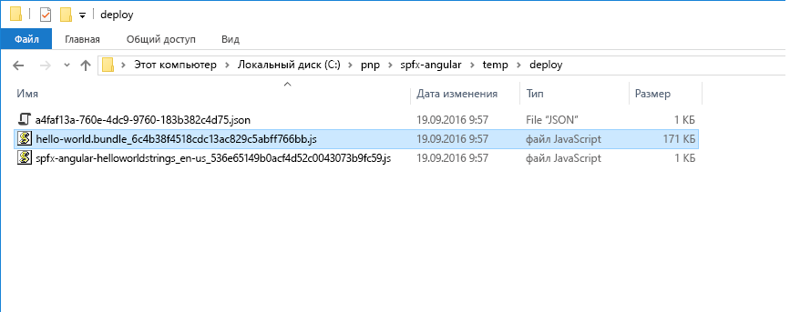
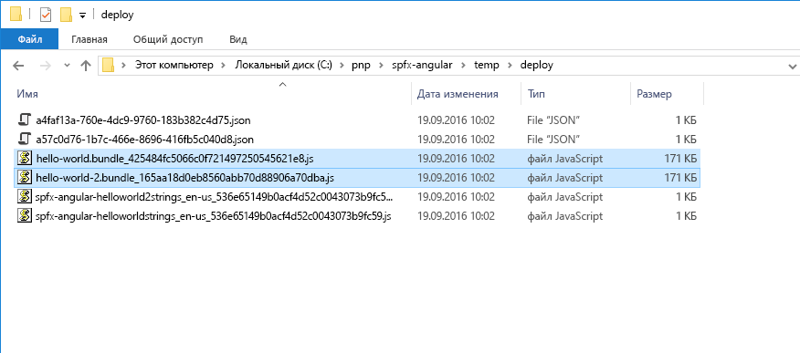
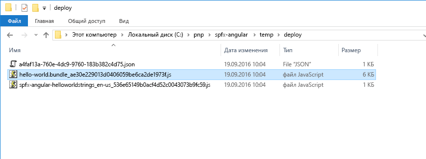
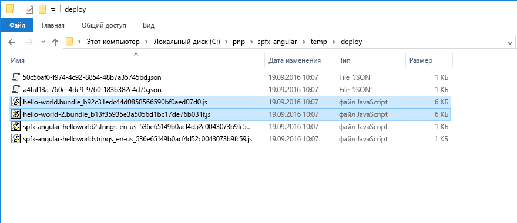
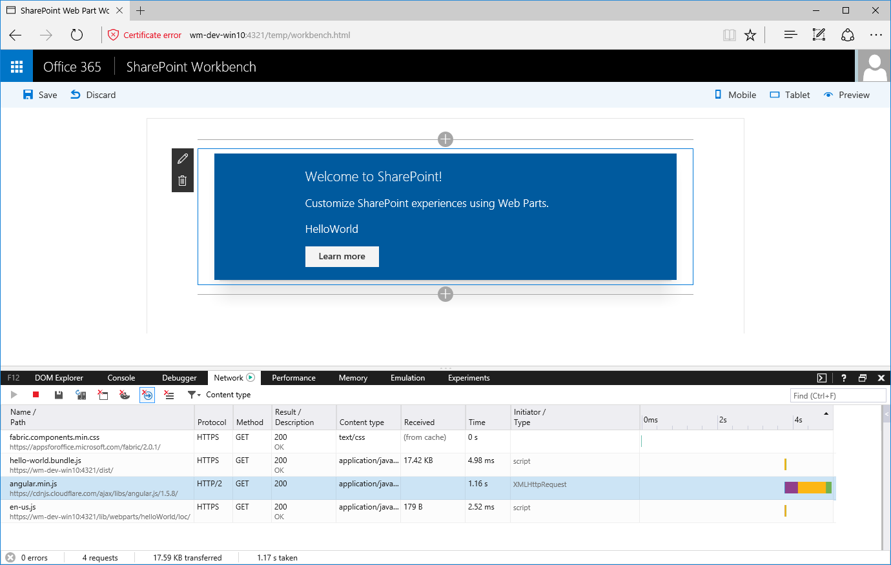
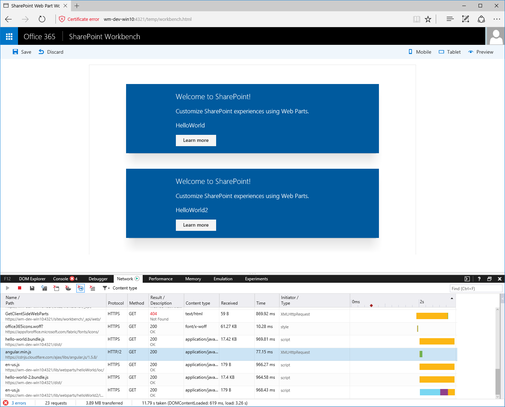
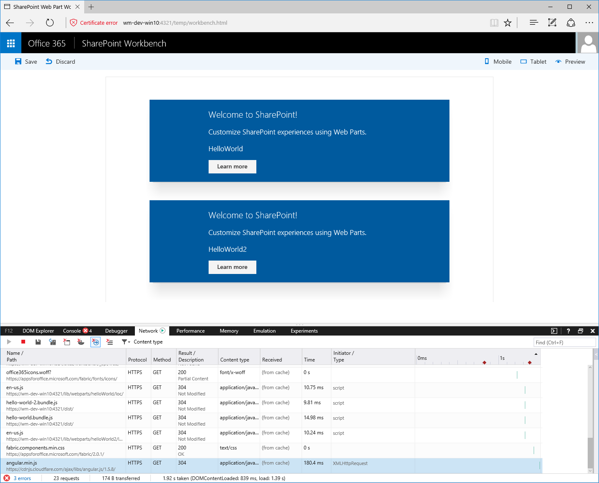

# <a name="use-existing-javascript-libraries-in-sharepoint-framework-client-side-web-parts"></a>Использование существующих библиотек JavaScript в клиентских веб-частях SharePoint Framework

Для создания клиентских веб-частей на платформе SharePoint Framework можно использовать существующие библиотеки JavaScript. Однако существует ряд факторов, которые следует учитывать, чтобы веб-части не снижали скорость загрузки страниц SharePoint, на которых они используются.

## <a name="reference-existing-libraries-as-packages"></a>Ссылка на существующие библиотеки как на пакеты

Наиболее распространенный способ ссылки на существующие библиотеки JavaScript в клиентских веб-частях SharePoint Framework предполагает их установку в проекте в виде пакета. Например, чтобы использовать Angular в клиентской веб-части, сначала нужно установить его с помощью **npm**:

```sh
npm install angular --save
```

Чтобы использовать Angular с TypeScript, необходимо установить определения типов с помощью **npm**:

```sh
npm install @types/angular --save-dev
```

Наконец, необходимо сослаться на Angular в веб-части с помощью оператора `import`:

```ts
import { Version } from '@microsoft/sp-core-library';
import {
  BaseClientSideWebPart,
  IPropertyPaneConfiguration,
  PropertyPaneTextField
} from '@microsoft/sp-webpart-base';
import { escape } from '@microsoft/sp-lodash-subset';

import styles from './HelloWorld.module.scss';
import * as strings from 'helloWorldStrings';
import { IHelloWorldWebPartProps } from './IHelloWorldWebPartProps';

import * as angular from 'angular';

export default class HelloWorldWebPart extends BaseClientSideWebPart<IHelloWorldWebPartProps> {
  public render(): void {
    this.domElement.innerHTML = `
      <div class="${styles.helloWorld}">
        <!-- omitted for brevity -->
      </div>`;

      angular.module('helloworld', []);

      angular.bootstrap(this.domElement, ['helloworld']);
  }

  // omitted for brevity
}
```

## <a name="bundle-web-part-resources"></a>Объединение ресурсов веб-части в пакет

Платформа SharePoint Framework использует цепочку инструментов для сборки, основанную на инструментах с открытым кодом, таких как gulp и Webpack. При создании проектов SharePoint Framework эти инструменты для сборки автоматически объединяют все ресурсы, на которые ссылается веб-часть, в один файл JavaScript.


У объединения в пакет есть ряд преимуществ. Во-первых, все ресурсы, необходимые веб-части, доступны в одном файле JavaScript. Это упрощает развертывание, так как веб-часть состоит из одного файла, и в процессе развертывания невозможно пропустить зависимость. Так как веб-часть использует разные ресурсы, важно, чтобы они загружались в правильном порядке. Пакет веб-части, созданный средством Webpack при сборке, управляет загрузкой разных ресурсов, в том числе сопоставляет зависимости между ними. У объединения веб-частей также есть преимущества для конечных пользователей: быстрее скачать один большой файл, чем несколько маленьких. Веб-часть будет быстрее загружаться на странице. Однако объединение существующих библиотек JavaScript с клиентскими веб-частями SharePoint Framework не лишено недостатков.

При объединении существующих платформ JavaScript на базе SharePoint Framework в пакет включаются все сценарии, на которые ссылается веб-часть. Например, размер оптимизированного пакета веб-части с Angular — более 170 КБ.



Если вы добавите в проект еще одну веб-часть на Angular и выполните сборку проекта, то получите два пакета размером более 170 КБ — по одному для каждой веб-части.



Если вы добавите эти веб-части на страницу, каждый пользователь будет скачивать Angular несколько раз. Этот подход неэффективен и замедляет загрузку страницы.

## <a name="reference-existing-libraries-as-external-resources"></a>Ссылка на существующие библиотеки как на внешние ресурсы

Это более предпочтительный способ использования существующих библиотек в клиентской веб-части SharePoint Framework. В этом случае в веб-часть будет включаться только URL-адрес сценария. При добавлении на страницу веб-часть автоматически попытается загрузить все необходимые ресурсы с указанных URL-адресов.

Ссылаться на существующие библиотеки JavaScript на платформе SharePoint Framework легко, и для этого не требуется изменять код. Так как библиотека загружается при запуске с указанного URL-адреса, ее не нужно устанавливать как пакет в проекте.

Например, чтобы сослаться на Angular как на внешний ресурс в клиентской веб-части, сначала установите определения типов TypeScript с помощью **npm**:

```sh
npm install @types/angular --save-dev
```

Далее в файле **config/config.json** добавьте следующую запись к свойству **externals**:

```json
"angular": {
  "path": "https://cdnjs.cloudflare.com/ajax/libs/angular.js/1.5.8/angular.min.js",
  "globalName": "angular"
}
```

Весь файл **config/config.json** будет выглядеть примерно так:

```json
{
  "entries": [
    {
      "entry": "./lib/webparts/helloWorld/HelloWorldWebPart.js",
      "manifest": "./src/webparts/helloWorld/HelloWorldWebPart.manifest.json",
      "outputPath": "./dist/hello-world.bundle.js"
    }
  ],
  "externals": {
    "angular": {
      "path": "https://cdnjs.cloudflare.com/ajax/libs/angular.js/1.5.8/angular.min.js",
      "globalName": "angular"
    }
  },
  "localizedResources": {
    "helloWorldStrings": "webparts/helloWorld/loc/{locale}.js"
  }
}
```

Наконец, сошлитесь на Angular так же, как раньше:

```ts
import { Version } from '@microsoft/sp-core-library';
import {
  BaseClientSideWebPart,
  IPropertyPaneConfiguration,
  PropertyPaneTextField
} from '@microsoft/sp-webpart-base';
import { escape } from '@microsoft/sp-lodash-subset';

import styles from './HelloWorld.module.scss';
import * as strings from 'helloWorldStrings';
import { IHelloWorldWebPartProps } from './IHelloWorldWebPartProps';

import * as angular from 'angular';

export default class HelloWorldWebPart extends BaseClientSideWebPart<IHelloWorldWebPartProps> {
  public render(): void {
    this.domElement.innerHTML = `
      <div class="${styles.helloWorld}">
        <!-- omitted for brevity -->
      </div>`;

      angular.module('helloworld', []);

      angular.bootstrap(this.domElement, ['helloworld']);
  }

  // omitted for brevity
}
```

Если вы выполните сборку проекта сейчас, размер созданного пакета составит всего 6 КБ.



Если вы добавите в проект еще одну веб-часть на Angular и выполните сборку проекта, размер каждого пакета составит 6 КБ.



Неправильно считать, что вы только что сэкономили более 300 КБ. Обеим веб-частям по-прежнему нужен Angular, и он будет загружен, когда пользователь перейдет на страницу с одной из веб-частей.



Даже если вы добавите на страницу обе веб-части Angular, SharePoint Framework скачает Angular только один раз.



Ссылаться на существующие библиотеки JavaScript как внешние ресурсы особенно удобно, если ваша организация хранит все распространенные сценарии вместе или вы используете CDN. В таком случае определенная библиотека JavaScript может уже быть в кэше браузера пользователя. В результате нужно загрузить только пакет веб-части, что существенно ускоряет загрузку страницы.



В примере выше показано, как загрузить Angular из CDN, но использовать общедоступную CDN необязательно. В конфигурации можно указать любое расположение: общедоступную CDN, частный репозиторий или библиотеку документов SharePoint. Для нормальной работы веб-частей необходимо, чтобы у пользователей был доступ к указанным URL-адресам.

Сети CDN оптимизированы для быстрой доставки ресурсов по всему миру. Преимущество общедоступных CDN также в том, что определенный сценарий уже мог использоваться на другом веб-сайте, который посещал пользователь. Так как сценарий уже есть в локальном кэше браузера, его не нужно скачивать специально для веб-части, в результате страница с веб-частью будет загружаться еще быстрее.

В некоторых организациях запрещен доступ к общедоступным CDN из корпоративной сети. В таких случаях распространенные платформы JavaScript можно хранить в частном репозитории. Так как библиотеки размещаются в вашей организации, вы сможете управлять заголовками кэша, чтобы повысить скорость загрузки ресурсов. 

## <a name="javascript-libraries-formats"></a>Форматы библиотек JavaScript

Разные библиотеки JavaScript создаются и упаковываются по-разному. Одни упаковываются как модули, а другие представляют собой простые сценарии, которые выполняются в глобальной области (их часто называют немодульными сценариями). При загрузке библиотек JavaScript с URL-адреса порядок регистрации внешнего сценария в проекте SharePoint Framework зависит от его формата. Существует несколько форматов модулей (AMD, UMD, CommonJS), но вам достаточно знать, является ли сценарий модулем.

При регистрации сценариев, упакованных в виде модулей, вам нужно лишь указать URL-адрес, с которого следует скачать сценарий. Зависимости от других сценариев уже загружены в конструкцию модуля сценария.

Для немодульных сценариев необходимо указать по крайней мере URL-адрес для скачивания сценария и имя переменной для регистрации в глобальной области. Если немодульный сценарий зависит от других сценариев, их можно указать как зависимости. Рассмотрим несколько примеров.

Angular 1.x — это немодульный сценарий. Чтобы зарегистрировать его как внешний ресурс в проекте SharePoint Framework, необходимо указать его URL-адрес и имя глобальной переменной для регистрации:

```json
"angular": {
  "path": "https://cdnjs.cloudflare.com/ajax/libs/angular.js/1.5.8/angular.min.js",
  "globalName": "angular"
}
```

Важно, чтобы имя, указанное в свойстве **globalName**, соответствовало имени, используемому в сценарии. В этом случае другие сценарии, которые от него зависят, смогут получить к нему доступ.

[ngOfficeUIFabric](http://ngofficeuifabric.com) — директивы Angular для Office UI Fabric, это модуль UMD, который зависит от Angular. Зависимость от Angular уже загружена в модуль, поэтому чтобы зарегистрировать его, вам нужно лишь указать его URL-адрес:

```json
"ng-office-ui-fabric": "https://cdnjs.cloudflare.com/ajax/libs/ngOfficeUiFabric/0.12.3/ngOfficeUiFabric.js"
```

jQuery — это сценарий AMD. Вот как можно его зарегистрировать:

```json
"jquery": "https://code.jquery.com/jquery-2.2.4.js"
```

Теперь представим, что вы хотите использовать jQuery с подключаемым модулем jQuery, который распространяется как немодульный сценарий. Если вы зарегистрировали оба сценария следующим образом:

```json
"jquery": "https://code.jquery.com/jquery-2.2.4.js",
"simpleWeather": {
  "path": "https://cdnjs.cloudflare.com/ajax/libs/jquery.simpleWeather/3.1.0/jquery.simpleWeather.min.js",
  "globalName": "jQuery"
}
```

загрузка веб-части, скорее всего, приведет к ошибке: возможно, оба сценария будут загружаться параллельно и подключаемый модуль не сможет зарегистрироваться в jQuery.


Как упоминалось выше, платформа SharePoint Framework позволяет указать зависимости для немодульных подключаемых модулей. Эти зависимости задаются с помощью свойства **globalDependencies**:

```json
"jquery": "https://code.jquery.com/jquery-2.2.4.js",
"simpleWeather": {
  "path": "https://cdnjs.cloudflare.com/ajax/libs/jquery.simpleWeather/3.1.0/jquery.simpleWeather.min.js",
  "globalName": "jQuery",
  "globalDependencies": [ "jquery" ]
}
```

Каждая зависимость, указанная в свойстве **globalDependencies**, должна указывать на другую зависимость в разделе **externals** файла **config/config.json**.

Теперь при сборке проекта появится другое сообщение об ошибке, в котором будет указано, что невозможно задать зависимость от немодульного сценария.


Чтобы устранить эту проблему, достаточно зарегистрировать jQuery как немодульный сценарий.

```json
"jquery": {
  "path": "https://code.jquery.com/jquery-2.1.1.min.js",
  "globalName": "jQuery"
},
"simpleWeather": {
  "path": "https://cdnjs.cloudflare.com/ajax/libs/jquery.simpleWeather/3.1.0/jquery.simpleWeather.min.js",
  "globalName": "jQuery",
  "globalDependencies": [ "jquery" ]
}
```

Так вы укажите, что сценарий **simpleWeather** необходимо загружать после сценария jQuery, который должен быть доступен под глобально доступной переменной `jQuery`, необходимой для регистрации подключаемого модуля jQuery **simpleWeather**.

> Обратите внимание, что в записи для регистрации jQuery имя внешнего ресурса указано как **jquery**, а имя глобальной переменной — как **jQuery**. Имя внешнего ресурса используется в операторах `import` в коде. Это имя должно соответствовать определениям типов TypeScript. Имя глобальной переменной, указанное с помощью свойства **globalName** — это имя, которое распознают другие сценарии, например подключаемые модули, созданные на основе библиотеки. Для некоторых библиотек эти имена могут быть одинаковыми, но это необязательно. Чтобы избежать проблем, используйте правильные имена. 

## <a name="non-module-scripts-considerations"></a>Рекомендации в отношении немодульных сценариев

Многие из разработанных ранее библиотек и сценариев JavaScript распространяются в виде немодульных сценариев. На платформе SharePoint Framework можно загружать немодульные сценарии, но лучше их не использовать.

Немодульные сценарии регистрируются в глобальном контексте страницы: сценарий, загруженный одной веб-частью, доступен всем другим веб-частям на странице. Если две веб-части, использующие разные версии jQuery, загружаются как немодульные сценарии, то последняя из них перезаписывает все зарегистрированные ранее версии jQuery. Как вы можете представить, результаты будут непредсказуемыми. Очень сложно отслеживать ошибки, возникающие только в определенных ситуациях (например, когда другие веб-части на странице используют другую версию jQuery и загружаются в определенном порядке). Для решения этой проблемы созданы модули: в них сценарии изолируются и не могут влиять друг на друга.

## <a name="when-you-should-consider-bundling"></a>Рекомендации по объединению

Из-за объединения существующих библиотек JavaScript с веб-частью размер файлов может увеличиться, а скорость загрузки страниц — снизиться. Как правило, не следует объединять библиотеки JavaScript с веб-частями, но иногда это может быть полезно.

Если вы создаете стандартное решение, которое должно работать во всех интрасетях, объединение всех ресурсов с веб-частью гарантирует ее нормальную работу. Так как вы не знаете заранее, где будет установлено ваше решение, добавление всех зависимостей в пакет веб-части позволит ей правильно работать, даже если в организации запрещено скачивать ресурсы из CDN или другого внешнего источника.

Если решение состоит из нескольких веб-частей с общими функциями, лучше всего создать общие функции как отдельную библиотеку и сослаться на нее как внешний ресурс во всех веб-частях. В этом случае пользователи смогут скачать общую библиотеку всего раз и использовать ее со всеми веб-частями.

## <a name="summary"></a>Сводка

Для создания клиентских веб-частей на платформе SharePoint Framework можно использовать существующие библиотеки JavaScript. Платформа SharePoint Framework позволяет объединять эти библиотеки вместе с веб-частями или загружать их как внешний ресурс. Мы рекомендуем загружать существующие библиотеки с URL-адреса, но иногда можно объединить их в пакет. Оцените свои потребности, чтобы выбрать наиболее подходящий способ.