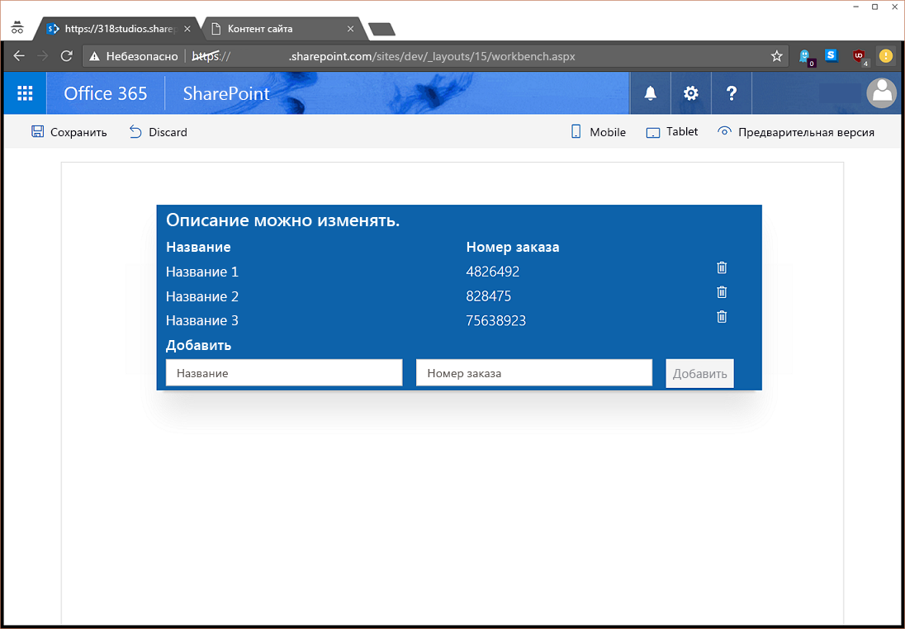

# <a name="use-sp-pnp-js-with-sharepoint-framework-web-parts"></a>Использование sp-pnp-js с веб-частями SharePoint Framework

Вы можете использовать библиотеку [sp-pnp-js](https://www.npmjs.com/package/sp-pnp-js) при сборке веб-частей SharePoint Framework (SPFx). Эта библиотека предоставляет текучий API, обеспечивающий интуитивно понятное составление запросов REST и поддержку пакетной обработки и кэширования. Подробнее см. на [домашней странице проекта](https://github.com/SharePoint/PnP-JS-Core), содержащей ссылки на документацию, примеры и другие ресурсы, которые помогут вам приступить к работе.

Вы можете скачать [полный исходный код](https://github.com/SharePoint/sp-dev-fx-webparts/tree/master/samples/knockout-sp-pnp-js) для этой статьи на сайте с примерами.

> [!NOTE] 
> Прежде чем выполнять действия, описанные в этой статье, [настройте среду разработки для создания клиентских веб-частей SharePoint](../../set-up-your-development-environment.md).

## <a name="create-a-new-project"></a>Создание проекта

1. Создайте папку проекта с помощью любой консоли:

  ```sh
  md spfx-sp-pnp-js-example
  ```

2. Перейдите в эту папку:

  ```sh
  cd spfx-sp-pnp-js-example
  ```

3. Запустите генератор Yeoman для SPFx:

  ```sh
  yo @microsoft/sharepoint
  ```

4. Введите следующие значения при настройке нового проекта:

  - **spfx-sp-pnp-js-example** в качестве имени решения (оставьте значение по умолчанию);
  - **SharePoint Online only (latest)** (Только SharePoint Online, последняя версия) в качестве версии базовых пакетов;
  - **Current Folder** (Текущая папка) в качестве расположения решения;
  - **Y** для разрешения администратору клиента развертывать решение на всех сайтах;
  - **WebPart** в качестве компонента, который необходимо создать;
  - **SPPnPJSExample** в качестве имени веб-части;
  - **Example of using sp-pnp-js within SPFx** (Пример использования sp-pnp-js в SPFx) в качестве описания;
  - **Knockout** в качестве платформы.

  

5. По завершении формирования шаблона заблокируйте версию зависимостей проекта, выполнив следующую команду:

  ```sh
  npm shrinkwrap
  ```

6. Откройте проект в выбранном редакторе кода. На приведенных здесь снимках экрана показан [Visual Studio Code](https://code.visualstudio.com/). Чтобы открыть каталог в Visual Studio Code, введите следующее в консоль:

  ```sh
  code .
  ```

  

## <a name="install-and-set-up-sp-pnp-js"></a>Установка и настройка sp-pnp-js

После создания проекта необходимо установить и настроить sp-pnp-js, начиная с установки пакета. Эти инструкции применимы к проектам любых типов (React и т. д.).

```sh
npm install sp-pnp-js --save
```

Библиотека sp-pnp-js составляет запросы REST, поэтому ей необходим URL-адрес для отправки этих запросов. Работая с классическими сайтами и страницами, мы можем воспользоваться глобальной переменной `_spPageContextInfo`. Но в случае SPFx применение этой переменной либо невозможно, либо может быть неправильным. Следовательно, нужно использовать объект [context](https://docs.microsoft.com/en-us/javascript/api/sp-webpart-base/webpartcontext), входящий в состав платформы. 

Убедиться в правильной настройке запросов можно [двумя способами](https://github.com/SharePoint/PnP-JS-Core/wiki/Using-sp-pnp-js-in-SharePoint-Framework#establish-context). В этом примере мы воспользуемся методом `onInit`.

### <a name="update-oninit-in-sppnpjsexamplewebpartts"></a>Обновление метода onInit в файле SpPnPjsExampleWebPart.ts

1. Откройте файл **src\webparts\spPnPjsExample\SpPnPjsExampleWebPart.ts** и добавьте оператор import для корневого объекта pnp:

  ```TypeScript
  import pnp from "sp-pnp-js";
  ```

2. Замените код метода `onInit` приведенным ниже. Добавьте блок после вызова метода `super.onInit()`. Это делается после вызова метода `super.onInit`, чтобы платформа могла инициализировать все необходимое, а библиотека настраивалась после выполнения этих действий.

  ```TypeScript
  /**
  * Initialize the web part.
  */
  protected onInit(): Promise<void> {
    this._id = _instance++;

    const tagName: string = `ComponentElement-${this._id}`;
    this._componentElement = this._createComponentElement(tagName);
    this._registerComponent(tagName);

    // When the web part description is changed, notify the view model to update.
    this._koDescription.subscribe((newValue: string) => {
      this._shouter.notifySubscribers(newValue, 'description');
    });

    const bindings: ISpPnPjsExampleBindingContext = {
      description: this.properties.description,
      shouter: this._shouter
    };

    ko.applyBindings(bindings, this._componentElement);

    return super.onInit().then(_ => {
      pnp.setup({
        spfxContext: this.context
      });
    });
  }
  ```

## <a name="update-the-viewmodel"></a>Обновление модели ViewModel

После этого замените содержимое файла **SpPnPjsExampleViewModel.ts** приведенным ниже кодом. Мы добавили оператор import для элементов pnp, интерфейс для определения полей элемента списка, некоторые наблюдаемые объекты для отслеживания списка элементов и новой формы элемента, а также методы для считывания, добавления и удаления элементов. 

Мы также добавили метод `ensureList`, использующий метод sp-pnp-js `lists.ensure`, чтобы проверять наличие списка (и при необходимости создавать его). Подготавливать ресурсы можно множеством способов, но мы выбрали этот метод, чтобы показать, как создать список, поле и элементы с помощью пакетной обработки в одном методе.

Из этого можно сделать вывод, что при использовании sp-pnp-js приходится писать намного меньше кода для обработки запросов, и вы можете сосредоточиться на бизнес-логике.

```TypeScript
import * as ko from 'knockout';
import styles from './SpPnPjsExample.module.scss';
import { ISpPnPjsExampleWebPartProps } from './SpPnPjsExampleWebPart';
import pnp, { List, ListEnsureResult, ItemAddResult, FieldAddResult } from "sp-pnp-js";

export interface ISpPnPjsExampleBindingContext extends ISpPnPjsExampleWebPartProps {
  shouter: KnockoutSubscribable<{}>;
}

/**
 * Interface which defines the fields in our list items
 */
export interface OrderListItem {
  Id: number;
  Title: string;
  OrderNumber: string;
}

const LIST_EXISTS: string = 'List exists';

export default class SpPnPjsExampleViewModel {
  public description: KnockoutObservable<string> = ko.observable('');
  public newItemTitle: KnockoutObservable<string> = ko.observable('');
  public newItemNumber: KnockoutObservable<string> = ko.observable('');
  public items: KnockoutObservableArray<OrderListItem> = ko.observableArray([]);

  public labelClass: string = styles.label;
  public spPnPjsExampleClass: string = styles.spPnPjsExample;
  public containerClass: string = styles.container;
  public rowClass: string = `ms-Grid-row ms-bgColor-themeDark ms-fontColor-white ${styles.row}`;
  public buttonClass: string = `ms-Button ${styles.button}`;

  constructor(bindings: ISpPnPjsExampleBindingContext) {
    this.description(bindings.description);

    // When the web part description is updated, change this view model's description.
    bindings.shouter.subscribe((value: string) => {
      this.description(value);
    }, this, 'description');

    // Load the items
    this.getItems().then((items: OrderListItem[]): void => {
      this.items(items);
    });
  }

  /**
   * Gets the items from the list
   */
  private getItems(): Promise<OrderListItem[]> {
    return this.ensureList().then((list: List): Promise<OrderListItem[]> => {
      // Here we are using the getAs operator so that our returned value will be typed
      return list.items.select("Id", "Title", "OrderNumber").getAs<OrderListItem[]>();
    });
  }

  /**
   * Adds an item to the list
   */
  public addItem(): void {
    if (this.newItemTitle() !== "" && this.newItemNumber() !== "") {
      this.ensureList().then((list: List): Promise<ItemAddResult> => {
        // Add the new item to the SharePoint list
        return list.items.add({
          Title: this.newItemTitle(),
          OrderNumber: this.newItemNumber(),
        });
      }).then((iar: ItemAddResult) => {
        // Add the new item to the display
        this.items.push({
          Id: iar.data.Id,
          OrderNumber: iar.data.OrderNumber,
          Title: iar.data.Title,
        });

        // Clear the form
        this.newItemTitle("");
        this.newItemNumber("");
      });
    }
  }

  /**
   * Deletes an item from the list
   */
  public deleteItem(data): void {
    if (!confirm("Are you sure you want to delete this item?")) {
      return;
    }

    this.ensureList().then((list: List): Promise<void> => {
      return list.items.getById(data.Id).delete();
    }).then(_ => {
      this.items.remove(data);
    }).catch((e: Error) => {
      alert(`There was an error deleting the item: ${e.message}`);
    });
  }

  /**
   * Ensures the list exists. If not, it creates it and adds some default example data
   */
  private ensureList(): Promise<List> {
    return new Promise<List>((resolve: (list: List) => void, reject: (err: string) => void): void => {
      let listEnsureResults: ListEnsureResult;
      // Use lists.ensure to always have the list available
      pnp.sp.web.lists.ensure("SPPnPJSExampleList")
        .then((ler: ListEnsureResult): Promise<FieldAddResult> => {
          listEnsureResults = ler;

          if (!ler.created) {
             // resolve main promise
            resolve(ler.list);
            // break promise chain
            return Promise.reject(LIST_EXISTS);
          }

          // We created the list on this call, so let's add a column
          return ler.list.fields.addText("OrderNumber");
        }).then((): Promise<string> => {
          console.warn('Adding items...');
          // And we will also add a few items so we can see some example data
          // Here we use batching
          return listEnsureResults.list.getListItemEntityTypeFullName();
        }).then((typeName: string): Promise<void> => {
          // Create a batch
          const batch = pnp.sp.web.createBatch();
          listEnsureResults.list.items.inBatch(batch).add({
            Title: "Title 1",
            OrderNumber: "4826492"
          }, typeName);

          listEnsureResults.list.items.inBatch(batch).add({
            Title: "Title 2",
            OrderNumber: "828475"
          }, typeName);

          listEnsureResults.list.items.inBatch(batch).add({
            Title: "Title 3",
            OrderNumber: "75638923"
          }, typeName);

          // Execute the batched operations
          return batch.execute();
        }).then((): void => {
          // All of the items have been added within the batch
          resolve(listEnsureResults.list);
        }).catch((e: any): void => {
          if (e !== LIST_EXISTS) {
            reject(e);
          }
        });
    });
  }
}
```

## <a name="update-the-template"></a>Обновление шаблона

Наконец, нам необходимо обновить шаблон в соответствии с функциями, добавленными в модель ViewModel. Скопируйте приведенный ниже код в файл **SpPnPjsExample.template.html**. Мы добавили строку заголовка, повторитель `foreach` для коллекции элементов и форму, позволяющую добавлять новые элементы в список.

```html
<div data-bind="attr: {class:spPnPjsExampleClass}">
  <div data-bind="attr: {class:containerClass}">

    <div data-bind="attr: {class:rowClass}">
      <div class="ms-Grid-col ms-u-sm12">
        <span class="ms-font-xl ms-fontColor-white ms-fontWeight-semibold" data-bind="text: description"></span>
      </div>
    </div>

    <div data-bind="attr: {class:rowClass}">
      <div class="ms-Grid-col ms-u-sm6">
        <span class="ms-font-l ms-fontColor-white ms-fontWeight-semibold">Title</span>
      </div>
      <div class="ms-Grid-col  ms-u-sm6">
        <span class="ms-font-l ms-fontColor-white ms-fontWeight-semibold">Order Number</span>
      </div>
    </div>

    <!-- ko foreach: items -->
    <div data-bind="attr: {class:$parent.rowClass}">
      <div class="ms-Grid-col ms-u-sm6">
        <span class="ms-font-l ms-fontColor-white" data-bind="text: Title"></span>
      </div>
      <div class="ms-Grid-col  ms-u-sm5">
        <span class="ms-font-l ms-fontColor-white" data-bind="text: OrderNumber"></span>
      </div>
      <div class="ms-Grid-col  ms-u-sm1">
        <i class="ms-Icon ms-Icon--Delete" aria-hidden="true" data-bind="click: $parent.deleteItem.bind($parent, $data)"></i>
      </div>
    </div>
    <!-- /ko -->

    <div data-bind="attr: {class:rowClass}">
      <div class="ms-Grid-col  ms-u-sm12">
        <span class="ms-font-l ms-fontColor-white ms-fontWeight-semibold">Add New</span>
      </div>
    </div>

    <div data-bind="attr: {class:rowClass}">
      <form data-bind="submit: addItem">
        <div class="ms-Grid-col ms-u-sm5">
          <input class="ms-TextField-field" placeholder="Title" data-bind='value: newItemTitle, valueUpdate: "afterkeydown"' />
        </div>
        <div class="ms-Grid-col ms-u-sm5">
          <input class="ms-TextField-field" placeholder="Order Number" data-bind='value: newItemNumber, valueUpdate: "afterkeydown"'
          />
        </div>
        <div class="ms-Grid-col ms-u-sm2">
          <button class="ms-Button--default ms-Button" type="submit" data-bind="enable: newItemTitle().length > 0 && newItemNumber().length > 0"><span class="ms-Button-label">Add</span></button>
        </div>
      </form>
    </div>

  </div>
</div>
```

## <a name="run-the-example"></a>Запуск примера

Запустите пример и добавьте веб-часть в размещаемое рабочее место SharePoint (/_layouts/workbench.aspx), чтобы просмотреть ее в действии.

```sh
gulp serve --nobrowser
```

<br/>

Вы можете удалять имеющиеся элементы, щелкая значок урны, и добавлять новые, указывая значения в обоих полях и нажимая кнопку **Добавить**.




### <a name="next-steps"></a>Дальнейшие действия

Библиотека sp-pnp-js содержит огромный выбор функций и расширений. В [руководстве разработчика](https://github.com/SharePoint/PnP-JS-Core/wiki/Developer-Guide) вы найдете примеры, инструкции и советы по использованию и настройке библиотеки. 

## <a name="deploy-to-production"></a>Развертывание в рабочей среде

Когда вы будете готовы развернуть решение и захотите выполнить сборку с использованием флага `--ship`, необходимо отметить sp-pnp-js как внешнюю библиотеку в конфигурации. Для этого необходимо обновить файл SPFx **config/config.js**, добавив следующую строку в раздел externals:

```json
"sp-pnp-js": "https://cdnjs.cloudflare.com/ajax/libs/sp-pnp-js/2.0.1/pnp.min.js"
```

В этой конфигурации используется общедоступная сеть CDN, но URL-адрес может быть внутренним путем или указывать на другое расположение. Обязательно обновите номер версии в URL-адресе в соответствии с целевой версией.

## <a name="improve-the-mock-data-example"></a>Улучшение примера: фиктивные данные

В идеале пример должен работать как в локальной среде программирования, так и в такой, которая размещена в SharePoint. Для этого необходимо создать фиктивную модель ViewModel и обновить код веб-части, как показано в разделах ниже.

### <a name="add-mock-viewmodel-file"></a>Добавление файла фиктивной модели ViewModel

Добавьте новый файл с именем **MockSpPnPjsExampleViewModel.ts** к остальным файлам веб-части. Обновите содержимое этого файла, используя приведенный ниже код. При этом у вас будет тот же набор функций, но с решением можно будет работать в локальной среде, не рассчитывая на доступность SharePoint.

```TypeScript
import * as ko from 'knockout';
import styles from './SpPnPjsExample.module.scss';
import { ISpPnPjsExampleWebPartProps } from './SpPnPjsExampleWebPart';
import pnp, { List, ListEnsureResult, ItemAddResult } from "sp-pnp-js";
import { ISpPnPjsExampleBindingContext, OrderListItem } from './SpPnPjsExampleViewModel';

export default class MockSpPnPjsExampleViewModel {

    public description: KnockoutObservable<string> = ko.observable('');
    public newItemTitle: KnockoutObservable<string> = ko.observable('');
    public newItemNumber: KnockoutObservable<string> = ko.observable('');
    public items: KnockoutObservableArray<OrderListItem> = ko.observableArray([]);

    public labelClass: string = styles.label;
    public spPnPjsExampleClass: string = styles.spPnPjsExample;
    public containerClass: string = styles.container;
    public rowClass: string = `ms-Grid-row ms-bgColor-themeDark ms-fontColor-white ${styles.row}`;
    public buttonClass: string = `ms-Button ${styles.button}`;

    constructor(bindings: ISpPnPjsExampleBindingContext) {
        this.description(bindings.description);

        // When the web part description is updated, change this view model's description.
        bindings.shouter.subscribe((value: string): void => {
            this.description(value);
        }, this, 'description');

        // Load the items
        this.getItems().then((items: OrderListItem[]): void => {
            this.items(items);
        });
    }

    /**
     * Simulates getting the items from the list
     */
    private getItems(): Promise<OrderListItem[]> {
        return Promise.resolve([{
            Id: 1,
            Title: "Mock Item 1",
            OrderNumber: "12345"
        },
        {
            Id: 2,
            Title: "Mock Item 2",
            OrderNumber: "12345"
        },
        {
            Id: 3,
            Title: "Mock Item 3",
            OrderNumber: "12345"
        }]);
    }

    /**
     * Simulates adding an item to the list
     */
    public addItem(): void {
        if (this.newItemTitle() !== "" && this.newItemNumber() !== "") {
            // Add the new item to the display
            this.items.push({
                Id: this.items.length,
                OrderNumber: this.newItemNumber(),
                Title: this.newItemTitle(),
            });

            // Clear the form
            this.newItemTitle("");
            this.newItemNumber("");
        }
    }

    /**
     * Simulates deleting an item from the list
     */
    public deleteItem(data): void {
        if (confirm("Are you sure you want to delete this item?")) {
            this.items.remove(data);
        }
    }
}
```

### <a name="update-web-part"></a>Обновление веб-части

Наконец, нам необходимо обновить веб-часть, чтобы она использовала фиктивные данные. 

1. Откройте файл **SpPnPjsExampleWebPart.ts** и импортируйте только что созданный фиктивный сайт ViewModel.

  ```TypeScript
  import MockSpPnPjsExampleViewModel from './MockSpPnPjsExampleViewModel';
  ```

2. Импортируйте типы `Environment` и `EnvironmentType`, которые используются для определения типа среды, в которой запущена веб-часть:

  ```TypeScript
  import { Environment, EnvironmentType } from '@microsoft/sp-core-library';
  ```

3. Найдите метод `_registerComponent` и измените его, как показано ниже.

  ```TypeScript
  private _registerComponent(tagName: string): void {
    ko.components.register(
      tagName,
      {
        viewModel: Environment.type === EnvironmentType.Local ?
          MockSpPnPjsExampleViewModel :
          SpPnPjsExampleViewModel,
        template: require('./SpPnPjsExample.template.html'),
        synchronous: false
      }
    );
  }
  ```

4. Введите в консоли команду `gulp serve`, чтобы открыть локальную среду программирования, которая теперь будет работать с фиктивными данными. (Если у вас уже запущен сервер, остановите его работу с помощью клавиш CTRL+C, а затем снова запустите.)

  ```sh
  gulp serve
  ```

  <br/>

  


## <a name="see-also"></a>См. также

- [Скачать полный пример](https://github.com/SharePoint/sp-dev-fx-webparts/tree/master/samples/knockout-sp-pnp-js)
- [Отзывы и отчеты о неполадках](https://github.com/SharePoint/PnP-JS-Core/issues)
- [Обзор SharePoint Framework](../../sharepoint-framework-overview.md)
