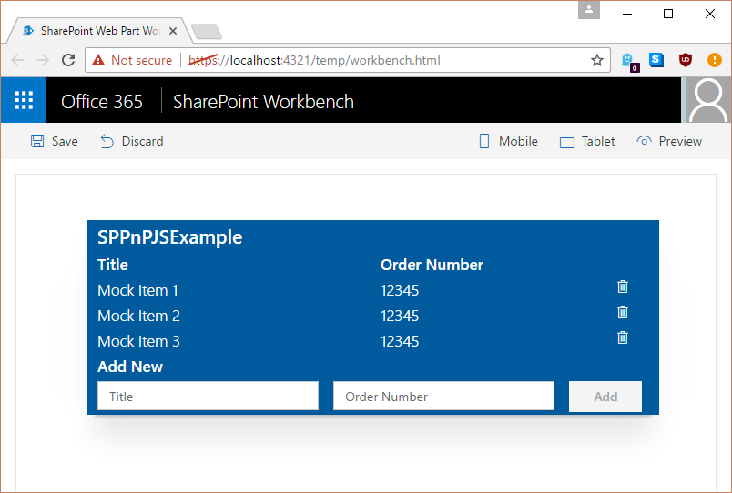

<span data-ttu-id="c063e-p114">Наконец, введите в консоли команду `gulp serve`, чтобы открыть локальную среду программирования, которая теперь будет работать с фиктивными данными. (Если у вас уже запущен сервер, остановите его работу с помощью клавиш CTRL+C, а затем снова запустите.)</span><span class="sxs-lookup"><span data-stu-id="c063e-p114">Finally type gulp serve in the console to bring up the local workbench, which now will work with the mock data. (If you already have the server running stop it using Ctrl+C and then restart it)</span></span>

```TypeScript
private _registerComponent(tagName: string): void {

  if (Environment.type === EnvironmentType.Local) {
    console.log("here I am.")
    ko.components.register(
      tagName,
      {
        viewModel: MockSpPnPjsExampleViewModel,
        template: require('./SpPnPjsExample.template.html'),
        synchronous: false
      }
    );
  } else {
    ko.components.register(
      tagName,
      {
        viewModel: SpPnPjsExampleViewModel,
        template: require('./SpPnPjsExample.template.html'),
        synchronous: false
      }
    );
  }
}
```
Наконец, введите в консоли команду `gulp serve`, чтобы открыть локальную среду программирования, которая теперь будет работать с фиктивными данными. (Если у вас уже запущен сервер, остановите его работу с помощью клавиш CTRL+C, а затем снова запустите.)

```sh
gulp serve
```




## <a name="download-full-example-code"></a><span data-ttu-id="c063e-173">Полный пример кода</span><span class="sxs-lookup"><span data-stu-id="c063e-173">Download Full Example Code</span></span>

<span data-ttu-id="c063e-174">Помните, что вы можете скачать полный пример кода [здесь](https://github.com/SharePoint/sp-dev-fx-webparts/tree/master/samples/knockout-sp-pnp-js).</span><span class="sxs-lookup"><span data-stu-id="c063e-174">Remember you can find the full sample [here](https://github.com/SharePoint/sp-dev-fx-webparts/tree/master/samples/knockout-sp-pnp-js).</span></span>

## <a name="provide-feedback--report-issues"></a><span data-ttu-id="c063e-175">Отзывы и отчеты о неполадках</span><span class="sxs-lookup"><span data-stu-id="c063e-175">Provide Feedback / Report Issues</span></span>

<span data-ttu-id="c063e-176">Если у вас есть отзывы или вы хотите сообщить о проблеме с библиотекой sp-pnp-js, воспользуйтесь [списком проблем](https://github.com/SharePoint/PnP-JS-Core/issues) в этом репозитории.</span><span class="sxs-lookup"><span data-stu-id="c063e-176">If you have any feedback or need to report as issue with sp-pnp-js please use the [issues list](https://github.com/SharePoint/PnP-JS-Core/issues) in that repo.</span></span>
