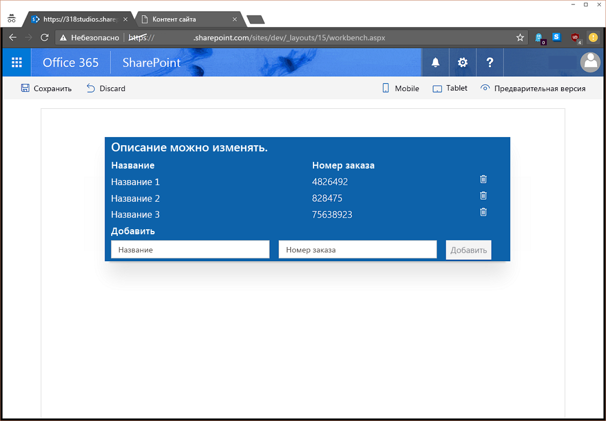

# <a name="use-sp-pnp-js-with-sharepoint-framework-web-parts"></a>Использование sp-pnp-js с веб-частями SharePoint Framework

Вы можете использовать библиотеку [sp-pnp-js](https://www.npmjs.com/package/sp-pnp-js) при создании веб-частей SharePoint Framework. Эта библиотека предоставляет текучий API, обеспечивающий интуитивно понятное составление запросов REST и поддержку пакетной обработки и кэширования. Дополнительные сведения см. на [домашней странице проекта](https://github.com/SharePoint/PnP-JS-Core), содержащей ссылки на документацию, примеры и другие ресурсы, которые помогут вам приступить к работе.

Вы можете скачать [полный исходный код](https://github.com/SharePoint/sp-dev-fx-webparts/tree/master/samples/knockout-sp-pnp-js) для этой статьи на сайте с примерами.

## <a name="setup-your-environment"></a>Настройка среды

Прежде чем выполнять действия, описанные в этом руководстве, необходимо убедиться, что вы [настроили среду](https://dev.office.com/sharepoint/docs/spfx/set-up-your-development-environment) для разработки с помощью SharePoint Framework.

## <a name="create-a-new-project"></a>Создание проекта

Для начала создайте папку проекта с помощью любой консоли:

```sh
md spfx-sp-pnp-js-example
```

Перейдите к этой папке.

```sh
cd spfx-sp-pnp-js-example
```

Запустите генератор Yeoman для SPFx:

```sh
yo @microsoft/sharepoint
```

Введите следующие значения при настройке нового проекта:

- **spfx-sp-pnp-js-example** в качестве имени решения (оставьте значение по умолчанию);
- **Current Folder** (Текущая папка) в качестве расположения решения;
- **Kockout** в качестве платформы;
- **SPPnPJSExample** в качестве имени веб-части;
- **Example of using sp-pnp-js within SPFx** (Пример использования sp-pnp-js в SPFx) в качестве описания.


Завершив формирование шаблона, откройте проект в любом редакторе кода на ваш выбор. На снимках экрана в этой статье показан редактор [Visual Studio Code](https://code.visualstudio.com/).

```sh
code .
```


## <a name="install-and-setup-sp-pnp-js"></a>Установка и настройка sp-pnp-js

После создания проекта необходимо установить и настроить sp-pnp-js, начиная с установки пакета. Этот раздел применим к любому типу проекта (React и т. д).

```sh
npm install sp-pnp-js --save
```

Библиотека sp-pnp-js составляет запросы REST, поэтому ей необходим URL-адрес для отправки этих запросов. Работая с классическими сайтами и страницами, мы можем воспользоваться глобальной переменной _spPageContextInfo. Она недоступна в SPFx. Даже если это не так, она может быть неправильной. Следовательно, нам придется использовать объект [context](https://dev.office.com/sharepoint/reference/spfx/sp-webpart-base/iwebpartcontext), входящий в состав платформы. Убедиться в правильной настройке запросов можно [двумя способами](https://github.com/SharePoint/PnP-JS-Core/wiki/Using-sp-pnp-js-in-SharePoint-Framework#establish-context). В этом примере мы воспользуемся методом onInit.

### <a name="update-oninit-in-sppnpjsexamplewebpartts"></a>Обновление метода onInit в файле SpPnPjsExampleWebPart.ts

Откройте файл src\webparts\spPnPjsExample\SpPnPjsExampleWebPart.ts и добавьте операцию импорта для корневого объекта pnp.

```TypeScript
import pnp from "sp-pnp-js";
```

Измените код метода onInit на следующий: Мы добавляем блок после вызова метода super.onInit(). Это делается для того, чтобы платформа могла инициализировать все необходимое, а библиотека настраивалась после завершения этих действий.

```TypeScript
/**
 * Initialize the web part.
 */
protected onInit(): Promise<void> {
  this._id = _instance++;

  const tagName: string = `ComponentElement-${this._id}`;
  this._componentElement = this._createComponentElement(tagName);
  this._registerComponent(tagName);

  // When web part description is changed, notify view model to update.
  this._koDescription.subscribe((newValue: string) => {
    this._shouter.notifySubscribers(newValue, 'description');
  });

  const bindings: ISpPnPjsExampleBindingContext = {
    description: this.properties.description,
    shouter: this._shouter
  };

  ko.applyBindings(bindings, this._componentElement);

  return super.onInit().then(_ => {
    pnp.setup({
      spfxContext: this.context
    });
  });
}
```

## <a name="update-the-viewmodel"></a>Обновление модели ViewModel

Затем необходимо заменить содержимое файла SpPnPjsExampleViewModel.ts следующим кодом: Мы добавляем операцию импорта элементов pnp, интерфейс для определения полей нашего элемента списка, некоторые наблюдаемые объекты для отслеживания списка элементов и новой формы элемента, а также методы для считывания, добавления и удаления элементов. Мы также добавили метод ensureList, использующий метод sp-pnp-js lists.ensure, чтобы проверять наличие списка. Подготавливать ресурсы можно множеством способов, но мы использовали именно этот, чтобы продемонстрировать создание списка, поля и элементов с помощью пакетной обработки в одном методе.

Из этого можно сделать вывод, что при использовании sp-pnp-js приходится писать намного меньше кода для обработки запросов, и вы можете сосредоточиться на бизнес-логике.

```TypeScript
import * as ko from 'knockout';
import styles from './SpPnPjsExample.module.scss';
import { ISpPnPjsExampleWebPartProps } from './ISpPnPjsExampleWebPartProps';
import pnp, { List, ListEnsureResult, ItemAddResult } from "sp-pnp-js";

export interface ISpPnPjsExampleBindingContext extends ISpPnPjsExampleWebPartProps {
  shouter: KnockoutSubscribable<{}>;
}

/**
 * Interface which defines the fields in our list items
 */
export interface OrderListItem {
  Id: number;
  Title: string;
  OrderNumber: string;
}

export default class SpPnPjsExampleViewModel {

  public description: KnockoutObservable<string> = ko.observable('');
  public newItemTitle: KnockoutObservable<string> = ko.observable('');
  public newItemNumber: KnockoutObservable<string> = ko.observable('');
  public items: KnockoutObservableArray<OrderListItem> = ko.observableArray([]);

  public labelClass: string = styles.label;
  public helloWorldClass: string = styles.helloWorld;
  public containerClass: string = styles.container;
  public rowClass: string = `ms-Grid-row ms-bgColor-themeDark ms-fontColor-white ${styles.row}`;
  public buttonClass: string = `ms-Button ${styles.button}`;

  constructor(bindings: ISpPnPjsExampleBindingContext) {
    this.description(bindings.description);

    // When web part description is updated, change this view model's description.
    bindings.shouter.subscribe((value: string) => {
      this.description(value);
    }, this, 'description');

    // call the load the items
    this.getItems().then(items => {

      this.items(items);
    });
  }

  /**
   * Gets the items from the list
   */
  private getItems(): Promise<OrderListItem[]> {

    return this.ensureList().then(list => {

      // here we are using the getAs operator so that our returned value will be typed
      return list.items.select("Id", "Title", "OrderNumber").getAs<OrderListItem[]>();
    });
  }

  /**
   * Adds an item to the list
   */
  public addItem(): void {

    if (this.newItemTitle() !== "" && this.newItemNumber() !== "") {

      this.ensureList().then(list => {

        // add the new item to the SharePoint list
        list.items.add({
          Title: this.newItemTitle(),
          OrderNumber: this.newItemNumber(),
        }).then((iar: ItemAddResult) => {

          // add the new item to the display
          this.items.push({
            Id: iar.data.Id,
            OrderNumber: iar.data.OrderNumber,
            Title: iar.data.Title,
          });

          // clear the form
          this.newItemTitle("");
          this.newItemNumber("");
        });
      });
    }
  }

  /**
   * Deletes an item from the list
   */
  public deleteItem(data): void {

    if (confirm("Are you sure you want to delete this item?")) {
      this.ensureList().then(list => {
        list.items.getById(data.Id).delete().then(_ => {
          this.items.remove(data);
        });
      }).catch((e: Error) => {
        alert(`There was an error deleting the item ${e.message}`);
      });
    }
  }

  /**
   * Ensures the list exists and if it creates it adds some default example data
   */
  private ensureList(): Promise<List> {

    return new Promise<List>((resolve, reject) => {

      // use lists.ensure to always have the list available
      pnp.sp.web.lists.ensure("SPPnPJSExampleList").then((ler: ListEnsureResult) => {

        if (ler.created) {

          // we created the list on this call so let's add a column
          ler.list.fields.addText("OrderNumber").then(_ => {

            // and we will also add a few items so we can see some example data
            // here we use batching

            // create a batch
            let batch = pnp.sp.web.createBatch();

            ler.list.getListItemEntityTypeFullName().then(typeName => {

              ler.list.items.inBatch(batch).add({
                Title: "Title 1",
                OrderNumber: "4826492"
              }, typeName);

              ler.list.items.inBatch(batch).add({
                Title: "Title 2",
                OrderNumber: "828475"
              }, typeName);

              ler.list.items.inBatch(batch).add({
                Title: "Title 3",
                OrderNumber: "75638923"
              }, typeName);

              // excute the batched operations
              batch.execute().then(_ => {
                // all of the items have been added within the batch

                resolve(ler.list);

              }).catch(e => reject(e));

            }).catch(e => reject(e));

          }).catch(e => reject(e));

        } else {

          resolve(ler.list);
        }

      }).catch(e => reject(e));
    });
  }
}
```
## <a name="update-the-template"></a>Обновление шаблона

Наконец, нам необходимо обновить шаблон в соответствии с функциями, добавленными в модель ViewModel. Скопируйте приведенный ниже код в файл SpPnPjsExample.template.html. Мы добавили строку заголовка, цикл foreach для коллекции элементов и форму, позволяющую добавлять новые элементы в список.

```html
<div data-bind="attr: {class:helloWorldClass}">
  <div data-bind="attr: {class:containerClass}">

    <div data-bind="attr: {class:rowClass}">
      <div class="ms-Grid-col ms-u-sm12">
        <span class="ms-font-xl ms-fontColor-white ms-fontWeight-semibold" data-bind="text: description"></span>
      </div>
    </div>

    <div data-bind="attr: {class:rowClass}">
      <div class="ms-Grid-col ms-u-sm6">
        <span class="ms-font-l ms-fontColor-white ms-fontWeight-semibold">Title</span>
      </div>
      <div class="ms-Grid-col  ms-u-sm6">
        <span class="ms-font-l ms-fontColor-white ms-fontWeight-semibold">Order Number</span>
      </div>
    </div>

    <!-- ko foreach: items -->
    <div data-bind="attr: {class:$parent.rowClass}">
      <div class="ms-Grid-col ms-u-sm6">
        <span class="ms-font-l ms-fontColor-white" data-bind="text: Title"></span>
      </div>
      <div class="ms-Grid-col  ms-u-sm5">
        <span class="ms-font-l ms-fontColor-white" data-bind="text: OrderNumber"></span>
      </div>
      <div class="ms-Grid-col  ms-u-sm1">
        <i class="ms-Icon ms-Icon--Delete" aria-hidden="true" data-bind="click: $parent.deleteItem.bind($parent, $data)"></i>
      </div>
    </div>
    <!-- /ko -->

    <div data-bind="attr: {class:rowClass}">
      <div class="ms-Grid-col  ms-u-sm12">
        <span class="ms-font-l ms-fontColor-white ms-fontWeight-semibold">Add New</span>
      </div>
    </div>

    <div data-bind="attr: {class:rowClass}">
      <form data-bind="submit: addItem">
        <div class="ms-Grid-col ms-u-sm5">
          <input class="ms-TextField-field" placeholder="Title" data-bind='value: newItemTitle, valueUpdate: "afterkeydown"' />
        </div>
        <div class="ms-Grid-col ms-u-sm5">
          <input class="ms-TextField-field" placeholder="Order Number" data-bind='value: newItemNumber, valueUpdate: "afterkeydown"'
          />
        </div>
        <div class="ms-Grid-col ms-u-sm2">
          <button class="ms-Button--default ms-Button" type="submit" data-bind="enable: newItemTitle().length > 0 && newItemNumber().length > 0"><span class="ms-Button-label">Add</span></button>
        </div>
      </form>
    </div>

  </div>
</div>
```
## <a name="run-the-example"></a>Запуск примера

Теперь вы можете увидеть пример в действии, запустив его и добавив веб-часть на страницу /_layouts/workbench.aspx.

```sh
gulp serve
```



Вы можете удалять имеющиеся элементы, нажимая значок урны, и добавлять их, указывая значения в обоих полях и нажимая кнопку добавления.

## <a name="next-steps"></a>Дальнейшие действия

Библиотека sp-pnp-js содержит огромный выбор функций и расширений. В [руководстве разработчика](https://github.com/SharePoint/PnP-JS-Core/wiki/Developer-Guide) вы найдете примеры, инструкции и советы по использованию и настройке библиотеки.

## <a name="production-deployment"></a>Развертывание в рабочей среде

Когда вы будете готовы развернуть решение и захотите выполнить сборку с использованием флага --ship, необходимо отметить sp-pnp-js как внешнюю библиотеку в конфигурации. Для этого необходимо обновить файл SPFx config/config.js, добавив следующую строку в раздел externals:

```
"sp-pnp-js": "https://cdnjs.cloudflare.com/ajax/libs/sp-pnp-js/2.0.1/pnp.min.js"
```

Здесь мы используем общедоступную сеть CDN, но вы можете использовать как внутренний URL-адрес, так и любое другое расположение. Не забудьте обновить номер версии в URL-адресе в соответствии с нужной вам версией.

## <a name="improving-the-example---mock-data"></a>Улучшение примера: фиктивные данные

В идеале пример должен работать как на локальном рабочем месте, так и в размещенной среде SharePoint. Для этого необходимо создать фиктивную модель ViewModel и обновить код веб-части, как показано ниже.

### <a name="mock-viewmodel"></a>Фиктивная модель ViewModel

Добавьте новый файл с именем MockSpPnPjsExampleViewModel.ts к остальным файлам веб-части, а затем обновите содержимое, как показано ниже. При этом предоставляется тот же набор функций, но решение сможет работать в локальной среде, не рассчитывая на доступность SharePoint.

```TypeScript
import * as ko from 'knockout';
import styles from './SpPnPjsExample.module.scss';
import { ISpPnPjsExampleWebPartProps } from './ISpPnPjsExampleWebPartProps';
import pnp, { List, ListEnsureResult, ItemAddResult } from "sp-pnp-js";
import { ISpPnPjsExampleBindingContext, OrderListItem } from './SpPnPjsExampleViewModel';

export default class MockSpPnPjsExampleViewModel {

    public description: KnockoutObservable<string> = ko.observable('');
    public newItemTitle: KnockoutObservable<string> = ko.observable('');
    public newItemNumber: KnockoutObservable<string> = ko.observable('');
    public items: KnockoutObservableArray<OrderListItem> = ko.observableArray([]);

    public labelClass: string = styles.label;
    public helloWorldClass: string = styles.helloWorld;
    public containerClass: string = styles.container;
    public rowClass: string = `ms-Grid-row ms-bgColor-themeDark ms-fontColor-white ${styles.row}`;
    public buttonClass: string = `ms-Button ${styles.button}`;

    constructor(bindings: ISpPnPjsExampleBindingContext) {
        this.description(bindings.description);

        // When web part description is updated, change this view model's description.
        bindings.shouter.subscribe((value: string) => {
            this.description(value);
        }, this, 'description');

        // call the load the items
        this.getItems().then(items => {

            this.items(items);
        });
    }

    /**
     * Gets the items from the list
     */
    private getItems(): Promise<OrderListItem[]> {
        return Promise.resolve([{
            Id: 1,
            Title: "Mock Item 1",
            OrderNumber: "12345"
        },
        {
            Id: 2,
            Title: "Mock Item 2",
            OrderNumber: "12345"
        },
        {
            Id: 3,
            Title: "Mock Item 3",
            OrderNumber: "12345"
        }]);
    }

    /**
     * Adds an item to the list
     */
    public addItem(): void {

        if (this.newItemTitle() !== "" && this.newItemNumber() !== "") {

            // add the new item to the display
            this.items.push({
                Id: this.items.length,
                OrderNumber: this.newItemNumber(),
                Title: this.newItemTitle(),
            });

            // clear the form
            this.newItemTitle("");
            this.newItemNumber("");
        }
    }

    /**
     * Deletes an item from the list
     */
    public deleteItem(data): void {

        if (confirm("Are you sure you want to delete this item?")) {
            this.items.remove(data);
        }
    }
}
```
### <a name="update-webpart"></a>Обновление веб-части

Наконец, нам необходимо обновить веб-часть, чтобы она использовала фиктивные данные по мере необходимости. Для начала откройте файл SpPnPjsExampleWebPart.ts. Импортируйте только что созданный фиктивный сайт ViewModel.

```TypeScript
import MockSpPnPjsExampleViewModel from './MockSpPnPjsExampleViewModel';
```
Затем найдите метод _registerComponent и измените его, как показано ниже.

```TypeScript
private _registerComponent(tagName: string): void {

  if (Environment.type === EnvironmentType.Local) {
    console.log("here I am.")
    ko.components.register(
      tagName,
      {
        viewModel: MockSpPnPjsExampleViewModel,
        template: require('./SpPnPjsExample.template.html'),
        synchronous: false
      }
    );
  } else {
    ko.components.register(
      tagName,
      {
        viewModel: SpPnPjsExampleViewModel,
        template: require('./SpPnPjsExample.template.html'),
        synchronous: false
      }
    );
  }
}
```
Наконец, введите в консоли команду gulp serve, чтобы открыть локальное рабочее место, которое теперь будет работать с фиктивными данными. (Если у вас уже запущен сервер, остановите его с помощью клавиш CTRL+C, а затем снова запустите.)

```sh
gulp serve
```


## <a name="download-full-example-code"></a>Полный пример кода

Помните, что вы можете скачать полный пример кода [здесь](https://github.com/SharePoint/sp-dev-fx-webparts/tree/master/samples/knockout-sp-pnp-js).

## <a name="provide-feedback--report-issues"></a>Отзывы и отчеты о неполадках

Если у вас есть отзывы или вы хотите сообщить о проблеме с библиотекой sp-pnp-js, используйте [список проблем](https://github.com/SharePoint/PnP-JS-Core/issues) в этом репозитории.
