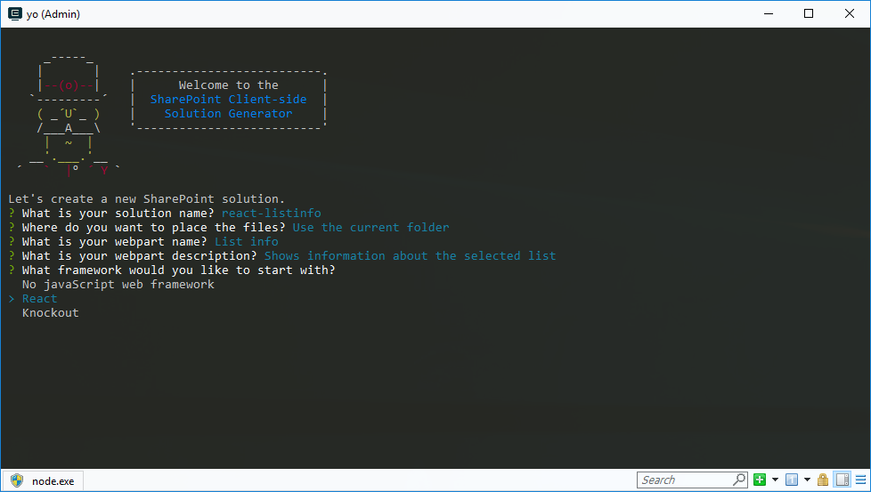
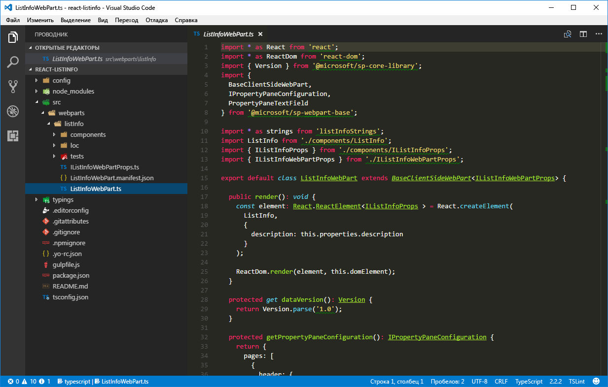
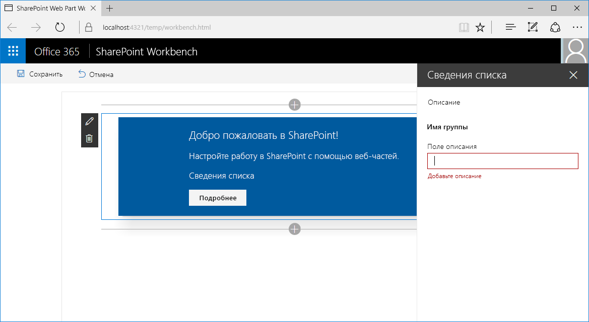
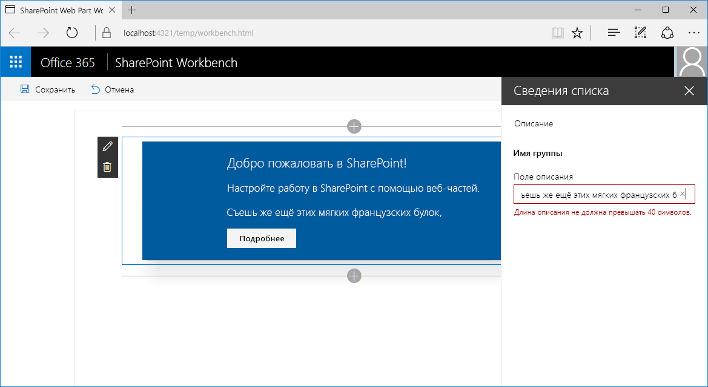
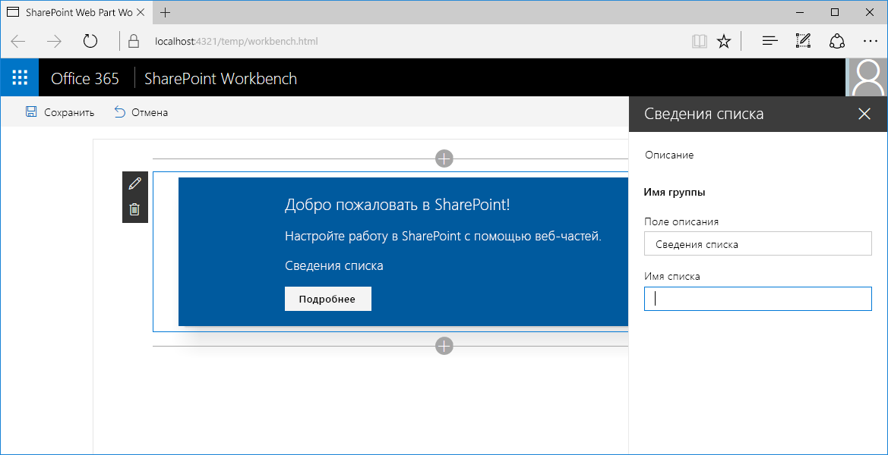

# <a name="validate-web-part-property-values"></a>Проверка значений свойств веб-части

> Примечание. Эта статья еще не была проверена на версии SPFx GA, поэтому у вас могут возникнуть трудности, например при использовании последней версии.

Пользователи могут настраивать веб-части в соответствии со своими потребностями с помощью свойств. Проверяйте указанные значения конфигурации, чтобы пользователям было проще настроить веб-часть и удобнее с ней работать. Из этой статьи вы узнаете, как проверять значения свойств клиентских веб-частей в SharePoint Framework.

> **Примечание.** Прежде чем выполнять действия, описанные в этой статье, [настройте среду разработки](../../set-up-your-development-environment) для создания решений на платформе SharePoint Framework.

## <a name="create-new-project"></a>Создание проекта

Для начала создайте папку проекта.

```sh
md react-listinfo
```

Перейдите в папку проекта.

```sh
cd react-listinfo
```

В папке проекта запустите генератор Yeoman для SharePoint Framework, чтобы сформировать шаблон проекта на платформе SharePoint Framework.

```sh
yo @microsoft/sharepoint
```

Введите следующие значения:

- имя решения — **react-listinfo**
- расположение файлов — **Use the current folder** (Использовать текущую папку)
- имя веб-части — **List info** (Сведения списка)
- описание веб-части — **Shows information about the selected list** (Показывает сведения о выбранном списке)
- отправная точка создания веб-части — **React**



Когда шаблон будет сформирован, откройте папку проекта в редакторе кода. В этой статье инструкции и снимки экрана основаны на Visual Studio Code, но вы можете использовать любой редактор.



## <a name="validate-web-part-property-values-in-the-sharepoint-framework"></a>Проверка значений свойств веб-части в SharePoint Framework

В SharePoint Framework разработчики могут проверять значения свойств веб-части двумя способами. Значение можно проверить непосредственно в коде веб-части или с помощью внешнего API. Первый способ удобен, если вам нужно проверить простые значения, например минимальную/максимальную длину, обязательные свойства или распознавание простых шаблонов, например почтового индекса. Если проверка основана на бизнес-логике, например проверка номера социального страхования или членства в группе безопасности, лучше вызывать внешние API.

Чтобы проверить значение свойства веб-части, нужно реализовать обработчик для события **onGetErrorMessage** этого свойства. При проверке в коде обработчик событий возвращает строку с ошибкой проверки или пустую строку, если указанное значение допустимо. При проверке с помощью удаленных API обработчик событий возвращает обещание строки. Если указанное значение недопустимо, обещание превращается в сообщение об ошибке. Если указанное значение допустимо, обещание превращается в пустую строку.

### <a name="validate-web-part-property-values-inline"></a>Проверка значений свойств веб-части в коде

На этом этапе вы убедитесь, что свойство веб-части Description указано и содержит не более 40 символов. Эта проверка выполняется непосредственно в коде.

В редакторе кода откройте файл **./src/webparts/listInfo/ListInfoWebPart.ts**. Добавьте метод **validateDescription** в класс **ListInfo** с помощью следующего кода:

```ts
export default class ListInfoWebPart extends BaseClientSideWebPart<IListInfoWebPartProps> {
  // ...

  private validateDescription(value: string): string {
    if (value === null ||
      value.trim().length === 0) {
      return 'Provide a description';
    }

    if (value.length > 40) {
      return 'Description should not be longer than 40 characters';
    }

    return '';
  }
}
```

Метод **validateDescription** проверяет, указано ли описание и не содержит ли оно более 40 символов. Если указанное описание недопустимо, метод возвращает сообщение об ошибке проверки. Если указанное значение допустимо, возвращается пустая строка.

После этого необходимо правильно связать метод **validateDescription** со свойством **Description** веб-части. В классе **ListInfoWebPart** измените реализацию метода **getPropertyPaneConfiguration** на такую:

```ts
export default class ListInfoWebPart extends BaseClientSideWebPart<IListInfoWebPartProps> {
  // ...

  protected getPropertyPaneConfiguration(): IPropertyPaneConfiguration {
    return {
      pages: [
        {
          header: {
            description: strings.PropertyPaneDescription
          },
          groups: [
            {
              groupName: strings.BasicGroupName,
              groupFields: [
                PropertyPaneTextField('description', {
                  label: strings.DescriptionFieldLabel,
                  onGetErrorMessage: this.validateDescription.bind(this)
                })
              ]
            }
          ]
        }
      ]
    };
  }

  // ...
}
```

Вы расширили определение свойства **Description** веб-части, определив метод **validateDescription** как обработчик события **onGetErrorMessage**.

Чтобы просмотреть результат проверки, выполните следующую команду:

```sh
gulp serve
```

В рабочей области добавьте веб-часть на холст и откройте ее свойства. Если вы удалите описание, то увидите первую ошибку проверки.



Затем введите значение, которое содержит более 40 символов. Под текстовым полем появится еще одна ошибка проверки.



Обратите внимание: если указано недопустимое значение, в веб-части отображается последнее допустимое значение. Кроме того, если в режиме нереактивной области свойств указано недопустимое свойство веб-части, кнопка **Применить** отключается, чтобы пользователь не мог применить недействительную конфигурацию.


### <a name="validate-web-part-property-values-using-remote-apis"></a>Проверка значений свойств веб-части с помощью удаленных API

В некоторых случаях проверка значений свойств веб-части может быть сложнее и требовать определенной бизнес-логики. В таких случаях будет эффективнее проверить значение с помощью существующих API, а не реализовывать и поддерживать бизнес-логику в веб-части.

На этом этапе вы реализуете логику, которая проверяет, существует ли на текущем сайте SharePoint список с именем, указанным в свойствах веб-части.

#### <a name="add-the-listname-web-part-property"></a>Добавление свойства веб-части listName

В редакторе кода откройте файл **./src/webparts/listInfo/ListInfoWebPart.manifest.json**. В свойстве **properties** добавьте свойство **listName**. В качестве значения по умолчанию укажите пустую строку:

```json
{
  "$schema": "../../../node_modules/@microsoft/sp-module-interfaces/lib/manifestSchemas/jsonSchemas/clientSideComponentManifestSchema.json",

  "id": "1ec8f92d-ea55-4584-bf50-bac435c916bf",
  "alias": "ListInfoWebPart",
  "componentType": "WebPart",
  "version": "0.0.1",
  "manifestVersion": 2,

  "preconfiguredEntries": [{
    "groupId": "1ec8f92d-ea55-4584-bf50-bac435c916bf",
    "group": { "default": "Under Development" },
    "title": { "default": "List info" },
    "description": { "default": "Shows information about the selected list" },
    "officeFabricIconFontName": "Page",
    "properties": {
      "description": "List info",
      "listName": ""
    }
  }]
}
```

После этого в редакторе кода откройте файл **./src/webparts/listInfo/IListInfoWebPartProps.ts** и расширьте определение интерфейса, добавив свойство **listName** типа string.

```ts
export interface IListInfoWebPartProps {
  description: string;
  listName: string;
}
```

Чтобы завершить добавление нового свойства веб-части, откройте файл **./src/webparts/listInfo/ListInfoWebPart.ts** в редакторе кода и измените реализацию метода **getPropertyPaneConfiguration** на такую:

```ts
export default class ListInfoWebPart extends BaseClientSideWebPart<IListInfoWebPartProps> {
  // ...

  protected getPropertyPaneConfiguration(): IPropertyPaneConfiguration {
    return {
      pages: [
        {
          header: {
            description: strings.PropertyPaneDescription
          },
          groups: [
            {
              groupName: strings.BasicGroupName,
              groupFields: [
                PropertyPaneTextField('description', {
                  label: strings.DescriptionFieldLabel,
                  onGetErrorMessage: this.validateDescription.bind(this)
                }),
                PropertyPaneTextField('listName', {
                  label: strings.ListNameFieldLabel
                })
              ]
            }
          ]
        }
      ]
    };
  }

  // ...
}
```

Добавьте недостающую строку ресурса **ListNameFieldLabel**. Для этого измените код файла **./src/webparts/listInfo/loc/mystrings.d.ts** на такой:

```ts
declare interface IListInfoStrings {
  PropertyPaneDescription: string;
  BasicGroupName: string;
  DescriptionFieldLabel: string;
  ListNameFieldLabel: string;
}

declare module 'listInfoStrings' {
  const strings: IListInfoStrings;
  export = strings;
}
```

а код **./src/webparts/listInfo/loc/ru-ru.js** — на такой:

```js
define([], function() {
  return {
    "PropertyPaneDescription": "Description",
    "BasicGroupName": "Group Name",
    "DescriptionFieldLabel": "Description Field",
    "ListNameFieldLabel": "List name"
  }
});
```

Выполните следующую команду, чтобы проверить, что проект запущен, а добавленное свойство имени списка отображается в области свойств веб-части:

```sh
gulp serve
```



#### <a name="validate-the-name-of-the-list-using-the-sharepoint-rest-api"></a>Проверка имени списка с помощью REST API SharePoint

На этом этапе вы проверите указанное имя списка и узнаете, соответствует ли оно существующему списку на текущем сайте SharePoint.

В редакторе кода откройте файл **./src/webparts/listInfo/ListInfoWebPart.ts** и добавьте следующие ссылки:

```ts
import { SPHttpClient, SPHttpClientResponse } from '@microsoft/sp-http';
import { escape } from '@microsoft/sp-lodash-subset';
```

Добавьте метод **validateListName** в класс **ListInfoWebPart** с помощью следующего кода:

```ts
export default class ListInfoWebPart extends BaseClientSideWebPart<IListInfoWebPartProps> {
  // ...

  private validateListName(value: string): Promise<string> {
    return new Promise<string>((resolve: (validationErrorMessage: string) => void, reject: (error: any) => void): void => {
      if (value === null ||
        value.length === 0) {
        resolve('Provide the list name');
        return;
      }

      this.context.spHttpClient.get(this.context.pageContext.web.absoluteUrl + `/_api/web/lists/getByTitle('${escape(value)}')?$select=Id`, SPHttpClient.configurations.v1)
        .then((response: SPHttpClientResponse): void => {
          if (response.ok) {
            resolve('');
            return;
          }
          else if (response.status === 404) {
            resolve(`List '${escape(value)}' doesn't exist in the current site`);
            return;
          }
          else {
            resolve(`Error: ${response.statusText}. Please try again`);
            return;
          }
        })
        .catch((error: any): void => {
          resolve(error);
        });
    });
  }
}
```

Сначала метод **validateListName** проверит, было ли указано имя списка. Если нет, обещание превращается в соответствующую ошибку проверки. Если пользователь указал имя списка, метод **validateListName** использует класс **SPHttpClient** для вызова REST API SharePoint и проверит, существует ли список с указанным именем.

Если на текущем сайте существует список с указанным именем, будет возвращен код состояния 200 OK, а метод **validateListName** вернет обещание с пустой строкой, подтверждая, что соответствующий заданному значению список существует. Если список с указанным именем не существует, будет возвращен другой код. Скорее всего, это будет ответ "404 — не найдено", но если запрос не будет выполнен по другой причине, то может быть возвращен другой код состояния. В обоих случаях метод **validateListName** покажет пользователю соответствующее сообщение об ошибке.

После определения метода проверки имени списка необходимо настроить его как обработчик проверки для свойства веб-части **listName**. В классе **ListInfoWebPart** замените код метода **getPropertyPaneConfiguration** на такой:

```ts
export default class ListInfoWebPart extends BaseClientSideWebPart<IListInfoWebPartProps> {
  // ...

  protected getPropertyPaneConfiguration(): IPropertyPaneConfiguration {
    return {
      pages: [
        {
          header: {
            description: strings.PropertyPaneDescription
          },
          groups: [
            {
              groupName: strings.BasicGroupName,
              groupFields: [
                PropertyPaneTextField('description', {
                  label: strings.DescriptionFieldLabel,
                  onGetErrorMessage: this.validateDescription.bind(this)
                }),
                PropertyPaneTextField('listName', {
                  label: strings.ListNameFieldLabel,
                  onGetErrorMessage: this.validateListName.bind(this)
                })
              ]
            }
          ]
        }
      ]
    };
  }

  // ...
}
```

Чтобы просмотреть результат проверки, выполните следующую команду:

```sh
gulp serve --nobrowser
```

Так как метод проверки имени списка взаимодействует с REST API SharePoint, необходимо проверить веб-часть в размещенной версии рабочей области SharePoint.

Добавьте веб-часть на холст и откройте ее свойства. Так как вы не указали значение имени списка по умолчанию (обязательное свойство), отобразится ошибка проверки.


Если указать имя списка, который не существует, веб-часть покажет сообщение о том, что такой список не существует на текущем сайте.


Если вы укажете имя существующего списка, ошибка проверки исчезнет.


#### <a name="optimize-validation-using-remote-apis"></a>Оптимизация проверки с помощью удаленных API

При проверке свойств веб-части с помощью удаленных API SharePoint Framework отслеживает изменения элементов управления области свойств и отправляет обновленные значения для проверки в указанный обработчик проверки. По умолчанию время ожидания перед запуском проверки составляет 200 мс. Если пользователь не изменяет определенное значение в течение 200 мс, SharePoint Framework начинает проверку. Если обработчик проверки использует удаленный API, то при каждом запуске проверки этот метод будет отправлять веб-запрос к API на проверку указанного значения. Если пользователь недостаточно быстро печатает, то на проверку будут отправляться частично введенные значения, создавая лишнюю нагрузку на сеть и API. В таких случаях рекомендуем увеличить задержку перед проверкой.


Задержку перед проверкой можно настроить отдельно для каждого свойства, в зависимости от типа значения, вводимого пользователем. Ниже показано, как увеличить задержку перед проверкой свойства **listName**.

В редакторе кода откройте файл **./src/webparts/listInfo/ListInfoWebPart.ts**. Измените код метода **getPropertyPaneConfiguration** на такой:

```ts
export default class ListInfoWebPart extends BaseClientSideWebPart<IListInfoWebPartProps> {
  // ...

  protected getPropertyPaneConfiguration(): IPropertyPaneConfiguration {
    return {
      pages: [
        {
          header: {
            description: strings.PropertyPaneDescription
          },
          groups: [
            {
              groupName: strings.BasicGroupName,
              groupFields: [
                PropertyPaneTextField('description', {
                  label: strings.DescriptionFieldLabel,
                  onGetErrorMessage: this.validateDescription.bind(this)
                }),
                PropertyPaneTextField('listName', {
                  label: strings.ListNameFieldLabel,
                  onGetErrorMessage: this.validateListName.bind(this),
                  deferredValidationTime: 500
                })
              ]
            }
          ]
        }
      ]
    };
  }

  // ...
}

```

Свойство **deferredValidationTime** устанавливает длительность задержки перед запуском проверки SharePoint Framework (в миллисекундах).

Выполните следующую команду, чтобы проверить установленную задержку:

```sh
gulp serve --nobrowser
```