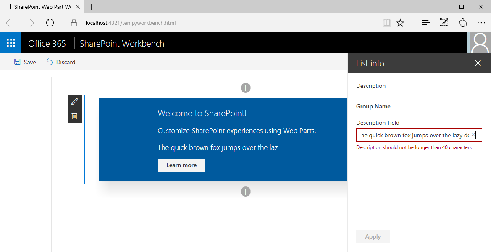

# <a name="validate-web-part-property-values"></a>Проверка значений свойств веб-части

Пользователи могут настраивать клиентские веб-части SharePoint Framework в соответствии со своими потребностями с помощью свойств. Проверяйте указанные значения конфигурации, чтобы пользователям было проще настроить веб-часть и удобнее с ней работать. 

> [!NOTE] 
> Прежде чем выполнять действия, описанные в этой статье, [настройте среду разработки](../../set-up-your-development-environment.md) для создания решений на платформе SharePoint Framework.

## <a name="create-a-new-web-part-project"></a>Создание проекта веб-части

1. Для начала создайте папку проекта.

  ```sh
  md react-listinfo
  ```

2. Перейдите в папку проекта.

  ```sh
  cd react-listinfo
  ```

3. В папке проекта запустите генератор Yeoman для SharePoint Framework, чтобы сформировать шаблон проекта на платформе SharePoint Framework.

  ```sh
  yo @microsoft/sharepoint
  ```

4. Когда отобразится соответствующий запрос, введите следующие значения:

  - имя решения — **react-listinfo**;
  - расположение файлов — **Use the current folder** (Использовать текущую папку);
  - отправную точку создания веб-части — **React**;
  - имя веб-части — **List info** (Сведения списка);
  - описание веб-части — **Shows information about the selected list** (Показывает сведения о выбранном списке).

  

5. По завершении формирования шаблона заблокируйте версию зависимостей проекта, выполнив следующую команду:

  ```sh
  npm shrinkwrap
  ```

6. Откройте папку проекта в редакторе кода. В инструкциях и на снимках экрана из этой статьи используется Visual Studio Code, но вы можете использовать любой другой редактор.

  

<br/>

## <a name="options-for-validating-web-part-properties"></a>Способы проверки свойств веб-части

Разработчики могут проверять значения свойств веб-части двумя способами. Значение можно проверить непосредственно в коде веб-части или с помощью внешнего API. 

Первый способ удобен, если требуется проверить простые значения (например, минимальную или максимальную длину либо обязательные свойства) или распознавать простые шаблоны, например почтовые индексы. Для проверок, основанных на бизнес-логике, например проверки номера социального страхования или членства в группе безопасности, лучше вызывать внешние API.

Чтобы проверить значение свойства веб-части, необходимо реализовать обработчик события **onGetErrorMessage** для этого свойства. При проверке в коде обработчик событий возвращает строку с ошибкой проверки или пустую строку, если указанное значение допустимо. 

При проверке с помощью удаленных API обработчик событий возвращает обещание строки. Если указанное значение недопустимо, обещание превращается в сообщение об ошибке. Если указанное значение допустимо, обещание разрешается в пустую строку.

## <a name="validate-web-part-property-values-inline"></a>Проверка значений свойств веб-части в коде

На этом шаге мы проверим, указано ли свойство веб-части Description и не содержит ли оно более 40 символов. Эта проверка выполняется непосредственно в коде.

1. В редакторе кода откройте файл **./src/webparts/listInfo/ListInfoWebPart.ts**. В классе **ListInfoWebPart** добавьте метод **validateDescription** со следующим кодом:

  ```ts
  export default class ListInfoWebPart extends BaseClientSideWebPart<IListInfoWebPartProps> {
    // ...

    private validateDescription(value: string): string {
      if (value === null ||
        value.trim().length === 0) {
        return 'Provide a description';
      }

      if (value.length > 40) {
        return 'Description should not be longer than 40 characters';
      }

      return '';
    }
  }
  ```

  Метод **validateDescription** проверяет, указано ли описание и не содержит ли оно более 40 символов. Если указанное описание недопустимо, метод возвращает сообщение об ошибке проверки. Если же указанное значение допустимо, возвращается пустая строка.

2. Свяжите метод **validateDescription** со свойством **Description** веб-части. В классе **ListInfoWebPart** замените код метода **getPropertyPaneConfiguration** следующим кодом:

  ```ts
  export default class ListInfoWebPart extends BaseClientSideWebPart<IListInfoWebPartProps> {
    // ...

    protected getPropertyPaneConfiguration(): IPropertyPaneConfiguration {
      return {
        pages: [
          {
            header: {
              description: strings.PropertyPaneDescription
            },
            groups: [
              {
                groupName: strings.BasicGroupName,
                groupFields: [
                  PropertyPaneTextField('description', {
                    label: strings.DescriptionFieldLabel,
                    onGetErrorMessage: this.validateDescription.bind(this)
                  })
                ]
              }
            ]
          }
        ]
      };
    }

    // ...
  }
  ```

  Мы расширили определение свойства **Description** веб-части, определив метод **validateDescription** как обработчик события **onGetErrorMessage**.

3. Чтобы просмотреть результат проверки, выполните следующую команду:

  ```sh
  gulp serve
  ```

4. В рабочей области добавьте веб-часть на холст и откройте ее свойства. Если удалить описание, вы увидите первую ошибку проверки.

  

5. Укажите значение длиной более 40 символов. Под текстовым полем появится еще одна ошибка проверки.

  

6. Обратите внимание, что если указанное значение недопустимо, в веб-части отображается последнее допустимое значение. Кроме того, если в режиме нереактивной области свойств указано недопустимое свойство веб-части, кнопка **Применить** отключается, чтобы пользователь не мог применить недействительную конфигурацию.

  

## <a name="validate-web-part-property-values-using-remote-apis"></a>Проверка значений свойств веб-части с помощью удаленных API

В некоторых случаях проверка значений свойств веб-части может быть сложнее и требовать определенной бизнес-логики. В таких случаях будет эффективнее проверить значение с помощью существующих API, а не реализовывать и поддерживать бизнес-логику в веб-части.

На этом шаге вы реализуете логику, которая проверяет, существует ли на текущем сайте SharePoint список с именем, указанным в свойствах веб-части.

### <a name="add-the-listname-web-part-property"></a>Добавление свойства веб-части listName

1. В редакторе кода откройте файл **./src/webparts/listInfo/ListInfoWebPart.manifest.json**. В свойстве **properties** добавьте свойство **listName**. В качестве значения по умолчанию укажите пустую строку:

  ```json
  {
    "$schema": "https://dev.office.com/json-schemas/spfx/client-side-web-part-manifest.schema.json",
    "id": "1ec8f92d-ea55-4584-bf50-bac435c916bf",
    "alias": "ListInfoWebPart",
    "componentType": "WebPart",

    // The "*" signifies that the version should be taken from the package.json
    "version": "*",
    "manifestVersion": 2,

    // If true, the component can only be installed on sites where Custom Script is allowed.
    // Components that allow authors to embed arbitrary script code should set this to true.
    // https://support.office.com/en-us/article/Turn-scripting-capabilities-on-or-off-1f2c515f-5d7e-448a-9fd7-835da935584f
    "requiresCustomScript": false,

    "preconfiguredEntries": [{
      "groupId": "1ec8f92d-ea55-4584-bf50-bac435c916bf",
      "group": { "default": "Under Development" },
      "title": { "default": "List info" },
      "description": { "default": "Shows information about the selected list" },
      "officeFabricIconFontName": "Page",
      "properties": {
        "description": "List info"
      }
    }]
  }
  ```

2. В редакторе кода откройте файл **./src/webparts/listInfo/IListInfoWebPartProps.ts** и расширьте определение интерфейса, добавив свойство **listName** строкового типа.

  ```ts
  export interface IListInfoWebPartProps {
    description: string;
    listName: string;
  }
```

3. Чтобы завершить добавление нового свойства веб-части, откройте файл **./src/webparts/listInfo/ListInfoWebPart.ts** в редакторе кода и замените код метода **getPropertyPaneConfiguration** следующим кодом:

  ```ts
  export default class ListInfoWebPart extends BaseClientSideWebPart<IListInfoWebPartProps> {
    // ...

    protected getPropertyPaneConfiguration(): IPropertyPaneConfiguration {
      return {
        pages: [
          {
            header: {
              description: strings.PropertyPaneDescription
            },
            groups: [
              {
                groupName: strings.BasicGroupName,
                groupFields: [
                  PropertyPaneTextField('description', {
                    label: strings.DescriptionFieldLabel,
                    onGetErrorMessage: this.validateDescription.bind(this)
                  }),
                  PropertyPaneTextField('listName', {
                    label: strings.ListNameFieldLabel
                  })
                ]
              }
            ]
          }
        ]
      };
    }

    // ...
  }
  ```

4. Добавьте недостающую строку ресурса **ListNameFieldLabel**. Для этого измените код в файле **./src/webparts/listInfo/loc/mystrings.d.ts** на следующий:

  ```ts
  declare interface IListInfoStrings {
    PropertyPaneDescription: string;
    BasicGroupName: string;
    DescriptionFieldLabel: string;
    ListNameFieldLabel: string;
  }

  declare module 'listInfoStrings' {
    const strings: IListInfoStrings;
    export = strings;
  }
  ```

5. Замените код в файле **./src/webparts/listInfo/loc/en-us.js** следующим кодом:

  ```js
  define([], function() {
    return {
      "PropertyPaneDescription": "Description",
      "BasicGroupName": "Group Name",
      "DescriptionFieldLabel": "Description Field",
      "ListNameFieldLabel": "List name"
    }
  });
  ```

6. Выполните следующую команду, чтобы проверить, что проект запущен, а добавленное свойство имени списка отображается в области свойств веб-части:

  ```sh
  gulp serve
  ```

  <br/>

  

### <a name="validate-the-name-of-the-list-by-using-the-sharepoint-rest-api"></a>Проверка имени списка с помощью REST API SharePoint

На этом шаге мы проверим указанное имя списка и узнаем, соответствует ли оно существующему списку на текущем сайте SharePoint.

1. В редакторе кода откройте файл **./src/webparts/listInfo/ListInfoWebPart.ts** и добавьте следующие ссылки:

  ```ts
  import { SPHttpClient, SPHttpClientResponse } from '@microsoft/sp-http';
  import { escape } from '@microsoft/sp-lodash-subset';
  ```

2. В классе **ListInfoWebPart** добавьте метод **validateListName** со следующим кодом:

  ```ts
  export default class ListInfoWebPart extends BaseClientSideWebPart<IListInfoWebPartProps> {
    // ...

    private validateListName(value: string): Promise<string> {
      return new Promise<string>((resolve: (validationErrorMessage: string) => void, reject: (error: any) => void): void => {
        if (value === null ||
          value.length === 0) {
          resolve('Provide the list name');
          return;
        }

        this.context.spHttpClient.get(this.context.pageContext.web.absoluteUrl + `/_api/web/lists/getByTitle('${escape(value)}')?$select=Id`, SPHttpClient.configurations.v1)
          .then((response: SPHttpClientResponse): void => {
            if (response.ok) {
              resolve('');
              return;
            }
            else if (response.status === 404) {
              resolve(`List '${escape(value)}' doesn't exist in the current site`);
              return;
            }
            else {
              resolve(`Error: ${response.statusText}. Please try again`);
              return;
            }
          })
          .catch((error: any): void => {
            resolve(error);
          });
      });
    }
  }
  ```

  Сначала метод **validateListName** проверит, было ли указано имя списка. Если нет, обещание превращается в соответствующую ошибку проверки. Если пользователь указал имя списка, метод **validateListName** использует класс **SPHttpClient** для вызова REST API SharePoint и проверит, существует ли список с указанным именем.

  Если на текущем сайте существует список с указанным именем, возвращается код состояния 200 OK, а метод **validateListName** возвращает обещание с пустой строкой, подтверждая, что соответствующий заданному значению список существует. 
  
  Если список с указанным именем не существует, возвращается другой код. Обычно это ответ 404 Not Found, но если запрос не был выполнен по другой причине, может быть возвращен другой код состояния. В обоих случаях метод **validateListName** покажет пользователю соответствующее сообщение об ошибке.

  После определения метода проверки имени списка необходимо настроить его как обработчик проверки для свойства веб-части **listName**. 
  
3. В классе **ListInfoWebPart** замените код метода **getPropertyPaneConfiguration** на следующий:

  ```ts
  export default class ListInfoWebPart extends BaseClientSideWebPart<IListInfoWebPartProps> {
    // ...

    protected getPropertyPaneConfiguration(): IPropertyPaneConfiguration {
      return {
        pages: [
          {
            header: {
              description: strings.PropertyPaneDescription
            },
            groups: [
              {
                groupName: strings.BasicGroupName,
                groupFields: [
                  PropertyPaneTextField('description', {
                    label: strings.DescriptionFieldLabel,
                    onGetErrorMessage: this.validateDescription.bind(this)
                  }),
                  PropertyPaneTextField('listName', {
                    label: strings.ListNameFieldLabel,
                    onGetErrorMessage: this.validateListName.bind(this)
                  })
                ]
              }
            ]
          }
        ]
      };
    }

    // ...
  }
  ```

4. Чтобы просмотреть результат проверки, выполните следующую команду:

  ```sh
  gulp serve --nobrowser
  ```

  Так как метод проверки имени списка взаимодействует с REST API SharePoint, необходимо проверить веб-часть в размещенной версии рабочей области SharePoint.

5. Добавьте веб-часть на холст и откройте ее свойства. Так как мы не указали значение имени списка по умолчанию (обязательное свойство), возникнет ошибка проверки.

  

  <br/>

  Если указать имя несуществующего списка, в веб-части появится сообщение о том, что такой список не существует на текущем сайте.

  

  <br/>

  Если указать имя существующего списка, ошибка проверки исчезнет.

  

### <a name="optimize-validation-using-remote-apis"></a>Оптимизация проверки с помощью удаленных API

При проверке свойств веб-части с помощью удаленных API SharePoint Framework отслеживает изменения элементов управления области свойств и отправляет обновленные значения для проверки в указанный обработчик проверки. По умолчанию время ожидания перед запуском проверки составляет 200 мс. Если пользователь не менял определенное значение в течение 200 мс, SharePoint Framework начинает проверку. Если обработчик проверки использует удаленный API, то при каждом запуске проверки этот метод будет отправлять веб-запрос к API на проверку указанного значения. Если пользователь недостаточно быстро печатает, то на проверку будут отправляться частично введенные значения, создавая лишнюю нагрузку на сеть и API. В таких случаях рекомендуем увеличить задержку перед проверкой.


Задержку перед проверкой можно настроить отдельно для каждого свойства в соответствии с типом значения, вводимого пользователем. 

#### <a name="to-increase-the-validation-delay-for-the-listname-property"></a>Увеличение задержки перед проверкой для свойства listName

1. В редакторе кода откройте файл **./src/webparts/listInfo/ListInfoWebPart.ts**. Замените код метода **getPropertyPaneConfiguration** следующим кодом:

  ```ts
  export default class ListInfoWebPart extends BaseClientSideWebPart<IListInfoWebPartProps> {
    // ...

    protected getPropertyPaneConfiguration(): IPropertyPaneConfiguration {
      return {
        pages: [
          {
            header: {
              description: strings.PropertyPaneDescription
            },
            groups: [
              {
                groupName: strings.BasicGroupName,
                groupFields: [
                  PropertyPaneTextField('description', {
                    label: strings.DescriptionFieldLabel,
                    onGetErrorMessage: this.validateDescription.bind(this)
                  }),
                  PropertyPaneTextField('listName', {
                    label: strings.ListNameFieldLabel,
                    onGetErrorMessage: this.validateListName.bind(this),
                    deferredValidationTime: 500
                  })
                ]
              }
            ]
          }
        ]
      };
    }

    // ...
  }

  ```

2. Свойство **deferredValidationTime** задает задержку перед запуском проверки SharePoint Framework (в миллисекундах).

3. Выполните следующую команду, чтобы проверить установленную задержку:

  ```sh
  gulp serve --nobrowser
  ```
