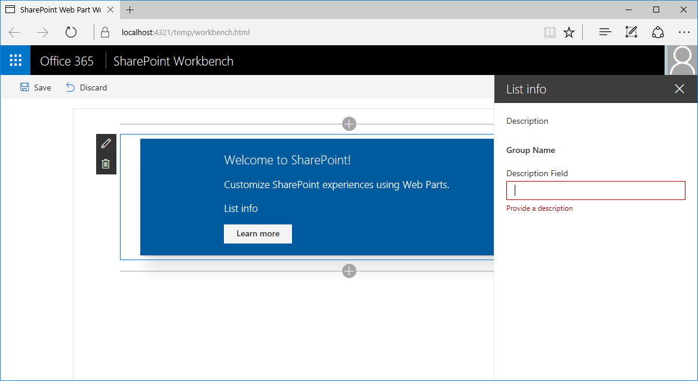
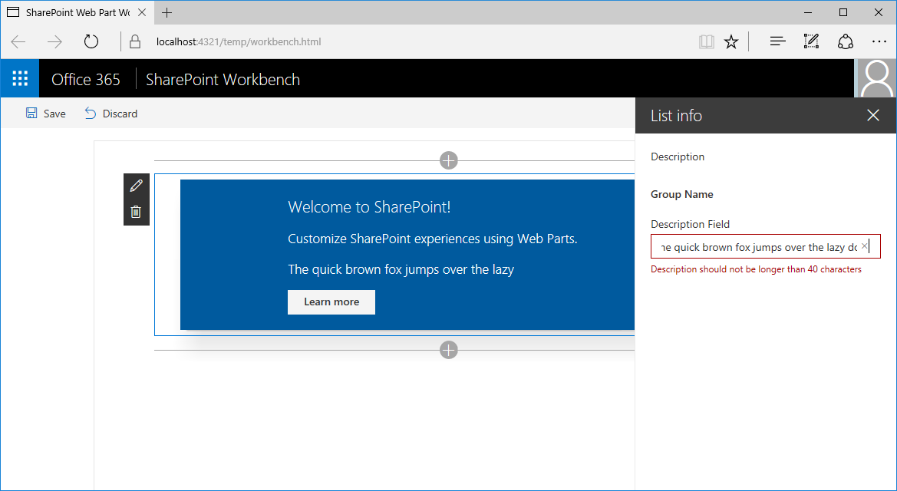

# <a name="validate-web-part-property-values"></a><span data-ttu-id="b546c-103">Проверка значений свойств веб-части</span><span class="sxs-lookup"><span data-stu-id="b546c-103">Validate web part property values</span></span>

<span data-ttu-id="b546c-104">Пользователи могут настраивать клиентские веб-части SharePoint Framework в соответствии со своими потребностями с помощью свойств.</span><span class="sxs-lookup"><span data-stu-id="b546c-104">When working with SharePoint Framework client-side web parts, users can configure them to meet their needs by using their properties.</span></span> <span data-ttu-id="b546c-105">Проверяйте указанные значения конфигурации, чтобы пользователям было проще настроить веб-часть и удобнее с ней работать.</span><span class="sxs-lookup"><span data-stu-id="b546c-105">When working with web parts, users can configure them to meet their needs using their properties. By validating the provided configuration values you can make it easier for users to configure the web part and improve the overall user experience of working with your web part. In this article you will learn how to validate web part property values in SharePoint Framework client-side web parts.</span></span> 

> [!NOTE] 
> <span data-ttu-id="b546c-106">Прежде чем выполнять действия, описанные в этой статье, [настройте среду разработки](../../set-up-your-development-environment.md) для создания решений на платформе SharePoint Framework.</span><span class="sxs-lookup"><span data-stu-id="b546c-106">Before following the steps in this article, be sure to [set up your development environment](../../set-up-your-development-environment.md) for building SharePoint Framework solutions.</span></span>

## <a name="create-a-new-web-part-project"></a><span data-ttu-id="b546c-107">Создание проекта веб-части</span><span class="sxs-lookup"><span data-stu-id="b546c-107">Create a new web part project</span></span>

1. <span data-ttu-id="b546c-108">Для начала создайте папку проекта.</span><span class="sxs-lookup"><span data-stu-id="b546c-108">Start by creating a new folder for your project.</span></span>

  ```sh
  md react-listinfo
  ```

2. <span data-ttu-id="b546c-109">Перейдите в папку проекта.</span><span class="sxs-lookup"><span data-stu-id="b546c-109">Go to the project folder.</span></span>

  ```sh
  cd react-listinfo
  ```

3. <span data-ttu-id="b546c-110">В папке проекта запустите генератор Yeoman для SharePoint Framework, чтобы сформировать шаблон проекта на платформе SharePoint Framework.</span><span class="sxs-lookup"><span data-stu-id="b546c-110">In the project folder run the SharePoint Framework Yeoman generator to scaffold a new SharePoint Framework project.</span></span>

  ```sh
  yo @microsoft/sharepoint
  ```

4. <span data-ttu-id="b546c-111">Когда отобразится соответствующий запрос, введите следующие значения:</span><span class="sxs-lookup"><span data-stu-id="b546c-111">When prompted, enter the following values:</span></span>

  - <span data-ttu-id="b546c-112">имя решения — **react-listinfo**;</span><span class="sxs-lookup"><span data-stu-id="b546c-112">**react-listinfo** as your solution name</span></span>
  - <span data-ttu-id="b546c-113">расположение файлов — **Use the current folder** (Использовать текущую папку);</span><span class="sxs-lookup"><span data-stu-id="b546c-113">**Use the current folder** for the location to place the files</span></span>
  - <span data-ttu-id="b546c-114">отправную точку создания веб-части — **React**;</span><span class="sxs-lookup"><span data-stu-id="b546c-114">**React** as the starting point to build the web part</span></span>
  - <span data-ttu-id="b546c-115">имя веб-части — **List info** (Сведения списка);</span><span class="sxs-lookup"><span data-stu-id="b546c-115">**List info** as your web part name</span></span>
  - <span data-ttu-id="b546c-116">описание веб-части — **Shows information about the selected list** (Показывает сведения о выбранном списке).</span><span class="sxs-lookup"><span data-stu-id="b546c-116">**Shows information about the selected list** as your web part description</span></span>

  

5. <span data-ttu-id="b546c-118">По завершении формирования шаблона заблокируйте версию зависимостей проекта, выполнив следующую команду:</span><span class="sxs-lookup"><span data-stu-id="b546c-118">After the scaffolding completes, lock down the version of the project dependencies by running the following command:</span></span>

  ```sh
  npm shrinkwrap
  ```

6. <span data-ttu-id="b546c-119">Откройте папку проекта в редакторе кода.</span><span class="sxs-lookup"><span data-stu-id="b546c-119">Next, open your project folder in your code editor.</span></span> <span data-ttu-id="b546c-120">В инструкциях и на снимках экрана из этой статьи используется Visual Studio Code, но вы можете использовать любой другой редактор.</span><span class="sxs-lookup"><span data-stu-id="b546c-120">This article uses Visual Studio Code in the steps and screenshots, but you can use any editor that you prefer.</span></span>

  

<br/>

## <a name="options-for-validating-web-part-properties"></a><span data-ttu-id="b546c-122">Способы проверки свойств веб-части</span><span class="sxs-lookup"><span data-stu-id="b546c-122">Options for validating web part properties</span></span>

<span data-ttu-id="b546c-123">Разработчики могут проверять значения свойств веб-части двумя способами.</span><span class="sxs-lookup"><span data-stu-id="b546c-123">SharePoint Framework offers developers two ways to validate values of web part properties.</span></span> <span data-ttu-id="b546c-124">Значение можно проверить непосредственно в коде веб-части или с помощью внешнего API.</span><span class="sxs-lookup"><span data-stu-id="b546c-124">You can validate the value directly, inside a web part's code, or you can call an external API to perform the validation there.</span></span> 

<span data-ttu-id="b546c-125">Первый способ удобен, если требуется проверить простые значения (например, минимальную или максимальную длину либо обязательные свойства) или распознавать простые шаблоны, например почтовые индексы.</span><span class="sxs-lookup"><span data-stu-id="b546c-125">Validating values inline is useful for performing simple validations such as minimal/maximum length, required properties, or simple pattern recognition, like a zip code.</span></span> <span data-ttu-id="b546c-126">Для проверок, основанных на бизнес-логике, например проверки номера социального страхования или членства в группе безопасности, лучше вызывать внешние API.</span><span class="sxs-lookup"><span data-stu-id="b546c-126">Whenever the validation is based on business logic, such as checking a social security number or a security group membership, calling external APIs is a better approach.</span></span>

<span data-ttu-id="b546c-127">Чтобы проверить значение свойства веб-части, необходимо реализовать обработчик события **onGetErrorMessage** для этого свойства.</span><span class="sxs-lookup"><span data-stu-id="b546c-127">To validate the value of a web part property, you have to implement the event handler for the **onGetErrorMessage** event of that particular property.</span></span> <span data-ttu-id="b546c-128">При проверке в коде обработчик событий возвращает строку с ошибкой проверки или пустую строку, если указанное значение допустимо.</span><span class="sxs-lookup"><span data-stu-id="b546c-128">For inline validation, the event handler should return a string with the validation error or an empty string if the provided value is valid.</span></span> 

<span data-ttu-id="b546c-129">При проверке с помощью удаленных API обработчик событий возвращает обещание строки.</span><span class="sxs-lookup"><span data-stu-id="b546c-129">For validation using remote APIs, the event handler returns a promise of string.</span></span> <span data-ttu-id="b546c-130">Если указанное значение недопустимо, обещание превращается в сообщение об ошибке.</span><span class="sxs-lookup"><span data-stu-id="b546c-130">If the provided value is invalid, the promise resolves with the error message.</span></span> <span data-ttu-id="b546c-131">Если указанное значение допустимо, обещание разрешается в пустую строку.</span><span class="sxs-lookup"><span data-stu-id="b546c-131">If the provided value is valid, the promise resolves with an empty string.</span></span>

## <a name="validate-web-part-property-values-inline"></a><span data-ttu-id="b546c-132">Проверка значений свойств веб-части в коде</span><span class="sxs-lookup"><span data-stu-id="b546c-132">Validate web part property values inline</span></span>

<span data-ttu-id="b546c-133">На этом шаге мы проверим, указано ли свойство веб-части Description и не содержит ли оно более 40 символов.</span><span class="sxs-lookup"><span data-stu-id="b546c-133">In this step you will verify that the description web part property is specified and its value is not longer than 40 characters. You will do this using the inline validation process.</span></span> <span data-ttu-id="b546c-134">Эта проверка выполняется непосредственно в коде.</span><span class="sxs-lookup"><span data-stu-id="b546c-134">You do this by using the inline validation process.</span></span>

1. <span data-ttu-id="b546c-135">В редакторе кода откройте файл **./src/webparts/listInfo/ListInfoWebPart.ts**.</span><span class="sxs-lookup"><span data-stu-id="b546c-135">In the code editor open the **./src/webparts/listInfo/ListInfoWebPart.ts** file and add the following references:</span></span> <span data-ttu-id="b546c-136">В классе **ListInfoWebPart** добавьте метод **validateDescription** со следующим кодом:</span><span class="sxs-lookup"><span data-stu-id="b546c-136">In the code editor open the **./src/webparts/listInfo/ListInfoWebPart.ts file. In the ListInfoWebPart** class, add the **validateDescription** method with the following code:</span></span>

  ```ts
  export default class ListInfoWebPart extends BaseClientSideWebPart<IListInfoWebPartProps> {
    // ...

    private validateDescription(value: string): string {
      if (value === null ||
        value.trim().length === 0) {
        return 'Provide a description';
      }

      if (value.length > 40) {
        return 'Description should not be longer than 40 characters';
      }

      return '';
    }
  }
  ```

  <span data-ttu-id="b546c-137">Метод **validateDescription** проверяет, указано ли описание и не содержит ли оно более 40 символов.</span><span class="sxs-lookup"><span data-stu-id="b546c-137">The **validateDescription** method checks if the description is provided, and if it isn't longer than 40 characters.</span></span> <span data-ttu-id="b546c-138">Если указанное описание недопустимо, метод возвращает сообщение об ошибке проверки.</span><span class="sxs-lookup"><span data-stu-id="b546c-138">If the provided description is invalid, the method returns an error message corresponding to the validation error.</span></span> <span data-ttu-id="b546c-139">Если же указанное значение допустимо, возвращается пустая строка.</span><span class="sxs-lookup"><span data-stu-id="b546c-139">If the provided value is correct, it returns an empty string.</span></span>

2. <span data-ttu-id="b546c-140">Свяжите метод **validateDescription** со свойством **Description** веб-части.</span><span class="sxs-lookup"><span data-stu-id="b546c-140">Associate the **validateDescription** method with the **description** web part property.</span></span> <span data-ttu-id="b546c-141">В классе **ListInfoWebPart** замените код метода **getPropertyPaneConfiguration** следующим кодом:</span><span class="sxs-lookup"><span data-stu-id="b546c-141">Next, you have to associate the validateDescription method with the description web part property. In the **ListInfoWebPart** class change the implementation of the **getPropertyPaneConfiguration** method to:</span></span>

  ```ts
  export default class ListInfoWebPart extends BaseClientSideWebPart<IListInfoWebPartProps> {
    // ...

    protected getPropertyPaneConfiguration(): IPropertyPaneConfiguration {
      return {
        pages: [
          {
            header: {
              description: strings.PropertyPaneDescription
            },
            groups: [
              {
                groupName: strings.BasicGroupName,
                groupFields: [
                  PropertyPaneTextField('description', {
                    label: strings.DescriptionFieldLabel,
                    onGetErrorMessage: this.validateDescription.bind(this)
                  })
                ]
              }
            ]
          }
        ]
      };
    }

    // ...
  }
  ```

  <span data-ttu-id="b546c-142">Мы расширили определение свойства **Description** веб-части, определив метод **validateDescription** как обработчик события **onGetErrorMessage**.</span><span class="sxs-lookup"><span data-stu-id="b546c-142">You have extended the definition of the **description** web part with defining the **validateDescription** method as the event handler for the **onGetErrorMessage** event.</span></span>

3. <span data-ttu-id="b546c-143">Чтобы просмотреть результат проверки, выполните следующую команду:</span><span class="sxs-lookup"><span data-stu-id="b546c-143">Run the following command to see the result of the validation:</span></span>

  ```sh
  gulp serve
  ```

4. <span data-ttu-id="b546c-144">В рабочей области добавьте веб-часть на холст и откройте ее свойства.</span><span class="sxs-lookup"><span data-stu-id="b546c-144">In the SharePoint workbench add the web part to the page and open its configuration.</span></span> <span data-ttu-id="b546c-145">Если удалить описание, вы увидите первую ошибку проверки.</span><span class="sxs-lookup"><span data-stu-id="b546c-145">In the workbench, add the web part to canvas and open its properties. If you remove the description you should see the first validation error.</span></span>

  

5. <span data-ttu-id="b546c-147">Укажите значение длиной более 40 символов.</span><span class="sxs-lookup"><span data-stu-id="b546c-147">Provide a value that's longer than 40 characters.</span></span> <span data-ttu-id="b546c-148">Под текстовым полем появится еще одна ошибка проверки.</span><span class="sxs-lookup"><span data-stu-id="b546c-148">Next, try providing a value that's longer than 40 characters. You should see another validation error displayed below the text field.</span></span>

  

6. <span data-ttu-id="b546c-150">Обратите внимание, что если указанное значение недопустимо, в веб-части отображается последнее допустимое значение.</span><span class="sxs-lookup"><span data-stu-id="b546c-150">Notice that when providing an invalid value, the web part is rendered showing the last valid value.</span></span> <span data-ttu-id="b546c-151">Кроме того, если в режиме нереактивной области свойств указано недопустимое свойство веб-части, кнопка **Применить** отключается, чтобы пользователь не мог применить недействительную конфигурацию.</span><span class="sxs-lookup"><span data-stu-id="b546c-151">Notice, that when providing an invalid value, the web part is rendered showing the last valid value. Additionally, in the non-reactive property pane mode, if one of the web part properties is invalid, the **Apply** button is disabled, preventing the user from applying the invalid configuration.</span></span>

  

## <a name="validate-web-part-property-values-using-remote-apis"></a><span data-ttu-id="b546c-153">Проверка значений свойств веб-части с помощью удаленных API</span><span class="sxs-lookup"><span data-stu-id="b546c-153">Validate web part property values using remote APIs</span></span>

<span data-ttu-id="b546c-154">В некоторых случаях проверка значений свойств веб-части может быть сложнее и требовать определенной бизнес-логики.</span><span class="sxs-lookup"><span data-stu-id="b546c-154">In some scenarios, validating web part property values can be more complex and may require specific business logic.</span></span> <span data-ttu-id="b546c-155">В таких случаях будет эффективнее проверить значение с помощью существующих API, а не реализовывать и поддерживать бизнес-логику в веб-части.</span><span class="sxs-lookup"><span data-stu-id="b546c-155">In some scenarios, validating web part property values can be more complex and require specific business logic. In such cases it might be more efficient for you to validate the value using an existing API rather than implementing and maintaining the business logic in the web part.</span></span>

<span data-ttu-id="b546c-156">На этом шаге вы реализуете логику, которая проверяет, существует ли на текущем сайте SharePoint список с именем, указанным в свойствах веб-части.</span><span class="sxs-lookup"><span data-stu-id="b546c-156">In this step you will implement validation logic that checks if the list with the name specified in the web part properties exists in the current SharePoint site.</span></span>

### <a name="add-the-listname-web-part-property"></a><span data-ttu-id="b546c-157">Добавление свойства веб-части listName</span><span class="sxs-lookup"><span data-stu-id="b546c-157">Add the listName web part property</span></span>

1. <span data-ttu-id="b546c-158">В редакторе кода откройте файл **./src/webparts/listInfo/ListInfoWebPart.manifest.json**.</span><span class="sxs-lookup"><span data-stu-id="b546c-158">In the code editor, open the **./src/webparts/listInfo/ListInfoWebPart.manifest.json** file.</span></span> <span data-ttu-id="b546c-159">В свойстве **properties** добавьте свойство **listName**. В качестве значения по умолчанию укажите пустую строку:</span><span class="sxs-lookup"><span data-stu-id="b546c-159">In the code editor open the **./src/webparts/listInfo/ListInfoWebPart.manifest.json file. In the properties** property add a new property named **listName** with the default value set to an empty string:</span></span>

  ```json
  {
    "$schema": "https://dev.office.com/json-schemas/spfx/client-side-web-part-manifest.schema.json",
    "id": "1ec8f92d-ea55-4584-bf50-bac435c916bf",
    "alias": "ListInfoWebPart",
    "componentType": "WebPart",

    // The "*" signifies that the version should be taken from the package.json
    "version": "*",
    "manifestVersion": 2,

    // If true, the component can only be installed on sites where Custom Script is allowed.
    // Components that allow authors to embed arbitrary script code should set this to true.
    // https://support.office.com/en-us/article/Turn-scripting-capabilities-on-or-off-1f2c515f-5d7e-448a-9fd7-835da935584f
    "requiresCustomScript": false,

    "preconfiguredEntries": [{
      "groupId": "1ec8f92d-ea55-4584-bf50-bac435c916bf",
      "group": { "default": "Under Development" },
      "title": { "default": "List info" },
      "description": { "default": "Shows information about the selected list" },
      "officeFabricIconFontName": "Page",
      "properties": {
        "description": "List info"
      }
    }]
  }
  ```

2. <span data-ttu-id="b546c-160">В редакторе кода откройте файл **./src/webparts/listInfo/IListInfoWebPartProps.ts** и расширьте определение интерфейса, добавив свойство **listName** строкового типа.</span><span class="sxs-lookup"><span data-stu-id="b546c-160">Next, in the code editor open the **./src/webparts/listInfo/IListInfoWebPartProps.ts** file and extend the interface definition with the **listName** property of type string.</span></span>

  ```ts
  export interface IListInfoWebPartProps {
    description: string;
    listName: string;
  }
```

3. <span data-ttu-id="b546c-161">Чтобы завершить добавление нового свойства веб-части, откройте файл **./src/webparts/listInfo/ListInfoWebPart.ts** в редакторе кода и замените код метода **getPropertyPaneConfiguration** следующим кодом:</span><span class="sxs-lookup"><span data-stu-id="b546c-161">Finish adding the new web part property, by opening in the code editor the **./src/webparts/listInfo/ListInfoWebPart.ts** file and changing the implementation of the **getPropertyPaneConfiguration** method to:</span></span>

  ```ts
  export default class ListInfoWebPart extends BaseClientSideWebPart<IListInfoWebPartProps> {
    // ...

    protected getPropertyPaneConfiguration(): IPropertyPaneConfiguration {
      return {
        pages: [
          {
            header: {
              description: strings.PropertyPaneDescription
            },
            groups: [
              {
                groupName: strings.BasicGroupName,
                groupFields: [
                  PropertyPaneTextField('description', {
                    label: strings.DescriptionFieldLabel,
                    onGetErrorMessage: this.validateDescription.bind(this)
                  }),
                  PropertyPaneTextField('listName', {
                    label: strings.ListNameFieldLabel
                  })
                ]
              }
            ]
          }
        ]
      };
    }

    // ...
  }
  ```

4. <span data-ttu-id="b546c-162">Добавьте недостающую строку ресурса **ListNameFieldLabel**. Для этого измените код в файле **./src/webparts/listInfo/loc/mystrings.d.ts** на следующий:</span><span class="sxs-lookup"><span data-stu-id="b546c-162">Add the missing **ListNameFieldLabel** resource string by changing the code of the **./src/webparts/listInfo/loc/mystrings.d.ts** file to:</span></span>

  ```ts
  declare interface IListInfoStrings {
    PropertyPaneDescription: string;
    BasicGroupName: string;
    DescriptionFieldLabel: string;
    ListNameFieldLabel: string;
  }

  declare module 'listInfoStrings' {
    const strings: IListInfoStrings;
    export = strings;
  }
  ```

5. <span data-ttu-id="b546c-163">Замените код в файле **./src/webparts/listInfo/loc/en-us.js** следующим кодом:</span><span class="sxs-lookup"><span data-stu-id="b546c-163">and the code of the **./src/webparts/listInfo/loc/en-us.js** to:</span></span>

  ```js
  define([], function() {
    return {
      "PropertyPaneDescription": "Description",
      "BasicGroupName": "Group Name",
      "DescriptionFieldLabel": "Description Field",
      "ListNameFieldLabel": "List name"
    }
  });
  ```

6. <span data-ttu-id="b546c-164">Выполните следующую команду, чтобы проверить, что проект запущен, а добавленное свойство имени списка отображается в области свойств веб-части:</span><span class="sxs-lookup"><span data-stu-id="b546c-164">Run the following command to verify that the project is running and that the newly added list name property is displayed in the web part property pane:</span></span>

  ```sh
  gulp serve
  ```

  <br/>

  

### <a name="validate-the-name-of-the-list-by-using-the-sharepoint-rest-api"></a><span data-ttu-id="b546c-166">Проверка имени списка с помощью REST API SharePoint</span><span class="sxs-lookup"><span data-stu-id="b546c-166">Validate the name of the list using the SharePoint REST API</span></span>

<span data-ttu-id="b546c-167">На этом шаге мы проверим указанное имя списка и узнаем, соответствует ли оно существующему списку на текущем сайте SharePoint.</span><span class="sxs-lookup"><span data-stu-id="b546c-167">In this step you will validate the provided list name and check if it corresponds to an existing list in the current SharePoint site.</span></span>

1. <span data-ttu-id="b546c-168">В редакторе кода откройте файл **./src/webparts/listInfo/ListInfoWebPart.ts** и добавьте следующие ссылки:</span><span class="sxs-lookup"><span data-stu-id="b546c-168">In the code editor open the **./src/webparts/listInfo/ListInfoWebPart.ts** file and add the following references:</span></span>

  ```ts
  import { SPHttpClient, SPHttpClientResponse } from '@microsoft/sp-http';
  import { escape } from '@microsoft/sp-lodash-subset';
  ```

2. <span data-ttu-id="b546c-169">В классе **ListInfoWebPart** добавьте метод **validateListName** со следующим кодом:</span><span class="sxs-lookup"><span data-stu-id="b546c-169">Next, to the **ListInfoWebPart** class add the **validateListName** method with the following code:</span></span>

  ```ts
  export default class ListInfoWebPart extends BaseClientSideWebPart<IListInfoWebPartProps> {
    // ...

    private validateListName(value: string): Promise<string> {
      return new Promise<string>((resolve: (validationErrorMessage: string) => void, reject: (error: any) => void): void => {
        if (value === null ||
          value.length === 0) {
          resolve('Provide the list name');
          return;
        }

        this.context.spHttpClient.get(this.context.pageContext.web.absoluteUrl + `/_api/web/lists/getByTitle('${escape(value)}')?$select=Id`, SPHttpClient.configurations.v1)
          .then((response: SPHttpClientResponse): void => {
            if (response.ok) {
              resolve('');
              return;
            }
            else if (response.status === 404) {
              resolve(`List '${escape(value)}' doesn't exist in the current site`);
              return;
            }
            else {
              resolve(`Error: ${response.statusText}. Please try again`);
              return;
            }
          })
          .catch((error: any): void => {
            resolve(error);
          });
      });
    }
  }
  ```

  <span data-ttu-id="b546c-p116">Сначала метод **validateListName** проверит, было ли указано имя списка. Если нет, обещание превращается в соответствующую ошибку проверки. Если пользователь указал имя списка, метод **validateListName** использует класс **SPHttpClient** для вызова REST API SharePoint и проверит, существует ли список с указанным именем.</span><span class="sxs-lookup"><span data-stu-id="b546c-p116">First, the **validateListName** method checks if a list name has been provided. If not, it resolves the promise with a relevant validation error. If the user has provided a list name, the **validateListName** method uses the **SPHttpClient** to call the SharePoint REST API and check if the list with the specified name exists.</span></span>

  <span data-ttu-id="b546c-173">Если на текущем сайте существует список с указанным именем, возвращается код состояния 200 OK, а метод **validateListName** возвращает обещание с пустой строкой, подтверждая, что соответствующий заданному значению список существует.</span><span class="sxs-lookup"><span data-stu-id="b546c-173">If the list with the specified name exists on the current site, the response returns a 200 OK status code, and the **validateListName** method resolves the promise with an empty string, confirming that the provided value represents a valid list.</span></span> 
  
  <span data-ttu-id="b546c-174">Если список с указанным именем не существует, возвращается другой код.</span><span class="sxs-lookup"><span data-stu-id="b546c-174">If the list with the specified name doesn't exist, the response returns a different code.</span></span> <span data-ttu-id="b546c-175">Обычно это ответ 404 Not Found, но если запрос не был выполнен по другой причине, может быть возвращен другой код состояния.</span><span class="sxs-lookup"><span data-stu-id="b546c-175">Typically, it is a 404 Not Found response, but if the request failed in some other way, a different status code can be returned.</span></span> <span data-ttu-id="b546c-176">В обоих случаях метод **validateListName** покажет пользователю соответствующее сообщение об ошибке.</span><span class="sxs-lookup"><span data-stu-id="b546c-176">In both cases, the **validateListName** method displays a relevant error message to the user.</span></span>

  <span data-ttu-id="b546c-177">После определения метода проверки имени списка необходимо настроить его как обработчик проверки для свойства веб-части **listName**.</span><span class="sxs-lookup"><span data-stu-id="b546c-177">With the list name validation method defined, the next step is to configure it as the validation handler for the **listName** web part property. In the ListInfoWebPart class replace the code of the getPropertyPaneConfiguration method with:</span></span> 
  
3. <span data-ttu-id="b546c-178">В классе **ListInfoWebPart** замените код метода **getPropertyPaneConfiguration** на следующий:</span><span class="sxs-lookup"><span data-stu-id="b546c-178">In the **ListInfoWebPart** class, replace the code of the **getPropertyPaneConfiguration** method with:</span></span>

  ```ts
  export default class ListInfoWebPart extends BaseClientSideWebPart<IListInfoWebPartProps> {
    // ...

    protected getPropertyPaneConfiguration(): IPropertyPaneConfiguration {
      return {
        pages: [
          {
            header: {
              description: strings.PropertyPaneDescription
            },
            groups: [
              {
                groupName: strings.BasicGroupName,
                groupFields: [
                  PropertyPaneTextField('description', {
                    label: strings.DescriptionFieldLabel,
                    onGetErrorMessage: this.validateDescription.bind(this)
                  }),
                  PropertyPaneTextField('listName', {
                    label: strings.ListNameFieldLabel,
                    onGetErrorMessage: this.validateListName.bind(this)
                  })
                ]
              }
            ]
          }
        ]
      };
    }

    // ...
  }
  ```

4. <span data-ttu-id="b546c-179">Чтобы просмотреть результат проверки, выполните следующую команду:</span><span class="sxs-lookup"><span data-stu-id="b546c-179">Run the following command to see the result of the validation:</span></span>

  ```sh
  gulp serve --nobrowser
  ```

  <span data-ttu-id="b546c-180">Так как метод проверки имени списка взаимодействует с REST API SharePoint, необходимо проверить веб-часть в размещенной версии рабочей области SharePoint.</span><span class="sxs-lookup"><span data-stu-id="b546c-180">Because the list name validation method communicates with the SharePoint REST API, you have to test the web part in the hosted version of the SharePoint workbench.</span></span>

5. <span data-ttu-id="b546c-181">Добавьте веб-часть на холст и откройте ее свойства.</span><span class="sxs-lookup"><span data-stu-id="b546c-181">Add the web part to the canvas and open its properties.</span></span> <span data-ttu-id="b546c-182">Так как мы не указали значение имени списка по умолчанию (обязательное свойство), возникнет ошибка проверки.</span><span class="sxs-lookup"><span data-stu-id="b546c-182">Add the web part to the canvas and open its properties. Because you haven't specified a default value for the list name, which is a required property, you will see a validation error.</span></span>

  

  <br/>

  <span data-ttu-id="b546c-184">Если указать имя несуществующего списка, в веб-части появится сообщение о том, что такой список не существует на текущем сайте.</span><span class="sxs-lookup"><span data-stu-id="b546c-184">If you provide a name of a list that doesn't exist, the web part will display a validation error stating that the list you specified doesn't exist in the current site.</span></span>

  

  <br/>

  <span data-ttu-id="b546c-186">Если указать имя существующего списка, ошибка проверки исчезнет.</span><span class="sxs-lookup"><span data-stu-id="b546c-186">If you specify a name of an existing list, the validation error will disappear.</span></span>

  

### <a name="optimize-validation-using-remote-apis"></a><span data-ttu-id="b546c-188">Оптимизация проверки с помощью удаленных API</span><span class="sxs-lookup"><span data-stu-id="b546c-188">Optimize validation using remote APIs</span></span>

<span data-ttu-id="b546c-189">При проверке свойств веб-части с помощью удаленных API SharePoint Framework отслеживает изменения элементов управления области свойств и отправляет обновленные значения для проверки в указанный обработчик проверки.</span><span class="sxs-lookup"><span data-stu-id="b546c-189">When validating web part properties using remote APIs, SharePoint Framework monitors changes in the property pane controls and sends updated values for validation to the specified validation handler.</span></span> <span data-ttu-id="b546c-190">По умолчанию время ожидания перед запуском проверки составляет 200 мс.</span><span class="sxs-lookup"><span data-stu-id="b546c-190">By default, the SharePoint Framework waits 200 ms before triggering the validation process.</span></span> <span data-ttu-id="b546c-191">Если пользователь не менял определенное значение в течение 200 мс, SharePoint Framework начинает проверку.</span><span class="sxs-lookup"><span data-stu-id="b546c-191">If the user hasn't changed the particular value for 200 ms, the SharePoint Framework starts the validation process.</span></span> <span data-ttu-id="b546c-192">Если обработчик проверки использует удаленный API, то при каждом запуске проверки этот метод будет отправлять веб-запрос к API на проверку указанного значения.</span><span class="sxs-lookup"><span data-stu-id="b546c-192">When the validation handler uses a remote API, each time the validation process starts, that method issues a web request to the API to validate the specified value.</span></span> <span data-ttu-id="b546c-193">Если пользователь недостаточно быстро печатает, то на проверку будут отправляться частично введенные значения, создавая лишнюю нагрузку на сеть и API.</span><span class="sxs-lookup"><span data-stu-id="b546c-193">If users don't type fast enough, this results in partially completed values being sent over for validation, unnecessarily stressing the network and the API.</span></span> <span data-ttu-id="b546c-194">В таких случаях рекомендуем увеличить задержку перед проверкой.</span><span class="sxs-lookup"><span data-stu-id="b546c-194">In such cases, you should consider increasing the validation delay.</span></span>


<span data-ttu-id="b546c-196">Задержку перед проверкой можно настроить отдельно для каждого свойства в соответствии с типом значения, вводимого пользователем.</span><span class="sxs-lookup"><span data-stu-id="b546c-196">You can configure the validation delay for each property separately, depending on the type of value that users need to provide. Following steps illustrate how to increase the validation delay for the listName property.</span></span> 

#### <a name="to-increase-the-validation-delay-for-the-listname-property"></a><span data-ttu-id="b546c-197">Увеличение задержки перед проверкой для свойства listName</span><span class="sxs-lookup"><span data-stu-id="b546c-197">To increase the validation delay for the listName property</span></span>

1. <span data-ttu-id="b546c-p120">В редакторе кода откройте файл **./src/webparts/listInfo/ListInfoWebPart.ts**. Замените код метода **getPropertyPaneConfiguration** следующим кодом:</span><span class="sxs-lookup"><span data-stu-id="b546c-p120">In the code editor open the **./src/webparts/listInfo/ListInfoWebPart.ts** file. Change the code of the **getPropertyPaneConfiguration** method to:</span></span>

  ```ts
  export default class ListInfoWebPart extends BaseClientSideWebPart<IListInfoWebPartProps> {
    // ...

    protected getPropertyPaneConfiguration(): IPropertyPaneConfiguration {
      return {
        pages: [
          {
            header: {
              description: strings.PropertyPaneDescription
            },
            groups: [
              {
                groupName: strings.BasicGroupName,
                groupFields: [
                  PropertyPaneTextField('description', {
                    label: strings.DescriptionFieldLabel,
                    onGetErrorMessage: this.validateDescription.bind(this)
                  }),
                  PropertyPaneTextField('listName', {
                    label: strings.ListNameFieldLabel,
                    onGetErrorMessage: this.validateListName.bind(this),
                    deferredValidationTime: 500
                  })
                ]
              }
            ]
          }
        ]
      };
    }

    // ...
  }

  ```

2. <span data-ttu-id="b546c-200">Свойство **deferredValidationTime** задает задержку перед запуском проверки SharePoint Framework (в миллисекундах).</span><span class="sxs-lookup"><span data-stu-id="b546c-200">The **deferredValidationTime** property specifies the number of milliseconds that the SharePoint Framework will wait before starting the validation process.</span></span>

3. <span data-ttu-id="b546c-201">Выполните следующую команду, чтобы проверить установленную задержку:</span><span class="sxs-lookup"><span data-stu-id="b546c-201">Run the following command to see that the applied delay is working as expected:</span></span>

  ```sh
  gulp serve --nobrowser
  ```
